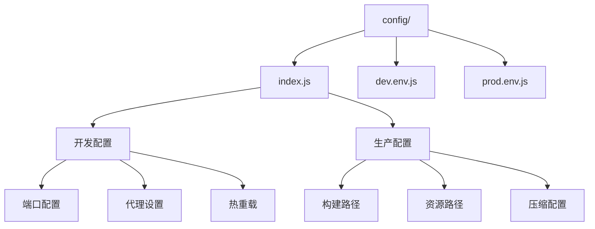
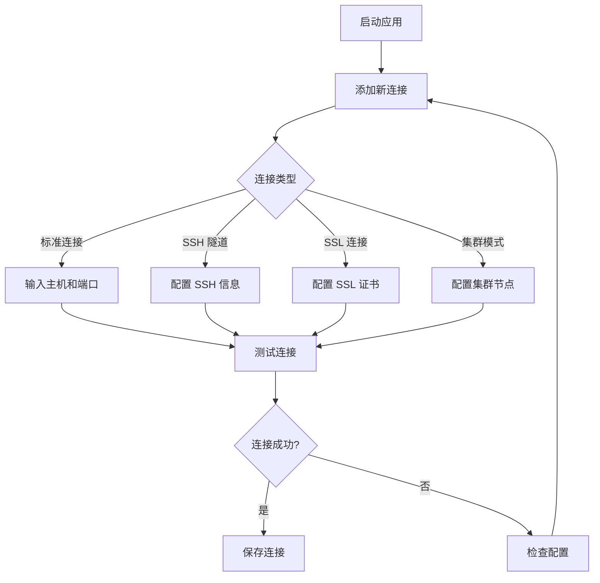
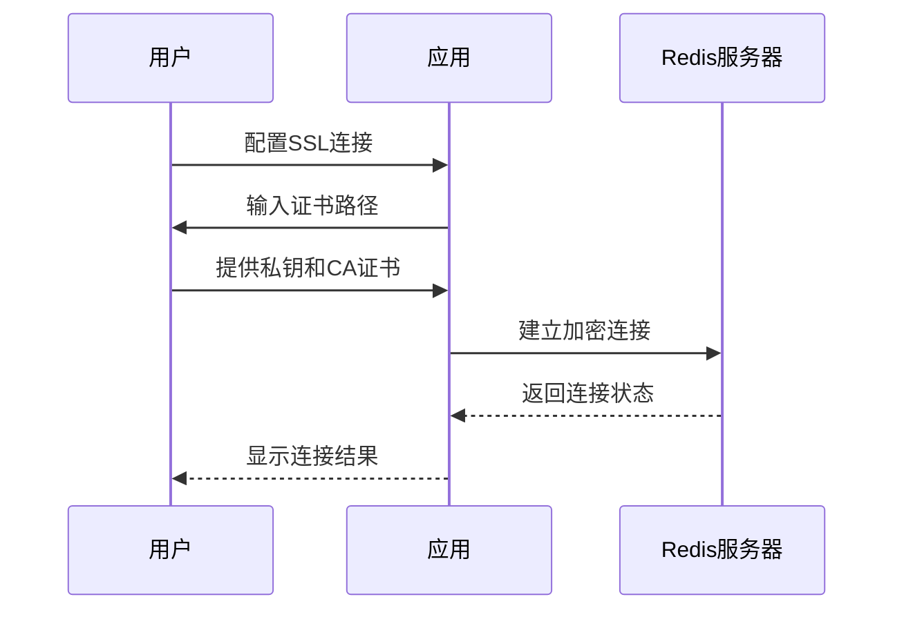
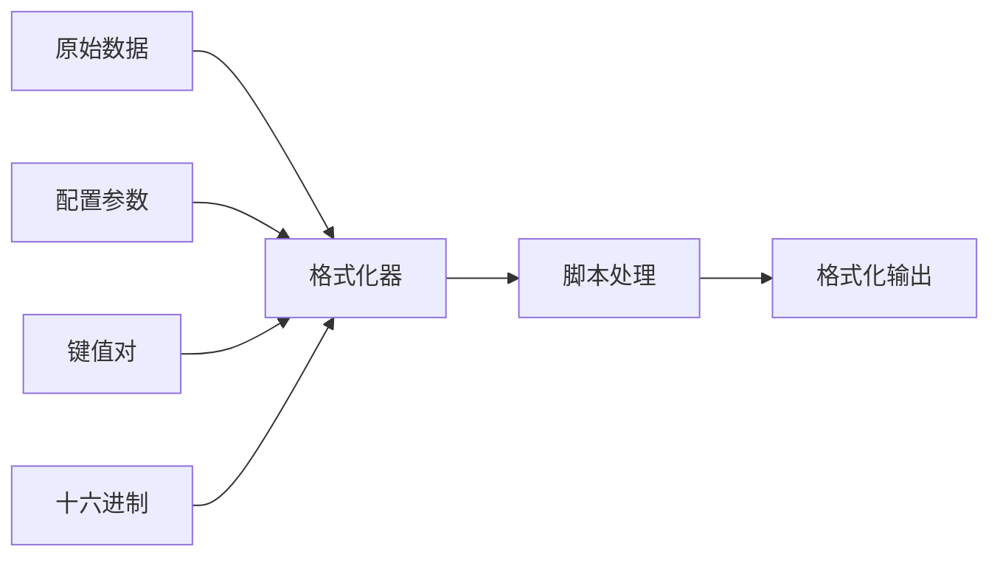
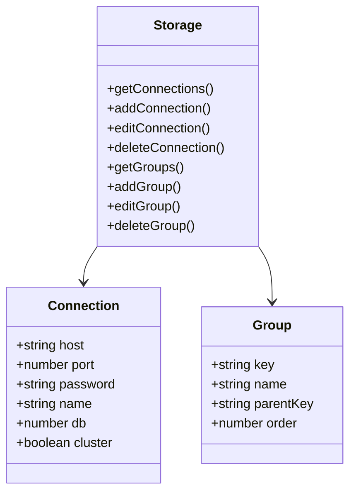
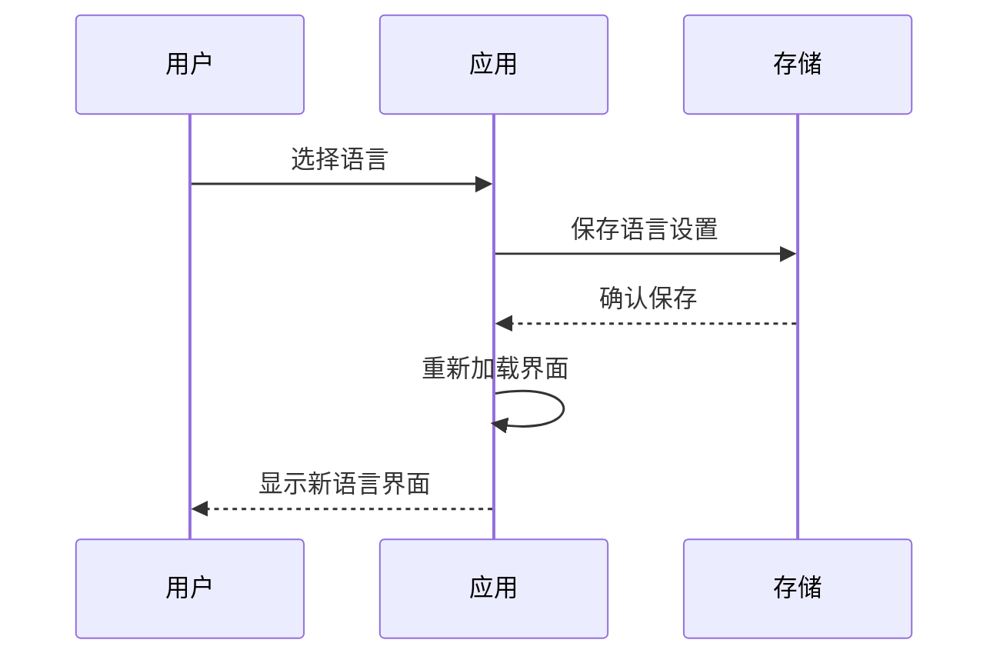

# 安装与配置指南

<cite>
**本文档引用的文件**
- [package.json](file://package.json)
- [config/index.js](file://config/index.js)
- [config/dev.env.js](file://config/dev.env.js)
- [config/prod.env.js](file://config/prod.env.js)
- [README.md](file://README.md)
- [README.zh-CN.md](file://README.zh-CN.md)
- [src/main.js](file://src/main.js)
- [src/storage.js](file://src/storage.js)
- [src/util.js](file://src/util.js)
- [src/App.vue](file://src/App.vue)
- [pack/electron/package.json](file://pack/electron/package.json)
- [build/webpack.base.conf.js](file://build/webpack.base.conf.js)
- [build/webpack.dev.conf.js](file://build/webpack.dev.conf.js)
</cite>

## 目录
1. [简介](#简介)
2. [系统要求](#系统要求)
3. [预编译版本安装](#预编译版本安装)
4. [源码构建安装](#源码构建安装)
5. [开发环境搭建](#开发环境搭建)
6. [配置文件详解](#配置文件详解)
7. [首次启动配置](#首次启动配置)
8. [常见配置场景](#常见配置场景)
9. [故障排除](#故障排除)
10. [高级配置选项](#高级配置选项)

## 简介

Another Redis Desktop Manager 是一个快速、稳定且功能强大的 Redis 桌面管理工具，支持 Windows、macOS 和 Linux 平台。本指南将帮助您完成从基础安装到高级配置的全过程。

## 系统要求

### 基础要求
- **Node.js**: 版本 ≥ 6.0.0
- **npm**: 版本 ≥ 3.0.0
- **操作系统**: Windows 7+, macOS 10.10+, Linux (Ubuntu 16.04+, CentOS 7+)

### 开发环境额外要求
- **Git**: 用于克隆源代码
- **Python**: 用于编译原生模块（某些平台）
- **C++ 编译器**: Windows 上需要 Visual Studio Build Tools 或 Windows SDK

## 预编译版本安装

### Windows 平台

#### 方法一：官方安装包
1. 访问 [GitHub Releases](https://github.com/qishibo/AnotherRedisDesktopManager/releases) 或 [Gitee Releases](https://gitee.com/qishibo/AnotherRedisDesktopManager/releases)
2. 下载最新版本的 `.exe` 安装包
3. 双击安装包，按照向导完成安装
4. 启动应用程序

#### 方法二：包管理器安装
```bash
# 使用 Chocolatey
choco install another-redis-desktop-manager

# 使用 Winget
winget install qishibo.AnotherRedisDesktopManager
```

#### 方法三：Microsoft Store
1. 打开 Microsoft Store 应用
2. 搜索 "Another Redis Desktop Manager"
3. 购买并安装（需付费）
4. 通过应用商店自动更新

### macOS 平台

#### 方法一：官方安装包
1. 访问 [GitHub Releases](https://github.com/qishibo/AnotherRedisDesktopManager/releases) 或 [Gitee Releases](https://gitee.com/qishibo/AnotherRedisDesktopManager/releases)
2. 下载 `.dmg` 安装包
3. 双击打开，拖拽到 Applications 文件夹
4. 如果遇到"不受信任"警告，执行：
   ```bash
   sudo xattr -rd com.apple.quarantine /Applications/Another\ Redis\ Desktop\ Manager.app
   ```
5. 启动应用程序

#### 方法二：Homebrew 安装
```bash
brew install --cask another-redis-desktop-manager
```

#### 方法三：App Store
1. 打开 Mac App Store
2. 搜索 "Another Redis Desktop Manager"
3. 购买并安装（需付费）
4. 通过 App Store 自动更新

### Linux 平台

#### 方法一：官方安装包
1. 访问 [GitHub Releases](https://github.com/qishibo/AnotherRedisDesktopManager/releases) 或 [Gitee Releases](https://gitee.com/qishibo/AnotherRedisDesktopManager/releases)
2. 下载 `.AppImage` 文件
3. 设置可执行权限：
   ```bash
   chmod +x Another\ Redis\ Desktop\ Manager.AppImage
   ```
4. 双击运行或通过终端启动：
   ```bash
   ./Another\ Redis\ Desktop\ Manager.AppImage
   ```

#### 方法二：Snap 包安装
```bash
sudo snap install another-redis-desktop-manager
```

**注意**: 如果选择私钥时提示权限不足，执行以下命令：
```bash
sudo snap connect another-redis-desktop-manager:ssh-keys
```

#### 方法三：包管理器安装
```bash
# Ubuntu/Debian
sudo apt update
sudo apt install another-redis-desktop-manager

# CentOS/RHEL/Fedora
sudo yum install another-redis-desktop-manager

# Arch Linux
sudo pacman -S another-redis-desktop-manager
```

## 源码构建安装

### 克隆源代码
```bash
git clone https://github.com/qishibo/AnotherRedisDesktopManager.git --depth=1
cd AnotherRedisDesktopManager
```

### 安装依赖

#### Windows 平台
```bash
# 安装依赖（32位或64位都使用 win32 平台）
npm install --platform=win32

# 如果下载 Electron 失败，使用国内镜像
npm config set ELECTRON_MIRROR https://npmmirror.com/mirrors/electron/
npm install --platform=win32
```

#### Linux/macOS 平台
```bash
# 安装依赖
npm install

# 如果遇到字体配置错误（Linux）
sudo apt install libfontconfig1-dev

# 或者对于其他发行版
# sudo yum install fontconfig-devel
# sudo pacman -S fontconfig
```

### 开发服务器启动

#### 启动开发服务器
```bash
npm start
```

这将在 `localhost:9988` 启动开发服务器，支持热重载。

#### 构建桌面客户端
在另一个终端窗口中：
```bash
npm run electron
```

### 生产环境构建

#### 准备构建
```bash
npm run pack:prepare
```

#### 平台特定构建
```bash
# Windows 64位
npm run pack:win

# Windows 32位
npm run pack:win32

# macOS
npm run pack:mac

# Linux AppImage
npm run pack:linux

# Linux DEB 包
npm run pack:linux:deb

# Linux RPM 包
npm run pack:linux:rpm
```

**节来源**
- [package.json](file://package.json#L7-L33)
- [README.md](file://README.md#L125-L198)
- [README.zh-CN.md](file://README.zh-CN.md#L119-L195)

## 开发环境搭建

### Node.js 环境配置

#### 版本检查
```bash
node --version
npm --version
```

#### 使用 nvm（推荐）
```bash
# 安装 nvm
curl -o- https://raw.githubusercontent.com/nvm-sh/nvm/v0.39.0/install.sh | bash

# 安装并使用 Node.js 16+
nvm install 16
nvm use 16
```

### Electron 开发环境

#### Electron 版本信息
项目使用 Electron 12.2.3，这是构建桌面应用的核心框架。

#### 开发工具链
- **Webpack**: 模块打包和开发服务器
- **Vue CLI**: Vue.js 开发工具
- **ESLint**: 代码质量检查
- **Babel**: JavaScript 转译

### IDE 推荐配置

#### VS Code 插件
- **Vetur**: Vue.js 开发支持
- **ESLint**: 代码质量检查
- **Prettier**: 代码格式化
- **Vue VS Code Extension Pack**

#### 开发服务器配置
开发服务器默认配置：
- **主机**: localhost
- **端口**: 9988（可被 `process.env.PORT` 覆盖）
- **热重载**: 启用
- **代理**: 可配置

**节来源**
- [package.json](file://package.json#L58-L118)
- [build/webpack.dev.conf.js](file://build/webpack.dev.conf.js#L16-L46)

## 配置文件详解

### 主配置文件结构

项目配置主要分为三个部分：



**图表来源**
- [config/index.js](file://config/index.js#L7-L71)
- [config/dev.env.js](file://config/dev.env.js#L5-L7)
- [config/prod.env.js](file://config/prod.env.js#L2-L4)

### config/index.js 配置详解

#### 开发环境配置 (dev)

| 配置项 | 默认值 | 说明 |
|--------|--------|------|
| host | 'localhost' | 开发服务器主机地址 |
| port | 9988 | 开发服务器端口 |
| autoOpenBrowser | false | 是否自动打开浏览器 |
| errorOverlay | true | 是否显示错误覆盖层 |
| notifyOnErrors | true | 错误时是否通知 |
| poll | false | 是否轮询文件变化 |

#### 生产环境配置 (build)

| 配置项 | 默认值 | 说明 |
|--------|--------|------|
| assetsRoot | '../dist' | 构建输出根目录 |
| assetsPublicPath | './' | 静态资源公共路径 |
| productionSourceMap | false | 是否生成源映射 |
| productionGzip | false | 是否启用 Gzip 压缩 |

### 环境变量配置

#### 开发环境变量
```javascript
// config/dev.env.js
module.exports = merge(prodEnv, {
  NODE_ENV: '"development"'
})
```

#### 生产环境变量
```javascript
// config/prod.env.js
module.exports = {
  NODE_ENV: '"production"'
}
```

### Electron 应用配置

#### 应用基本信息
- **应用名称**: Another Redis Desktop Manager
- **版本**: 1.8.0
- **主进程文件**: electron-main.js

#### 平台特定配置

| 平台 | 配置项 | 说明 |
|------|--------|------|
| Windows | NSIS 安装程序 | 支持 x64 和 ARM64 架构 |
| macOS | DMG 安装包 | 支持 x64 和 ARM64 架构 |
| Linux | AppImage/DEB/RPM | 支持 x64 和 ARM64 架构 |

**节来源**
- [config/index.js](file://config/index.js#L7-L71)
- [config/dev.env.js](file://config/dev.env.js#L5-L7)
- [config/prod.env.js](file://config/prod.env.js#L2-L4)
- [pack/electron/package.json](file://pack/electron/package.json#L1-L79)

## 首次启动配置

### 连接配置向导

#### 1. 添加 Redis 连接
首次启动后，您将看到连接管理界面：



#### 2. 基本连接参数

| 参数 | 说明 | 示例 |
|------|------|------|
| 名称 | 连接显示名称 | local-redis |
| 主机 | Redis 服务器地址 | 127.0.0.1 |
| 端口 | Redis 服务端口 | 6379 |
| 密码 | 认证密码 | your_password |
| 数据库 | 选择数据库编号 | 0 |

#### 3. 高级连接选项

| 选项 | 功能 | 适用场景 |
|------|------|----------|
| 用户名 | Redis 6.0+ ACL 用户名 | 企业环境 |
| 分隔符 | 键分隔符 | 多层级键管理 |
| 只读模式 | 只读连接 | 测试环境 |
| 保存连接 | 永久保存连接 | 常用连接 |

### 界面个性化设置

#### 主题配置
- **暗色主题**: 在设置中启用
- **语言切换**: 支持多语言界面
- **字体大小**: 可调整界面字体

#### 功能偏好设置
- **自动刷新**: 键值列表自动刷新
- **缓存策略**: 控制数据缓存行为
- **快捷键**: 自定义键盘快捷键

**节来源**
- [src/storage.js](file://src/storage.js#L182-L256)
- [src/App.vue](file://src/App.vue#L111-L200)

## 常见配置场景

### 代理配置

#### 开发环境代理设置
在 `config/index.js` 中配置代理表：

```javascript
proxyTable: {
  '/api': {
    target: 'http://localhost:3000',
    changeOrigin: true,
    pathRewrite: {
      '^/api': ''
    }
  }
}
```

#### 生产环境代理
生产环境通常不需要代理配置，但可以通过 CDN 加速静态资源。

### 内存限制配置

#### Electron 内存优化
```javascript
// 在 electron-main.js 中
app.commandLine.appendSwitch('max_old_space_size', '4096');
```

#### Webpack 内存配置
```javascript
// build/webpack.base.conf.js
node: {
  setImmediate: false,
  fs: 'empty',
  net: 'empty',
  tls: 'empty',
  child_process: 'empty'
}
```

### SSL/TLS 配置

#### 证书配置流程


#### SSL 参数配置

| 参数 | 说明 | 必填 |
|------|------|------|
| --ssl | 启用SSL模式 | 是 |
| --ssl-key | SSL私钥路径 | 否 |
| --ssl-ca | SSL证书机构 | 否 |
| --ssl-cert | SSL公钥路径 | 否 |

### SSH 隧道配置

#### SSH 连接参数

| 参数 | 说明 | 示例 |
|------|------|------|
| --ssh-host | SSH主机地址 | 192.168.1.100 |
| --ssh-port | SSH端口 | 22 |
| --ssh-username | SSH用户名 | admin |
| --ssh-password | SSH密码 | password |
| --ssh-private-key | 私钥路径 | ~/.ssh/id_rsa |
| --ssh-passphrase | 私钥密码 | key_passphrase |
| --ssh-timeout | SSH超时时间 | 30 |

### 集群模式配置

#### 集群连接步骤
1. **SSH 连接到内部网络**
2. **禁用集群模式**
3. **执行 `CLUSTER NODES` 命令**
4. **提取内部IP地址**
5. **重新启用集群模式并连接**

#### 集群参数配置
```bash
--cluster
--host internal.redis.ip.address
--port 6379
```

**节来源**
- [config/index.js](file://config/index.js#L13-L13)
- [build/webpack.base.conf.js](file://build/webpack.base.conf.js#L98-L109)
- [README.md](file://README.md#L288-L303)

## 故障排除

### 常见安装错误

#### 1. Electron 下载失败
**症状**: npm install 时 Electron 下载中断
**解决方案**:
```bash
# 设置国内镜像源
npm config set ELECTRON_MIRROR https://npmmirror.com/mirrors/electron/

# 或者使用环境变量
ELECTRON_MIRROR="https://npmmirror.com/mirrors/electron/" npm install
```

#### 2. 字体配置错误 (Linux)
**症状**: 编译时出现 `fontconfig/fontconfig.h: No such file or directory`
**解决方案**:
```bash
# Ubuntu/Debian
sudo apt install libfontconfig1-dev

# CentOS/RHEL
sudo yum install fontconfig-devel

# Arch Linux
sudo pacman -S fontconfig
```

#### 3. 权限问题
**症状**: 无法写入某些目录或文件
**解决方案**:
```bash
# 修改文件权限
chmod +x Another\ Redis\ Desktop\ Manager.AppImage

# Linux 权限修复
sudo chmod 755 /path/to/application
```

### 连接问题诊断

#### 1. 连接超时
**检查清单**:
- Redis 服务是否正在运行
- 防火墙设置是否允许连接
- 网络连通性测试

#### 2. 认证失败
**排查步骤**:
```bash
# 测试 Redis 连接
redis-cli -h hostname -p port -a password ping

# 检查 ACL 用户权限
redis-cli -h hostname -p port ACL USERS
```

#### 3. SSL 连接失败
**诊断命令**:
```bash
# 测试 SSL 连接
openssl s_client -connect hostname:port -cert cert.pem -key key.pem

# 检查证书有效性
openssl x509 -in cert.pem -text -noout
```

### 性能优化建议

#### 1. 大量键值处理
- **启用扫描模式**: 避免一次性加载所有键
- **设置合理的扫描批次**: 控制内存使用
- **使用索引搜索**: 提高查找效率

#### 2. 内存使用优化
```javascript
// 在 electron-main.js 中
app.commandLine.appendSwitch('max_old_space_size', '2048');

// 或者在 package.json 中
"scripts": {
  "start": "cross-env NODE_OPTIONS=--max_old_space_size=2048 npm run dev"
}
```

#### 3. 网络连接优化
- **使用连接池**: 减少连接建立开销
- **设置合适的超时时间**: 避免长时间等待
- **启用压缩**: 减少网络传输数据量

### 日志和调试

#### 启用详细日志
```bash
# 开发环境
npm start

# 生产环境调试
DEBUG=electron:* npm start
```

#### 查看应用日志
- **Windows**: `%APPDATA%/Another Redis Desktop Manager/logs`
- **macOS**: `~/Library/Application Support/Another Redis Desktop Manager/logs`
- **Linux**: `~/.config/Another Redis Desktop Manager/logs`

**节来源**
- [README.md](file://README.md#L148-L156)
- [README.zh-CN.md](file://README.zh-CN.md#L143-L151)

## 高级配置选项

### 自定义格式化器

#### 创建自定义查看器
应用支持通过外部脚本创建自定义格式化器：



#### 格式化器配置表

| 配置项 | 说明 | 示例 |
|--------|------|------|
| Name | 自定义名称 | Python Pickle |
| Command | 可执行命令 | /usr/bin/python3 |
| Params | 参数模板 | --key "{KEY}" --value "{VALUE}" |

#### 实现自定义格式化器
```python
#!/usr/bin/env python3
# pickle_decoder.py
import sys
import pickle
import base64

def decode_pickle(data):
    try:
        # 将十六进制转换为字节
        binary_data = bytes.fromhex(data)
        # 解码 pickle 数据
        obj = pickle.loads(binary_data)
        return str(obj)
    except Exception as e:
        return f"Error: {str(e)}"

if __name__ == "__main__":
    hex_data = sys.argv[1]
    print(decode_pickle(hex_data))
```

### 存储配置

#### 连接存储机制
应用使用本地存储管理连接配置：



**图表来源**
- [src/storage.js](file://src/storage.js#L182-L256)

#### 设置持久化
```javascript
// 获取设置
const settings = storage.getSetting('theme');

// 保存设置
storage.saveSettings({
  theme: 'dark',
  language: 'zh-CN',
  fontSize: 14
});
```

### 命令行参数

#### 启动参数详解

| 参数类别 | 参数 | 说明 | 示例 |
|----------|------|------|------|
| 通用 | --host | Redis主机 | --host 127.0.0.1 |
| 通用 | --port | Redis端口 | --port 6379 |
| 通用 | --auth | 认证密码 | --auth mypassword |
| 通用 | --name | 连接名称 | --name local-redis |
| 通用 | --save | 保存连接 | --save |
| SSH | --ssh-host | SSH主机 | --ssh-host 192.168.1.100 |
| SSH | --ssh-username | SSH用户名 | --ssh-username admin |
| 集群 | --cluster | 启用集群模式 | --cluster |
| SSL | --ssl | 启用SSL | --ssl |
| 哨兵 | --sentinel-master-name | 主节点名称 | --sentinel-master-name mymaster |

#### 实际使用示例
```bash
# 基础连接
./Another\ Redis\ Desktop\ Manager.AppImage --host 127.0.0.1 --port 6379 --auth mypass

# SSH 隧道连接
./Another\ Redis\ Desktop\ Manager.AppImage \
  --ssh-host 192.168.1.100 \
  --ssh-username admin \
  --host 127.0.0.1 \
  --port 6379

# 哨兵模式
./Another\ Redis\ Desktop\ Manager.AppImage \
  --sentinel-master-name mymaster \
  --sentinel-node-password sentinelpass
```

### 国际化配置

#### 支持的语言
- 英语 (en)
- 简体中文 (cn)
- 繁体中文 (tw)
- 日语 (ko)
- 法语 (fr)
- 德语 (de)
- 西班牙语 (es)
- 意大利语 (it)
- 俄语 (ru)
- 土耳其语 (tr)
- 越南语 (vi)
- 乌克兰语 (ua)

#### 语言切换流程


**节来源**
- [src/storage.js](file://src/storage.js#L141-L178)
- [src/util.js](file://src/util.js#L81-L163)
- [README.md](file://README.md#L231-L306)

## 结论

本指南涵盖了 Another Redis Desktop Manager 的完整安装与配置流程，从基础的预编译版本安装到复杂的开发环境搭建，以及各种高级配置选项。通过遵循本指南，您可以：

- 在任何支持的平台上成功安装和运行应用
- 根据具体需求进行个性化配置
- 解决常见的安装和配置问题
- 利用高级功能提升工作效率

如遇到本指南未涵盖的问题，请参考项目的 GitHub Issues 页面或社区论坛获取进一步帮助。