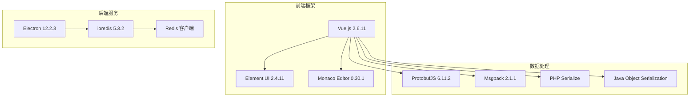
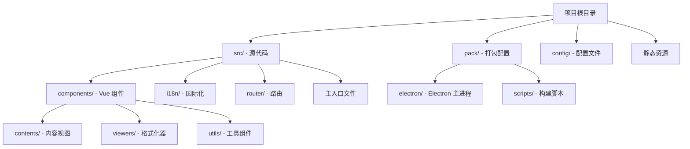
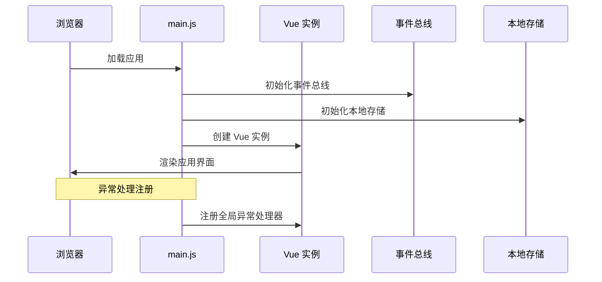
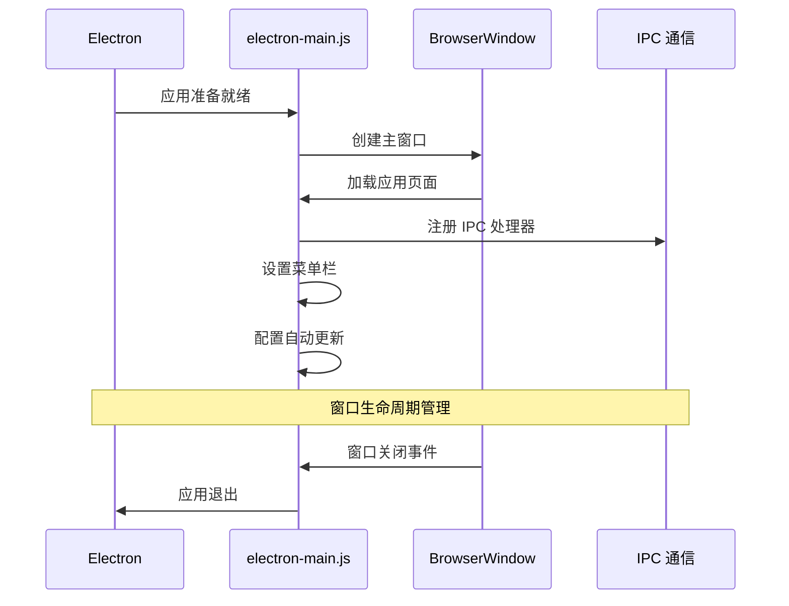
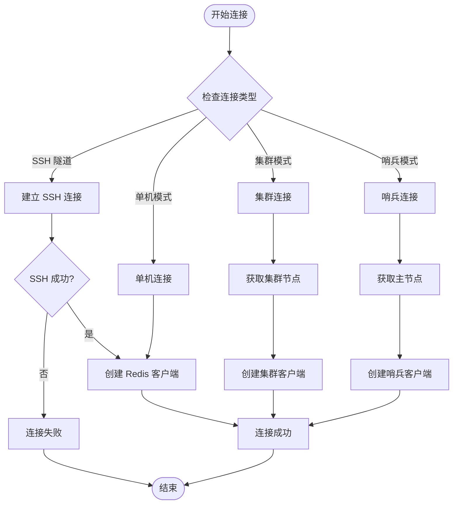
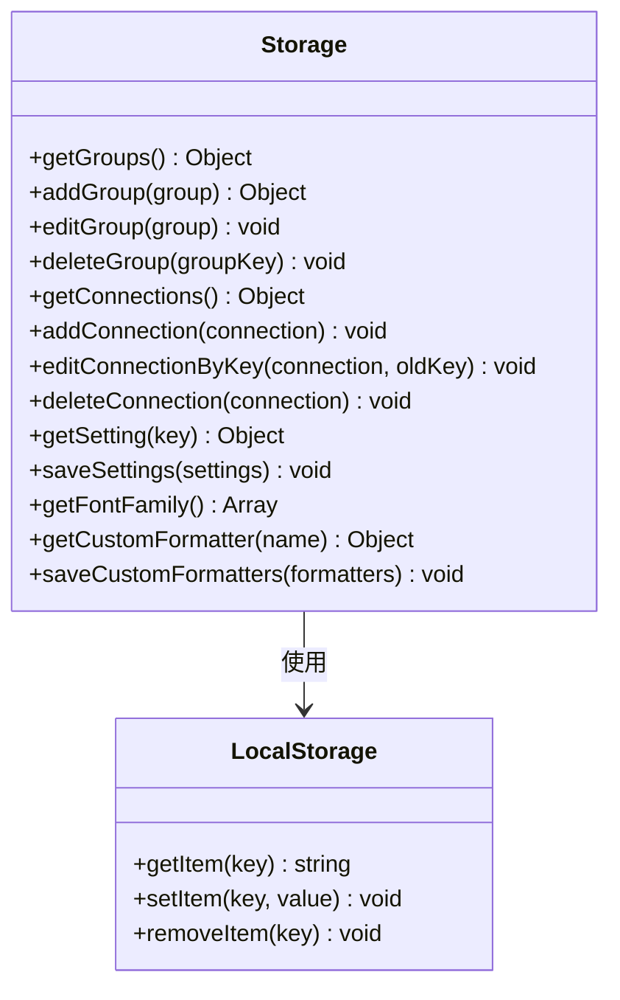
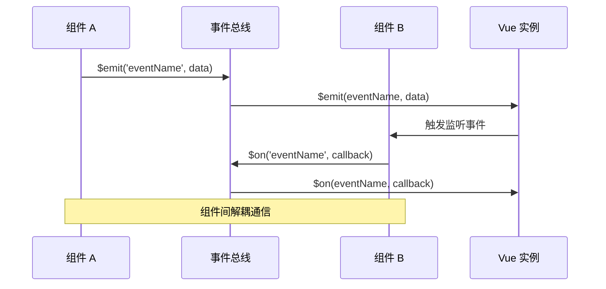
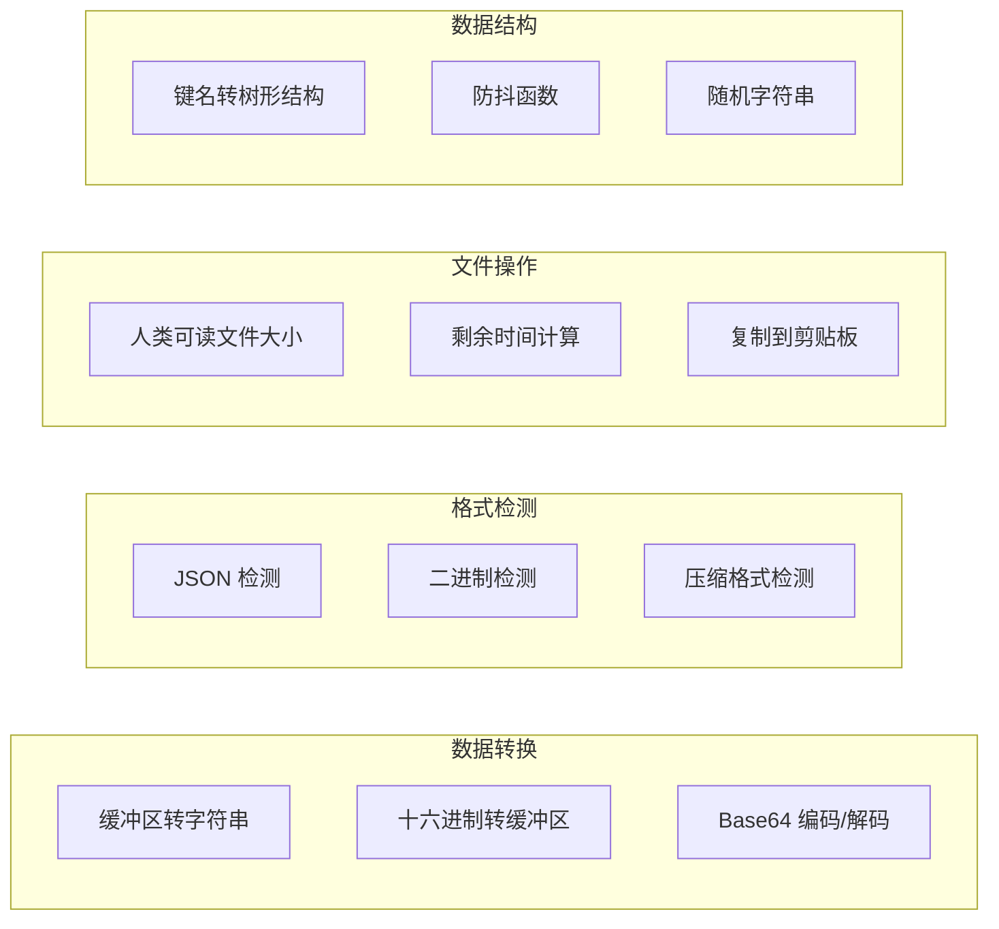
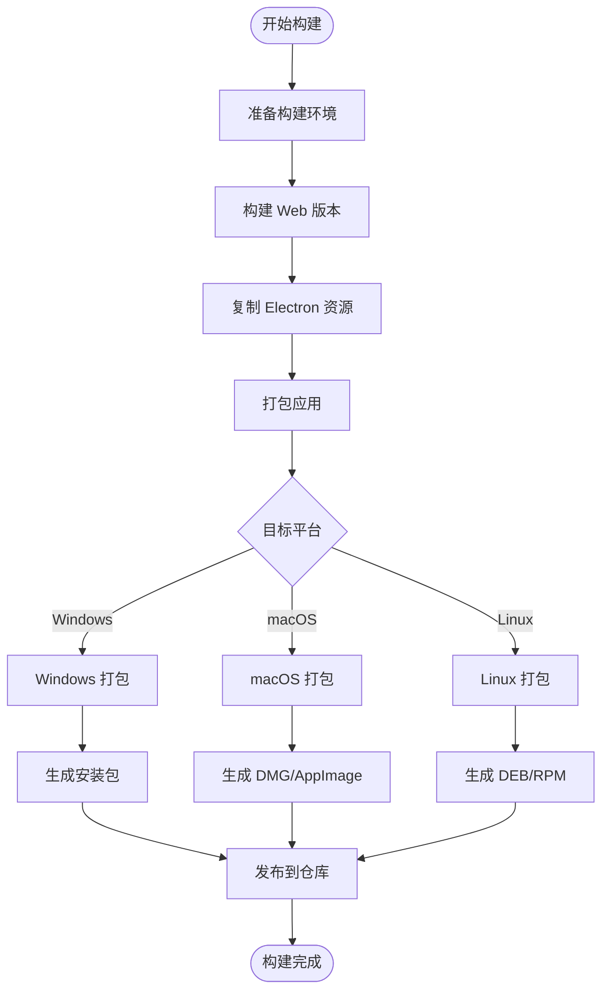

# 开发指南

<cite>
**本文档中引用的文件**
- [package.json](file://package.json)
- [src/main.js](file://src/main.js)
- [pack/electron/electron-main.js](file://pack/electron/electron-main.js)
- [src/redisClient.js](file://src/redisClient.js)
- [src/storage.js](file://src/storage.js)
- [src/bus.js](file://src/bus.js)
- [.eslintrc.json](file://.eslintrc.json)
- [src/App.vue](file://src/App.vue)
- [src/router/index.js](file://src/router/index.js)
- [src/util.js](file://src/util.js)
- [src/i18n/i18n.js](file://src/i18n/i18n.js)
- [src/addon.js](file://src/addon.js)
- [README.md](file://README.md)
</cite>

## 目录
1. [项目概述](#项目概述)
2. [技术栈与架构](#技术栈与架构)
3. [项目结构分析](#项目结构分析)
4. [核心模块详解](#核心模块详解)
5. [开发环境搭建](#开发环境搭建)
6. [代码规范与质量控制](#代码规范与质量控制)
7. [构建与部署流程](#构建与部署流程)
8. [贡献指南](#贡献指南)
9. [常见问题与解决方案](#常见问题与解决方案)

## 项目概述

Another Redis Desktop Manager 是一个跨平台的 Redis 数据库管理工具，支持 Linux、Windows 和 macOS 系统。该项目采用现代化的前端技术栈，结合 Electron 框架实现桌面应用，为用户提供稳定、高效的 Redis 数据库管理体验。

### 主要特性
- 支持单机、集群、哨兵等多种 Redis 部署模式
- 内置多种数据格式查看器（JSON、二进制、压缩格式等）
- SSH 隧道连接支持
- 多语言国际化支持
- 自定义格式化器扩展
- 命令历史记录与执行日志

## 技术栈与架构

### 核心技术栈



**图表来源**
- [package.json](file://package.json#L35-L56)

### 版本配置详情

| 组件 | 版本 | 用途 |
|------|------|------|
| Vue.js | 2.6.11 | 前端 MVVM 框架 |
| Element UI | 2.4.11 | UI 组件库 |
| Electron | 12.2.3 | 桌面应用框架 |
| ioredis | 5.3.2 | Redis 客户端 |
| Monaco Editor | 0.30.1 | 代码编辑器 |
| Node.js | >= 6.0.0 | 运行时环境 |

**章节来源**
- [package.json](file://package.json#L35-L118)

## 项目结构分析

### 目录组织结构



**图表来源**
- [src/main.js](file://src/main.js#L1-L47)
- [pack/electron/electron-main.js](file://pack/electron/electron-main.js#L1-L227)

### 主要目录说明

#### src/ 目录结构
- **components/**: 包含所有 Vue 组件，按功能分类
  - `contents/`: 各种 Redis 数据类型的视图组件
  - `viewers/`: 数据格式化和查看器组件
  - 其他通用组件如连接管理、设置界面等
- **i18n/**: 国际化相关文件
- **router/**: Vue Router 路由配置
- **主入口文件**: main.js、App.vue、bus.js 等核心文件

#### pack/ 目录结构
- **electron/**: Electron 应用程序主进程代码
- **scripts/**: 构建和打包脚本

**章节来源**
- [src/main.js](file://src/main.js#L1-L47)
- [pack/electron/electron-main.js](file://pack/electron/electron-main.js#L1-L227)

## 核心模块详解

### 启动流程分析

#### main.js - Web 应用启动



**图表来源**
- [src/main.js](file://src/main.js#L1-L47)

#### electron-main.js - Electron 主进程启动



**图表来源**
- [pack/electron/electron-main.js](file://pack/electron/electron-main.js#L42-L125)

**章节来源**
- [src/main.js](file://src/main.js#L1-L47)
- [pack/electron/electron-main.js](file://pack/electron/electron-main.js#L1-L227)

### Redis 客户端连接管理

#### redisClient.js - 连接管理逻辑



**图表来源**
- [src/redisClient.js](file://src/redisClient.js#L52-L87)

#### 连接类型支持

| 连接类型 | 描述 | 配置参数 |
|----------|------|----------|
| 单机连接 | 标准 Redis 连接 | host, port, auth, db |
| 集群连接 | Redis Cluster 模式 | cluster: true, 节点列表 |
| 哨兵连接 | Redis Sentinel 模式 | sentinelOptions.masterName |
| SSH 隧道 | 通过 SSH 连接 | sshOptions 配置 |
| SSL/TLS | 加密连接 | sslOptions 证书配置 |

**章节来源**
- [src/redisClient.js](file://src/redisClient.js#L52-L381)

### 本地存储机制

#### storage.js - 存储系统设计



**图表来源**
- [src/storage.js](file://src/storage.js#L5-L329)

#### 存储数据结构

| 数据类型 | 存储键 | 结构示例 |
|----------|--------|----------|
| 连接配置 | `connections` | `{connectionKey: {...}}` |
| 分组信息 | `connectionGroups` | `{groupKey: {...}}` |
| 用户设置 | `settings` | `{theme: 'dark', lang: 'en'}` |
| 自定义格式化器 | `customFormatters` | `[...]` |
| S3 同步配置 | `s3Config` | `{endpoint, bucket, ...}` |

**章节来源**
- [src/storage.js](file://src/storage.js#L1-L329)

### 事件通信模式

#### bus.js - 事件总线系统



**图表来源**
- [src/bus.js](file://src/bus.js#L1-L19)

#### 常用事件类型

| 事件名称 | 触发时机 | 参数 | 用途 |
|----------|----------|------|------|
| `commandLog` | 命令执行完成 | {time, connectionName, command, cost} | 记录命令日志 |
| `closeConnection` | 关闭连接 | - | 断开 Redis 连接 |
| `refreshConnections` | 刷新连接列表 | - | 更新连接状态 |
| `update-check` | 检查更新 | - | 自动更新检查 |

**章节来源**
- [src/bus.js](file://src/bus.js#L1-L19)

### 工具函数库

#### util.js - 实用工具集



**图表来源**
- [src/util.js](file://src/util.js#L1-L392)

**章节来源**
- [src/util.js](file://src/util.js#L1-L392)

## 开发环境搭建

### 环境要求

#### 系统要求
- **操作系统**: Windows 10+, macOS 10.12+, 或 Linux (Ubuntu 16.04+)
- **Node.js**: >= 6.0.0
- **npm**: >= 3.0.0
- **Git**: 用于代码版本控制

#### 必需工具
- **代码编辑器**: VS Code、WebStorm 或其他支持 Vue.js 的 IDE
- **终端**: PowerShell (Windows)、Terminal (macOS/Linux) 或 WSL
- **Redis 服务器**: 用于测试连接

### 安装步骤

#### 1. 克隆项目

```bash
# 克隆代码仓库
git clone https://github.com/qishibo/AnotherRedisDesktopManager.git --depth=1
cd AnotherRedisDesktopManager
```

#### 2. 安装依赖

```bash
# 安装项目依赖
npm install

# 如果下载 Electron 失败，使用国内镜像源
ELECTRON_MIRROR="https://npmmirror.com/mirrors/electron/" npm install
```

#### 3. 开发服务器启动

```bash
# 启动开发服务器（热重载）
npm start

# 在另一个终端启动 Electron 桌面客户端
npm run electron
```

#### 4. 平台特定安装

**Linux/Mac 系统错误处理**:
```bash
# 如果遇到字体配置错误
sudo apt install libfontconfig1-dev
```

**Windows 系统**:
```bash
# 安装平台特定依赖
npm install --platform=win32

# 如果下载 Electron 失败
npm config set ELECTRON_MIRROR https://npmmirror.com/mirrors/electron/
npm install --platform=win32
```

**章节来源**
- [README.md](file://README.md#L125-L180)
- [package.json](file://package.json#L7-L32)

### 项目配置

#### ESLint 配置

项目使用 Airbnb JavaScript 风格指南进行代码质量控制：

```javascript
// .eslintrc.json 配置要点
{
  "extends": ["eslint:recommended", "airbnb-base", "plugin:vue/essential"],
  "plugins": ["vue"],
  "rules": {}
}
```

#### 构建配置

| 脚本命令 | 功能描述 | 使用场景 |
|----------|----------|----------|
| `npm run dev` | 开发服务器 | 日常开发调试 |
| `npm run build` | 生产构建 | 生成发布版本 |
| `npm run electron` | Electron 启动 | 桌面应用测试 |
| `npm run lint` | 代码检查 | 提交前检查 |

**章节来源**
- [.eslintrc.json](file://.eslintrc.json#L1-L19)
- [package.json](file://package.json#L7-L32)

## 代码规范与质量控制

### ESLint 规则配置

项目采用严格的代码质量标准：

#### 基础规则
- **浏览器环境**: 启用浏览器全局变量访问
- **ES6 支持**: 支持 ES2018 语法特性
- **Vue 插件**: 集成 Vue.js ESLint 插件
- **Airbnb 基础**: 继承 Airbnb JavaScript 风格指南

#### 代码风格要求
- 使用双引号定义字符串
- 行尾不包含多余空格
- 函数调用不省略括号
- 条件语句必须使用大括号

### 代码提交规范

#### Git 提交消息格式
```bash
<type>(<scope>): <subject>

<body>

<footer>
```

#### 类型说明
- **feat**: 新功能
- **fix**: 错误修复
- **docs**: 文档更新
- **style**: 代码格式调整
- **refactor**: 代码重构
- **test**: 测试相关
- **chore**: 构建过程或辅助工具变动

### 代码审查清单

#### 功能性检查
- [ ] 所有功能正常工作
- [ ] 边界条件处理正确
- [ ] 错误处理完善
- [ ] 性能影响最小化

#### 代码质量检查
- [ ] 遵循 ESLint 规范
- [ ] 变量命名清晰
- [ ] 注释充分且准确
- [ ] 模块职责单一

**章节来源**
- [.eslintrc.json](file://.eslintrc.json#L1-L19)

## 构建与部署流程

### 构建流程概览



### 平台特定构建

#### Windows 构建
```bash
# 准备构建
npm run pack:prepare

# 64位 Windows 安装包
npm run pack:win

# 32位 Windows 安装包  
npm run pack:win32

# MSI 安装包
npm run pack:win:msi
```

#### macOS 构建
```bash
# 标准 macOS 打包
npm run pack:mac

# DMG 格式
npm run pack:mac:dmg

# Apple Silicon 支持
npm run pack:macm1:publish
```

#### Linux 构建
```bash
# 标准 Linux 打包
npm run pack:linux

# AppImage 格式
npm run pack:linux:appimage

# DEB 包
npm run pack:linux:deb

# RPM 包
npm run pack:linux:rpm
```

### 发布流程

#### 自动化发布
- **触发条件**: Git 标签推送到远程仓库
- **发布内容**: 自动构建的各平台安装包
- **分发渠道**: GitHub Releases、应用商店

#### 手动发布
```bash
# 完整平台发布
npm run pack:all

# 发布到 GitHub
npm run pack:win:publish
npm run pack:mac:publish
npm run pack:linux:publish
```

**章节来源**
- [package.json](file://package.json#L14-L32)
- [README.md](file://README.md#L181-L200)

## 贡献指南

### 贡献流程

#### 1. 准备工作
```bash
# Fork 项目到个人账户
# 克隆自己的 fork
git clone https://github.com/YOUR_USERNAME/AnotherRedisDesktopManager.git
cd AnotherRedisDesktopManager

# 添加上游仓库
git remote add upstream https://github.com/qishibo/AnotherRedisDesktopManager.git

# 创建功能分支
git checkout -b feature/your-feature-name
```

#### 2. 开发流程
```bash
# 从上游同步最新代码
git fetch upstream
git rebase upstream/main

# 进行开发
# 编写代码...
# 运行测试...
# 修复 ESLint 错误...

# 提交更改
git add .
git commit -m "feat: 添加新功能描述"

# 推送分支
git push origin feature/your-feature-name
```

#### 3. Pull Request 流程
1. **创建 PR**: 在 GitHub 上创建 Pull Request
2. **PR 描述**: 详细描述修改内容和原因
3. **代码审查**: 等待维护者审查
4. **修改反馈**: 根据反馈进行修改
5. **合并**: 审查通过后合并到主分支

### 分支策略

#### 主要分支
- **main**: 主分支，包含稳定版本
- **develop**: 开发分支，集成最新功能
- **feature/***: 功能分支，每个新功能独立分支
- **hotfix/***: 热修复分支，紧急修复

#### 合并原则
- 功能分支最终合并到 develop
- develop 分支定期合并到 main
- 热修复直接合并到 main 和 develop

### 代码贡献规范

#### 文件命名规范
- **组件文件**: PascalCase (如 `KeyContentString.vue`)
- **工具文件**: camelCase (如 `util.js`)
- **样式文件**: kebab-case (如 `app-styles.scss`)

#### 目录结构规范
- **components/**: 按功能分组
- **utils/**: 工具函数集中存放
- **assets/**: 静态资源文件
- **config/**: 配置文件

#### 注释规范
```javascript
/**
 * 功能描述
 * @param {类型} 参数名 - 参数说明
 * @returns {类型} 返回值说明
 */
function exampleFunction(param) {
  // 单行注释
  return result;
}
```

### 社区参与

#### 如何获得帮助
1. **GitHub Issues**: 报告 Bug 和功能请求
2. **讨论区**: 参与技术讨论
3. **文档改进**: 帮助完善项目文档

#### 贡献类型
- **代码贡献**: 新功能、Bug 修复
- **文档贡献**: 文档改进、翻译
- **测试贡献**: 测试用例、性能测试
- **设计贡献**: UI/UX 改进

#### 社区资源
- **官方网站**: goanother.com
- **产品发布**: Product Hunt
- **社交媒体**: Twitter @shibo
- **统计分析**: 下载统计和使用情况

**章节来源**
- [README.md](file://README.md#L55-L68)

## 常见问题与解决方案

### 开发环境问题

#### 问题 1: Electron 下载失败
**症状**: npm install 过程中 Electron 下载中断
**解决方案**:
```bash
# 使用国内镜像源
ELECTRON_MIRROR="https://npmmirror.com/mirrors/electron/" npm install

# 或设置 npm 配置
npm config set ELECTRON_MIRROR https://npmmirror.com/mirrors/electron/
```

#### 问题 2: 字体配置错误 (Linux)
**症状**: 编译时出现 `fontconfig/fontconfig.h: No such file or directory`
**解决方案**:
```bash
sudo apt install libfontconfig1-dev
```

#### 问题 3: SSH 连接权限问题
**症状**: 无法访问私钥文件
**解决方案**:
```bash
# Linux 系统授权
sudo snap connect another-redis-desktop-manager:ssh-keys
```

### 功能使用问题

#### 问题 1: Redis Cluster 连接失败
**原因**: 网络隔离或配置错误
**解决方案**: 使用 SSH 隧道连接内部网络

#### 问题 2: 大量键加载缓慢
**原因**: Redis 服务器性能限制
**解决方案**: 启用分页加载或使用 SCAN 命令

#### 问题 3: 自定义格式化器不生效
**原因**: 脚本权限或路径问题
**解决方案**: 确保脚本具有执行权限，路径正确

### 性能优化建议

#### 内存使用优化
- 合理设置 Redis 连接池大小
- 及时释放不需要的组件实例
- 优化大数据量的渲染逻辑

#### 网络连接优化
- 使用连接池管理 Redis 连接
- 实现连接状态监控和自动重连
- 优化批量操作的执行策略

#### 用户体验优化
- 实现虚拟滚动处理大量数据
- 提供加载状态和进度提示
- 优化界面响应速度

**章节来源**
- [README.md](file://README.md#L310-L332)
- [src/redisClient.js](file://src/redisClient.js#L344-L355)

## 总结

Another Redis Desktop Manager 是一个功能完善的 Redis 管理工具，通过现代化的技术栈实现了跨平台的桌面应用。项目采用模块化的架构设计，清晰的代码组织和完善的开发流程，为开发者提供了良好的贡献环境。

### 核心优势
- **技术先进**: 基于 Vue.js 和 Electron 的现代 Web 技术栈
- **功能丰富**: 支持多种 Redis 部署模式和数据格式
- **易于扩展**: 模块化设计便于功能扩展
- **社区友好**: 完善的贡献指南和开发文档

### 发展方向
- 持续优化性能和用户体验
- 扩展更多 Redis 版本和功能支持
- 增强安全性和稳定性
- 完善国际化支持

通过遵循本开发指南，贡献者可以快速上手项目开发，为 Redis 管理工具生态做出贡献。欢迎更多开发者加入社区，共同打造更好的 Redis 管理工具。