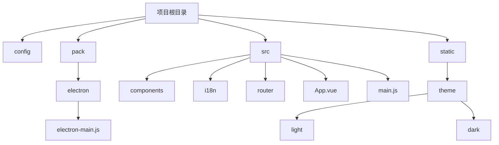
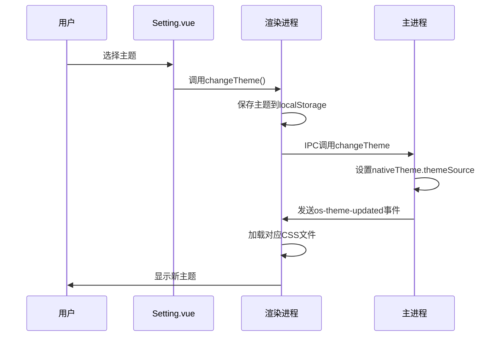
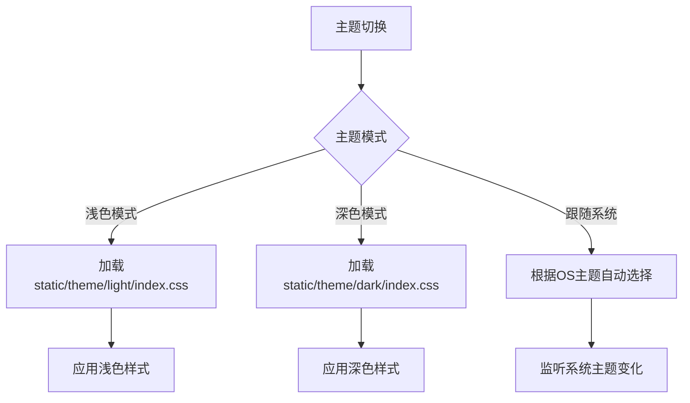
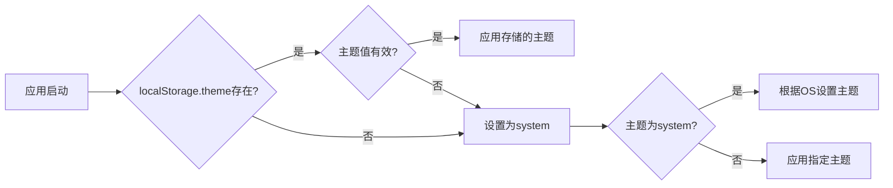
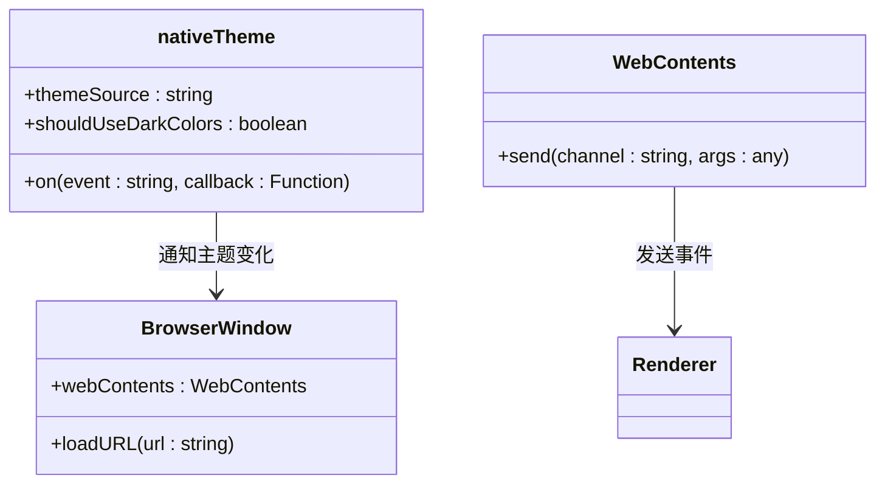
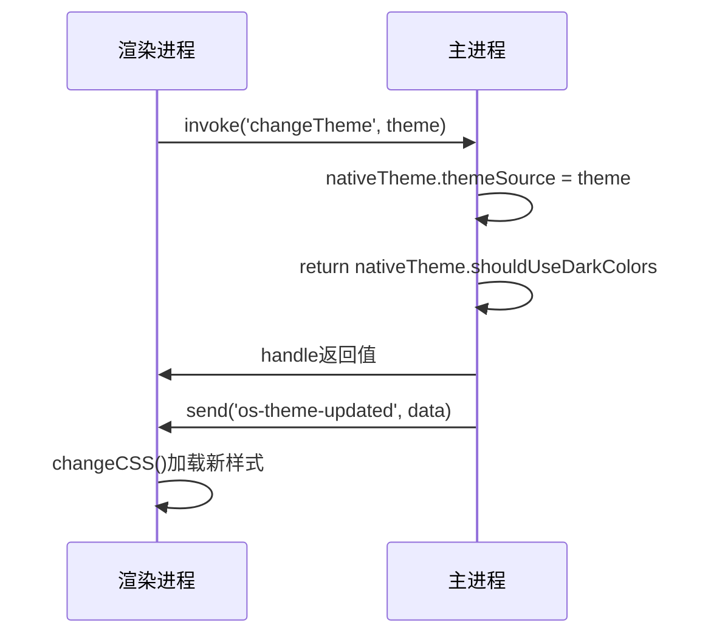
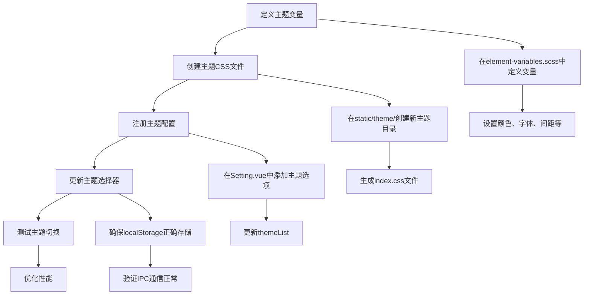
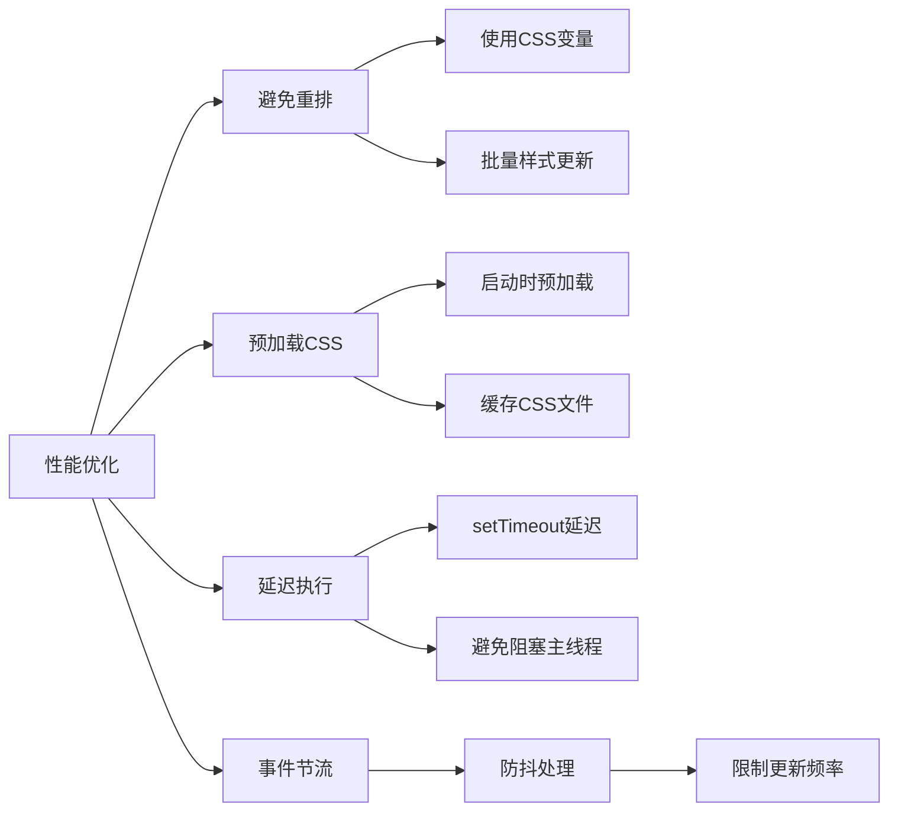
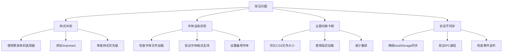

# 主题切换

<cite>
**本文档引用的文件**   
- [main.js](file://src/main.js)
- [electron-main.js](file://pack/electron/electron-main.js)
- [index.html](file://index.html)
- [Setting.vue](file://src/components/Setting.vue)
- [element-variables.scss](file://element-variables.scss)
- [App.vue](file://src/App.vue)
</cite>

## 目录
1. [项目结构](#项目结构)
2. [核心组件](#核心组件)
3. [主题切换实现逻辑](#主题切换实现逻辑)
4. [CSS变量与样式表管理](#css变量与样式表管理)
5. [用户设置同步与持久化存储](#用户设置同步与持久化存储)
6. [Electron主进程主题适配](#electron主进程主题适配)
7. [主进程与渲染进程通信](#主进程与渲染进程通信)
8. [扩展新主题的完整流程](#扩展新主题的完整流程)
9. [性能优化策略](#性能优化策略)
10. [常见问题与解决方案](#常见问题与解决方案)

## 项目结构

**Diagram sources**
- [electron-main.js](file://pack/electron/electron-main.js)
- [main.js](file://src/main.js)
- [Setting.vue](file://src/components/Setting.vue)

**Section sources**
- [electron-main.js](file://pack/electron/electron-main.js)
- [main.js](file://src/main.js)
- [Setting.vue](file://src/components/Setting.vue)

## 核心组件

**Section sources**
- [main.js](file://src/main.js)
- [electron-main.js](file://pack/electron/electron-main.js)
- [Setting.vue](file://src/components/Setting.vue)

## 主题切换实现逻辑

主题切换功能通过Electron的`nativeTheme`模块与前端渲染进程的协同工作实现。系统支持三种主题模式：浅色模式(light)、深色模式(dark)和跟随系统(system)。当用户在设置界面选择主题时，系统会通过IPC通信将主题变更通知传递给主进程。

在渲染进程中，`Setting.vue`组件中的主题选择器通过`el-select`组件提供用户界面，绑定`themeMode`数据属性。当用户选择不同主题时，触发`changeTheme`方法，该方法将当前选择的主题保存到`localStorage`中，并调用`globalChangeTheme`函数进行主题切换。

**Diagram sources**
- [Setting.vue](file://src/components/Setting.vue)
- [electron-main.js](file://pack/electron/electron-main.js)
- [index.html](file://index.html)

**Section sources**
- [Setting.vue](file://src/components/Setting.vue)
- [electron-main.js](file://pack/electron/electron-main.js)

## CSS变量与样式表管理

应用通过动态加载不同的CSS样式表来实现主题切换。在`index.html`文件中，定义了一个id为`theme-link`的link标签，用于动态引用不同的主题CSS文件。

主题样式基于Element UI框架的SCSS变量系统进行定制，主要通过`element-variables.scss`文件定义。该文件中包含了各种颜色变量，如`$--color-primary`（主色调）、`$--color-white`（背景色）、`$--color-text-primary`（文字颜色）等。深色模式下，背景色设置为`#263238`，文字颜色为`#F3F3F4`，创建了高对比度的视觉效果。

**Diagram sources**
- [index.html](file://index.html)
- [element-variables.scss](file://element-variables.scss)

**Section sources**
- [index.html](file://index.html)
- [element-variables.scss](file://element-variables.scss)

## 用户设置同步与持久化存储

主题设置通过`localStorage`进行持久化存储，确保用户重启应用后仍能保持之前选择的主题。在应用启动时，系统会从`localStorage.theme`读取用户偏好设置。

当用户在设置界面更改主题时，系统执行以下同步流程：
1. 将新主题值保存到`localStorage.theme`
2. 通过IPC调用主进程的`changeTheme`方法
3. 主进程更新`nativeTheme.themeSource`
4. 主进程向渲染进程发送主题更新事件
5. 渲染进程加载对应的CSS文件并更新界面

**Diagram sources**
- [index.html](file://index.html)
- [Setting.vue](file://src/components/Setting.vue)

**Section sources**
- [index.html](file://index.html)
- [Setting.vue](file://src/components/Setting.vue)

## Electron主进程主题适配

Electron主进程通过`nativeTheme`模块实现与操作系统原生界面元素的主题适配。`nativeTheme`是Electron提供的API，用于检测和控制应用程序的原生主题。

在`electron-main.js`文件中，主进程通过以下方式处理主题：
1. 在应用启动时，通过`nativeTheme.shouldUseDarkColors`检测当前系统是否使用深色模式
2. 将检测结果作为查询参数传递给渲染进程
3. 监听`nativeTheme`的`updated`事件，当系统主题发生变化时通知渲染进程

**Diagram sources**
- [electron-main.js](file://pack/electron/electron-main.js)

**Section sources**
- [electron-main.js](file://pack/electron/electron-main.js)

## 主进程与渲染进程通信

主题切换涉及主进程与渲染进程之间的双向通信，使用Electron的IPC（Inter-Process Communication）机制实现。

通信流程包括：
1. **渲染进程到主进程**：使用`ipcRenderer.invoke('changeTheme', theme)`发送异步请求，主进程通过`ipcMain.handle`处理
2. **主进程到渲染进程**：使用`mainWindow.webContents.send('os-theme-updated', data)`发送事件，渲染进程通过`ipcRenderer.on`监听
3. **启动参数传递**：在创建`BrowserWindow`时，通过URL查询参数传递初始主题状态

**Diagram sources**
- [electron-main.js](file://pack/electron/electron-main.js)
- [index.html](file://index.html)

**Section sources**
- [electron-main.js](file://pack/electron/electron-main.js)
- [index.html](file://index.html)

## 扩展新主题的完整流程

要扩展新主题，需要按照以下步骤进行：

具体实现步骤：
1. 在`element-variables.scss`中定义新主题的SCSS变量
2. 在`static/theme/`目录下创建新主题的文件夹，如`custom`
3. 生成对应的主题CSS文件，可以基于现有主题修改
4. 在`Setting.vue`的`themeList`中添加新主题选项
5. 确保`changeTheme`方法能正确处理新主题
6. 测试主题切换功能，包括持久化和跨进程同步

**Diagram sources**
- [element-variables.scss](file://element-variables.scss)
- [Setting.vue](file://src/components/Setting.vue)

**Section sources**
- [element-variables.scss](file://element-variables.scss)
- [Setting.vue](file://src/components/Setting.vue)

## 性能优化策略

主题切换过程中采用了多种性能优化策略：

具体优化措施包括：
1. **避免重排**：通过一次性修改CSS类而不是逐个修改样式属性，减少DOM重排次数
2. **延迟执行**：在`os-theme-updated`事件处理中使用`setTimeout`延迟50-100毫秒，防止Web内容卡顿
3. **批量更新**：将多个样式变更合并为一次操作，减少浏览器渲染次数
4. **资源预加载**：在应用启动时预先加载常用主题的CSS文件，减少切换时的等待时间

**Diagram sources**
- [index.html](file://index.html)
- [electron-main.js](file://pack/electron/electron-main.js)

**Section sources**
- [index.html](file://index.html)
- [electron-main.js](file://pack/electron/electron-main.js)

## 常见问题与解决方案

主题切换过程中可能出现以下问题及相应解决方案：

具体问题分析：
1. **样式冲突**：当多个CSS规则作用于同一元素时可能导致样式冲突。解决方案是使用更具体的选择器或在必要时使用`!important`声明
2. **字体渲染异常**：某些字体在深色背景下可能显示不清晰。应选择适合深色模式的字体，并设置合适的字体大小和行高
3. **主题切换卡顿**：大体积CSS文件可能导致切换延迟。可通过压缩CSS、移除未使用样式等方式优化
4. **状态不同步**：主进程与渲染进程主题状态不一致。需确保IPC通信正常，事件监听器正确注册

**Diagram sources**
- [index.html](file://index.html)
- [App.vue](file://src/App.vue)

**Section sources**
- [index.html](file://index.html)
- [App.vue](file://src/App.vue)