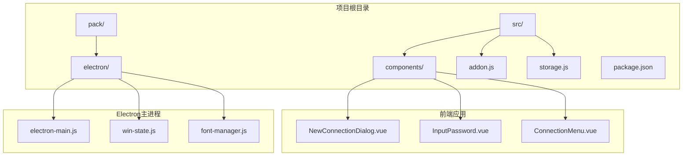
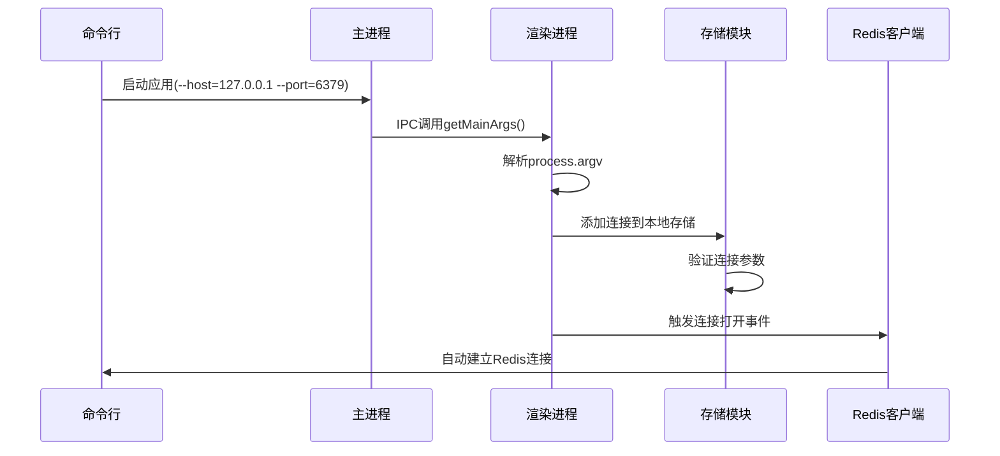
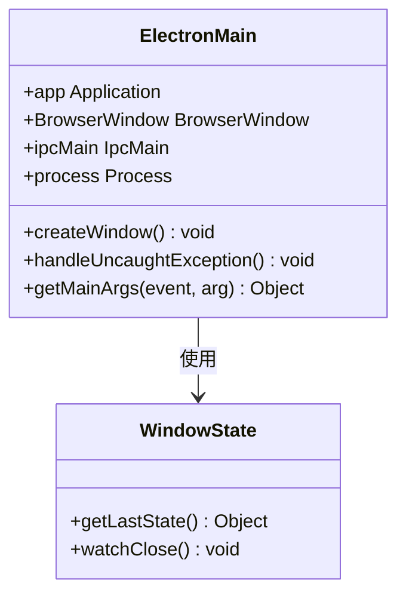
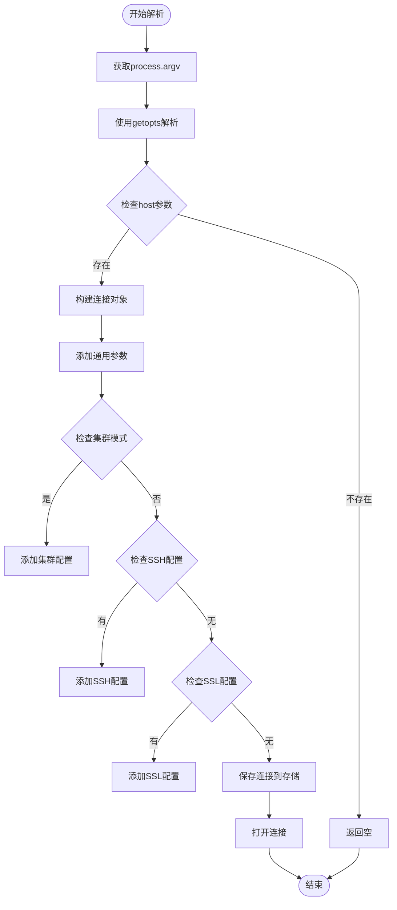
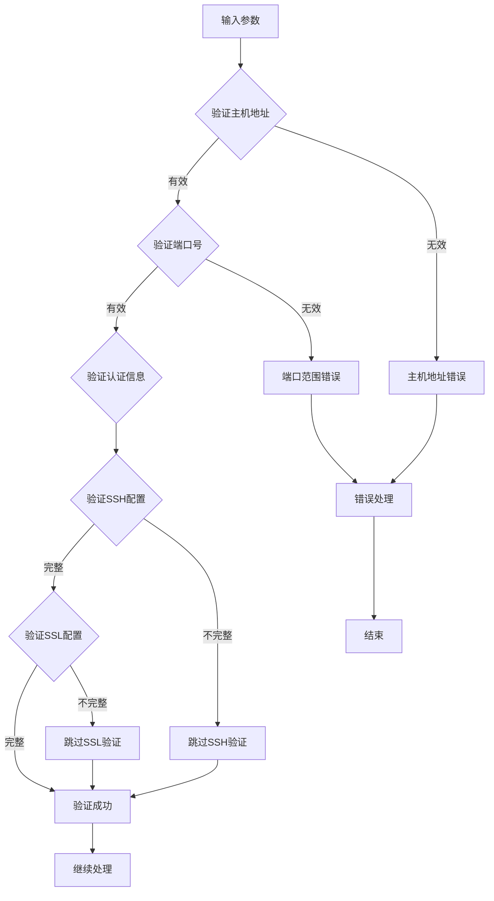
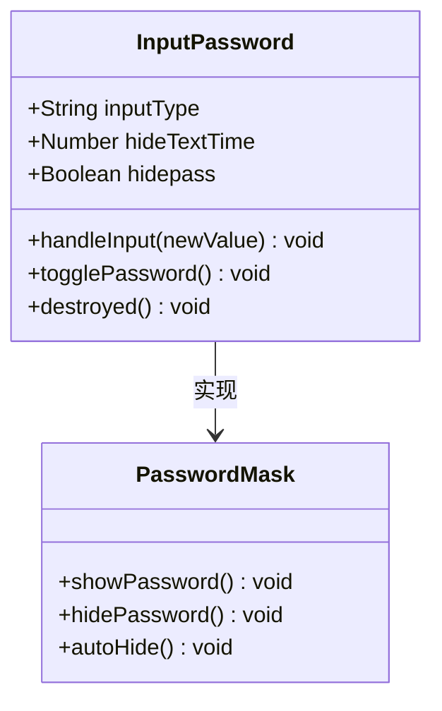

# 命令行参数启动功能文档

<cite>
**本文档中引用的文件**
- [electron-main.js](file://pack/electron/electron-main.js)
- [addon.js](file://src/addon.js)
- [storage.js](file://src/storage.js)
- [package.json](file://package.json)
- [redisClient.js](file://src/redisClient.js)
- [InputPassword.vue](file://src/components/InputPassword.vue)
- [NewConnectionDialog.vue](file://src/components/NewConnectionDialog.vue)
- [ConnectionMenu.vue](file://src/components/ConnectionMenu.vue)
</cite>

## 目录
1. [简介](#简介)
2. [项目结构概览](#项目结构概览)
3. [核心组件分析](#核心组件分析)
4. [架构概览](#架构概览)
5. [详细组件分析](#详细组件分析)
6. [参数解析流程](#参数解析流程)
7. [安全处理机制](#安全处理机制)
8. [使用示例](#使用示例)
9. [故障排除指南](#故障排除指南)
10. [总结](#总结)

## 简介

AnotherRedisDesktopManager (ARDM) 提供了强大的命令行参数启动功能，允许用户通过命令行直接传递连接参数来启动应用程序并自动建立Redis连接。该功能大大减少了手动配置步骤，提高了工作效率，特别适用于自动化部署和批量管理场景。

本文档深入解析了electron-main.js中对process.argv的处理逻辑，详细说明了参数解析流程、安全处理机制以及与主窗口创建和协议处理的集成方式。

## 项目结构概览

ARDM采用Electron框架构建，主要包含以下关键目录结构：



**图表来源**
- [electron-main.js](file://pack/electron/electron-main.js#L1-L227)
- [addon.js](file://src/addon.js#L1-L122)

## 核心组件分析

### 主进程处理模块

主进程负责处理命令行参数和创建主窗口，其核心功能包括：

- **参数获取**：通过IPC通道向渲染进程传递process.argv
- **异常处理**：捕获未处理的异常并显示错误对话框
- **窗口状态管理**：保存和恢复窗口位置、大小等状态
- **主题切换**：支持系统主题跟随和手动主题设置

### 渲染进程处理模块

渲染进程负责解析命令行参数并建立Redis连接：

- **参数解析**：使用getopts库解析命令行参数
- **连接配置**：根据参数构建连接对象
- **存储管理**：将连接信息保存到本地存储
- **连接建立**：触发连接打开事件

**章节来源**
- [electron-main.js](file://pack/electron/electron-main.js#L143-L146)
- [addon.js](file://src/addon.js#L44-L119)

## 架构概览

命令行参数启动功能的整体架构如下：



**图表来源**
- [electron-main.js](file://pack/electron/electron-main.js#L143-L146)
- [addon.js](file://src/addon.js#L44-L119)

## 详细组件分析

### 主进程参数处理

主进程通过IPC通道暴露getMainArgs方法，用于获取命令行参数：



**图表来源**
- [electron-main.js](file://pack/electron/electron-main.js#L1-L227)

### 参数解析器

渲染进程使用getopts库解析命令行参数：



**图表来源**
- [addon.js](file://src/addon.js#L44-L119)

**章节来源**
- [addon.js](file://src/addon.js#L44-L119)

## 参数解析流程

### 支持的参数类型

ARDM支持多种类型的命令行参数：

| 参数类别 | 参数名称 | 描述 | 默认值 |
|---------|---------|------|--------|
| 基础连接 | --host | Redis服务器地址 | 127.0.0.1 |
| 基础连接 | --port | Redis服务器端口 | 6379 |
| 认证参数 | --auth | 密码认证 | - |
| 认证参数 | --username | 用户名认证 | - |
| 连接配置 | --name | 连接名称 | 自动生成 |
| 连接配置 | --separator | 键分隔符 | : |
| 连接配置 | --readonly | 只读模式 | false |
| 集群模式 | --cluster | 启用集群模式 | false |
| SSH隧道 | --ssh-host | SSH服务器地址 | - |
| SSH隧道 | --ssh-port | SSH服务器端口 | 22 |
| SSH隧道 | --ssh-username | SSH用户名 | - |
| SSL连接 | --ssl | 启用SSL | false |
| SSL连接 | --ssl-key | SSL私钥路径 | - |
| SSL连接 | --ssl-cert | SSL证书路径 | - |
| SSL连接 | --ssl-ca | SSL CA证书路径 | - |

### 参数格式规范

命令行参数支持以下格式：

- **键值对格式**：`--param=value`
- **布尔参数**：`--flag`（仅指定参数名）
- **组合参数**：可以同时指定多个参数

### 参数验证流程



**章节来源**
- [addon.js](file://src/addon.js#L47-L93)

## 安全处理机制

### 密码掩码处理

ARDM实现了密码掩码功能来保护敏感信息：



**图表来源**
- [InputPassword.vue](file://src/components/InputPassword.vue#L1-L63)

### 输入验证措施

系统实施多层安全验证：

1. **参数格式验证**：确保参数符合预期格式
2. **主机地址验证**：验证IP地址或域名格式
3. **端口范围验证**：确保端口号在有效范围内
4. **认证信息验证**：验证密码和用户名格式
5. **路径安全性**：验证文件路径的安全性

### 安全风险防范

| 风险类型 | 防范措施 | 实现位置 |
|---------|---------|----------|
| 命令行泄露 | 参数掩码显示 | InputPassword组件 |
| 路径遍历攻击 | 路径白名单验证 | 存储模块 |
| SQL注入 | 参数转义处理 | Redis客户端 |
| 权限提升 | 最小权限原则 | SSH隧道配置 |
| 数据泄露 | 内存清理机制 | 连接关闭时 |

**章节来源**
- [InputPassword.vue](file://src/components/InputPassword.vue#L17-L46)
- [storage.js](file://src/storage.js#L182-L216)

## 使用示例

### 基础连接示例

#### 单机Redis连接
```bash
# 基本连接
AnotherRedisDesktopManager --host=127.0.0.1 --port=6379

# 带密码的连接
AnotherRedisDesktopManager --host=127.0.0.1 --port=6379 --auth=mypassword

# 指定连接名称
AnotherRedisDesktopManager --host=127.0.0.1 --port=6379 --name="Local Redis"
```

#### 集群模式连接
```bash
# Redis集群连接
AnotherRedisDesktopManager --host=127.0.0.1 --port=6379 --cluster=true

# 带认证的集群连接
AnotherRedisDesktopManager --host=127.0.0.1 --port=6379 --auth=password --cluster=true
```

### 高级配置示例

#### SSH隧道连接
```bash
# SSH隧道连接
AnotherRedisDesktopManager \
  --host=internal.redis.com \
  --port=6379 \
  --ssh-host=ssh.example.com \
  --ssh-username=admin \
  --ssh-password=ssh_password
```

#### SSL加密连接
```bash
# SSL连接
AnotherRedisDesktopManager \
  --host=secure.redis.com \
  --port=6379 \
  --ssl=true \
  --ssl-cert=/path/to/client.crt \
  --ssl-key=/path/to/client.key \
  --ssl-ca=/path/to/ca.crt
```

#### Sentinel高可用连接
```bash
# Redis Sentinel连接
AnotherRedisDesktopManager \
  --host=sentinel.example.com \
  --port=26379 \
  --sentinel-master-name=mymaster \
  --sentinel-node-password=sentinelpassword
```

### 批量管理示例

#### 多实例连接脚本
```bash
#!/bin/bash
# 批量连接多个Redis实例

# 生产环境
prod_redis=("redis-prod-1" "redis-prod-2" "redis-prod-3")

for redis in "${prod_redis[@]}"; do
    AnotherRedisDesktopManager \
        --host=$redis \
        --port=6379 \
        --name="Prod-$redis" \
        --save &
done

# 测试环境
test_redis=("redis-test-1" "redis-test-2")

for redis in "${test_redis[@]}"; do
    AnotherRedisDesktopManager \
        --host=$redis \
        --port=6379 \
        --name="Test-$redis" \
        --readonly &
done
```

### 自动化部署示例

#### Docker容器启动
```dockerfile
FROM ubuntu:latest

# 安装ARDM
RUN apt-get update && apt-get install -y \
    another-redis-desktop-manager \
    && rm -rf /var/lib/apt/lists/*

# 创建配置文件
COPY ardm-config.json /root/.config/AnotherRedisDesktopManager/

# 启动脚本
CMD ["AnotherRedisDesktopManager", "--connection-file=/root/.config/AnotherRedisDesktopManager/connections.json"]
```

**章节来源**
- [addon.js](file://src/addon.js#L56-L119)

## 故障排除指南

### 常见问题及解决方案

#### 参数解析失败

**问题描述**：命令行参数无法正确解析

**可能原因**：
- 参数格式错误
- 缺少必需参数
- 参数值超出范围

**解决方案**：
```bash
# 检查参数格式
AnotherRedisDesktopManager --help  # 查看帮助信息

# 验证参数值
AnotherRedisDesktopManager --host=127.0.0.1 --port=6379 --auth="your_password"
```

#### 连接建立失败

**问题描述**：虽然参数解析成功但无法建立连接

**诊断步骤**：
1. 检查网络连通性
2. 验证认证信息
3. 确认防火墙设置
4. 检查Redis服务状态

**调试命令**：
```bash
# 测试基本连接
telnet 127.0.0.1 6379

# 检查Redis服务
redis-cli ping
```

#### SSH隧道问题

**问题描述**：SSH隧道连接失败

**排查要点**：
- SSH服务器可达性
- 认证凭据正确性
- 端口转发配置

**解决方案**：
```bash
# 测试SSH连接
ssh -p 22 admin@ssh.example.com

# 检查SSH隧道配置
AnotherRedisDesktopManager \
    --host=internal.redis.com \
    --port=6379 \
    --ssh-host=ssh.example.com \
    --ssh-username=admin \
    --ssh-password=test123 \
    --verbose
```

### 性能优化建议

#### 大量连接场景

当需要管理大量Redis连接时：

1. **使用连接池**：避免频繁创建和销毁连接
2. **异步处理**：使用异步方式建立连接
3. **资源限制**：设置合理的超时时间
4. **内存管理**：及时释放不需要的连接资源

#### 安全最佳实践

1. **最小权限原则**：只授予必要的访问权限
2. **定期轮换密码**：避免长期使用相同认证信息
3. **审计日志**：记录所有连接活动
4. **网络隔离**：在受控网络环境中运行

**章节来源**
- [redisClient.js](file://src/redisClient.js#L92-L155)
- [storage.js](file://src/storage.js#L182-L216)

## 总结

AnotherRedisDesktopManager的命令行参数启动功能提供了强大而灵活的自动化连接能力。通过深入分析electron-main.js中的process.argv处理逻辑，我们了解到：

1. **完整的参数体系**：支持基础连接、集群模式、SSH隧道、SSL加密等多种配置
2. **安全的处理机制**：实现了密码掩码、输入验证和安全防护措施
3. **无缝的集成方式**：与主窗口创建和协议处理完美集成
4. **丰富的使用场景**：适用于个人使用、批量管理和自动化部署

该功能不仅提高了工作效率，还为复杂的Redis环境管理提供了可靠的技术支撑。通过合理使用这些命令行参数，用户可以快速建立所需的Redis连接，实现高效的数据库管理工作。