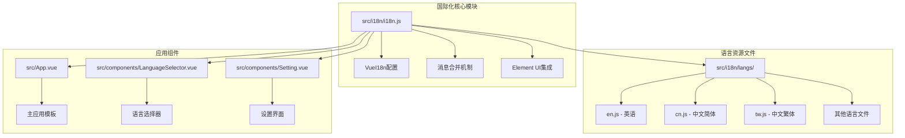
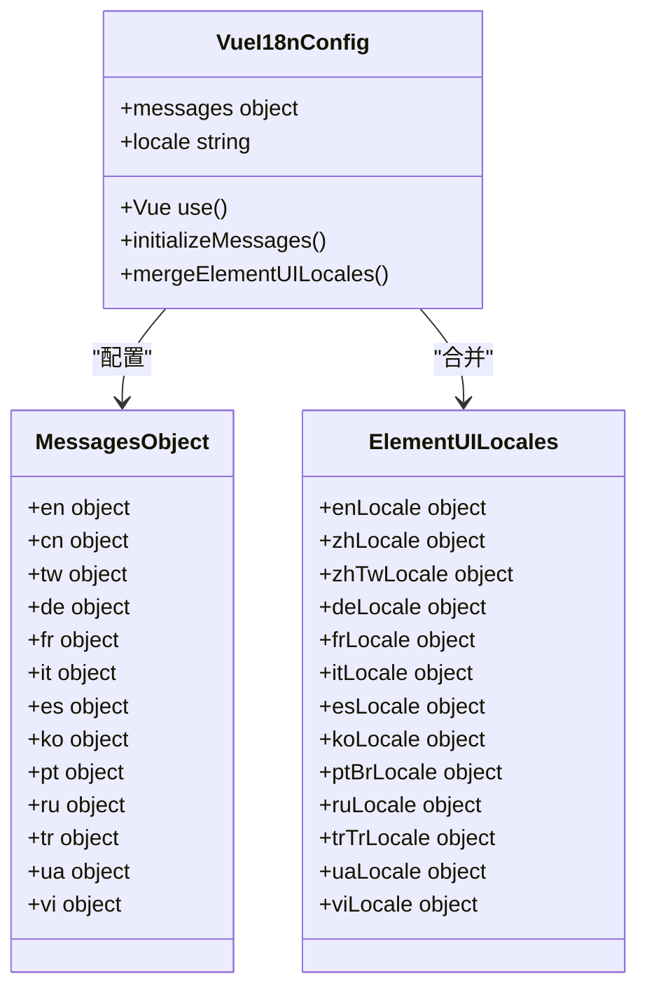
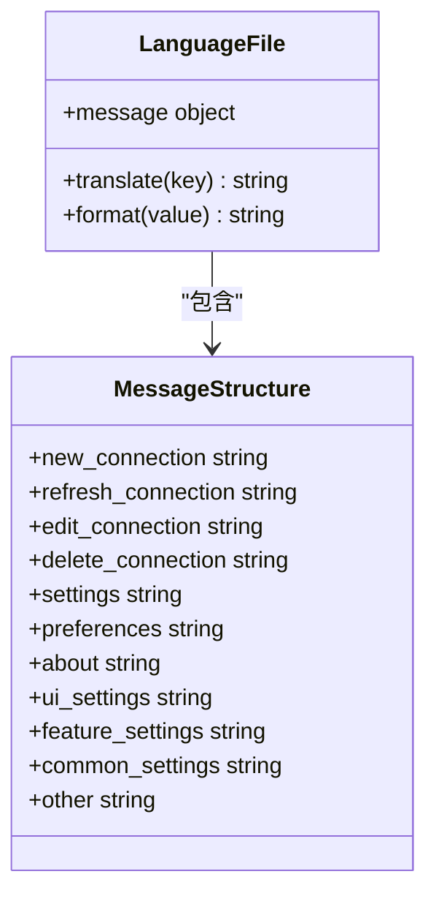
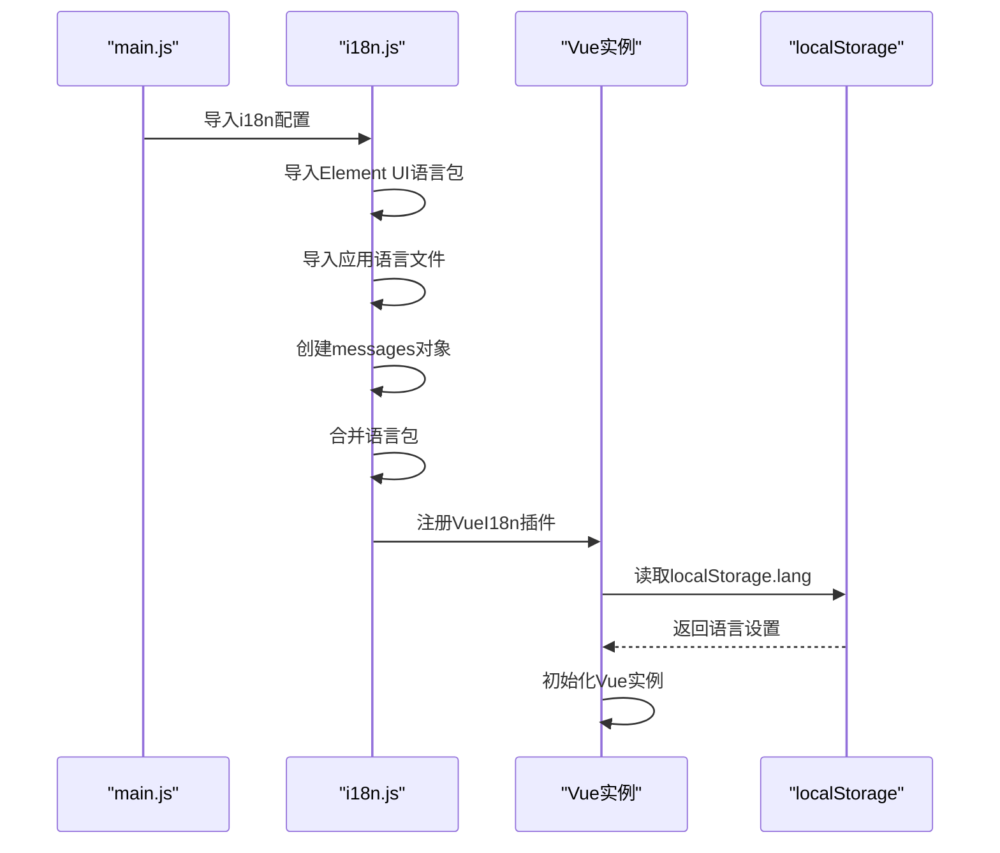
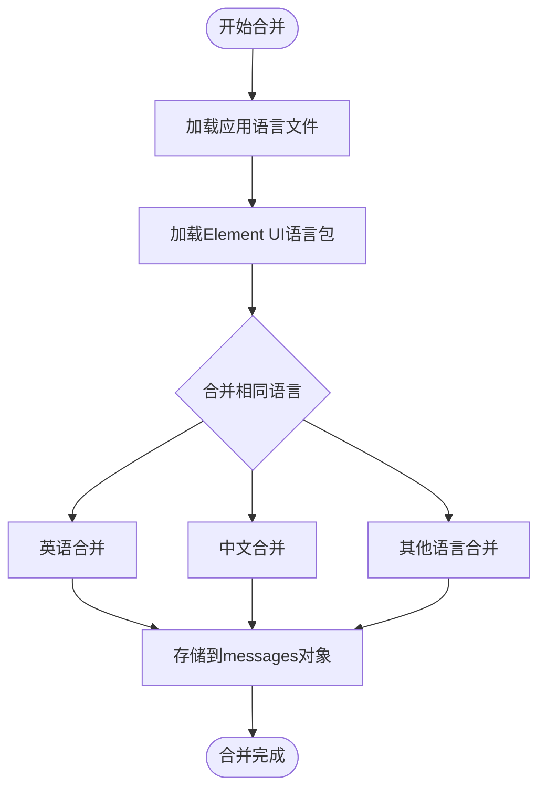
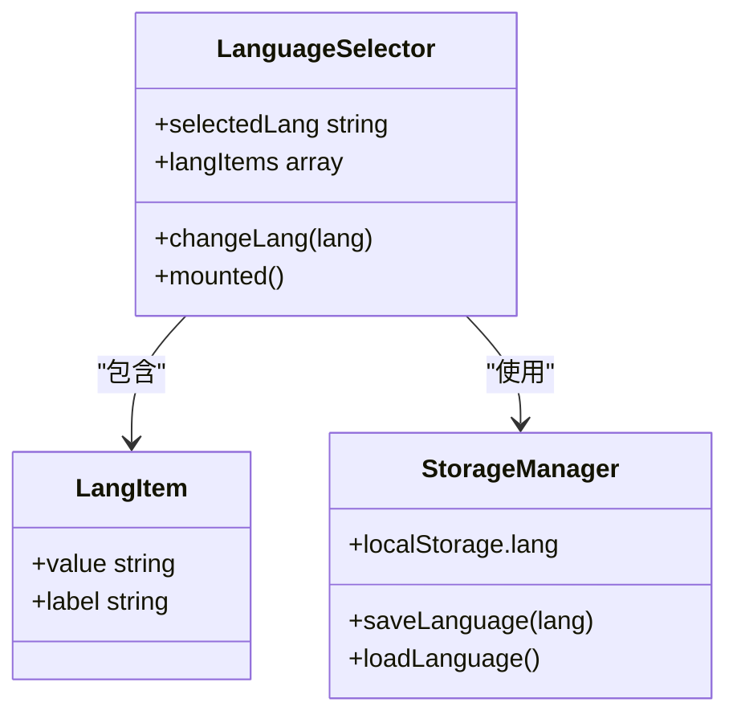
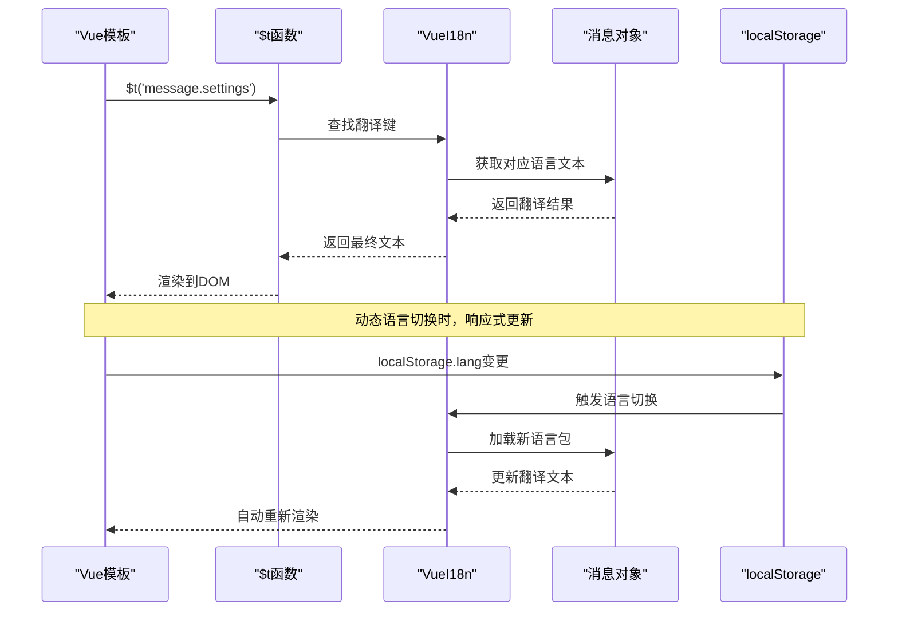
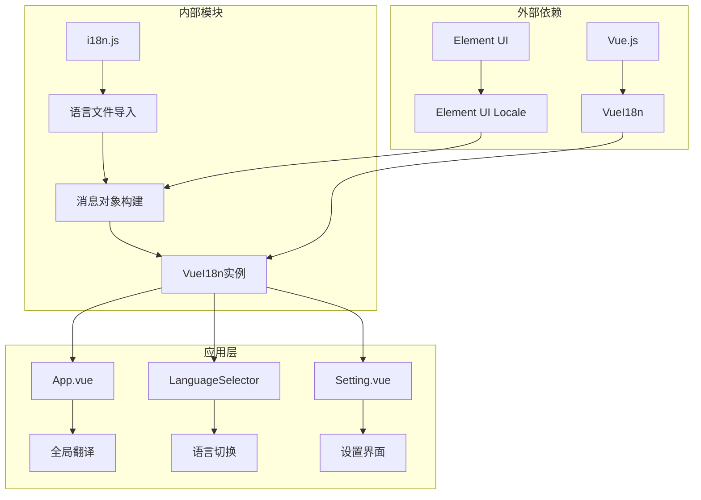

# 多语言支持

<cite>
**本文档引用的文件**
- [src/i18n/i18n.js](file://src/i18n/i18n.js)
- [src/i18n/langs/en.js](file://src/i18n/langs/en.js)
- [src/i18n/langs/cn.js](file://src/i18n/langs/cn.js)
- [src/i18n/langs/tw.js](file://src/i18n/langs/tw.js)
- [src/i18n/langs/de.js](file://src/i18n/langs/de.js)
- [src/i18n/langs/fr.js](file://src/i18n/langs/fr.js)
- [src/i18n/langs/it.js](file://src/i18n/langs/it.js)
- [src/i18n/langs/es.js](file://src/i18n/langs/es.js)
- [src/i18n/langs/ko.js](file://src/i18n/langs/ko.js)
- [src/i18n/langs/pt.js](file://src/i18n/langs/pt.js)
- [src/i18n/langs/ru.js](file://src/i18n/langs/ru.js)
- [src/i18n/langs/tr.js](file://src/i18n/langs/tr.js)
- [src/i18n/langs/ua.js](file://src/i18n/langs/ua.js)
- [src/i18n/langs/vi.js](file://src/i18n/langs/vi.js)
- [src/main.js](file://src/main.js)
- [src/App.vue](file://src/App.vue)
- [src/components/LanguageSelector.vue](file://src/components/LanguageSelector.vue)
- [src/components/Setting.vue](file://src/components/Setting.vue)
- [src/storage.js](file://src/storage.js)
</cite>

## 目录
1. [简介](#简介)
2. [项目结构](#项目结构)
3. [核心组件](#核心组件)
4. [架构概览](#架构概览)
5. [详细组件分析](#详细组件分析)
6. [依赖关系分析](#依赖关系分析)
7. [性能考虑](#性能考虑)
8. [故障排除指南](#故障排除指南)
9. [结论](#结论)

## 简介

Another Redis Desktop Manager采用了一套完整而灵活的多语言支持系统，基于VueI18n库构建，支持超过12种语言的国际化功能。该系统不仅提供了应用程序界面的多语言翻译，还集成了Element UI的本地化语言包，实现了开箱即用的国际化支持。

系统的核心设计理念是通过统一的消息管理机制，将应用文本与Element UI组件库的本地化文本无缝整合，同时提供动态语言切换和持久化存储功能。开发者可以轻松地添加新语言支持，只需在指定目录下创建对应的语言文件并进行简单的配置即可。

## 项目结构

多语言支持系统的文件组织结构清晰明确，主要分为以下几个部分：



**图表来源**
- [src/i18n/i18n.js](file://src/i18n/i18n.js#L1-L98)
- [src/i18n/langs/en.js](file://src/i18n/langs/en.js#L1-L282)
- [src/App.vue](file://src/App.vue#L1-L606)

**章节来源**
- [src/i18n/i18n.js](file://src/i18n/i18n.js#L1-L98)
- [src/i18n/langs/en.js](file://src/i18n/langs/en.js#L1-L282)

## 核心组件

### VueI18n核心配置

i18n.js文件是整个多语言系统的核心配置文件，负责初始化VueI18n实例并配置消息合并机制：



**图表来源**
- [src/i18n/i18n.js](file://src/i18n/i18n.js#L33-L97)

### 语言资源文件结构

每个语言文件都遵循统一的结构模式，包含message对象作为翻译键的根节点：



**图表来源**
- [src/i18n/langs/en.js](file://src/i18n/langs/en.js#L1-L282)
- [src/i18n/langs/cn.js](file://src/i18n/langs/cn.js#L1-L282)

**章节来源**
- [src/i18n/i18n.js](file://src/i18n/i18n.js#L33-L97)
- [src/i18n/langs/en.js](file://src/i18n/langs/en.js#L1-L282)

## 架构概览

多语言支持系统采用模块化架构设计，通过VueI18n提供核心国际化功能，结合Element UI的本地化包实现完整的界面翻译：

```mermaid
graph TB
subgraph "初始化阶段"
A[main.js] --> B[i18n.js配置]
B --> C[Vue.use(VueI18n)]
C --> D[消息对象合并]
end
subgraph "运行时机制"
E[Vue组件] --> F[$t函数调用]
F --> G[消息查找]
G --> H[语言切换]
H --> I[localStorage持久化]
end
subgraph "Element UI集成"
J[Element UI组件] --> K[自动翻译]
K --> L[本地化语言包]
L --> M[消息合并]
end
D --> E
I --> H
M --> G
```

**图表来源**
- [src/main.js](file://src/main.js#L1-L47)
- [src/i18n/i18n.js](file://src/i18n/i18n.js#L90-L97)

## 详细组件分析

### VueI18n初始化与配置

VueI18n的初始化过程包含了复杂的语言包合并逻辑，确保应用文本与Element UI组件库的本地化文本能够无缝集成：



**图表来源**
- [src/main.js](file://src/main.js#L24-L30)
- [src/i18n/i18n.js](file://src/i18n/i18n.js#L90-L97)

### 消息对象合并机制

系统采用了巧妙的消息合并策略，将应用自定义文本与Element UI的本地化文本进行深度整合：



**图表来源**
- [src/i18n/i18n.js](file://src/i18n/i18n.js#L35-L87)

### 语言选择器组件

LanguageSelector组件提供了用户友好的语言切换界面，支持13种语言的快速切换：



**图表来源**
- [src/components/LanguageSelector.vue](file://src/components/LanguageSelector.vue#L14-L45)

**章节来源**
- [src/i18n/i18n.js](file://src/i18n/i18n.js#L33-L97)
- [src/components/LanguageSelector.vue](file://src/components/LanguageSelector.vue#L14-L45)

### Vue模板中的翻译使用

在Vue模板中，开发者可以通过$t函数语法进行文本翻译，系统支持多种使用场景：



**图表来源**
- [src/App.vue](file://src/App.vue#L11-L77)
- [src/components/Setting.vue](file://src/components/Setting.vue#L3-L200)

**章节来源**
- [src/App.vue](file://src/App.vue#L11-L77)
- [src/components/Setting.vue](file://src/components/Setting.vue#L3-L200)

## 依赖关系分析

多语言支持系统的依赖关系复杂但层次清晰，涉及多个层面的集成：



**图表来源**
- [src/i18n/i18n.js](file://src/i18n/i18n.js#L1-L32)
- [src/main.js](file://src/main.js#L1-L22)

**章节来源**
- [src/i18n/i18n.js](file://src/i18n/i18n.js#L1-L32)
- [src/main.js](file://src/main.js#L1-L22)

## 性能考虑

多语言支持系统在设计时充分考虑了性能优化，采用了以下策略：

### 延迟加载机制
- 应用启动时只加载默认语言包
- 语言切换时动态加载对应语言文件
- Element UI语言包按需导入

### 缓存策略
- localStorage持久化语言设置
- 避免重复的语言包导入
- 组件级别的翻译缓存

### 内存优化
- 语言文件采用模块化导入
- 及时清理未使用的语言包
- 合理的内存使用模式

## 故障排除指南

### 常见问题及解决方案

#### 语言包未生效
**问题描述**: 切换语言后界面文本没有更新

**解决方案**:
1. 检查localStorage.lang设置是否正确
2. 确认语言文件是否正确导入
3. 验证消息对象结构是否完整

#### 字符编码错误
**问题描述**: 翻译文本出现乱码或特殊字符显示异常

**解决方案**:
1. 确保语言文件使用UTF-8编码
2. 检查特殊字符的转义处理
3. 验证字体支持情况

#### 翻译键缺失
**问题描述**: 某些文本未进行翻译，显示原始键名

**解决方案**:
1. 在对应语言文件中添加翻译键
2. 检查翻译键的嵌套结构
3. 验证翻译键的拼写准确性

**章节来源**
- [src/i18n/i18n.js](file://src/i18n/i18n.js#L90-L97)
- [src/storage.js](file://src/storage.js#L1-L329)

## 结论

Another Redis Desktop Manager的多语言支持系统展现了现代Web应用国际化功能的最佳实践。通过VueI18n与Element UI的深度集成，系统实现了完整的本地化解决方案，支持超过12种语言的无缝切换。

系统的主要优势包括：
- **开箱即用**: 集成Element UI语言包，无需额外配置
- **易于扩展**: 支持快速添加新语言，只需创建对应语言文件
- **响应式更新**: 语言切换时界面自动更新，用户体验流畅
- **持久化存储**: 用户语言偏好自动保存，提升使用体验

对于开发者而言，这套系统提供了清晰的扩展路径，可以轻松地添加新的语言支持或自定义翻译内容。同时，完善的错误处理和性能优化策略确保了系统的稳定性和高效性。