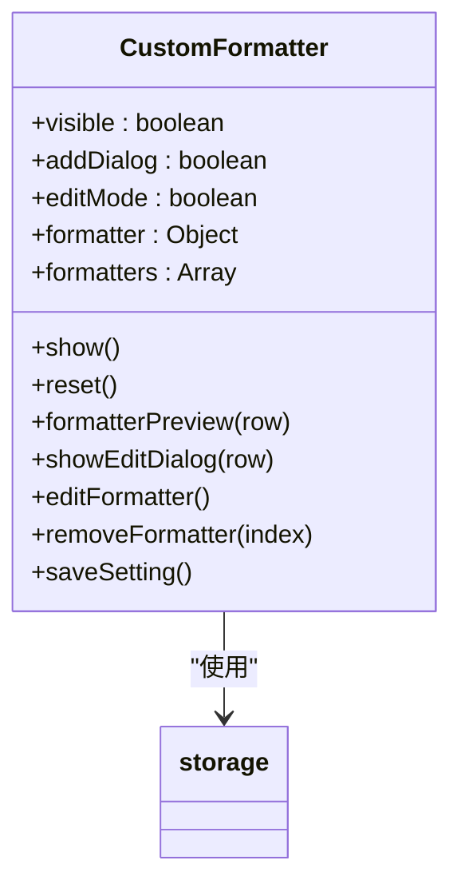
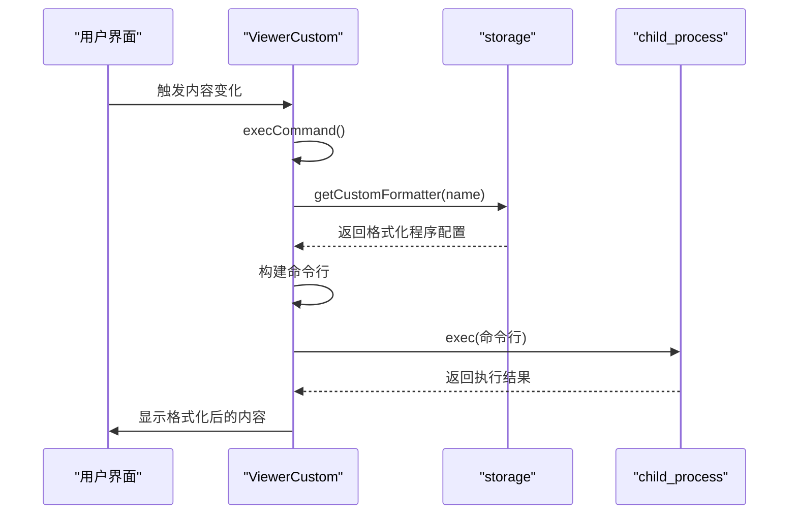
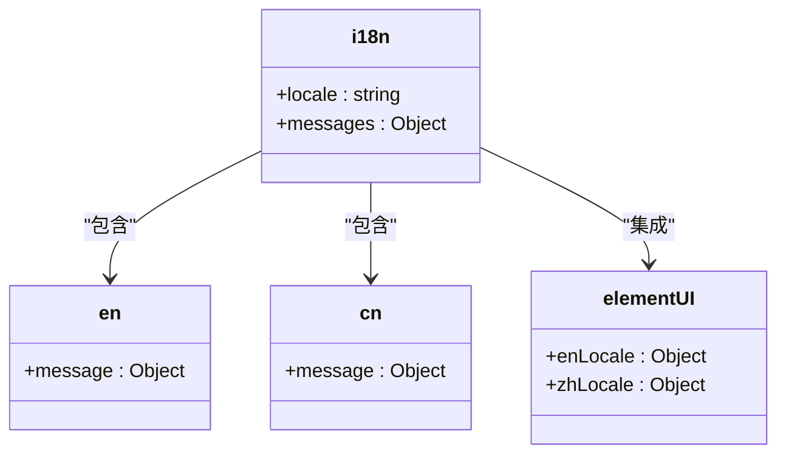
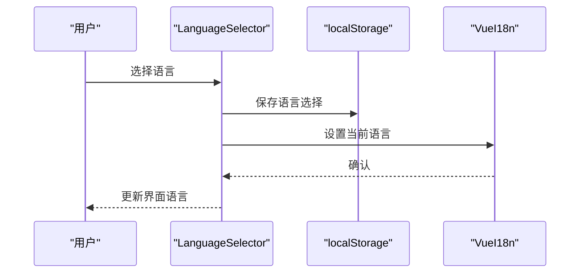
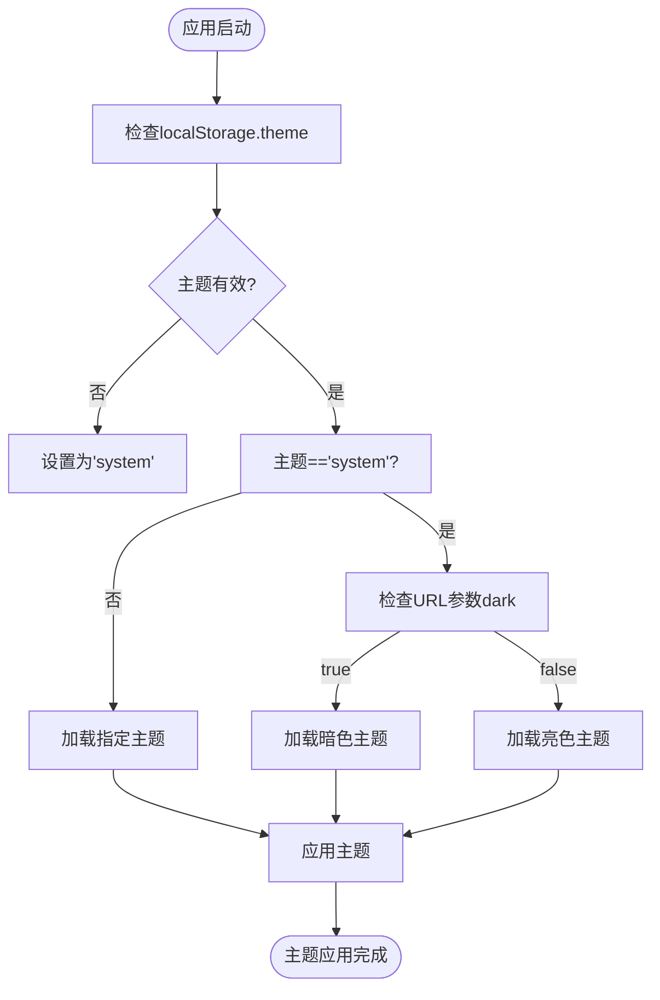
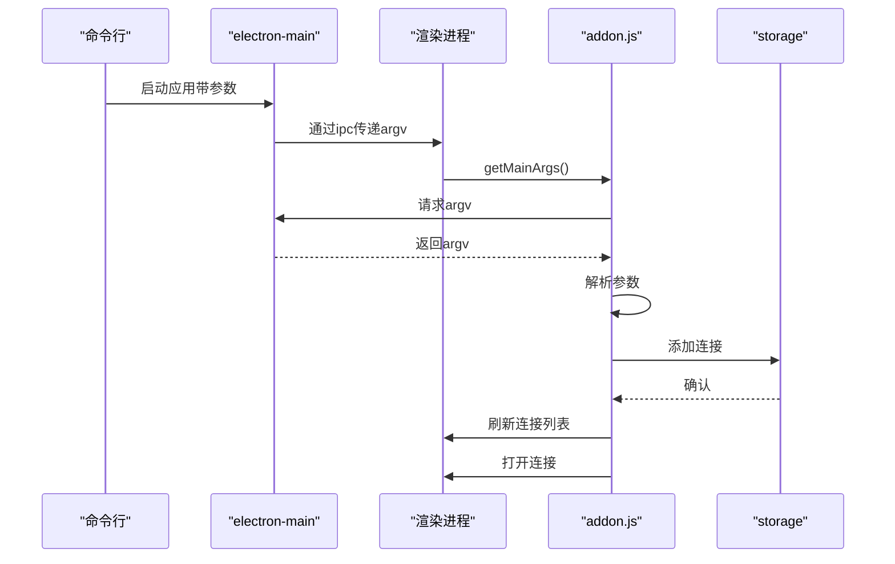

# 扩展功能

<cite>
**本文档中引用的文件**  
- [CustomFormatter.vue](file://src/components/CustomFormatter.vue)
- [ViewerCustom.vue](file://src/components/viewers/ViewerCustom.vue)
- [i18n.js](file://src/i18n/i18n.js)
- [cn.js](file://src/i18n/langs/cn.js)
- [en.js](file://src/i18n/langs/en.js)
- [LanguageSelector.vue](file://src/components/LanguageSelector.vue)
- [storage.js](file://src/storage.js)
- [addon.js](file://src/addon.js)
- [index.html](file://index.html)
- [electron-main.js](file://pack/electron/electron-main.js)
</cite>

## 目录
1. [简介](#简介)
2. [自定义查看器](#自定义查看器)
3. [多语言支持](#多语言支持)
4. [主题切换](#主题切换)
5. [命令行参数](#命令行参数)
6. [总结](#总结)

## 简介
Another Redis Desktop Manager 提供了多种扩展功能，允许开发者根据需要定制和扩展应用功能。本文档详细介绍了自定义查看器、多语言支持、主题切换和命令行参数等可扩展性特性，为希望定制和扩展应用功能的开发者提供清晰的API和集成指南。

## 自定义查看器
自定义查看器功能允许用户通过外部程序来格式化和查看Redis中的数据。这对于处理未内置支持的数据格式非常有用。

### CustomFormatter.vue 组件
`CustomFormatter.vue` 组件提供了用户界面来管理自定义格式化程序。用户可以添加、编辑和删除自定义格式化程序。

**图示来源**  
- [CustomFormatter.vue](file://src/components/CustomFormatter.vue#L1-L177)

**本节来源**  
- [CustomFormatter.vue](file://src/components/CustomFormatter.vue#L1-L177)
- [storage.js](file://src/storage.js#L165-L181)

### ViewerCustom.vue 组件
`ViewerCustom.vue` 组件负责执行自定义格式化程序并显示结果。它通过调用外部程序来处理数据，并将结果展示在界面上。

**图示来源**  
- [ViewerCustom.vue](file://src/components/viewers/ViewerCustom.vue#L1-L179)

**本节来源**  
- [ViewerCustom.vue](file://src/components/viewers/ViewerCustom.vue#L1-L179)
- [CustomFormatter.vue](file://src/components/CustomFormatter.vue#L48-L94)

## 多语言支持
应用通过Vue I18n实现了多语言支持，允许用户在不同语言之间切换。

### i18n 模块实现
`i18n.js` 文件配置了Vue I18n实例，加载了所有支持的语言包，并与Element UI的国际化支持集成。

**图示来源**  
- [i18n.js](file://src/i18n/i18n.js#L1-L98)

**本节来源**  
- [i18n.js](file://src/i18n/i18n.js#L1-L98)
- [cn.js](file://src/i18n/langs/cn.js#L1-L279)
- [en.js](file://src/i18n/langs/en.js#L1-L279)

### 语言选择器
`LanguageSelector.vue` 组件提供了用户界面来选择语言。用户选择语言后，应用会更新当前语言设置。

**图示来源**  
- [LanguageSelector.vue](file://src/components/LanguageSelector.vue#L1-L46)

**本节来源**  
- [LanguageSelector.vue](file://src/components/LanguageSelector.vue#L1-L46)
- [main.js](file://src/main.js#L5)

## 主题切换
应用支持主题切换功能，包括亮色模式、暗色模式和跟随系统设置。

### 主题切换实现
主题切换通过动态加载不同的CSS文件来实现。应用在启动时根据用户设置或系统设置加载相应的主题。

**图示来源**  
- [index.html](file://index.html#L1-L67)

**本节来源**  
- [index.html](file://index.html#L1-L67)
- [electron-main.js](file://pack/electron/electron-main.js#L74-L81)
- [App.vue](file://src/App.vue#L130)

## 命令行参数
应用支持通过命令行参数启动，并传递初始配置。

### 命令行参数处理
`addon.js` 文件中的 `bindCliArgs` 方法处理命令行参数，允许用户通过命令行指定连接配置。

**图示来源**  
- [addon.js](file://src/addon.js#L44-L122)

**本节来源**  
- [addon.js](file://src/addon.js#L44-L122)
- [electron-main.js](file://pack/electron/electron-main.js#L143-L146)

## 总结
Another Redis Desktop Manager 提供了丰富的扩展功能，包括自定义查看器、多语言支持、主题切换和命令行参数。这些功能使得应用更加灵活和可定制，能够满足不同用户的需求。开发者可以通过本文档了解如何利用这些扩展功能来定制和扩展应用。