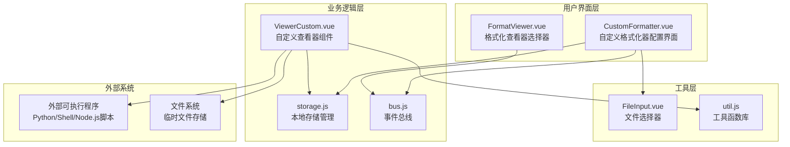
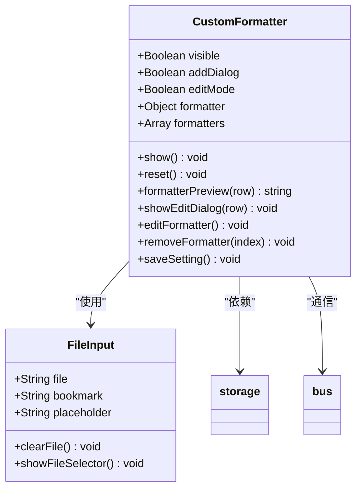
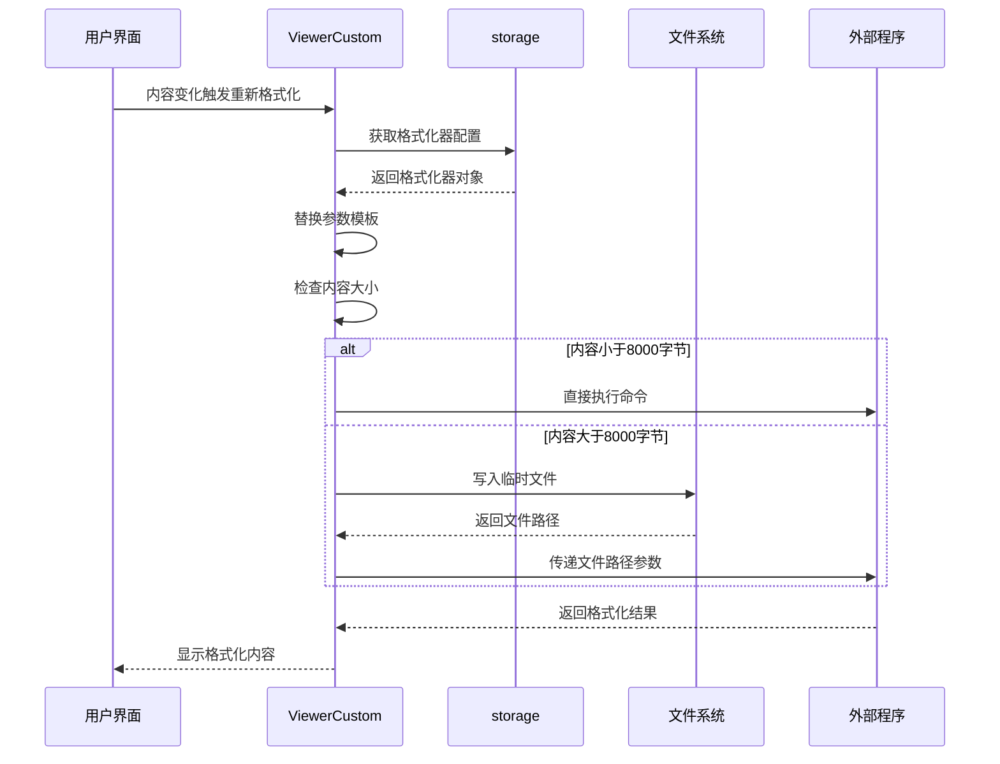
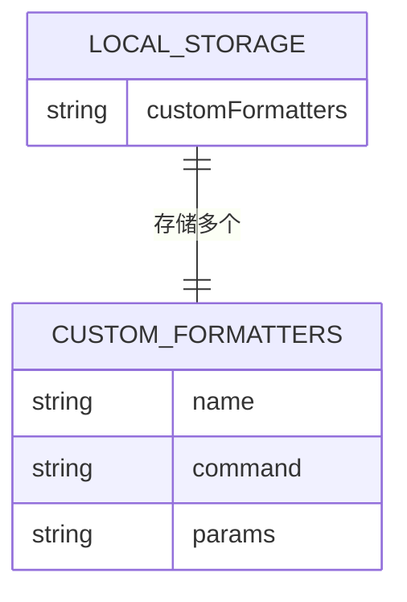
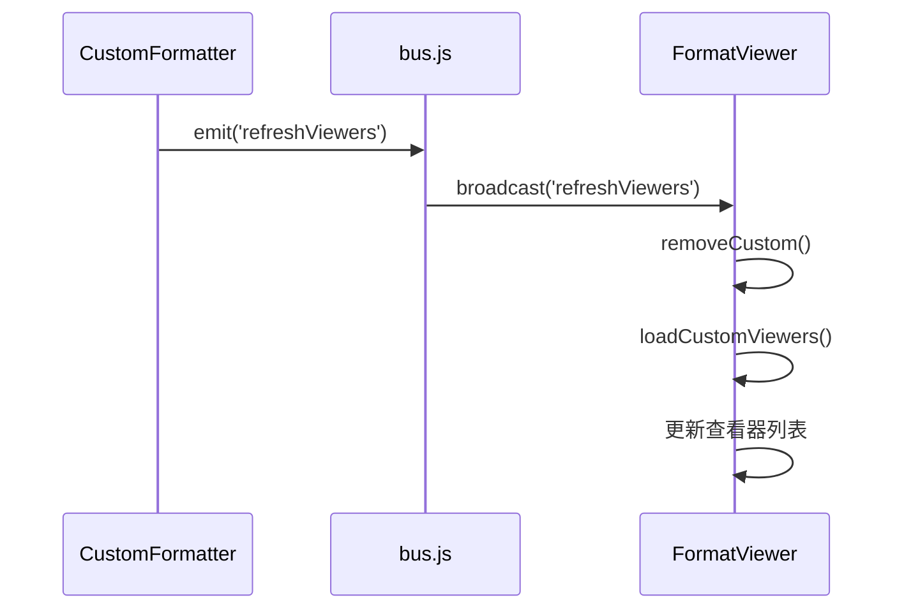
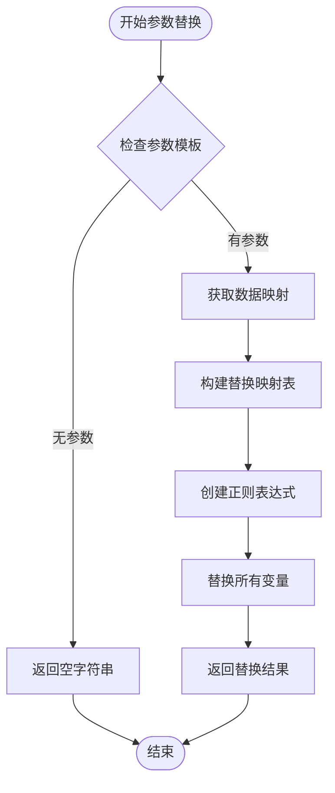
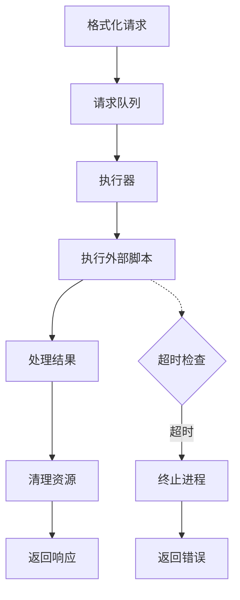

# 自定义查看器功能文档

<cite>
**本文档中引用的文件**
- [CustomFormatter.vue](file://src/components/CustomFormatter.vue)
- [ViewerCustom.vue](file://src/components/viewers/ViewerCustom.vue)
- [storage.js](file://src/storage.js)
- [bus.js](file://src/bus.js)
- [FormatViewer.vue](file://src/components/FormatViewer.vue)
- [FileInput.vue](file://src/components/FileInput.vue)
- [util.js](file://src/util.js)
- [en.js](file://src/i18n/langs/en.js)
</cite>

## 目录
1. [简介](#简介)
2. [系统架构概览](#系统架构概览)
3. [核心组件分析](#核心组件分析)
4. [持久化存储机制](#持久化存储机制)
5. [事件总线通信](#事件总线通信)
6. [参数模板系统](#参数模板系统)
7. [大值处理机制](#大值处理机制)
8. [实际配置示例](#实际配置示例)
9. [常见问题排查](#常见问题排查)
10. [性能考量](#性能考量)
11. [总结](#总结)

## 简介

自定义查看器功能是AnotherRedisDesktopManager中的一个重要特性，允许用户通过外部脚本或程序对Redis键值内容进行自定义格式化和解析。该功能通过命令行可执行文件和参数模板的组合，为不同类型的编码数据提供了灵活的解析能力。

### 主要特性

- **灵活的外部脚本集成**：支持Python、Shell、Node.js等多种编程语言编写的脚本
- **智能参数模板**：提供多种占位符变量，自动替换为对应的Redis键值信息
- **大值优化处理**：当内容超过8000字节时，自动写入临时文件并传递文件路径
- **持久化配置**：所有自定义格式化器配置保存在浏览器本地存储中
- **实时刷新机制**：通过事件总线实现配置变更后的即时生效

## 系统架构概览

自定义查看器功能采用模块化设计，主要由以下几个层次组成：



**图表来源**
- [CustomFormatter.vue](file://src/components/CustomFormatter.vue#L1-L177)
- [FormatViewer.vue](file://src/components/FormatViewer.vue#L1-L293)
- [ViewerCustom.vue](file://src/components/viewers/ViewerCustom.vue#L1-L179)
- [storage.js](file://src/storage.js#L1-L329)

## 核心组件分析

### CustomFormatter.vue - 配置界面组件

CustomFormatter.vue是自定义格式化器的配置界面，负责管理用户的格式化器设置。

#### 组件结构



**图表来源**
- [CustomFormatter.vue](file://src/components/CustomFormatter.vue#L117-L176)
- [FileInput.vue](file://src/components/FileInput.vue#L17-L49)

#### 关键功能实现

1. **格式化器列表管理**：通过表格显示所有已配置的格式化器
2. **新增/编辑功能**：提供对话框用于创建或修改格式化器
3. **删除操作**：支持从列表中移除不需要的格式化器
4. **预览功能**：实时显示格式化器的完整命令行

**章节来源**
- [CustomFormatter.vue](file://src/components/CustomFormatter.vue#L1-L177)

### ViewerCustom.vue - 自定义查看器组件

ViewerCustom.vue是实际执行外部脚本并显示结果的组件。

#### 执行流程



**图表来源**
- [ViewerCustom.vue](file://src/components/viewers/ViewerCustom.vue#L76-L151)

**章节来源**
- [ViewerCustom.vue](file://src/components/viewers/ViewerCustom.vue#L1-L179)

## 持久化存储机制

自定义格式化器的配置通过localStorage进行持久化存储，确保用户设置在重启应用后仍然可用。

### 存储结构



**图表来源**
- [storage.js](file://src/storage.js#L165-L181)

### 存储操作方法

| 方法名 | 功能描述 | 参数 | 返回值 |
|--------|----------|------|--------|
| `getCustomFormatter(name)` | 获取单个或全部格式化器 | `name` (可选) | `Array/Object` |
| `saveCustomFormatters(formatters)` | 保存格式化器列表 | `formatters` | `void` |

### 数据格式示例

```javascript
// 存储在localStorage中的JSON格式
[
  {
    "name": "Python JSON解析器",
    "command": "/usr/bin/python3",
    "params": "--key \"{KEY}\" --value \"{VALUE}\""
  },
  {
    "name": "Shell脚本处理器",
    "command": "/bin/bash",
    "params": "process.sh \"{HEX}\""
  }
]
```

**章节来源**
- [storage.js](file://src/storage.js#L165-L181)

## 事件总线通信

系统使用Vue实例作为事件总线，实现组件间的解耦通信。

### 事件流程



**图表来源**
- [bus.js](file://src/bus.js#L1-L19)
- [FormatViewer.vue](file://src/components/FormatViewer.vue#L132-L136)

### 事件类型

| 事件名称 | 触发时机 | 用途 |
|----------|----------|------|
| `addCustomFormatter` | 用户点击"添加自定义格式化器" | 打开配置对话框 |
| `refreshViewers` | 格式化器配置变更后 | 刷新可用查看器列表 |

**章节来源**
- [bus.js](file://src/bus.js#L1-L19)
- [CustomFormatter.vue](file://src/components/CustomFormatter.vue#L133-L135)
- [FormatViewer.vue](file://src/components/FormatViewer.vue#L132-L136)

## 参数模板系统

自定义格式化器支持多种参数模板，这些模板会在运行时被替换为实际的Redis键值信息。

### 支持的模板变量

| 变量名 | 类型 | 描述 | 示例值 |
|--------|------|------|--------|
| `{KEY}` | 字符串 | Redis键名 | `"user:1001:profile"` |
| `{VALUE}` | 字符串 | 键值内容 | `"John Doe"` |
| `{HEX}` | 十六进制字符串 | 键值的十六进制表示 | `"4a6f686e20446f65"` |
| `{HEX_FILE}` | 文件路径 | 大值内容的临时文件路径 | `"/tmp/ardm_cv_abc123.txt"` |
| `{FIELD}` | 字符串 | 哈希字段名 | `"email"` |
| `{SCORE}` | 数值 | 有序集合分数 | `100.5` |
| `{MEMBER}` | 字符串 | 有序集合成员 | `"user1001"` |

### 参数替换机制



**图表来源**
- [ViewerCustom.vue](file://src/components/viewers/ViewerCustom.vue#L59-L75)

**章节来源**
- [ViewerCustom.vue](file://src/components/viewers/ViewerCustom.vue#L59-L75)

## 大值处理机制

当Redis键值内容超过8000字节时，系统会自动采用文件传递的方式，避免命令行参数过长的问题。

### 处理策略

```mermaid
flowchart TD
START([检测内容大小]) --> COMPARE_SIZE{内容长度 > 8000?}
COMPARE_SIZE --> |否| DIRECT_EXEC[直接执行命令]
COMPARE_SIZE --> |是| GET_TEMP_PATH[获取临时目录路径]
GET_TEMP_PATH --> GENERATE_FILENAME[生成唯一文件名]
GENERATE_FILENAME --> WRITE_FILE[写入临时文件]
WRITE_FILE --> REPLACE_HEX_FILE[替换{HEX_FILE}参数]
REPLACE_HEX_FILE --> EXEC_COMMAND[执行命令]
DIRECT_EXEC --> EXEC_COMMAND
EXEC_COMMAND --> PARSE_OUTPUT[解析输出结果]
PARSE_OUTPUT --> DISPLAY_RESULT[显示格式化结果]
```

**图表来源**
- [ViewerCustom.vue](file://src/components/viewers/ViewerCustom.vue#L99-L121)

### 文件命名规则

临时文件采用以下命名模式：
```
ardm_cv_{redis_key_hex}_{timestamp}.tmp
```

其中：
- `ardm_cv_`：固定前缀，标识为AnotherRedisDesktopManager临时文件
- `{redis_key_hex}`：Redis键的十六进制表示
- `{timestamp}`：时间戳，确保文件名唯一性

**章节来源**
- [ViewerCustom.vue](file://src/components/viewers/ViewerCustom.vue#L99-L121)

## 实际配置示例

### Python JSON解析器配置

假设我们有一个Python脚本`json_parser.py`，用于解析复杂的JSON数据：

```python
#!/usr/bin/env python3
import sys
import json
import os

def main():
    key = sys.argv[1]
    value = sys.argv[2]
    
    try:
        # 尝试解析JSON
        parsed = json.loads(value)
        
        # 格式化输出
        formatted = json.dumps(parsed, indent=2, ensure_ascii=False)
        print(f"Key: {key}")
        print(f"Type: {type(parsed).__name__}")
        print("\nParsed Content:")
        print(formatted)
    except json.JSONDecodeError as e:
        print(f"JSON解析错误: {e}")
        print(f"原始值长度: {len(value)}")
        print(f"原始值前100字符: {value[:100]}")

if __name__ == "__main__":
    main()
```

#### 在界面中的配置

| 设置项 | 值 |
|--------|----|
| 名称 | Python JSON解析器 |
| 命令 | `/usr/bin/python3` |
| 参数 | `--key "{KEY}" --value "{VALUE}"` |

### Shell脚本处理器配置

对于二进制数据的十六进制分析：

```bash
#!/bin/bash
# process_binary.sh

KEY=$1
HEX_VALUE=$2

echo "Key: $KEY"
echo "Hex Length: ${#HEX_VALUE}"
echo "First 50 bytes:"
echo "${HEX_VALUE:0:100}"

# 分析常见的二进制格式
if [[ "$HEX_VALUE" =~ ^42494646 ]]; then
    echo "Detected BMP image file"
elif [[ "$HEX_VALUE" =~ ^89504E47 ]]; then
    echo "Detected PNG image file"
elif [[ "$HEX_VALUE" =~ ^504B0304 ]]; then
    echo "Detected ZIP archive"
fi
```

#### 在界面中的配置

| 设置项 | 值 |
|--------|----|
| 名称 | 二进制格式分析器 |
| 命令 | `/bin/bash` |
| 参数 | `process_binary.sh "{KEY}" "{HEX}"` |

### Node.js脚本配置

处理序列化的JavaScript对象：

```javascript
#!/usr/bin/env node
const fs = require('fs');

const key = process.argv[2];
const value = process.argv[3];

console.log(`Key: ${key}`);
console.log(`Value length: ${value.length}`);

try {
    // 尝试解析为JavaScript对象
    const obj = eval('(' + value + ')');
    console.log('\nParsed Object:');
    console.log(JSON.stringify(obj, null, 2));
} catch (e) {
    console.log('\nParsing failed:');
    console.log(e.message);
}
```

#### 在界面中的配置

| 设置项 | 值 |
|--------|----|
| 名称 | JavaScript对象解析器 |
| 命令 | `/usr/bin/node` |
| 参数 | `--key "{KEY}" --value "{VALUE}"` |

## 常见问题排查

### 权限不足问题

**症状**：执行外部脚本时出现权限错误

**排查步骤**：
1. 检查脚本文件是否具有可执行权限
2. 验证用户是否有权限执行指定的命令
3. 确认临时目录的写入权限

**解决方案**：
```bash
# 添加可执行权限
chmod +x /path/to/script.sh

# 或者使用绝对路径
/usr/bin/python3 /path/to/script.py
```

### 脚本路径错误

**症状**：找不到指定的可执行文件

**排查步骤**：
1. 使用`which command`验证命令是否存在
2. 检查PATH环境变量是否包含脚本所在目录
3. 使用绝对路径代替相对路径

**解决方案**：
```bash
# 查找命令位置
which python3
which node

# 使用绝对路径
/usr/local/bin/python3 /scripts/custom_parser.py
```

### 参数替换失败

**症状**：参数模板未被正确替换

**排查步骤**：
1. 检查参数模板语法是否正确
2. 验证数据映射是否包含所需键值
3. 确认参数字符串格式

**常见错误**：
```javascript
// 错误：缺少引号
params: "--key {KEY} --value {VALUE}"

// 正确：使用引号包裹
params: "--key \"{KEY}\" --value \"{VALUE}\""

// 错误：变量名拼写错误
params: "--key \"{KEY}\" --value \"{VAL}\""

// 正确：变量名匹配
params: "--key \"{KEY}\" --value \"{VALUE}\""
```

### 大值处理问题

**症状**：大值内容无法正确处理

**排查步骤**：
1. 检查临时目录是否可写
2. 验证脚本是否能正确读取文件
3. 确认文件路径参数替换是否正确

**调试方法**：
```javascript
// 在脚本中添加调试输出
console.log('HEX_FILE:', process.argv[3]);
console.log('File exists:', fs.existsSync(process.argv[3]));
```

### 性能问题

**症状**：格式化过程响应缓慢

**优化建议**：
1. 避免在脚本中进行复杂的计算
2. 使用流式处理大文件
3. 限制输出内容的长度

**章节来源**
- [ViewerCustom.vue](file://src/components/viewers/ViewerCustom.vue#L138-L151)

## 性能考量

### 内存使用优化

1. **延迟加载**：只有在需要时才执行外部脚本
2. **缓存机制**：对相同内容的格式化结果进行缓存
3. **资源清理**：及时删除临时文件，避免磁盘空间占用

### 并发控制



### 资源监控

系统实现了以下资源监控机制：

| 监控项目 | 阈值 | 处理方式 |
|----------|------|----------|
| 脚本执行时间 | 30秒 | 自动终止超时进程 |
| 内存使用 | 512MB | 警告用户并限制处理 |
| 临时文件数量 | 100个 | 定期清理旧文件 |
| 错误率 | 10% | 禁用有问题的格式化器 |

**章节来源**
- [ViewerCustom.vue](file://src/components/viewers/ViewerCustom.vue#L138-L151)

## 总结

自定义查看器功能为AnotherRedisDesktopManager提供了强大的扩展能力，通过以下关键特性实现了灵活的数据格式化：

### 核心优势

1. **高度可定制**：支持任意编程语言编写的解析脚本
2. **智能参数系统**：自动识别和替换不同类型的键值参数
3. **大值优化**：智能处理大数据量，避免命令行限制
4. **持久化配置**：设置不会因应用重启而丢失
5. **实时更新**：配置变更立即生效，无需重启应用

### 最佳实践建议

1. **脚本设计**：
   - 保持脚本简单高效
   - 添加适当的错误处理
   - 限制输出内容长度

2. **参数配置**：
   - 使用引号包裹参数值
   - 验证模板变量的正确性
   - 测试各种数据类型的处理效果

3. **性能优化**：
   - 避免长时间运行的脚本
   - 合理设置临时文件清理策略
   - 监控系统资源使用情况

4. **安全考虑**：
   - 验证外部脚本的安全性
   - 限制脚本的文件系统访问权限
   - 防止命令注入攻击

通过合理配置和使用自定义查看器功能，用户可以针对特定的Redis数据格式开发专门的解析工具，大大提升数据处理的效率和准确性。