# Redis客户端管理

<cite>
**本文档中引用的文件**
- [redisClient.js](file://src/redisClient.js)
- [main.js](file://src/main.js)
- [storage.js](file://src/storage.js)
- [commands.js](file://src/commands.js)
- [addon.js](file://src/addon.js)
- [NewConnectionDialog.vue](file://src/components/NewConnectionDialog.vue)
- [CommandLog.vue](file://src/components/CommandLog.vue)
- [CommandLogPanel.vue](file://src/components/CommandLogPanel.vue)
</cite>

## 目录
1. [简介](#简介)
2. [项目结构](#项目结构)
3. [核心组件](#核心组件)
4. [架构概览](#架构概览)
5. [详细组件分析](#详细组件分析)
6. [依赖关系分析](#依赖关系分析)
7. [性能考虑](#性能考虑)
8. [故障排除指南](#故障排除指南)
9. [结论](#结论)

## 简介

Redis客户端管理模块是Another Redis Desktop Manager的核心组件，负责封装ioredis客户端以支持多种Redis部署模式。该模块提供了统一的接口来处理单机、集群、哨兵以及SSH隧道等复杂的连接场景，同时实现了命令拦截机制、SSL/TLS加密支持和智能重试策略。

## 项目结构

该项目采用模块化架构设计，主要文件组织如下：

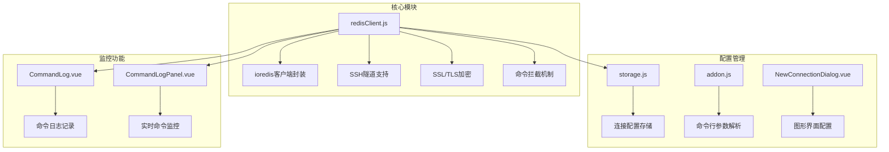

**图表来源**
- [redisClient.js](file://src/redisClient.js#L1-L381)
- [storage.js](file://src/storage.js#L1-L200)

**章节来源**
- [redisClient.js](file://src/redisClient.js#L1-L50)
- [storage.js](file://src/storage.js#L1-L100)

## 核心组件

### 主要导出对象

Redis客户端管理模块导出了一个默认对象，包含以下核心方法：

| 方法名 | 功能描述 | 参数说明 |
|--------|----------|----------|
| createConnection | 创建Redis连接实例 | host, port, auth, config, promise, forceStandalone, removeDb |
| createSSHConnection | 建立SSH隧道连接 | sshOptions, host, port, auth, config |
| getRedisOptions | 获取Redis连接选项 | host, port, auth, config |
| getSentinelOptions | 获取哨兵连接选项 | host, port, auth, config |
| getClusterOptions | 获取集群连接选项 | redisOptions, natMap |
| getTLSOptions | 获取SSL/TLS配置 | options |
| retryStragety | 连接重试策略 | times, connection |

### 命令拦截机制

系统通过重写`sendCommand`方法实现了强大的命令拦截功能：

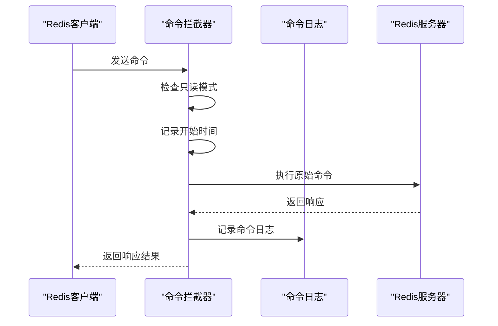

**图表来源**
- [redisClient.js](file://src/redisClient.js#L11-L38)

**章节来源**
- [redisClient.js](file://src/redisClient.js#L51-L88)
- [redisClient.js](file://src/redisClient.js#L11-L38)

## 架构概览

### 连接模式架构

系统支持四种主要的Redis连接模式：

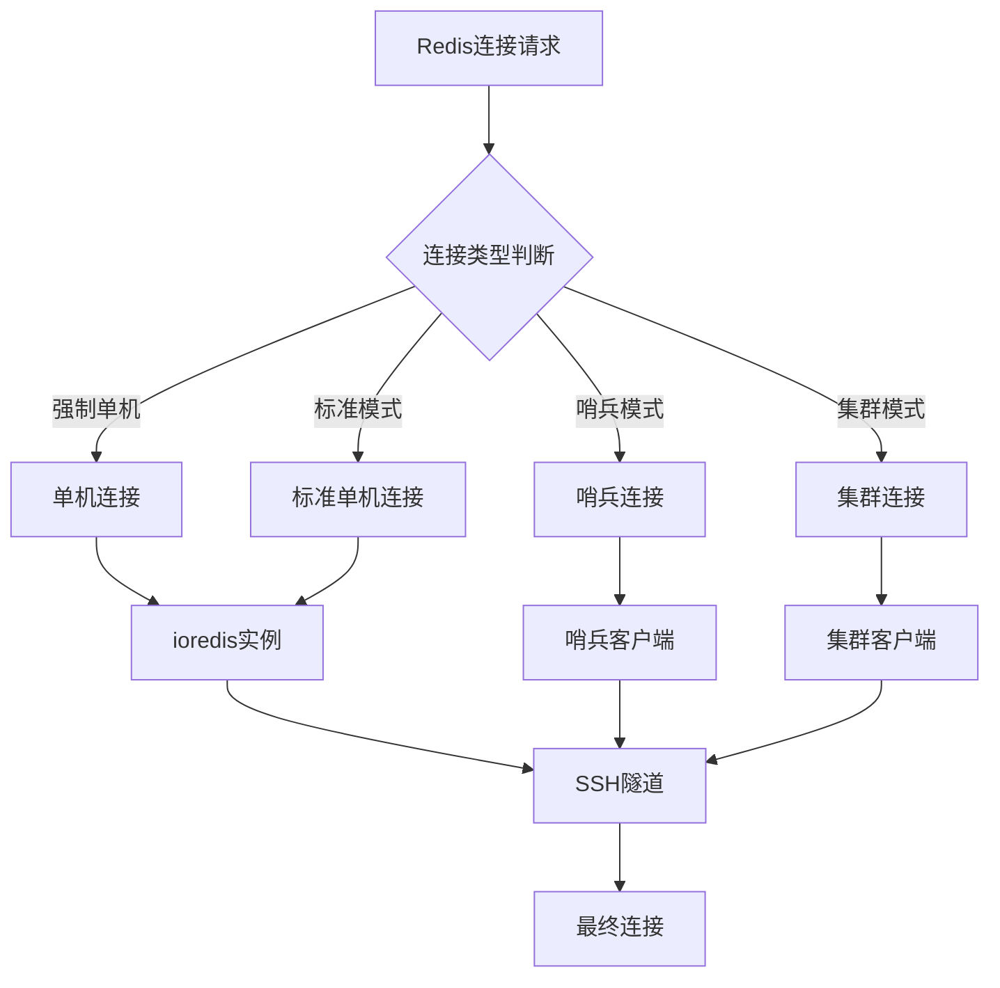

**图表来源**
- [redisClient.js](file://src/redisClient.js#L52-L87)

### SSH隧道架构

SSH隧道支持为远程Redis服务提供了安全的连接通道：

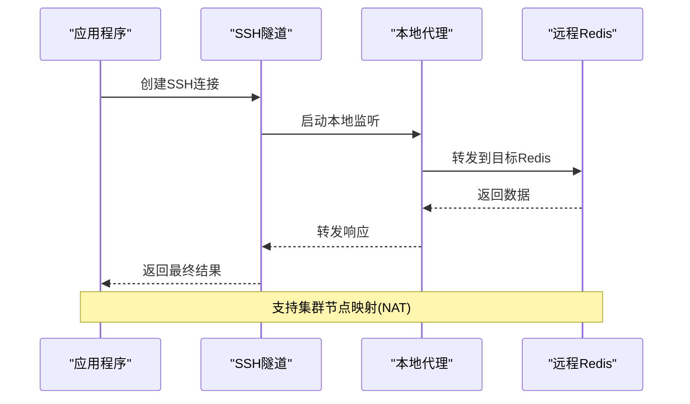

**图表来源**
- [redisClient.js](file://src/redisClient.js#L90-L163)

**章节来源**
- [redisClient.js](file://src/redisClient.js#L90-L163)

## 详细组件分析

### createConnection方法详解

`createConnection`方法是连接管理的核心入口，根据配置自动选择合适的连接模式：

#### 单机连接流程

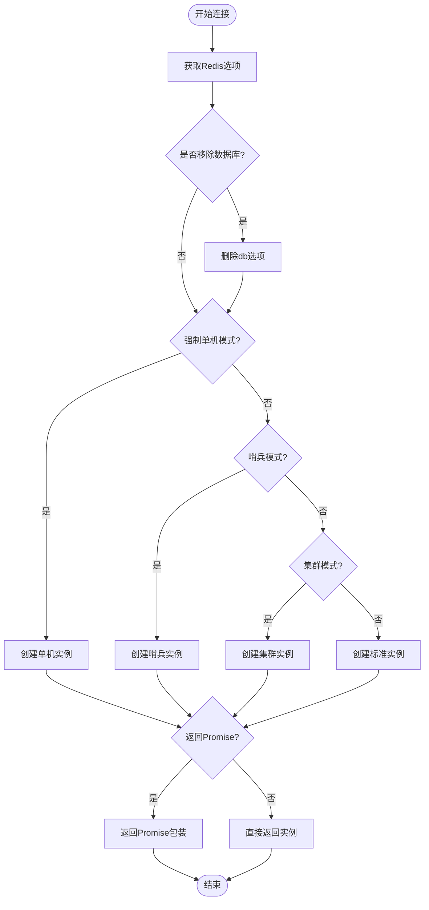

**图表来源**
- [redisClient.js](file://src/redisClient.js#L52-L87)

#### 配置选项详解

| 配置项 | 类型 | 默认值 | 描述 |
|--------|------|--------|------|
| host | string | - | Redis服务器主机地址 |
| port | number | 6379 | Redis服务器端口 |
| family | number | 0 | IP版本(0=IPv4/IPv6) |
| connectTimeout | number | 30000 | 连接超时时间(毫秒) |
| retryStrategy | function | - | 重试策略函数 |
| enableReadyCheck | boolean | false | 是否启用就绪检查 |
| connectionName | string | null | 连接名称标识 |
| password | string | - | 认证密码 |
| db | number | undefined | 数据库索引 |
| username | string | undefined | ACL用户名 |
| tls | object | undefined | SSL/TLS配置 |
| connectionReadOnly | boolean | undefined | 只读模式 |
| stringNumbers | boolean | true | 数字字符串化 |

**章节来源**
- [redisClient.js](file://src/redisClient.js#L203-L222)

### SSH连接实现

SSH隧道功能通过`tunnel-ssh`库实现，支持复杂的网络拓扑：

#### SSH连接类型处理

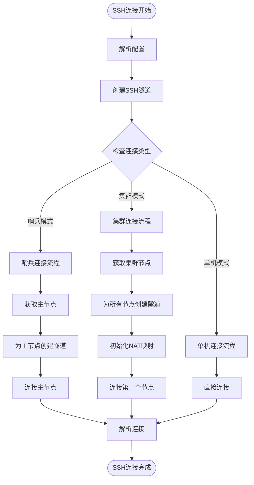

**图表来源**
- [redisClient.js](file://src/redisClient.js#L90-L163)

#### NAT映射机制

SSH隧道中的NAT映射解决了集群节点间通信的问题：

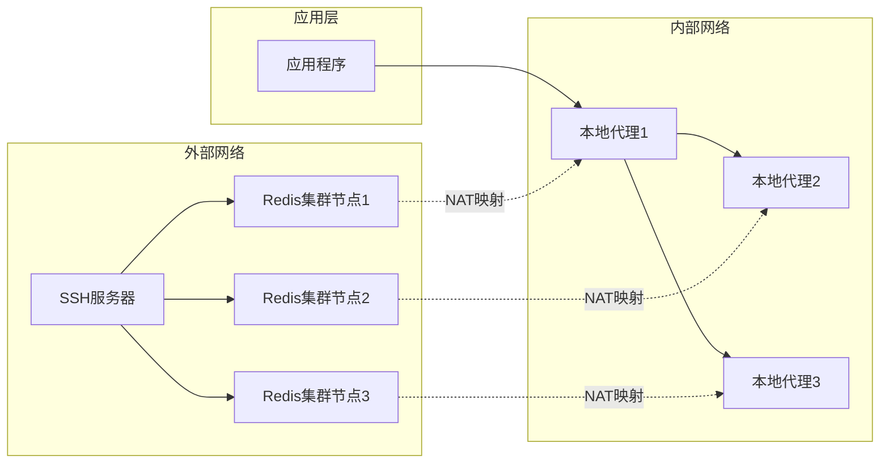

**图表来源**
- [redisClient.js](file://src/redisClient.js#L315-L322)

**章节来源**
- [redisClient.js](file://src/redisClient.js#L90-L163)
- [redisClient.js](file://src/redisClient.js#L277-L322)

### SSL/TLS加密支持

系统提供了完整的SSL/TLS加密支持，确保数据传输安全：

#### 证书读取机制

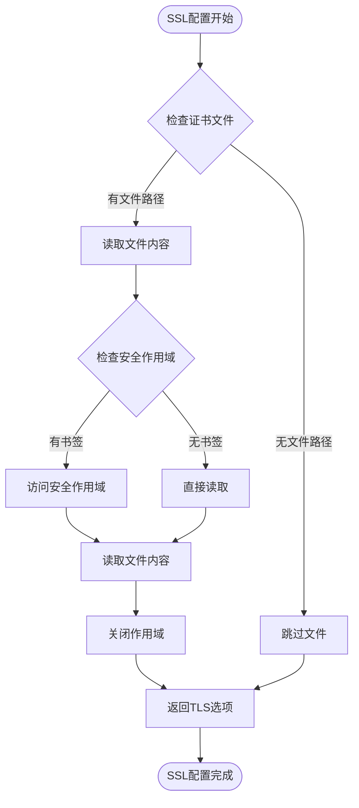

**图表来源**
- [redisClient.js](file://src/redisClient.js#L357-L379)

#### 安全作用域资源访问

系统支持macOS App Store版本的安全作用域资源访问：

| 操作 | 平台支持 | 实现方式 |
|------|----------|----------|
| 读取证书文件 | macOS | Security Scoped Bookmarks |
| 读取私钥文件 | macOS | Security Scoped Bookmarks |
| 读取CA证书 | macOS | Security Scoped Bookmarks |
| 文件权限验证 | 全平台 | 异常捕获机制 |

**章节来源**
- [redisClient.js](file://src/redisClient.js#L325-L342)
- [redisClient.js](file://src/redisClient.js#L357-L379)

### 命令拦截机制

命令拦截机制实现了两个重要功能：只读模式控制和命令日志记录：

#### 只读模式控制

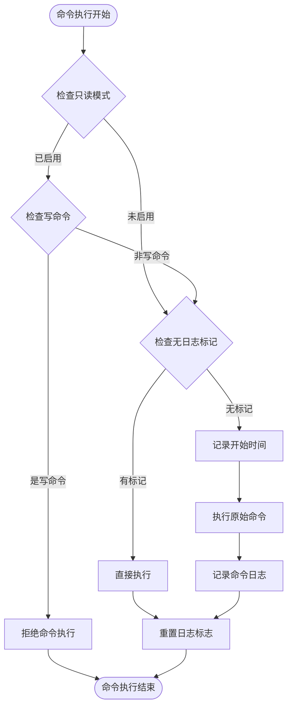

**图表来源**
- [redisClient.js](file://src/redisClient.js#L11-L38)

#### 命令分类系统

系统维护了一个完整的命令分类体系：

| 命令类别 | 包含命令数量 | 功能描述 |
|----------|--------------|----------|
| 管理命令(adminCMD) | 18个 | 系统管理相关命令 |
| 只读命令(readCMD) | 100+个 | 数据查询类命令 |
| 写入命令(writeCMD) | 80+个 | 数据修改类命令 |

**章节来源**
- [redisClient.js](file://src/redisClient.js#L11-L38)
- [commands.js](file://src/commands.js#L1-L200)

### 连接重试策略

系统实现了智能的连接重试机制，确保连接稳定性：

#### 重试策略算法

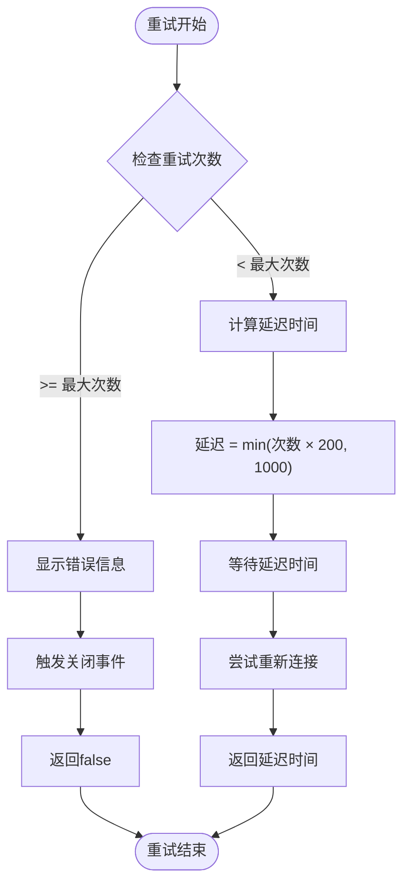

**图表来源**
- [redisClient.js](file://src/redisClient.js#L344-L355)

#### 超时配置

| 配置项 | 默认值 | 说明 |
|--------|--------|------|
| 连接超时 | 30000ms | 建立连接的最大等待时间 |
| 重试最大次数 | 3次 | 连接失败后的最大重试次数 |
| 延迟计算 | min(times × 200, 1000) | 指数退避算法 |
| 集群槽刷新超时 | 30000ms | 集群槽信息刷新超时时间 |

**章节来源**
- [redisClient.js](file://src/redisClient.js#L344-L355)

## 依赖关系分析

### 外部依赖

系统依赖以下关键库：

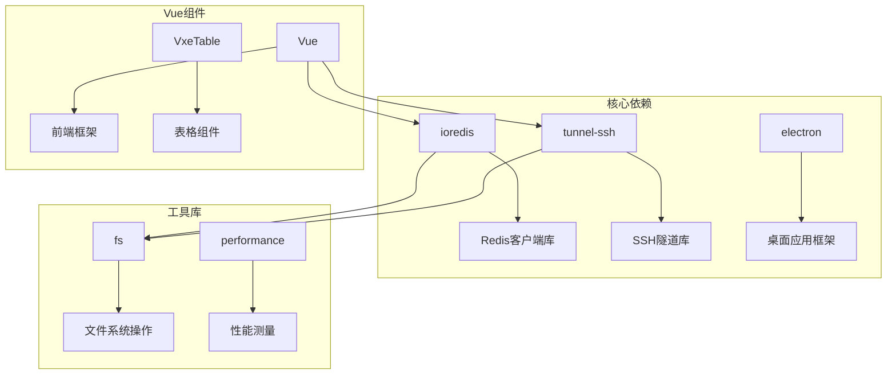

**图表来源**
- [redisClient.js](file://src/redisClient.js#L1-L8)
- [main.js](file://src/main.js#L1-L47)

### 内部模块依赖

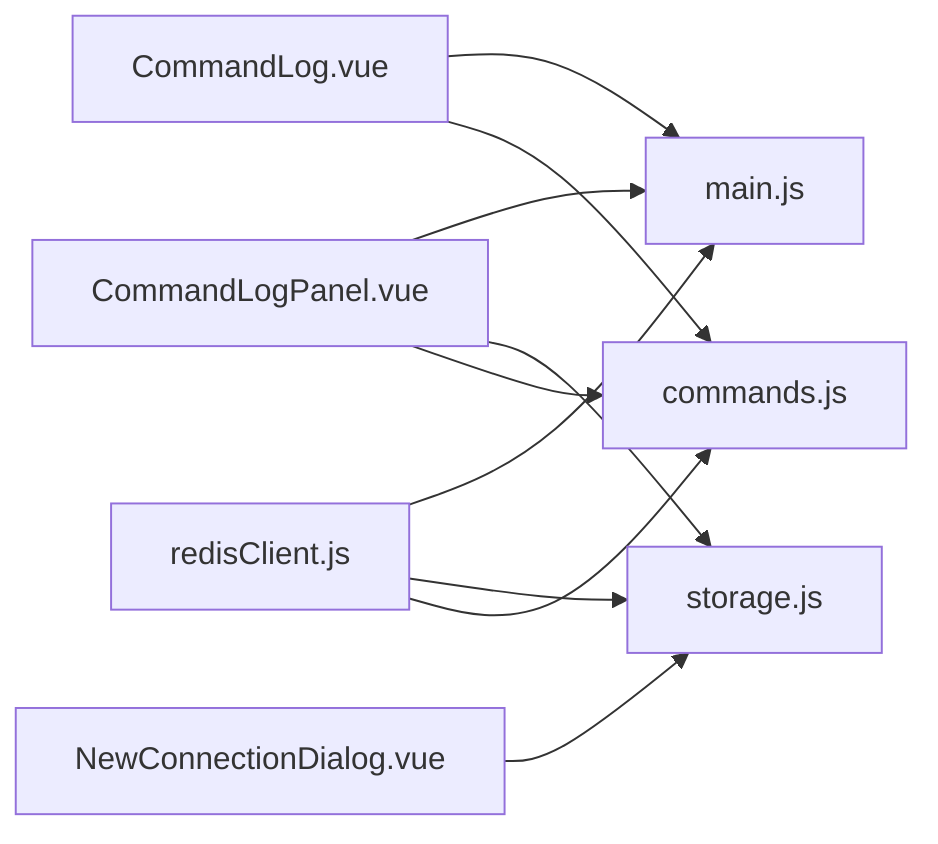

**图表来源**
- [redisClient.js](file://src/redisClient.js#L1-L8)
- [CommandLog.vue](file://src/components/CommandLog.vue#L1-L50)

**章节来源**
- [redisClient.js](file://src/redisClient.js#L1-L8)
- [storage.js](file://src/storage.js#L1-L50)

## 性能考虑

### 连接池优化

系统通过以下方式优化连接性能：

1. **连接复用**: 使用Promise包装确保连接实例复用
2. **延迟加载**: 按需创建连接实例
3. **内存管理**: 及时清理不再使用的连接
4. **批量操作**: 支持管道和事务批处理

### 命令执行优化

1. **异步处理**: 所有命令执行都是异步的
2. **超时控制**: 设置合理的超时时间避免阻塞
3. **错误恢复**: 自动重试机制减少连接中断影响
4. **资源限制**: 命令日志队列长度限制防止内存溢出

### SSH隧道性能

1. **并发隧道**: 支持多个SSH隧道并发建立
2. **连接复用**: 隧道连接可复用于多个Redis节点
3. **NAT映射缓存**: 缓存节点映射关系减少重复计算
4. **优雅降级**: 隧道失败时自动回退到直连

## 故障排除指南

### 常见连接问题

#### SSH连接失败

**症状**: SSH隧道创建失败，提示认证错误或连接被拒绝

**解决方案**:
1. 检查SSH服务器配置和防火墙设置
2. 验证认证凭据的正确性
3. 确认目标Redis服务器可通过SSH访问
4. 检查私钥格式和密码保护设置

#### SSL/TLS握手失败

**症状**: SSL连接建立失败，证书验证错误

**解决方案**:
1. 验证证书文件的有效性和完整性
2. 检查服务器名称(SNI)配置
3. 确认证书链的完整性
4. 调整证书验证策略

#### 集群节点发现失败

**症状**: 集群模式下无法发现所有节点

**解决方案**:
1. 检查集群节点间的网络连通性
2. 验证集群配置的正确性
3. 确认NAT映射配置的准确性
4. 检查防火墙规则对集群端口的开放

### 性能问题诊断

#### 命令执行缓慢

**诊断步骤**:
1. 检查命令日志面板查看具体命令耗时
2. 分析网络延迟和服务器负载
3. 监控连接状态和重试频率
4. 评估数据量对性能的影响

#### 内存使用过高

**排查方法**:
1. 监控命令日志队列长度
2. 检查连接实例的数量和生命周期
3. 分析SSH隧道连接的占用情况
4. 优化大键值的处理逻辑

**章节来源**
- [redisClient.js](file://src/redisClient.js#L344-L355)
- [CommandLog.vue](file://src/components/CommandLog.vue#L1-L120)

## 结论

Redis客户端管理模块通过精心设计的架构，成功地封装了ioredis客户端以支持复杂的Redis部署场景。其主要优势包括：

1. **多模式支持**: 统一接口支持单机、集群、哨兵和SSH隧道等多种连接模式
2. **安全性保障**: 完整的SSL/TLS加密支持和安全作用域资源访问
3. **可观测性**: 强大的命令拦截和日志记录机制
4. **可靠性**: 智能重试策略和连接故障恢复能力
5. **易用性**: 图形化配置界面和丰富的错误提示

该模块为Another Redis Desktop Manager提供了稳定可靠的Redis连接基础，能够满足从简单单机到复杂分布式环境的各种使用需求。通过持续的优化和扩展，它将继续为用户提供优秀的Redis管理体验。