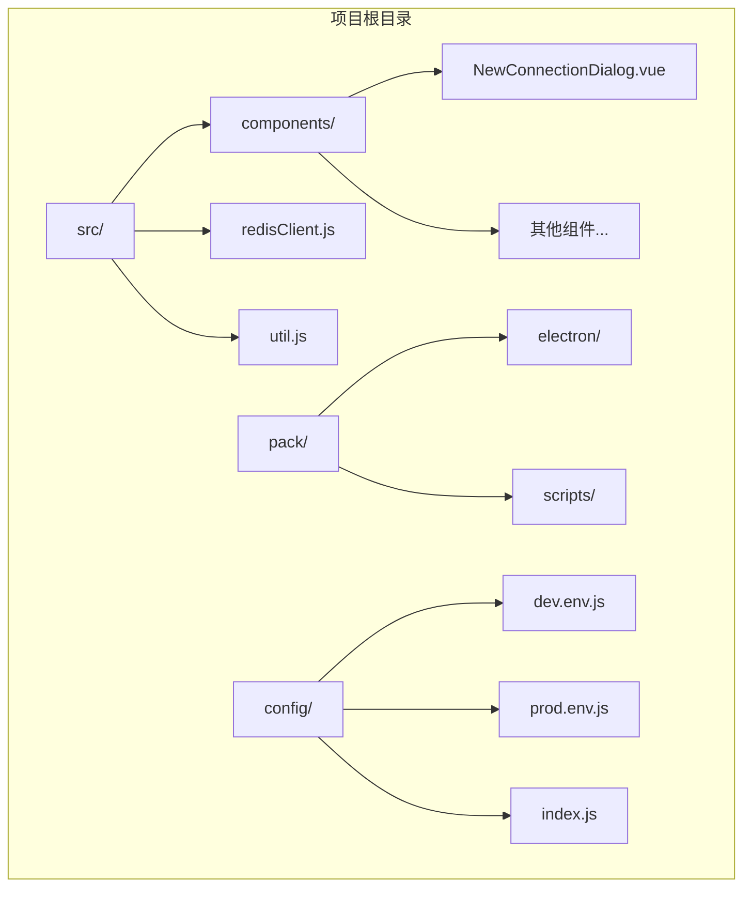
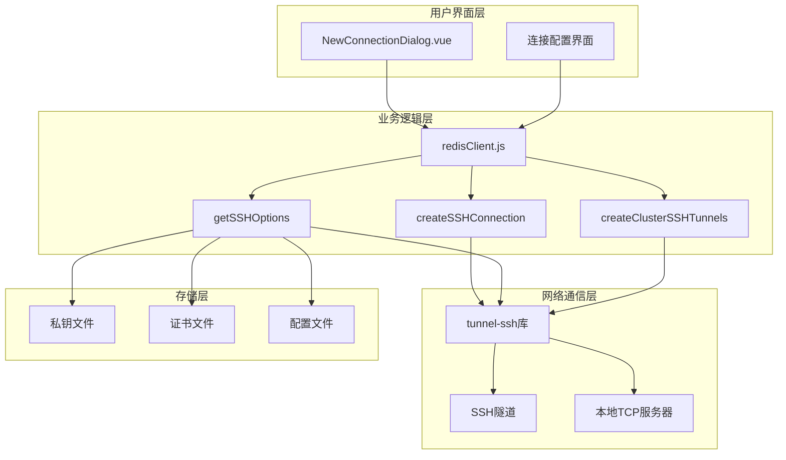
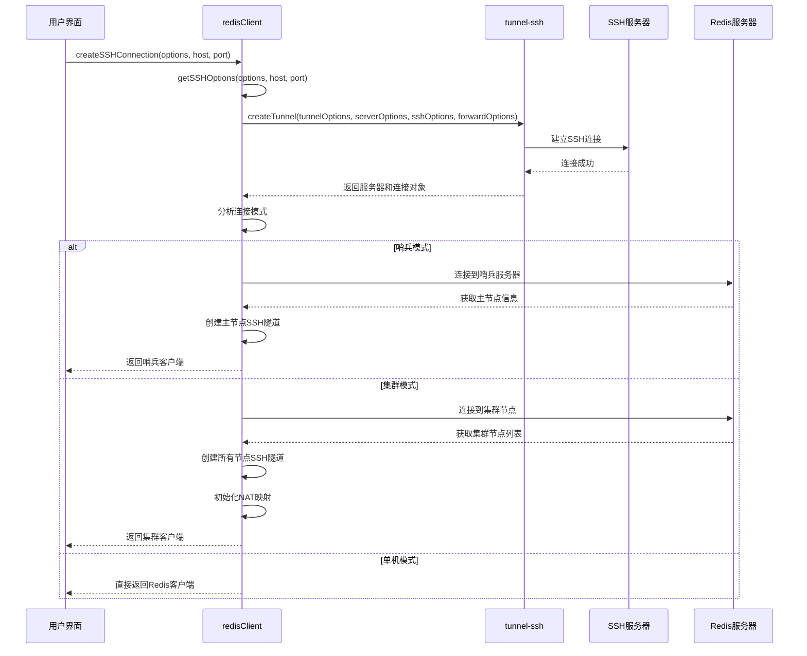
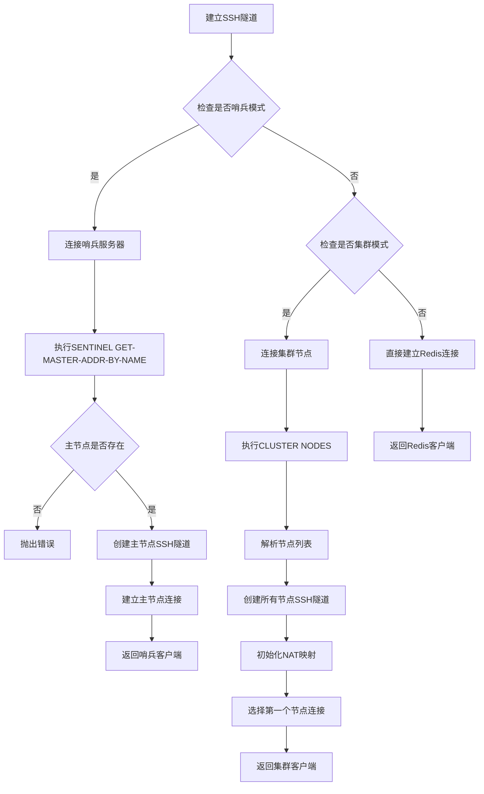
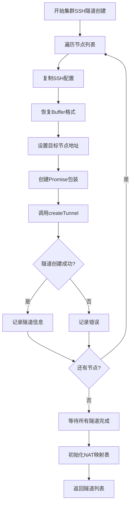
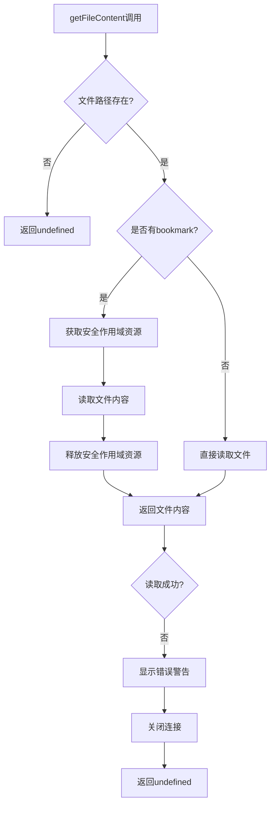
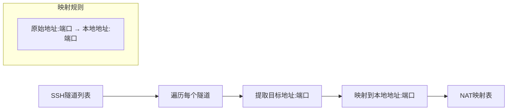
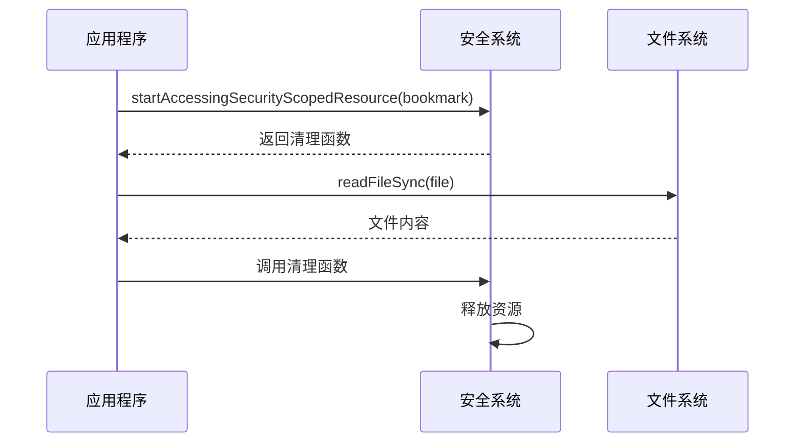

# SSH隧道管理

<cite>
**本文档中引用的文件**
- [redisClient.js](file://src/redisClient.js)
- [NewConnectionDialog.vue](file://src/components/NewConnectionDialog.vue)
- [addon.js](file://src/addon.js)
- [package.json](file://package.json)
</cite>

## 目录
1. [简介](#简介)
2. [项目结构概览](#项目结构概览)
3. [核心组件分析](#核心组件分析)
4. [架构概览](#架构概览)
5. [详细组件分析](#详细组件分析)
6. [依赖关系分析](#依赖关系分析)
7. [性能考虑](#性能考虑)
8. [故障排除指南](#故障排除指南)
9. [结论](#结论)

## 简介

本文档深入解析了Another Redis Desktop Manager中SSH隧道管理系统的实现机制。该系统通过`tunnel-ssh`库建立了安全的SSH隧道连接，支持哨兵模式和集群模式下的多节点连接管理，并实现了复杂的地址转换机制。

SSH隧道管理是连接到受保护的Redis服务器的关键功能，它允许用户通过SSH代理安全地访问位于内网或防火墙后的Redis实例。系统设计考虑了多种部署场景，包括单机、哨兵和集群模式，同时针对macOS应用商店版本提供了特殊的文件权限处理机制。

## 项目结构概览

该项目采用Electron框架构建桌面应用程序，主要包含以下关键目录：



**图表来源**
- [redisClient.js](file://src/redisClient.js#L1-L381)
- [NewConnectionDialog.vue](file://src/components/NewConnectionDialog.vue#L1-L438)

**章节来源**
- [redisClient.js](file://src/redisClient.js#L1-L50)
- [package.json](file://package.json#L35-L56)

## 核心组件分析

### SSH连接管理器

SSH连接管理器是整个系统的核心，负责协调所有SSH隧道操作。它通过`createSSHConnection`方法启动连接流程，该方法接收SSH选项、目标主机、端口、认证信息和配置参数。

### 配置参数构造器

`getSSHOptions`方法负责构建符合`tunnel-ssh`库要求的连接参数对象。该方法创建四个主要配置部分：
- `tunnelOptions`: 控制隧道行为的基本选项
- `serverOptions`: 定义本地TCP服务器监听设置
- `sshOptions`: 指定SSH服务器连接参数
- `forwardOptions`: 配置SSH转发链接

### 多节点隧道管理

对于集群模式，系统使用`createClusterSSHTunnels`方法为每个Redis节点建立独立的SSH通道。这种方法确保了高可用性和负载均衡能力。

**章节来源**
- [redisClient.js](file://src/redisClient.js#L90-L164)
- [redisClient.js](file://src/redisClient.js#L166-L200)
- [redisClient.js](file://src/redisClient.js#L277-L313)

## 架构概览

SSH隧道管理系统采用分层架构设计，从用户界面到底层网络通信形成清晰的层次结构：



**图表来源**
- [redisClient.js](file://src/redisClient.js#L90-L164)
- [NewConnectionDialog.vue](file://src/components/NewConnectionDialog.vue#L181-L222)

## 详细组件分析

### createSSHConnection方法详解

`createSSHConnection`方法是SSH隧道管理的核心入口点，它协调整个连接过程：



**图表来源**
- [redisClient.js](file://src/redisClient.js#L90-L164)

#### 哨兵模式处理流程

在哨兵模式下，系统需要先连接到哨兵服务器获取主节点信息，然后为指定的主节点建立SSH隧道：



**图表来源**
- [redisClient.js](file://src/redisClient.js#L100-L153)

#### 集群模式处理流程

集群模式需要为每个节点建立独立的SSH隧道，并维护地址映射关系：



**图表来源**
- [redisClient.js](file://src/redisClient.js#L277-L313)

**章节来源**
- [redisClient.js](file://src/redisClient.js#L90-L164)

### getSSHOptions方法详解

`getSSHOptions`方法负责构建符合`tunnel-ssh`库要求的连接参数对象：

#### 参数配置详解

| 配置项 | 类型 | 描述 | 默认值 |
|--------|------|------|--------|
| tunnelOptions.autoClose | boolean | 是否自动关闭隧道 | false |
| serverOptions | object | 本地TCP服务器配置 | 空对象 |
| sshOptions.host | string | SSH服务器主机名 | 必需 |
| sshOptions.port | number | SSH服务器端口 | 22 |
| sshOptions.username | string | SSH用户名 | 必需 |
| sshOptions.password | string | SSH密码 | 可选 |
| sshOptions.privateKey | Buffer | 私钥内容 | 可选 |
| sshOptions.passphrase | string | 私钥密码短语 | 可选 |
| sshOptions.readyTimeout | number | 就绪超时时间(ms) | 30000 |
| sshOptions.keepaliveInterval | number | 保活间隔(ms) | 10000 |
| forwardOptions.dstAddr | string | 目标Redis主机 | 必需 |
| forwardOptions.dstPort | number | 目标Redis端口 | 必需 |

#### 文件内容读取机制

系统通过`getFileContent`方法安全读取私钥和证书文件：



**图表来源**
- [redisClient.js](file://src/redisClient.js#L357-L380)

**章节来源**
- [redisClient.js](file://src/redisClient.js#L166-L200)
- [redisClient.js](file://src/redisClient.js#L357-L380)

### createClusterSSHTunnels方法详解

该方法为核心集群功能提供多节点SSH隧道支持：

#### 关键实现特点

1. **配置副本机制**: 由于`tunnel-ssh`库会修改传入的配置对象，系统采用深度复制策略避免副作用
2. **Buffer恢复**: 在JSON序列化过程中，Buffer对象会被转换为普通数组，需要重新转换回Buffer
3. **并发处理**: 使用Promise.all并行创建所有节点的SSH隧道，提高效率
4. **错误处理**: 每个隧道都有独立的错误处理机制，确保单个失败不影响整体流程

#### NAT映射表生成

`initNatMap`方法根据创建的SSH隧道生成NAT映射表，实现地址转换：



**图表来源**
- [redisClient.js](file://src/redisClient.js#L315-L323)

**章节来源**
- [redisClient.js](file://src/redisClient.js#L277-L323)

### macOS应用商店版本特殊处理

针对macOS应用商店版本，系统实现了特殊的文件权限处理机制：

#### 安全作用域资源处理



**图表来源**
- [redisClient.js](file://src/redisClient.js#L363-L370)

这种机制确保了应用商店版本能够正确访问沙盒外的文件，同时保持良好的安全性。

**章节来源**
- [redisClient.js](file://src/redisClient.js#L363-L370)

## 依赖关系分析

SSH隧道管理系统依赖于多个关键模块和库：

```mermaid
graph TB
subgraph "外部依赖"
A[tunnel-ssh@5.1.2]
B[ioredis@5.3.2]
C[electron]
end
subgraph "内部模块"
D[redisClient.js]
E[NewConnectionDialog.vue]
F[addon.js]
end
subgraph "系统API"
G[fs模块]
H[remote.app]
end
A --> D
B --> D
C --> H
G --> D
D --> E
D --> F
```

**图表来源**
- [package.json](file://package.json#L35-L56)
- [redisClient.js](file://src/redisClient.js#L1-L8)

### 关键依赖说明

1. **tunnel-ssh**: 提供SSH隧道创建和管理功能
2. **ioredis**: Redis客户端库，支持哨兵和集群模式
3. **electron**: Electron框架，提供跨平台桌面应用支持
4. **fs**: Node.js文件系统模块，用于文件读取
5. **remote.app**: Electron远程模块，提供macOS安全作用域资源访问

**章节来源**
- [package.json](file://package.json#L35-L56)
- [redisClient.js](file://src/redisClient.js#L1-L8)

## 性能考虑

### 并发隧道创建

系统采用并发方式创建SSH隧道，特别是在集群模式下，可以显著提高连接建立速度。使用Promise.all确保所有隧道并行创建，而不是串行处理。

### 内存管理

- **配置对象复制**: 避免`tunnel-ssh`库的副作用，但增加了内存使用
- **Buffer处理**: 正确处理Buffer对象的序列化和反序列化
- **资源清理**: 确保安全作用域资源得到及时释放

### 错误恢复机制

系统实现了多层次的错误处理：
- 隧道创建失败时的重试机制
- 连接断开时的自动重连
- 节点不可达时的故障转移

## 故障排除指南

### 常见问题及解决方案

#### SSH连接失败
1. **检查SSH凭据**: 确认用户名、密码或私钥配置正确
2. **验证网络连通性**: 确保能够访问SSH服务器
3. **检查防火墙设置**: 确认SSH端口未被阻止

#### 私钥读取失败
1. **确认文件路径**: 检查私钥文件是否存在且可访问
2. **权限问题**: 确认应用具有读取私钥文件的权限
3. **macOS特殊处理**: 对于应用商店版本，确保正确设置了bookmark

#### 集群节点连接问题
1. **检查节点可达性**: 确认所有集群节点都可以通过SSH访问
2. **NAT映射配置**: 验证initNatMap生成的映射表是否正确
3. **端口冲突**: 确认本地端口未被占用

**章节来源**
- [redisClient.js](file://src/redisClient.js#L155-L160)
- [redisClient.js](file://src/redisClient.js#L373-L378)

## 结论

Another Redis Desktop Manager的SSH隧道管理系统是一个设计精良、功能完备的解决方案。它成功地解决了在各种部署环境下安全连接Redis服务器的需求，特别是对复杂的企业环境提供了强有力的支持。

### 主要优势

1. **多模式支持**: 同时支持单机、哨兵和集群模式
2. **安全性**: 实现了完善的文件权限管理和加密传输
3. **可靠性**: 提供了健壮的错误处理和恢复机制
4. **可扩展性**: 设计灵活，易于添加新的连接模式

### 技术亮点

- 创新的NAT映射机制解决了地址转换问题
- 针对macOS应用商店版本的特殊优化
- 高效的并发隧道创建算法
- 完善的错误处理和日志记录

该系统为开发者提供了一个优秀的参考实现，展示了如何在现代桌面应用中集成复杂的网络功能。