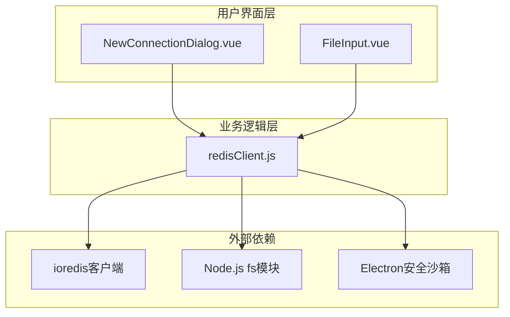
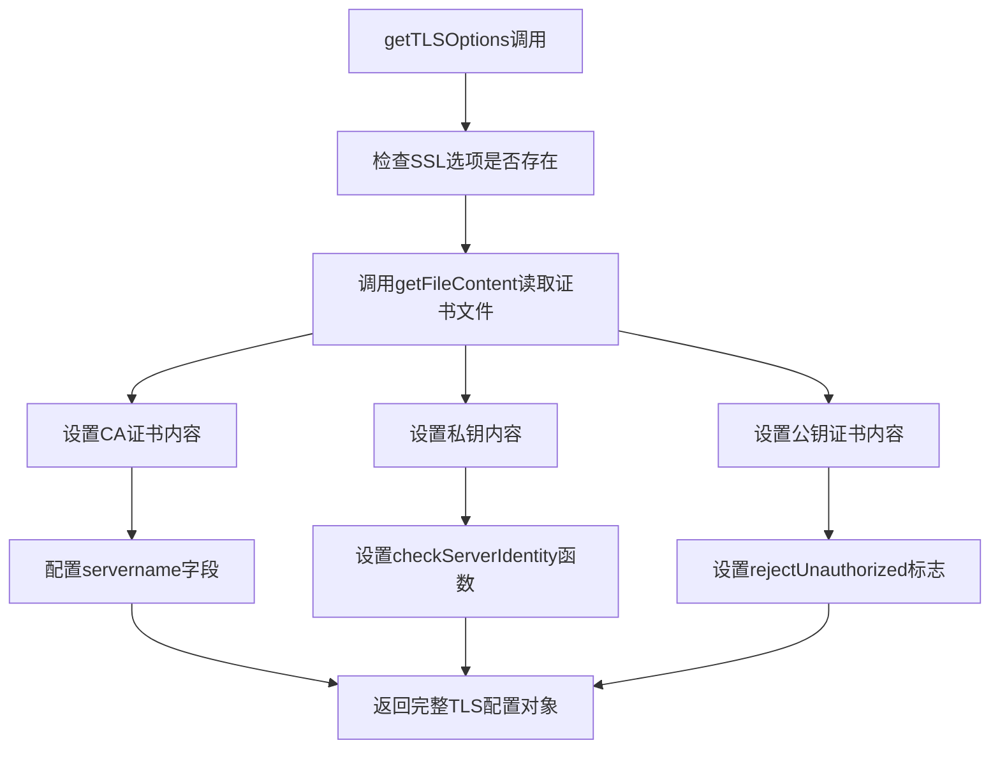
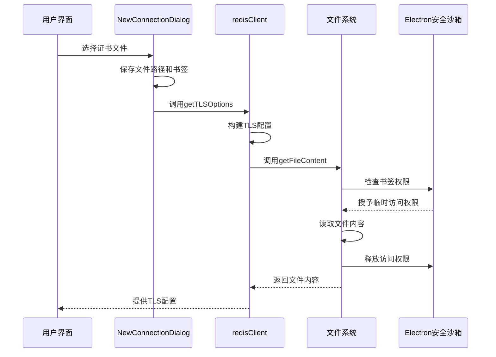
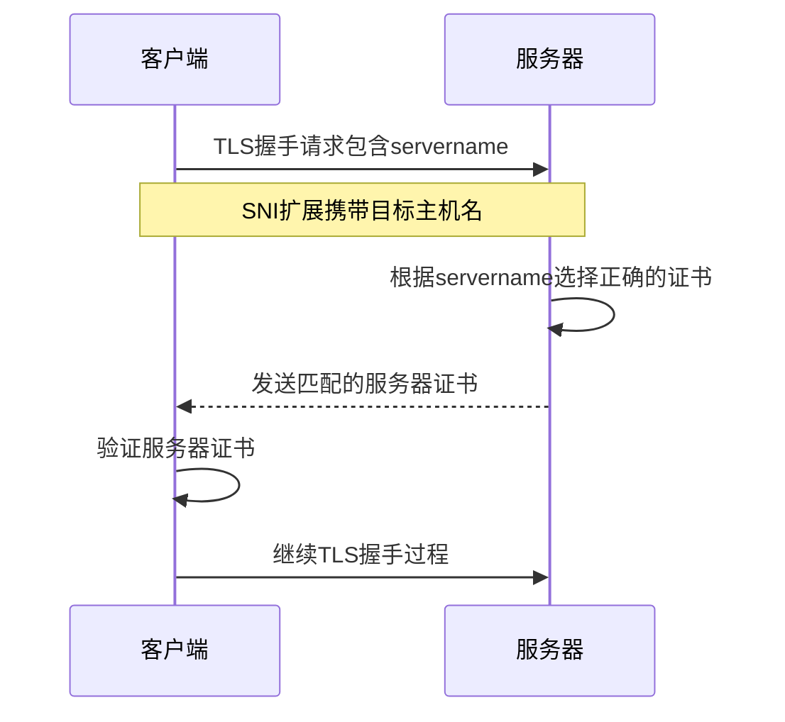
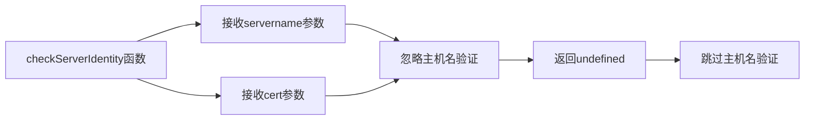
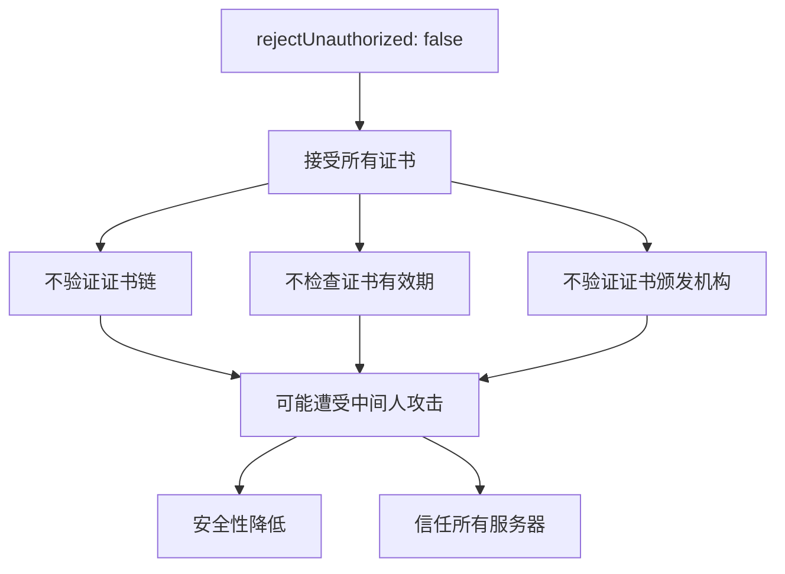
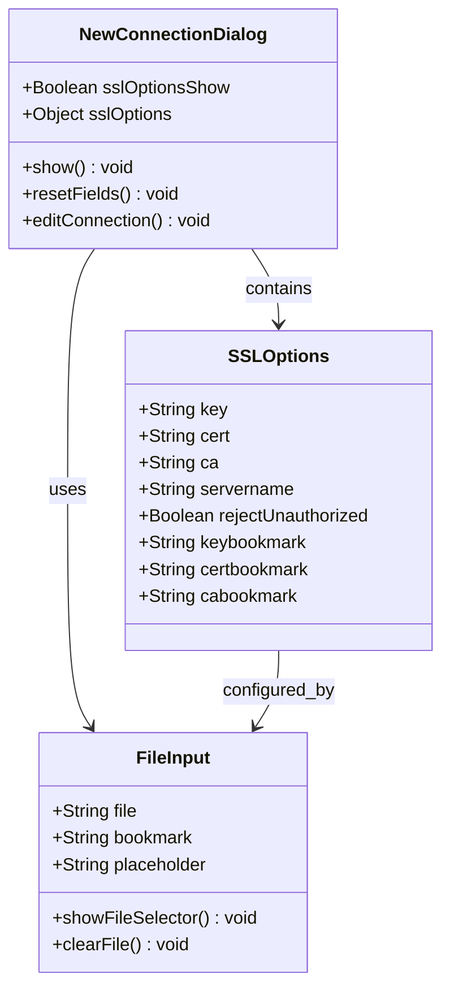
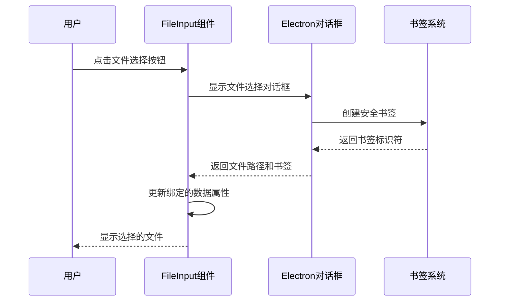
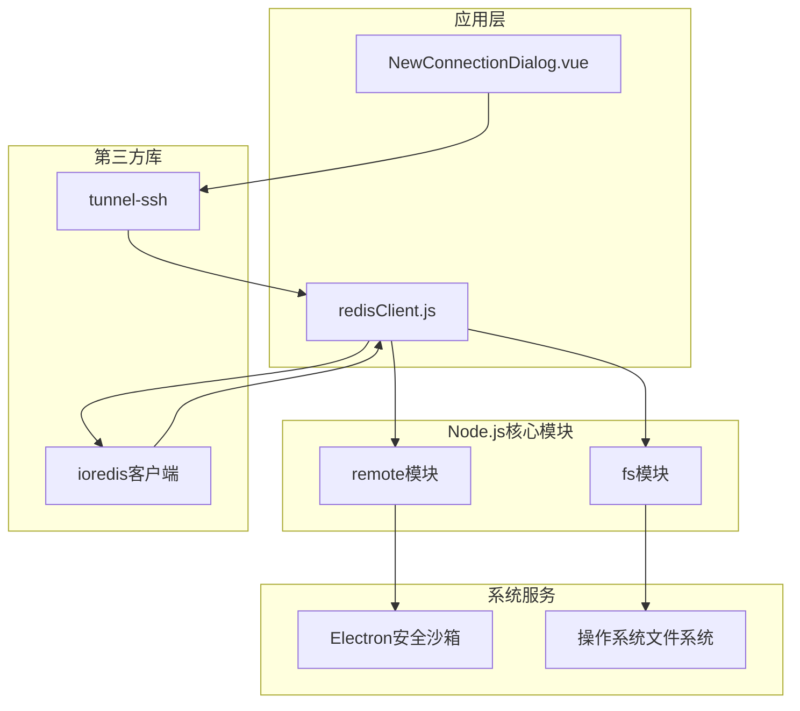
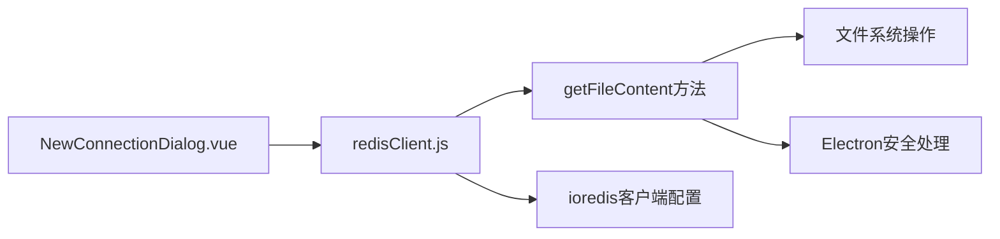

# TLS配置

<cite>
**本文档中引用的文件**
- [redisClient.js](file://src/redisClient.js)
- [NewConnectionDialog.vue](file://src/components/NewConnectionDialog.vue)
- [FileInput.vue](file://src/components/FileInput.vue)
- [package.json](file://package.json)
</cite>

## 目录
1. [简介](#简介)
2. [项目结构概述](#项目结构概述)
3. [核心组件分析](#核心组件分析)
4. [TLS配置架构](#tls配置架构)
5. [详细组件分析](#详细组件分析)
6. [依赖关系分析](#依赖关系分析)
7. [性能考虑](#性能考虑)
8. [故障排除指南](#故障排除指南)
9. [结论](#结论)

## 简介

本文档深入分析了Another Redis Desktop Manager (ARDM)项目中TLS/SSL加密连接的实现机制。该项目是一个跨平台的Redis桌面管理器，支持多种连接方式，包括直接连接、SSH隧道和哨兵模式。TLS配置是确保数据传输安全的重要组成部分，特别是在处理敏感的数据库连接时。

ARMD采用基于ioredis客户端的连接管理策略，通过精心设计的TLS选项配置，实现了灵活且安全的加密连接支持。本文档将详细解析`getTLSOptions`方法的实现原理，探讨证书文件的安全读取机制，分析SNI扩展的作用，并讨论安全配置的最佳实践。

## 项目结构概述

ARMD项目采用模块化的架构设计，TLS配置功能分布在多个关键组件中：



**图表来源**
- [NewConnectionDialog.vue](file://src/components/NewConnectionDialog.vue#L140-L178)
- [redisClient.js](file://src/redisClient.js#L1-L50)

**章节来源**
- [NewConnectionDialog.vue](file://src/components/NewConnectionDialog.vue#L1-L772)
- [redisClient.js](file://src/redisClient.js#L1-L381)

## 核心组件分析

### TLS配置入口点

TLS配置的核心实现在`getTLSOptions`方法中，该方法负责构建完整的TLS连接选项：



**图表来源**
- [redisClient.js](file://src/redisClient.js#L325-L341)

### 证书文件安全读取机制

系统采用双重安全机制来处理证书文件的读取：



**图表来源**
- [redisClient.js](file://src/redisClient.js#L357-L378)
- [FileInput.vue](file://src/components/FileInput.vue#L32-L46)

**章节来源**
- [redisClient.js](file://src/redisClient.js#L325-L381)
- [FileInput.vue](file://src/components/FileInput.vue#L1-L49)

## TLS配置架构

### TLS选项结构设计

TLS配置采用了简洁而功能完整的选项结构：

| 配置项 | 类型 | 描述 | 默认值 |
|--------|------|------|--------|
| ca | Buffer/String | CA证书内容，用于验证服务器身份 | undefined |
| key | Buffer/String | 客户端私钥，用于身份认证 | undefined |
| cert | Buffer/String | 客户端公钥证书 | undefined |
| servername | String | SNI（服务器名称指示）扩展值 | undefined |
| checkServerIdentity | Function | 自定义主机名验证函数 | 返回undefined |
| rejectUnauthorized | Boolean | 是否拒绝未经授权的证书 | false |

### SNI扩展机制

SNI（Server Name Indication）扩展在TLS握手过程中扮演着重要角色：



**图表来源**
- [redisClient.js](file://src/redisClient.js#L335)

**章节来源**
- [redisClient.js](file://src/redisClient.js#L325-L341)

## 详细组件分析

### getTLSOptions方法实现

`getTLSOptions`方法是TLS配置的核心实现，它将用户提供的证书信息转换为ioredis客户端可识别的格式：

#### 证书文件读取流程

```mermaid
flowchart TD
A[开始getTLSOptions] --> B{检查sslOptions存在?}
B --> |否| C[返回undefined]
B --> |是| D[初始化TLS配置对象]
D --> E[读取CA证书]
E --> F[读取私钥]
F --> G[读取公钥证书]
G --> H[设置servername]
H --> I[配置checkServerIdentity]
I --> J[设置rejectUnauthorized]
J --> K[返回完整配置]
E --> E1[getFileContent(ca, cabookmark)]
F --> F1[getFileContent(key, keybookmark)]
G --> G1[getFileContent(cert, certbookmark)]
E1 --> L[安全读取文件内容]
F1 --> L
G1 --> L
L --> M{读取成功?}
M --> |是| N[返回文件内容]
M --> |否| O[显示错误提示]
O --> P[返回undefined]
```

**图表来源**
- [redisClient.js](file://src/redisClient.js#L325-L341)

#### checkServerIdentity函数分析

该函数的设计体现了安全与灵活性的平衡：



**图表来源**
- [redisClient.js](file://src/redisClient.js#L337-L339)

这种设计允许：
- 在自签名证书环境中正常工作
- 支持内部网络部署
- 减少证书管理复杂度

#### rejectUnauthorized配置影响

`rejectUnauthorized: false`的配置具有深远的安全影响：



**图表来源**
- [redisClient.js](file://src/redisClient.js#L340)

**章节来源**
- [redisClient.js](file://src/components/NewConnectionDialog.vue#L325-L341)

### 用户界面集成

#### SSL配置面板设计

SSL配置面板提供了直观的用户交互界面：



**图表来源**
- [NewConnectionDialog.vue](file://src/components/NewConnectionDialog.vue#L350-L356)
- [FileInput.vue](file://src/components/FileInput.vue#L17-L22)

#### 证书文件输入组件

FileInput组件提供了安全的文件选择和书签管理功能：



**图表来源**
- [FileInput.vue](file://src/components/FileInput.vue#L32-L46)

**章节来源**
- [NewConnectionDialog.vue](file://src/components/NewConnectionDialog.vue#L140-L178)
- [FileInput.vue](file://src/components/FileInput.vue#L1-L49)

## 依赖关系分析

### 外部依赖关系

TLS配置功能依赖于多个外部模块和系统组件：



**图表来源**
- [redisClient.js](file://src/redisClient.js#L1-L8)
- [package.json](file://package.json#L35-L56)

### 内部模块依赖

系统内部模块之间的依赖关系展现了清晰的分层架构：



**图表来源**
- [NewConnectionDialog.vue](file://src/components/NewConnectionDialog.vue#L1-L50)
- [redisClient.js](file://src/redisClient.js#L1-L50)

**章节来源**
- [redisClient.js](file://src/redisClient.js#L1-L381)
- [package.json](file://package.json#L1-L130)

## 性能考虑

### 证书文件读取优化

系统采用了多种优化策略来提升TLS配置的性能：

1. **延迟加载**: 仅在需要时才读取证书文件
2. **缓存机制**: 已读取的证书内容被缓存在内存中
3. **异步处理**: 文件读取操作采用异步模式
4. **资源清理**: 及时释放不再需要的文件句柄

### 内存使用优化

TLS配置的内存使用遵循以下原则：
- 证书内容以Buffer形式存储，避免字符串转换开销
- 临时书签权限在读取完成后立即释放
- 配置对象采用浅拷贝，减少内存占用

## 故障排除指南

### 常见问题及解决方案

#### 证书文件读取失败

**症状**: 连接建立失败，提示证书相关错误

**原因分析**:
- 文件权限不足
- 书签已失效
- 文件路径不存在

**解决步骤**:
1. 检查文件权限设置
2. 重新选择证书文件
3. 验证文件路径有效性

#### 主机名验证失败

**症状**: TLS握手过程中出现主机名不匹配错误

**原因分析**:
- SNI配置不正确
- 服务器证书与域名不匹配

**解决步骤**:
1. 检查servername配置
2. 验证服务器证书的有效性
3. 考虑修改checkServerIdentity函数

#### 自签名证书问题

**症状**: 无法建立TLS连接，提示证书不受信任

**原因分析**:
- 使用自签名证书但未正确配置CA
- rejectUnauthorized设置为true

**解决步骤**:
1. 添加自签名证书到CA列表
2. 保持rejectUnauthorized: false配置
3. 确保证书内容正确无误

**章节来源**
- [redisClient.js](file://src/redisClient.js#L357-L378)

## 结论

ARMD项目的TLS配置实现展现了现代应用程序在安全性与可用性之间寻求平衡的设计理念。通过精心设计的`getTLSOptions`方法，系统不仅提供了强大的加密连接支持，还保持了良好的用户体验。

### 关键特性总结

1. **安全优先**: 采用Electron安全沙箱机制保护证书文件访问
2. **灵活配置**: 支持多种证书类型和SNI扩展
3. **用户友好**: 提供直观的SSL配置界面
4. **性能优化**: 实现证书内容的高效读取和缓存

### 最佳实践建议

1. **生产环境**: 建议启用严格的证书验证（rejectUnauthorized: true）
2. **开发环境**: 可以使用自签名证书，但需注意安全风险
3. **证书管理**: 定期更新证书，确保证书链完整性
4. **监控告警**: 实施TLS连接状态监控，及时发现异常

### 安全风险提示

当前配置虽然提供了便利性，但也存在一定的安全风险：
- 跳过了主机名验证，可能遭受重定向攻击
- 禁用了证书链验证，无法检测中间人攻击
- 自签名证书的广泛信任可能导致信任链断裂

开发者应根据具体的安全需求，在便利性和安全性之间做出适当的权衡。