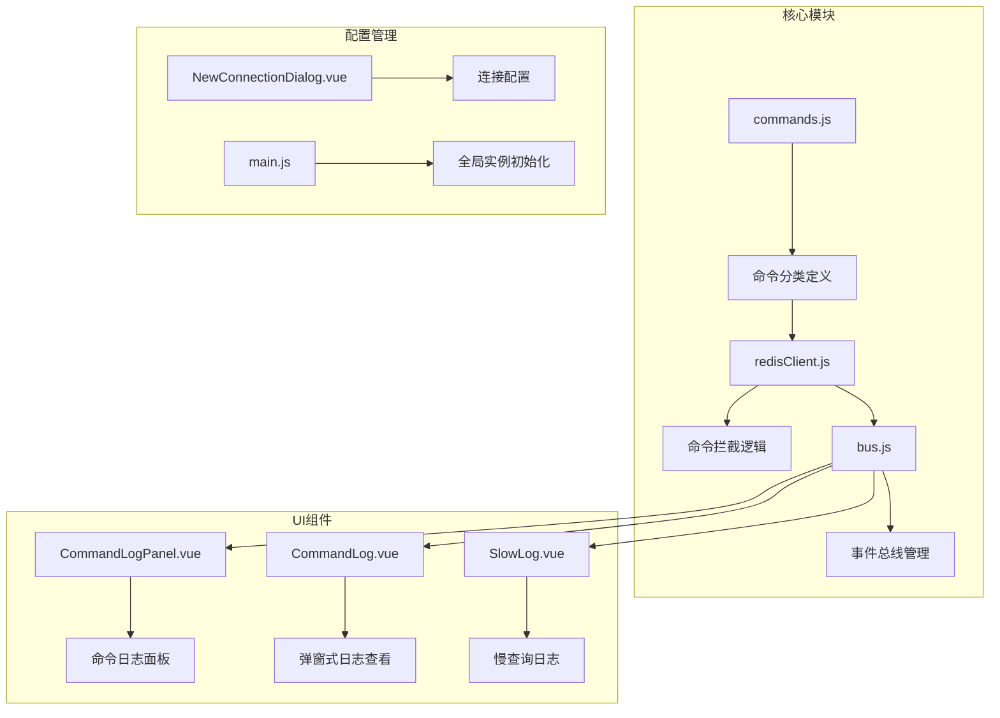
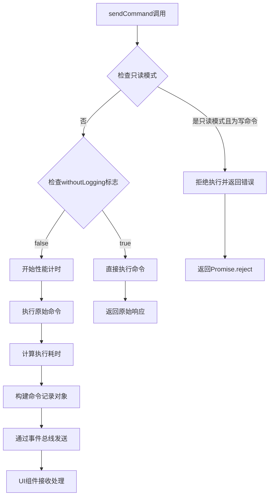
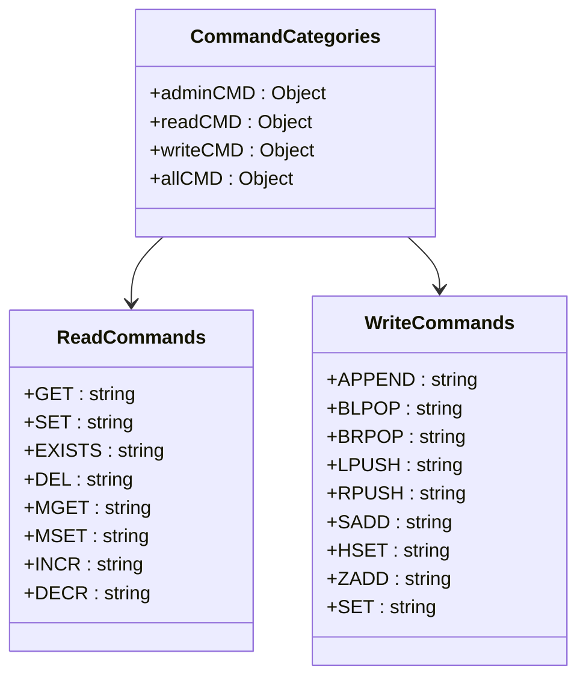
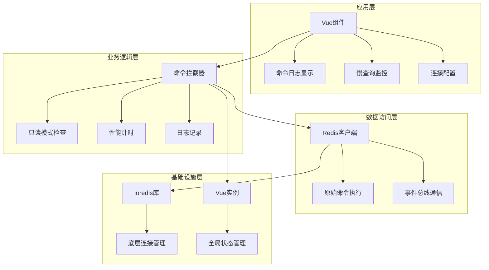
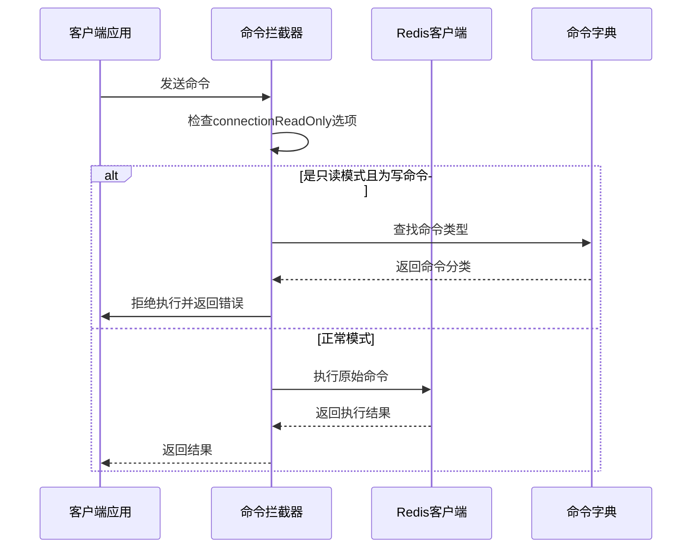
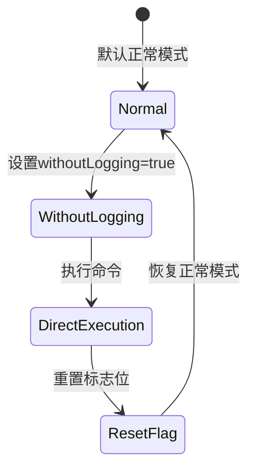
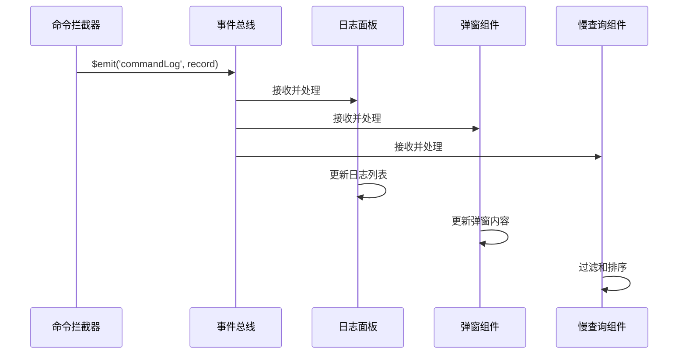
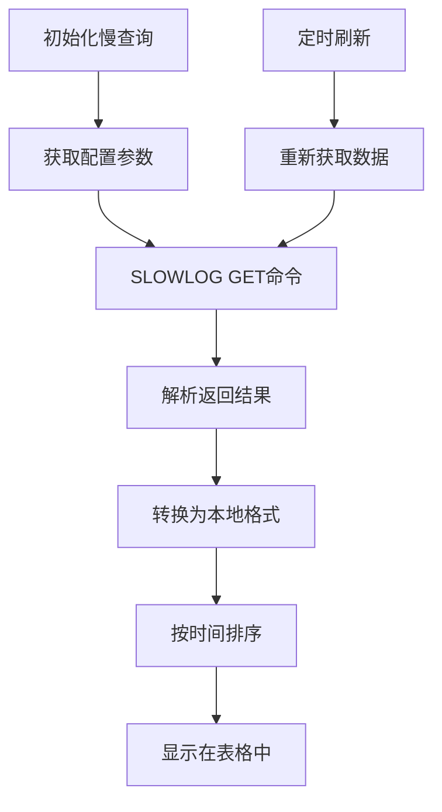
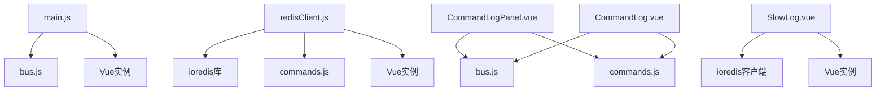

# 命令拦截机制

<cite>
**本文档中引用的文件**
- [redisClient.js](file://src/redisClient.js)
- [commands.js](file://src/commands.js)
- [bus.js](file://src/bus.js)
- [main.js](file://src/main.js)
- [CommandLogPanel.vue](file://src/components/CommandLogPanel.vue)
- [CommandLog.vue](file://src/components/CommandLog.vue)
- [SlowLog.vue](file://src/components/SlowLog.vue)
- [NewConnectionDialog.vue](file://src/components/NewConnectionDialog.vue)
</cite>

## 目录
1. [简介](#简介)
2. [项目结构概览](#项目结构概览)
3. [核心组件分析](#核心组件分析)
4. [架构概览](#架构概览)
5. [详细组件分析](#详细组件分析)
6. [依赖关系分析](#依赖关系分析)
7. [性能考虑](#性能考虑)
8. [故障排除指南](#故障排除指南)
9. [结论](#结论)

## 简介

Redis.prototype.sendCommand重写机制是Another Redis Desktop Manager中的一个关键功能，它实现了对Redis命令的全面拦截、记录和监控。该机制通过重写ioredis库的sendCommand方法，提供了三个核心功能：命令拦截（特别是只读模式下的写命令拒绝）、性能计时（使用performance.now()精确测量执行时间）和日志记录（通过Vue事件总线传递给UI组件）。

这个机制不仅确保了用户在只读模式下的安全性，还为开发者提供了强大的调试和监控工具，帮助理解Redis命令的执行情况和性能特征。

## 项目结构概览

该项目采用Vue.js前端框架，结合Electron实现桌面应用程序。核心的命令拦截机制位于以下关键文件中：



**图表来源**
- [redisClient.js](file://src/redisClient.js#L1-L381)
- [commands.js](file://src/commands.js#L1-L201)
- [bus.js](file://src/bus.js#L1-L19)

## 核心组件分析

### 命令拦截核心逻辑

命令拦截的核心实现在redisClient.js文件中，通过重写Redis.prototype.sendCommand方法实现：



**图表来源**
- [redisClient.js](file://src/redisClient.js#L12-L38)

### 命令分类系统

commands.js文件定义了完整的Redis命令分类体系：



**图表来源**
- [commands.js](file://src/commands.js#L25-L195)

**节来源**
- [redisClient.js](file://src/redisClient.js#L1-L381)
- [commands.js](file://src/commands.js#L1-L201)

## 架构概览

整个命令拦截机制采用了分层架构设计，确保了功能的模块化和可维护性：



**图表来源**
- [redisClient.js](file://src/redisClient.js#L1-L381)
- [bus.js](file://src/bus.js#L1-L19)
- [main.js](file://src/main.js#L1-L46)

## 详细组件分析

### 命令拦截器实现

命令拦截器是整个机制的核心，它通过修改原型链的方式实现了对所有Redis命令的透明拦截：

#### 只读模式拦截机制



**图表来源**
- [redisClient.js](file://src/redisClient.js#L15-L19)
- [commands.js](file://src/commands.js#L109-L195)

#### 性能计时机制

性能计时使用高精度的performance.now() API来测量命令执行时间：

```mermaid
flowchart LR
A[开始计时] --> B[performance.now()]
B --> C[执行Redis命令]
C --> D[结束计时]
D --> E[performance.now() - 开始时间]
E --> F[计算耗时毫秒数]
F --> G[记录到命令记录对象]
```

**图表来源**
- [redisClient.js](file://src/redisClient.js#L28-L30)

#### withoutLogging标志位机制

withoutLogging标志位提供了一种临时绕过日志记录的机制：



**图表来源**
- [redisClient.js](file://src/redisClient.js#L21-L26)

### 事件总线通信机制

命令记录通过Vue事件总线系统传递给UI组件：



**图表来源**
- [bus.js](file://src/bus.js#L15-L16)
- [CommandLogPanel.vue](file://src/components/CommandLogPanel.vue#L78-L95)

### UI组件集成

#### 命令日志面板

命令日志面板提供了丰富的过滤和搜索功能：

| 功能特性 | 描述 | 实现位置 |
|---------|------|----------|
| 连接筛选 | 按连接名称过滤日志 | connectionNames计算属性 |
| 关键字搜索 | 在命令名和参数中搜索 | filter计算属性 |
| 写命令过滤 | 只显示写入命令 | showOnlyWrite复选框 |
| 自动滚动 | 新日志自动滚动到底部 | scrollToBottom方法 |
| 长度限制 | 最多保存5000条日志 | maxLength配置 |

**节来源**
- [CommandLogPanel.vue](file://src/components/CommandLogPanel.vue#L1-L171)

#### 慢查询监控

慢查询组件通过SLOWLOG命令获取服务器端的慢查询信息：



**图表来源**
- [SlowLog.vue](file://src/components/SlowLog.vue#L78-L108)

**节来源**
- [redisClient.js](file://src/redisClient.js#L12-L38)
- [bus.js](file://src/bus.js#L1-L19)

## 依赖关系分析

项目的依赖关系体现了清晰的分层架构：



**图表来源**
- [main.js](file://src/main.js#L16-L19)
- [redisClient.js](file://src/redisClient.js#L1-L5)
- [CommandLogPanel.vue](file://src/components/CommandLogPanel.vue#L59-L61)

**节来源**
- [main.js](file://src/main.js#L1-L46)
- [redisClient.js](file://src/redisClient.js#L1-L381)

## 性能考虑

### 高精度计时

系统使用performance.now() API提供微秒级的时间精度，这对于Redis命令的性能监控至关重要：

- **时间精度**：microsecond级别（毫秒的千分之一）
- **跨浏览器兼容性**：现代浏览器普遍支持
- **性能开销**：极低，不会显著影响命令执行速度

### 内存管理

为了防止内存泄漏和过度占用，系统实现了多项优化措施：

- **日志长度限制**：最多保存5000条命令记录
- **自动截断**：超出限制时自动删除旧记录
- **事件监听器清理**：组件销毁时移除事件监听器

### 异步处理

所有UI更新操作都采用异步方式，确保界面响应性：

- **setTimeout延迟**：确保DOM更新在当前任务完成后进行
- **事件驱动**：基于Vue的响应式系统
- **批量更新**：减少不必要的渲染次数

## 故障排除指南

### 常见问题及解决方案

#### 只读模式下误报写命令错误

**问题描述**：在只读模式下，某些命令被错误地识别为写命令

**解决方案**：
1. 检查commands.js中的writeCMD字典是否包含正确的命令
2. 确认命令名称的大小写匹配
3. 验证connectionReadOnly选项正确设置

#### 性能计时不准确

**问题描述**：命令执行时间显示异常

**解决方案**：
1. 确认浏览器支持performance.now() API
2. 检查系统时间同步状态
3. 避免在高负载环境下进行性能测试

#### 日志记录丢失

**问题描述**：命令日志没有正确显示或丢失

**解决方案**：
1. 检查事件总线连接状态
2. 验证Vue实例初始化是否完成
3. 确认withoutLogging标志位未被意外设置

**节来源**
- [redisClient.js](file://src/redisClient.js#L15-L38)
- [bus.js](file://src/bus.js#L1-L19)

## 结论

Redis.prototype.sendCommand重写机制是Another Redis Desktop Manager中一个精心设计的功能模块，它成功地实现了命令拦截、性能监控和日志记录的三位一体功能。通过巧妙地利用JavaScript的原型链修改和Vue.js的事件系统，该机制在保持高性能的同时提供了强大的调试和监控能力。

### 主要优势

1. **透明拦截**：对现有代码无侵入性，无需修改应用逻辑
2. **高精度计时**：使用performance.now()提供微秒级时间测量
3. **灵活配置**：支持只读模式和临时绕过机制
4. **实时反馈**：通过事件总线实现实时的日志更新
5. **用户友好**：提供直观的UI界面和丰富的过滤功能

### 技术亮点

- **原型链重写**：优雅地扩展ioredis功能
- **事件驱动架构**：松耦合的组件间通信
- **响应式更新**：基于Vue的自动UI更新
- **性能优化**：最小化对原生性能的影响

这个机制不仅展示了现代Web应用中命令拦截技术的实现方式，也为其他需要类似功能的应用程序提供了宝贵的参考价值。