# 连接创建

<cite>
**本文档中引用的文件**
- [redisClient.js](file://src/redisClient.js)
- [ConnectionWrapper.vue](file://src/components/ConnectionWrapper.vue)
- [Connections.vue](file://src/components/Connections.vue)
- [ConnectionMenu.vue](file://src/components/ConnectionMenu.vue)
- [addon.js](file://src/addon.js)
- [storage.js](file://src/storage.js)
- [main.js](file://src/main.js)
</cite>

## 目录
1. [简介](#简介)
2. [项目结构](#项目结构)
3. [核心组件](#核心组件)
4. [架构概览](#架构概览)
5. [详细组件分析](#详细组件分析)
6. [依赖关系分析](#依赖关系分析)
7. [性能考虑](#性能考虑)
8. [故障排除指南](#故障排除指南)
9. [结论](#结论)

## 简介

本文档详细说明了Another Redis Desktop Manager (ARDM) 中 `redisClient.js` 文件中 `createConnection` 方法如何根据配置参数动态创建不同模式的Redis连接实例。该方法支持单机、集群和哨兵三种Redis部署模式，并通过条件分支判断逻辑选择合适的连接策略。

## 项目结构

ARDM 项目采用模块化架构，主要文件组织如下：

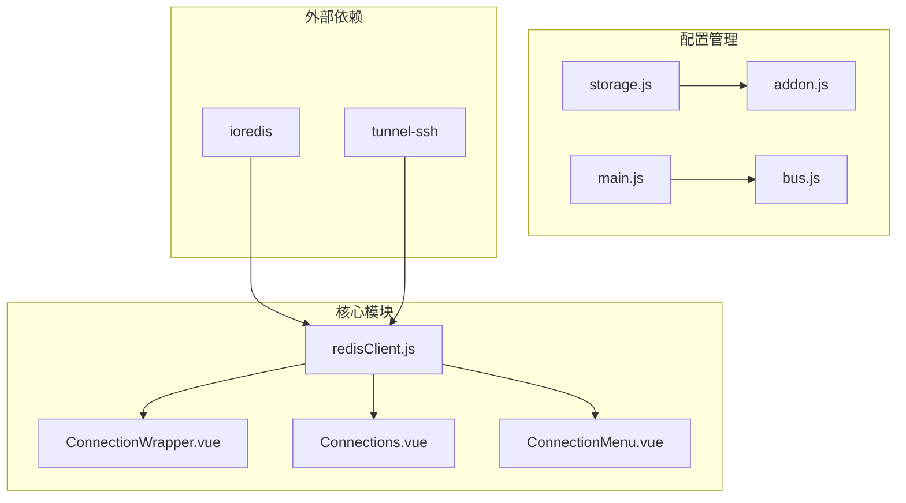

**图表来源**
- [redisClient.js](file://src/redisClient.js#L1-L381)
- [ConnectionWrapper.vue](file://src/components/ConnectionWrapper.vue#L1-L263)

**章节来源**
- [redisClient.js](file://src/redisClient.js#L1-L50)

## 核心组件

### createConnection 方法

`createConnection` 是 ARDM 中的核心连接创建方法，它根据传入的配置参数动态选择合适的Redis连接模式：

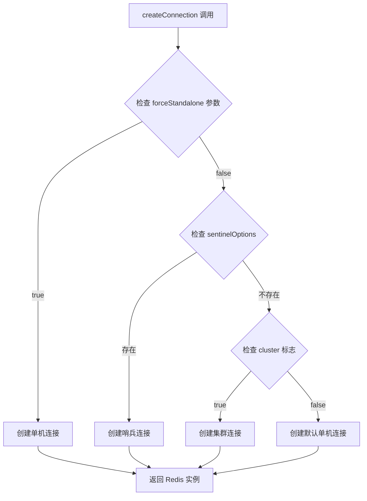

**图表来源**
- [redisClient.js](file://src/redisClient.js#L52-L87)

### 辅助函数

系统提供了三个关键的辅助函数来生成不同类型的连接配置：

| 函数名 | 功能描述 | 适用场景 |
|--------|----------|----------|
| `getRedisOptions` | 生成标准Redis连接选项 | 单机和哨兵模式 |
| `getSentinelOptions` | 生成哨兵连接选项 | 哨兵高可用模式 |
| `getClusterOptions` | 生成集群连接选项 | Redis集群模式 |

**章节来源**
- [redisClient.js](file://src/redisClient.js#L203-L250)

## 架构概览

ARDM 的连接架构采用分层设计，支持多种Redis部署模式：

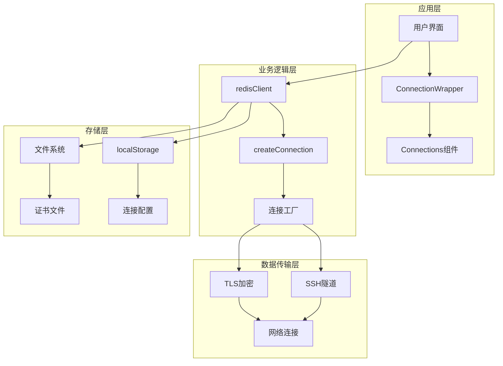

**图表来源**
- [ConnectionWrapper.vue](file://src/components/ConnectionWrapper.vue#L158-L193)
- [redisClient.js](file://src/redisClient.js#L90-L163)

## 详细组件分析

### createConnection 方法详解

#### 方法签名和参数

```javascript
createConnection(host, port, auth, config, promise = true, forceStandalone = false, removeDb = false)
```

**参数说明：**

| 参数名 | 类型 | 默认值 | 描述 |
|--------|------|--------|------|
| host | string | 必需 | Redis服务器主机地址 |
| port | number | 必需 | Redis服务器端口号 |
| auth | string | 可选 | 认证密码 |
| config | object | 必需 | 完整连接配置对象 |
| promise | boolean | true | 是否返回Promise |
| forceStandalone | boolean | false | 强制使用单机模式 |
| removeDb | boolean | false | 移除数据库索引设置 |

#### 条件分支判断逻辑

系统通过三个主要条件分支来决定连接类型：

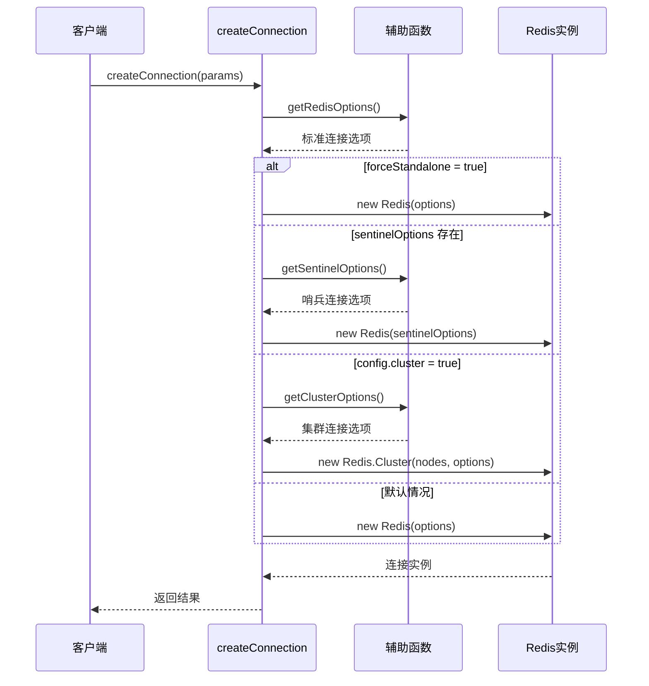

**图表来源**
- [redisClient.js](file://src/redisClient.js#L52-L87)

#### connectionName 配置项

`connectionName` 是一个重要的连接标识配置项，用于：

- **连接识别**：在Redis服务器上显示连接名称
- **调试支持**：便于区分不同客户端的连接
- **监控用途**：在Redis监控工具中显示连接来源

#### 数据库索引 (db) 配置

数据库索引控制连接到特定的Redis数据库：

```javascript
// 示例：连接到第5号数据库
const config = {
  db: 5,
  connectionName: 'MyApp-Production'
};
```

#### ACL 用户名密码支持

系统完全支持Redis 6.0+的ACL功能：

```javascript
// ACL配置示例
const config = {
  username: 'readonly_user',
  password: 'secure_password',
  connectionName: 'ReadOnlyApp'
};
```

**章节来源**
- [redisClient.js](file://src/redisClient.js#L203-L222)

### getRedisOptions 函数

该函数生成标准Redis连接的配置选项：

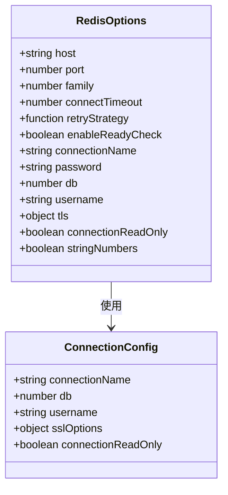

**图表来源**
- [redisClient.js](file://src/redisClient.js#L203-L222)

### getSentinelOptions 函数

哨兵模式连接配置专门针对Redis高可用部署：

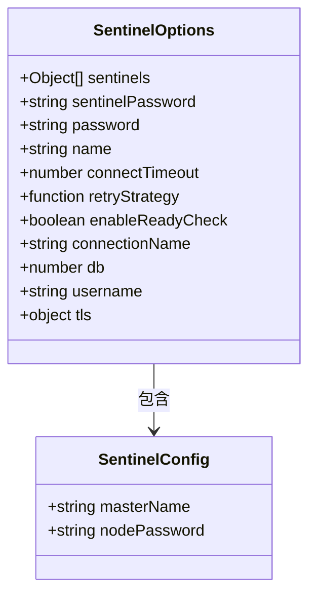

**图表来源**
- [redisClient.js](file://src/redisClient.js#L225-L239)

### getClusterOptions 函数

集群模式连接配置处理分布式Redis部署：

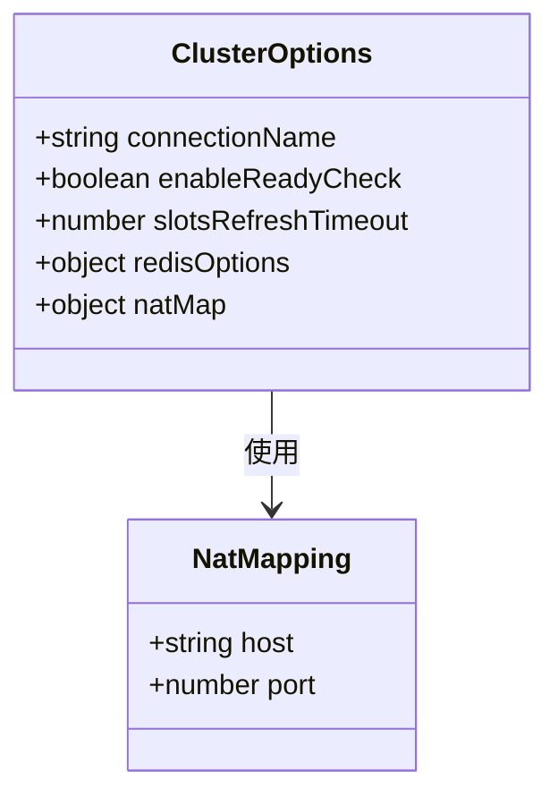

**图表来源**
- [redisClient.js](file://src/redisClient.js#L242-L249)

### Promise 封装机制

系统采用Promise封装来处理异步连接建立过程：

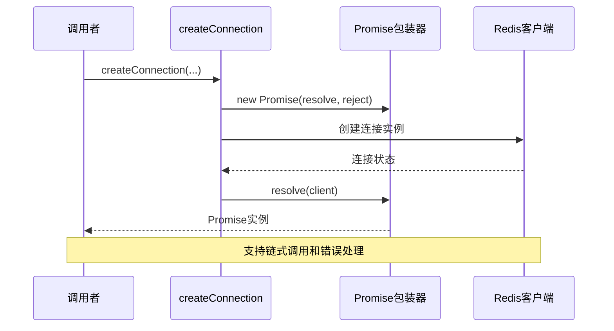

**图表来源**
- [redisClient.js](file://src/redisClient.js#L81-L87)

**章节来源**
- [redisClient.js](file://src/redisClient.js#L52-L87)

### SSH隧道支持

对于需要通过SSH访问的Redis服务器，系统提供SSH隧道功能：

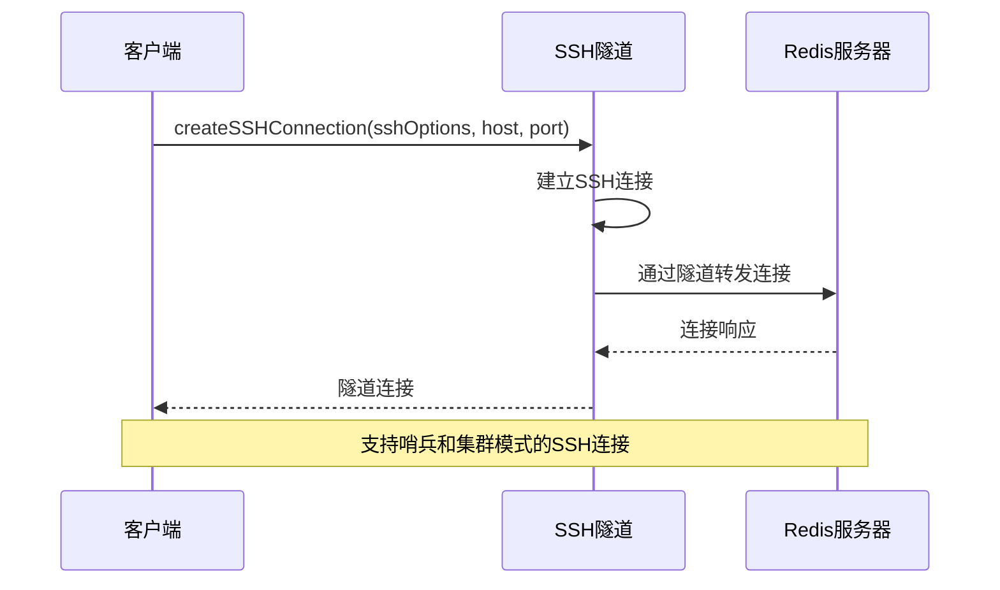

**图表来源**
- [redisClient.js](file://src/redisClient.js#L90-L163)

**章节来源**
- [redisClient.js](file://src/redisClient.js#L90-L163)

## 依赖关系分析

### 外部依赖

系统依赖以下关键外部库：

| 库名称 | 版本要求 | 用途 |
|--------|----------|------|
| ioredis | 最新稳定版 | Redis客户端库 |
| tunnel-ssh | 最新稳定版 | SSH隧道支持 |

### 内部模块依赖

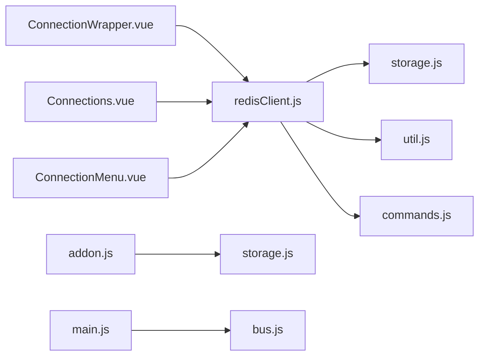

**图表来源**
- [redisClient.js](file://src/redisClient.js#L1-L10)
- [ConnectionWrapper.vue](file://src/components/ConnectionWrapper.vue#L1-L10)

**章节来源**
- [redisClient.js](file://src/redisClient.js#L1-L10)

## 性能考虑

### 连接池管理

系统通过以下机制优化连接性能：

1. **连接复用**：避免频繁创建和销毁连接
2. **重试策略**：智能的连接失败重试机制
3. **超时控制**：合理的连接和操作超时设置

### 内存优化

- 使用JSON深拷贝避免配置污染
- 及时清理断开的连接
- 合理的Promise链处理

### 网络优化

- 支持TLS加密传输
- SSH隧道支持安全连接
- NAT映射支持复杂网络环境

## 故障排除指南

### 常见连接问题

#### 连接超时

**症状**：连接建立失败，出现超时错误

**解决方案**：
1. 检查网络连通性
2. 验证防火墙设置
3. 调整 `connectTimeout` 参数

#### 认证失败

**症状**：连接成功但认证被拒绝

**解决方案**：
1. 验证密码正确性
2. 检查ACL用户名配置
3. 确认Redis版本兼容性

#### 哨兵模式连接失败

**症状**：哨兵连接无法找到主节点

**解决方案**：
1. 验证哨兵配置
2. 检查主节点名称
3. 确认哨兵服务运行状态

**章节来源**
- [redisClient.js](file://src/redisClient.js#L344-L355)

### 错误处理机制

系统实现了完善的错误处理机制：

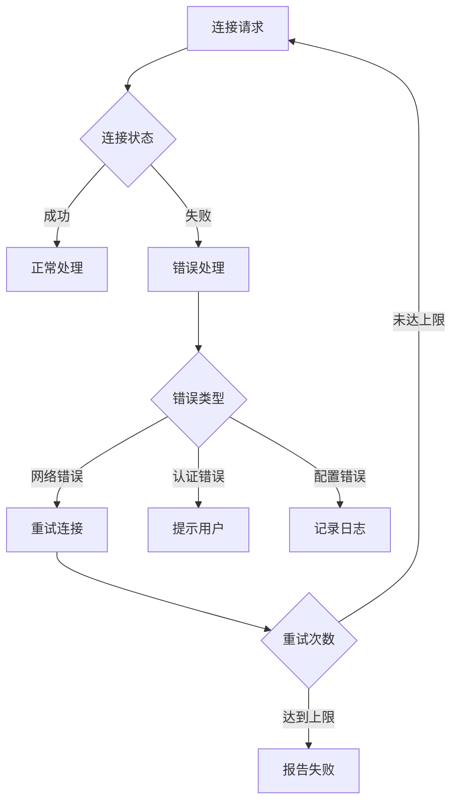

**图表来源**
- [ConnectionWrapper.vue](file://src/components/ConnectionWrapper.vue#L179-L191)

## 结论

ARDM 的 `redisClient.js` 提供了一个强大而灵活的Redis连接管理系统，支持单机、集群和哨兵三种主要部署模式。通过精心设计的条件分支判断逻辑和辅助函数，系统能够根据不同的配置需求自动选择最优的连接策略。

### 主要特性总结

1. **多模式支持**：无缝切换单机、集群和哨兵模式
2. **配置灵活性**：丰富的配置选项满足各种部署需求
3. **错误处理**：完善的错误处理和重试机制
4. **性能优化**：合理的连接管理和资源利用
5. **安全支持**：完整的TLS和SSH隧道支持

### 最佳实践建议

1. **合理配置连接参数**：根据实际部署环境调整超时和重试设置
2. **使用连接池**：避免频繁创建连接，提高性能
3. **监控连接状态**：及时发现和处理连接异常
4. **定期维护**：清理无效连接，保持系统健康

通过深入理解这些连接创建机制，开发者可以更好地利用 ARDM 进行 Redis 数据库的管理和维护工作。