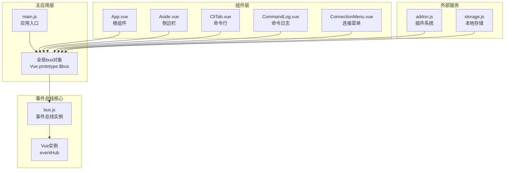
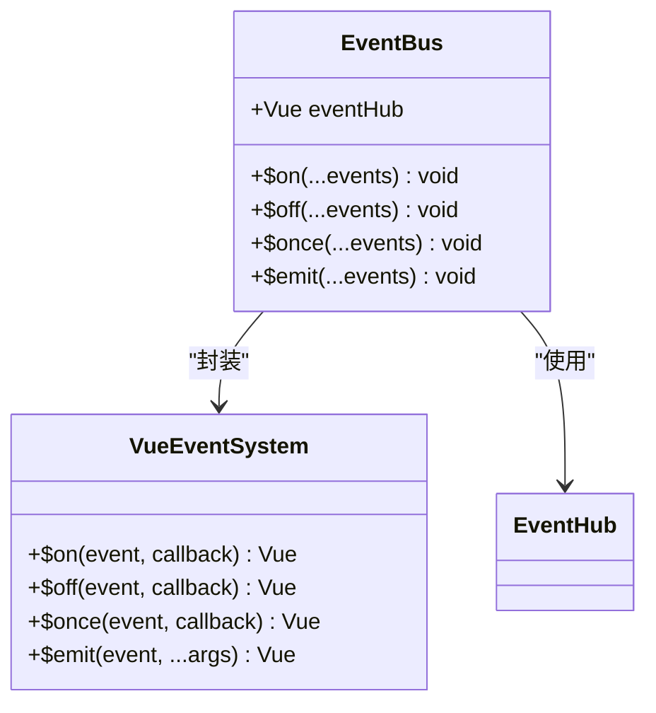
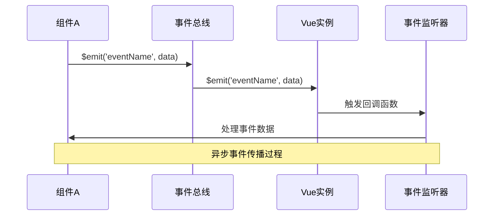
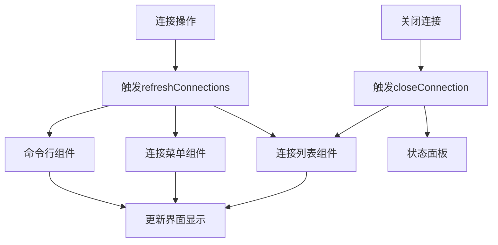
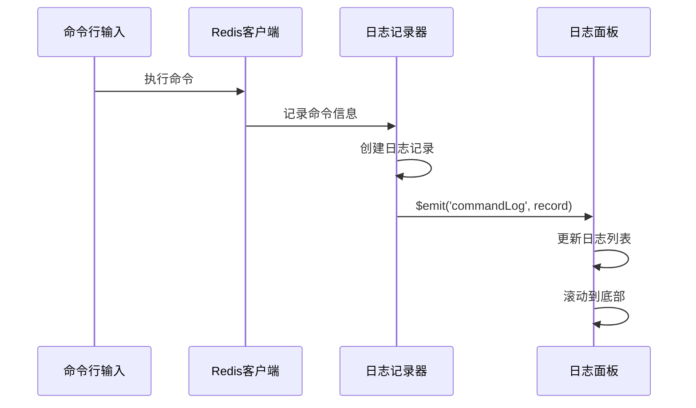
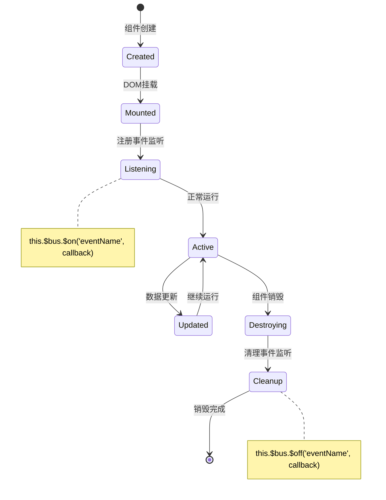
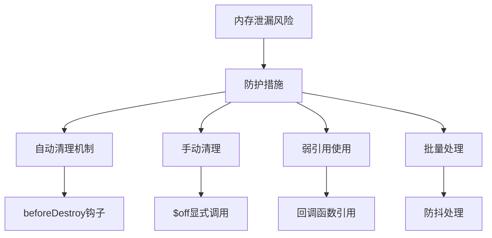
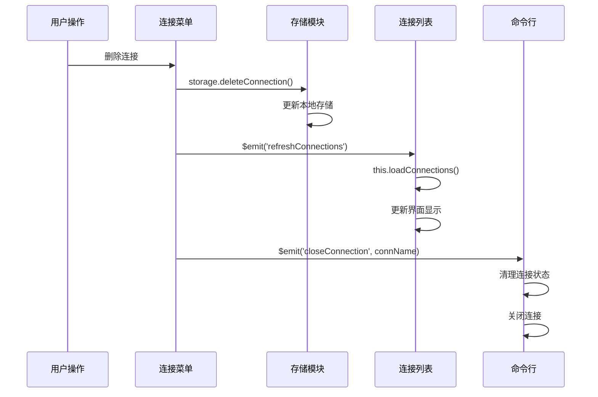
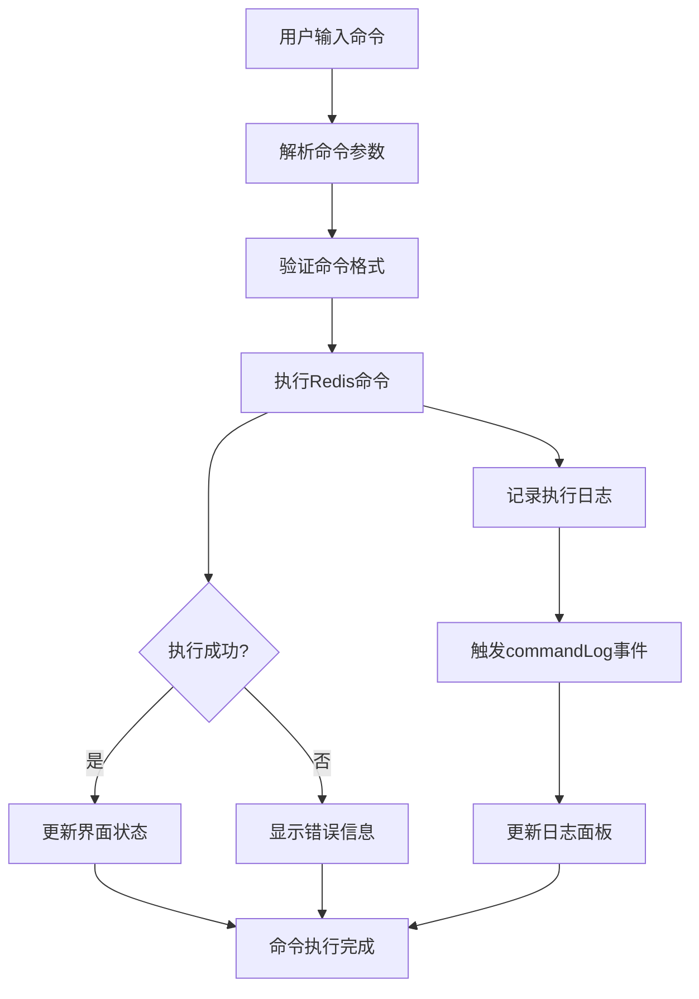
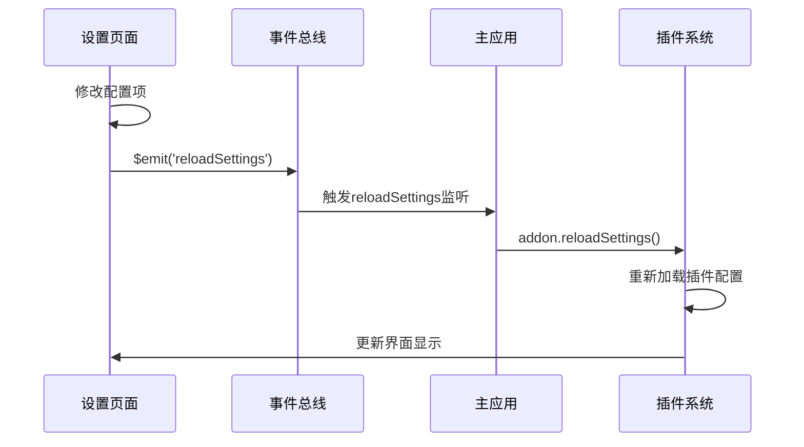

# 事件总线机制

<cite>
**本文档中引用的文件**
- [bus.js](file://src/bus.js)
- [main.js](file://src/main.js)
- [App.vue](file://src/App.vue)
- [Aside.vue](file://src/Aside.vue)
- [CliTab.vue](file://src/components/CliTab.vue)
- [CommandLog.vue](file://src/components/CommandLog.vue)
- [CommandLogPanel.vue](file://src/components/CommandLogPanel.vue)
- [ConnectionMenu.vue](file://src/components/ConnectionMenu.vue)
- [ConnectionGroup.vue](file://src/components/ConnectionGroup.vue)
- [ConnectionWrapper.vue](file://src/components/ConnectionWrapper.vue)
- [addon.js](file://src/addon.js)
</cite>

## 目录
1. [简介](#简介)
2. [事件总线架构](#事件总线架构)
3. [核心实现原理](#核心实现原理)
4. [事件方法详解](#事件方法详解)
5. [跨组件通信场景](#跨组件通信场景)
6. [事件命名规范](#事件命名规范)
7. [生命周期管理](#生命周期管理)
8. [内存泄漏风险与防护](#内存泄漏风险与防护)
9. [实际应用示例](#实际应用示例)
10. [最佳实践建议](#最佳实践建议)

## 简介

Another Redis Desktop Manager采用基于Vue实例的事件总线机制（bus.js）作为全局事件通信的核心组件。该机制通过封装Vue的内置事件系统，为复杂的桌面应用程序提供了灵活、高效的跨组件通信能力，特别是在连接管理、命令执行、界面状态同步等核心功能模块中发挥重要作用。

事件总线机制解决了传统父子组件通信的局限性，使得不直接相关的组件能够进行松耦合的通信，同时保持了代码的可维护性和扩展性。

## 事件总线架构

### 整体架构设计



**图表来源**
- [bus.js](file://src/bus.js#L1-L18)
- [main.js](file://src/main.js#L16)
- [App.vue](file://src/App.vue#L139-L142)

### 核心组件关系

事件总线在整个应用架构中扮演着中央枢纽的角色，连接着各个功能模块：

- **bus.js**: 提供基础的事件订阅和发布功能
- **main.js**: 将事件总线挂载到Vue原型链上，使其可在所有组件中访问
- **各业务组件**: 通过$bus访问事件总线，实现跨组件通信

**节来源**
- [bus.js](file://src/bus.js#L1-L18)
- [main.js](file://src/main.js#L16)

## 核心实现原理

### Vue实例封装机制

事件总线的核心实现基于Vue实例的事件系统，通过创建一个专用的Vue实例来承载所有事件操作：



**图表来源**
- [bus.js](file://src/bus.js#L3-L17)

### 事件处理流程



**图表来源**
- [bus.js](file://src/bus.js#L15-L17)

**节来源**
- [bus.js](file://src/bus.js#L1-L18)

## 事件方法详解

### $on 方法：事件订阅

`$on`方法用于订阅特定事件，当事件被触发时执行相应的回调函数。

**实现原理**：
- 委托给Vue实例的`$on`方法
- 支持多个事件参数的展开传递
- 返回值为Vue实例，支持链式调用

**使用场景**：
- 监听连接状态变化
- 接收命令执行结果
- 响应用户界面状态变更

### $off 方法：事件取消订阅

`$off`方法用于取消事件监听，防止内存泄漏和不必要的事件处理。

**实现原理**：
- 委托给Vue实例的`$off`方法
- 可以移除特定回调或所有回调
- 在组件销毁时自动清理事件监听

### $once 方法：一次性事件订阅

`$once`方法用于订阅只触发一次的事件，适用于初始化场景。

**实现原理**：
- 委托给Vue实例的`$once`方法
- 事件触发后自动移除监听器
- 避免重复处理同一事件

### $emit 方法：事件发布

`$emit`方法用于触发事件，向所有订阅者广播消息。

**实现原理**：
- 委托给Vue实例的`$emit`方法
- 支持传递任意数量的参数
- 按注册顺序依次执行回调函数

**节来源**
- [bus.js](file://src/bus.js#L6-L17)

## 跨组件通信场景

### 连接状态管理

事件总线在连接管理中发挥核心作用，实现了连接状态的实时同步：



**图表来源**
- [ConnectionMenu.vue](file://src/components/ConnectionMenu.vue#L212-L225)
- [ConnectionWrapper.vue](file://src/components/ConnectionWrapper.vue#L115-L116)

### 命令执行日志

命令执行日志系统通过事件总线实现实时记录和展示：



**图表来源**
- [CommandLog.vue](file://src/components/CommandLog.vue#L49-L66)
- [CommandLogPanel.vue](file://src/components/CommandLogPanel.vue#L78-L95)

### 配置更新通知

配置变更通过事件总线通知相关组件：

| 事件名称 | 触发时机 | 监听组件 | 处理内容 |
|---------|---------|---------|---------|
| `reloadSettings` | 设置页面保存配置 | App.vue | 重新加载插件设置 |
| `refreshConnections` | 连接列表变更 | 各组件 | 刷新连接列表显示 |
| `update-check` | 应用启动或手动检查 | App.vue | 检查软件更新 |

**节来源**
- [App.vue](file://src/App.vue#L139-L142)
- [CommandLogPanel.vue](file://src/components/CommandLogPanel.vue#L76-L78)

## 事件命名规范

### 命名约定

事件名称采用清晰、语义化的命名方式，遵循以下规范：

1. **动词开头**：使用表示动作的动词作为事件名称
2. **小写字母**：全部使用小写字母
3. **连字符分隔**：多单词使用连字符分隔
4. **描述性**：事件名称应准确描述触发的场景

### 常见事件类型

| 事件类型 | 命名模式 | 示例 | 使用场景 |
|---------|---------|------|---------|
| 连接管理 | `closeConnection` | 关闭连接 | 断开Redis连接 |
| 连接管理 | `refreshConnections` | 刷新连接列表 | 更新连接状态 |
| 连接管理 | `openConnection` | 打开连接 | 建立新连接 |
| 命令执行 | `commandLog` | 命令日志 | 记录命令执行信息 |
| 界面交互 | `showNewConnectionWithGroup` | 显示新建连接对话框 | 用户界面操作 |
| 系统事件 | `update-check` | 更新检查 | 应用程序生命周期 |

### 参数传递规范

事件参数应遵循结构化传递原则：

```javascript
// 连接关闭事件
this.$bus.$emit('closeConnection', connectionName);

// 命令日志事件  
this.$bus.$emit('commandLog', {
  command: { name: 'GET', args: ['key'] },
  cost: 0.12,
  time: new Date(),
  connectionName: 'MyConnection'
});
```

## 生命周期管理

### 组件生命周期中的事件处理

事件总线的生命周期管理是确保应用稳定性的关键：



### 自动清理机制

在组件的`beforeDestroy`钩子中必须清理事件监听器：

```javascript
// 正确的事件清理方式
beforeDestroy() {
  // 清理所有事件监听
  this.$bus.$off('refreshConnections', this.handleRefreshConnections);
  this.$bus.$off('showNewConnectionWithGroup', this.handleShowNewConnectionWithGroup);
}
```

**节来源**
- [Aside.vue](file://src/Aside.vue#L65-L68)
- [CommandLogPanel.vue](file://src/components/CommandLogPanel.vue#L97-L99)

## 内存泄漏风险与防护

### 内存泄漏风险

事件总线使用不当可能导致内存泄漏，主要风险包括：

1. **未清理的事件监听器**：组件销毁后仍保留事件监听
2. **循环引用**：事件回调函数持有组件引用
3. **频繁的事件触发**：大量事件堆积导致内存占用过高

### 防护措施



### 最佳实践

1. **始终成对出现**：`$on`和`$off`必须配对使用
2. **及时清理**：在组件销毁前清理所有事件监听
3. **避免闭包陷阱**：注意回调函数对外部变量的引用
4. **合理使用once**：对于一次性事件使用`$once`替代`$on`

**节来源**
- [Aside.vue](file://src/Aside.vue#L65-L68)
- [CommandLogPanel.vue](file://src/components/CommandLogPanel.vue#L97-L99)

## 实际应用示例

### 连接状态同步示例

以下是连接状态变化的实际应用场景：



**图表来源**
- [ConnectionMenu.vue](file://src/components/ConnectionMenu.vue#L246-L257)
- [ConnectionWrapper.vue](file://src/components/ConnectionWrapper.vue#L115-L116)

### 命令执行流程示例

命令执行过程展示了事件总线在业务逻辑中的应用：



**图表来源**
- [CliTab.vue](file://src/components/CliTab.vue#L199-L201)
- [CommandLog.vue](file://src/components/CommandLog.vue#L49-L66)

### 配置更新流程示例

配置更新通过事件总线实现全局通知：



**图表来源**
- [App.vue](file://src/App.vue#L139-L142)
- [addon.js](file://src/addon.js#L119-L121)

**节来源**
- [ConnectionMenu.vue](file://src/components/ConnectionMenu.vue#L246-L257)
- [CliTab.vue](file://src/components/CliTab.vue#L199-L201)
- [CommandLog.vue](file://src/components/CommandLog.vue#L49-L66)

## 最佳实践建议

### 事件设计原则

1. **单一职责**：每个事件只负责一个明确的功能领域
2. **语义清晰**：事件名称应准确反映其用途
3. **参数简洁**：传递必要的最小化参数集合
4. **异步处理**：对于耗时操作考虑使用异步处理

### 性能优化建议

1. **事件去重**：避免短时间内重复触发相同事件
2. **批量处理**：对于频繁事件考虑批量处理机制
3. **优先级管理**：重要事件应有更高的处理优先级
4. **资源限制**：对事件队列长度进行合理限制

### 调试和监控

1. **事件追踪**：记录关键事件的触发和处理情况
2. **性能监控**：监控事件处理的性能指标
3. **错误处理**：为事件处理添加适当的错误捕获
4. **日志记录**：记录事件总线的关键操作

### 扩展性考虑

1. **插件化设计**：支持第三方插件注册事件处理器
2. **事件过滤**：提供事件过滤和路由机制
3. **版本兼容**：考虑事件接口的向后兼容性
4. **文档维护**：保持事件文档的及时更新

通过合理使用事件总线机制，Another Redis Desktop Manager实现了高度解耦的架构设计，使得各个功能模块能够独立开发和测试，同时保持良好的协作能力。这种设计不仅提高了代码的可维护性，也为未来的功能扩展奠定了坚实的基础。