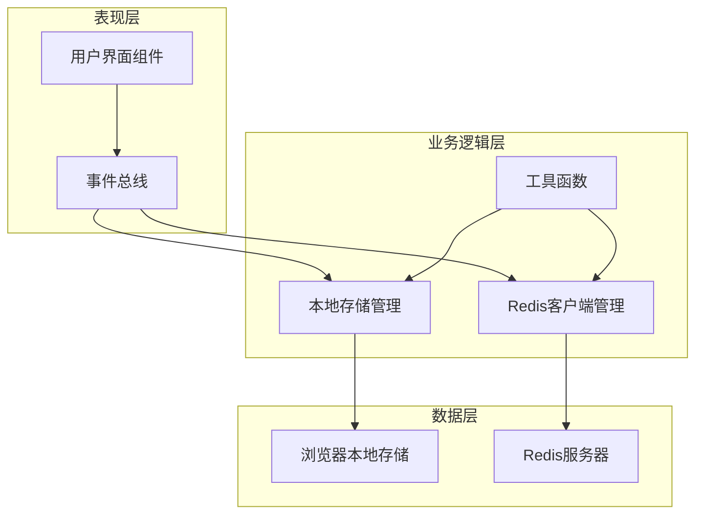
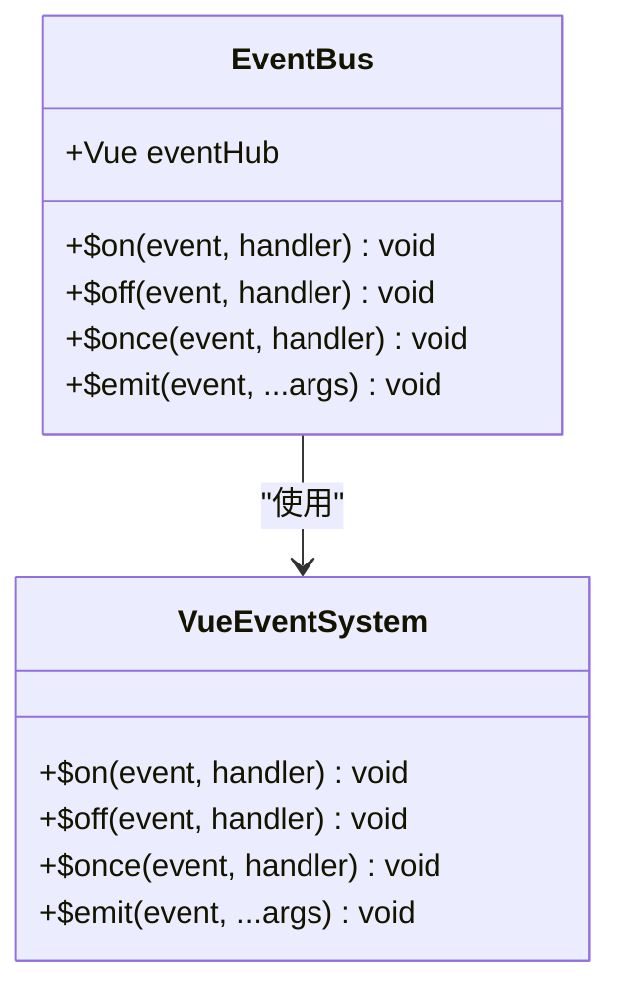
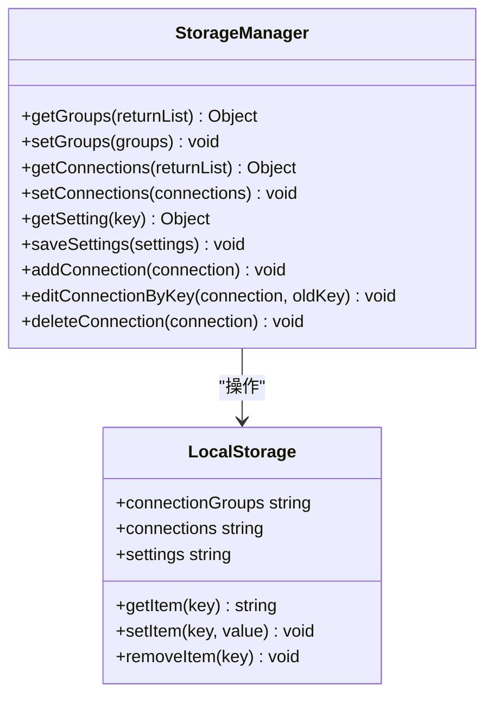
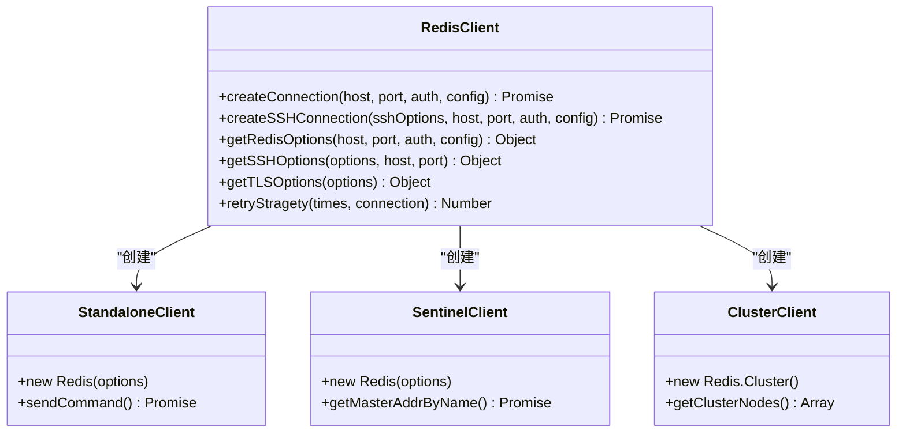
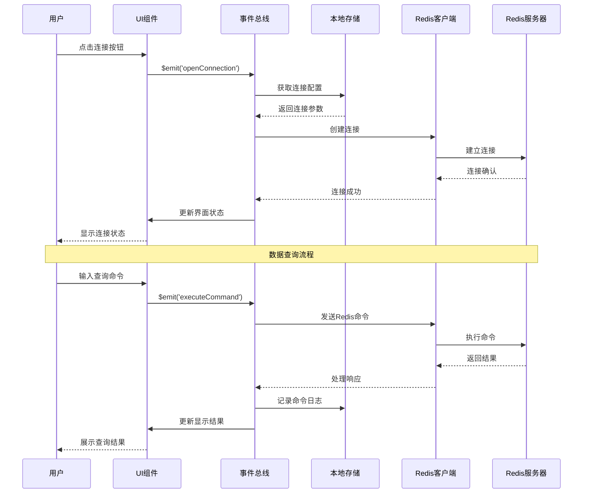
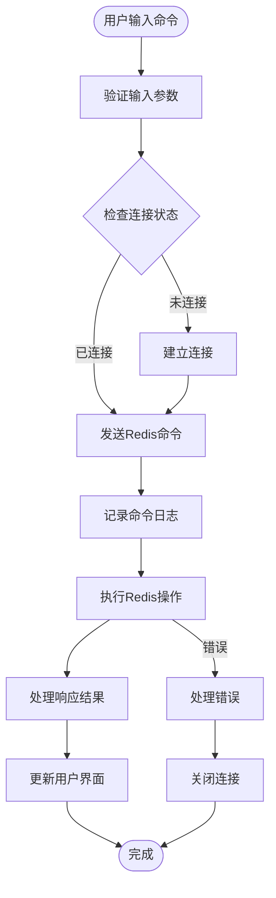
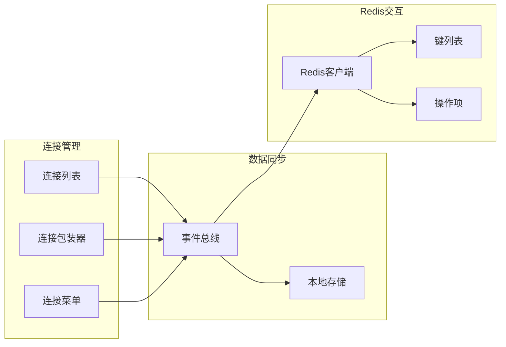
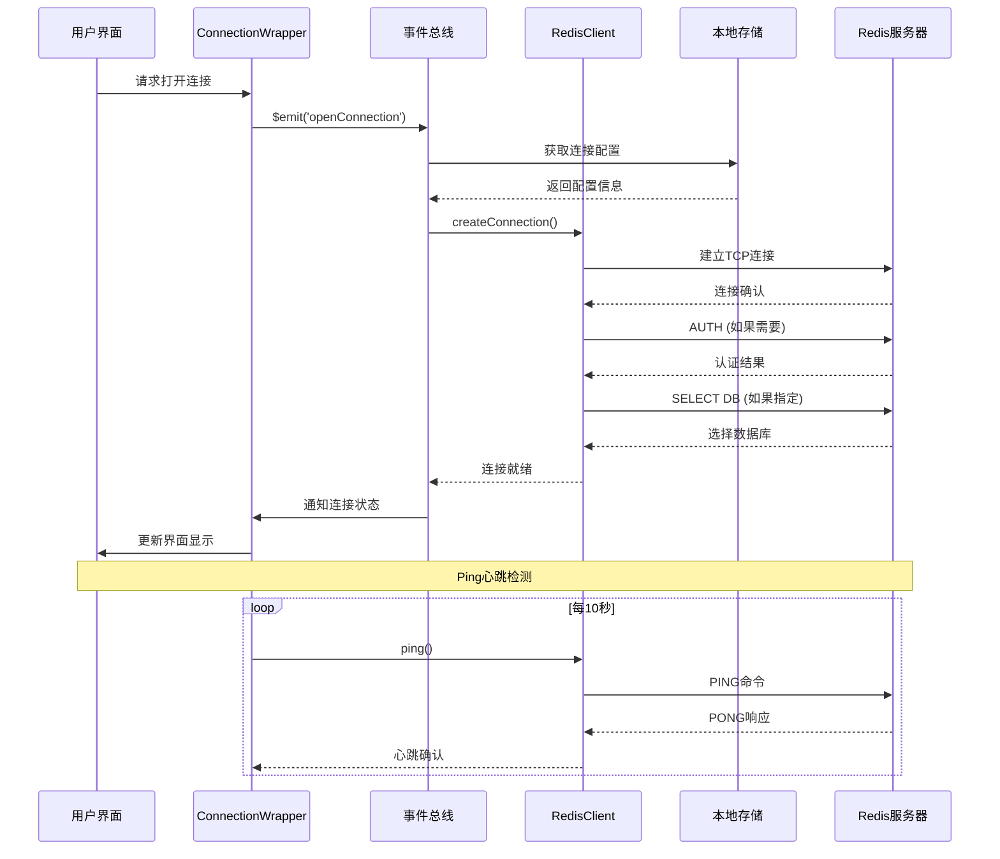
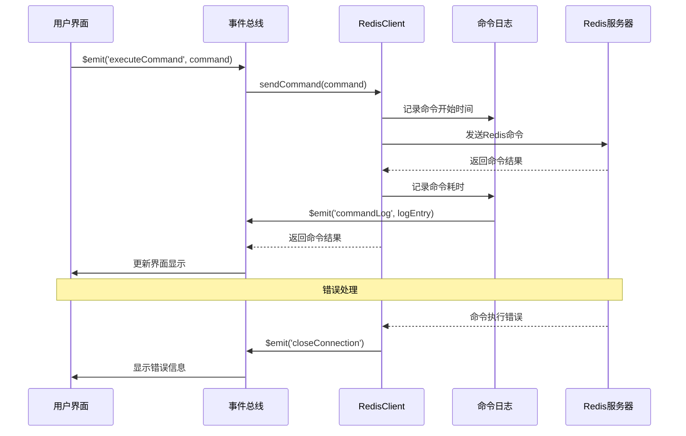
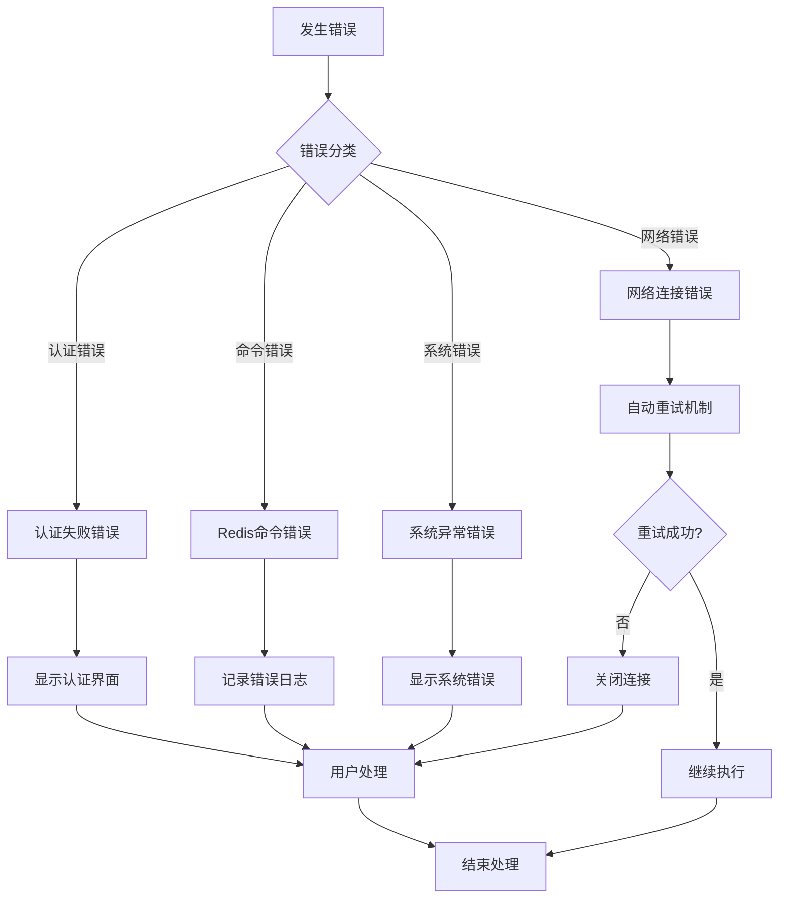

# Another Redis Desktop Manager 数据流设计

<cite>
**本文档中引用的文件**
- [bus.js](file://src/bus.js)
- [storage.js](file://src/storage.js)
- [redisClient.js](file://src/redisClient.js)
- [main.js](file://src/main.js)
- [App.vue](file://src/App.vue)
- [util.js](file://src/util.js)
- [Connections.vue](file://src/components/Connections.vue)
- [ConnectionWrapper.vue](file://src/components/ConnectionWrapper.vue)
- [CommandLogPanel.vue](file://src/components/CommandLogPanel.vue)
- [s3Sync.js](file://src/s3Sync.js)
</cite>

## 目录
1. [简介](#简介)
2. [系统架构概览](#系统架构概览)
3. [事件总线设计](#事件总线设计)
4. [数据持久化层](#数据持久化层)
5. [Redis客户端层](#redis客户端层)
6. [数据流完整路径](#数据流完整路径)
7. [状态管理与同步](#状态管理与同步)
8. [数据流时序图](#数据流时序图)
9. [性能优化考虑](#性能优化考虑)
10. [故障处理机制](#故障处理机制)

## 简介

Another Redis Desktop Manager 是一个基于 Electron 的 Redis 客户端工具，采用 Vue.js 框架构建。其数据流设计围绕事件驱动架构，通过中央事件总线实现组件间通信，同时提供完整的数据持久化和 Redis 连接管理功能。

## 系统架构概览

应用程序采用分层架构设计，主要包含以下核心层次：

**图表来源**
- [main.js](file://src/main.js#L16-L20)
- [bus.js](file://src/bus.js#L1-L19)
- [storage.js](file://src/storage.js#L1-L329)

## 事件总线设计

### 中央通信枢纽

事件总线（bus.js）是整个应用的中央通信枢纽，基于 Vue.js 的事件系统实现：

**图表来源**
- [bus.js](file://src/bus.js#L3-L17)

### 核心事件类型

事件总线处理多种类型的事件，包括：

| 事件类型 | 描述 | 触发场景 |
|---------|------|----------|
| `closeConnection` | 关闭Redis连接 | 用户断开连接或连接失败 |
| `refreshConnections` | 刷新连接列表 | 添加/删除连接后 |
| `openConnection` | 打开新连接 | 用户选择连接 |
| `commandLog` | 记录命令日志 | Redis命令执行时 |
| `update-check` | 检查更新 | 应用启动时 |

**节来源**
- [bus.js](file://src/bus.js#L1-L19)
- [main.js](file://src/main.js#L16-L20)

## 数据持久化层

### 本地存储管理

storage.js 提供完整的本地数据管理功能，基于浏览器的 localStorage 实现：

**图表来源**
- [storage.js](file://src/storage.js#L5-L329)

### 数据结构设计

| 数据类型 | 存储键 | 结构描述 |
|---------|--------|----------|
| 连接配置 | `connections` | JSON格式的连接对象数组 |
| 连接组 | `connectionGroups` | 分组信息，支持嵌套结构 |
| 应用设置 | `settings` | 全局应用配置选项 |
| S3同步配置 | `s3Config` | 云同步相关设置 |

**节来源**
- [storage.js](file://src/storage.js#L8-L42)
- [storage.js](file://src/storage.js#L123-L138)

## Redis客户端层

### 高级连接管理

redisClient.js 封装了 ioredis 客户端，提供多种连接模式：

**图表来源**
- [redisClient.js](file://src/redisClient.js#L51-L88)
- [redisClient.js](file://src/redisClient.js#L90-L164)

### 支持的连接模式

| 连接类型 | 描述 | 特性 |
|---------|------|------|
| 单机模式 | 标准Redis实例连接 | 基础认证、SSL/TLS支持 |
| 哨兵模式 | Redis高可用集群 | 自动故障转移、主节点发现 |
| 集群模式 | 分布式Redis集群 | 数据分片、自动路由 |
| SSH隧道 | 通过SSH加密连接 | 网络安全、远程访问 |

**节来源**
- [redisClient.js](file://src/redisClient.js#L52-L87)
- [redisClient.js](file://src/redisClient.js#L90-L164)

## 数据流完整路径

### 用户操作到响应的完整流程

**图表来源**
- [ConnectionWrapper.vue](file://src/components/ConnectionWrapper.vue#L84-L103)
- [redisClient.js](file://src/redisClient.js#L11-L37)

### 命令执行流程

**图表来源**
- [redisClient.js](file://src/redisClient.js#L11-L37)
- [ConnectionWrapper.vue](file://src/components/ConnectionWrapper.vue#L176-L191)

## 状态管理与同步

### 跨组件状态同步

应用通过事件总线实现跨组件的状态同步：

**图表来源**
- [Connections.vue](file://src/components/Connections.vue#L115-L121)
- [ConnectionWrapper.vue](file://src/components/ConnectionWrapper.vue#L54-L64)

### 数据一致性保证

| 同步机制 | 适用场景 | 实现方式 |
|---------|----------|----------|
| 事件广播 | 组件间通信 | Vue事件系统 |
| 本地存储 | 持久化数据 | localStorage API |
| 连接池管理 | Redis连接复用 | Promise队列 |
| 状态缓存 | 快速响应 | 内存缓存 |

**节来源**
- [bus.js](file://src/bus.js#L1-L19)
- [storage.js](file://src/storage.js#L1-L329)

## 数据流时序图

### 连接建立时序

**图表来源**
- [ConnectionWrapper.vue](file://src/components/ConnectionWrapper.vue#L84-L127)
- [redisClient.js](file://src/redisClient.js#L165-L191)

### 命令执行时序

**图表来源**
- [redisClient.js](file://src/redisClient.js#L11-L37)
- [CommandLogPanel.vue](file://src/components/CommandLogPanel.vue#L81-L95)

## 性能优化考虑

### 连接池管理

应用实现了智能的连接池管理策略：

- **延迟连接**：仅在用户实际需要时才建立连接
- **连接复用**：同一连接配置可被多个标签页共享
- **自动重连**：网络中断时自动尝试重新连接
- **超时控制**：设置合理的连接和命令超时时间

### 缓存策略

| 缓存层级 | 缓存内容 | 生命周期 |
|---------|----------|----------|
| 内存缓存 | 当前连接状态 | 页面会话期间 |
| 本地存储 | 连接配置 | 持久化保存 |
| 浏览器缓存 | 应用资源 | 浏览器生命周期 |

### 异步处理

所有I/O操作都采用异步模式，避免阻塞主线程：

- **Promise链式调用**：确保异步操作的顺序执行
- **事件驱动**：基于事件的非阻塞架构
- **防抖处理**：对频繁操作进行防抖优化

## 故障处理机制

### 错误分类与处理

**图表来源**
- [redisClient.js](file://src/redisClient.js#L344-L354)
- [ConnectionWrapper.vue](file://src/components/ConnectionWrapper.vue#L179-L191)

### 重试策略

应用实现了指数退避重试算法：

- **最大重试次数**：3次
- **重试间隔**：200ms → 400ms → 800ms
- **最终处理**：显示错误信息并关闭连接

### 数据恢复机制

| 恢复场景 | 恢复策略 | 实现方式 |
|---------|----------|----------|
| 连接断开 | 自动重连 | 事件监听 + 重试计数 |
| 应用崩溃 | 状态恢复 | localStorage + 事件重建 |
| 数据损坏 | 本地备份 | 自动备份 + 手动恢复 |
| 网络异常 | 缓存降级 | 本地缓存 + 离线模式 |

**节来源**
- [redisClient.js](file://src/redisClient.js#L344-L354)
- [storage.js](file://src/storage.js#L316-L328)

## 结论

Another Redis Desktop Manager 的数据流设计体现了现代前端应用的最佳实践：

1. **事件驱动架构**：通过中央事件总线实现松耦合的组件通信
2. **分层数据管理**：清晰分离表现层、业务逻辑层和数据层
3. **异步处理模式**：充分利用Promise和事件驱动提升用户体验
4. **容错机制**：完善的错误处理和恢复策略确保应用稳定性
5. **性能优化**：智能缓存和连接管理提供流畅的使用体验

这种设计不仅保证了应用的功能完整性，还为未来的功能扩展和性能优化奠定了坚实的基础。