# 应用设置管理

<cite>
**本文档引用的文件**
- [storage.js](file://src/storage.js)
- [Setting.vue](file://src/components/Setting.vue)
- [s3Sync.js](file://src/s3Sync.js)
- [index.html](file://index.html)
- [main.js](file://src/main.js)
- [font-manager.js](file://pack/electron/font-manager.js)
- [JsonEditor.vue](file://src/components/JsonEditor.vue)
- [CliContent.vue](file://src/components/CliContent.vue)
- [en.js](file://src/i18n/langs/en.js)
</cite>

## 目录
1. [简介](#简介)
2. [项目结构概览](#项目结构概览)
3. [核心设置存储架构](#核心设置存储架构)
4. [设置管理功能详解](#设置管理功能详解)
5. [字体配置系统](#字体配置系统)
6. [S3同步配置管理](#s3同步配置管理)
7. [自定义格式化器管理](#自定义格式化器管理)
8. [用户界面绑定机制](#用户界面绑定机制)
9. [响应式更新机制](#响应式更新机制)
10. [性能优化考虑](#性能优化考虑)
11. [故障排除指南](#故障排除指南)
12. [总结](#总结)

## 简介

Another Redis Desktop Manager (ARDM) 的应用设置管理系统是一个基于 localStorage 的配置存储解决方案，提供了完整的设置持久化、字体管理、S3同步配置和自定义格式化器等功能。该系统通过 `storage.js` 模块实现了统一的设置管理接口，并与 Vue 组件紧密集成，确保用户设置的实时保存和响应式更新。

## 项目结构概览

应用设置管理系统的核心组件分布在以下关键文件中：

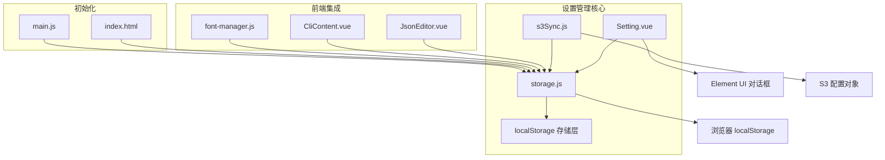

**图表来源**
- [storage.js](file://src/storage.js#L1-L339)
- [Setting.vue](file://src/components/Setting.vue#L1-L1089)
- [s3Sync.js](file://src/s3Sync.js#L1-L234)

## 核心设置存储架构

### localStorage 设置键结构

应用设置通过 `localStorage.settings` 键进行存储，采用 JSON 序列化格式：

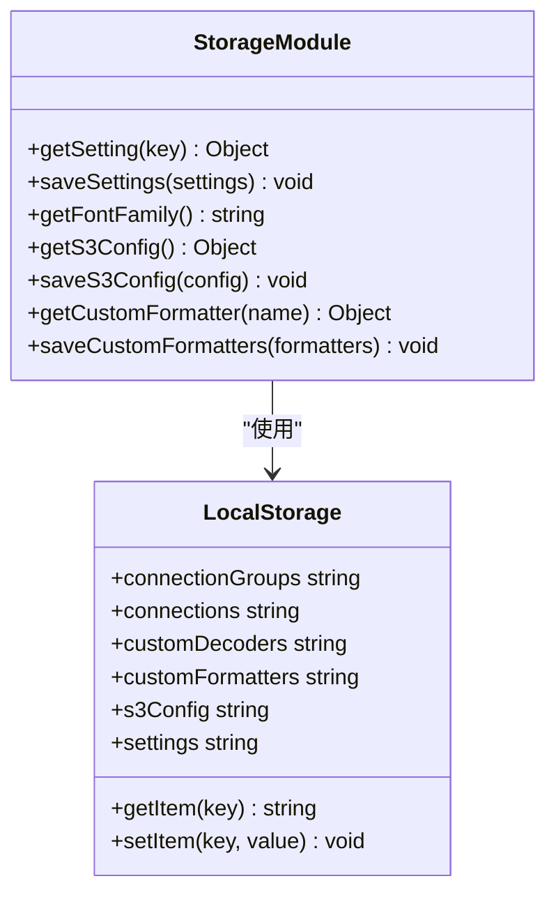

**图表来源**
- [storage.js](file://src/storage.js#L151-L160)
- [storage.js](file://src/storage.js#L123-L138)

### 设置数据流架构

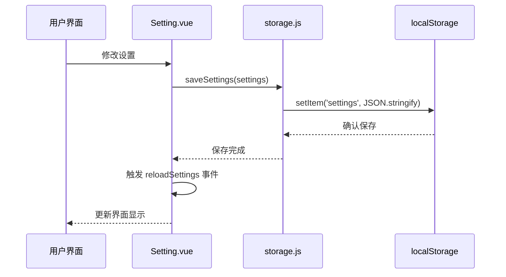

**图表来源**
- [Setting.vue](file://src/components/Setting.vue#L511-L521)
- [storage.js](file://src/storage.js#L157-L160)

**章节来源**
- [storage.js](file://src/storage.js#L151-L160)
- [Setting.vue](file://src/components/Setting.vue#L497-L521)

## 设置管理功能详解

### getSetting 和 saveSettings 方法

这两个核心方法提供了统一的设置访问接口：

#### getSetting 方法实现

```javascript
getSetting(key) {
  let settings = localStorage.getItem('settings');
  settings = settings ? JSON.parse(settings) : {};
  return key ? settings[key] : settings;
}
```

该方法具有以下特点：
- **健壮性**：当 localStorage 中不存在 settings 键时，返回空对象而非抛出异常
- **灵活性**：支持按键名获取特定设置值或获取所有设置
- **类型安全**：确保返回值始终是 JavaScript 对象

#### saveSettings 方法实现

```javascript
saveSettings(settings) {
  settings = JSON.stringify(settings);
  return localStorage.setItem('settings', settings);
}
```

该方法的特点：
- **序列化**：自动将 JavaScript 对象转换为 JSON 字符串
- **原子性**：一次性写入整个设置对象，避免部分更新问题
- **错误处理**：依赖 localStorage 的内置错误处理机制

### 默认值处理策略

系统在多个位置实现了智能的默认值处理：

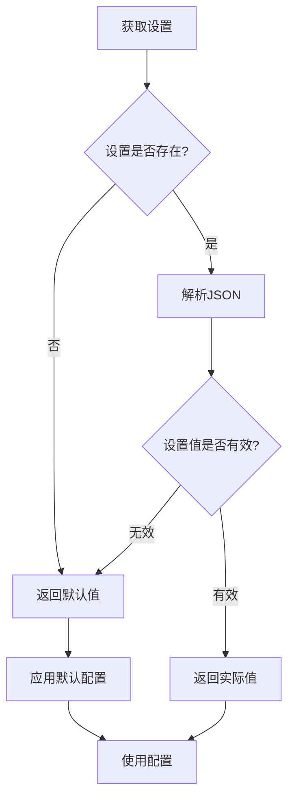

**图表来源**
- [storage.js](file://src/storage.js#L151-L156)
- [storage.js](file://src/storage.js#L123-L134)

**章节来源**
- [storage.js](file://src/storage.js#L151-L160)

## 字体配置系统

### getFontFamily 方法详解

字体配置系统是 ARDM 的重要特性之一，提供了跨平台兼容的字体栈管理：

#### 默认字体栈设计

```javascript
fontFamily = ['-apple-system', 'BlinkMacSystemFont', 'Segoe UI', 'Helvetica',
  'Arial', 'sans-serif', 'Microsoft YaHei', 'Apple Color Emoji', 'Segoe UI Emoji'];
```

这个字体栈的设计原则：
- **优先级排序**：按照操作系统原生字体 → 英文字体 → 中文字体 → 特殊字符字体的顺序排列
- **跨平台兼容**：确保在不同操作系统上都能获得良好的显示效果
- **国际化支持**：包含 Microsoft YaHei 等中文字体，支持中文显示
- **现代特性**：包含 Apple Color Emoji 和 Segoe UI Emoji 支持表情符号

#### 字体配置验证逻辑

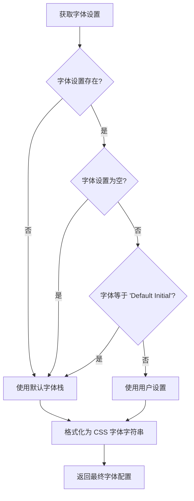

**图表来源**
- [storage.js](file://src/storage.js#L161-L174)

#### 字体应用机制

字体配置不仅存储在 localStorage 中，还被动态应用到各个编辑器组件：

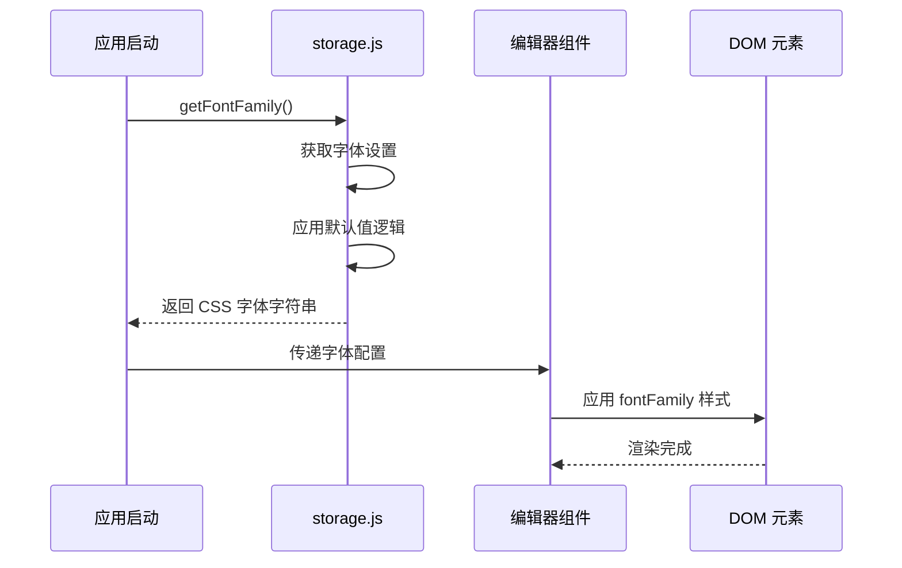

**图表来源**
- [JsonEditor.vue](file://src/components/JsonEditor.vue#L109-L110)
- [CliContent.vue](file://src/components/CliContent.vue#L29-L31)

**章节来源**
- [storage.js](file://src/storage.js#L161-L174)
- [JsonEditor.vue](file://src/components/JsonEditor.vue#L109-L110)
- [CliContent.vue](file://src/components/CliContent.vue#L29-L31)

## S3同步配置管理

### S3 配置数据结构

S3 同步配置提供了完整的云存储连接信息管理：

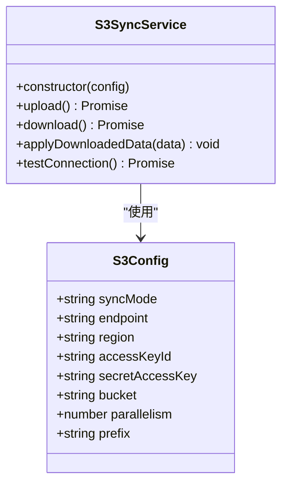

**图表来源**
- [storage.js](file://src/storage.js#L123-L134)
- [s3Sync.js](file://src/s3Sync.js#L12-L21)

### getS3Config 和 saveS3Config 方法

#### getS3Config 默认值设计

```javascript
{
  syncMode: 'manual',
  endpoint: '',
  region: 'us-east-1',
  accessKeyId: '',
  secretAccessKey: '',
  bucket: '',
  parallelism: 4,
  prefix: 'ardm-sync/'
}
```

默认值的设计考虑：
- **安全性**：所有敏感信息字段初始为空
- **可用性**：提供合理的默认参数（如 us-east-1 区域）
- **灵活性**：允许用户根据需要配置不同的同步模式
- **性能**：设置合理的并发数（4 并发）

#### 配置验证和处理

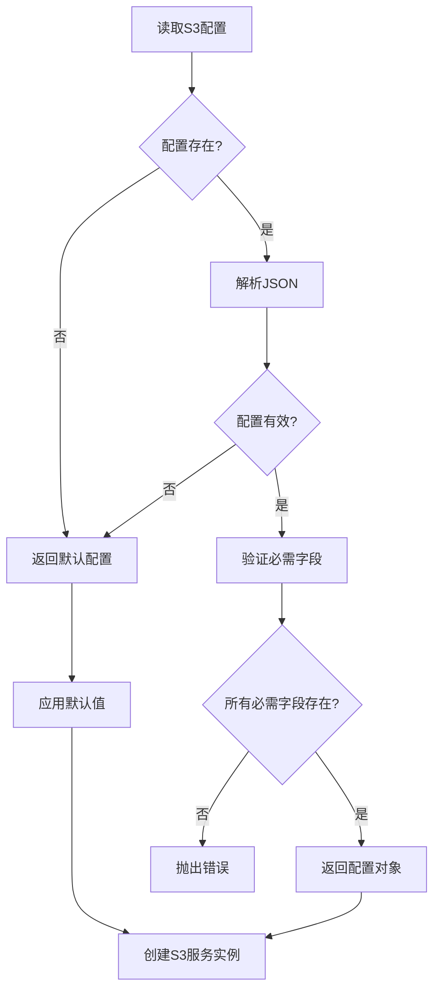

**图表来源**
- [storage.js](file://src/storage.js#L123-L134)
- [s3Sync.js](file://src/s3Sync.js#L22-L25)

**章节来源**
- [storage.js](file://src/storage.js#L123-L138)
- [s3Sync.js](file://src/s3Sync.js#L12-L21)

## 自定义格式化器管理

### 格式化器数据结构

自定义格式化器采用数组存储结构，每个格式化器包含以下属性：

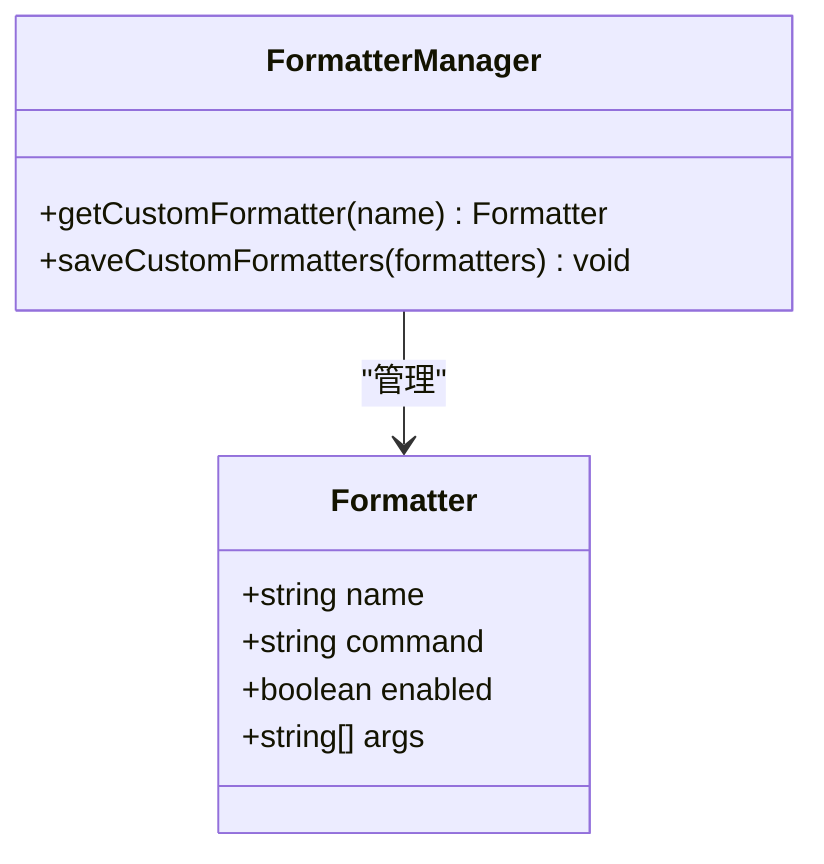

**图表来源**
- [storage.js](file://src/storage.js#L175-L188)

### getCustomFormatter 实现逻辑

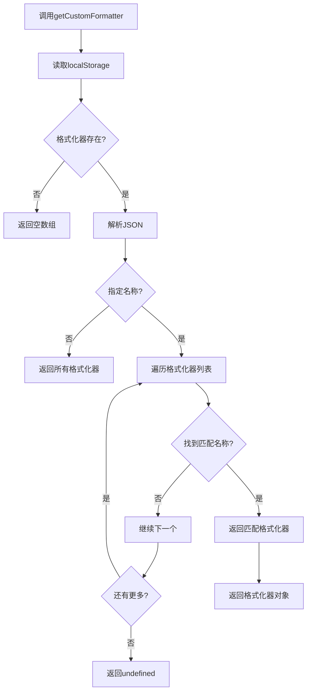

**图表来源**
- [storage.js](file://src/storage.js#L175-L188)

### 格式化器存储和检索

格式化器的存储采用数组结构，支持按名称精确查询：

```javascript
// 存储示例
[
  {
    name: "JSON Beautify",
    command: "python beautify.py",
    args: ["--indent", "2"],
    enabled: true
  },
  {
    name: "XML Format",
    command: "xmlformatter",
    args: [],
    enabled: false
  }
]
```

这种设计的优势：
- **简单高效**：数组结构便于快速存储和检索
- **精确查询**：支持按名称查找特定格式化器
- **状态管理**：每个格式化器包含启用状态
- **扩展性**：可以轻松添加新的格式化器属性

**章节来源**
- [storage.js](file://src/storage.js#L175-L188)

## 用户界面绑定机制

### Setting.vue 组件架构

Setting.vue 是应用设置的主要用户界面，采用了模块化的组件设计：

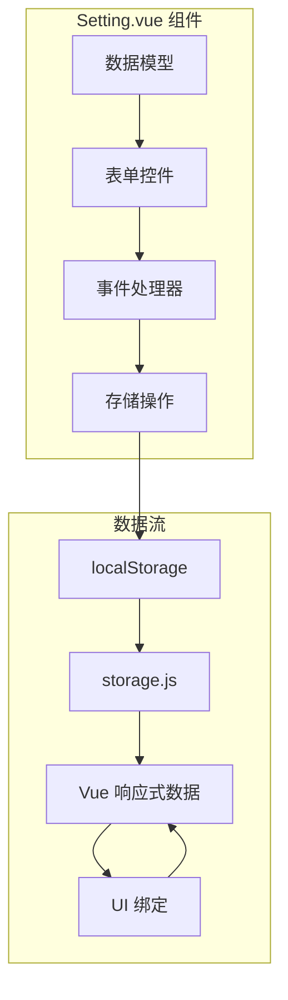

**图表来源**
- [Setting.vue](file://src/components/Setting.vue#L420-L467)

### 设置项分类和组织

Setting.vue 将设置分为四个主要类别：

| 类别 | 设置项 | 功能描述 |
|------|--------|----------|
| General | themeMode, fontFamily, fontSize, keysPageSize | 基础外观和行为设置 |
| Editor | editorFontFamily, editorFontSize, editorLineNumbers | 编辑器专用设置 |
| CLI | cliFontFamily, cliFontSize, cliCursorStyle | 命令行界面设置 |
| Decoder | decoders 数组 | 自定义解码器配置 |

### 表单绑定和验证

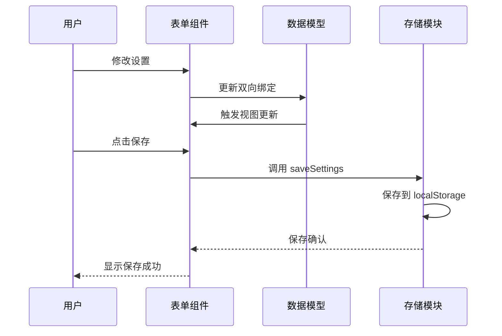

**图表来源**
- [Setting.vue](file://src/components/Setting.vue#L497-L521)

**章节来源**
- [Setting.vue](file://src/components/Setting.vue#L420-L521)

## 响应式更新机制

### 主题切换响应式更新

应用的主题切换采用了多层次的响应式更新机制：

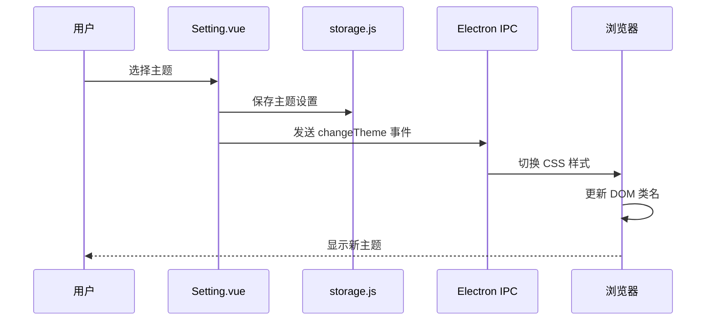

**图表来源**
- [Setting.vue](file://src/components/Setting.vue#L543-L546)
- [index.html](file://index.html#L21-L28)

### 设置变更通知机制

应用使用了事件总线模式来实现设置变更的通知：

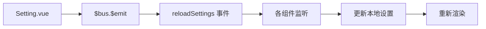

**图表来源**
- [Setting.vue](file://src/components/Setting.vue#L516)

### 实时预览功能

某些设置项支持实时预览，无需保存即可看到效果：

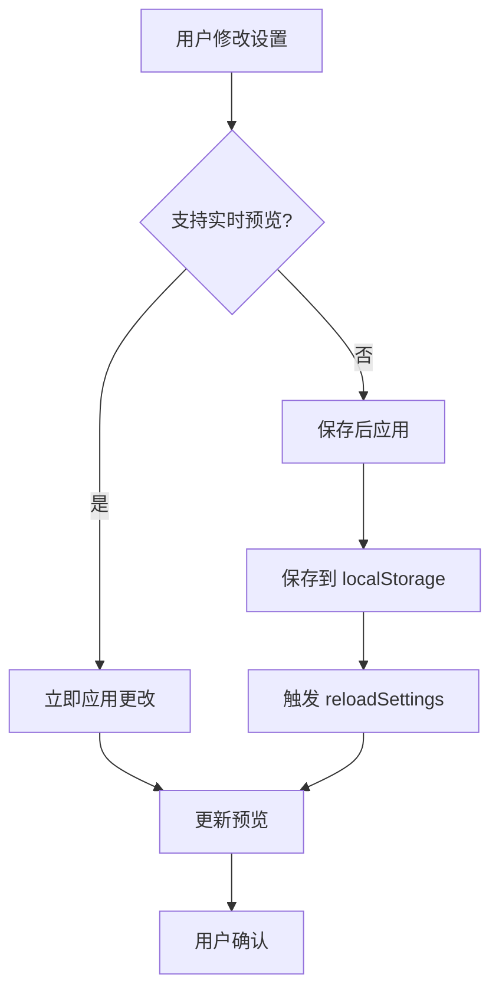

**章节来源**
- [Setting.vue](file://src/components/Setting.vue#L516)
- [index.html](file://index.html#L21-L28)

## 性能优化考虑

### localStorage 使用策略

应用在使用 localStorage 时采用了多种优化策略：

1. **批量操作**：将相关设置打包成对象进行存储
2. **延迟加载**：仅在需要时读取特定设置
3. **缓存机制**：在内存中缓存常用设置值
4. **序列化优化**：使用高效的 JSON 序列化

### 内存管理

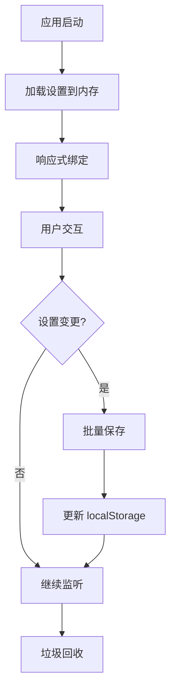

### 初始化性能

应用在初始化时采用了渐进式加载策略：

```javascript
// 渐进式初始化示例
setTimeout(() => {
  changeCSS(arg.shouldUseDarkColors ? 'dark' : 'light');
}, 100);
```

这种设计确保了应用启动的流畅性，避免了阻塞主线程。

## 故障排除指南

### 常见问题和解决方案

#### 设置丢失问题

**症状**：应用重启后设置恢复为默认值

**原因分析**：
- localStorage 存储空间不足
- 浏览器隐私模式限制
- 应用程序权限问题

**解决方案**：
1. 检查浏览器存储配额
2. 确保在正常浏览模式下运行
3. 检查应用程序权限设置

#### 字体显示异常

**症状**：字体设置不生效或显示乱码

**排查步骤**：
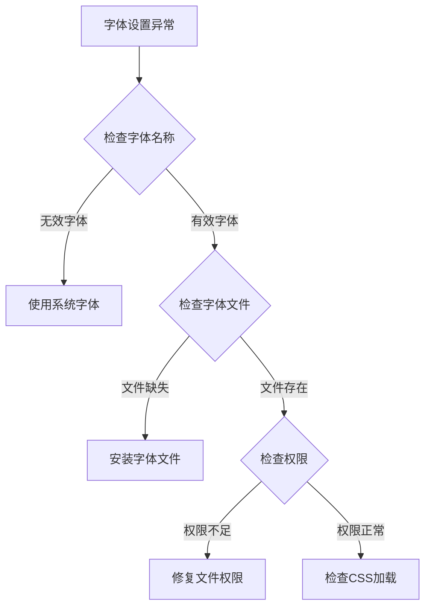

#### S3 同步失败

**症状**：S3 同步功能无法正常工作

**诊断流程**：
1. 验证网络连接
2. 检查 S3 配置参数
3. 测试访问密钥权限
4. 验证端点地址有效性

### 调试工具和技巧

应用提供了多种调试工具来帮助诊断设置相关问题：

```javascript
// 调试设置存储
console.log('当前设置:', storage.getSetting());
console.log('S3配置:', storage.getS3Config());
console.log('字体设置:', storage.getFontFamily());
```

## 总结

Another Redis Desktop Manager 的应用设置管理系统展现了现代 Web 应用中设置管理的最佳实践。通过 localStorage 的合理使用、模块化的架构设计和响应式的用户界面集成，该系统实现了：

### 核心优势

1. **统一性**：通过 storage.js 提供一致的设置访问接口
2. **可靠性**：基于浏览器原生 localStorage，确保数据持久性
3. **可扩展性**：模块化设计支持新功能的无缝集成
4. **用户体验**：实时预览和响应式更新提升用户满意度

### 技术亮点

- **智能默认值**：多层级的默认值处理确保应用稳定性
- **跨平台兼容**：字体栈设计支持多操作系统环境
- **安全考虑**：敏感信息的安全存储和传输
- **性能优化**：批量操作和缓存机制提升响应速度

### 未来发展方向

该设置管理系统为未来的功能扩展奠定了坚实基础，可以轻松支持：
- 更多的个性化设置选项
- 多语言本地化支持
- 云端设置同步
- 高级配置导入导出

通过持续的优化和改进，这个设置管理系统将继续为用户提供卓越的应用体验。