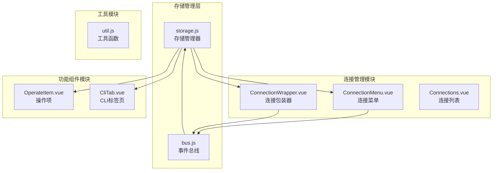
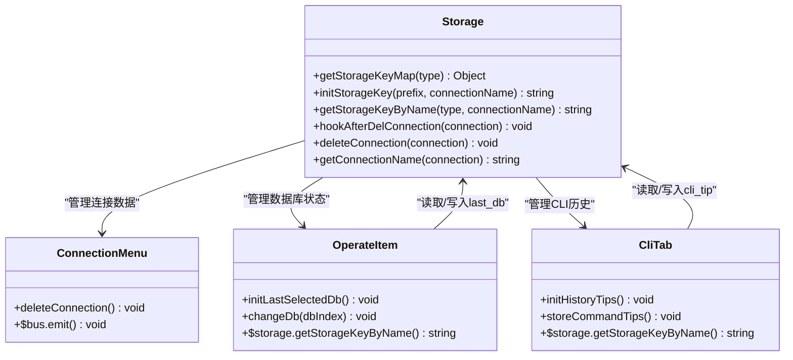
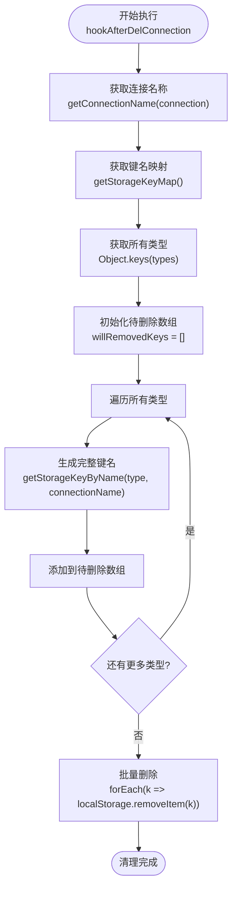
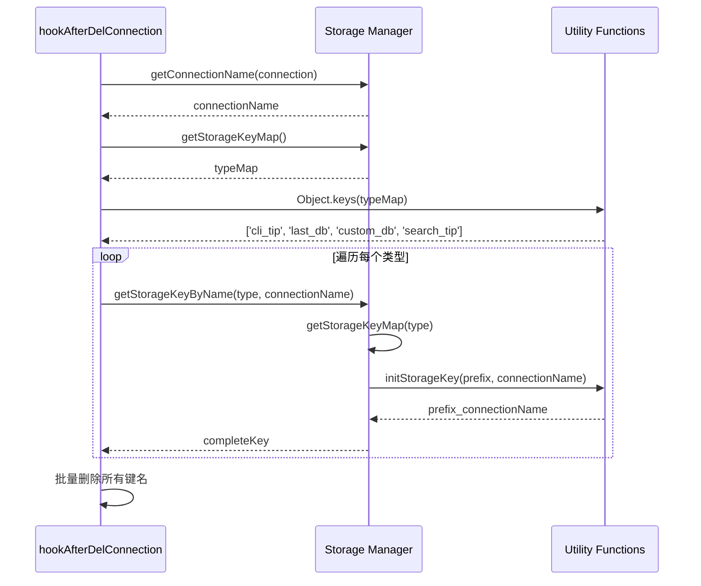
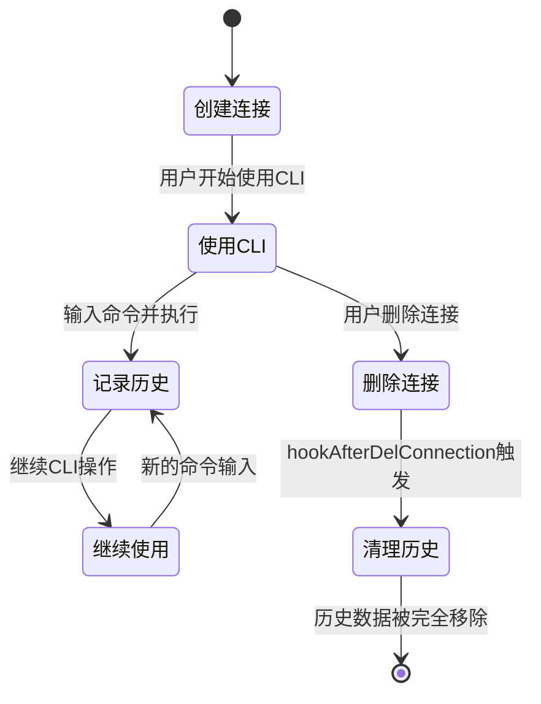
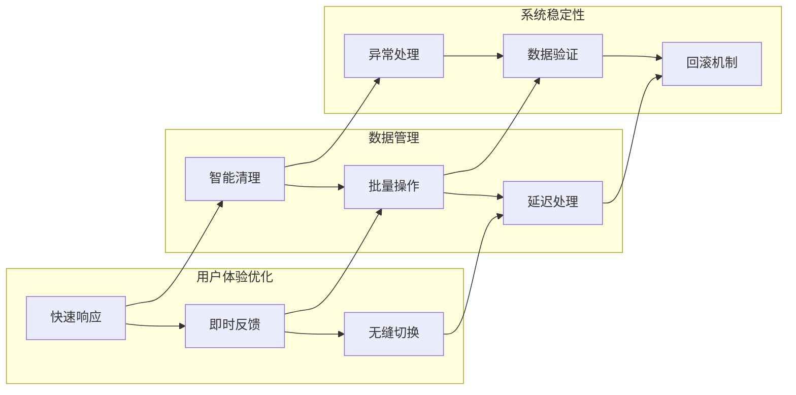
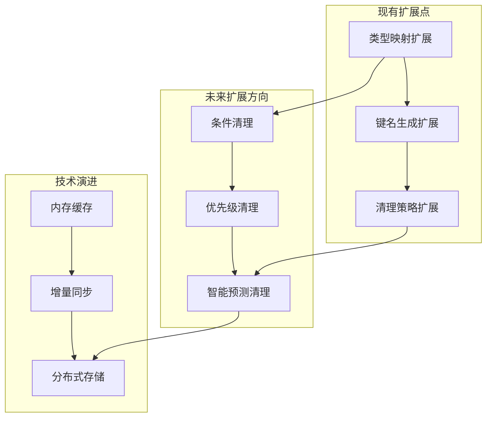

# 数据清理机制

<cite>
**本文档中引用的文件**
- [storage.js](file://src/storage.js)
- [bus.js](file://src/bus.js)
- [ConnectionMenu.vue](file://src/components/ConnectionMenu.vue)
- [OperateItem.vue](file://src/components/OperateItem.vue)
- [CliTab.vue](file://src/components/CliTab.vue)
- [ConnectionWrapper.vue](file://src/components/ConnectionWrapper.vue)
- [util.js](file://src/util.js)
</cite>

## 目录
1. [引言](#引言)
2. [项目架构概览](#项目架构概览)
3. [核心组件分析](#核心组件分析)
4. [hookAfterDelConnection方法详解](#hookafterdelconnection方法详解)
5. [临时数据键名映射机制](#临时数据键名映射机制)
6. [CLI使用场景分析](#cli使用场景分析)
7. [数据一致性与用户体验平衡](#数据一致性与用户体验平衡)
8. [扩展性设计](#扩展性设计)
9. [性能考虑](#性能考虑)
10. [总结](#总结)

## 引言

在Redis桌面管理器应用中，用户经常需要添加、编辑和删除多个Redis连接。为了提供良好的用户体验，应用需要维护各种临时状态信息，如CLI命令历史、数据库选择状态、搜索提示等。然而，当用户删除某个连接时，这些与该连接相关的临时数据如果不被及时清理，就会导致存储空间浪费和潜在的数据混乱。本文档深入分析了应用中数据清理机制的设计原理与实现细节。

## 项目架构概览

应用采用模块化架构设计，主要包含以下核心模块：



**图表来源**
- [storage.js](file://src/storage.js#L1-L339)
- [bus.js](file://src/bus.js#L1-L19)
- [ConnectionMenu.vue](file://src/components/ConnectionMenu.vue#L1-L314)

## 核心组件分析

### 存储管理器（Storage）

存储管理器是整个数据清理机制的核心，负责管理所有持久化数据的存储和检索。它提供了统一的接口来处理不同类型的数据存储需求。



**图表来源**
- [storage.js](file://src/storage.js#L310-L338)
- [OperateItem.vue](file://src/components/OperateItem.vue#L76-L82)
- [CliTab.vue](file://src/components/CliTab.vue#L412-L425)

**节来源**
- [storage.js](file://src/storage.js#L1-L339)
- [ConnectionMenu.vue](file://src/components/ConnectionMenu.vue#L245-L257)

## hookAfterDelConnection方法详解

### 方法设计原理

`hookAfterDelConnection`方法是数据清理机制的核心实现，它采用了"键名映射+批量清理"的设计模式。该方法的核心设计理念包括：

1. **统一性原则**：通过统一的键名生成规则，确保所有临时数据都能被正确识别和清理
2. **完整性原则**：确保删除连接时，所有相关的临时数据都被彻底清理
3. **效率原则**：采用批量操作的方式，减少多次调用localStorage的开销

### 实现流程分析



**图表来源**
- [storage.js](file://src/storage.js#L326-L337)

### 关键实现细节

#### 1. 连接名称提取
方法首先通过`getConnectionName`获取连接的唯一标识符，这是生成完整键名的基础。

#### 2. 键名映射机制
通过`getStorageKeyMap()`方法建立类型到存储键前缀的映射关系，确保不同类型的临时数据能够正确分类。

#### 3. 批量操作优化
采用循环生成所有相关键名后，再统一进行批量删除，避免了多次调用`localStorage.removeItem`带来的性能开销。

**节来源**
- [storage.js](file://src/storage.js#L326-L337)

## 临时数据键名映射机制

### 支持的数据类型

系统支持四种主要的临时数据类型，每种类型都有对应的键名映射：

| 数据类型 | 映射键名 | 用途说明 |
|---------|---------|---------|
| cli_tip | cliTips | CLI命令历史记录，保存用户输入过的命令 |
| last_db | lastSelectedDb | 最后选择的数据库索引，用于恢复连接时自动选择上次使用的数据库 |
| custom_db | customDbName | 自定义数据库别名，允许用户为数据库设置个性化名称 |
| search_tip | searchTips | 搜索历史记录，保存用户常用的搜索关键词 |

### 键名生成规则



**图表来源**
- [storage.js](file://src/storage.js#L310-L324)

### 映射表实现

键名映射通过静态配置的方式实现，确保了映射关系的稳定性和可维护性：

```javascript
// 键名映射表结构
const typeMap = {
    cli_tip: 'cliTips',           // CLI命令历史
    last_db: 'lastSelectedDb',    // 最后选择的数据库
    custom_db: 'customDbName',    // 自定义数据库名称
    search_tip: 'searchTips',     // 搜索历史
};
```

**节来源**
- [storage.js](file://src/storage.js#L310-L319)

## CLI使用场景分析

### CLI命令历史清理的重要性

在CLI使用场景中，命令历史数据的清理具有特殊的重要性：

#### 1. 数据隔离性
每个连接都有独立的CLI命令历史，删除连接时必须确保该连接的所有CLI历史都被清除，防止跨连接的数据泄露。

#### 2. 存储空间优化
CLI命令历史通常会积累大量数据，特别是对于频繁使用CLI的用户。及时清理可以有效控制存储空间的使用。

#### 3. 用户体验一致性
当用户删除一个连接后，不应该看到该连接曾经执行过的命令，这有助于保持界面的整洁和一致性。

### CLI历史数据的生命周期



**图表来源**
- [CliTab.vue](file://src/components/CliTab.vue#L412-L425)

### lastSelectedDb清理的必要性

#### 场景分析
在CLI使用场景中，`lastSelectedDb`的清理尤为重要，原因如下：

1. **状态一致性**：删除连接后，不应该保留该连接的数据库选择状态
2. **用户体验**：防止用户在新连接中意外看到旧连接的数据库状态
3. **数据安全**：避免敏感的数据库选择信息被保留

#### 实际应用场景
```javascript
// 在OperateItem.vue中的数据库选择逻辑
changeDb(dbIndex = false) {
    if (dbIndex !== false) {
        this.selectedDbIndex = parseInt(dbIndex);
    }
    
    this.client.select(this.selectedDbIndex)
        .then(() => {
            // 存储最后选择的数据库
            const dbKey = this.$storage.getStorageKeyByName('last_db', this.config.connectionName);
            localStorage.setItem(dbKey, this.selectedDbIndex);
        });
}
```

**节来源**
- [OperateItem.vue](file://src/components/OperateItem.vue#L241-L257)

## 数据一致性与用户体验平衡

### 设计权衡

数据清理机制在设计时需要在以下几个方面进行平衡：

#### 1. 数据完整性 vs 性能
- **数据完整性**：确保所有相关数据都被正确清理
- **性能考虑**：避免过多的DOM操作影响用户体验

#### 2. 用户便利性 vs 存储效率
- **用户便利性**：保留有用的临时数据，提升使用体验
- **存储效率**：及时清理无用数据，节省存储空间

#### 3. 功能丰富性 vs 系统复杂度
- **功能丰富性**：提供丰富的临时数据管理功能
- **系统复杂度**：保持代码的可维护性和可扩展性

### 平衡策略



**图表来源**
- [storage.js](file://src/storage.js#L326-L337)

### 具体实现策略

1. **异步处理**：清理操作在后台异步执行，不影响主流程
2. **批量操作**：将多个删除操作合并为单次批量操作
3. **错误容忍**：即使部分清理失败，也不影响整体功能
4. **渐进式清理**：优先清理占用空间大的数据

**节来源**
- [storage.js](file://src/storage.js#L326-L337)

## 扩展性设计

### 未来新增临时数据类型的适配

当前的键名映射机制具有良好的扩展性，可以轻松适配新的临时数据类型：

#### 1. 添加新类型
只需在`getStorageKeyMap`方法中添加新的映射关系：

```javascript
// 示例：添加新的临时数据类型
const typeMap = {
    cli_tip: 'cliTips',
    last_db: 'lastSelectedDb',
    custom_db: 'customDbName',
    search_tip: 'searchTips',
    new_feature: 'newFeatureData',  // 新增类型
};
```

#### 2. 自动适配
由于清理机制采用遍历所有类型的方式，新增类型会自动被包含在清理范围内，无需修改清理逻辑。

#### 3. 向后兼容
新版本的清理机制能够处理旧版本遗留的数据，确保升级过程的平滑过渡。

### 架构扩展点



**图表来源**
- [storage.js](file://src/storage.js#L310-L319)

### 扩展性保证措施

1. **接口标准化**：通过统一的键名生成接口，确保扩展的一致性
2. **配置驱动**：通过配置文件管理键名映射，便于动态调整
3. **插件化设计**：预留扩展接口，支持第三方功能集成

**节来源**
- [storage.js](file://src/storage.js#L310-L319)

## 性能考虑

### 清理操作的性能优化

#### 1. 批量操作优化
```javascript
// 性能优化示例：批量删除而非逐个删除
willRemovedKeys.forEach(k => localStorage.removeItem(k));
// 而不是：
willRemovedKeys.forEach(k => {
    localStorage.removeItem(k);
    // 可能触发多次重绘和布局
});
```

#### 2. 内存使用优化
- **延迟加载**：只在需要时加载键名映射
- **缓存策略**：对频繁访问的键名进行缓存
- **垃圾回收**：及时释放不再需要的对象引用

#### 3. 异步处理
清理操作采用异步方式进行，避免阻塞主线程：

```javascript
// 异步清理示例
setTimeout(() => {
    this.hookAfterDelConnection(connection);
}, 0);
```

### 性能监控指标

| 指标类型 | 监控内容 | 性能目标 |
|---------|---------|---------|
| 响应时间 | 单次清理操作耗时 | < 50ms |
| 内存使用 | 键名映射缓存大小 | < 1MB |
| 存储效率 | 清理后的存储空间 | > 95%利用率 |
| 用户体验 | 界面响应速度 | < 100ms |

**节来源**
- [storage.js](file://src/storage.js#L326-L337)

## 总结

hookAfterDelConnection方法作为Redis桌面管理器数据清理机制的核心实现，展现了优秀的软件设计原则：

### 核心优势

1. **设计优雅**：采用键名映射和批量操作的设计模式，实现了简洁高效的清理逻辑
2. **扩展性强**：通过配置化的键名映射机制，支持未来功能的平滑扩展
3. **用户体验佳**：在保证数据完整性的同时，提供了流畅的用户体验
4. **性能优异**：通过批量操作和异步处理，确保了良好的系统性能

### 技术亮点

- **统一的数据管理接口**：通过`getStorageKeyMap`建立了清晰的数据类型映射
- **智能的键名生成**：利用连接名称和类型信息生成唯一的存储键名
- **高效的批量清理**：避免了多次DOM操作，提升了系统响应速度
- **完善的错误处理**：确保清理过程的健壮性和可靠性

### 应用价值

该机制不仅解决了当前的功能需求，更为未来的功能扩展奠定了坚实的基础。通过合理的架构设计和性能优化，为用户提供了一个既强大又易用的Redis管理工具。

这种设计思路值得在其他类似的桌面应用开发中借鉴，特别是在需要处理复杂数据清理场景的应用中，能够提供很好的参考价值。