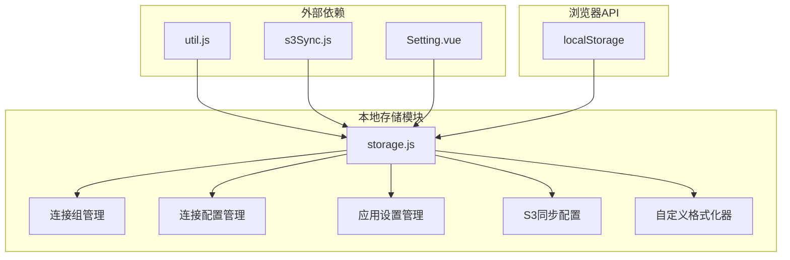
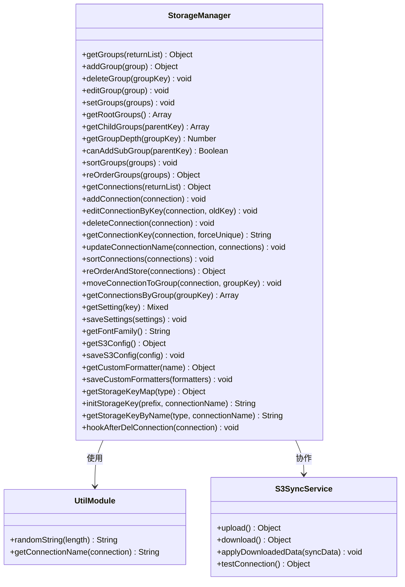
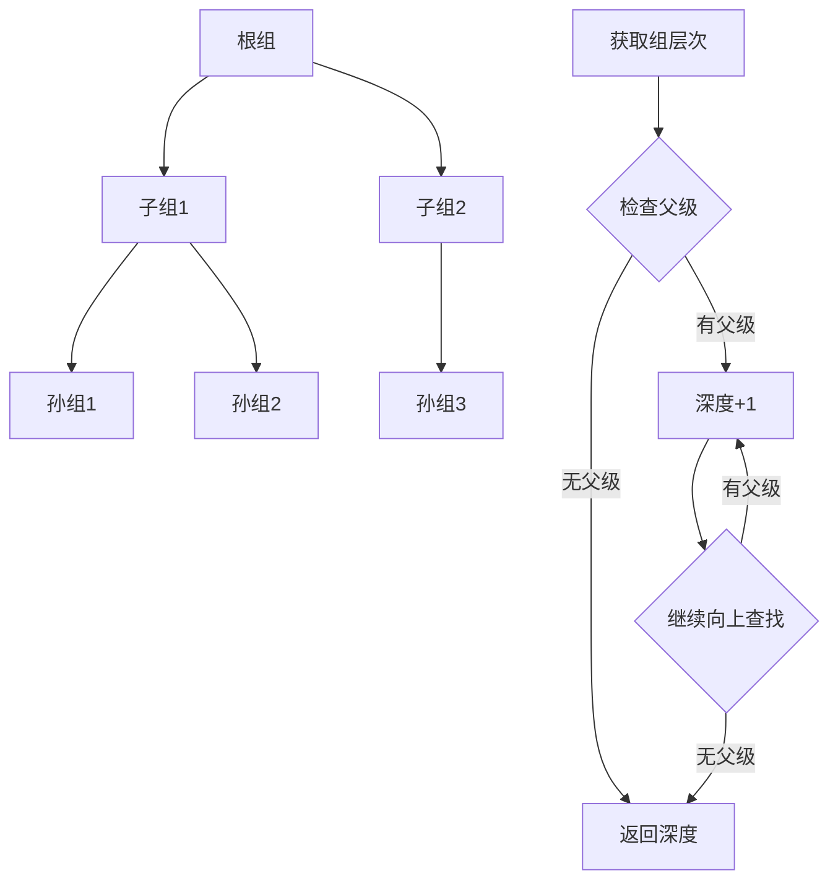
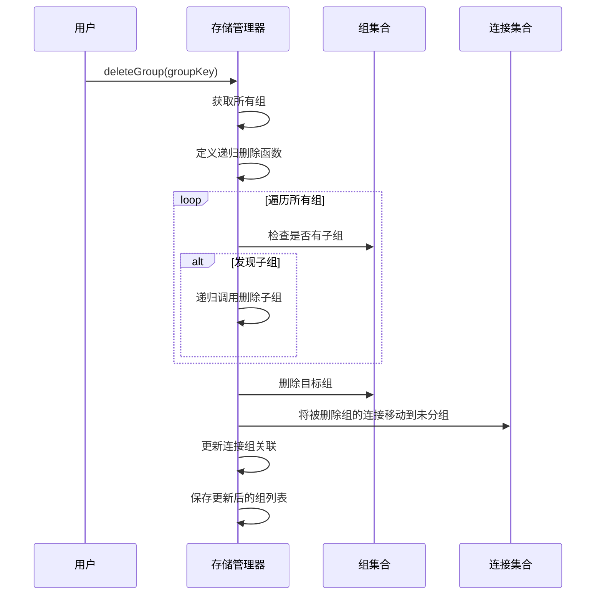
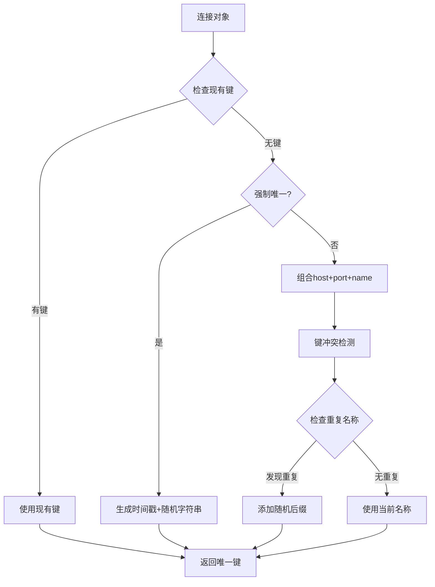
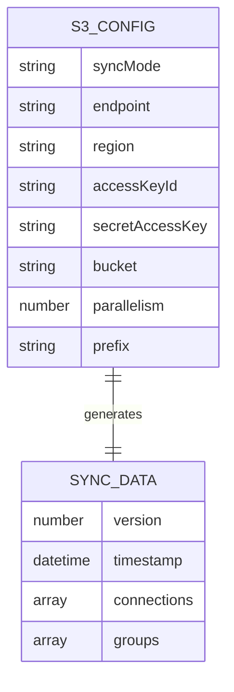
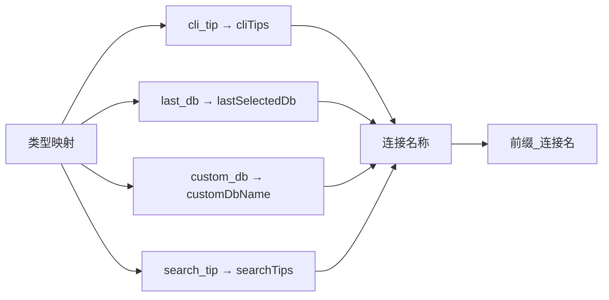
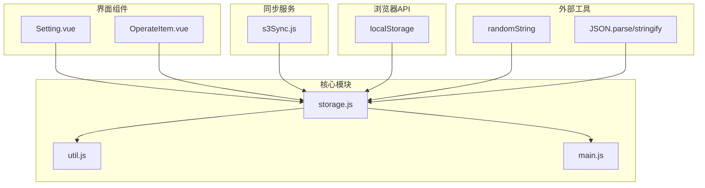

# 本地存储管理

<cite>
**本文档中引用的文件**
- [storage.js](file://src/storage.js)
- [s3Sync.js](file://src/s3Sync.js)
- [Setting.vue](file://src/components/Setting.vue)
- [util.js](file://src/util.js)
- [main.js](file://src/main.js)
- [OperateItem.vue](file://src/components/OperateItem.vue)
</cite>

## 目录
1. [简介](#简介)
2. [项目结构](#项目结构)
3. [核心组件](#核心组件)
4. [架构概览](#架构概览)
5. [详细组件分析](#详细组件分析)
6. [依赖关系分析](#依赖关系分析)
7. [性能考虑](#性能考虑)
8. [故障排除指南](#故障排除指南)
9. [结论](#结论)

## 简介

本地存储管理是Another Redis Desktop Manager的核心功能模块，负责持久化应用程序的所有关键数据。该系统基于浏览器的localStorage API，提供了完整的连接组管理、连接配置存储、应用设置保存和自定义格式化器等功能。通过精心设计的数据结构和算法，确保了数据的一致性、完整性和高效访问。

## 项目结构

本地存储管理模块主要包含以下核心文件：

**图表来源**
- [storage.js](file://src/storage.js#L1-L329)
- [util.js](file://src/util.js#L1-L50)

**章节来源**
- [storage.js](file://src/storage.js#L1-L329)
- [main.js](file://src/main.js#L1-L47)

## 核心组件

本地存储管理系统包含六个主要功能模块：

### 连接组管理模块
负责树形结构的连接分组，支持多级嵌套和递归操作。

### 连接配置管理模块  
管理所有Redis连接的配置信息，包括去重、排序和唯一键生成。

### 应用设置管理模块  
存储用户偏好设置、主题配置和字体设置等全局配置。

### S3同步配置模块  
管理云存储同步相关的配置信息。

### 自定义格式化器模块  
保存用户自定义的数据格式化规则。

### 存储键值映射模块  
提供统一的存储键名生成和管理机制。

**章节来源**
- [storage.js](file://src/storage.js#L7-L328)

## 架构概览

本地存储管理系统采用模块化架构，每个功能模块都有明确的职责边界：

**图表来源**
- [storage.js](file://src/storage.js#L5-L328)
- [util.js](file://src/util.js#L1-L200)
- [s3Sync.js](file://src/s3Sync.js#L12-L233)

## 详细组件分析

### 连接组管理

连接组管理是本地存储系统中最复杂的模块之一，实现了完整的树形结构管理功能。

#### 树形结构管理

连接组采用基于键值对的树形结构，每个组包含以下属性：
- `key`: 唯一标识符
- `name`: 组名称
- `parentKey`: 父组标识符（根组为null）
- `order`: 排序顺序
- 其他自定义属性

**图表来源**
- [storage.js](file://src/storage.js#L26-L34)

#### 递归删除逻辑

删除连接组时，系统会自动递归删除所有子组，确保数据完整性：

**图表来源**
- [storage.js](file://src/storage.js#L64-L88)

**章节来源**
- [storage.js](file://src/storage.js#L7-L89)

### 连接配置管理

连接配置管理模块负责存储和管理所有Redis连接的配置信息。

#### 唯一键生成机制

为了避免连接配置冲突，系统实现了智能的键生成算法：

**图表来源**
- [storage.js](file://src/storage.js#L257-L271)

#### 去重和排序机制

连接配置支持自动去重和智能排序：

| 排序优先级 | 排序规则 | 实现方式 |
|------------|----------|----------|
| 1. 手动排序 | order字段数值 | parseInt(order)比较 |
| 2. 字典序排序 | 键名字母顺序 | 字符串比较 |
| 3. 时间顺序 | 创建时间先后 | key生成时间 |

**章节来源**
- [storage.js](file://src/storage.js#L185-L216)
- [storage.js](file://src/storage.js#L257-L271)
- [storage.js](file://src/storage.js#L272-L285)

### 应用设置管理

应用设置模块提供了灵活的配置管理功能：

#### 设置存储结构

应用设置采用扁平化的键值对存储方式：

| 设置类型 | 存储键 | 默认值 | 描述 |
|----------|--------|--------|------|
| 字体设置 | settings | {} | 用户字体偏好 |
| 主题设置 | theme | 'system' | 界面主题模式 |
| 缩放因子 | zoomFactor | 1.0 | 界面缩放比例 |
| 分页大小 | keysPageSize | 500 | 键列表每页数量 |
| 显示选项 | showLoadAllKeys | false | 是否显示加载全部按钮 |

**章节来源**
- [storage.js](file://src/storage.js#L141-L150)
- [storage.js](file://src/storage.js#L151-L164)

### S3同步配置管理

S3同步功能提供了云端备份和跨设备同步能力：

#### 同步配置结构

**图表来源**
- [storage.js](file://src/storage.js#L123-L138)
- [s3Sync.js](file://src/s3Sync.js#L165-L170)

**章节来源**
- [storage.js](file://src/storage.js#L123-L138)
- [s3Sync.js](file://src/s3Sync.js#L153-L210)

### 自定义格式化器管理

自定义格式化器允许用户定义特定的数据格式化规则：

#### 格式化器存储格式

格式化器以数组形式存储在localStorage中，每个格式化器包含：
- `name`: 格式化器名称
- `language`: 编程语言
- `code`: 格式化代码
- `description`: 描述信息

**章节来源**
- [storage.js](file://src/storage.js#L165-L181)

### 存储键值映射

为了维护数据一致性，系统提供了统一的存储键名管理：

**图表来源**
- [storage.js](file://src/storage.js#L300-L309)

**章节来源**
- [storage.js](file://src/storage.js#L300-L328)

## 依赖关系分析

本地存储管理系统与其他模块存在密切的依赖关系：

**图表来源**
- [storage.js](file://src/storage.js#L1-L4)
- [main.js](file://src/main.js#L16-L18)

**章节来源**
- [storage.js](file://src/storage.js#L1-L329)
- [main.js](file://src/main.js#L1-L47)

## 性能考虑

本地存储管理系统在设计时充分考虑了性能优化：

### 数据访问优化
- 使用JSON.parse/stringify进行序列化，确保数据完整性
- 实现懒加载机制，按需获取数据
- 提供批量操作接口，减少DOM操作次数

### 内存管理
- 及时清理不再使用的存储项
- 实现钩子函数，在删除连接时自动清理相关数据
- 使用对象池模式复用数据结构

### 并发控制
- 所有存储操作都是同步的，避免竞态条件
- 在批量操作时临时禁用事件通知

## 故障排除指南

### 常见问题及解决方案

#### 连接组无法删除
**问题描述**: 删除连接组时出现错误或数据不一致
**解决方案**: 
1. 检查组是否存在循环引用
2. 确认所有子组都已正确删除
3. 验证localStorage连接组数据格式

#### 连接配置重复
**问题描述**: 添加新连接时出现重复键冲突
**解决方案**:
1. 检查连接名称是否唯一
2. 清理localStorage中的重复数据
3. 重新生成连接键

#### S3同步失败
**问题描述**: 云同步功能无法正常工作
**解决方案**:
1. 验证S3配置信息的正确性
2. 测试网络连接和权限
3. 检查同步数据格式

**章节来源**
- [storage.js](file://src/storage.js#L64-L89)
- [storage.js](file://src/storage.js#L257-L271)
- [s3Sync.js](file://src/s3Sync.js#L221-L230)

## 结论

本地存储管理系统通过精心设计的架构和算法，为Another Redis Desktop Manager提供了可靠的数据持久化解决方案。系统具备以下优势：

1. **完整性保证**: 通过递归删除和钩子机制确保数据一致性
2. **性能优化**: 智能的键生成和排序算法提升用户体验
3. **扩展性强**: 模块化设计便于功能扩展和维护
4. **容错能力**: 完善的错误处理和数据恢复机制

该系统不仅满足了当前的功能需求，还为未来的功能扩展奠定了坚实的基础。通过持续的优化和改进，将继续为用户提供优秀的数据管理体验。