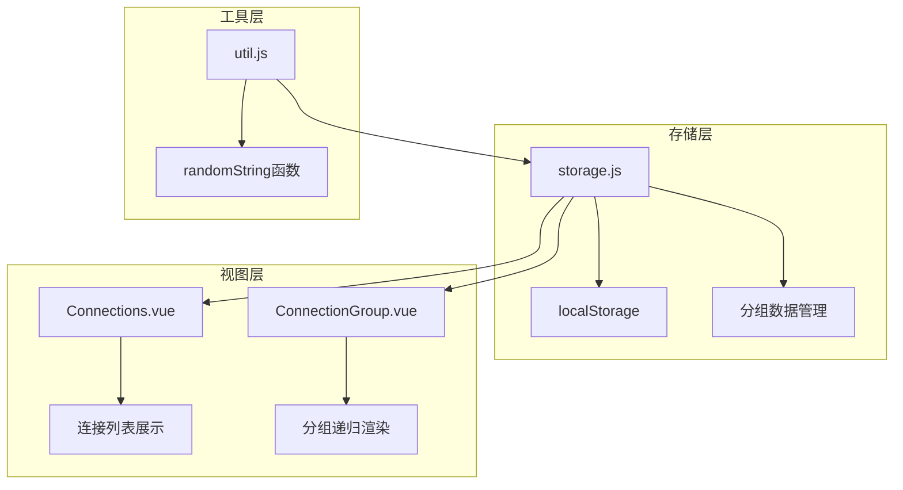
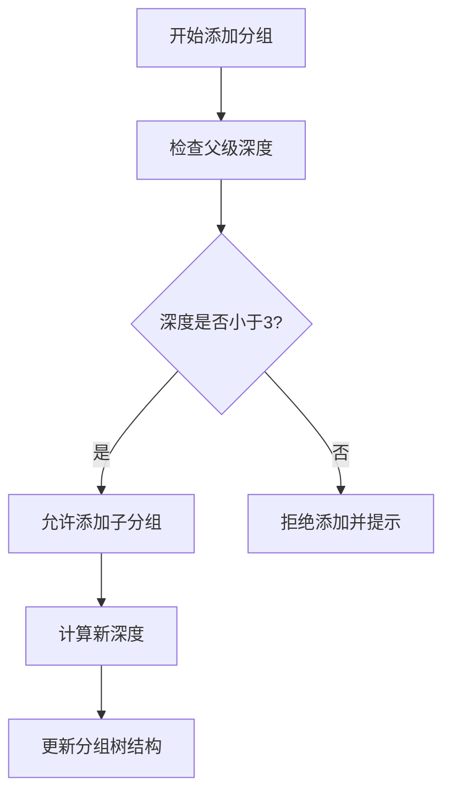
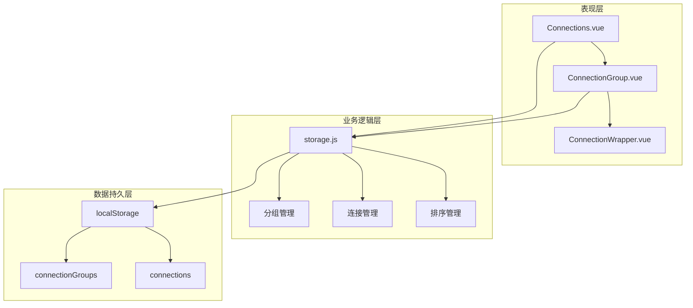
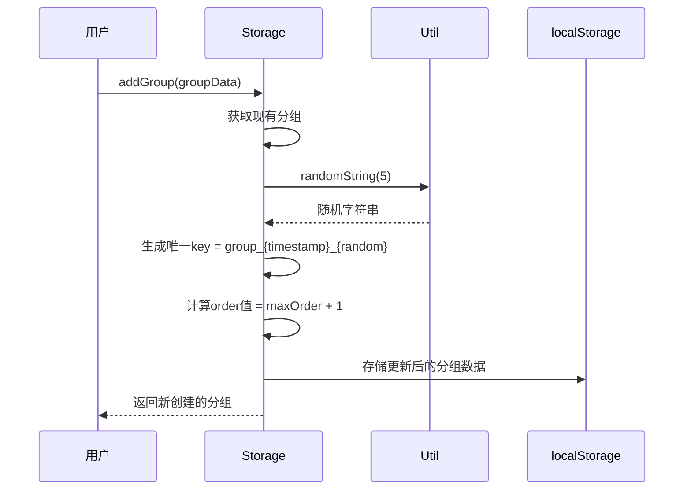
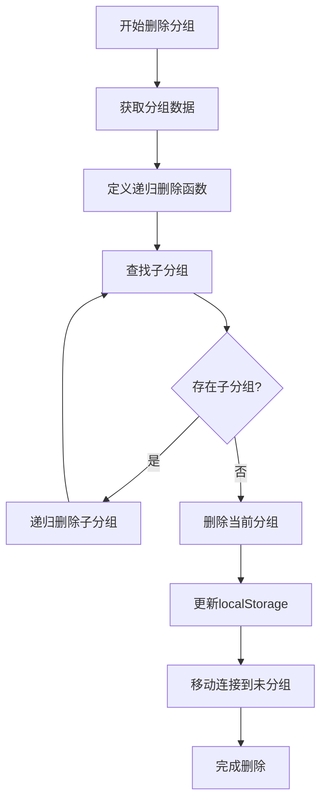
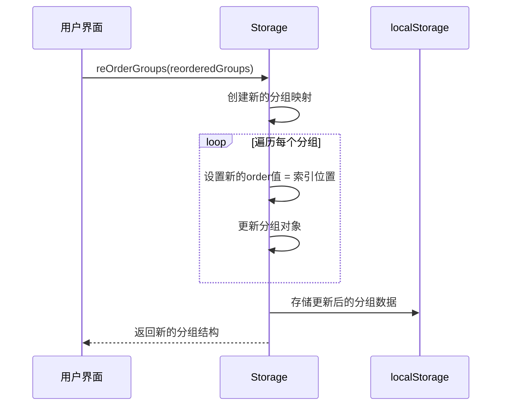
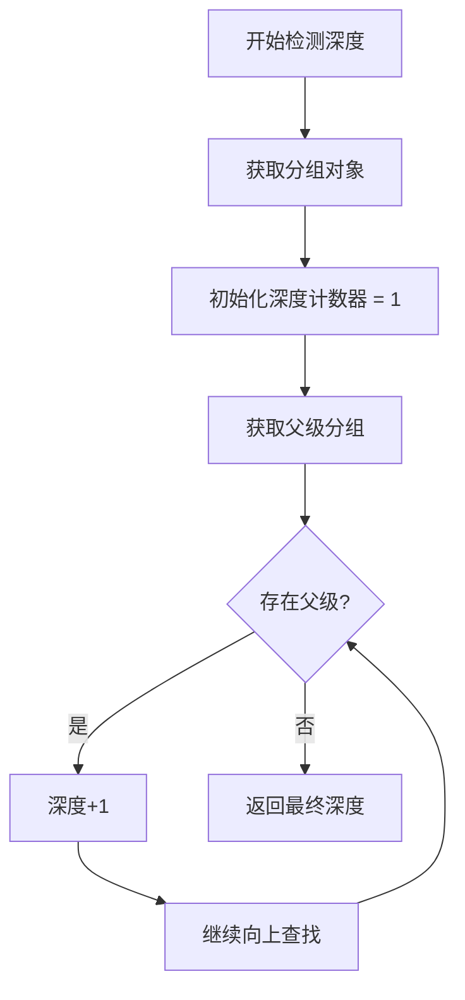
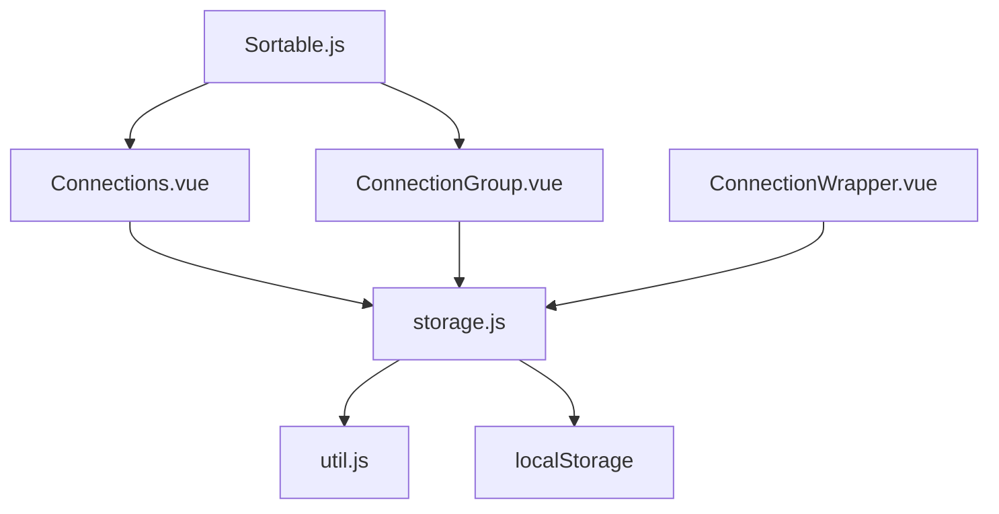

# 连接组管理

<cite>
**本文档引用的文件**
- [storage.js](file://src/storage.js)
- [Connections.vue](file://src/components/Connections.vue)
- [ConnectionGroup.vue](file://src/components/ConnectionGroup.vue)
- [util.js](file://src/util.js)
</cite>

## 目录
1. [简介](#简介)
2. [项目结构概览](#项目结构概览)
3. [核心组件分析](#核心组件分析)
4. [架构概览](#架构概览)
5. [详细组件分析](#详细组件分析)
6. [依赖关系分析](#依赖关系分析)
7. [性能考虑](#性能考虑)
8. [故障排除指南](#故障排除指南)
9. [结论](#结论)

## 简介

连接组管理系统是Another Redis Desktop Manager中的核心功能之一，负责组织和管理用户的Redis连接。该系统采用树形结构设计，支持最多三层嵌套的分组层次，为用户提供直观的连接分类和管理体验。

系统的主要特点包括：
- 基于localStorage的本地存储机制
- 支持拖拽排序的用户界面
- 最大3层的分组深度限制
- 自动化的连接归属管理
- 可视化的树形结构展示

## 项目结构概览

连接组管理功能主要分布在以下关键文件中：

**图表来源**
- [storage.js](file://src/storage.js#L1-L329)
- [Connections.vue](file://src/components/Connections.vue#L1-L326)
- [ConnectionGroup.vue](file://src/components/ConnectionGroup.vue#L1-L552)

**章节来源**
- [storage.js](file://src/storage.js#L1-L329)
- [Connections.vue](file://src/components/Connections.vue#L1-L326)

## 核心组件分析

### 存储管理器 (storage.js)

存储管理器是整个连接组系统的核心，负责数据的持久化和业务逻辑处理。

#### 分组数据获取方法

系统提供了三种主要的分组数据获取方式：

1. **getGroups方法**：基础的分组数据获取
   - 接受可选参数`returnList`决定返回格式
   - 默认返回对象形式的分组数据
   - 当`returnList`为true时返回数组并排序

2. **getRootGroups方法**：获取顶级分组
   - 过滤出没有父级的分组节点
   - 用于构建树形结构的根节点

3. **getChildGroups方法**：获取子分组
   - 根据父级分组键获取其直接子分组
   - 支持递归构建完整的树形结构

#### 分组深度管理

系统实现了严格的分组深度控制机制：

**图表来源**
- [storage.js](file://src/storage.js#L26-L39)

**章节来源**
- [storage.js](file://src/storage.js#L7-L39)

### 前端组件 (Connections.vue & ConnectionGroup.vue)

前端组件负责用户界面的展示和交互处理。

#### 连接列表管理

Connections.vue组件管理整个连接列表的显示和操作：

- **过滤功能**：支持按名称搜索连接
- **分组展示**：将连接按照分组结构进行组织
- **未分组连接**：特殊处理无分组归属的连接

#### 分组递归渲染

ConnectionGroup.vue组件实现了分组的递归渲染：

- **深度控制**：通过`depth`属性控制缩进层级
- **展开折叠**：支持分组的展开和折叠状态
- **上下文菜单**：提供编辑、删除等操作选项

**章节来源**
- [Connections.vue](file://src/components/Connections.vue#L1-L326)
- [ConnectionGroup.vue](file://src/components/ConnectionGroup.vue#L1-L552)

## 架构概览

连接组管理系统采用分层架构设计，确保了良好的可维护性和扩展性：

**图表来源**
- [storage.js](file://src/storage.js#L1-L329)
- [Connections.vue](file://src/components/Connections.vue#L92-L114)
- [ConnectionGroup.vue](file://src/components/ConnectionGroup.vue#L150-L158)

## 详细组件分析

### addGroup方法 - 分组创建机制

addGroup方法实现了分组的创建逻辑，包含以下关键步骤：

#### 唯一键生成策略

**图表来源**
- [storage.js](file://src/storage.js#L43-L56)
- [util.js](file://src/util.js#L375-L377)

#### Order字段自动递增逻辑

系统通过以下算法实现order字段的自动递增：

1. **查找最大值**：遍历所有现有分组，找出最大的order值
2. **计算新值**：新分组的order值为最大值加1
3. **保证连续性**：确保order值的连续性和唯一性

这种设计避免了手动设置order值的需求，简化了用户操作。

**章节来源**
- [storage.js](file://src/storage.js#L43-L56)

### deleteGroup方法 - 递归删除机制

deleteGroup方法实现了安全的分组删除功能，采用递归算法确保完整清理：

**图表来源**
- [storage.js](file://src/storage.js#L64-L89)

#### 删除后的连接处理

删除分组后，系统会自动将原属于该分组的所有连接移动到"未分组"区域：

1. **连接扫描**：遍历所有连接
2. **归属检查**：确认连接是否属于已删除的分组
3. **归属重置**：将连接的groupKey设置为空字符串
4. **数据同步**：更新localStorage中的连接数据

**章节来源**
- [storage.js](file://src/storage.js#L64-L89)

### reOrderGroups方法 - 拖拽排序持久化

reOrderGroups方法实现了拖拽排序功能的持久化存储：

#### 索引重置机制

**图表来源**
- [storage.js](file://src/storage.js#L98-L107)

#### 拖拽事件处理流程

前端组件通过Sortable.js库实现拖拽功能：

1. **事件监听**：监听拖拽结束事件
2. **数据提取**：获取拖拽前后的索引位置
3. **数据重组**：根据新顺序重新排列数据
4. **持久化**：调用reOrderGroups方法保存更改

**章节来源**
- [storage.js](file://src/storage.js#L98-L107)
- [Connections.vue](file://src/components/Connections.vue#L228-L233)

### 分组最大深度限制

系统实现了严格的3层分组深度限制，这是通过以下机制实现的：

#### 深度检测算法

**图表来源**
- [storage.js](file://src/storage.js#L26-L35)

#### 用户体验考虑

深度限制的设计考虑了以下用户体验因素：

1. **简洁性**：避免过深的嵌套导致界面混乱
2. **易用性**：用户能够快速理解和使用分组功能
3. **功能性**：3层深度足以满足大多数使用场景
4. **视觉清晰**：保持界面的视觉清晰度和可读性

**章节来源**
- [storage.js](file://src/storage.js#L26-L39)

## 依赖关系分析

连接组管理系统的依赖关系体现了清晰的分层架构：

**图表来源**
- [storage.js](file://src/storage.js#L1-L4)
- [Connections.vue](file://src/components/Connections.vue#L92-L96)
- [ConnectionGroup.vue](file://src/components/ConnectionGroup.vue#L151-L153)

### 外部依赖

系统主要依赖以下外部库和模块：

1. **Sortable.js**：提供拖拽排序功能
2. **localStorage**：本地数据持久化
3. **Element UI**：UI组件库

### 内部模块依赖

各模块之间的依赖关系遵循单一职责原则：

- **storage.js**：独立的数据管理模块
- **Components**：负责用户界面展示
- **Util**：提供通用工具函数

**章节来源**
- [storage.js](file://src/storage.js#L1-L4)
- [Connections.vue](file://src/components/Connections.vue#L92-L96)

## 性能考虑

连接组管理系统在设计时充分考虑了性能优化：

### 数据访问优化

1. **懒加载**：只在需要时获取分组数据
2. **缓存机制**：利用localStorage减少重复读取
3. **批量操作**：支持批量更新以减少DOM操作

### 渲染性能优化

1. **虚拟滚动**：对于大量连接的场景
2. **条件渲染**：只渲染可见的分组和连接
3. **防抖处理**：对频繁的用户操作进行防抖

### 内存管理

1. **及时清理**：删除操作后立即清理相关数据
2. **弱引用**：避免内存泄漏
3. **数据压缩**：对大型数据结构进行压缩存储

## 故障排除指南

### 常见问题及解决方案

#### 分组无法创建

**症状**：尝试创建新分组时失败或无响应

**可能原因**：
1. 浏览器localStorage空间不足
2. 分组名称重复
3. 系统权限问题

**解决方法**：
1. 清理浏览器缓存和localStorage
2. 使用唯一的分组名称
3. 检查浏览器设置和权限配置

#### 分组删除异常

**症状**：删除分组后出现数据不一致

**可能原因**：
1. 并发修改冲突
2. 数据完整性校验失败
3. 异步操作顺序错误

**解决方法**：
1. 刷新页面重新加载数据
2. 检查网络连接稳定性
3. 重启应用程序

#### 拖拽排序失效

**症状**：拖拽操作后排序未生效

**可能原因**：
1. Sortable.js初始化失败
2. DOM元素选择器错误
3. 事件冒泡被阻止

**解决方法**：
1. 检查浏览器控制台错误信息
2. 验证DOM结构和类名
3. 调整事件处理逻辑

**章节来源**
- [storage.js](file://src/storage.js#L64-L89)
- [Connections.vue](file://src/components/Connections.vue#L235-L261)

## 结论

连接组管理系统通过精心设计的架构和算法，为用户提供了强大而易用的连接管理功能。系统的主要优势包括：

1. **直观的树形结构**：清晰的层级关系便于用户理解
2. **灵活的拖拽操作**：提升用户体验和操作效率
3. **严格的数据约束**：保证数据的一致性和完整性
4. **良好的性能表现**：优化的算法和缓存机制

该系统的设计理念体现了现代Web应用的最佳实践，为类似的功能开发提供了有价值的参考。随着功能的不断完善和优化，连接组管理系统将继续为用户提供更好的使用体验。