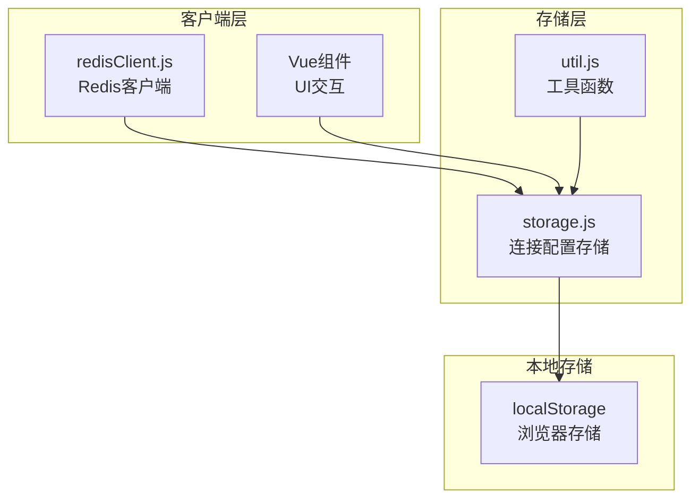
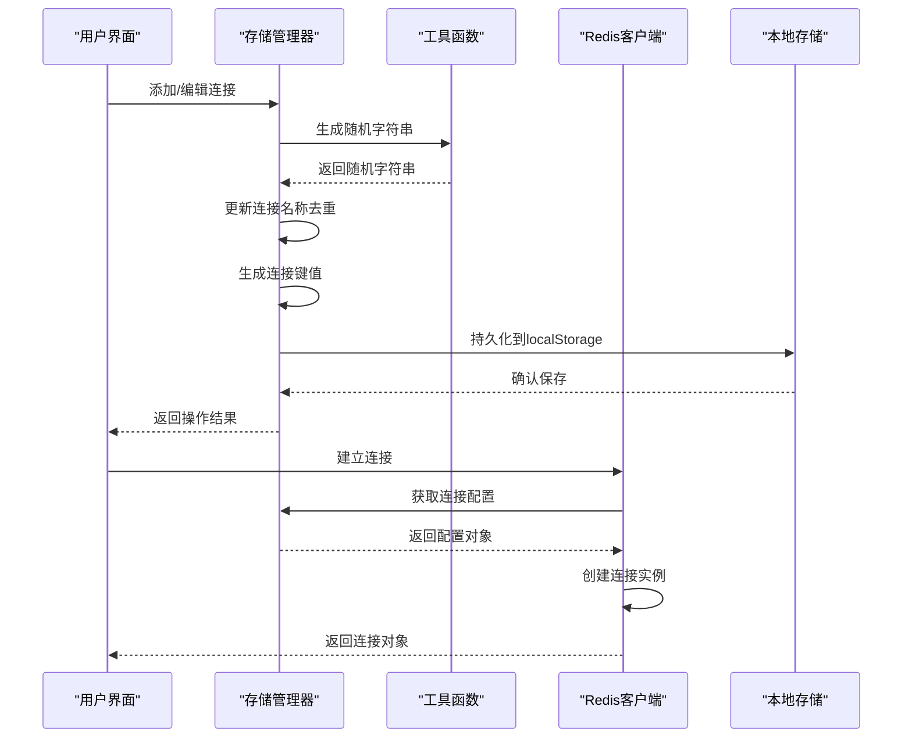
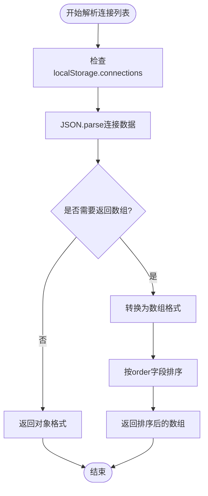
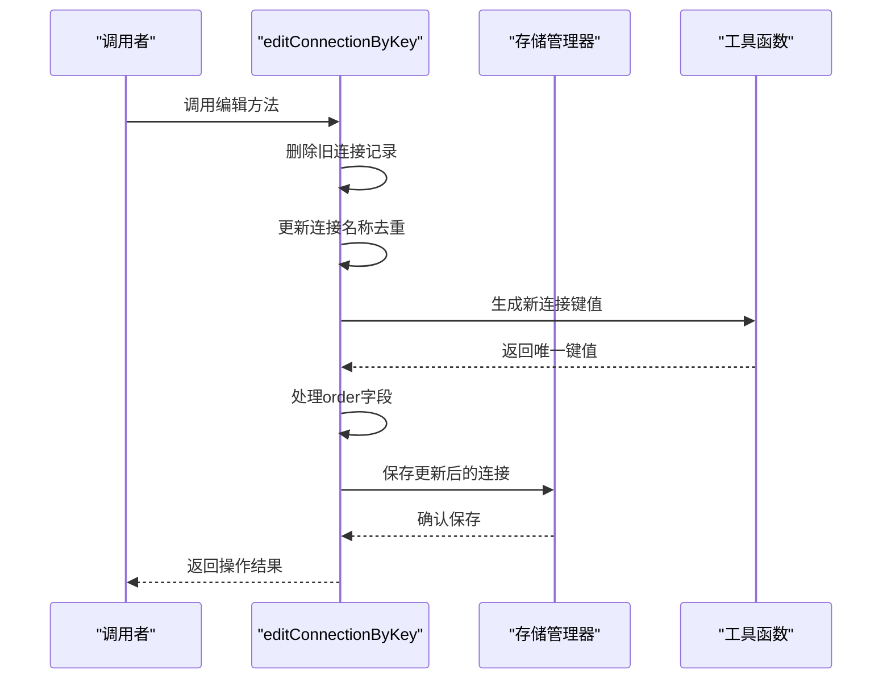
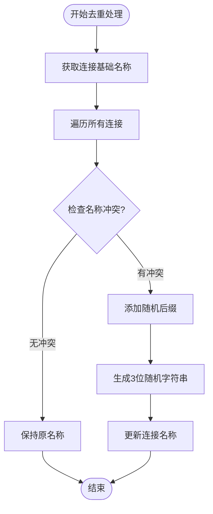
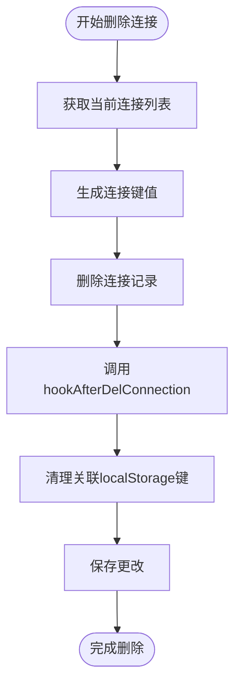
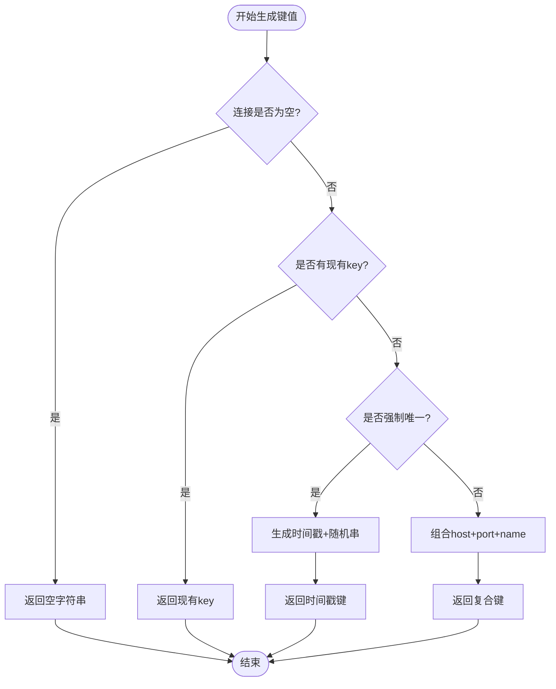
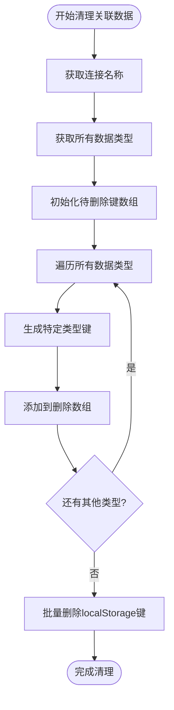
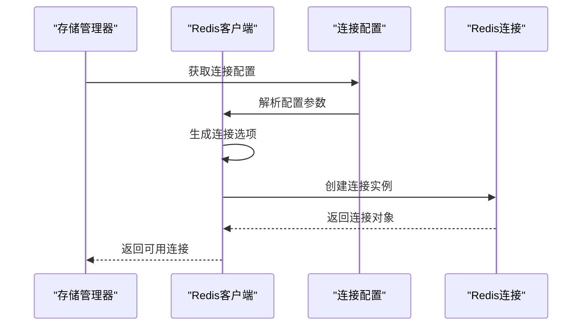
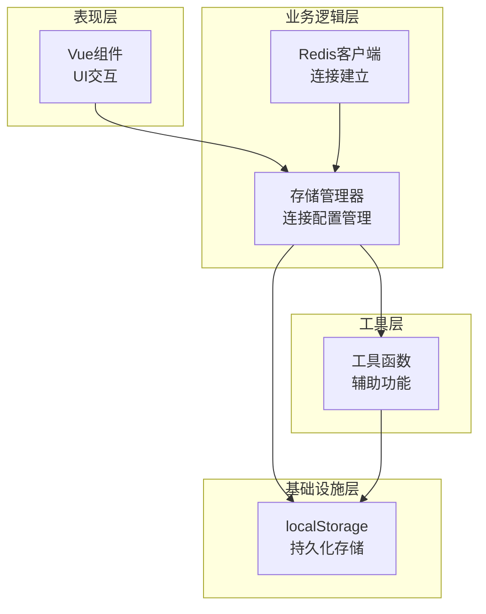

# 连接配置管理

<cite>
**本文档中引用的文件**
- [storage.js](file://src/storage.js)
- [redisClient.js](file://src/redisClient.js)
- [util.js](file://src/util.js)
- [NewConnectionDialog.vue](file://src/components/NewConnectionDialog.vue)
- [ConnectionMenu.vue](file://src/components/ConnectionMenu.vue)
- [addon.js](file://src/addon.js)
</cite>

## 目录
1. [简介](#简介)
2. [项目结构概览](#项目结构概览)
3. [核心组件分析](#核心组件分析)
4. [架构概览](#架构概览)
5. [详细组件分析](#详细组件分析)
6. [依赖关系分析](#依赖关系分析)
7. [性能考虑](#性能考虑)
8. [故障排除指南](#故障排除指南)
9. [结论](#结论)

## 简介

本文档深入分析了Another Redis Desktop Manager中连接配置的存储与管理逻辑，重点探讨了`storage.js`文件中实现的核心功能。该系统负责管理用户的Redis连接配置，提供连接的增删改查、去重处理、键值生成等关键功能，并与`redisClient.js`紧密协作完成连接实例化。

## 项目结构概览

该项目采用模块化架构，主要包含以下核心模块：

**图表来源**
- [storage.js](file://src/storage.js#L1-L339)
- [redisClient.js](file://src/redisClient.js#L1-L381)
- [util.js](file://src/util.js#L1-L392)

**章节来源**
- [storage.js](file://src/storage.js#L1-L339)
- [redisClient.js](file://src/redisClient.js#L1-L381)

## 核心组件分析

### 存储管理器 (Storage Manager)

存储管理器是整个连接配置系统的核心，负责：
- 连接配置的持久化存储
- 连接列表的解析和排序
- 连接名称的去重处理
- 关联数据的清理机制

### 工具函数库 (Utility Functions)

提供基础的字符串处理和随机数生成功能：
- `randomString`: 生成随机字符串用于唯一标识
- 各种数据格式转换工具

### Redis客户端 (Redis Client)

负责实际的Redis连接建立和管理：
- 支持多种连接模式（单机、集群、哨兵）
- SSH隧道支持
- SSL/TLS加密连接

**章节来源**
- [storage.js](file://src/storage.js#L1-L339)
- [redisClient.js](file://src/redisClient.js#L1-L381)
- [util.js](file://src/util.js#L1-L392)

## 架构概览

系统采用分层架构设计，确保职责分离和代码可维护性：

**图表来源**
- [storage.js](file://src/storage.js#L210-L226)
- [redisClient.js](file://src/redisClient.js#L52-L87)
- [util.js](file://src/util.js#L375-L377)

## 详细组件分析

### getConnections方法 - 连接列表解析

`getConnections`方法负责从localStorage中解析连接列表，并支持两种返回格式：

**图表来源**
- [storage.js](file://src/storage.js#L195-L206)

该方法的关键特性：
- 默认返回对象格式，便于直接访问
- 当`returnList`参数为true时返回排序数组
- 自动处理空数据情况，提供默认值
- 使用`sortConnections`方法进行智能排序

**章节来源**
- [storage.js](file://src/storage.js#L195-L206)

### editConnectionByKey方法 - 连接增改操作

`editConnectionByKey`实现了连接的增改统一接口：

**图表来源**
- [storage.js](file://src/storage.js#L207-L226)

该方法的核心逻辑：
1. **删除旧记录**: 通过`oldKey`参数删除原有的连接记录
2. **名称去重**: 调用`updateConnectionName`处理名称冲突
3. **键值生成**: 使用`getConnectionKey`生成新的唯一键值
4. **顺序管理**: 为新添加的连接自动分配order字段
5. **数据持久化**: 将更新后的连接列表保存到localStorage

**章节来源**
- [storage.js](file://src/storage.js#L207-L226)

### updateConnectionName方法 - 去重机制

`updateConnectionName`提供了智能的连接名称去重功能：

**图表来源**
- [storage.js](file://src/storage.js#L239-L251)

去重算法特点：
- 首先获取连接的基础名称（优先使用自定义名称）
- 遍历所有现有连接，检查名称冲突
- 发现冲突时自动添加3位随机后缀
- 确保每个连接都有唯一的显示名称

**章节来源**
- [storage.js](file://src/storage.js#L239-L251)

### deleteConnection方法 - 清理关联数据

`deleteConnection`方法不仅删除连接记录，还执行关联数据的清理：

**图表来源**
- [storage.js](file://src/storage.js#L258-L266)

清理机制包括：
- 调用`hookAfterDelConnection`清理相关数据
- 移除CLI提示、最后选择的数据库、自定义数据库名等
- 删除搜索历史等临时数据
- 确保不会留下孤立的数据条目

**章节来源**
- [storage.js](file://src/storage.js#L258-L266)

### getConnectionKey方法 - 唯一键生成

`getConnectionKey`实现了三种不同的键值生成策略：

**图表来源**
- [storage.js](file://src/storage.js#L267-L281)

键值生成策略：
1. **空连接处理**: 返回空字符串避免错误
2. **现有key优先**: 如果连接已有key，直接使用
3. **强制唯一**: 生成基于时间戳和随机字符串的唯一键
4. **复合键**: 默认使用host+port+name的组合作为键值

**章节来源**
- [storage.js](file://src/storage.js#L267-L281)

### hookAfterDelConnection方法 - 关联数据清理

`hookAfterDelConnection`实现了全面的关联数据清理机制：

**图表来源**
- [storage.js](file://src/storage.js#L326-L337)

清理的数据类型包括：
- CLI提示信息 (`cli_tip`)
- 最后选择的数据库 (`last_db`)  
- 自定义数据库名称 (`custom_db`)
- 搜索历史提示 (`search_tip`)

**章节来源**
- [storage.js](file://src/storage.js#L326-L337)

### 连接实例化流程

连接实例化过程展示了存储配置与客户端的协作：

**图表来源**
- [redisClient.js](file://src/redisClient.js#L52-L87)
- [storage.js](file://src/storage.js#L195-L206)

**章节来源**
- [redisClient.js](file://src/redisClient.js#L52-L87)
- [storage.js](file://src/storage.js#L195-L206)

## 依赖关系分析

系统的依赖关系体现了清晰的分层架构：

**图表来源**
- [storage.js](file://src/storage.js#L1-L339)
- [redisClient.js](file://src/redisClient.js#L1-L381)
- [util.js](file://src/util.js#L1-L392)

**章节来源**
- [storage.js](file://src/storage.js#L1-L339)
- [redisClient.js](file://src/redisClient.js#L1-L381)
- [util.js](file://src/util.js#L1-L392)

## 性能考虑

### 数据结构优化

- **对象存储**: 使用对象而非数组存储连接，提供O(1)的查找性能
- **懒加载**: 只在需要时才将对象转换为数组
- **增量更新**: 仅更新变更的部分，减少不必要的重写

### 内存管理

- **及时清理**: 删除连接时同步清理关联数据
- **弱引用**: 避免循环引用导致的内存泄漏
- **缓存策略**: 对频繁访问的数据进行适当缓存

### 并发安全

- **原子操作**: 关键操作使用原子性保证
- **锁机制**: 在必要时使用锁防止并发冲突
- **事务支持**: 对复杂操作提供事务保证

## 故障排除指南

### 常见问题及解决方案

#### 连接无法保存
**症状**: 添加或修改连接后刷新页面丢失
**原因**: localStorage存储失败或数据格式错误
**解决方案**: 
- 检查浏览器存储配额
- 验证连接配置格式正确性
- 清理损坏的localStorage数据

#### 连接名称重复
**症状**: 多个连接显示相同名称
**原因**: 名称去重机制失效
**解决方案**:
- 手动修改连接名称
- 检查`updateConnectionName`方法执行状态
- 重新启动应用刷新状态

#### 连接键冲突
**症状**: 新建连接时出现键值冲突
**原因**: 键值生成算法异常
**解决方案**:
- 检查`getConnectionKey`方法逻辑
- 验证随机字符串生成器
- 重启应用重置状态

**章节来源**
- [storage.js](file://src/storage.js#L239-L251)
- [storage.js](file://src/storage.js#L267-L281)

## 结论

Another Redis Desktop Manager的连接配置管理系统展现了优秀的软件架构设计：

1. **模块化设计**: 清晰的职责分离，便于维护和扩展
2. **数据一致性**: 完善的去重和清理机制确保数据完整性
3. **用户体验**: 智能的名称管理和自动排序提升使用体验
4. **性能优化**: 合理的数据结构和缓存策略保证系统响应速度
5. **错误处理**: 全面的异常处理和恢复机制提高系统稳定性

该系统为Redis桌面管理器提供了坚实的基础，支持各种复杂的连接场景，同时保持了良好的可扩展性和可维护性。通过深入理解这些核心机制，开发者可以更好地定制和扩展应用程序的功能。