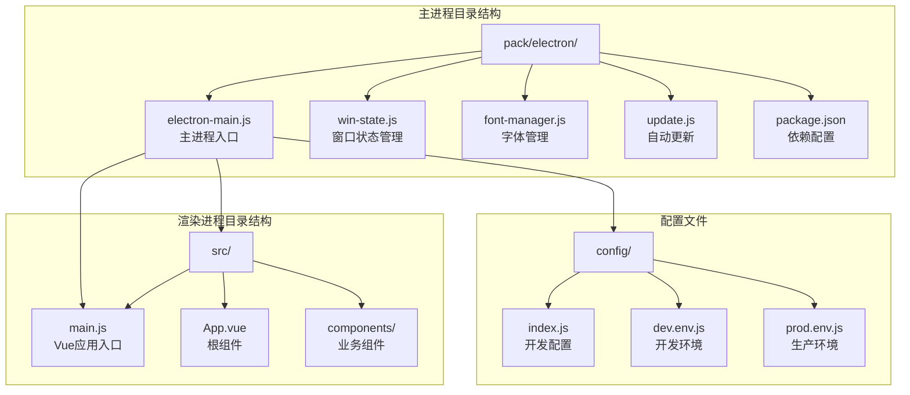
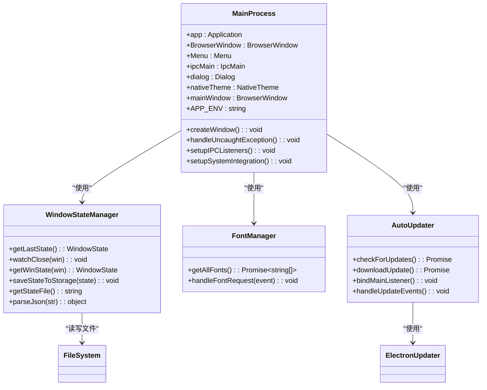
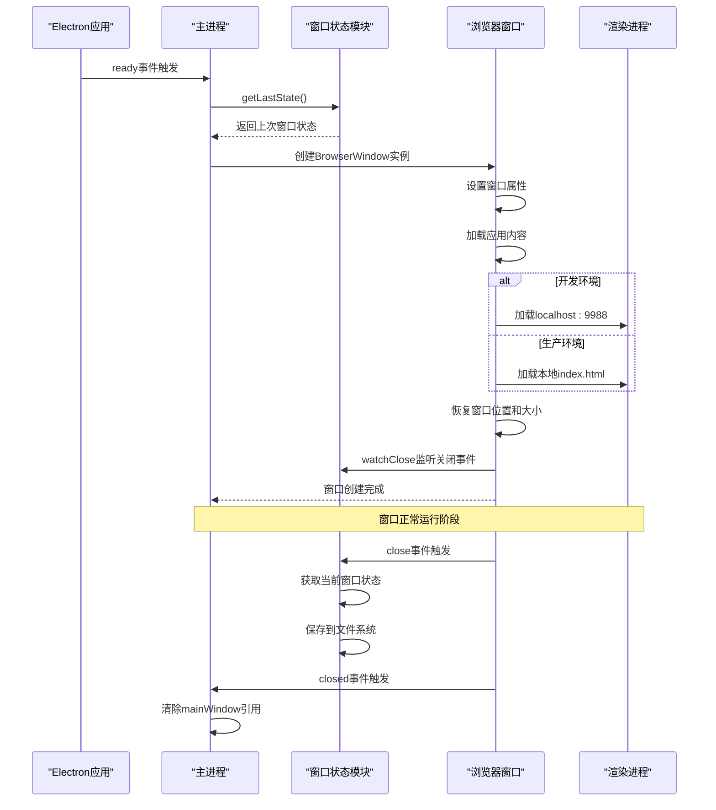
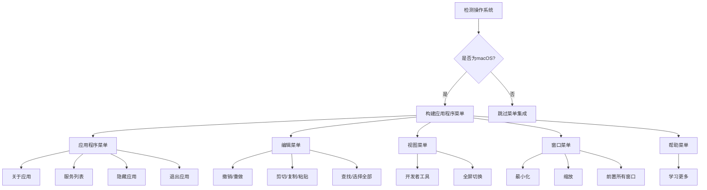
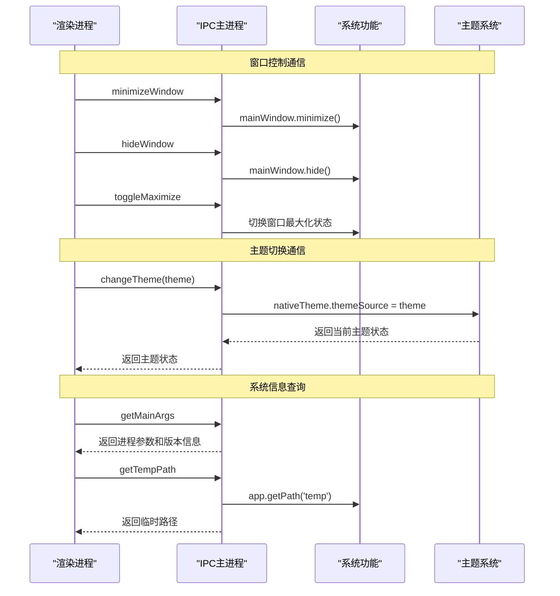
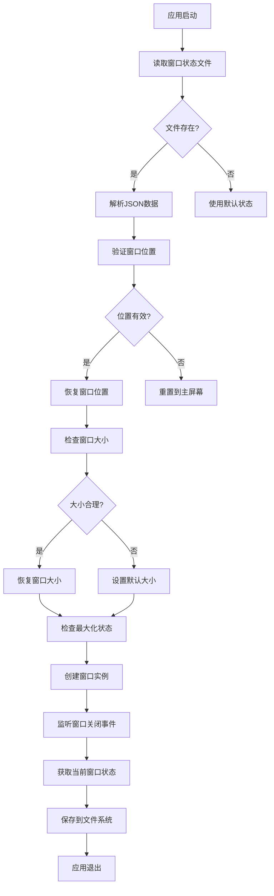
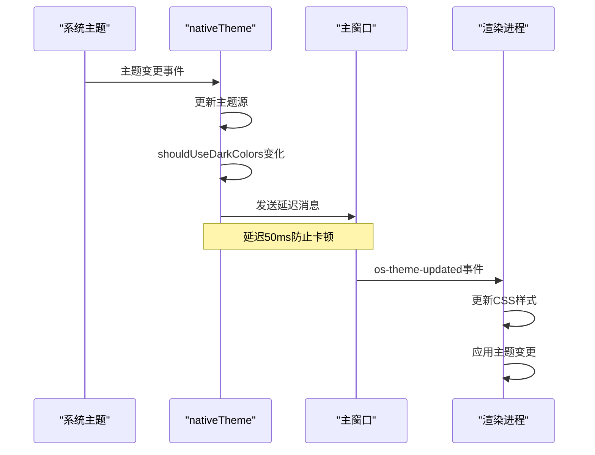
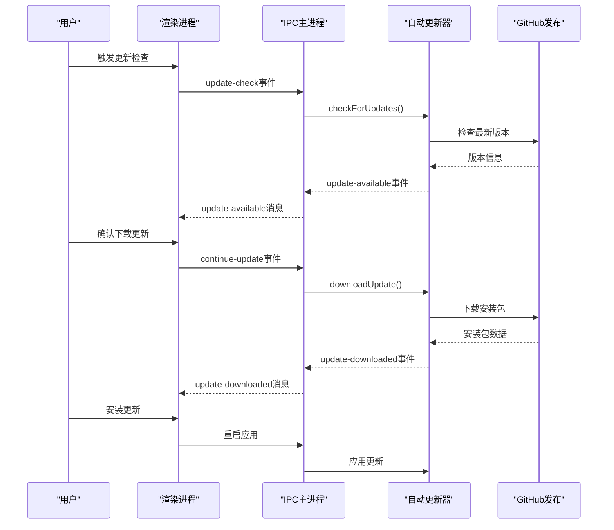

# Another Redis Desktop Manager 主进程架构文档

<cite>
**本文档中引用的文件**
- [electron-main.js](file://pack/electron/electron-main.js)
- [win-state.js](file://pack/electron/win-state.js)
- [font-manager.js](file://pack/electron/font-manager.js)
- [update.js](file://pack/electron/update.js)
- [package.json](file://package.json)
- [main.js](file://src/main.js)
- [index.html](file://index.html)
- [shortcut.js](file://src/shortcut.js)
- [config/index.js](file://config/index.js)
</cite>

## 目录
1. [简介](#简介)
2. [项目结构概览](#项目结构概览)
3. [主进程核心架构](#主进程核心架构)
4. [窗口生命周期管理](#窗口生命周期管理)
5. [系统原生功能集成](#系统原生功能集成)
6. [应用事件处理机制](#应用事件处理机制)
7. [进程间通信(IPC)架构](#进程间通信ipc架构)
8. [窗口状态持久化](#窗口状态持久化)
9. [系统主题同步机制](#系统主题同步机制)
10. [全局异常处理](#全局异常处理)
11. [自动更新机制](#自动更新机制)
12. [性能优化考虑](#性能优化考虑)
13. [故障排除指南](#故障排除指南)
14. [总结](#总结)

## 简介

Another Redis Desktop Manager (ARDM) 是一个基于 Electron 框架构建的跨平台 Redis 客户端工具。主进程作为 Electron 应用的核心控制器，负责管理应用程序的生命周期、窗口状态、系统集成以及进程间通信。本文档深入分析 electron-main.js 的实现机制，揭示主进程在 Electron 架构中的关键作用。

## 项目结构概览

ARDM 采用典型的 Electron 应用结构，主进程相关文件集中在 `pack/electron` 目录下：



**图表来源**
- [electron-main.js](file://pack/electron/electron-main.js#L1-L227)
- [main.js](file://src/main.js#L1-L47)
- [package.json](file://package.json#L1-L130)

**章节来源**
- [electron-main.js](file://pack/electron/electron-main.js#L1-L227)
- [package.json](file://package.json#L1-L130)

## 主进程核心架构

主进程采用模块化设计，通过 ES6 模块系统组织代码结构：



**图表来源**
- [electron-main.js](file://pack/electron/electron-main.js#L2-L8)
- [win-state.js](file://pack/electron/win-state.js#L5-L115)
- [font-manager.js](file://pack/electron/font-manager.js#L1-L20)
- [update.js](file://pack/electron/update.js#L1-L55)

**章节来源**
- [electron-main.js](file://pack/electron/electron-main.js#L1-L227)
- [win-state.js](file://pack/electron/win-state.js#L1-L116)
- [font-manager.js](file://pack/electron/font-manager.js#L1-L20)
- [update.js](file://pack/electron/update.js#L1-L55)

## 窗口生命周期管理

主进程通过 `createWindow` 函数实现窗口的完整生命周期管理，包括创建、初始化、状态恢复和销毁：



**图表来源**
- [electron-main.js](file://pack/electron/electron-main.js#L42-L102)
- [win-state.js](file://pack/electron/win-state.js#L63-L72)

### 窗口创建流程详解

窗口创建过程包含以下关键步骤：

1. **状态恢复**: 从 `win-state` 模块获取上次保存的窗口状态
2. **属性设置**: 配置窗口位置、大小、图标等基础属性
3. **Web偏好设置**: 启用 Node.js 集成和远程模块支持
4. **内容加载**: 根据环境加载不同的资源地址
5. **事件绑定**: 设置窗口关闭和销毁事件处理器

**章节来源**
- [electron-main.js](file://pack/electron/electron-main.js#L42-L102)
- [win-state.js](file://pack/electron/win-state.js#L6-L61)

## 系统原生功能集成

主进程集成了丰富的系统原生功能，为用户提供一致的桌面应用体验：

### 菜单栏集成

针对 macOS 平台，主进程构建了符合系统规范的应用程序菜单：



**图表来源**
- [electron-main.js](file://pack/electron/electron-main.js#L167-L223)

### 对话框功能

主进程提供了多种系统对话框功能：
- **错误对话框**: 处理未捕获异常时显示友好的错误信息
- **消息对话框**: 用于确认、警告等用户交互场景
- **文件对话框**: 文件选择、保存等操作

**章节来源**
- [electron-main.js](file://pack/electron/electron-main.js#L20-L35)
- [electron-main.js](file://pack/electron/electron-main.js#L167-L223)

## 应用事件处理机制

主进程响应三个核心应用事件，确保应用程序的正确行为：

```mermaid
stateDiagram-v2
[*] --> 初始化
初始化 --> ready : app.on('ready')
ready --> 窗口创建 : createWindow()
窗口创建 --> 运行中 : 窗口就绪
运行中 --> window-all-closed : 所有窗口关闭
window-all-closed --> quit : app.quit()
quit --> [*]
运行中 --> activate : app.on('activate')
activate --> 窗口检查 : mainWindow === null?
窗口检查 --> 窗口创建 : 创建新窗口
窗口检查 --> 运行中 : 已有窗口
运行中 --> 关闭中 : 用户关闭窗口
关闭中 --> 窗口销毁 : 窗口关闭事件
窗口销毁 --> 运行中 : mainWindow = null
```

**图表来源**
- [electron-main.js](file://pack/electron/electron-main.js#L107-L125)

### 事件处理详解

1. **ready 事件**: 应用程序初始化完成后创建主窗口
2. **window-all-closed 事件**: 处理所有窗口关闭时的应用退出逻辑
3. **activate 事件**: macOS 平台上点击 Dock 图标时重新创建窗口

**章节来源**
- [electron-main.js](file://pack/electron/electron-main.js#L107-L125)

## 进程间通信(IPC)架构

主进程通过 `ipcMain` 模块提供多种 IPC 通信接口，支持渲染进程的各种操作请求：



**图表来源**
- [electron-main.js](file://pack/electron/electron-main.js#L127-L165)

### IPC 接口分类

主进程提供的 IPC 接口按功能可分为以下几类：

| 接口类型 | 方法名 | 功能描述 | 参数 | 返回值 |
|---------|--------|----------|------|--------|
| 窗口控制 | hideWindow | 隐藏主窗口 | 无 | 无 |
| 窗口控制 | minimizeWindow | 最小化主窗口 | 无 | 无 |
| 窗口控制 | toggleMaximize | 切换窗口最大化状态 | 无 | 无 |
| 系统信息 | getMainArgs | 获取主进程参数 | 无 | {argv, version} |
| 系统信息 | getTempPath | 获取临时目录路径 | 无 | string |
| 主题控制 | changeTheme | 更改系统主题 | theme(string) | boolean |

**章节来源**
- [electron-main.js](file://pack/electron/electron-main.js#L127-L165)

## 窗口状态持久化

`win-state` 模块实现了窗口状态的完整持久化机制，确保用户界面布局的一致性：



**图表来源**
- [win-state.js](file://pack/electron/win-state.js#L6-L61)

### 状态存储机制

窗口状态包含以下关键属性：
- **位置信息**: x, y 坐标
- **尺寸信息**: width, height
- **状态信息**: maximized 标志
- **边界检查**: 屏幕边界验证

**章节来源**
- [win-state.js](file://pack/electron/win-state.js#L1-L116)

## 系统主题同步机制

主进程实现了与系统主题的实时同步机制，支持深色模式的无缝切换：



**图表来源**
- [electron-main.js](file://pack/electron/electron-main.js#L153-L162)

### 主题同步特性

1. **实时响应**: 系统主题变更时立即通知渲染进程
2. **延迟处理**: 避免频繁的主题切换导致界面卡顿
3. **双向同步**: 支持系统主题和应用主题的相互影响
4. **状态保持**: 记住用户的主题偏好设置

**章节来源**
- [electron-main.js](file://pack/electron/electron-main.js#L148-L162)

## 全局异常处理

主进程实现了完善的异常处理机制，确保应用程序的稳定性：

```mermaid
flowchart TD
A[未捕获异常] --> B[process.on('uncaughtException')]
B --> C{异常存在?}
C --> |否| D[忽略异常]
C --> |是| E[显示错误对话框]
E --> F[收集异常信息]
F --> G[显示友好错误消息]
G --> H[提供反馈渠道]
H --> I[强制退出应用]
I --> J[清理资源]
J --> K[结束进程]
```

**图表来源**
- [electron-main.js](file://pack/electron/electron-main.js#L20-L35)

### 异常处理策略

1. **捕获范围**: 捕获所有未处理的 JavaScript 异常
2. **用户友好**: 显示清晰的错误信息和解决方案
3. **调试支持**: 提供堆栈跟踪和问题反馈链接
4. **安全退出**: 异常后强制退出以避免不稳定状态

**章节来源**
- [electron-main.js](file://pack/electron/electron-main.js#L20-L35)

## 自动更新机制

主进程集成了自动更新功能，确保用户始终使用最新版本：



**图表来源**
- [update.js](file://pack/electron/update.js#L12-L27)

### 更新流程特点

1. **手动触发**: 用户主动检查更新，避免自动下载干扰
2. **断点续传**: 支持网络中断后的继续下载
3. **进度监控**: 实时显示下载进度和状态
4. **静默安装**: 下载完成后提示用户重启安装

**章节来源**
- [update.js](file://pack/electron/update.js#L1-L55)

## 性能优化考虑

主进程在设计时充分考虑了性能优化：

### GPU 加速禁用
```javascript
// 禁用GPU加速以解决白屏问题
// app.disableHardwareAcceleration();
// app.commandLine.appendSwitch('disable-gpu');
```

### 内存管理
- **窗口引用管理**: 及时清除不再使用的窗口引用
- **事件监听器**: 在适当时候移除事件监听器
- **文件系统访问**: 异步处理文件读写操作

### 启动优化
- **条件加载**: 根据环境加载相应的功能模块
- **延迟初始化**: 将非关键功能延迟到需要时才初始化

## 故障排除指南

### 常见问题及解决方案

| 问题类型 | 症状 | 可能原因 | 解决方案 |
|---------|------|----------|----------|
| 窗口位置异常 | 应用启动时窗口不在预期位置 | 窗口状态文件损坏 | 删除 `ardm-win-state.json` 文件 |
| 主题同步失败 | 系统主题变更时应用不跟随 | nativeTheme事件监听异常 | 重启应用或检查系统权限 |
| IPC通信超时 | 渲染进程无法响应主进程请求 | 进程阻塞或死锁 | 检查进程日志和资源使用情况 |
| 更新失败 | 自动更新检查或下载失败 | 网络连接或权限问题 | 检查网络连接和防火墙设置 |

### 调试技巧

1. **开发模式**: 使用 `npm run electron` 启动开发版本
2. **控制台日志**: 查看主进程和渲染进程的日志输出
3. **DevTools**: 启用渲染进程的开发者工具进行调试
4. **状态文件**: 检查窗口状态文件的完整性

## 总结

Another Redis Desktop Manager 的主进程展现了 Electron 应用开发的最佳实践。通过模块化的设计、完善的事件处理机制、强大的 IPC 通信能力和优雅的异常处理，为主进程构建了一个稳定、高效且用户友好的桌面应用程序。

主要技术亮点包括：

1. **完整的窗口生命周期管理**: 从创建到销毁的全过程控制
2. **智能的状态持久化**: 确保用户体验的一致性
3. **实时的系统集成**: 与操作系统特性的深度集成
4. **健壮的异常处理**: 保证应用的稳定性和可靠性
5. **灵活的IPC架构**: 支持多种类型的进程间通信

这些设计原则和实现方式为其他 Electron 应用的开发提供了宝贵的参考价值，展示了如何构建一个既功能丰富又易于维护的桌面应用程序。