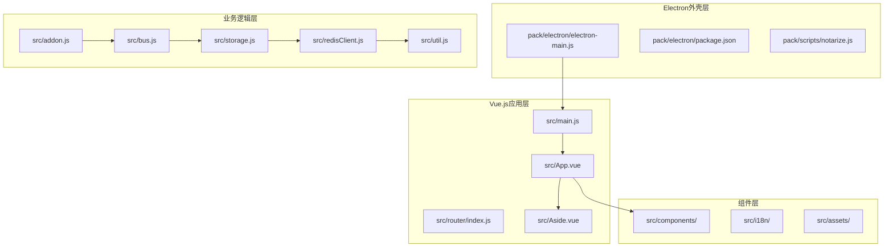
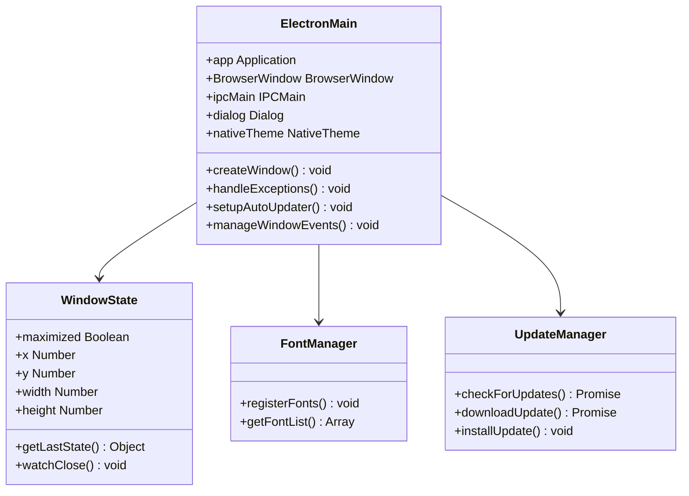
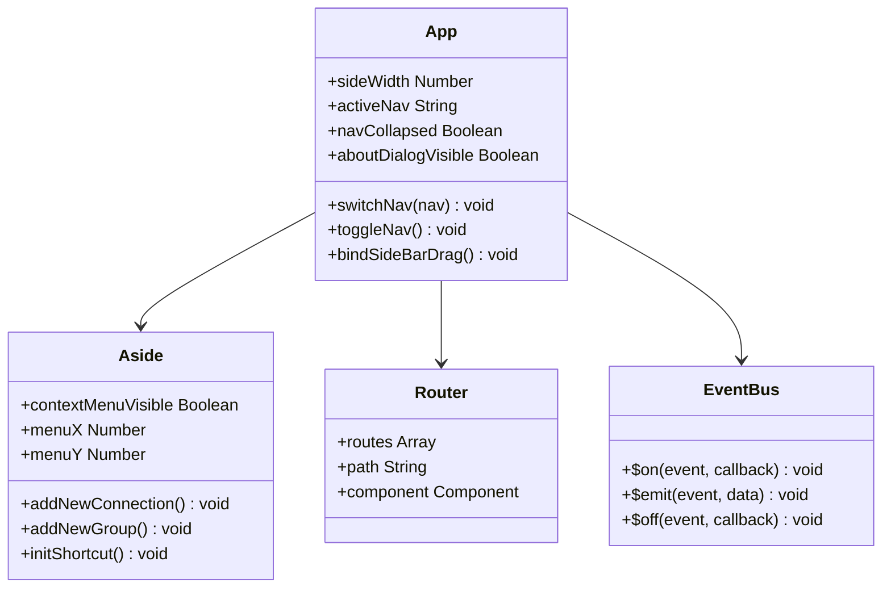
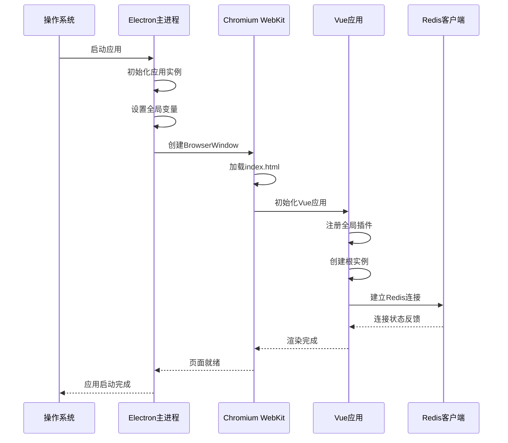
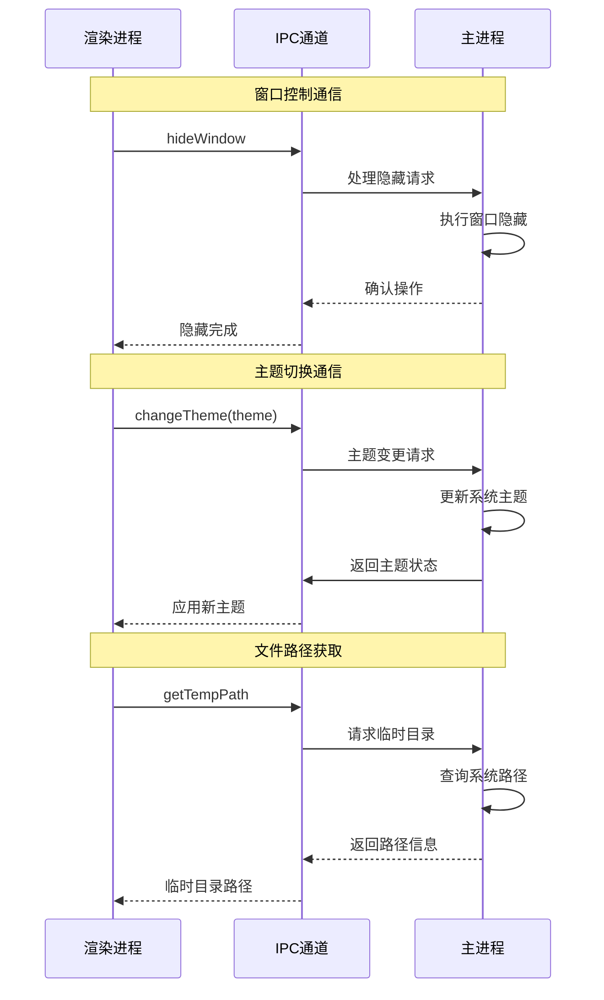
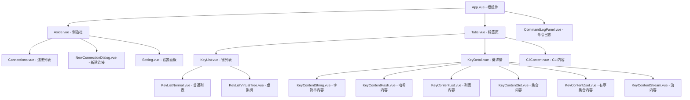
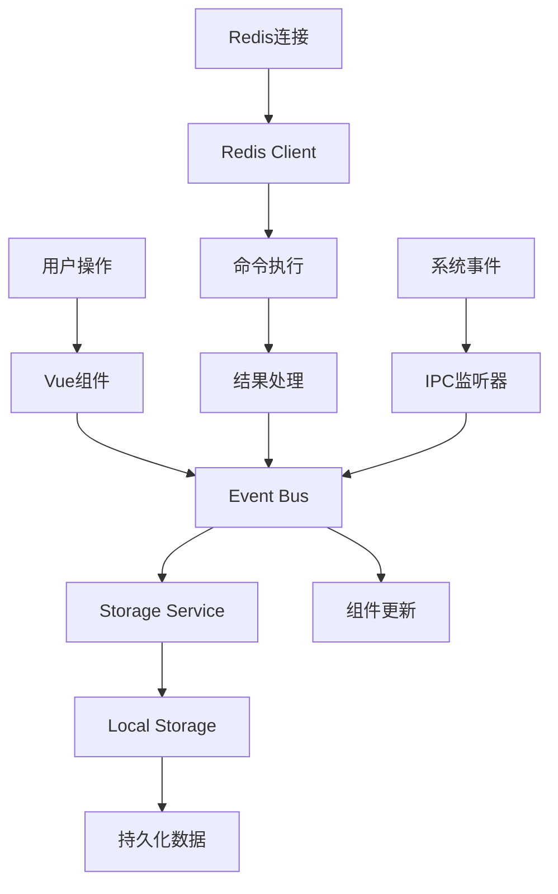
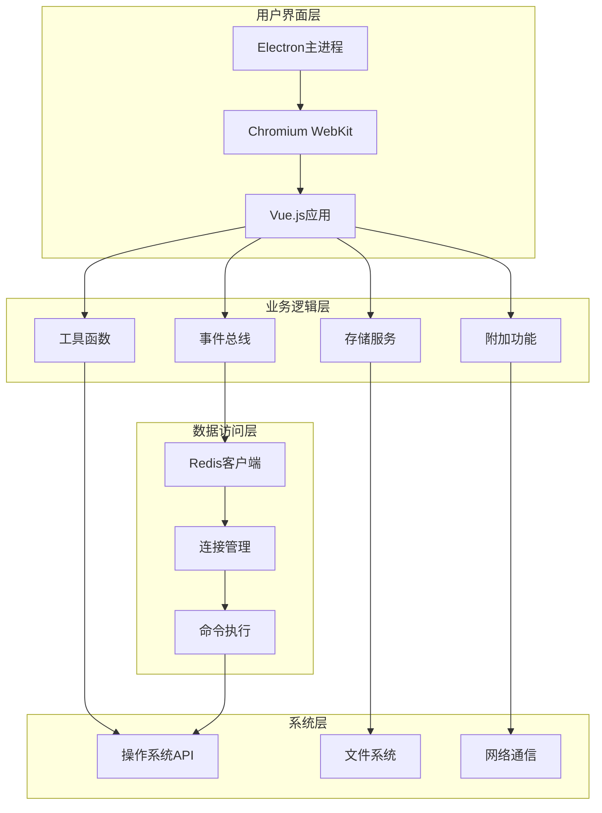
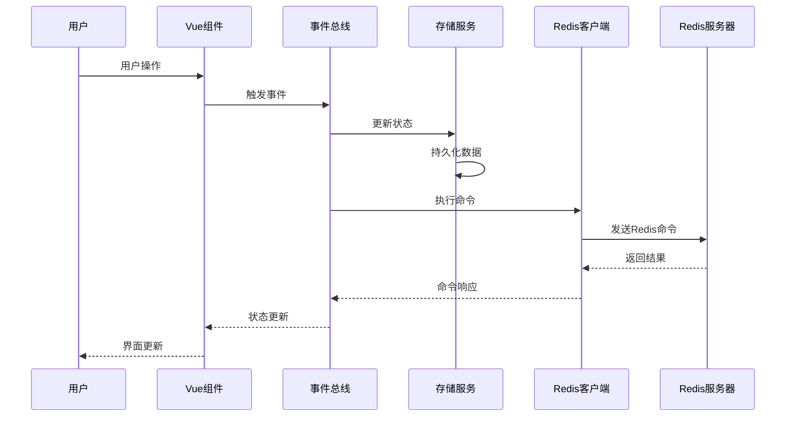

# 整体架构

<cite>
**本文档中引用的文件**
- [package.json](file://package.json)
- [src/main.js](file://src/main.js)
- [pack/electron/electron-main.js](file://pack/electron/electron-main.js)
- [src/App.vue](file://src/App.vue)
- [index.html](file://index.html)
- [src/Aside.vue](file://src/Aside.vue)
- [src/router/index.js](file://src/router/index.js)
- [src/bus.js](file://src/bus.js)
- [src/storage.js](file://src/storage.js)
- [src/redisClient.js](file://src/redisClient.js)
- [src/addon.js](file://src/addon.js)
- [src/util.js](file://src/util.js)
</cite>

## 目录
1. [简介](#简介)
2. [项目结构概览](#项目结构概览)
3. [核心架构组件](#核心架构组件)
4. [应用启动流程](#应用启动流程)
5. [主进程与渲染进程通信](#主进程与渲染进程通信)
6. [Vue.js应用架构](#vuejs应用架构)
7. [系统架构图](#系统架构图)
8. [数据流分析](#数据流分析)
9. [性能考虑](#性能考虑)
10. [总结](#总结)

## 简介

Another Redis Desktop Manager (ARDM) 是一个基于Electron框架开发的跨平台Redis桌面管理工具。该应用采用现代化的前端技术栈，结合Electron的原生能力，为用户提供了一个功能强大且稳定的Redis数据库管理界面。

项目的核心设计理念是：
- **高性能**：优化的大键值加载和搜索功能
- **跨平台兼容性**：支持Windows、macOS和Linux
- **稳定性**：即使在处理大量数据时也能保持稳定运行
- **用户体验**：直观的图形界面和丰富的功能特性

## 项目结构概览

ARDM采用模块化的项目结构，主要分为以下几个层次：

**图表来源**
- [pack/electron/electron-main.js](file://pack/electron/electron-main.js#L1-L227)
- [src/main.js](file://src/main.js#L1-L47)
- [src/App.vue](file://src/App.vue#L1-L576)

**章节来源**
- [package.json](file://package.json#L1-L130)
- [src/main.js](file://src/main.js#L1-L47)

## 核心架构组件

### Electron主进程组件

主进程负责整个应用的生命周期管理和系统级功能：

**图表来源**
- [pack/electron/electron-main.js](file://pack/electron/electron-main.js#L42-L102)

### Vue.js应用组件

Vue.js应用层构建了用户界面和交互逻辑：

**图表来源**
- [src/App.vue](file://src/App.vue#L119-L218)
- [src/Aside.vue](file://src/Aside.vue#L49-L122)
- [src/router/index.js](file://src/router/index.js#L1-L16)

**章节来源**
- [src/App.vue](file://src/App.vue#L119-L218)
- [src/Aside.vue](file://src/Aside.vue#L49-L122)

## 应用启动流程

ARDM的应用启动遵循标准的Electron应用启动序列：

**图表来源**
- [pack/electron/electron-main.js](file://pack/electron/electron-main.js#L104-L125)
- [src/main.js](file://src/main.js#L25-L46)

### 启动阶段详解

1. **Electron初始化阶段**
   - 应用环境检测和设置
   - 全局异常处理器注册
   - 自动更新机制初始化

2. **窗口创建阶段**
   - 获取上次窗口状态
   - 配置BrowserWindow参数
   - 加载应用入口页面

3. **Vue应用初始化阶段**
   - 导入必要的Vue插件
   - 注册全局组件和方法
   - 创建Vue根实例

4. **功能模块加载阶段**
   - 初始化事件总线
   - 加载本地存储数据
   - 建立Redis连接池

**章节来源**
- [pack/electron/electron-main.js](file://pack/electron/electron-main.js#L42-L102)
- [src/main.js](file://src/main.js#L1-L47)

## 主进程与渲染进程通信

ARDM使用Electron的IPC（Inter-Process Communication）机制实现主进程与渲染进程之间的通信：

**图表来源**
- [pack/electron/electron-main.js](file://pack/electron/electron-main.js#L127-L166)

### IPC通信类型

| 通信类型 | 发送方 | 接收方 | 功能描述 |
|---------|--------|--------|----------|
| 窗口控制 | 渲染进程 | 主进程 | 隐藏、最小化、最大化窗口 |
| 主题切换 | 渲染进程 | 主进程 | 切换亮色/暗色主题 |
| 文件操作 | 渲染进程 | 主进程 | 获取系统路径、文件访问 |
| 系统通知 | 主进程 | 渲染进程 | 系统主题变更通知 |
| 命令行参数 | 主进程 | 渲染进程 | 解析和传递启动参数 |

**章节来源**
- [pack/electron/electron-main.js](file://pack/electron/electron-main.js#L127-L166)

## Vue.js应用架构

### 组件层次结构

ARDM的Vue应用采用分层的组件架构：

**图表来源**
- [src/App.vue](file://src/App.vue#L112-L148)
- [src/Aside.vue](file://src/Aside.vue#L42-L58)

### 数据流管理

应用使用集中式状态管理模式：

**图表来源**
- [src/bus.js](file://src/bus.js#L1-L19)
- [src/storage.js](file://src/storage.js#L1-L329)

**章节来源**
- [src/App.vue](file://src/App.vue#L112-L148)
- [src/Aside.vue](file://src/Aside.vue#L42-L58)
- [src/bus.js](file://src/bus.js#L1-L19)

## 系统架构图

以下是ARDM的整体系统架构图：

**图表来源**
- [pack/electron/electron-main.js](file://pack/electron/electron-main.js#L1-L227)
- [src/main.js](file://src/main.js#L1-L47)
- [src/redisClient.js](file://src/redisClient.js#L1-L381)

### 架构特点

1. **分离关注点**：清晰的职责分离，主进程负责系统集成，渲染进程负责UI逻辑
2. **模块化设计**：各功能模块相对独立，便于维护和扩展
3. **事件驱动**：基于事件总线的松耦合通信机制
4. **状态管理**：统一的数据存储和状态管理
5. **可扩展性**：插件化的组件架构支持功能扩展

## 数据流分析

### 用户交互数据流

**图表来源**
- [src/bus.js](file://src/bus.js#L1-L19)
- [src/storage.js](file://src/storage.js#L1-L329)
- [src/redisClient.js](file://src/redisClient.js#L1-L381)

### 状态管理流程

| 数据流向 | 源组件 | 目标组件 | 数据类型 | 更新机制 |
|---------|--------|--------|----------|----------|
| 用户输入 | 表单组件 | 事件总线 | 用户数据 | 即时更新 |
| 连接状态 | Redis客户端 | Vue组件 | 连接信息 | 异步回调 |
| 配置变更 | 设置面板 | 存储服务 | 应用配置 | 持久化存储 |
| 命令执行 | CLI组件 | 日志面板 | 执行记录 | 实时追加 |

**章节来源**
- [src/bus.js](file://src/bus.js#L1-L19)
- [src/storage.js](file://src/storage.js#L1-L329)
- [src/redisClient.js](file://src/redisClient.js#L1-L381)

## 性能考虑

### 内存管理

ARDM在处理大量Redis数据时采用了多种优化策略：

1. **虚拟滚动**：对于大型键列表使用虚拟滚动技术
2. **懒加载**：按需加载键值内容，避免一次性加载所有数据
3. **缓存策略**：智能缓存常用数据，减少重复查询
4. **内存泄漏防护**：及时清理事件监听器和定时器

### 网络优化

1. **连接池管理**：复用Redis连接，减少连接开销
2. **批量操作**：支持批量键删除和批量命令执行
3. **异步处理**：非阻塞的命令执行和结果处理
4. **错误重试**：智能的连接失败重试机制

### 渲染性能

1. **组件懒加载**：按需加载Vue组件
2. **防抖处理**：对频繁的用户操作进行防抖
3. **增量更新**：只更新变化的DOM节点
4. **主题切换优化**：快速的主题切换机制

## 总结

Another Redis Desktop Manager展现了现代桌面应用开发的最佳实践：

### 技术优势

1. **架构清晰**：基于Electron的双进程架构，职责分明
2. **用户体验**：流畅的界面交互和响应式设计
3. **功能丰富**：支持各种Redis部署模式和高级功能
4. **跨平台**：统一的代码库支持多平台部署

### 设计亮点

1. **模块化组件**：高度解耦的组件架构便于维护
2. **事件驱动**：灵活的事件通信机制
3. **状态管理**：统一的数据流管理
4. **扩展性**：插件化的架构支持功能扩展

### 应用价值

ARDM不仅是一个Redis管理工具，更是学习现代桌面应用开发的优秀案例。其架构设计体现了：
- 现代Web技术在桌面应用中的成功应用
- 跨平台开发的最佳实践
- 大数据处理的优化策略
- 用户体验至上的设计理念

通过深入理解ARMD的架构设计，开发者可以更好地掌握Electron应用开发的核心技术和最佳实践。