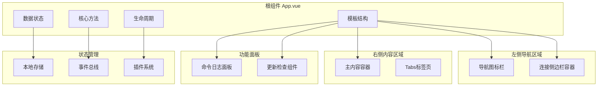
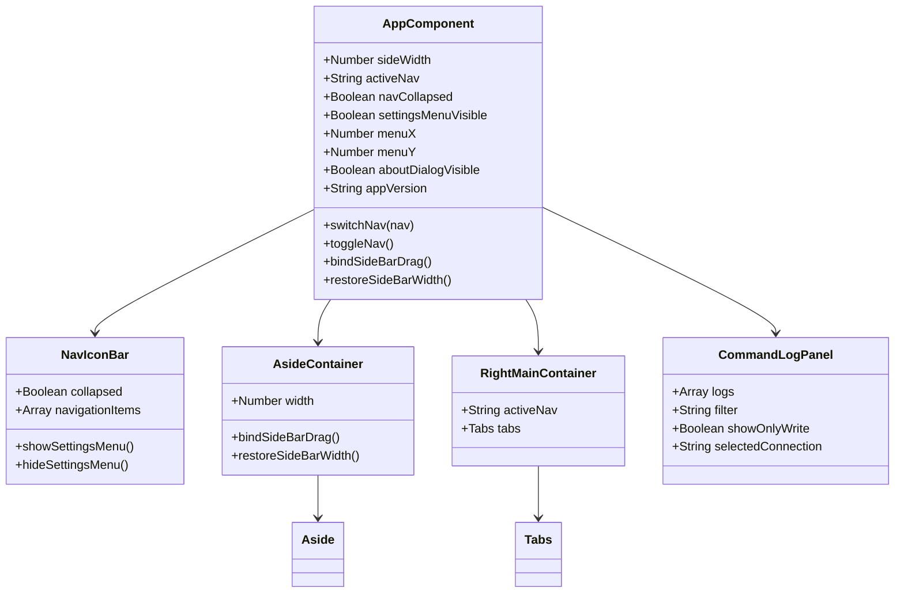
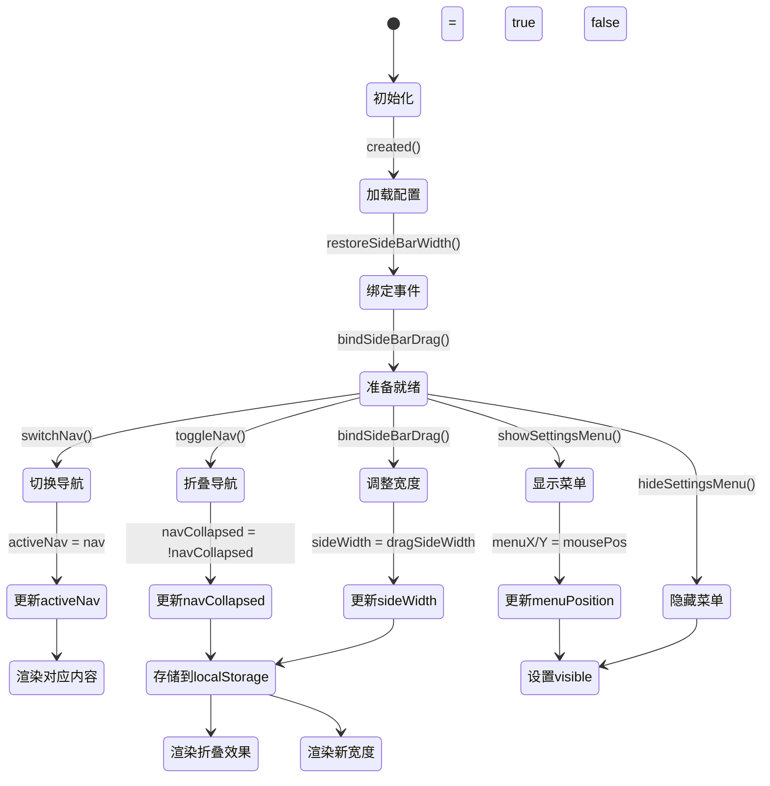
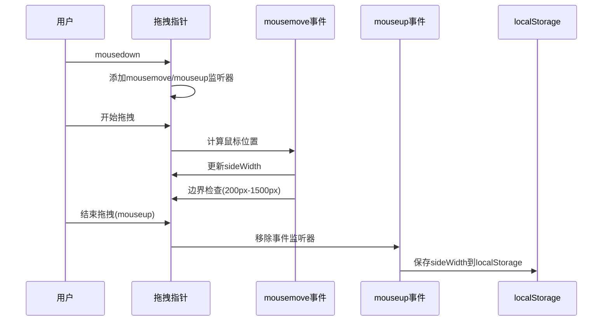
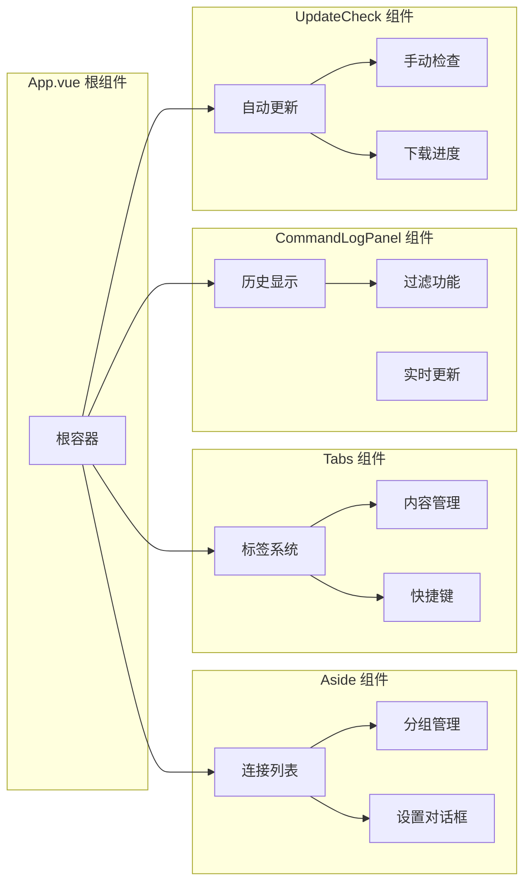
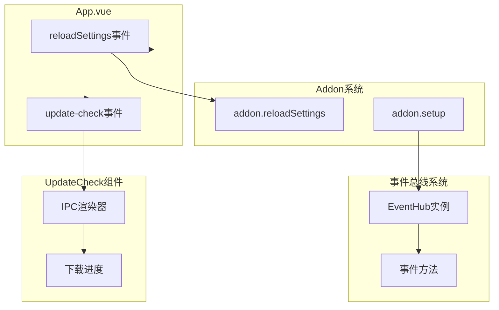
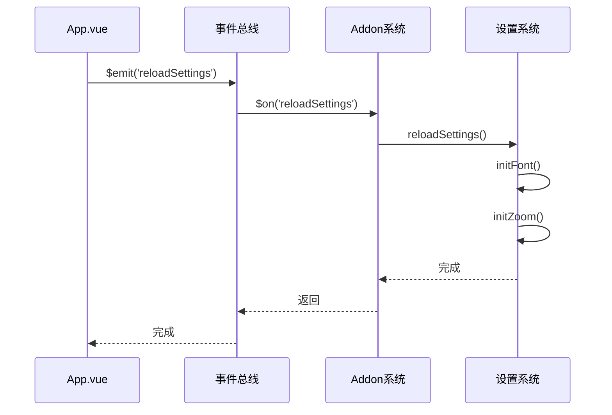
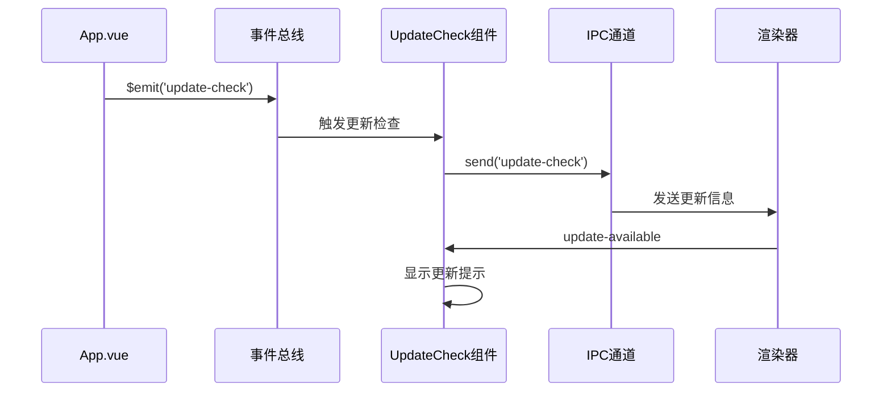
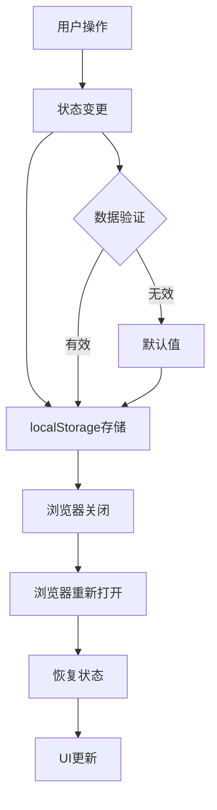

# 根组件技术文档

<cite>
**本文档中引用的文件**
- [App.vue](file://src/App.vue)
- [main.js](file://src/main.js)
- [addon.js](file://src/addon.js)
- [bus.js](file://src/bus.js)
- [storage.js](file://src/storage.js)
- [Aside.vue](file://src/Aside.vue)
- [Tabs.vue](file://src/components/Tabs.vue)
- [CommandLogPanel.vue](file://src/components/CommandLogPanel.vue)
- [UpdateCheck.vue](file://src/components/UpdateCheck.vue)
</cite>

## 目录
1. [项目概述](#项目概述)
2. [组件架构设计](#组件架构设计)
3. [模板结构分析](#模板结构分析)
4. [数据状态管理](#数据状态管理)
5. [生命周期钩子](#生命周期钩子)
6. [核心方法详解](#核心方法详解)
7. [子组件集成](#子组件集成)
8. [事件系统](#事件系统)
9. [状态持久化](#状态持久化)
10. [性能优化策略](#性能优化策略)
11. [故障排除指南](#故障排除指南)
12. [总结](#总结)

## 项目概述

App.vue是Another Redis Desktop Manager应用的根组件，作为整个应用程序的顶层容器，负责协调各个功能模块的协作关系。该组件采用模块化的架构设计，通过清晰的状态管理和事件通信机制，实现了复杂桌面应用的功能组织和用户体验优化。

## 组件架构设计

### 整体架构图



**图表来源**
- [App.vue](file://src/App.vue#L1-L116)
- [Aside.vue](file://src/Aside.vue#L1-L161)
- [Tabs.vue](file://src/components/Tabs.vue#L1-L448)

### 组件层次结构



**图表来源**
- [App.vue](file://src/App.vue#L128-L140)
- [Aside.vue](file://src/Aside.vue#L42-L60)

## 模板结构分析

### 布局架构

App.vue采用三列布局设计，包含以下主要区域：

#### 1. 左侧导航图标栏 (nav-icon-bar)
- **头部区域**: 包含应用Logo和导航切换按钮
- **顶部导航**: 连接列表和命令历史两个主要功能入口
- **底部设置**: 全局设置菜单入口
- **折叠状态**: 支持水平折叠以节省空间

#### 2. 左侧连接侧边栏 (aside-drag-container)
- **可拖拽宽度**: 通过拖拽指针调整侧边栏宽度
- **连接管理**: 显示Redis连接列表和分组
- **动态宽度**: 宽度范围限制在200px到1500px之间

#### 3. 右侧主内容区 (right-main-container)
- **标签页系统**: 动态打开多个Redis数据库标签页
- **内容适配**: 根据当前激活的导航项显示相应内容

#### 4. 命令日志全屏面板 (command-log-fullpage)
- **历史记录**: 显示所有Redis命令执行历史
- **实时更新**: 实时记录和显示命令执行信息
- **过滤功能**: 支持按连接、命令类型和关键字过滤

**章节来源**
- [App.vue](file://src/App.vue#L1-L116)

### 视觉设计特点

| 区域 | 特点 | 实现方式 |
|------|------|----------|
| 导航栏宽度 | 固定140px，折叠后48px | CSS类名控制 |
| 侧边栏宽度 | 可拖拽调整，默认265px | 鼠标事件监听 |
| 主内容区 | 自适应布局 | Flexbox布局 |
| 面板样式 | 暗色主题支持 | CSS变量和类名切换 |

## 数据状态管理

### 核心状态变量

App.vue维护以下关键状态变量：

#### 1. 布局状态
- **sideWidth**: 侧边栏宽度，默认265px
- **activeNav**: 当前激活的导航项 ('server'/'history')
- **navCollapsed**: 导航栏是否折叠

#### 2. 用户界面状态
- **settingsMenuVisible**: 设置菜单可见性
- **menuX/menuY**: 设置菜单定位坐标
- **aboutDialogVisible**: 关于对话框可见性

#### 3. 应用信息
- **appVersion**: 应用版本号（从URL参数获取）

### 状态流转图



**图表来源**
- [App.vue](file://src/App.vue#L128-L140)
- [App.vue](file://src/App.vue#L157-L174)

**章节来源**
- [App.vue](file://src/App.vue#L128-L140)

## 生命周期钩子

### created() 钩子

在组件创建阶段执行以下关键操作：

#### 1. 事件总线监听
```javascript
// 监听设置重载事件
this.$bus.$on('reloadSettings', () => {
  addon.reloadSettings();
});
```

#### 2. 状态恢复
```javascript
// 恢复侧边栏宽度
this.restoreSideBarWidth();
// 恢复导航栏折叠状态
this.navCollapsed = localStorage.navCollapsed === 'true';
```

#### 3. DOM事件绑定
```javascript
// 绑定点击事件隐藏设置菜单
document.addEventListener('click', this.hideSettingsMenu);
```

### mounted() 钩子

在DOM挂载完成后执行：

#### 1. 插件初始化
```javascript
// 延迟2秒触发自动更新检查
setTimeout(() => {
  this.$bus.$emit('update-check');
}, 2000);

// 绑定侧边栏拖拽功能
this.bindSideBarDrag();

// 执行插件系统初始化
addon.setup();
```

### beforeDestroy() 钩子

清理工作：
```javascript
// 移除DOM事件监听器
document.removeEventListener('click', this.hideSettingsMenu);
```

**章节来源**
- [App.vue](file://src/App.vue#L140-L155)
- [App.vue](file://src/App.vue#L231-L239)

## 核心方法详解

### 导航控制方法

#### switchNav(nav)
- **功能**: 切换当前激活的导航项
- **实现**: 更新activeNav状态变量
- **用途**: 在服务器连接和命令历史之间切换

#### toggleNav()
- **功能**: 切换导航栏的折叠状态
- **实现**: 
  - 切换navCollapsed状态
  - 将状态保存到localStorage
- **用途**: 提供紧凑的界面布局选项

### 侧边栏拖拽功能

#### bindSideBarDrag() 方法详解

这是App.vue的核心交互功能之一，实现侧边栏宽度的动态调整：



**图表来源**
- [App.vue](file://src/App.vue#L198-L224)

#### 方法实现细节

1. **事件绑定**: 使用原生DOM事件监听器
2. **位置计算**: 基于鼠标X坐标计算新的宽度
3. **边界验证**: 确保宽度在合理范围内
4. **状态同步**: 自动保存到localStorage

### 设置菜单管理

#### showSettingsMenu(e)
- **功能**: 显示设置菜单
- **实现**: 
  - 阻止事件冒泡
  - 计算菜单定位坐标
  - 显示菜单

#### hideSettingsMenu()
- **功能**: 隐藏设置菜单
- **实现**: 设置settingsMenuVisible为false

### 状态持久化方法

#### restoreSideBarWidth()
- **功能**: 从localStorage恢复侧边栏宽度
- **实现**: 读取localStorage.sideWidth并赋值给sideWidth

**章节来源**
- [App.vue](file://src/App.vue#L157-L230)

## 子组件集成

### 组件注册与使用

App.vue通过components选项注册了四个主要子组件：

| 组件名称 | 引用名称 | 功能描述 |
|----------|----------|----------|
| Aside | Aside | 连接管理、分组管理 |
| Tabs | Tabs | 多标签页管理 |
| UpdateCheck | UpdateCheck | 自动更新检查 |
| CommandLogPanel | CommandLogPanel | 命令历史记录 |

### 子组件访问机制

#### 1. $refs 访问
```javascript
// 访问Aside组件中的设置对话框
this.$refs.aside.$refs.settingDialog.show()

// 访问CommandLogPanel组件
this.$refs.commandLogPanel.scrollToBottom()
```

#### 2. 事件通信
```javascript
// 通过事件总线与子组件通信
this.$bus.$emit('refreshConnections')
this.$bus.$emit('openConnection', connectionName)
```

### 子组件职责分工



**图表来源**
- [App.vue](file://src/App.vue#L155)
- [Aside.vue](file://src/Aside.vue#L42-L60)
- [Tabs.vue](file://src/components/Tabs.vue#L42-L50)

**章节来源**
- [App.vue](file://src/App.vue#L155)
- [Aside.vue](file://src/Aside.vue#L42-L60)
- [Tabs.vue](file://src/components/Tabs.vue#L42-L50)

## 事件系统

### 事件总线架构

App.vue通过全局事件总线($bus)实现组件间通信：



**图表来源**
- [bus.js](file://src/bus.js#L1-L19)
- [addon.js](file://src/addon.js#L6-L12)

### 事件流程

#### 1. 设置重载流程


**图表来源**
- [App.vue](file://src/App.vue#L141-L142)
- [addon.js](file://src/addon.js#L15-L18)

#### 2. 更新检查流程


**图表来源**
- [App.vue](file://src/App.vue#L232-L233)
- [UpdateCheck.vue](file://src/components/UpdateCheck.vue#L16-L28)

**章节来源**
- [bus.js](file://src/bus.js#L1-L19)
- [App.vue](file://src/App.vue#L141-L142)

## 状态持久化

### localStorage 存储策略

App.vue实现了完整的状态持久化机制：

#### 1. 侧边栏宽度持久化
```javascript
// 存储
localStorage.sideWidth = that.sideWidth;

// 恢复
const { sideWidth } = localStorage;
sideWidth && (this.sideWidth = sideWidth);
```

#### 2. 导航栏折叠状态持久化
```javascript
// 存储
localStorage.navCollapsed = this.navCollapsed;

// 恢复
this.navCollapsed = localStorage.navCollapsed === 'true';
```

### 持久化数据流程



**图表来源**
- [App.vue](file://src/App.vue#L206-L216)
- [App.vue](file://src/App.vue#L147-L148)

### 数据安全机制

| 存储项 | 类型 | 默认值 | 验证规则 |
|--------|------|--------|----------|
| sideWidth | Number | 265 | 200-1500px范围 |
| navCollapsed | Boolean | false | true/false布尔值 |
| settings | Object | {} | JSON格式验证 |

**章节来源**
- [App.vue](file://src/App.vue#L226-L228)
- [App.vue](file://src/App.vue#L146-L148)

## 性能优化策略

### 1. 延迟加载机制

#### 自动更新检查延迟
```javascript
setTimeout(() => {
  this.$bus.$emit('update-check');
}, 2000);
```

#### 侧边栏拖拽事件绑定
```javascript
// 仅在需要时绑定拖拽事件
this.bindSideBarDrag();
```

### 2. 事件监听器管理

#### 内存泄漏防护
```javascript
// 创建时添加
document.addEventListener('click', this.hideSettingsMenu);

// 销毁时移除
beforeDestroy() {
  document.removeEventListener('click', this.hideSettingsMenu);
}
```

### 3. 条件渲染优化

#### 导航内容按需显示
```vue
<!-- 仅在对应导航激活时渲染 -->
<div v-show="activeNav === 'server'">
  <!-- 服务器连接内容 -->
</div>
<div v-show="activeNav === 'history'">
  <!-- 命令历史内容 -->
</div>
```

### 4. 状态更新优化

#### 批量状态更新
```javascript
// 避免频繁的状态更新
if ((dragSideWidth > 200) && (dragSideWidth < 1500)) {
  that.sideWidth = dragSideWidth;
}
```

## 故障排除指南

### 常见问题及解决方案

#### 1. 侧边栏宽度异常
**症状**: 侧边栏宽度无法调整或恢复
**原因**: localStorage数据损坏
**解决方案**:
```javascript
// 清除localStorage数据
localStorage.removeItem('sideWidth');
// 页面刷新后使用默认宽度
```

#### 2. 导航栏折叠失效
**症状**: 点击折叠按钮无响应
**原因**: 事件监听器未正确绑定
**解决方案**:
```javascript
// 检查事件监听器状态
console.log('Event listeners:', document.hasEventListener('click'));
// 重新绑定事件
this.hideSettingsMenu();
```

#### 3. 设置菜单不显示
**症状**: 右键点击设置图标无反应
**原因**: 事件冒泡被阻止或菜单定位错误
**解决方案**:
```javascript
// 检查菜单可见性
console.log('Menu visible:', this.settingsMenuVisible);
// 检查事件处理函数
console.log('Menu handler:', this.showSettingsMenu);
```

### 调试工具

#### 1. 状态监控
```javascript
// 在开发环境中添加状态监控
window.debugApp = {
  getState: () => ({
    sideWidth: this.sideWidth,
    activeNav: this.activeNav,
    navCollapsed: this.navCollapsed
  }),
  localStorage: localStorage
};
```

#### 2. 事件追踪
```javascript
// 添加事件监听器调试
this.$bus.$on('*', (eventName, ...args) => {
  console.log('Event:', eventName, args);
});
```

## 总结

App.vue作为Another Redis Desktop Manager的核心根组件，展现了优秀的架构设计和实现质量。其主要特点包括：

### 架构优势
1. **模块化设计**: 清晰的组件分离和职责划分
2. **状态管理**: 完善的数据状态管理和持久化机制
3. **事件通信**: 健壮的事件总线系统
4. **用户体验**: 流畅的交互体验和响应式设计

### 技术亮点
1. **拖拽功能**: 精确的鼠标事件处理和边界验证
2. **状态持久化**: 完整的localStorage集成
3. **性能优化**: 合理的延迟加载和内存管理
4. **扩展性**: 良好的插件系统集成

### 最佳实践
1. **生命周期管理**: 正确的事件监听器绑定和清理
2. **错误处理**: 完善的边界条件检查
3. **代码组织**: 清晰的方法分组和注释
4. **用户体验**: 细节丰富的交互反馈

这个组件为整个应用提供了稳定可靠的基础设施，是现代Vue.js应用开发的优秀范例。