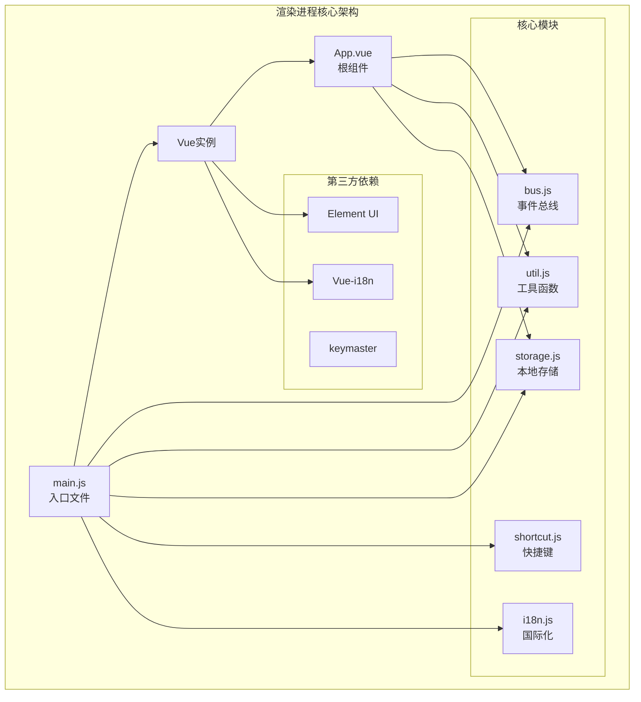
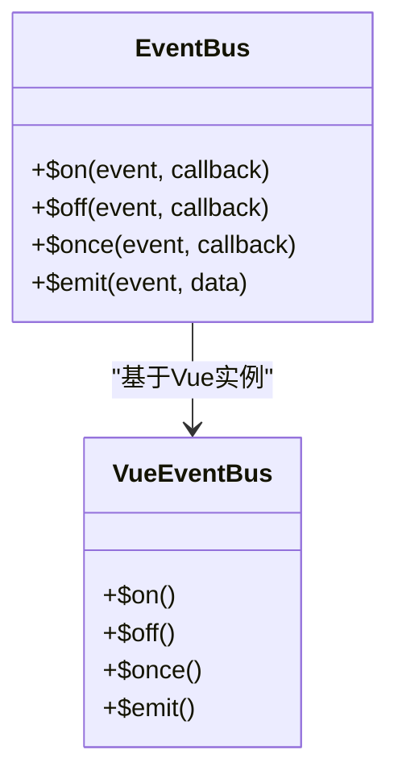
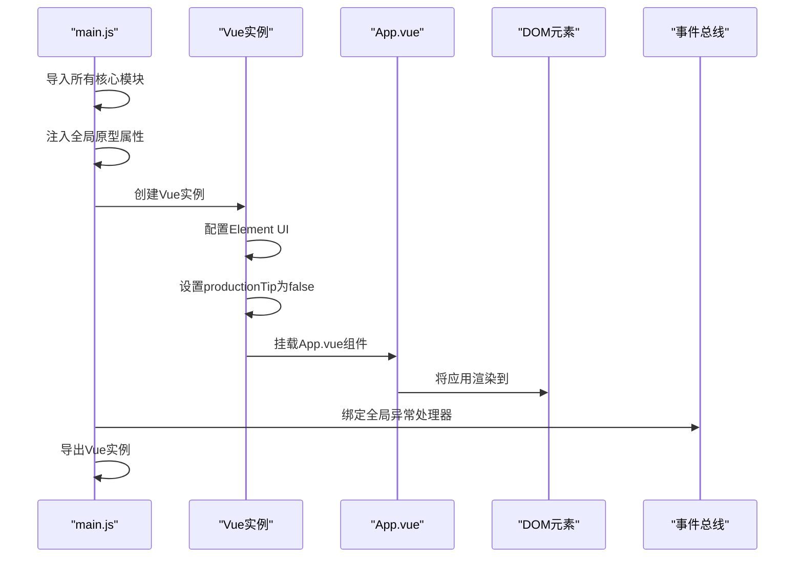
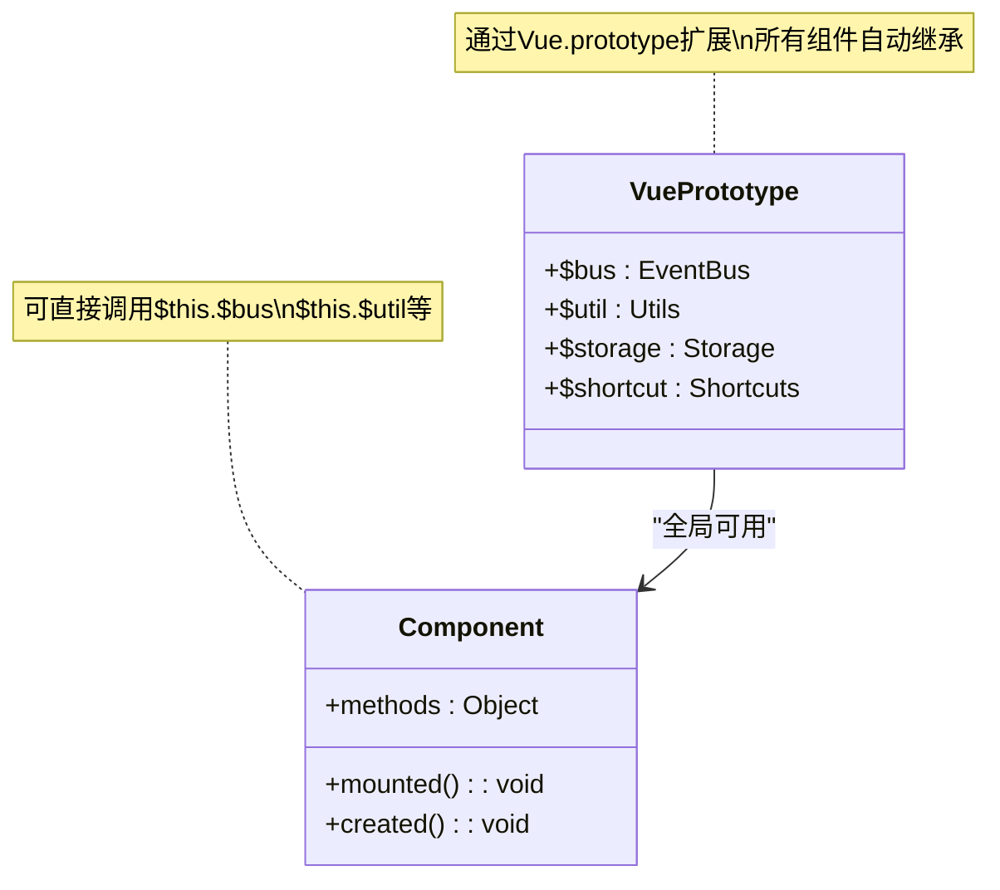
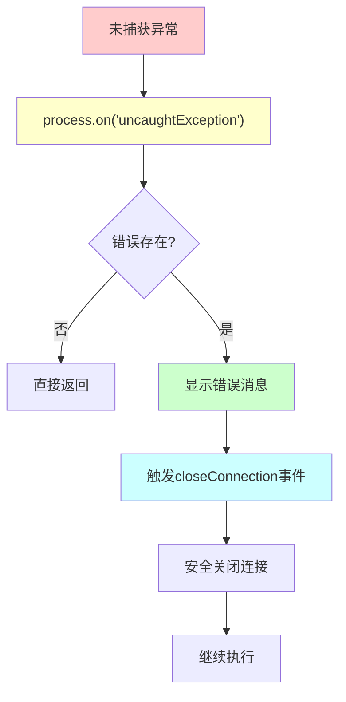
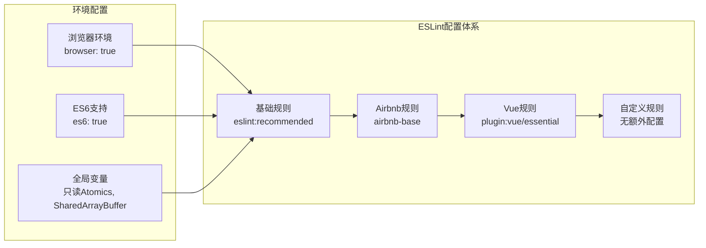
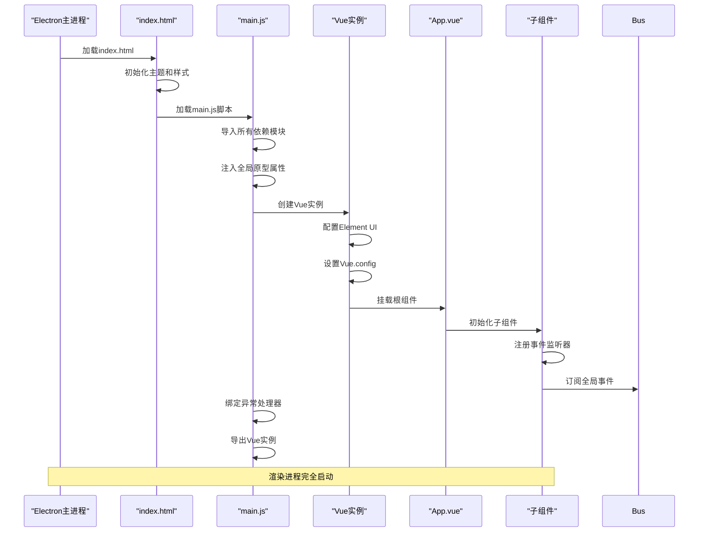

# Another Redis Desktop Manager 渲染进程技术文档

<cite>
**本文档中引用的文件**
- [src/main.js](file://src/main.js)
- [src/App.vue](file://src/App.vue)
- [src/bus.js](file://src/bus.js)
- [src/util.js](file://src/util.js)
- [src/storage.js](file://src/storage.js)
- [src/i18n/i18n.js](file://src/i18n/i18n.js)
- [src/shortcut.js](file://src/shortcut.js)
- [src/router/index.js](file://src/router/index.js)
- [package.json](file://package.json)
- [.eslintrc.json](file://.eslintrc.json)
- [index.html](file://index.html)
</cite>

## 目录
1. [项目概述](#项目概述)
2. [渲染进程架构](#渲染进程架构)
3. [核心模块分析](#核心模块分析)
4. [Vue应用初始化流程](#vue应用初始化流程)
5. [全局对象注入机制](#全局对象注入机制)
6. [异常处理机制](#异常处理机制)
7. [ESLint代码规范](#eslint代码规范)
8. [渲染进程启动时序](#渲染进程启动时序)
9. [性能优化考虑](#性能优化考虑)
10. [故障排除指南](#故障排除指南)

## 项目概述

Another Redis Desktop Manager是一个跨平台的Redis桌面管理器，采用Electron框架构建，使用Vue.js作为前端框架。渲染进程负责用户界面的展示和交互逻辑处理，是应用程序的核心用户界面层。

### 技术栈概览

- **前端框架**: Vue.js 2.6.11
- **UI组件库**: Element UI 2.4.11
- **国际化**: Vue-i18n 8.7.0
- **状态管理**: 自定义事件总线(bus)
- **本地存储**: localStorage封装
- **快捷键**: keymaster
- **构建工具**: Webpack 4.46.0

**章节来源**
- [package.json](file://package.json#L35-L56)

## 渲染进程架构

渲染进程采用模块化架构设计，通过依赖注入的方式组织各个功能模块。

**图表来源**
- [src/main.js](file://src/main.js#L1-L47)
- [src/App.vue](file://src/App.vue#L117-L240)

## 核心模块分析

### 1. 事件总线模块 (bus.js)

事件总线提供了一个全局的事件通信机制，用于组件间解耦通信。

**图表来源**
- [src/bus.js](file://src/bus.js#L1-L19)

### 2. 工具函数模块 (util.js)

工具函数模块提供了丰富的数据处理和格式化功能，支持多种数据类型的检测和转换。

主要功能包括：
- 缓冲区数据处理（字符串、十六进制、二进制转换）
- 数据类型检测（JSON、PHP序列化、Java序列化等）
- 文件大小格式化
- 字符串截断和排序
- 防抖函数
- 剪贴板操作

### 3. 本地存储模块 (storage.js)

本地存储模块封装了localStorage操作，提供连接管理和设置持久化的功能。

核心功能：
- 连接组管理（增删改查、层级结构）
- 连接配置存储
- 设置项管理
- S3同步配置
- 自定义格式化器管理

### 4. 国际化模块 (i18n.js)

国际化模块集成了多语言支持，支持12种语言的界面文本。

支持的语言包：
- 英语 (en)
- 中文简体 (cn)
- 中文繁体 (tw)
- 德语 (de)
- 法语 (fr)
- 意大利语 (it)
- 西班牙语 (es)
- 俄语 (ru)
- 土耳其语 (tr)
- 韩语 (ko)
- 越南语 (vi)
- 乌克兰语 (ua)

**章节来源**
- [src/bus.js](file://src/bus.js#L1-L19)
- [src/util.js](file://src/util.js#L1-L392)
- [src/storage.js](file://src/storage.js#L1-L329)
- [src/i18n/i18n.js](file://src/i18n/i18n.js#L1-L98)

## Vue应用初始化流程

Vue应用的初始化过程遵循标准的Vue生命周期，通过main.js文件进行统一配置和挂载。

**图表来源**
- [src/main.js](file://src/main.js#L1-L47)

### 初始化步骤详解

1. **模块导入阶段** (`第1-9行`)
   - 导入Vue核心库
   - 导入Element UI组件库
   - 导入字体图标样式
   - 导入应用根组件
   - 导入国际化配置
   - 导入事件总线
   - 导入工具函数
   - 导入本地存储
   - 导入快捷键模块

2. **全局对象注入** (`第16-19行`)
   - `Vue.prototype.$bus`: 事件总线实例
   - `Vue.prototype.$util`: 工具函数集合
   - `Vue.prototype.$storage`: 本地存储接口
   - `Vue.prototype.$shortcut`: 快捷键管理器

3. **Vue配置阶段** (`第21-22行`)
   - 使用Element UI插件，设置全局尺寸为'small'
   - 禁用生产提示，避免控制台警告信息

4. **应用挂载** (`第25-30行`)
   - 创建Vue实例并绑定到DOM元素
   - 配置国际化支持
   - 注册App组件
   - 使用模板语法渲染根组件

**章节来源**
- [src/main.js](file://src/main.js#L1-L47)

## 全局对象注入机制

全局对象注入是通过Vue.prototype实现的，这种方式使得所有Vue组件都可以直接访问这些全局服务。

**图表来源**
- [src/main.js](file://src/main.js#L16-L19)

### 注入的具体实现

每个全局对象都提供了特定的功能接口：

| 全局属性 | 类型 | 功能描述 |
|---------|------|----------|
| `$bus` | EventBus | 全局事件通信总线，支持发布订阅模式 |
| `$util` | Utils | 提供数据处理、格式化、工具函数 |
| `$storage` | Storage | 本地存储管理，连接和设置持久化 |
| `$shortcut` | Shortcuts | 快捷键绑定和管理 |

这种设计模式的优势：
- **解耦合**: 组件无需显式导入即可使用全局服务
- **一致性**: 所有组件访问相同的服务实例
- **可测试性**: 可以轻松替换或模拟全局对象
- **性能优化**: 避免重复创建相同的服务实例

**章节来源**
- [src/main.js](file://src/main.js#L16-L19)

## 异常处理机制

渲染进程实现了完善的异常处理机制，确保应用在遇到未捕获异常时能够优雅地降级处理。

**图表来源**
- [src/main.js](file://src/main.js#L32-L44)

### 异常处理流程

1. **异常捕获** (`第32-33行`)
   - 监听`uncaughtException`事件
   - 获取异常对象和异常来源

2. **异常验证** (`第34-36行`)
   - 检查异常对象是否存在
   - 避免处理空异常

3. **用户反馈** (`第38-41行`)
   - 使用Element UI的消息组件显示错误
   - 显示包含异常信息的错误消息
   - 设置5秒的显示时长

4. **资源清理** (`第43-44行`)
   - 通过事件总线触发`closeConnection`事件
   - 触发连接安全关闭流程
   - 避免内存泄漏和数据损坏

### 异常处理的优势

- **用户体验**: 提供友好的错误提示，避免应用崩溃
- **数据安全**: 确保异常情况下连接能够正确关闭
- **调试支持**: 记录异常信息便于问题排查
- **稳定性**: 防止单个异常导致整个应用崩溃

**章节来源**
- [src/main.js](file://src/main.js#L32-L44)

## ESLint代码规范

项目集成了ESLint进行代码质量控制，采用Airbnb JavaScript风格指南和Vue官方推荐规则。

### ESLint配置分析

**图表来源**
- [.eslintrc.json](file://.eslintrc.json#L1-L19)

### 配置特点

1. **继承关系** (`第6行`)
   - 基础规则集
   - Airbnb JavaScript风格指南
   - Vue.js专用规则

2. **环境支持** (`第2-5行`)
   - 浏览器环境启用
   - ES6语法支持
   - 全局变量声明

3. **解析器配置** (`第11-13行`)
   - 支持ECMAScript 2018语法
   - 适用于现代JavaScript开发

4. **插件系统** (`第14-16行`)
   - Vue.js JSX支持
   - Vue组件规则检查

### 代码质量保障

- **一致性**: 统一的代码风格和命名约定
- **可维护性**: 清晰的代码结构和注释规范
- **安全性**: 防止潜在的安全漏洞
- **性能**: 优化代码执行效率

**章节来源**
- [.eslintrc.json](file://.eslintrc.json#L1-L19)

## 渲染进程启动时序

渲染进程的启动遵循严格的时序控制，确保各个模块按正确的顺序初始化。

**图表来源**
- [src/main.js](file://src/main.js#L1-L47)
- [index.html](file://index.html#L62-L66)

### 启动阶段详解

1. **HTML加载阶段** (`index.html`)
   - 加载基础样式和主题
   - 准备DOM容器`

`
   - 初始化窗口主题和配置

2. **JavaScript加载阶段** (`main.js`)
   - 模块导入和依赖解析
   - 全局对象注入
   - Vue实例创建和配置

3. **Vue挂载阶段**
   - 组件树构建
   - 生命周期钩子执行
   - 事件总线初始化

4. **应用就绪阶段**
   - 子组件初始化
   - 用户界面渲染完成
   - 异常处理器就位

### 性能优化策略

- **异步加载**: 非关键模块延迟加载
- **懒加载**: 路由组件按需加载
- **缓存机制**: 本地存储减少网络请求
- **事件节流**: 高频事件防抖处理

**章节来源**
- [src/main.js](file://src/main.js#L1-L47)
- [index.html](file://index.html#L62-L66)

## 性能优化考虑

渲染进程在设计时充分考虑了性能优化，采用了多种策略提升应用响应速度和用户体验。

### 优化策略

1. **模块化加载**
   - 按需导入非核心模块
   - 避免一次性加载所有依赖
   - 使用动态导入优化首屏加载

2. **组件优化**
   - 使用keep-alive缓存组件状态
   - 实现虚拟滚动处理大量数据
   - 避免不必要的重新渲染

3. **内存管理**
   - 及时清理事件监听器
   - 避免内存泄漏
   - 合理使用缓存策略

4. **网络优化**
   - 连接池管理
   - 请求去重和缓存
   - 异步操作优化

### 监控指标

- **启动时间**: 从Electron窗口创建到应用就绪的时间
- **内存使用**: 应用运行期间的内存占用情况
- **CPU使用率**: 主要操作的CPU消耗
- **响应时间**: 用户操作到界面更新的延迟

## 故障排除指南

### 常见问题及解决方案

1. **应用无法启动**
   - 检查Node.js版本是否符合要求
   - 验证依赖包安装完整性
   - 查看控制台错误信息

2. **界面显示异常**
   - 清除浏览器缓存
   - 检查CSS样式加载
   - 验证Element UI版本兼容性

3. **连接失败**
   - 检查Redis服务器状态
   - 验证网络连接
   - 确认防火墙设置

4. **性能问题**
   - 监控内存使用情况
   - 分析CPU占用热点
   - 优化大数据量处理

### 调试技巧

- 使用Vue DevTools调试组件状态
- 利用浏览器开发者工具分析性能
- 启用详细的日志记录
- 使用Electron的开发者工具

**章节来源**
- [src/main.js](file://src/main.js#L32-L44)

## 结论

Another Redis Desktop Manager的渲染进程采用了现代化的架构设计，通过模块化、组件化的方式实现了高度可维护和可扩展的应用程序。Vue.js框架的使用确保了良好的开发体验和用户体验，而完善的异常处理机制则保证了应用的稳定性和可靠性。

项目的代码规范和质量控制措施为长期维护奠定了坚实的基础，而性能优化策略则确保了应用在各种使用场景下的流畅运行。这种设计模式不仅适用于当前的Redis管理器应用，也为类似的桌面应用开发提供了有价值的参考。