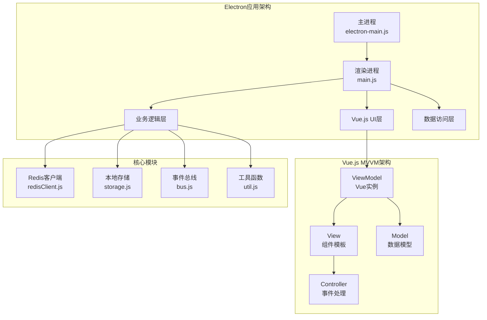
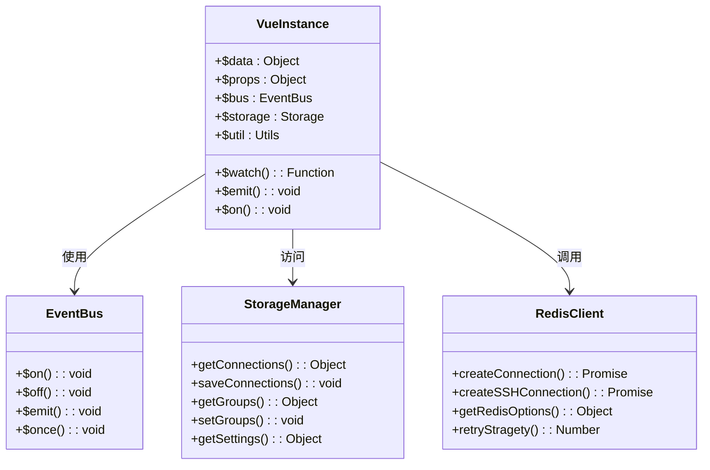
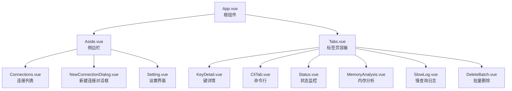
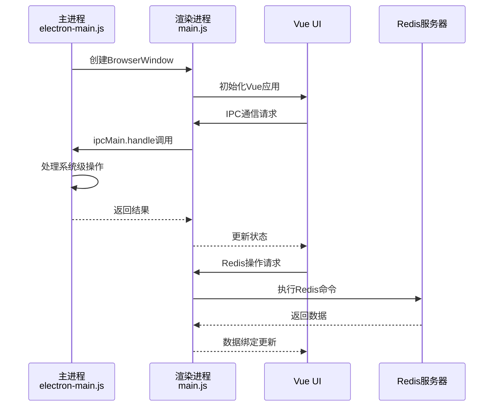
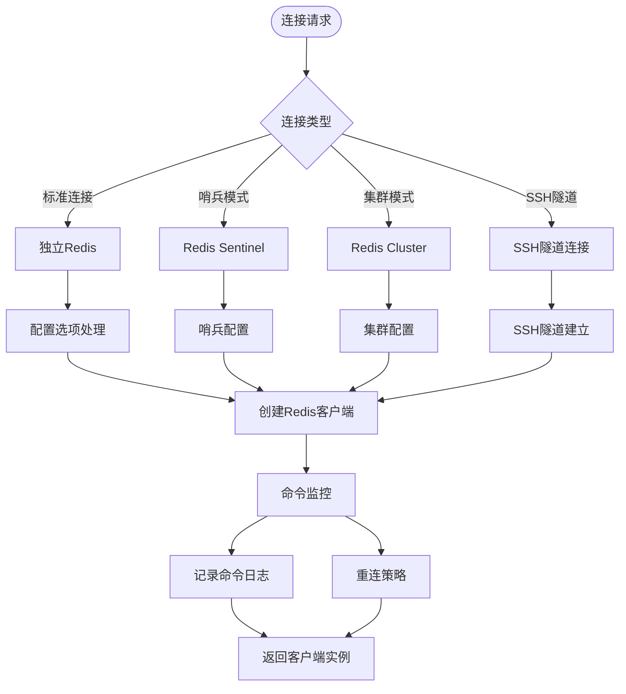
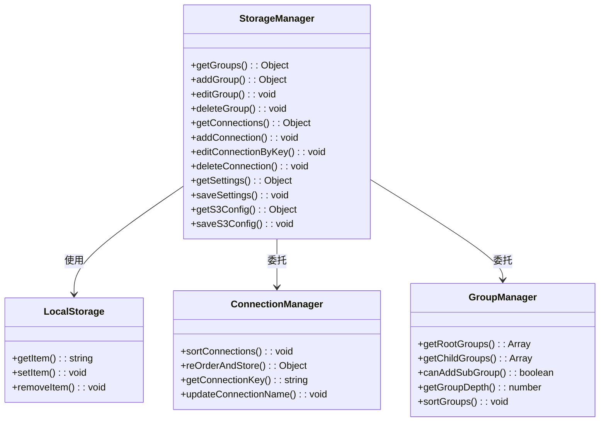
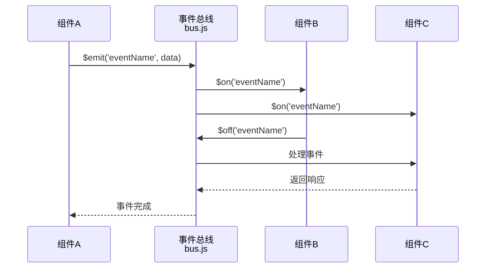
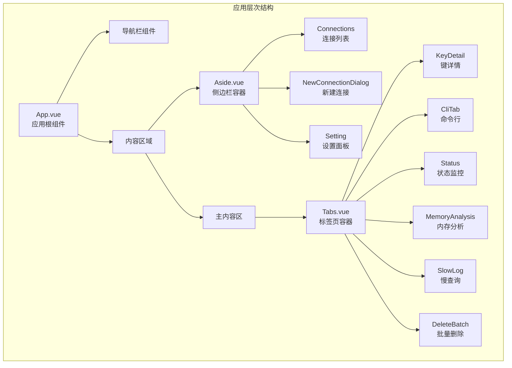
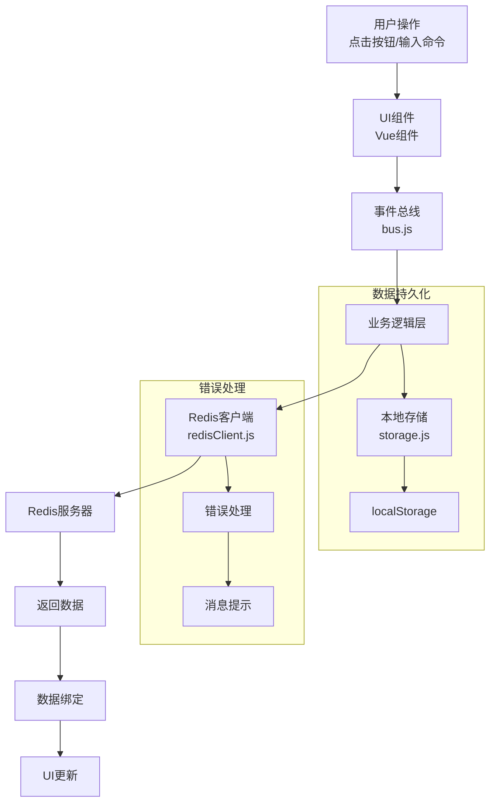
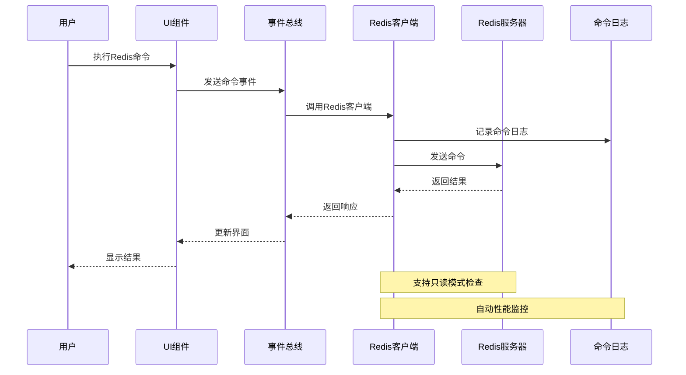

# Another Redis Desktop Manager 架构设计文档

<cite>
**本文档中引用的文件**
- [src/main.js](file://src/main.js)
- [pack/electron/electron-main.js](file://pack/electron/electron-main.js)
- [src/App.vue](file://src/App.vue)
- [src/bus.js](file://src/bus.js)
- [src/redisClient.js](file://src/redisClient.js)
- [src/storage.js](file://src/storage.js)
- [src/util.js](file://src/util.js)
- [src/commands.js](file://src/commands.js)
- [src/Aside.vue](file://src/Aside.vue)
- [src/components/Tabs.vue](file://src/components/Tabs.vue)
- [index.html](file://index.html)
- [package.json](file://package.json)
</cite>

## 目录
1. [项目概述](#项目概述)
2. [系统架构概览](#系统架构概览)
3. [MVVM架构模式](#mvvm架构模式)
4. [Electron应用架构](#electron应用架构)
5. [核心模块设计](#核心模块设计)
6. [组件化设计](#组件化设计)
7. [数据流与通信机制](#数据流与通信机制)
8. [技术选型分析](#技术选型分析)
9. [性能优化策略](#性能优化策略)
10. [总结](#总结)

## 项目概述

Another Redis Desktop Manager (ARDM) 是一个跨平台的Redis数据库管理工具，采用Electron框架构建桌面应用程序。该项目展现了现代前端架构的最佳实践，通过MVVM模式、组件化设计和模块化开发实现了高度可维护性和扩展性。

## 系统架构概览

ARDM采用了经典的三层架构模式：表现层（Presentation Layer）、业务逻辑层（Business Logic Layer）和数据访问层（Data Access Layer），同时结合了Electron的主进程和渲染进程分离架构。

**图表来源**
- [pack/electron/electron-main.js](file://pack/electron/electron-main.js#L1-L227)
- [src/main.js](file://src/main.js#L1-L47)
- [src/App.vue](file://src/App.vue#L1-L576)

## MVVM架构模式

### ViewModel层实现

Vue.js作为MVVM架构的核心，负责连接View和Model之间的数据绑定和状态管理。

**图表来源**
- [src/main.js](file://src/main.js#L16-L20)
- [src/bus.js](file://src/bus.js#L1-L19)
- [src/storage.js](file://src/storage.js#L1-L329)
- [src/redisClient.js](file://src/redisClient.js#L1-L381)

### View层组件结构

View层采用组件化设计，每个功能模块都封装为独立的Vue组件。

**图表来源**
- [src/App.vue](file://src/App.vue#L80-L108)
- [src/Aside.vue](file://src/Aside.vue#L36-L40)
- [src/components/Tabs.vue](file://src/components/Tabs.vue#L1-L200)

**节来源**
- [src/App.vue](file://src/App.vue#L1-L576)
- [src/Aside.vue](file://src/Aside.vue#L1-L161)
- [src/components/Tabs.vue](file://src/components/Tabs.vue#L1-L200)

## Electron应用架构

### 主进程与渲染进程职责划分

Electron应用采用多进程架构，主进程负责系统级操作，渲染进程负责用户界面。

**图表来源**
- [pack/electron/electron-main.js](file://pack/electron/electron-main.js#L42-L102)
- [src/main.js](file://src/main.js#L25-L47)

### 进程间通信机制

主进程和渲染进程通过IPC（Inter-Process Communication）进行通信，确保安全性和稳定性。

| 通信类型 | 主进程方法 | 渲染进程调用 | 用途 |
|---------|-----------|-------------|------|
| 同步调用 | `ipcMain.handle()` | `ipcRenderer.invoke()` | 获取系统信息、配置数据 |
| 异步通知 | `ipcMain.on()` | `ipcRenderer.send()` | 窗口控制、主题切换 |
| 事件广播 | `webContents.send()` | 无 | 全局事件通知 |

**节来源**
- [pack/electron/electron-main.js](file://pack/electron/electron-main.js#L127-L166)
- [index.html](file://index.html#L12-L61)

## 核心模块设计

### Redis客户端管理模块 (redisClient.js)

Redis客户端模块是整个应用的核心，负责与Redis服务器建立连接和执行命令。

**图表来源**
- [src/redisClient.js](file://src/redisClient.js#L52-L87)
- [src/redisClient.js](file://src/redisClient.js#L90-L163)

### 本地存储管理模块 (storage.js)

本地存储模块提供了统一的数据持久化解决方案，支持连接配置、分组管理和设置保存。

**图表来源**
- [src/storage.js](file://src/storage.js#L5-L329)

### 事件总线模块 (bus.js)

事件总线作为组件间通信的桥梁，实现了松耦合的架构设计。

**图表来源**
- [src/bus.js](file://src/bus.js#L1-L19)

**节来源**
- [src/redisClient.js](file://src/redisClient.js#L1-L381)
- [src/storage.js](file://src/storage.js#L1-L329)
- [src/bus.js](file://src/bus.js#L1-L19)

## 组件化设计

### 组件层次结构

ARDM采用分层的组件设计，从根组件到具体功能组件形成清晰的层次结构。

**图表来源**
- [src/App.vue](file://src/App.vue#L80-L108)
- [src/Aside.vue](file://src/Aside.vue#L36-L40)
- [src/components/Tabs.vue](file://src/components/Tabs.vue#L1-L200)

### 组件通信模式

组件间通信采用多种模式，包括父子组件通信、兄弟组件通信和全局事件通信。

| 通信方式 | 实现机制 | 使用场景 | 示例 |
|---------|---------|---------|------|
| Props | 父组件向子组件传递数据 | 属性传递、配置项 | 连接配置、表格数据 |
| Events | 子组件向父组件发送事件 | 用户操作、状态变更 | 添加连接、删除分组 |
| 事件总线 | 全局事件发布订阅 | 跨组件通信 | 刷新连接列表 |
| Vuex | 状态管理 | 复杂状态共享 | 当前选中连接 |
| 本地存储 | 持久化数据 | 配置保存、用户偏好 |

**节来源**
- [src/Aside.vue](file://src/Aside.vue#L1-L161)
- [src/components/Tabs.vue](file://src/components/Tabs.vue#L1-L200)

## 数据流与通信机制

### 完整数据流路径

从用户操作到数据更新的完整流程展示了系统的数据流向。

**图表来源**
- [src/main.js](file://src/main.js#L16-L20)
- [src/redisClient.js](file://src/redisClient.js#L1-L381)
- [src/storage.js](file://src/storage.js#L1-L329)

### 命令执行流程

Redis命令的执行遵循严格的流程控制和错误处理机制。

**图表来源**
- [src/redisClient.js](file://src/redisClient.js#L11-L37)
- [src/commands.js](file://src/commands.js#L1-L201)

**节来源**
- [src/main.js](file://src/main.js#L1-L47)
- [src/redisClient.js](file://src/redisClient.js#L1-L381)
- [src/storage.js](file://src/storage.js#L1-L329)

## 技术选型分析

### Vue.js + Element UI组合

选择Vue.js作为前端框架的原因：

1. **渐进式架构**：Vue.js的渐进式特性允许逐步采用，降低了迁移成本
2. **双向数据绑定**：简化了UI与数据的同步，提高了开发效率
3. **组件化开发**：支持模块化和复用，便于维护大型应用
4. **生态丰富**：拥有丰富的插件和社区支持

Element UI的选择优势：
- **企业级设计**：提供完整的UI组件库，减少定制成本
- **响应式设计**：适配各种屏幕尺寸
- **国际化支持**：内置多语言支持
- **主题定制**：支持深色模式和主题切换

### Electron框架优势

Electron作为桌面应用开发框架的优势：

1. **跨平台兼容**：一套代码支持Windows、macOS和Linux
2. **Web技术栈**：使用熟悉的HTML、CSS、JavaScript技术
3. **原生API访问**：可以调用操作系统功能
4. **开发效率高**：热重载和调试工具完善

### Redis客户端技术

ioredis的选择理由：
- **高性能**：原生JavaScript实现，性能优异
- **功能完整**：支持Redis所有功能，包括集群和哨兵
- **连接池管理**：自动处理连接重试和故障转移
- **类型安全**：支持TypeScript，提高代码质量

**节来源**
- [package.json](file://package.json#L35-L56)
- [src/main.js](file://src/main.js#L1-L47)

## 性能优化策略

### 内存管理优化

1. **组件懒加载**：按需加载非关键组件，减少初始内存占用
2. **事件监听器清理**：在组件销毁时及时移除事件监听器
3. **数据缓存策略**：合理缓存Redis数据，避免重复请求

### 渲染性能优化

1. **虚拟滚动**：对于大量数据的列表使用虚拟滚动技术
2. **防抖和节流**：对频繁触发的操作进行防抖处理
3. **异步渲染**：将耗时操作放在Web Worker或异步队列中

### 网络性能优化

1. **连接池管理**：复用Redis连接，减少连接开销
2. **命令批处理**：将多个命令打包执行
3. **压缩传输**：对大数据量的键值进行压缩传输

## 总结

Another Redis Desktop Manager展现了现代前端架构的最佳实践，通过以下关键设计实现了高质量的应用：

### 架构优势

1. **清晰的职责分离**：Electron主进程和渲染进程各司其职，保证了应用的稳定性和安全性
2. **MVVM模式应用**：Vue.js的MVVM架构使得数据驱动的开发成为可能
3. **组件化设计**：模块化的组件结构提高了代码的可维护性和复用性
4. **事件驱动通信**：事件总线模式实现了组件间的松耦合通信

### 技术亮点

1. **多连接类型支持**：支持标准、哨兵、集群和SSH隧道等多种连接方式
2. **智能数据处理**：内置多种数据格式解析器，支持复杂数据类型的可视化
3. **用户体验优化**：完善的快捷键支持、主题切换和国际化功能
4. **扩展性设计**：模块化架构便于添加新功能和第三方集成

### 设计原则

1. **单一职责原则**：每个模块都有明确的职责边界
2. **开放封闭原则**：对扩展开放，对修改封闭
3. **依赖倒置原则**：高层模块不依赖低层模块的具体实现
4. **接口隔离原则**：提供简洁的API接口

这种架构设计不仅满足了当前的功能需求，还为未来的功能扩展和性能优化奠定了坚实的基础，是现代桌面应用开发的优秀范例。