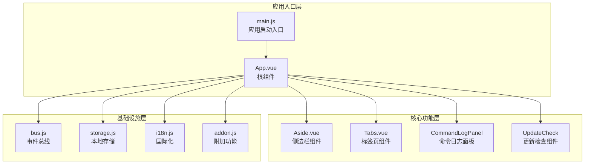
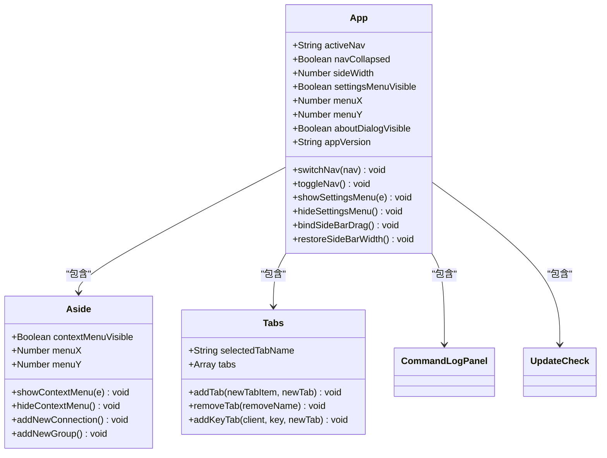
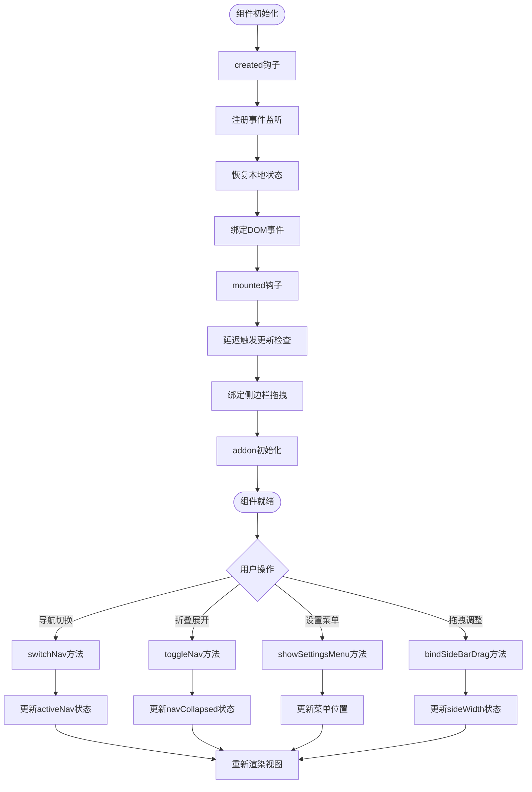
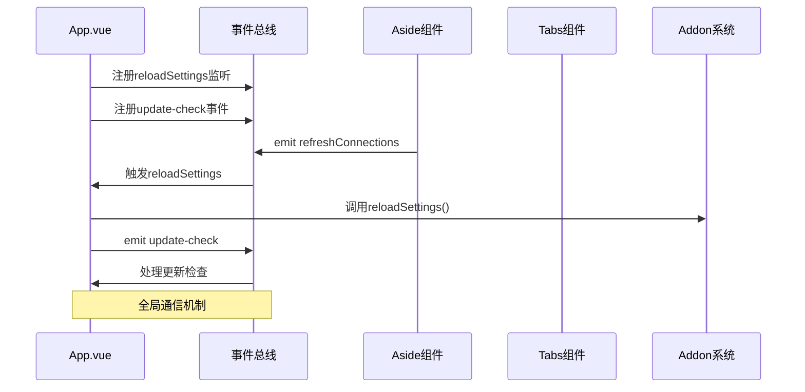
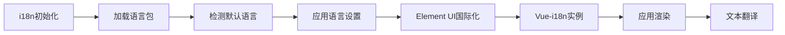
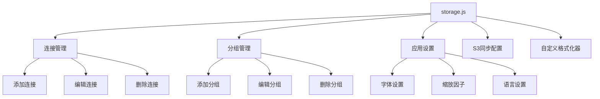
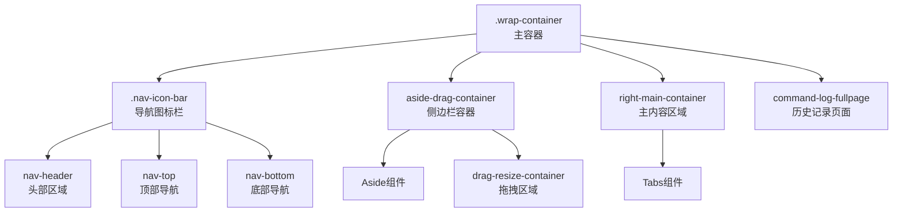
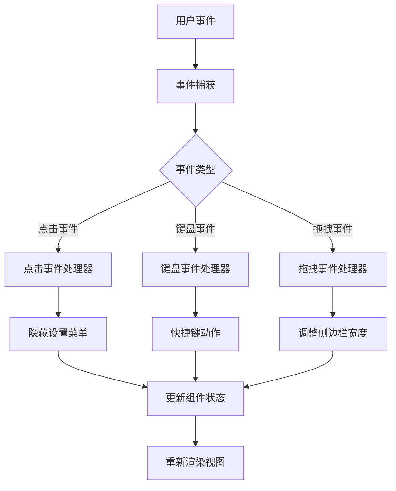
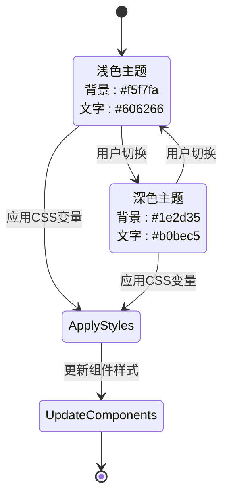

# App根组件详细文档

<cite>
**本文档中引用的文件**
- [App.vue](file://src/App.vue)
- [main.js](file://src/main.js)
- [Aside.vue](file://src/Aside.vue)
- [Tabs.vue](file://src/components/Tabs.vue)
- [bus.js](file://src/bus.js)
- [storage.js](file://src/storage.js)
- [i18n.js](file://src/i18n/i18n.js)
- [addon.js](file://src/addon.js)
</cite>

## 目录
1. [简介](#简介)
2. [项目结构概览](#项目结构概览)
3. [核心组件架构](#核心组件架构)
4. [App.vue组件详解](#appvue组件详解)
5. [生命周期钩子分析](#生命周期钩子分析)
6. [事件总线($bus)集成](#事件总线bus集成)
7. [国际化(i18n)初始化](#国际化i18n初始化)
8. [存储系统(storage)集成](#存储系统storage集成)
9. [组件模板结构分析](#组件模板结构分析)
10. [全局事件响应机制](#全局事件响应机制)
11. [主题切换与窗口适配](#主题切换与窗口适配)
12. [性能优化考虑](#性能优化考虑)
13. [总结](#总结)

## 简介

App.vue是Another Redis Desktop Manager应用的根组件，作为整个应用的入口点和容器，负责协调各个子组件的交互、管理全局状态、处理用户界面布局以及维护应用的整体行为。该组件采用了Vue的组件组合模式，集成了侧边栏(Aside)、标签页(Tabs)等核心功能模块，并提供了丰富的用户交互体验。

## 项目结构概览

**图表来源**
- [main.js](file://src/main.js#L1-L47)
- [App.vue](file://src/App.vue#L1-L606)

## 核心组件架构

App.vue采用模块化架构设计，通过Vue的组件系统实现了清晰的功能分离：

**图表来源**
- [App.vue](file://src/App.vue#L122-L235)
- [Aside.vue](file://src/Aside.vue#L49-L122)
- [Tabs.vue](file://src/components/Tabs.vue#L41-L383)

## App.vue组件详解

### 组件定义与数据结构

App.vue作为应用的核心容器，定义了以下关键数据属性：

| 数据属性 | 类型 | 默认值 | 描述 |
|---------|------|--------|------|
| sideWidth | Number | 265 | 侧边栏宽度，支持拖拽调整 |
| activeNav | String | 'server' | 当前激活的导航状态('server'/'history') |
| navCollapsed | Boolean | false | 导航栏是否折叠 |
| settingsMenuVisible | Boolean | false | 设置菜单是否可见 |
| menuX/menuY | Number | 0 | 设置菜单定位坐标 |
| aboutDialogVisible | Boolean | false | 关于对话框是否显示 |
| appVersion | String | 动态获取 | 应用版本号 |

### 组件方法分析

App.vue提供了丰富的交互方法，涵盖了导航切换、设置管理、拖拽操作等功能：

**图表来源**
- [App.vue](file://src/App.vue#L135-L235)

**章节来源**
- [App.vue](file://src/App.vue#L122-L235)

## 生命周期钩子分析

App.vue充分利用了Vue的生命周期钩子来实现正确的初始化和清理：

### created钩子阶段

在组件创建阶段，App.vue执行以下关键操作：

1. **事件总线监听注册**：监听`reloadSettings`事件以响应设置重载
2. **状态恢复**：从localStorage恢复侧边栏宽度和导航折叠状态
3. **DOM事件绑定**：为点击事件绑定隐藏设置菜单的处理器

### mounted钩子阶段

挂载完成后，组件执行以下初始化步骤：

1. **延迟更新检查**：2秒后触发更新检查事件
2. **拖拽功能绑定**：初始化侧边栏宽度拖拽功能
3. **addon系统初始化**：调用addon.setup()进行附加功能配置

### beforeDestroy钩子

在组件销毁前，确保清理所有绑定的事件监听器，避免内存泄漏。

**章节来源**
- [App.vue](file://src/App.vue#L135-L235)

## 事件总线($bus)集成

App.vue通过全局事件总线实现了组件间的解耦通信：

### 事件总线架构

**图表来源**
- [bus.js](file://src/bus.js#L1-L18)
- [App.vue](file://src/App.vue#L135-L145)

### 主要事件交互

| 事件名称 | 发送方 | 接收方 | 功能描述 |
|---------|--------|--------|----------|
| reloadSettings | 任意组件 | App.vue | 重新加载应用设置 |
| update-check | App.vue | 各组件 | 检查应用更新 |
| closeConnection | 异常处理 | App.vue | 关闭所有连接 |
| refreshConnections | Aside组件 | App.vue | 刷新连接列表 |

**章节来源**
- [bus.js](file://src/bus.js#L1-L18)
- [App.vue](file://src/App.vue#L135-L145)

## 国际化(i18n)初始化

App.vue通过Vue-i18n插件实现了多语言支持：

### 国际化配置流程

**图表来源**
- [i18n.js](file://src/i18n/i18n.js#L1-L98)

### 支持的语言类型

App.vue支持12种语言，包括：
- 英语(en)、简体中文(cn)、繁体中文(tw)
- 德语(de)、法语(fr)、意大利语(it)
- 西班牙语(es)、俄语(ru)、乌克兰语(ua)
- 韩语(ko)、越南语(vi)、土耳其语(tr)

**章节来源**
- [i18n.js](file://src/i18n/i18n.js#L1-L98)

## 存储系统(storage)集成

App.vue与本地存储系统深度集成，管理应用的各种配置和状态：

### 存储功能分类

**图表来源**
- [storage.js](file://src/storage.js#L1-L329)

### 关键存储操作

| 功能类别 | 主要方法 | 描述 |
|---------|----------|------|
| 连接管理 | addConnection(), deleteConnection() | 添加和删除Redis连接 |
| 分组管理 | addGroup(), deleteGroup() | 创建和删除连接分组 |
| 设置管理 | getSetting(), saveSettings() | 获取和保存应用设置 |
| 字体管理 | getFontFamily() | 获取自定义字体设置 |

**章节来源**
- [storage.js](file://src/storage.js#L1-L329)

## 组件模板结构分析

App.vue的模板采用了灵活的布局设计，支持多种导航模式和内容展示：

### 布局层次结构

**图表来源**
- [App.vue](file://src/App.vue#L1-L110)

### 插槽使用策略

App.vue通过条件渲染实现了动态内容切换：

| 条件表达式 | 显示内容 | 功能描述 |
|-----------|----------|----------|
| `activeNav === 'server'` | 侧边栏+标签页 | 连接管理界面 |
| `activeNav === 'history'` | 命令日志面板 | 历史记录查看 |
| `settingsMenuVisible` | 设置菜单 | 应用设置选项 |
| `aboutDialogVisible` | 关于对话框 | 应用信息展示 |

**章节来源**
- [App.vue](file://src/App.vue#L1-L110)

## 全局事件响应机制

App.vue实现了完善的全局事件响应机制，处理各种用户交互和系统事件：

### 事件响应流程

**图表来源**
- [App.vue](file://src/App.vue#L145-L168)

### 主要事件处理

| 事件类型 | 处理方法 | 功能描述 |
|---------|----------|----------|
| 点击事件 | hideSettingsMenu() | 隐藏设置菜单 |
| 键盘事件 | toggleNav() | 切换导航栏折叠状态 |
| 拖拽事件 | bindSideBarDrag() | 调整侧边栏宽度 |
| 窗口事件 | resize事件 | 响应窗口大小变化 |

**章节来源**
- [App.vue](file://src/App.vue#L145-L235)

## 主题切换与窗口适配

App.vue提供了完整的主题切换和窗口适配功能：

### 主题切换机制

**图表来源**
- [App.vue](file://src/App.vue#L334-L336)

### 窗口适配策略

App.vue通过以下方式实现响应式设计：

1. **导航栏折叠**：根据屏幕宽度自动折叠导航图标
2. **侧边栏宽度**：支持拖拽调整，最大1500px，最小200px
3. **内容区域自适应**：根据导航状态动态调整布局

**章节来源**
- [App.vue](file://src/App.vue#L314-L605)

## 性能优化考虑

App.vue在设计时充分考虑了性能优化：

### 优化策略

1. **懒加载机制**：仅在需要时渲染特定内容区域
2. **事件委托**：使用单一事件监听器处理多个子元素
3. **状态缓存**：利用localStorage缓存用户偏好设置
4. **防抖处理**：对频繁触发的事件进行节流处理

### 内存管理

- 在beforeDestroy钩子中清理所有事件监听器
- 使用WeakMap避免循环引用导致的内存泄漏
- 及时释放大型对象的引用

## 总结

App.vue作为Another Redis Desktop Manager的核心组件，展现了现代Vue应用开发的最佳实践：

### 核心优势

1. **模块化架构**：清晰的组件分离和职责划分
2. **事件驱动设计**：通过事件总线实现松耦合通信
3. **状态管理**：合理使用Vue响应式系统和本地存储
4. **用户体验**：丰富的交互功能和良好的响应性
5. **国际化支持**：完整的多语言解决方案
6. **可扩展性**：良好的代码组织便于功能扩展

### 技术亮点

- 采用Vue 2.x的Composition API风格
- 实现了完整的桌面应用功能
- 提供了优秀的开发者体验
- 具备良好的错误处理和异常恢复机制

App.vue不仅是一个技术实现，更是Vue生态系统中优秀实践的体现，为构建复杂的桌面应用程序提供了宝贵的参考价值。