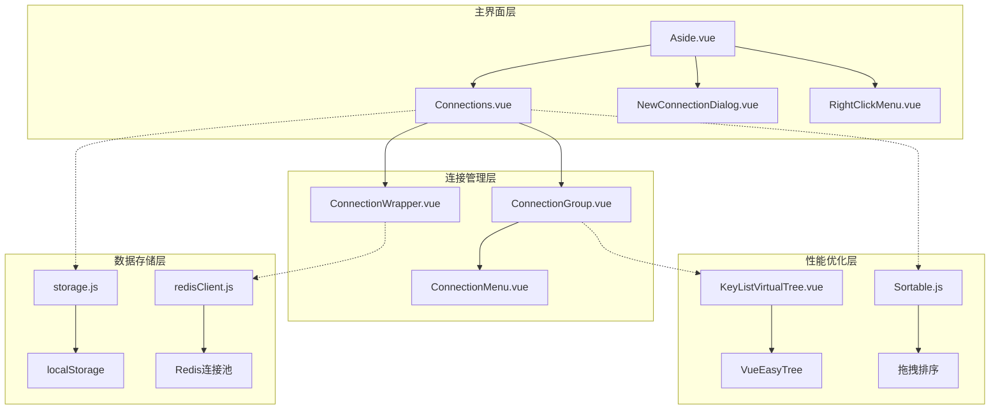
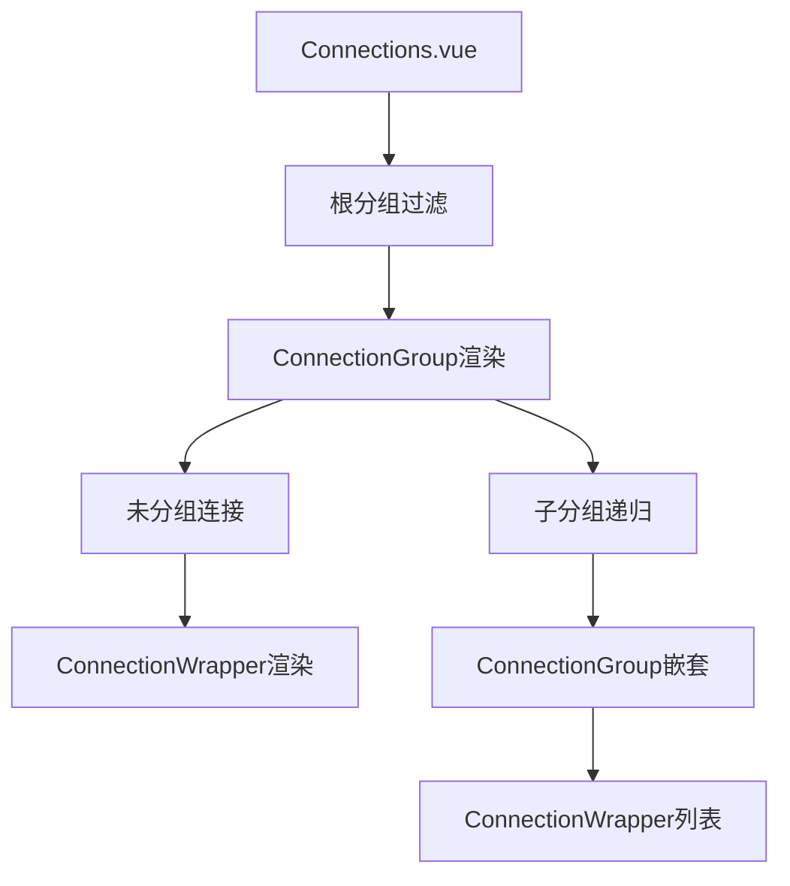
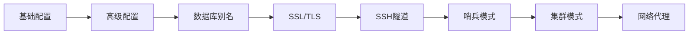
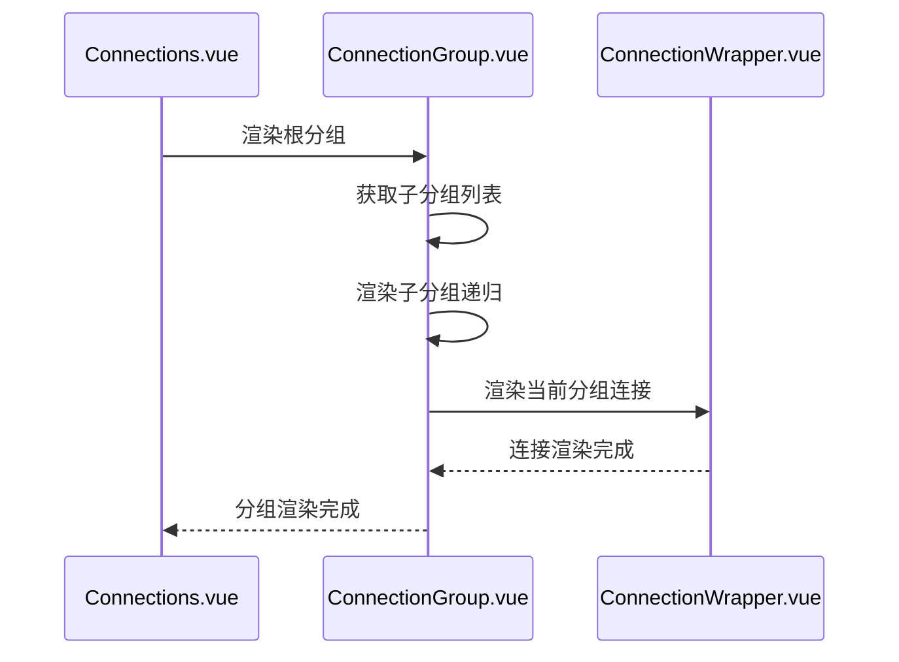
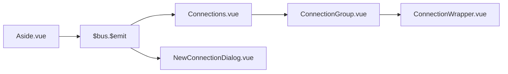
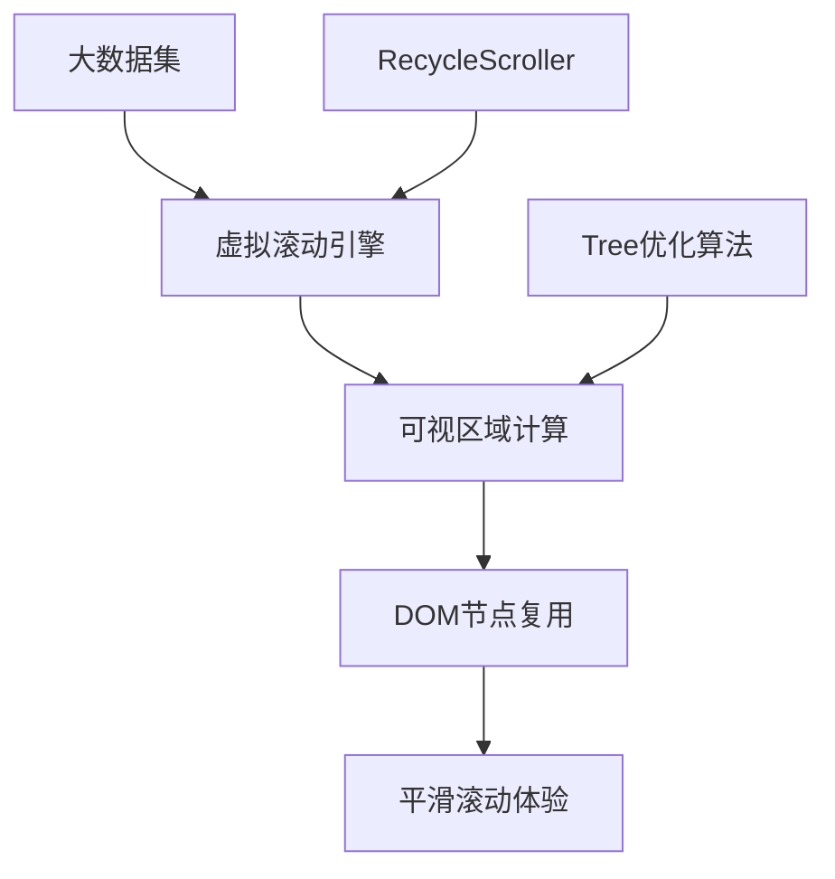
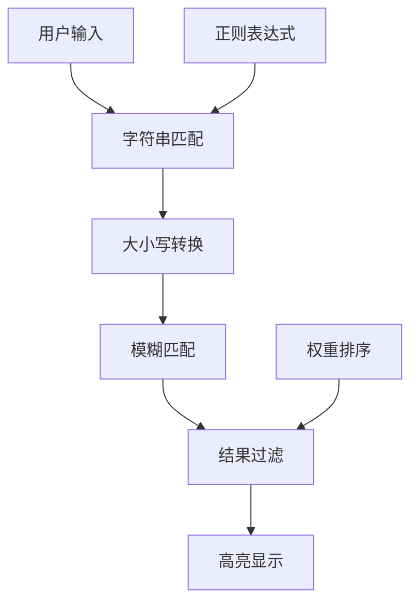
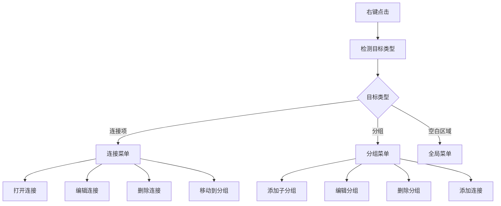

# 侧边栏组件设计与实现深度分析

<cite>
**本文档引用的文件**
- [Aside.vue](file://src/Aside.vue)
- [Connections.vue](file://src/components/Connections.vue)
- [NewConnectionDialog.vue](file://src/components/NewConnectionDialog.vue)
- [ConnectionGroup.vue](file://src/components/ConnectionGroup.vue)
- [ConnectionWrapper.vue](file://src/components/ConnectionWrapper.vue)
- [ConnectionMenu.vue](file://src/components/ConnectionMenu.vue)
- [KeyListVirtualTree.vue](file://src/components/KeyListVirtualTree.vue)
- [storage.js](file://src/storage.js)
- [redisClient.js](file://src/redisClient.js)
</cite>

## 目录
1. [项目概述](#项目概述)
2. [核心架构设计](#核心架构设计)
3. [Aside.vue主组件分析](#asidevue主组件分析)
4. [Connections.vue连接管理器](#connectionsvue连接管理器)
5. [NewConnectionDialog.vue连接配置](#newconnectiondialogvue连接配置)
6. [递归渲染机制](#递归渲染机制)
7. [数据流与通信机制](#数据流与通信机制)
8. [虚拟滚动与性能优化](#虚拟滚动与性能优化)
9. [搜索过滤功能](#搜索过滤功能)
10. [右键菜单系统](#右键菜单系统)
11. [总结](#总结)

## 项目概述

AnotherRedisDesktopManager的侧边栏组件是一个复杂而精密的连接管理系统，采用Vue.js框架构建，提供了完整的Redis连接管理功能。该系统的核心设计理念是通过树形结构组织连接，支持分组管理、多标签配置、虚拟滚动优化等高级特性。

## 核心架构设计

整个侧边栏系统采用了模块化的架构设计，主要由以下几个层次组成：

**图表来源**
- [Aside.vue](file://src/Aside.vue#L1-L161)
- [Connections.vue](file://src/components/Connections.vue#L1-L326)
- [storage.js](file://src/storage.js#L1-L329)

## Aside.vue主组件分析

Aside.vue作为整个侧边栏系统的入口组件，承担着全局状态管理和事件协调的重要职责。

### 组件结构与功能

Aside组件采用了简洁的模板结构，主要包含以下核心部分：

1. **右键上下文菜单**：提供新建连接和添加分组的快捷操作
2. **连接对话框**：管理新连接的创建和编辑
3. **设置面板**：提供应用级别的配置选项
4. **命令日志**：记录Redis命令执行历史
5. **热键提示**：显示键盘快捷键信息
6. **自定义格式化器**：支持数据格式化扩展

### 状态管理机制

Aside组件通过Vue的响应式系统管理以下状态：

- `contextMenuVisible`: 控制右键菜单的显示状态
- `menuX` 和 `menuY`: 记录右键菜单的位置坐标
- 全局事件总线 `$bus` 的订阅管理

### 生命周期管理

组件实现了完整的生命周期管理，包括：
- **created钩子**：注册全局事件监听器
- **mounted钩子**：初始化键盘快捷键绑定
- **beforeDestroy钩子**：清理事件监听器和定时器

**章节来源**
- [Aside.vue](file://src/Aside.vue#L40-L122)

## Connections.vue连接管理器

Connections.vue是连接管理的核心组件，负责连接列表的渲染、分组管理和用户交互处理。

### 树形结构渲染

Connections组件通过递归渲染的方式构建连接树：

**图表来源**
- [Connections.vue](file://src/components/Connections.vue#L15-L44)

### 搜索过滤机制

组件实现了智能的搜索过滤功能：

- **阈值控制**：当连接数量超过4个时才显示搜索输入框
- **实时过滤**：基于连接名称进行模糊匹配
- **高亮显示**：被过滤掉的连接会被隐藏

### 分组管理功能

Connections组件提供了完整的分组管理能力：

- **添加分组对话框**：支持分组名称、图标和颜色配置
- **分组层级限制**：最多支持3级嵌套结构
- **图标上传处理**：支持图片文件上传和尺寸优化

**章节来源**
- [Connections.vue](file://src/components/Connections.vue#L124-L255)

## NewConnectionDialog.vue连接配置

NewConnectionDialog是一个复杂的多标签配置组件，提供了全面的Redis连接配置选项。

### 多标签页架构

组件采用了经典的标签页布局，每个标签页专注于特定的配置领域：

**图表来源**
- [NewConnectionDialog.vue](file://src/components/NewConnectionDialog.vue#L390-L398)

### 配置项详解

#### 基础配置
- **连接名称**：用户自定义的连接标识
- **连接地址**：支持TCP和Unix Socket两种协议
- **认证信息**：密码和用户名配置
- **连接分组**：可选的分组归属

#### 高级配置
- **默认过滤器**：支持通配符模式的键过滤
- **分隔符设置**：用于键名分层显示
- **超时配置**：连接和执行超时时间
- **视图模式**：树形或平面视图选择
- **扫描计数**：批量操作的默认数量

#### SSL/TLS配置
- **证书文件**：公钥、私钥和CA证书
- **服务器名称**：SNI配置
- **安全选项**：是否验证证书

#### SSH隧道配置
- **隧道参数**：主机、端口、用户名
- **认证方式**：密码或私钥认证
- **密钥保护**：Passphrase支持

**章节来源**
- [NewConnectionDialog.vue](file://src/components/NewConnectionDialog.vue#L19-L771)

## 递归渲染机制

连接管理系统的递归渲染是其核心特性之一，通过ConnectionGroup组件的自嵌套实现了灵活的树形结构。

### 递归渲染流程

**图表来源**
- [ConnectionGroup.vue](file://src/components/ConnectionGroup.vue#L18-L30)

### 深度控制机制

ConnectionGroup组件通过`depth`属性控制渲染深度：

- **深度计算**：从1开始，每递归一层加1
- **样式调整**：根据深度动态调整左侧内边距
- **层级限制**：确保不会出现过深的嵌套结构

### 数据传递机制

递归渲染过程中，数据通过以下方式传递：

- **props传递**：父组件向子组件传递必要的配置数据
- **事件冒泡**：子组件通过事件向上层传播状态变化
- **全局状态**：通过Vuex或事件总线共享全局状态

**章节来源**
- [ConnectionGroup.vue](file://src/components/ConnectionGroup.vue#L156-L207)

## 数据流与通信机制

系统采用了多层次的数据流设计，确保组件间的高效通信。

### 事件总线通信

Aside.vue使用Vue的事件总线机制进行跨组件通信：

**图表来源**
- [Aside.vue](file://src/Aside.vue#L61-L68)

### Props传递机制

组件间通过props进行数据传递：

- **ConnectionGroup**：接收`group`、`connections`、`allConnections`等属性
- **ConnectionWrapper**：接收`config`、`globalSettings`、`index`等属性
- **ConnectionMenu**：接收`config`和`client`属性

### 状态同步策略

系统实现了多种状态同步机制：

1. **本地存储同步**：通过storage.js统一管理持久化数据
2. **实时更新**：通过事件通知机制实现实时状态同步
3. **缓存策略**：合理使用缓存减少重复计算

**章节来源**
- [storage.js](file://src/storage.js#L1-L329)

## 虚拟滚动与性能优化

系统在处理大量连接和键数据时，采用了多种性能优化技术。

### KeyListVirtualTree虚拟树

KeyListVirtualTree组件基于VueEasyTree实现了高性能的虚拟滚动：

**图表来源**
- [KeyListVirtualTree.vue](file://src/components/KeyListVirtualTree.vue#L24-L48)

### 性能优化策略

#### 内存管理
- **节点复用**：只渲染可视区域内的节点
- **懒加载**：按需加载子节点数据
- **内存回收**：及时清理不再使用的节点

#### 渲染优化
- **批量更新**：使用`requestAnimationFrame`进行批量渲染
- **防抖处理**：对频繁的DOM操作进行防抖
- **异步渲染**：将耗时操作移到Web Worker中执行

#### 用户体验优化
- **渐进式加载**：先显示关键信息，再加载详细内容
- **加载指示器**：为长时间操作提供视觉反馈
- **错误恢复**：优雅处理渲染错误

**章节来源**
- [KeyListVirtualTree.vue](file://src/components/KeyListVirtualTree.vue#L80-L200)

## 搜索过滤功能

系统提供了强大的搜索过滤功能，支持多种过滤条件和实时搜索。

### 搜索算法实现

### 过滤条件类型

1. **基础过滤**：基于连接名称的简单匹配
2. **高级过滤**：支持正则表达式和复合条件
3. **分组过滤**：按分组层级进行过滤
4. **状态过滤**：按连接状态（在线/离线）过滤

### 实时搜索机制

- **防抖处理**：防止频繁的搜索请求
- **增量更新**：只更新发生变化的部分
- **搜索历史**：保存用户的搜索习惯

**章节来源**
- [Connections.vue](file://src/components/Connections.vue#L124-L131)

## 右键菜单系统

系统实现了完整的右键菜单功能，提供了丰富的上下文操作选项。

### 菜单层次结构

**图表来源**
- [ConnectionMenu.vue](file://src/components/ConnectionMenu.vue#L28-L84)

### 上下文感知菜单

菜单内容根据不同的上下文动态调整：

- **连接上下文**：显示连接特有的操作选项
- **分组上下文**：提供分组管理功能
- **空闲上下文**：显示全局操作选项

### 菜单定位算法

系统实现了智能的菜单定位算法：

- **边界检测**：自动调整菜单位置避免超出屏幕
- **优先级排序**：根据使用频率调整菜单项顺序
- **键盘导航**：支持键盘快捷键操作

**章节来源**
- [ConnectionMenu.vue](file://src/components/ConnectionMenu.vue#L142-L468)

## 总结

AnotherRedisDesktopManager的侧边栏组件系统展现了现代前端应用的复杂性和精妙设计。通过树形结构的递归渲染、多层数据流管理、虚拟滚动优化等技术，系统成功地处理了大规模连接管理的需求。

### 技术亮点

1. **模块化架构**：清晰的组件分层和职责分离
2. **性能优化**：虚拟滚动和懒加载技术的应用
3. **用户体验**：丰富的交互功能和直观的操作界面
4. **扩展性**：插件化的配置系统和事件机制

### 设计启示

这个项目的成功经验为类似的桌面应用开发提供了宝贵的参考：

- **复杂数据结构的可视化**：树形结构的有效运用
- **大型应用的状态管理**：事件总线和局部状态的平衡
- **性能与体验的权衡**：在功能丰富性和运行效率之间找到最佳平衡点

通过深入分析这些组件的设计和实现，我们可以更好地理解现代前端应用的架构模式和技术选择。