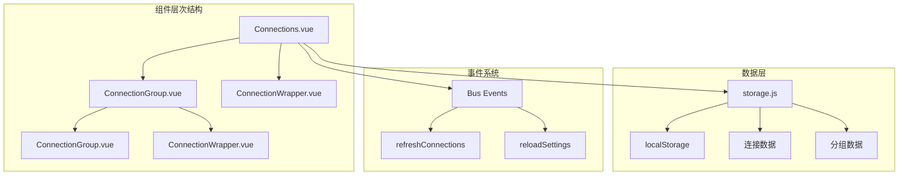
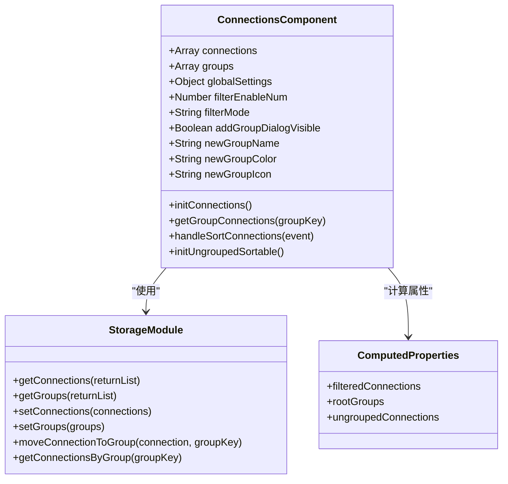
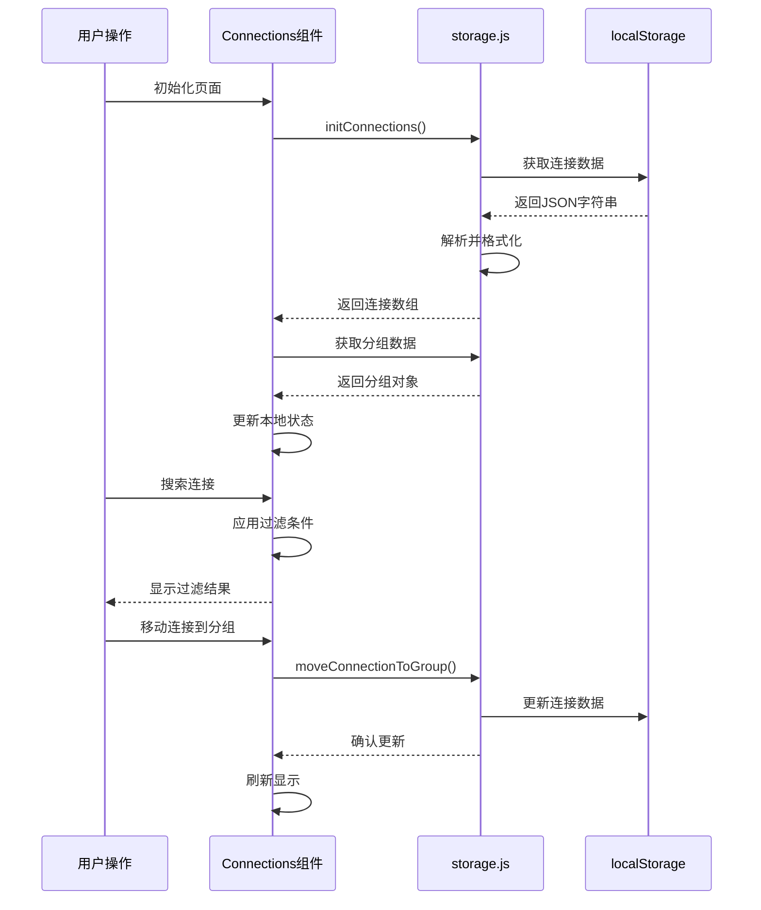
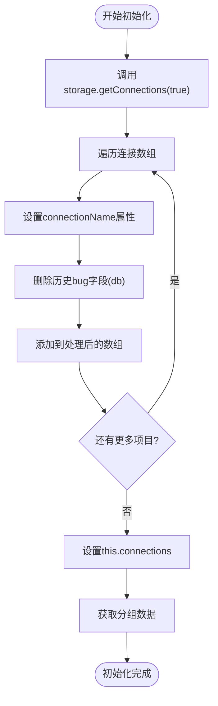
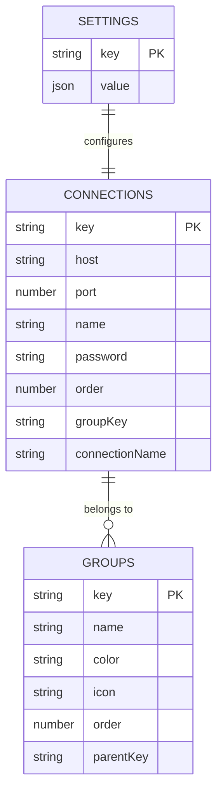
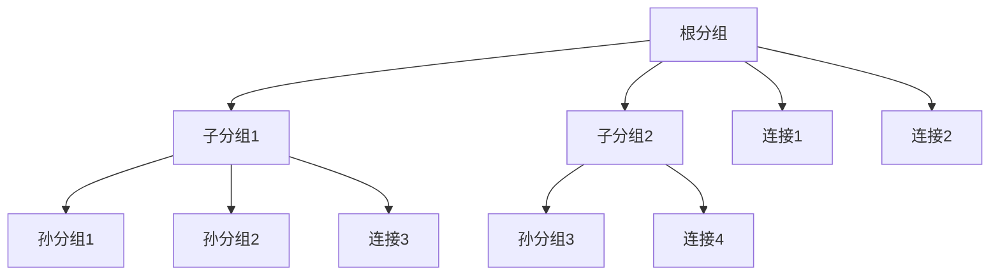
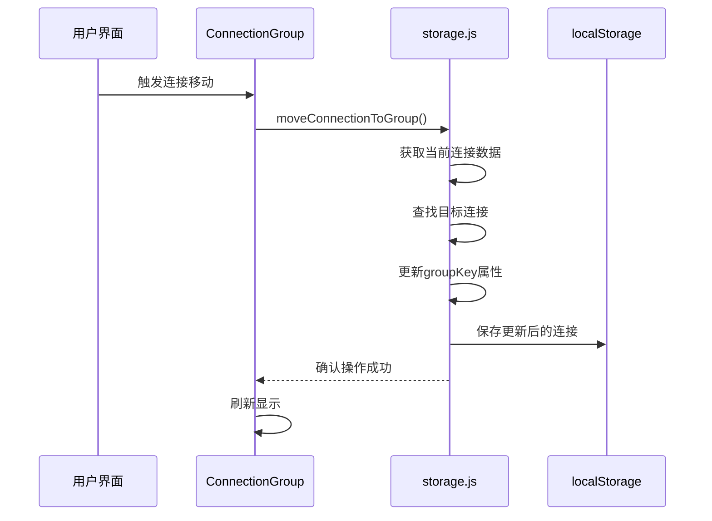
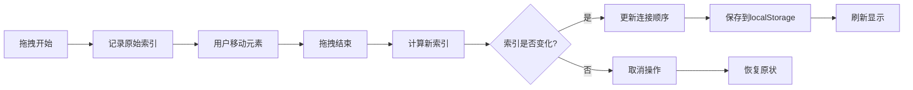

# 连接列表组件深度分析

<cite>
**本文档引用的文件**
- [Connections.vue](file://src/components/Connections.vue)
- [storage.js](file://src/storage.js)
- [ConnectionGroup.vue](file://src/components/ConnectionGroup.vue)
- [ConnectionWrapper.vue](file://src/components/ConnectionWrapper.vue)
</cite>

## 目录
1. [概述](#概述)
2. [项目结构分析](#项目结构分析)
3. [核心组件架构](#核心组件架构)
4. [数据流与状态管理](#数据流与状态管理)
5. [初始化流程详解](#初始化流程详解)
6. [连接数据管理](#连接数据管理)
7. [分组系统实现](#分组系统实现)
8. [用户界面交互](#用户界面交互)
9. [性能优化策略](#性能优化策略)
10. [故障排除指南](#故障排除指南)
11. [总结](#总结)

## 概述

Connections.vue是Another Redis Desktop Manager应用中侧边栏连接列表的核心管理组件，负责展示、管理和组织所有Redis连接。该组件通过与storage.js模块的紧密协作，实现了连接数据的持久化存储、分组管理、搜索过滤和拖拽排序等功能。

### 主要功能特性

- **连接数据管理**：从localStorage读取和写入连接配置
- **分组系统**：支持多层级连接分组，最多3层深度
- **搜索过滤**：实时连接名称搜索功能
- **拖拽排序**：支持连接在组内和组间的重新排序
- **图标上传**：自定义分组图标功能
- **历史数据兼容**：自动修复历史版本遗留的数据问题

## 项目结构分析

**图表来源**
- [Connections.vue](file://src/components/Connections.vue#L1-L326)
- [storage.js](file://src/storage.js#L1-L329)
- [ConnectionGroup.vue](file://src/components/ConnectionGroup.vue#L1-L552)

**章节来源**
- [Connections.vue](file://src/components/Connections.vue#L1-L326)
- [storage.js](file://src/storage.js#L1-L329)

## 核心组件架构

### 组件数据结构

Connections.vue组件维护以下核心数据状态：

**图表来源**
- [Connections.vue](file://src/components/Connections.vue#L101-L112)
- [storage.js](file://src/storage.js#L184-L246)

### 计算属性设计

组件通过三个主要的计算属性实现智能的数据过滤和展示：

1. **filteredConnections**：根据搜索模式过滤连接列表
2. **rootGroups**：筛选顶级分组（无父级分组）
3. **ungroupedConnections**：提取未分组的连接项

**章节来源**
- [Connections.vue](file://src/components/Connections.vue#L123-L140)

## 数据流与状态管理

### 状态流转图

**图表来源**
- [Connections.vue](file://src/components/Connections.vue#L148-L162)
- [storage.js](file://src/storage.js#L108-L114)

### 事件通信机制

组件通过Vue的事件总线系统与其他组件进行通信：

- **refreshConnections**：刷新连接列表
- **reloadSettings**：重新加载全局设置
- **showNewConnectionWithGroup**：显示新建连接对话框

**章节来源**
- [Connections.vue](file://src/components/Connections.vue#L115-L122)

## 初始化流程详解

### initConnections方法实现

initConnections方法是组件的核心初始化函数，负责从storage.js获取连接和分组数据：

**图表来源**
- [Connections.vue](file://src/components/Connections.vue#L148-L162)

### 历史数据兼容性处理

组件特别关注历史数据的兼容性问题，特别是在删除db字段方面：

- **问题背景**：早期版本中连接配置可能包含不必要的db字段
- **解决方案**：在初始化过程中自动检测并删除这些字段
- **实现位置**：第156-157行的delete操作

**章节来源**
- [Connections.vue](file://src/components/Connections.vue#L148-L162)

## 连接数据管理

### 存储架构

storage.js模块提供了完整的连接数据管理功能：

**图表来源**
- [storage.js](file://src/storage.js#L184-L246)
- [storage.js](file://src/storage.js#L7-L17)

### 连接数据序列化

连接数据通过JSON格式在localStorage中存储：

- **存储键名**：`localStorage.connections`
- **数据格式**：JSON字符串化的对象映射
- **序列化过程**：自动转换为字符串存储
- **反序列化过程**：自动解析为JavaScript对象

**章节来源**
- [storage.js](file://src/storage.js#L244-L246)

## 分组系统实现

### 分组层次结构

ConnectionGroup组件支持多层级分组，最多3层深度：

**图表来源**
- [ConnectionGroup.vue](file://src/components/ConnectionGroup.vue#L209-L224)

### 分组检索功能

getConnectionsByGroup方法提供了高效的分组查询：

- **参数**：可选的分组键值
- **返回值**：匹配分组的所有连接
- **实现逻辑**：基于groupKey属性过滤连接数组

**章节来源**
- [storage.js](file://src/storage.js#L116-L118)

### 连接移动机制

moveConnectionToGroup方法实现了连接在不同分组间的移动：

**图表来源**
- [storage.js](file://src/storage.js#L108-L114)

**章节来源**
- [storage.js](file://src/storage.js#L108-L114)

## 用户界面交互

### 搜索过滤功能

组件实现了智能的连接搜索功能：

- **触发条件**：当连接数量≥4时显示搜索输入框
- **过滤逻辑**：基于连接名称的模糊匹配
- **用户体验**：实时搜索，即时结果显示

### 拖拽排序系统

组件集成了Sortable.js库实现拖拽功能：

**图表来源**
- [Connections.vue](file://src/components/Connections.vue#L235-L254)

### 分组图标上传

用户可以为分组上传自定义图标：

- **文件限制**：最大100KB，尺寸不超过180×180像素
- **处理流程**：文件读取→尺寸检查→自动缩放→Base64编码
- **存储格式**：以data URL格式存储

**章节来源**
- [Connections.vue](file://src/components/Connections.vue#L173-L208)

## 性能优化策略

### 虚拟化渲染

对于大量连接的情况，组件采用虚拟化渲染策略：

- **阈值控制**：当连接数量≥4时启用搜索功能
- **按需加载**：只渲染可见区域的连接项
- **懒加载**：分组内容按需展开

### 数据缓存机制

- **本地缓存**：连接和分组数据在内存中缓存
- **批量更新**：避免频繁的DOM操作
- **防抖处理**：搜索输入的防抖机制

### 内存管理

- **事件清理**：组件销毁时移除事件监听器
- **引用管理**：及时释放不需要的引用
- **垃圾回收**：定期清理临时对象

**章节来源**
- [Connections.vue](file://src/components/Connections.vue#L115-L122)

## 故障排除指南

### 常见问题及解决方案

#### 连接无法加载

**症状**：连接列表为空或显示错误
**可能原因**：
- localStorage访问被阻止
- 连接数据格式损坏
- 浏览器兼容性问题

**解决步骤**：
1. 检查浏览器控制台错误信息
2. 验证localStorage可用性
3. 尝试清除浏览器缓存
4. 检查数据格式完整性

#### 分组显示异常

**症状**：分组层次混乱或无法展开
**可能原因**：
- parentKey关联错误
- 分组数据不完整
- 递归深度超限

**解决步骤**：
1. 验证分组数据的parentKey关系
2. 检查分组数量是否超过3层
3. 重置分组顺序

#### 拖拽功能失效

**症状**：连接无法拖拽或排序
**可能原因**：
- Sortable.js初始化失败
- DOM结构变化
- 事件冲突

**解决步骤**：
1. 检查Sortable.js库是否正确加载
2. 验证DOM元素的可拖拽属性
3. 检查事件监听器冲突

**章节来源**
- [Connections.vue](file://src/components/Connections.vue#L235-L254)

## 总结

Connections.vue组件作为Another Redis Desktop Manager的核心连接管理组件，展现了优秀的软件架构设计：

### 设计亮点

1. **模块化架构**：清晰分离表现层、业务逻辑层和数据持久化层
2. **事件驱动**：通过Vue事件总线实现组件间松耦合通信
3. **数据一致性**：确保localStorage与内存状态的同步
4. **用户体验**：提供直观的拖拽排序和搜索功能
5. **扩展性**：支持多层级分组和自定义图标

### 技术特点

- **响应式设计**：基于Vue 2.x的响应式数据绑定
- **性能优化**：虚拟化渲染和智能缓存策略
- **兼容性**：良好的浏览器兼容性和降级处理
- **可维护性**：清晰的代码结构和完善的注释

### 改进建议

1. **TypeScript支持**：考虑迁移到TypeScript以提高类型安全
2. **单元测试**：增加组件的单元测试覆盖率
3. **性能监控**：添加性能指标监控和优化建议
4. **国际化**：完善多语言支持功能

通过深入分析Connections.vue组件的实现机制，我们可以看到一个成熟的企业级应用在前端架构设计上的精妙之处，为类似的大型应用开发提供了宝贵的参考价值。