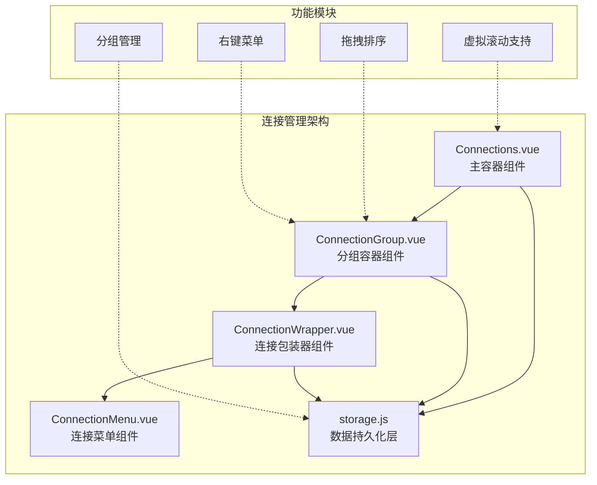
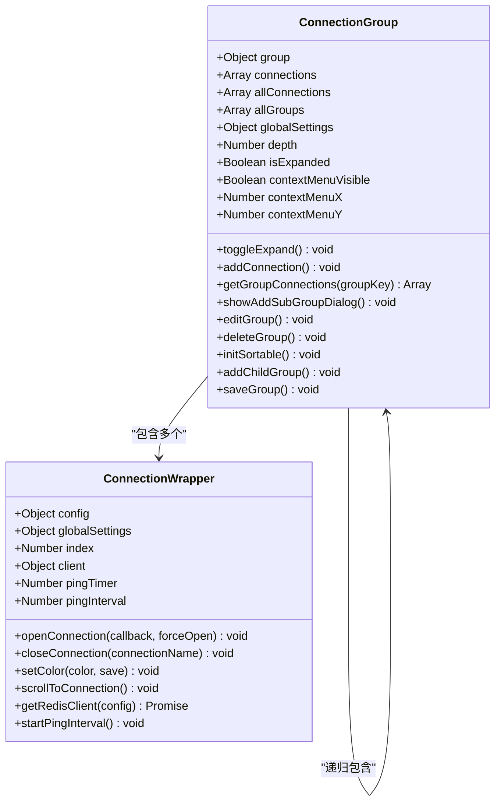
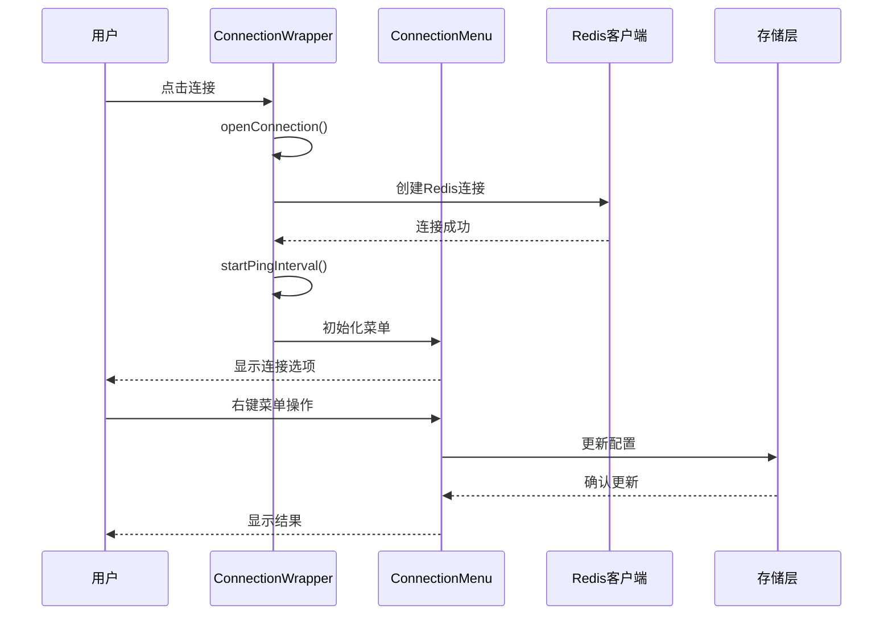
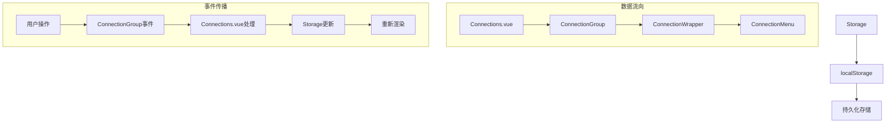
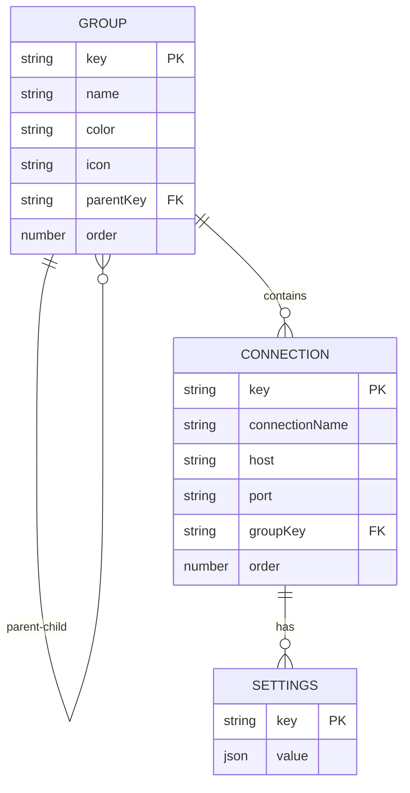

# 连接组组件设计与协作机制详解

<cite>
**本文档引用的文件**
- [ConnectionGroup.vue](file://src/components/ConnectionGroup.vue)
- [ConnectionWrapper.vue](file://src/components/ConnectionWrapper.vue)
- [Connections.vue](file://src/components/Connections.vue)
- [storage.js](file://src/storage.js)
- [ConnectionMenu.vue](file://src/components/ConnectionMenu.vue)
- [KeyListVirtualTree.vue](file://src/components/KeyListVirtualTree.vue)
</cite>

## 目录
1. [引言](#引言)
2. [项目架构概览](#项目架构概览)
3. [ConnectionGroup组件深度分析](#connectiongroup组件深度分析)
4. [ConnectionWrapper组件深度分析](#connectionwrapper组件深度分析)
5. [组件协作机制](#组件协作机制)
6. [分组数据管理](#分组数据管理)
7. [交互功能实现](#交互功能实现)
8. [性能优化策略](#性能优化策略)
9. [总结](#总结)

## 引言

AnotherRedisDesktopManager (ARDM) 的连接组系统是一个复杂而精密的树形结构管理系统，它通过两个核心组件 `ConnectionGroup` 和 `ConnectionWrapper` 实现了层次化的连接组织和管理功能。该系统不仅提供了直观的树形界面，还支持动态分组、拖拽排序、右键菜单等高级功能，同时在虚拟滚动环境下保持优异的性能表现。

## 项目架构概览

系统采用 Vue.js 框架构建，主要由以下核心组件构成：



**图表来源**
- [Connections.vue](file://src/components/Connections.vue#L1-L326)
- [ConnectionGroup.vue](file://src/components/ConnectionGroup.vue#L1-L552)
- [ConnectionWrapper.vue](file://src/components/ConnectionWrapper.vue#L1-L263)

**章节来源**
- [Connections.vue](file://src/components/Connections.vue#L1-L326)
- [storage.js](file://src/storage.js#L1-L339)

## ConnectionGroup组件深度分析

### 组件结构与设计原理

`ConnectionGroup` 是一个递归渲染的组件，负责展示分组层次结构和管理子连接。它采用了经典的树形结构渲染模式，通过递归调用自身实现无限层级的分组嵌套。



**图表来源**
- [ConnectionGroup.vue](file://src/components/ConnectionGroup.vue#L155-L402)
- [ConnectionWrapper.vue](file://src/components/ConnectionWrapper.vue#L43-L241)

### 核心功能实现

#### 1. 递归渲染机制

ConnectionGroup 通过 Vue 的条件渲染和循环渲染实现了智能的递归渲染：

- **分组头部渲染**：显示分组图标、名称和连接计数
- **内容区域控制**：根据 `isExpanded` 状态决定是否渲染子元素
- **子组件调用**：通过 `v-for` 动态渲染子分组和连接项

#### 2. 展开/折叠状态管理

组件维护了一个本地状态 `isExpanded` 来控制分组的可见性：

```javascript
// 展开/折叠切换逻辑
toggleExpand() {
  this.isExpanded = !this.isExpanded;
}
```

#### 3. 分组计数计算

通过递归算法计算当前分组及其所有子分组的连接总数：

```javascript
computed: {
  totalCount() {
    let count = this.connections.length;
    const countRecursive = (parentKey) => {
      const children = this.allGroups.filter(g => g.parentKey === parentKey);
      for (const child of children) {
        count += this.allConnections.filter(c => c.groupKey === child.key).length;
        countRecursive(child.key);
      }
    };
    countRecursive(this.group.key);
    return count;
  }
}
```

**章节来源**
- [ConnectionGroup.vue](file://src/components/ConnectionGroup.vue#L226-L230)
- [ConnectionGroup.vue](file://src/components/ConnectionGroup.vue#L208-L225)

## ConnectionWrapper组件深度分析

### 组件职责与架构

`ConnectionWrapper` 负责封装单个连接的完整生命周期管理和用户交互逻辑。它是一个相对独立的功能单元，包含了连接建立、状态监控、错误处理等核心功能。



**图表来源**
- [ConnectionWrapper.vue](file://src/components/ConnectionWrapper.vue#L84-L128)
- [ConnectionMenu.vue](file://src/components/ConnectionMenu.vue#L259-L280)

### 核心功能模块

#### 1. 连接生命周期管理

ConnectionWrapper 实现了完整的连接生命周期管理：

- **连接建立**：通过 `getRedisClient` 方法创建 Redis 客户端实例
- **状态监控**：使用定时器进行心跳检测 (`pingInterval`)
- **错误处理**：统一的错误捕获和用户提示机制
- **资源清理**：组件销毁时自动关闭连接

#### 2. 颜色主题系统

组件支持自定义连接颜色，并将其持久化存储：

```javascript
setColor(color, save = true) {
  const ulDom = this.$refs.connectionMenu.$el;
  const className = 'menu-with-custom-color';
  
  // 保存到设置
  save && this.$storage.editConnectionItem(this.config, { color });
  
  if (!color) {
    ulDom.classList.remove(className);
  } else {
    ulDom.classList.add(className);
    this.$el.style.setProperty('--menu-color', color);
  }
}
```

#### 3. 滚动定位功能

当用户点击连接时，系统会自动滚动到该连接的位置：

```javascript
scrollToConnection() {
  this.$nextTick(() => {
    setTimeout(() => {
      let scrollTop = 0;
      const menus = document.querySelectorAll('.connections-wrap .connections-list>ul');
      
      // 计算上方所有菜单的高度总和
      for (const menu of menus) {
        if (menu.id === this.connectionAnchor) break;
        scrollTop += (menu.clientHeight + 8);
      }
      
      // 执行平滑滚动
      document.querySelector('.connections-wrap').scrollTo({
        top: scrollTop + offset,
        behavior: 'smooth',
      });
    }, 320);
  });
}
```

**章节来源**
- [ConnectionWrapper.vue](file://src/components/ConnectionWrapper.vue#L195-L233)
- [ConnectionWrapper.vue](file://src/components/ConnectionWrapper.vue#L209-L233)

## 组件协作机制

### 数据流与事件传播

系统采用自上而下的数据流和自下而上的事件传播相结合的方式：



**图表来源**
- [Connections.vue](file://src/components/Connections.vue#L16-L28)
- [ConnectionGroup.vue](file://src/components/ConnectionGroup.vue#L27-L29)

### 事件机制设计

#### 1. 自定义事件系统

组件间通过 Vue 的 `$emit` 和 `$bus.$on` 实现松耦合通信：

```javascript
// ConnectionGroup 发出事件
@refresh="$emit('refresh')"
@sortConnections="$emit('sortConnections', $event)"

// Connections 监听事件
created() {
  this.$bus.$on('refreshConnections', this.handleRefreshConnections);
}
```

#### 2. 事件处理流程

每个操作都遵循标准的事件处理流程：
1. 用户触发操作
2. 组件处理业务逻辑
3. 触发自定义事件
4. 上级组件响应并更新状态
5. 触发重新渲染

**章节来源**
- [ConnectionGroup.vue](file://src/components/ConnectionGroup.vue#L27-L29)
- [Connections.vue](file://src/components/Connections.vue#L115-L122)

## 分组数据管理

### 存储架构设计

系统通过 `storage.js` 提供了完整的分组数据管理功能，采用 localStorage 进行数据持久化。



**图表来源**
- [storage.js](file://src/storage.js#L40-L89)

### 核心存储方法

#### 1. 分组 CRUD 操作

```javascript
// 添加分组
addGroup(group) {
  const groups = this.getGroups();
  const key = `group_${new Date().getTime()}_${randomString(5)}`;
  
  // 计算排序序号
  const maxOrder = Math.max(0, ...Object.values(groups).map(item => (!isNaN(item.order) ? item.order : 0)));
  group.order = maxOrder + 1;
  group.key = key;
  
  groups[key] = group;
  this.setGroups(groups);
  return group;
}

// 删除分组（递归）
deleteGroup(groupKey) {
  const groups = this.getGroups();
  
  // 递归删除子分组
  const deleteRecursive = (key) => {
    for (const k in groups) {
      if (groups[k].parentKey === key) {
        deleteRecursive(k);
      }
    }
    delete groups[key];
  };
  
  deleteRecursive(groupKey);
  this.setGroups(groups);
}
```

#### 2. 连接管理

```javascript
// 获取指定分组的连接
getConnectionsByGroup(groupKey = '') {
  const connections = this.getConnections(true);
  return connections.filter(conn => (conn.groupKey || '') === groupKey);
}

// 移动连接到分组
moveConnectionToGroup(connection, groupKey) {
  const connections = this.getConnections();
  const key = this.getConnectionKey(connection);
  if (connections[key]) {
    connections[key].groupKey = groupKey || '';
    this.setConnections(connections);
  }
}
```

**章节来源**
- [storage.js](file://src/storage.js#L43-L55)
- [storage.js](file://src/storage.js#L108-L114)
- [storage.js](file://src/storage.js#L116-L118)

## 交互功能实现

### 右键菜单系统

#### 1. 菜单触发机制

ConnectionGroup 实现了完整的右键菜单功能：

```javascript
// 显示上下文菜单
showContextMenu(e) {
  this.contextMenuX = e.clientX;
  this.contextMenuY = e.clientY;
  this.contextMenuVisible = true;
}

// 隐藏上下文菜单
hideContextMenu() {
  this.contextMenuVisible = false;
}
```

#### 2. 菜单项功能

右键菜单提供了丰富的操作选项：

- **新建连接**：添加新的 Redis 连接
- **添加子分组**：创建嵌套的分组结构
- **编辑分组**：修改分组属性（名称、颜色、图标）
- **删除分组**：移除分组及其所有内容

### 拖拽排序支持

#### 1. SortableJS 集成

ConnectionGroup 集成了 SortableJS 库实现拖拽功能：

```javascript
initSortable() {
  this.$nextTick(() => {
    const dragWrapper = this.$refs['groupConnections_' + this.group.key];
    if (dragWrapper) {
      Sortable.create(dragWrapper, {
        handle: '.el-submenu__title',
        animation: 400,
        direction: 'vertical',
        group: 'connections',
        onEnd: (e) => {
          this.$emit('sortConnections', {
            groupKey: this.group.key,
            oldIndex: e.oldIndex,
            newIndex: e.newIndex,
            from: e.from,
            to: e.to,
          });
        },
      });
    }
  });
}
```

#### 2. 排序事件处理

拖拽完成后，系统会触发排序事件并更新存储：

```javascript
handleSortConnections({ groupKey, oldIndex, newIndex }) {
  const groupConnections = this.connections.filter(c => c.groupKey === groupKey);
  if (oldIndex !== newIndex && groupConnections.length > 0) {
    this.$storage.reOrderAndStore(this.connections);
  }
}
```

**章节来源**
- [ConnectionGroup.vue](file://src/components/ConnectionGroup.vue#L297-L304)
- [ConnectionGroup.vue](file://src/components/ConnectionGroup.vue#L379-L400)
- [Connections.vue](file://src/components/Connections.vue#L228-L234)

## 性能优化策略

### 虚拟滚动支持

虽然当前代码中没有直接使用虚拟滚动库，但系统已经为虚拟滚动做好了准备：

#### 1. DOM 元素管理

ConnectionWrapper 实现了精确的 DOM 操作：

```javascript
scrollToConnection() {
  this.$nextTick(() => {
    setTimeout(() => {
      // 计算精确位置
      let scrollTop = 0;
      const menus = document.querySelectorAll('.connections-wrap .connections-list>ul');
      
      // 遍历计算高度
      for (const menu of menus) {
        if (menu.id === this.connectionAnchor) break;
        scrollTop += (menu.clientHeight + 8);
      }
      
      // 平滑滚动
      document.querySelector('.connections-wrap').scrollTo({
        top: scrollTop + offset,
        behavior: 'smooth',
      });
    }, 320);
  });
}
```

#### 2. 渲染优化

- **懒加载**：只有展开的分组才会渲染其子元素
- **条件渲染**：使用 `v-show` 控制内容显示
- **事件委托**：减少事件监听器数量

### 内存管理

#### 1. 连接池管理

ConnectionWrapper 实现了智能的连接管理：

```javascript
// 连接关闭时的资源清理
closeConnection(connectionName) {
  if (connectionName && (connectionName != this.config.connectionName)) {
    return;
  }
  
  // 清理定时器
  clearInterval(this.pingTimer);
  
  // 重置组件状态
  this.$refs.operateItem && this.$refs.operateItem.resetStatus();
  this.$refs.keyList && this.$refs.keyList.resetKeyList(true);
  
  // 关闭连接
  this.client && this.client.quit && this.client.quit();
  this.client = null;
}
```

#### 2. 事件监听器管理

组件在生命周期钩子中正确管理事件监听器：

```javascript
mounted() {
  document.addEventListener('click', this.hideContextMenu);
  this.initSortable();
},
beforeDestroy() {
  document.removeEventListener('click', this.hideContextMenu);
}
```

**章节来源**
- [ConnectionWrapper.vue](file://src/components/ConnectionWrapper.vue#L129-L149)
- [ConnectionGroup.vue](file://src/components/ConnectionGroup.vue#L201-L207)

## 总结

AnotherRedisDesktopManager 的连接组系统展现了现代前端应用的优秀设计实践：

### 核心优势

1. **模块化架构**：清晰的组件分离和职责划分
2. **递归渲染**：优雅地处理树形结构数据
3. **事件驱动**：松耦合的组件通信机制
4. **数据持久化**：可靠的本地存储解决方案
5. **用户体验**：丰富的交互功能和视觉反馈

### 技术亮点

- **Vue.js 最佳实践**：充分利用 Vue 的响应式特性和生命周期
- **第三方库集成**：SortableJS 提供专业级的拖拽体验
- **性能优化**：通过条件渲染和事件委托提升性能
- **可扩展性**：良好的接口设计支持功能扩展

### 应用价值

该系统不仅为 Redis 连接管理提供了直观的界面，更重要的是展示了如何构建大型前端应用的核心组件。其设计理念和实现方式可以广泛应用于其他需要树形结构管理的场景，具有很高的学习和参考价值。