# CLI终端标签页

<cite>
**本文档中引用的文件**
- [CliTab.vue](file://src/components/CliTab.vue)
- [CliContent.vue](file://src/components/CliContent.vue)
- [commands.js](file://src/commands.js)
- [redisClient.js](file://src/redisClient.js)
- [storage.js](file://src/storage.js)
- [util.js](file://src/util.js)
- [shortcut.js](file://src/shortcut.js)
</cite>

## 目录
1. [简介](#简介)
2. [项目结构](#项目结构)
3. [核心组件](#核心组件)
4. [架构概览](#架构概览)
5. [详细组件分析](#详细组件分析)
6. [依赖关系分析](#依赖关系分析)
7. [性能考虑](#性能考虑)
8. [故障排除指南](#故障排除指南)
9. [结论](#结论)

## 简介

CliTab.vue是Another Redis Desktop Manager中负责Redis命令行交互的核心组件，它提供了完整的CLI界面功能，包括命令输入、自动补全、结果展示、多数据库切换、订阅模式等功能。该组件通过ioredis库的duplicate()方法创建独立客户端实例，实现了高效的命令执行和状态管理。

## 项目结构

CLI系统采用模块化设计，主要包含以下核心文件：

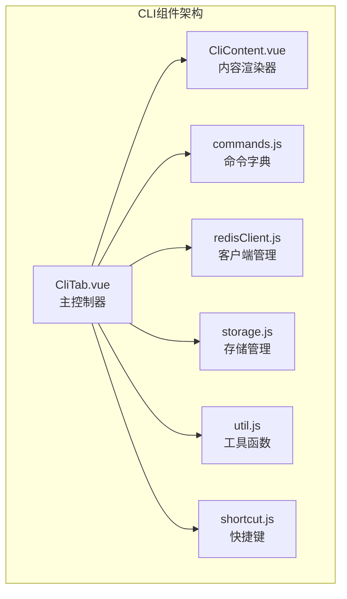

**图表来源**
- [CliTab.vue](file://src/components/CliTab.vue#L1-L50)
- [CliContent.vue](file://src/components/CliContent.vue#L1-L30)
- [commands.js](file://src/commands.js#L1-L50)

## 核心组件

### CliTab.vue - 主控制器

CliTab.vue是CLI功能的核心控制器，负责：
- 命令输入和执行
- 自动补全机制
- 多数据库切换
- 订阅模式管理
- 历史记录存储

### CliContent.vue - 内容渲染器

使用Monaco Editor提供专业的代码编辑体验：
- 语法高亮显示
- 自动换行
- 只读模式
- 滚动同步

**章节来源**
- [CliTab.vue](file://src/components/CliTab.vue#L1-L467)
- [CliContent.vue](file://src/components/CliContent.vue#L1-L166)

## 架构概览

CLI系统采用分层架构设计，确保功能模块的清晰分离和高效协作：

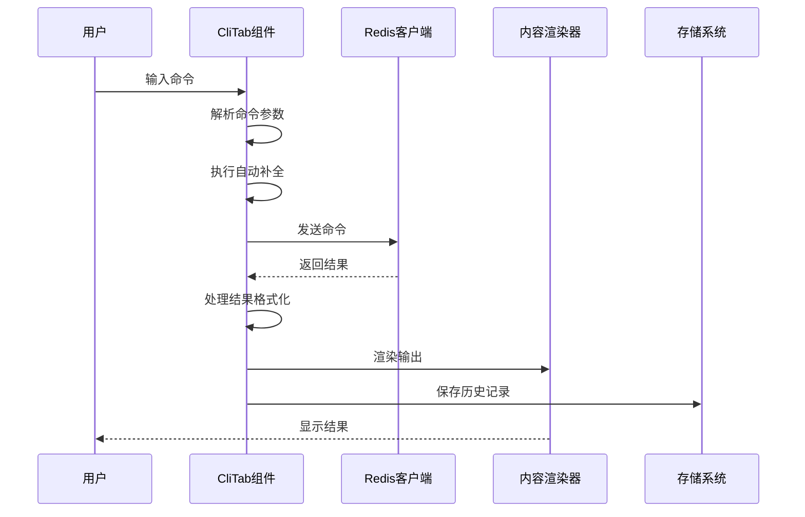

**图表来源**
- [CliTab.vue](file://src/components/CliTab.vue#L190-L285)
- [CliContent.vue](file://src/components/CliContent.vue#L27-L40)

## 详细组件分析

### ioredis客户端实例管理

CliTab组件通过ioredis的duplicate()方法创建独立客户端实例，这是实现多数据库切换和隔离的关键技术：

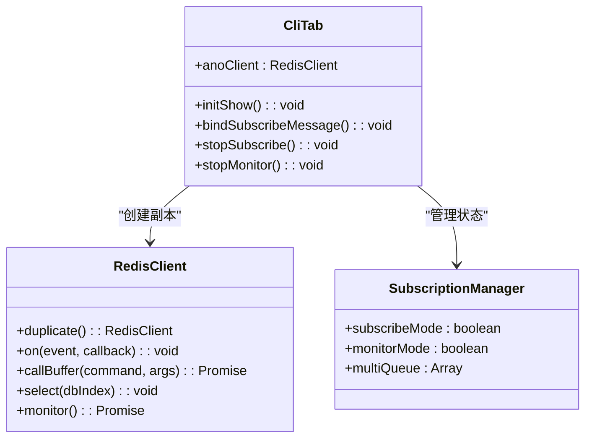

**图表来源**
- [CliTab.vue](file://src/components/CliTab.vue#L96-L105)
- [redisClient.js](file://src/redisClient.js#L52-L87)

#### 客户端实例创建流程

组件在初始化时创建独立客户端实例，确保每个CLI标签页都有独立的连接状态：

**章节来源**
- [CliTab.vue](file://src/components/CliTab.vue#L96-L105)

### 命令自动补全机制

基于commands.js中的命令字典实现智能自动补全：

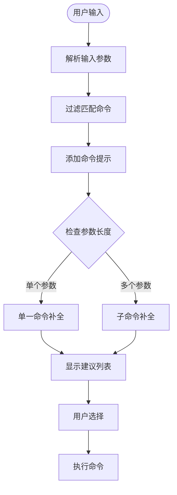

**图表来源**
- [CliTab.vue](file://src/components/CliTab.vue#L119-L162)
- [commands.js](file://src/commands.js#L1-L201)

#### 命令字典结构

commands.js定义了完整的Redis命令字典，包含三类命令：

| 命令类型 | 描述 | 示例 |
|---------|------|------|
| 管理命令 | 系统级操作命令 | ACL, BGREWRITEAOF, CONFIG |
| 读取命令 | 数据查询命令 | GET, HGET, KEYS, SCAN |
| 写入命令 | 数据修改命令 | SET, HSET, DEL, MSET |

**章节来源**
- [commands.js](file://src/commands.js#L1-L201)

### 多行事务处理

支持Redis MULTI/EXEC事务模式，提供完整的事务生命周期管理：

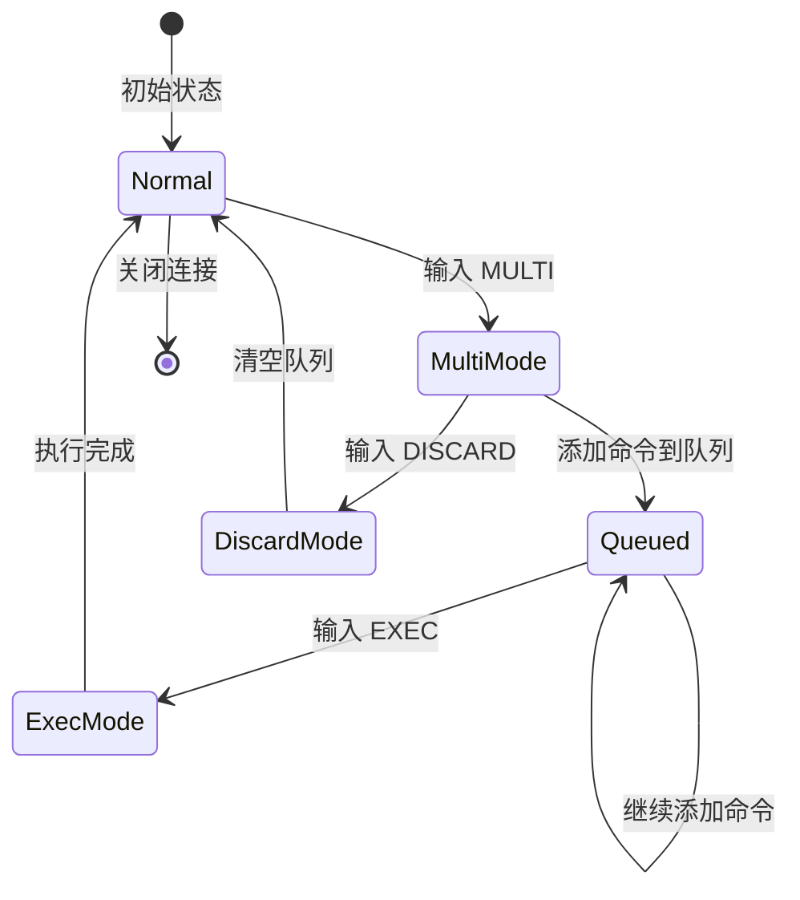

**图表来源**
- [CliTab.vue](file://src/components/CliTab.vue#L212-L246)

#### 事务状态管理

事务模式通过multiQueue数组进行状态管理：

**章节来源**
- [CliTab.vue](file://src/components/CliTab.vue#L212-L246)

### 发布订阅模式

实现Redis发布订阅功能，支持频道订阅和模式匹配：

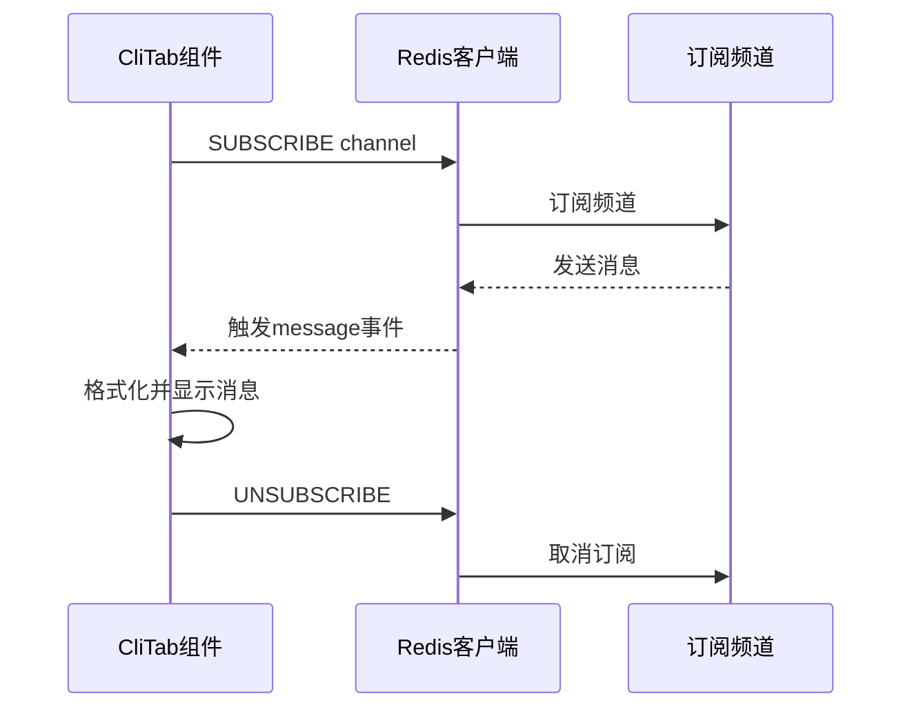

**图表来源**
- [CliTab.vue](file://src/components/CliTab.vue#L163-L184)

#### 订阅状态管理

订阅模式通过subscribeMode标志位进行状态控制：

**章节来源**
- [CliTab.vue](file://src/components/CliTab.vue#L163-L184)

### 监控模式

提供Redis MONITOR命令的实时监控功能：

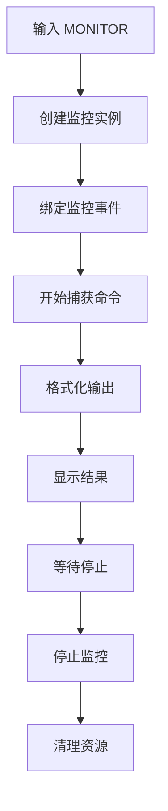

**图表来源**
- [CliTab.vue](file://src/components/CliTab.vue#L259-L271)

**章节来源**
- [CliTab.vue](file://src/components/CliTab.vue#L259-L271)

### 命令历史记录

基于localStorage实现命令历史记录的持久化存储：

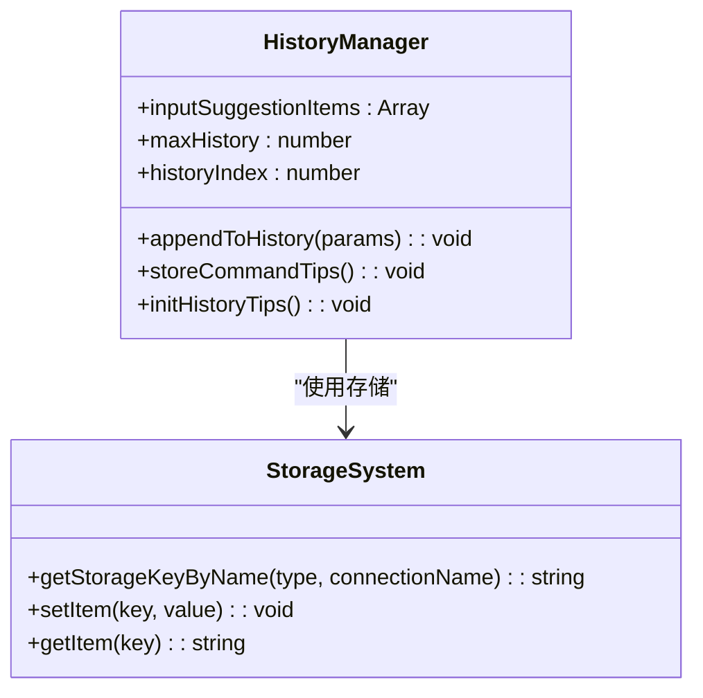

**图表来源**
- [CliTab.vue](file://src/components/CliTab.vue#L317-L425)
- [storage.js](file://src/storage.js#L320-L325)

#### 历史记录存储策略

历史记录采用localStorage进行持久化，支持按连接名称区分存储：

**章节来源**
- [CliTab.vue](file://src/components/CliTab.vue#L412-L425)

### 快捷键绑定

支持Ctrl+L组合键清屏功能：

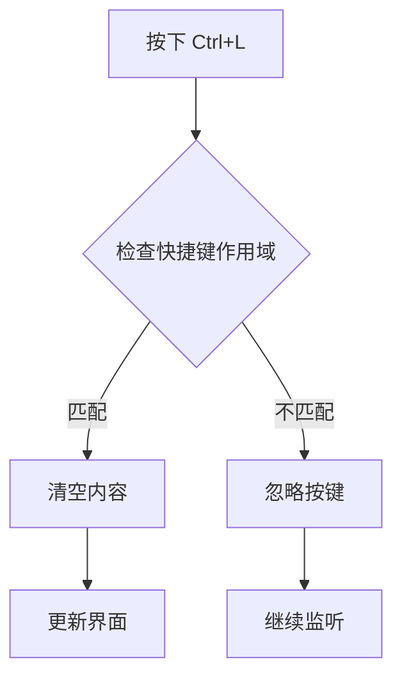

**图表来源**
- [CliTab.vue](file://src/components/CliTab.vue#L408-L410)
- [shortcut.js](file://src/shortcut.js#L1-L32)

**章节来源**
- [CliTab.vue](file://src/components/CliTab.vue#L408-L410)
- [shortcut.js](file://src/shortcut.js#L1-L32)

### 结果渲染系统

CliContent组件负责执行结果的渲染，支持复杂的嵌套结构解析：

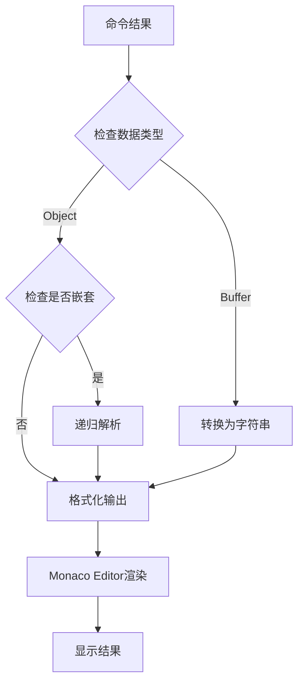

**图表来源**
- [CliTab.vue](file://src/components/CliTab.vue#L330-L361)
- [CliContent.vue](file://src/components/CliContent.vue#L27-L40)

#### 二进制缓冲区处理

util.js提供了完整的二进制数据处理功能：

**章节来源**
- [CliTab.vue](file://src/components/CliTab.vue#L330-L361)
- [util.js](file://src/util.js#L16-L44)

### 异常处理机制

系统实现了多层次的异常处理：

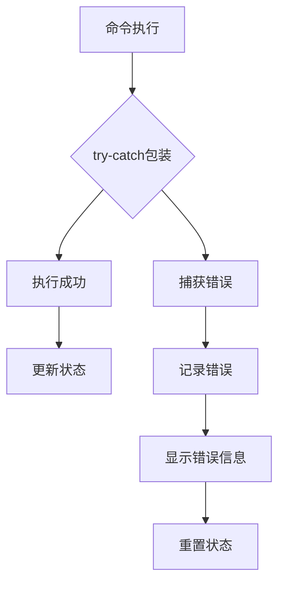

**图表来源**
- [CliTab.vue](file://src/components/CliTab.vue#L276-L284)

**章节来源**
- [CliTab.vue](file://src/components/CliTab.vue#L276-L284)

## 依赖关系分析

CLI系统的依赖关系体现了良好的模块化设计：

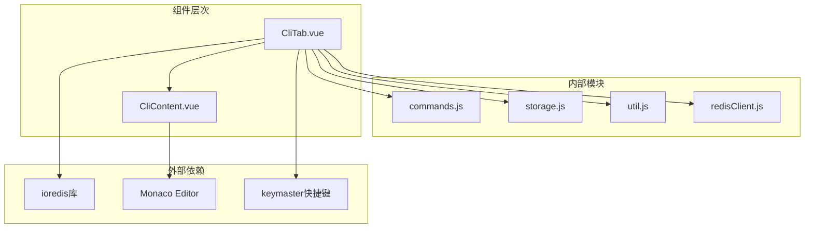

**图表来源**
- [CliTab.vue](file://src/components/CliTab.vue#L32-L36)
- [CliContent.vue](file://src/components/CliContent.vue#L9-L11)

**章节来源**
- [CliTab.vue](file://src/components/CliTab.vue#L32-L36)
- [CliContent.vue](file://src/components/CliContent.vue#L9-L11)

## 性能考虑

### 内存管理优化

1. **历史记录限制**：最大保留2000条命令历史
2. **内容截断**：当内容超过最大历史限制时自动截断
3. **及时清理**：组件销毁时自动清理客户端连接

### 渲染性能优化

1. **虚拟滚动**：Monaco Editor的自动布局优化
2. **延迟加载**：编辑器按需初始化
3. **防抖处理**：输入建议的防抖机制

### 网络通信优化

1. **连接复用**：通过duplicate()创建独立连接
2. **批量操作**：事务模式下的批量命令执行
3. **异步处理**：所有网络操作采用Promise异步处理

## 故障排除指南

### 常见问题及解决方案

#### 连接问题
- **症状**：无法连接到Redis服务器
- **原因**：网络配置或认证信息错误
- **解决**：检查连接配置和网络连通性

#### 命令执行失败
- **症状**：特定命令返回错误
- **原因**：命令参数错误或权限不足
- **解决**：检查命令语法和用户权限

#### 自动补全失效
- **症状**：输入时无命令建议
- **原因**：命令字典加载失败
- **解决**：重启应用或检查网络连接

#### 性能问题
- **症状**：界面响应缓慢
- **原因**：历史记录过多或内容过大
- **解决**：清理历史记录或调整显示设置

**章节来源**
- [CliTab.vue](file://src/components/CliTab.vue#L432-L436)

## 结论

CliTab.vue组件通过精心设计的架构和完善的功能实现，为用户提供了专业级的Redis命令行交互体验。其主要优势包括：

1. **功能完整性**：支持Redis的所有核心功能
2. **用户体验**：提供智能自动补全和友好的界面
3. **性能优化**：采用多种优化策略确保流畅运行
4. **可扩展性**：模块化设计便于功能扩展
5. **稳定性**：完善的异常处理和状态管理

该组件的设计理念体现了现代Web应用开发的最佳实践，为Redis桌面管理器提供了强大的CLI功能基础。