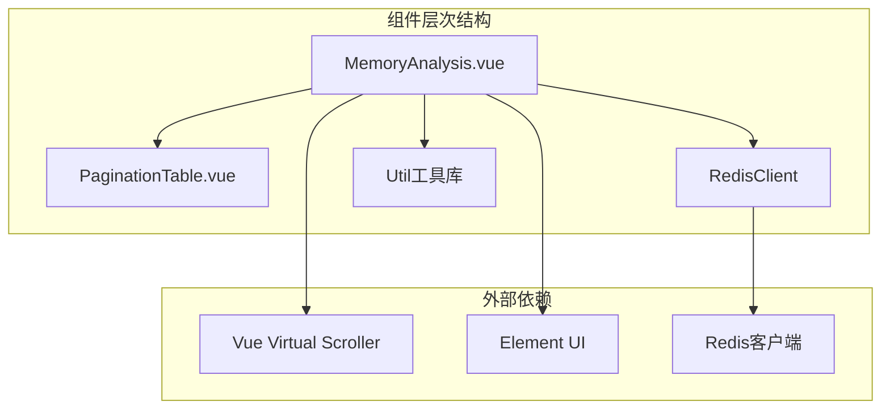
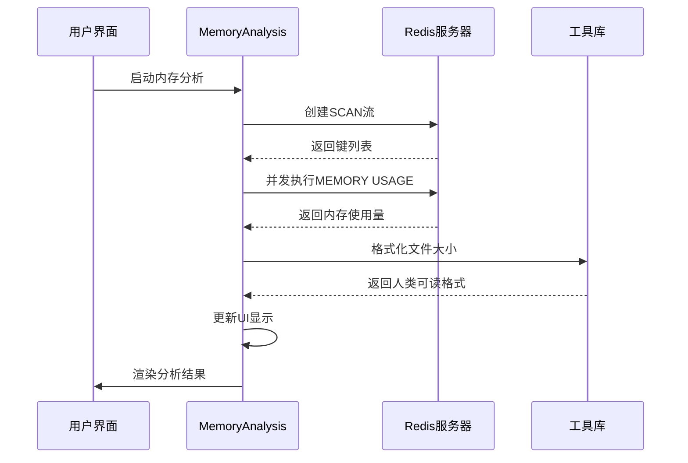
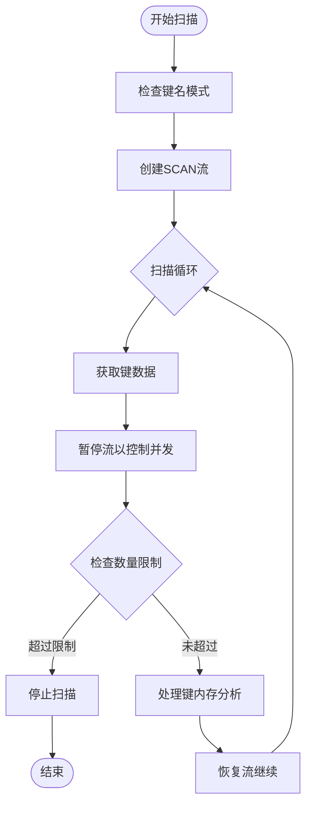
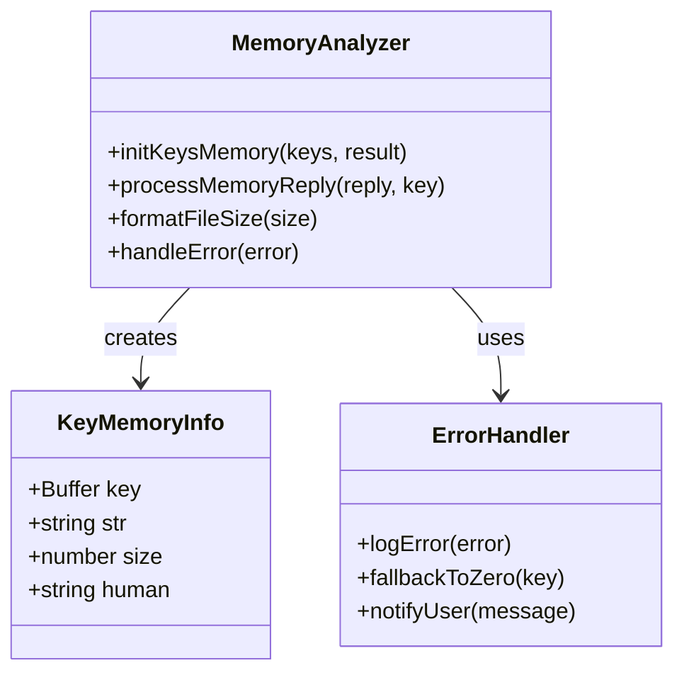
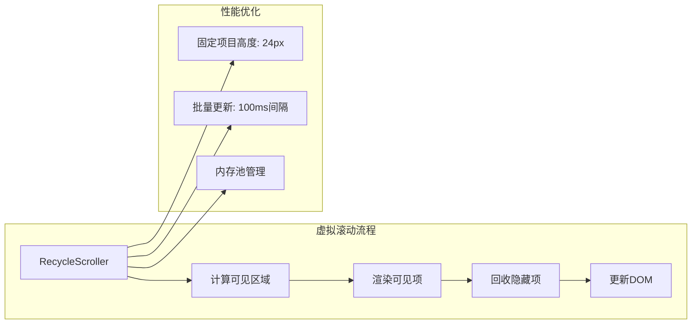
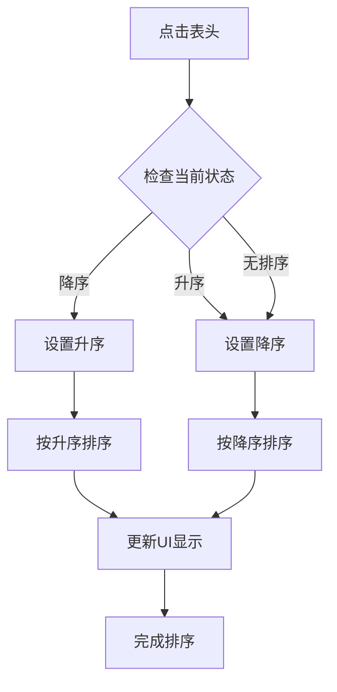
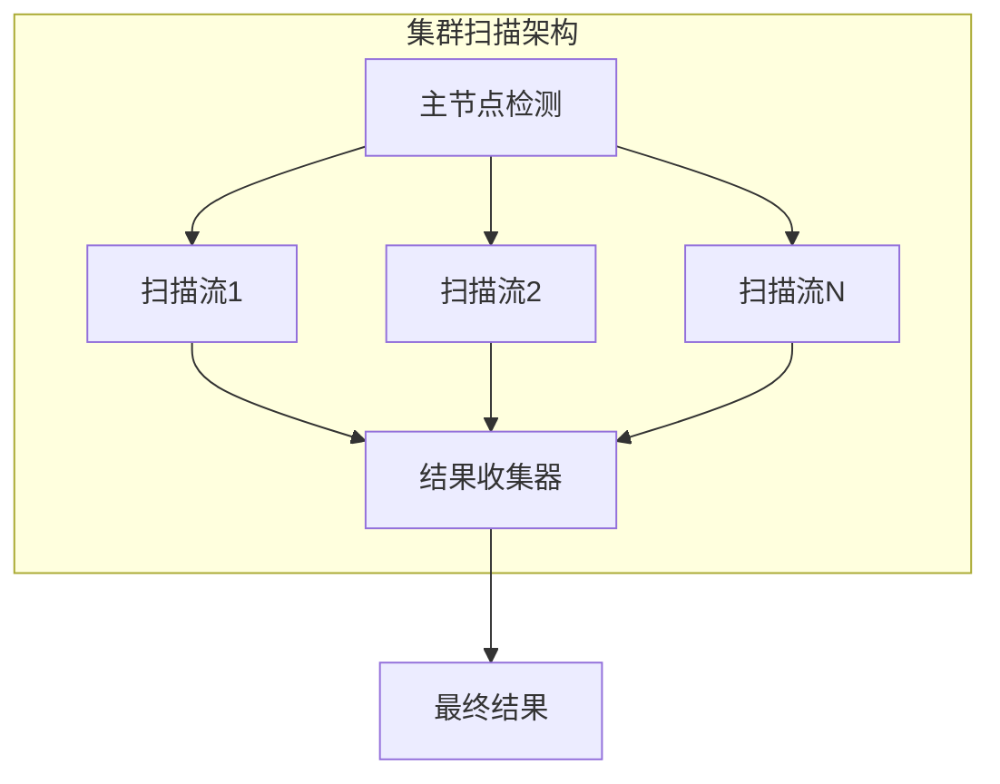
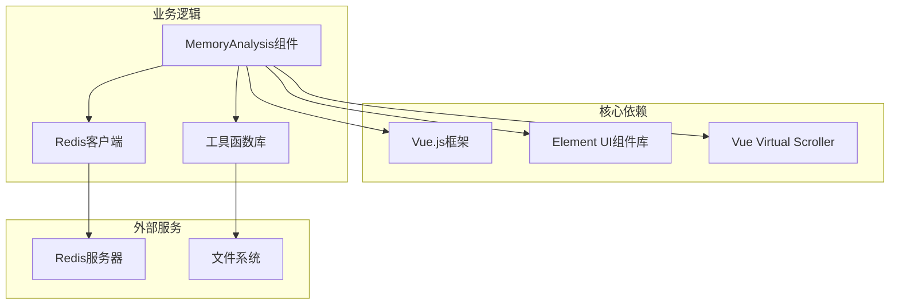
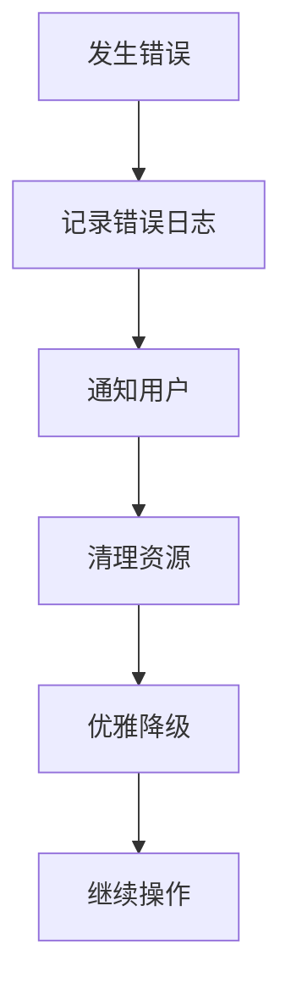

# 内存分析标签页

<cite>
**本文档中引用的文件**
- [MemoryAnalysis.vue](file://src/components/MemoryAnalysis.vue)
- [PaginationTable.vue](file://src/components/PaginationTable.vue)
- [util.js](file://src/util.js)
- [redisClient.js](file://src/redisClient.js)
- [en.js](file://src/i18n/langs/en.js)
- [commands.js](file://src/commands.js)
</cite>

## 目录
1. [简介](#简介)
2. [项目结构](#项目结构)
3. [核心组件](#核心组件)
4. [架构概览](#架构概览)
5. [详细组件分析](#详细组件分析)
6. [依赖关系分析](#依赖关系分析)
7. [性能考虑](#性能考虑)
8. [故障排除指南](#故障排除指南)
9. [结论](#结论)

## 简介

MemoryAnalysis.vue组件是Another Redis Desktop Manager中的一个关键功能模块，专门用于分析Redis实例的内存使用情况。该组件通过结合Redis的SCAN命令和MEMORY USAGE命令，实现了对Redis键空间的大规模内存分析功能。它提供了实时的内存占用统计、交互式的数据过滤和排序、以及高效的虚拟滚动渲染机制，为用户提供了直观且高性能的内存分析体验。

该组件支持单机、集群、哨兵等多种Redis部署模式，并具备智能的内存采样策略和错误处理机制，确保在大型Redis实例上的稳定运行。

## 项目结构

MemoryAnalysis组件在项目中的组织结构体现了清晰的职责分离和模块化设计：

**图表来源**
- [MemoryAnalysis.vue](file://src/components/MemoryAnalysis.vue#L79-L80)
- [PaginationTable.vue](file://src/components/PaginationTable.vue#L1-L63)

**章节来源**
- [MemoryAnalysis.vue](file://src/components/MemoryAnalysis.vue#L1-L331)
- [PaginationTable.vue](file://src/components/PaginationTable.vue#L1-L63)

## 核心组件

### MemoryAnalysis.vue 主组件

MemoryAnalysis.vue是内存分析功能的核心实现，采用了现代化的Vue.js架构和响应式编程模式。该组件的主要特性包括：

#### 数据结构设计
- **keysList**: 存储分析结果的键值对数组
- **scanStreams**: 维护多个Redis扫描流的数组
- **scanningCount**: 跟踪集群节点扫描进度
- **totalSize**: 实时计算总内存占用量
- **minSizeKB**: 最小内存过滤阈值

#### 核心功能模块
- **SCAN命令集成**: 利用Redis的SCAN命令安全地遍历键空间
- **MEMORY USAGE分析**: 获取每个键的精确内存占用
- **虚拟滚动渲染**: 使用RecycleScroller实现大规模数据的高效渲染
- **多节点支持**: 自动识别并处理Redis集群环境

**章节来源**
- [MemoryAnalysis.vue](file://src/components/MemoryAnalysis.vue#L81-L101)

### PaginationTable.vue 分页组件

PaginationTable.vue提供了基础的表格分页功能，虽然当前MemoryAnalysis组件主要使用虚拟滚动而非传统分页，但该组件展示了可扩展的设计理念。

**章节来源**
- [PaginationTable.vue](file://src/components/PaginationTable.vue#L26-L54)

## 架构概览

MemoryAnalysis组件的整体架构体现了事件驱动和异步处理的设计原则：

**图表来源**
- [MemoryAnalysis.vue](file://src/components/MemoryAnalysis.vue#L103-L162)
- [util.js](file://src/util.js#L190-L196)

## 详细组件分析

### Redis SCAN命令集成

MemoryAnalysis组件巧妙地利用了Redis的SCAN命令来安全地遍历键空间，避免了KEYS命令可能带来的性能问题：

**图表来源**
- [MemoryAnalysis.vue](file://src/components/MemoryAnalysis.vue#L110-L162)

#### SCAN参数优化
- **count参数**: 设置为2000，平衡内存使用和网络传输效率
- **match模式**: 支持通配符匹配，允许用户指定键名模式
- **缓冲区管理**: 使用Buffer对象处理二进制键名

**章节来源**
- [MemoryAnalysis.vue](file://src/components/MemoryAnalysis.vue#L114-L118)

### MEMORY USAGE命令处理

组件通过MEMORY USAGE命令获取每个键的内存占用信息：

**图表来源**
- [MemoryAnalysis.vue](file://src/components/MemoryAnalysis.vue#L165-L192)
- [util.js](file://src/util.js#L190-L196)

#### 错误处理机制
- **优雅降级**: 当MEMORY命令不可用时，自动回退到零值处理
- **并发保护**: 使用withoutLogging标志防止日志污染
- **批量处理**: 通过Promise.all实现并发内存查询

**章节来源**
- [MemoryAnalysis.vue](file://src/components/MemoryAnalysis.vue#L173-L192)

### 虚拟滚动渲染系统

MemoryAnalysis组件采用vue-virtual-scroller库实现高效的虚拟滚动：

**图表来源**
- [MemoryAnalysis.vue](file://src/components/MemoryAnalysis.vue#L53-L68)

#### 性能优化策略
- **固定项目尺寸**: 设置统一的24px项目高度，提高渲染效率
- **延迟更新**: 使用setTimeout实现100ms的渲染间隔
- **内存管理**: 及时清理不再需要的扫描流

**章节来源**
- [MemoryAnalysis.vue](file://src/components/MemoryAnalysis.vue#L55-L56)
- [MemoryAnalysis.vue](file://src/components/MemoryAnalysis.vue#L139-L143)

### 交互功能实现

#### 排序功能
组件支持按内存大小升序或降序排列：

**图表来源**
- [MemoryAnalysis.vue](file://src/components/MemoryAnalysis.vue#L222-L239)

#### 过滤功能
- **最小大小过滤**: 通过输入框设置内存阈值
- **键名模式匹配**: 支持通配符模式过滤
- **实时更新**: 输入变化时即时重新计算

**章节来源**
- [MemoryAnalysis.vue](file://src/components/MemoryAnalysis.vue#L98-L100)
- [MemoryAnalysis.vue](file://src/components/MemoryAnalysis.vue#L103-L108)

### 多节点集群支持

对于Redis集群环境，组件实现了智能的多节点处理：

**图表来源**
- [MemoryAnalysis.vue](file://src/components/MemoryAnalysis.vue#L111-L112)

#### 集群兼容性
- **自动节点发现**: 检测并连接所有主节点
- **并行处理**: 各节点独立进行扫描和分析
- **进度同步**: 统一的扫描状态管理

**章节来源**
- [MemoryAnalysis.vue](file://src/components/MemoryAnalysis.vue#L111-L112)

## 依赖关系分析

MemoryAnalysis组件的依赖关系展现了清晰的模块化架构：

**图表来源**
- [MemoryAnalysis.vue](file://src/components/MemoryAnalysis.vue#L79-L80)
- [util.js](file://src/util.js#L1-L200)

### 关键依赖说明

#### vue-virtual-scroller
- **版本要求**: ^1.0.0
- **用途**: 实现大规模数据的虚拟滚动渲染
- **性能优势**: 减少DOM元素数量，提升渲染性能

#### Element UI
- **Popover组件**: 用于设置对话框
- **Button组件**: 提供操作按钮
- **Tag组件**: 显示统计数据

**章节来源**
- [MemoryAnalysis.vue](file://src/components/MemoryAnalysis.vue#L79-L80)

## 性能考虑

### 内存采样策略

MemoryAnalysis组件采用了多层次的性能优化策略：

#### 扫描参数调优
- **scanMax**: 最大扫描数量限制为200,000，防止内存溢出
- **scanPageSize**: 单次扫描页面大小为2,000，平衡内存使用和网络效率
- **并发控制**: 通过暂停/恢复流控制并发度

#### 内存管理优化
- **渐进式加载**: 使用setTimeout实现100ms的渲染间隔
- **及时清理**: 组件销毁时自动清理扫描流
- **缓冲区优化**: 使用Buffer对象处理二进制数据

### 大实例分析最佳实践

#### 配置建议
- **最小内存过滤**: 对于大型实例，建议设置较高的minSizeKB值
- **分批处理**: 利用暂停/恢复功能进行分批分析
- **监控资源**: 密切关注客户端内存使用情况

#### 性能监控指标
- **扫描速度**: 监控每秒处理的键数量
- **内存占用**: 跟踪组件的内存使用峰值
- **响应时间**: 测量UI更新的延迟

**章节来源**
- [MemoryAnalysis.vue](file://src/components/MemoryAnalysis.vue#L89-L90)
- [MemoryAnalysis.vue](file://src/components/MemoryAnalysis.vue#L139-L143)

## 故障排除指南

### 常见问题及解决方案

#### MEMORY命令不可用
当Redis服务器禁用了MEMORY命令时，组件会显示警告信息，并将所有键的内存占用标记为0。

**解决方法**:
1. 检查Redis配置：确保memory命令未被禁用
2. 查看Redis日志：确认命令执行权限
3. 使用替代方案：考虑使用第三方模块

#### 内存分析超时
对于大型Redis实例，分析过程可能需要较长时间。

**解决方法**:
1. 使用最小内存过滤减少处理数量
2. 利用暂停功能分阶段分析
3. 考虑使用更强大的硬件资源

#### 集群节点连接失败
在Redis集群环境中可能出现节点连接问题。

**解决方法**:
1. 检查集群配置：确认节点可达性
2. 验证认证信息：确保正确的访问凭据
3. 调整超时设置：增加连接超时时间

**章节来源**
- [MemoryAnalysis.vue](file://src/components/MemoryAnalysis.vue#L12-P153)

### 错误处理机制

组件实现了完善的错误处理和用户反馈机制：

**图表来源**
- [MemoryAnalysis.vue](file://src/components/MemoryAnalysis.vue#L150-L153)

## 结论

MemoryAnalysis.vue组件代表了现代Redis管理工具在内存分析领域的创新实践。通过巧妙结合Redis原生命令和前端技术，它成功地解决了大规模Redis实例内存分析的技术挑战。

### 技术亮点
- **SCAN命令的安全使用**: 避免了KEYS命令的性能问题
- **虚拟滚动的高效渲染**: 支持百万级键的大规模数据展示
- **多节点集群支持**: 完整覆盖各种Redis部署场景
- **智能错误处理**: 提供优雅的降级机制

### 应用价值
该组件不仅为Redis管理员提供了强大的内存分析工具，也为类似项目的开发提供了宝贵的设计参考。其模块化的架构设计、完善的错误处理机制和优秀的用户体验，使其成为Redis管理工具中的标杆实现。

通过持续的性能优化和功能增强，MemoryAnalysis组件将继续为Redis生态系统的发展贡献力量。