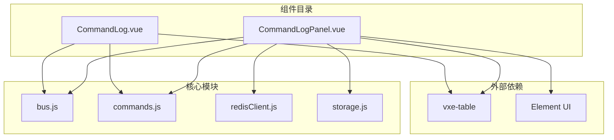
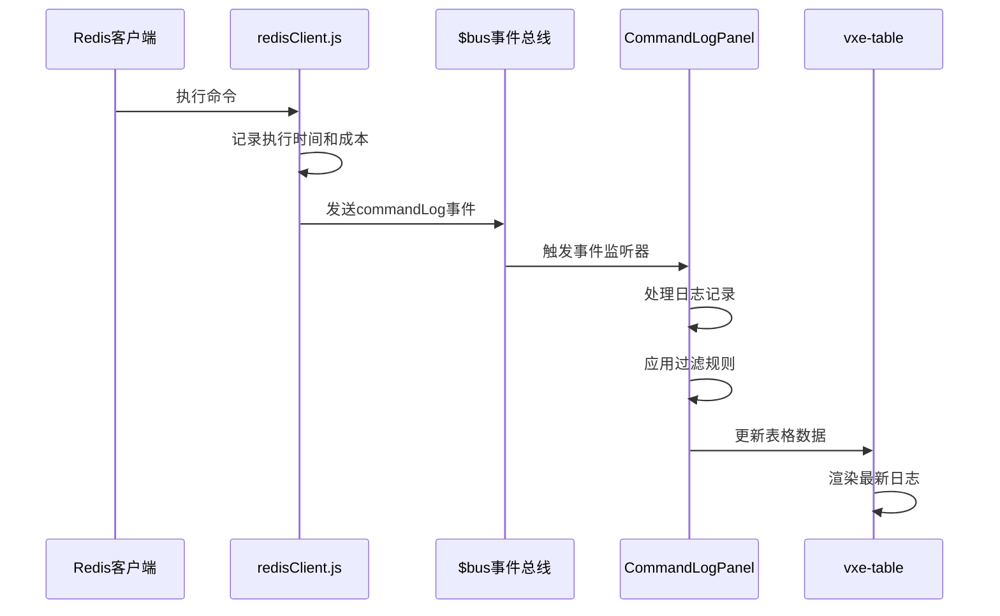
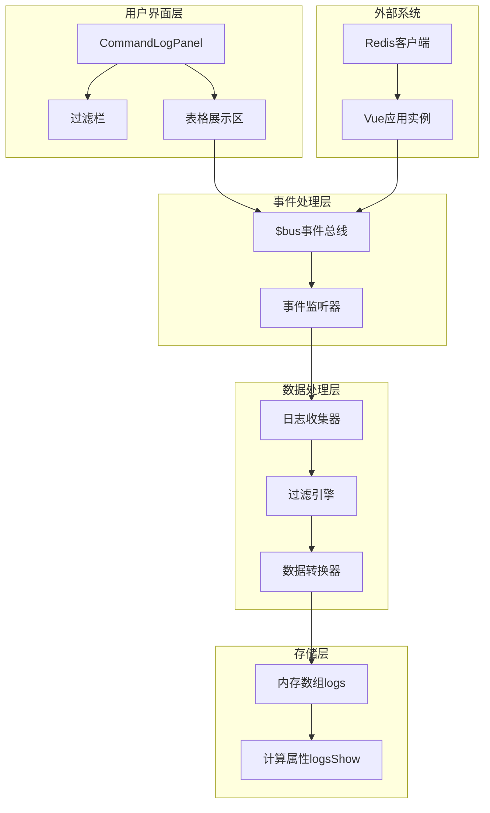
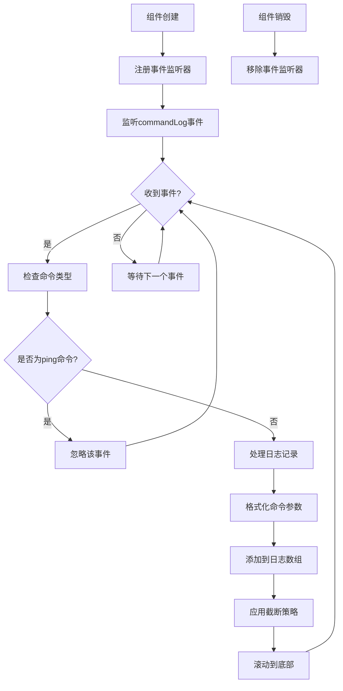
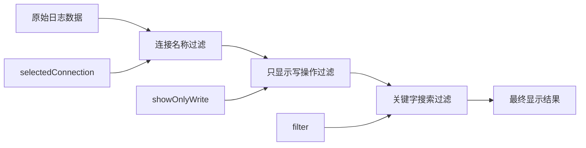
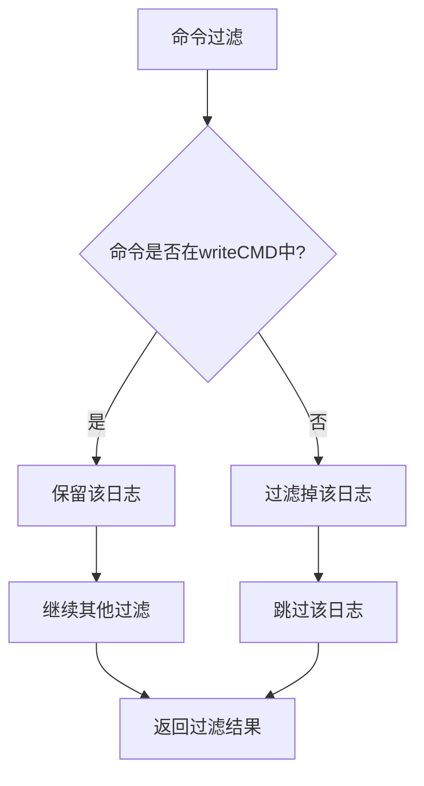
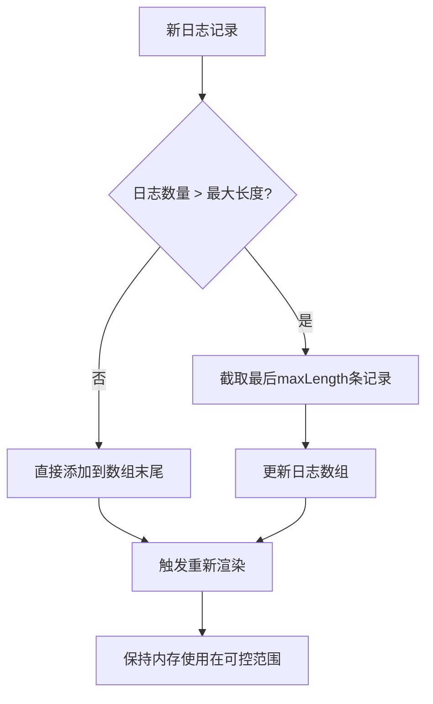
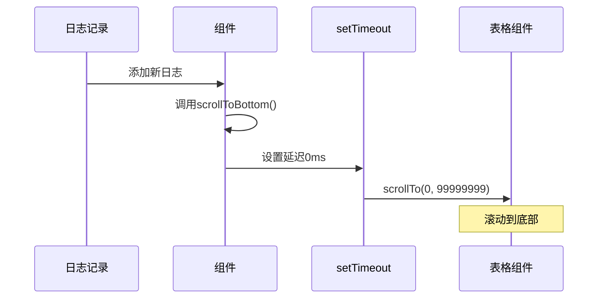
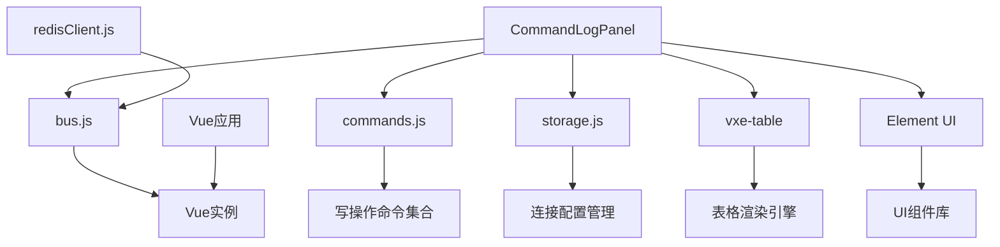

# 命令日志面板

<cite>
**本文档中引用的文件**
- [CommandLogPanel.vue](file://src/components/CommandLogPanel.vue)
- [bus.js](file://src/bus.js)
- [commands.js](file://src/commands.js)
- [redisClient.js](file://src/redisClient.js)
- [storage.js](file://src/storage.js)
- [CommandLog.vue](file://src/components/CommandLog.vue)
</cite>

## 目录
1. [简介](#简介)
2. [项目结构](#项目结构)
3. [核心组件](#核心组件)
4. [架构概览](#架构概览)
5. [详细组件分析](#详细组件分析)
6. [依赖关系分析](#依赖关系分析)
7. [性能考虑](#性能考虑)
8. [故障排除指南](#故障排除指南)
9. [结论](#结论)

## 简介

CommandLogPanel.vue是一个专门用于监控和记录Redis数据库操作的Vue组件，提供了实时的命令审计功能。该组件通过全局事件总线($bus)监听Redis命令执行事件，收集所有Redis操作记录，包括命令名称、参数、执行耗时、时间戳和连接名称，并以表格形式展示给用户。

该组件的核心功能包括：
- 实时监听Redis命令执行事件
- 提供多种过滤机制（连接名称、关键字搜索、只显示写操作）
- 使用高性能的vxe-table组件进行数据展示
- 自动截断策略（保留最近5000条日志）
- 滚动到底部的智能实现

## 项目结构

CommandLogPanel组件在项目中的位置和相关文件结构如下：



**图表来源**
- [CommandLogPanel.vue](file://src/components/CommandLogPanel.vue#L1-L195)
- [bus.js](file://src/bus.js#L1-L19)
- [commands.js](file://src/commands.js#L1-L201)

**章节来源**
- [CommandLogPanel.vue](file://src/components/CommandLogPanel.vue#L1-L195)
- [bus.js](file://src/bus.js#L1-L19)

## 核心组件

### 组件架构设计

CommandLogPanel采用模块化的设计模式，主要包含以下核心部分：

1. **事件监听系统**：通过$bus全局事件总线监听commandLog事件
2. **数据过滤引擎**：提供多维度的数据过滤功能
3. **表格展示层**：使用vxe-table组件进行高性能数据展示
4. **状态管理**：维护日志数据、过滤条件和UI状态

### 数据流架构



**图表来源**
- [redisClient.js](file://src/redisClient.js#L12-L35)
- [CommandLogPanel.vue](file://src/components/CommandLogPanel.vue#L79-L95)

**章节来源**
- [CommandLogPanel.vue](file://src/components/CommandLogPanel.vue#L58-L137)
- [redisClient.js](file://src/redisClient.js#L1-L51)

## 架构概览

### 整体架构图



**图表来源**
- [CommandLogPanel.vue](file://src/components/CommandLogPanel.vue#L1-L56)
- [bus.js](file://src/bus.js#L1-L19)

## 详细组件分析

### 事件监听机制

#### 全局事件总线集成

CommandLogPanel通过Vue的全局事件总线($bus)实现与Redis客户端的解耦通信。事件监听器在组件创建时注册，在销毁时自动清理。



**图表来源**
- [CommandLogPanel.vue](file://src/components/CommandLogPanel.vue#L79-L95)

#### 日志记录处理流程

日志记录过程包含多个关键步骤：

1. **命令过滤**：自动忽略ping命令以减少噪音
2. **参数安全处理**：对敏感信息如密码进行脱敏处理
3. **长度限制**：对长参数进行截断处理
4. **时间格式化**：将时间戳转换为可读格式
5. **连接名称映射**：确保连接名称的一致性

**章节来源**
- [CommandLogPanel.vue](file://src/components/CommandLogPanel.vue#L79-L95)

### 过滤机制详解

#### 多维度过滤系统

CommandLogPanel提供了三个层次的过滤功能：



**图表来源**
- [CommandLogPanel.vue](file://src/components/CommandLogPanel.vue#L107-L123)

#### 连接名称过滤

连接名称过滤功能允许用户只查看特定连接的日志记录。该功能通过以下逻辑实现：

1. **动态连接列表**：从当前连接配置和历史日志中提取所有连接名称
2. **去重排序**：确保连接名称列表的唯一性和有序性
3. **实时更新**：当连接配置发生变化时自动刷新连接列表

#### 写操作过滤

基于commands.js中的writeCMD集合，系统能够识别哪些命令属于写操作：



**图表来源**
- [commands.js](file://src/commands.js#L109-L194)

#### 关键字搜索

关键字搜索功能支持在命令名称和参数中进行模糊匹配，提供灵活的查询能力。

**章节来源**
- [CommandLogPanel.vue](file://src/components/CommandLogPanel.vue#L107-L123)

### vxe-table表格组件配置

#### 性能优化配置

CommandLogPanel使用vxe-table组件进行高效的数据展示，配置了多项性能优化措施：

| 配置项 | 值 | 说明 |
|--------|-----|------|
| size | mini | 使用迷你尺寸减少渲染开销 |
| max-height | 100% | 设置最大高度适应容器 |
| border | none | 移除边框提升视觉效果 |
| show-overflow | title | 内容溢出时显示标题提示 |
| scroll-y.enabled | true | 启用垂直滚动 |
| row-config.height | 28px | 设置行高为28像素 |
| column-config.resizable | true | 允许列宽调整 |

#### 列配置详情

| 列名 | 字段 | 宽度/最小宽度 | 类名 | 说明 |
|------|------|---------------|------|------|
| Time | time | 90px | - | 显示命令执行时间 |
| Connection | name | 150px | - | 显示连接名称 |
| Command | cmd | 120px | command-cmd | 显示命令名称（加粗） |
| Arguments | args | 200px+ | - | 显示命令参数 |
| Cost(ms) | cost | 90px | command-cost | 显示执行耗时（红色） |

**章节来源**
- [CommandLogPanel.vue](file://src/components/CommandLogPanel.vue#L39-L53)

### 自动截断策略

#### 截断机制设计

为了防止内存占用过大，CommandLogPanel实现了智能的自动截断策略：



**图表来源**
- [CommandLogPanel.vue](file://src/components/CommandLogPanel.vue#L93)

#### 截断算法实现

截断算法使用JavaScript的slice方法实现高效的数组截取：

- **时间复杂度**：O(n)，其中n为maxLength
- **空间复杂度**：O(n)，创建新的数组副本
- **性能特点**：避免了数组的频繁插入删除操作

**章节来源**
- [CommandLogPanel.vue](file://src/components/CommandLogPanel.vue#L67-L93)

### 滚动到底部实现

#### 智能滚动机制

CommandLogPanel实现了智能的滚动到底部功能，确保新添加的日志始终可见：



**图表来源**
- [CommandLogPanel.vue](file://src/components/CommandLogPanel.vue#L130-L134)

#### 异步滚动策略

滚动操作采用异步执行策略，确保DOM更新完成后再执行滚动操作：

1. **微任务队列**：setTimeout设置为0ms，利用微任务队列
2. **DOM更新确认**：确保表格组件已经完成渲染
3. **滚动目标值**：使用超大数值确保滚动到最底部

**章节来源**
- [CommandLogPanel.vue](file://src/components/CommandLogPanel.vue#L130-L134)

## 依赖关系分析

### 组件间依赖关系



**图表来源**
- [CommandLogPanel.vue](file://src/components/CommandLogPanel.vue#L59-L62)
- [bus.js](file://src/bus.js#L1-L19)

### 外部依赖分析

#### 第三方库依赖

| 依赖包 | 版本要求 | 用途 | 性能影响 |
|--------|----------|------|----------|
| vxe-table | 最新版 | 高性能表格组件 | 中等，但支持虚拟滚动 |
| Element UI | 最新版 | UI组件库 | 较小，轻量级组件 |
| ioredis | 最新版 | Redis客户端 | 主要性能瓶颈 |

#### 内部模块依赖

| 模块 | 导入路径 | 功能 | 影响程度 |
|------|----------|------|----------|
| writeCMD | @/commands.js | 写操作命令集合 | 中等，用于过滤 |
| storage | @/storage.js | 连接配置管理 | 较小，缓存访问 |
| Vue | vue | 框架基础 | 主要，事件系统 |

**章节来源**
- [CommandLogPanel.vue](file://src/components/CommandLogPanel.vue#L59-L62)

## 性能考虑

### 内存管理策略

CommandLogPanel采用了多层次的内存管理策略来确保应用的稳定性：

1. **固定大小缓冲区**：限制日志数组的最大长度为5000条
2. **及时垃圾回收**：通过数组截断释放不再需要的内存
3. **异步更新**：避免阻塞主线程的同步操作

### 渲染性能优化

#### 虚拟滚动技术

虽然当前版本没有启用虚拟滚动，但vxe-table框架支持该特性，可以在未来扩展：

- **适用场景**：当日志数量超过数千条时
- **性能收益**：将DOM元素数量控制在可视区域范围内
- **实现复杂度**：中等，需要调整表格配置

#### 计算属性优化

logsShow计算属性采用了惰性求值和短路优化：

```javascript
// 优化前：总是执行所有过滤
logs.filter(...) // 连接过滤
  .filter(...) // 写操作过滤  
  .filter(...) // 关键字过滤

// 优化后：只有在需要时才执行过滤
if (selectedConnection) {
  logs = logs.filter(...)
}
if (showOnlyWrite) {
  logs = logs.filter(...)
}
if (filter) {
  logs = logs.filter(...)
}
```

### 网络和I/O优化

#### 事件处理优化

- **防抖处理**：通过事件总线避免重复的DOM操作
- **批量更新**：将多个日志记录合并为单次表格更新
- **异步处理**：使用setTimeout避免阻塞事件循环

## 故障排除指南

### 常见问题及解决方案

#### 日志不显示问题

**症状**：点击连接后没有显示任何日志记录

**可能原因**：
1. 当前连接没有执行过任何命令
2. 连接名称不匹配
3. 过滤条件过于严格

**解决步骤**：
1. 检查连接配置是否正确
2. 尝试清除过滤条件
3. 验证是否有活跃的Redis连接

#### 性能问题

**症状**：界面响应缓慢，表格滚动卡顿

**可能原因**：
1. 日志数量过多
2. 浏览器内存不足
3. 表格配置不当

**解决步骤**：
1. 清空日志记录
2. 减少同时打开的连接数量
3. 考虑启用虚拟滚动

#### 内存泄漏问题

**症状**：长时间使用后内存占用持续增长

**可能原因**：
1. 事件监听器未正确清理
2. 日志数组无限增长
3. DOM节点未正确释放

**解决步骤**：
1. 检查组件生命周期钩子
2. 验证截断策略是否正常工作
3. 使用浏览器开发者工具监控内存

### 调试技巧

#### 日志记录调试

可以通过修改日志记录逻辑来诊断问题：

```javascript
// 在日志记录处添加调试信息
console.log('New log record:', {
  command: record.command.name,
  args: record.command.args,
  cost: record.cost,
  connection: record.connectionName
});
```

#### 性能监控

使用浏览器性能工具监控组件性能：

1. **Timeline**：观察渲染性能
2. **Memory**：监控内存使用情况
3. **Console**：检查错误和警告信息

**章节来源**
- [CommandLogPanel.vue](file://src/components/CommandLogPanel.vue#L79-L95)

## 结论

CommandLogPanel.vue是一个设计精良的Redis命令审计组件，具有以下突出特点：

### 技术优势

1. **事件驱动架构**：通过$bus全局事件总线实现松耦合设计
2. **高性能表格**：使用vxe-table提供优秀的渲染性能
3. **智能过滤系统**：支持多维度的数据过滤和搜索
4. **内存管理**：完善的截断策略防止内存泄漏
5. **用户体验**：自动滚动到底部确保新日志可见

### 功能完整性

该组件完整地实现了命令审计的核心需求：
- 实时记录所有Redis操作
- 提供灵活的过滤和搜索功能
- 支持连接级别的日志隔离
- 具备基本的安全防护（密码脱敏）

### 改进建议

1. **虚拟滚动**：对于大量日志场景，可以考虑启用虚拟滚动
2. **数据持久化**：增加日志导出和本地存储功能
3. **高级过滤**：支持正则表达式和复合条件过滤
4. **性能监控**：添加性能指标统计和告警功能

CommandLogPanel作为Redis桌面管理器的重要组成部分，为用户提供了强大的命令审计能力，是现代数据库管理工具不可或缺的功能模块。