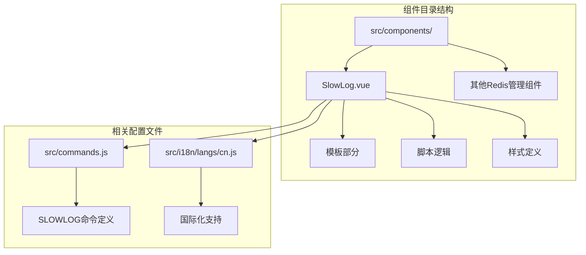
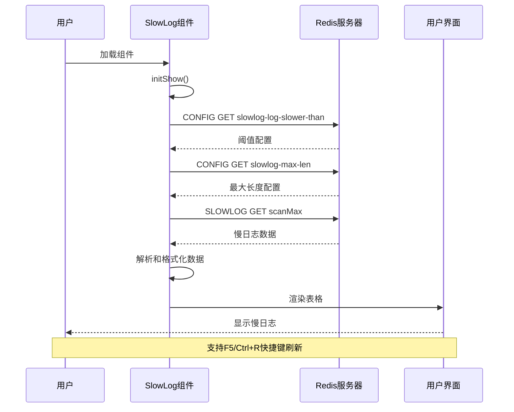
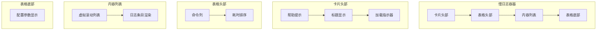
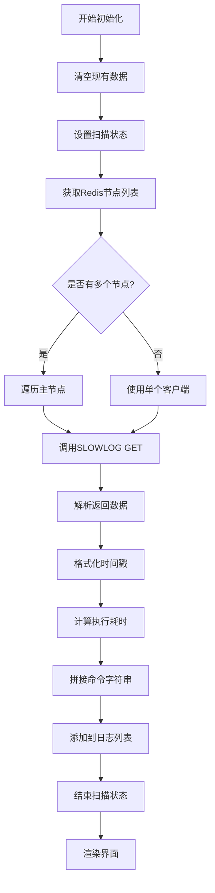
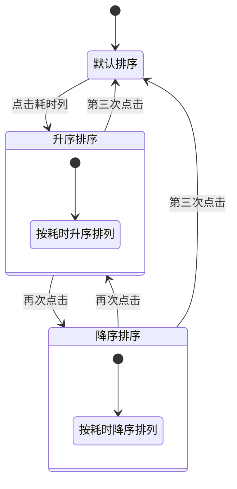
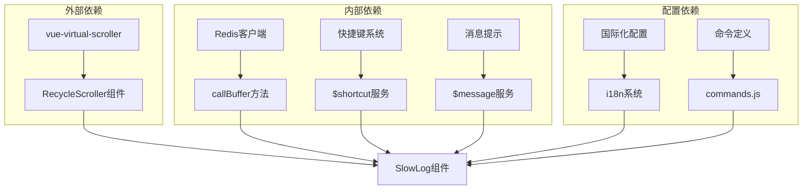

# 慢日志标签页

<cite>
**本文档中引用的文件**
- [SlowLog.vue](file://src/components/SlowLog.vue)
- [commands.js](file://src/commands.js)
- [cn.js](file://src/i18n/langs/cn.js)
</cite>

## 目录
1. [简介](#简介)
2. [项目结构](#项目结构)
3. [核心组件](#核心组件)
4. [架构概览](#架构概览)
5. [详细组件分析](#详细组件分析)
6. [依赖关系分析](#依赖关系分析)
7. [性能考虑](#性能考虑)
8. [故障排除指南](#故障排除指南)
9. [结论](#结论)

## 简介

SlowLog.vue是一个专门用于展示Redis慢查询日志的功能模块，它通过调用Redis的SLOWLOG GET命令获取慢日志条目，并以表格形式展示这些信息。该组件提供了直观的日志浏览界面，支持按执行耗时排序、实时刷新以及配置参数显示等功能。

慢查询日志是Redis性能监控的重要工具，它记录了执行时间超过特定阈值的命令，帮助开发者识别性能瓶颈和优化机会。SlowLog.vue组件通过可视化的界面，使用户能够轻松分析Redis服务器的性能状况。

## 项目结构

SlowLog.vue组件位于项目的组件目录中，与其他Redis管理功能模块协同工作：

**图表来源**
- [SlowLog.vue](file://src/components/SlowLog.vue#L1-L235)
- [commands.js](file://src/commands.js#L21)

**章节来源**
- [SlowLog.vue](file://src/components/SlowLog.vue#L1-L235)

## 核心组件

SlowLog.vue组件的核心功能围绕Redis慢查询日志的获取、解析和展示展开。组件的主要职责包括：

### 主要数据结构

组件维护以下核心数据状态：
- `cmdList`: 存储解析后的慢日志条目数组
- `isScanning`: 标识当前是否正在进行日志获取操作
- `sortOrder`: 排序顺序标识符（asc/desc）
- `scanMax`: 最大扫描数量限制（默认20000）
- `slowerThan`: 当前慢日志阈值配置
- `maxLen`: 最大慢日志条目数量配置

### 关键方法

组件实现了以下核心方法：

1. **initShow()**: 初始化显示流程，清空现有数据并启动获取过程
2. **initCmdList()**: 调用Redis SLOWLOG GET命令获取慢日志数据
3. **initConfig()**: 获取Redis服务器的慢日志配置参数
4. **toLocalTime()**: 将时间戳转换为本地时间格式
5. **toggleOrder()**: 切换日志条目的排序顺序
6. **reOrder()**: 执行实际的排序操作

**章节来源**
- [SlowLog.vue](file://src/components/SlowLog.vue#L65-L165)

## 架构概览

SlowLog.vue组件采用Vue.js框架构建，遵循组件化开发模式：

**图表来源**
- [SlowLog.vue](file://src/components/SlowLog.vue#L78-L117)

## 详细组件分析

### 模板结构分析

SlowLog.vue组件的模板部分采用清晰的三段式布局：

**图表来源**
- [SlowLog.vue](file://src/components/SlowLog.vue#L2-L56)

### 数据获取流程

组件通过以下步骤获取和处理慢日志数据：

**图表来源**
- [SlowLog.vue](file://src/components/SlowLog.vue#L84-L108)

### 日志条目结构解析

每个慢日志条目包含以下字段：

| 字段 | 类型 | 描述 |
|------|------|------|
| id | Number | 日志条目的唯一标识符 |
| timestring | String | 格式化的时间戳字符串 |
| cost | String | 执行耗时（毫秒，保留3位小数） |
| cmd | String | 完整的Redis命令字符串 |
| source | String | 客户端连接信息 |
| name | String | 客户端名称 |

### 排序和交互功能

组件提供了灵活的排序和交互功能：

**图表来源**
- [SlowLog.vue](file://src/components/SlowLog.vue#L131-L145)

### 快捷键支持

组件支持以下快捷键操作：
- **F5**: 刷新慢日志数据
- **Ctrl+R**: 刷新慢日志数据（Windows/Linux）
- **⌘+R**: 刷新慢日志数据（macOS）

**章节来源**
- [SlowLog.vue](file://src/components/SlowLog.vue#L146-L155)

## 依赖关系分析

SlowLog.vue组件依赖于多个外部资源和内部模块：

**图表来源**
- [SlowLog.vue](file://src/components/SlowLog.vue#L62-L76)
- [commands.js](file://src/commands.js#L21)

### Redis命令依赖

组件主要依赖以下Redis命令：

1. **SLOWLOG GET [count]**: 获取慢日志条目，支持指定数量限制
2. **CONFIG GET slowlog-log-slower-than**: 获取慢日志阈值配置
3. **CONFIG GET slowlog-max-len**: 获取最大慢日志条目数量

**章节来源**
- [SlowLog.vue](file://src/components/SlowLog.vue#L89-L117)
- [commands.js](file://src/commands.js#L21)

## 性能考虑

### 虚拟滚动优化

SlowLog.vue组件使用vue-virtual-scroller库实现虚拟滚动，有效处理大量日志条目：

- **item-size**: 每个条目固定高度24像素
- **key-field**: 使用日志ID作为唯一键
- **内存效率**: 只渲染可见区域的条目

### 数据量限制

组件设置了合理的数据量限制：
- **scanMax**: 默认20000条，防止内存溢出
- **实际显示**: 通过虚拟滚动动态加载
- **性能平衡**: 在完整性和性能之间取得平衡

### 网络优化

- **批量获取**: 一次性获取指定数量的日志条目
- **错误处理**: 完善的异常捕获和用户提示
- **并发处理**: 支持多节点环境下的并发获取

## 故障排除指南

### 常见问题及解决方案

#### 1. 慢日志功能不可用

**症状**: 页面显示"No Slow Log"且无数据

**可能原因**:
- Redis服务器未启用慢日志功能
- SLOWLOG命令被禁用
- 网络连接问题

**解决方法**:
- 检查Redis配置：`CONFIG GET slowlog-log-slower-than`
- 确认SLOWLOG命令可用性
- 验证网络连接状态

#### 2. 数据显示异常

**症状**: 时间格式错误或数值显示异常

**可能原因**:
- 时区设置问题
- 数据解析错误

**解决方法**:
- 检查系统时区设置
- 验证Redis返回数据格式

#### 3. 性能问题

**症状**: 页面加载缓慢或卡顿

**可能原因**:
- 慢日志条目过多
- 网络延迟较高

**解决方法**:
- 减少scanMax值
- 优化网络连接
- 使用更快的Redis实例

**章节来源**
- [SlowLog.vue](file://src/components/SlowLog.vue#L105-L107)

## 结论

SlowLog.vue组件是一个功能完善、设计精良的Redis慢查询日志查看工具。它通过以下特性为用户提供优秀的使用体验：

### 主要优势

1. **直观的界面设计**: 清晰的表格布局和醒目的耗时标识
2. **强大的功能**: 支持排序、刷新、多节点等高级功能
3. **良好的性能**: 虚拟滚动技术确保大量数据的流畅显示
4. **完善的错误处理**: 全面的异常捕获和用户友好的错误提示
5. **便捷的操作**: 快捷键支持和自动刷新机制

### 应用价值

该组件对于Redis性能监控具有重要价值：
- **性能诊断**: 快速识别执行时间较长的命令
- **优化指导**: 提供具体的优化方向和建议
- **运维支持**: 帮助管理员了解服务器负载状况
- **开发辅助**: 帮助开发者优化应用性能

### 扩展建议

1. **搜索功能**: 添加关键词搜索功能
2. **导出功能**: 支持慢日志数据导出
3. **图表分析**: 添加执行时间趋势图
4. **告警集成**: 与监控系统集成告警功能

SlowLog.vue组件展现了现代Web应用开发的最佳实践，通过合理的架构设计和用户体验优化，为Redis管理提供了强有力的支持工具。