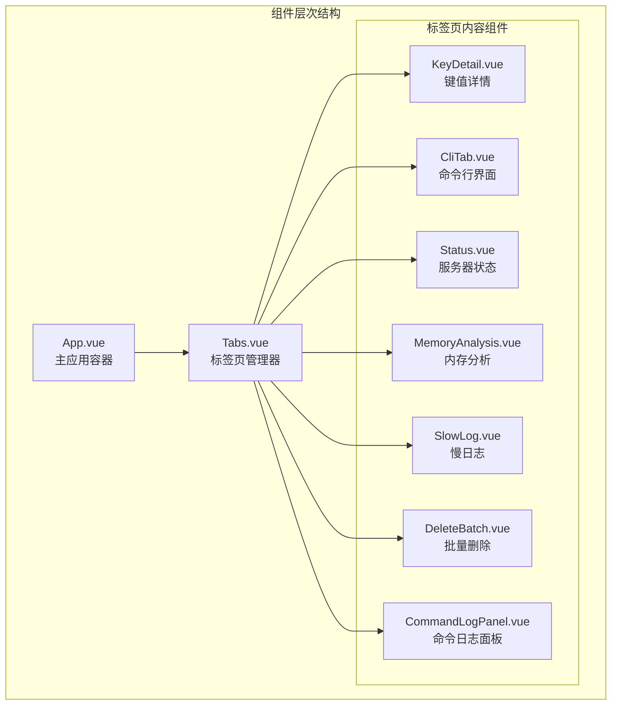
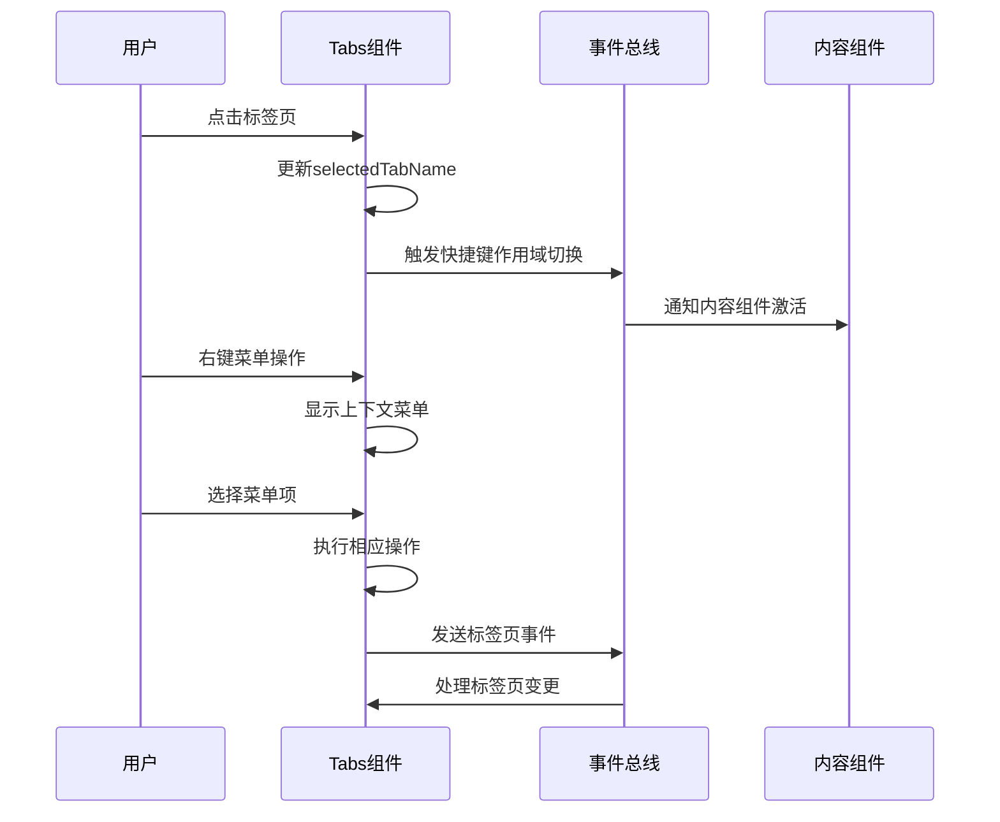
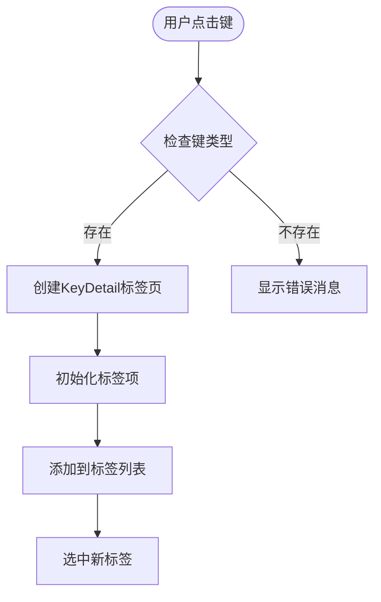
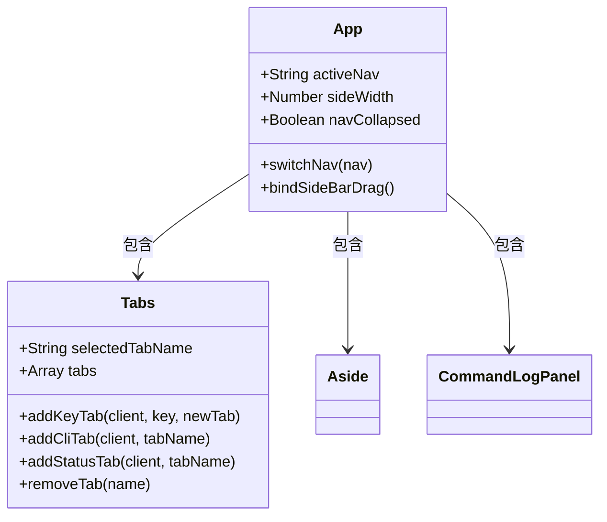
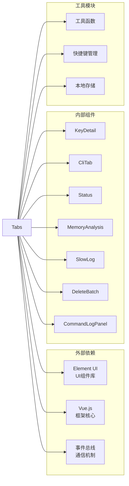

# 标签页组件

<cite>
**本文档中引用的文件**
- [Tabs.vue](file://src/components/Tabs.vue)
- [App.vue](file://src/App.vue)
- [KeyDetail.vue](file://src/components/KeyDetail.vue)
- [CliTab.vue](file://src/components/CliTab.vue)
- [CommandLogPanel.vue](file://src/components/CommandLogPanel.vue)
- [MemoryAnalysis.vue](file://src/components/MemoryAnalysis.vue)
- [SlowLog.vue](file://src/components/SlowLog.vue)
- [DeleteBatch.vue](file://src/components/DeleteBatch.vue)
- [Status.vue](file://src/components/Status.vue)
</cite>

## 目录
1. [简介](#简介)
2. [项目结构](#项目结构)
3. [核心组件](#核心组件)
4. [架构概览](#架构概览)
5. [详细组件分析](#详细组件分析)
6. [依赖关系分析](#依赖关系分析)
7. [性能考虑](#性能考虑)
8. [故障排除指南](#故障排除指南)
9. [结论](#结论)

## 简介

Tabs.vue是Another Redis Desktop Manager应用中的核心多标签页管理器组件，负责在主工作区中动态创建和管理不同类型的标签页。该组件提供了丰富的交互功能，包括标签页的激活、关闭、拖拽排序等操作，并通过事件总线与应用的其他部分进行通信。

该组件支持多种内容类型，包括键值详情(KeyDetail)、命令行界面(CliTab)、命令日志(CommandLogPanel)、内存分析(MemoryAnalysis)和慢日志(SlowLog)等，为用户提供了统一且灵活的工作环境。

## 项目结构

Tabs.vue组件位于项目的组件目录中，与其它主要组件紧密协作：

**图表来源**
- [App.vue](file://src/App.vue#L104-L105)
- [Tabs.vue](file://src/components/Tabs.vue#L1-L20)

**章节来源**
- [App.vue](file://src/App.vue#L104-L105)
- [Tabs.vue](file://src/components/Tabs.vue#L1-L20)

## 核心组件

Tabs.vue组件的核心功能围绕着标签页的生命周期管理和用户交互处理：

### 主要数据结构

组件维护两个关键的数据属性：
- `selectedTabName`: 当前选中的标签页名称
- `tabs`: 存储所有打开标签页的数组

### 组件注册

组件注册了六个主要的内容组件：
- Status: 服务器状态监控
- CliTab: 命令行交互界面  
- KeyDetail: 键值详情查看器
- DeleteBatch: 批量删除工具
- MemoryAnalysis: 内存使用分析
- SlowLog: 慢查询日志分析

**章节来源**
- [Tabs.vue](file://src/components/Tabs.vue#L42-L49)

## 架构概览

Tabs.vue采用事件驱动的架构模式，通过Vue的响应式系统和事件总线实现组件间的通信：

**图表来源**
- [Tabs.vue](file://src/components/Tabs.vue#L133-L138)
- [Tabs.vue](file://src/components/Tabs.vue#L295-L299)

## 详细组件分析

### 标签页创建机制

Tabs.vue支持多种类型的标签页创建方式：

#### 键值详情标签页
当用户点击某个键时，会触发`clickedKey`事件，组件会根据键的类型动态创建相应的标签页：

**图表来源**
- [Tabs.vue](file://src/components/Tabs.vue#L197-L212)
- [Tabs.vue](file://src/components/Tabs.vue#L214-L231)

#### 特殊功能标签页
除了键值详情外，还支持以下特殊功能标签页的创建：

| 标签页类型 | 创建方法 | 功能描述 |
|-----------|---------|----------|
| 状态监控 | `addStatusTab()` | 显示Redis服务器状态信息 |
| 命令行界面 | `addCliTab()` | 提供交互式Redis命令行 |
| 内存分析 | `addMemoryTab()` | 分析Redis内存使用情况 |
| 慢日志分析 | `addSlowLogTab()` | 查看慢查询日志 |
| 批量删除 | `addDelBatchTab()` | 批量删除键值 |

**章节来源**
- [Tabs.vue](file://src/components/Tabs.vue#L140-L196)

### 标签页交互逻辑

#### 关闭操作
标签页的关闭遵循智能策略：
- 如果关闭的是当前选中的标签页，自动选择相邻的标签页
- 删除快捷键作用域以避免内存泄漏
- 更新当前选中的标签页

#### 鼠标滚轮切换
组件实现了鼠标滚轮切换标签页的功能：
- 向上滚动：切换到左侧标签页
- 向下滚动：切换到右侧标签页
- 自动边界处理

#### 上下文菜单
右键点击标签页会显示上下文菜单，提供以下操作：
- 关闭当前标签页
- 关闭其他标签页
- 关闭左侧标签页
- 关闭右侧标签页

**章节来源**
- [Tabs.vue](file://src/components/Tabs.vue#L111-L132)
- [Tabs.vue](file://src/components/Tabs.vue#L300-L311)
- [Tabs.vue](file://src/components/Tabs.vue#L312-L377)

### 快捷键支持

Tabs.vue集成了全面的键盘快捷键支持：

#### 全局快捷键
- `Ctrl+W` / `⌘+W`: 关闭当前标签页
- `Ctrl+R` / `⌘+R` / `F5`: 刷新当前标签页内容
- `Ctrl+L` / `⌘+L`: 清空CLI控制台

#### 标签页导航
- 鼠标滚轮：在标签页间切换
- 右键菜单：提供丰富的标签页操作选项

**章节来源**
- [Tabs.vue](file://src/components/Tabs.vue#L287-L293)
- [Tabs.vue](file://src/components/Tabs.vue#L380-L382)

### 与App.vue的集成

Tabs.vue作为App.vue的主要子组件，通过以下方式与应用主体集成：

**图表来源**
- [App.vue](file://src/App.vue#L126-L156)
- [Tabs.vue](file://src/components/Tabs.vue#L41-L50)

**章节来源**
- [App.vue](file://src/App.vue#L104-L105)
- [App.vue](file://src/App.vue#L126-L156)

### 内容组件的容器化

所有内容组件都通过统一的容器样式进行包装：

#### 容器特性
- 固定高度：`calc(100vh - 67px)`
- 水平滚动条：隐藏水平溢出
- 垂直滚动条：自动显示垂直溢出
- 一致性样式：确保所有内容组件具有一致的外观

#### 动态内容加载
组件使用Vue的条件渲染机制，根据标签页的类型动态加载相应的内容组件：
- 使用`v-if`和`v-else-if`语句
- 支持Status、CliTab、KeyDetail、DeleteBatch、MemoryAnalysis、SlowLog六种组件类型
- 传递必要的props给子组件

**章节来源**
- [Tabs.vue](file://src/components/Tabs.vue#L13-L18)
- [Tabs.vue](file://src/components/Tabs.vue#L397-L403)

## 依赖关系分析

Tabs.vue组件具有清晰的依赖关系结构：

**图表来源**
- [Tabs.vue](file://src/components/Tabs.vue#L34-L39)
- [Tabs.vue](file://src/components/Tabs.vue#L41-L50)

### 外部依赖
- **Element UI**: 提供基础UI组件，如el-tabs、el-tab-pane等
- **Vue.js**: 框架核心，支持响应式数据绑定和组件化开发

### 内部组件依赖
- **KeyDetail**: 键值详情查看的核心组件
- **CliTab**: 命令行界面组件
- **Status**: 服务器状态监控组件
- **MemoryAnalysis**: 内存分析工具
- **SlowLog**: 慢查询日志分析
- **DeleteBatch**: 批量删除功能
- **CommandLogPanel**: 命令日志面板

### 工具模块依赖
- **Util**: 提供字符串截取、文件大小格式化等工具函数
- **Shortcut**: 快捷键管理模块
- **Storage**: 本地存储管理

**章节来源**
- [Tabs.vue](file://src/components/Tabs.vue#L34-L39)
- [Tabs.vue](file://src/components/Tabs.vue#L41-L50)

## 性能考虑

Tabs.vue在设计时充分考虑了性能优化：

### 虚拟滚动
对于大量数据的展示（如内存分析、慢日志），使用了虚拟滚动技术：
- MemoryAnalysis使用RecycleScroller组件
- SlowLog同样采用RecycleScroller实现高性能列表渲染
- 减少DOM节点数量，提升大数据量场景下的性能

### 懒加载机制
- 标签页内容按需加载，只有在激活时才渲染对应组件
- 避免一次性加载所有可能的标签页内容
- 减少初始渲染时间和内存占用

### 事件处理优化
- 使用事件委托减少事件监听器数量
- 及时清理不再需要的事件监听器
- 避免内存泄漏

### 数据结构优化
- 使用对象查找而非数组遍历提高查找效率
- 合理的数据结构设计减少不必要的计算

## 故障排除指南

### 常见问题及解决方案

#### 标签页无法正常关闭
**症状**: 点击关闭按钮后标签页仍然存在
**原因**: 可能是事件监听器未正确移除或状态更新失败
**解决方案**: 检查`removeTab`方法的执行流程，确保所有清理操作都正确完成

#### 快捷键失效
**症状**: 按下快捷键组合没有反应
**原因**: 快捷键作用域设置错误或事件绑定失败
**解决方案**: 检查`initShortcut`方法的调用时机和`setScope`方法的正确性

#### 内容组件渲染异常
**症状**: 标签页内容显示不正确或空白
**原因**: 可能是props传递错误或组件初始化问题
**解决方案**: 验证传递给内容组件的props是否正确，检查组件的生命周期钩子

#### 内存泄漏
**症状**: 应用运行时间长后出现性能下降
**原因**: 事件监听器未正确清理或定时器未清除
**解决方案**: 确保在组件销毁时调用`beforeDestroy`钩子中的清理代码

**章节来源**
- [Tabs.vue](file://src/components/Tabs.vue#L111-L132)
- [Tabs.vue](file://src/components/Tabs.vue#L287-L293)
- [Tabs.vue](file://src/components/Tabs.vue#L380-L382)

## 结论

Tabs.vue组件是Another Redis Desktop Manager应用中的核心基础设施，它成功地实现了以下目标：

### 主要成就
1. **统一的标签页管理**: 提供了一致的用户体验，支持多种类型的内容组件
2. **灵活的交互方式**: 支持鼠标、键盘和上下文菜单等多种交互方式
3. **高效的性能表现**: 通过虚拟滚动和懒加载技术优化大数据量场景
4. **良好的可扩展性**: 易于添加新的标签页类型和功能

### 技术亮点
- 事件驱动的架构设计，确保组件间的松耦合
- 智能的状态管理，自动处理标签页的激活和关闭逻辑
- 完善的错误处理和边界情况处理
- 优秀的用户体验设计，包括快捷键支持和视觉反馈

### 未来改进方向
1. **拖拽排序功能**: 考虑添加标签页拖拽排序功能
2. **标签页分组**: 支持标签页分组管理
3. **持久化配置**: 将标签页布局和状态持久化
4. **性能监控**: 添加性能指标监控和优化建议

Tabs.vue组件的设计和实现展示了现代前端应用中多标签页管理的最佳实践，为用户提供了高效、直观的Redis数据库管理体验。