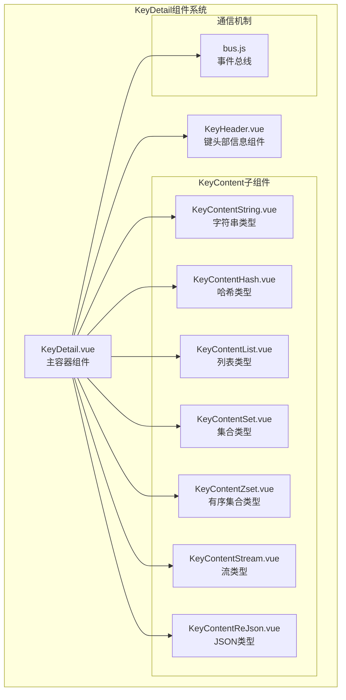
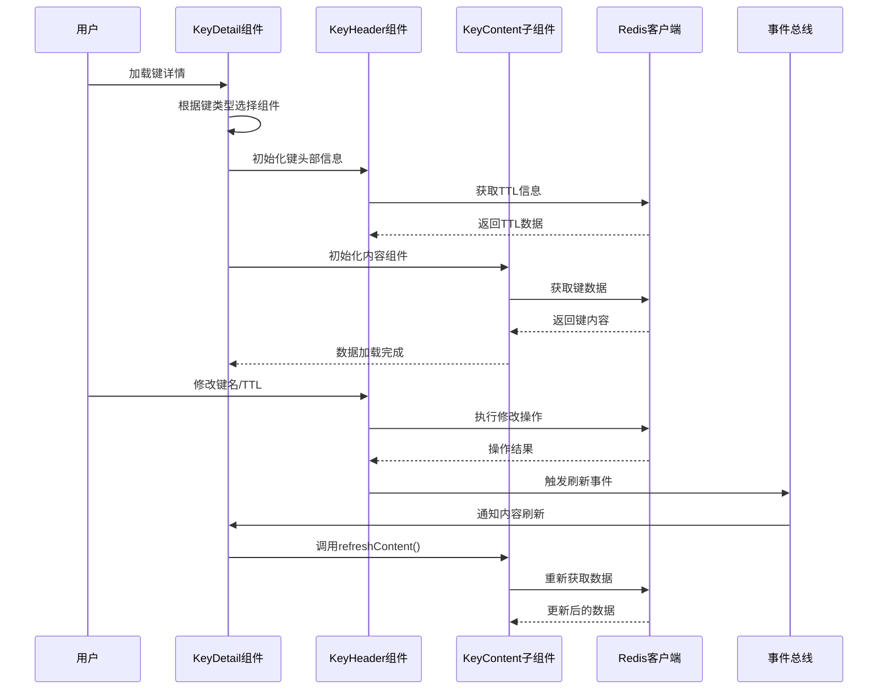
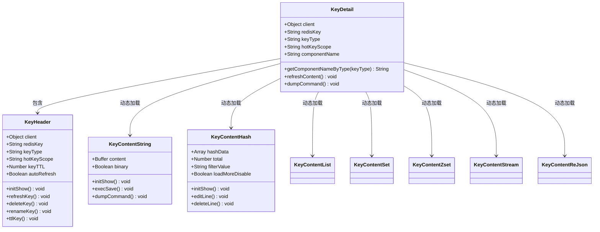
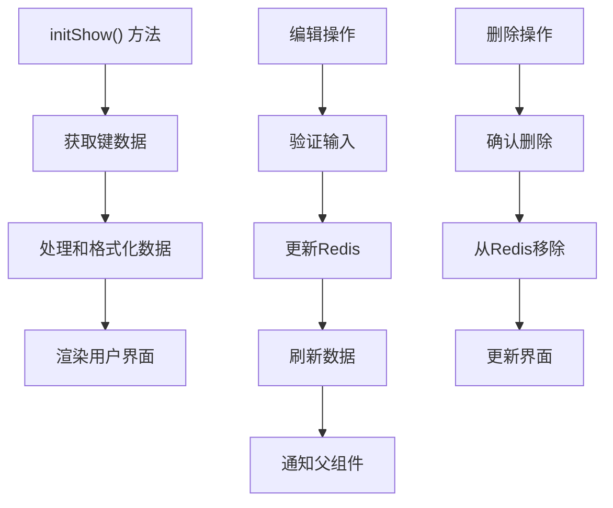
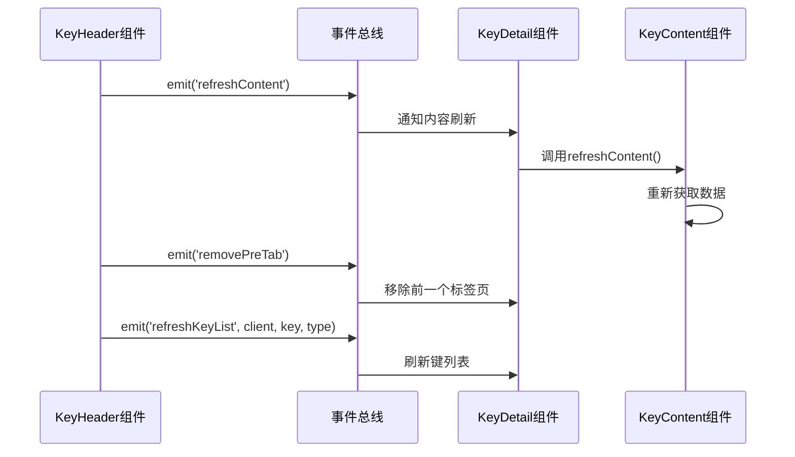
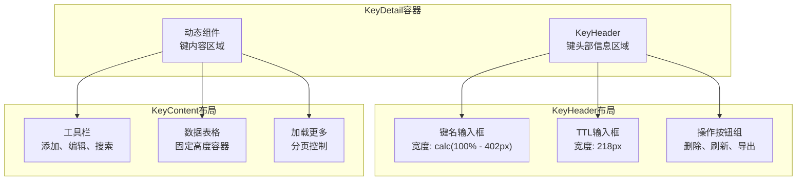
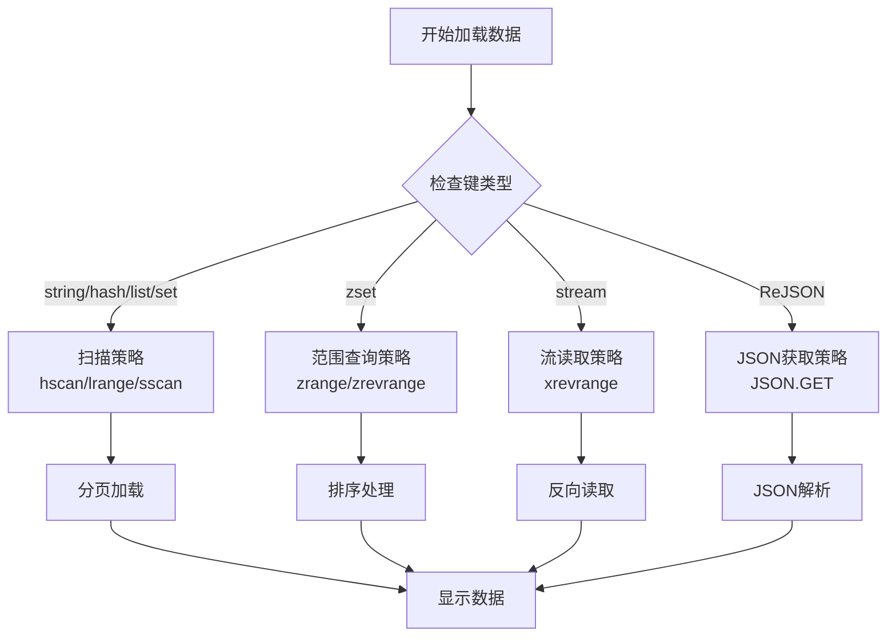

# 键值详情标签页

<cite>
**本文档引用的文件**
- [KeyDetail.vue](file://src/components/KeyDetail.vue)
- [KeyHeader.vue](file://src/components/KeyHeader.vue)
- [KeyContentString.vue](file://src/components/contents/KeyContentString.vue)
- [KeyContentHash.vue](file://src/components/contents/KeyContentHash.vue)
- [KeyContentList.vue](file://src/components/contents/KeyContentList.vue)
- [KeyContentSet.vue](file://src/components/contents/KeyContentSet.vue)
- [KeyContentZset.vue](file://src/components/contents/KeyContentZset.vue)
- [KeyContentStream.vue](file://src/components/contents/KeyContentStream.vue)
- [KeyContentReJson.vue](file://src/components/contents/KeyContentReJson.vue)
- [bus.js](file://src/bus.js)
</cite>

## 目录
1. [简介](#简介)
2. [项目结构](#项目结构)
3. [核心组件](#核心组件)
4. [架构概览](#架构概览)
5. [详细组件分析](#详细组件分析)
6. [组件间通信](#组件间通信)
7. [响应式布局设计](#响应式布局设计)
8. [数据类型处理逻辑](#数据类型处理逻辑)
9. [使用示例](#使用示例)
10. [常见问题解决方案](#常见问题解决方案)
11. [总结](#总结)

## 简介

KeyDetail.vue组件是Another Redis Desktop Manager中标签页中展示Redis键值详情的核心容器组件。它采用动态组件加载机制，根据Redis键的不同数据类型（string、hash、list、set、zset、stream、ReJSON等）自动加载对应的KeyContent子组件，为用户提供统一且功能丰富的键值详情查看界面。

该组件不仅负责展示键的基本信息（TTL、内存占用、编码等），还提供了完整的CRUD操作功能，包括键重命名、TTL设置、删除操作以及各种数据类型的特定操作。

## 项目结构

KeyDetail组件系统采用模块化架构，主要包含以下文件：



**图表来源**
- [KeyDetail.vue](file://src/components/KeyDetail.vue#L1-L159)
- [KeyHeader.vue](file://src/components/KeyHeader.vue#L1-L308)
- [bus.js](file://src/bus.js#L1-L19)

## 核心组件

### KeyDetail主容器组件

KeyDetail.vue作为整个键值详情展示的核心容器，具有以下特性：

- **动态组件加载**：根据键类型动态选择对应的KeyContent子组件
- **统一接口**：通过props接收Redis客户端实例、键名和键类型
- **事件处理**：监听KeyHeader组件的刷新和导出事件
- **错误处理**：提供友好的错误提示和边界情况处理

### KeyHeader键头部信息组件

KeyHeader.vue负责展示和管理键的基本信息：

- **键名显示与编辑**：支持键重命名功能
- **TTL管理**：显示和设置键的过期时间
- **操作按钮**：提供删除、刷新、导出命令等功能
- **自动刷新机制**：支持定时刷新键状态

**章节来源**
- [KeyDetail.vue](file://src/components/KeyDetail.vue#L1-L159)
- [KeyHeader.vue](file://src/components/KeyHeader.vue#L1-L308)

## 架构概览

KeyDetail组件系统采用分层架构设计，实现了高度的模块化和可扩展性：



**图表来源**
- [KeyDetail.vue](file://src/components/KeyDetail.vue#L80-L96)
- [KeyHeader.vue](file://src/components/KeyHeader.vue#L88-L107)
- [bus.js](file://src/bus.js#L1-L19)

## 详细组件分析

### KeyDetail组件深度解析

KeyDetail组件采用了Vue的动态组件特性，通过计算属性动态确定要加载的子组件：



**图表来源**
- [KeyDetail.vue](file://src/components/KeyDetail.vue#L39-L80)
- [KeyHeader.vue](file://src/components/KeyHeader.vue#L76-L250)
- [KeyContentString.vue](file://src/components/contents/KeyContentString.vue#L25-L102)

### KeyHeader组件功能分析

KeyHeader组件提供了完整的键管理功能：

#### 键名管理
- 支持二进制键名的显示和编辑
- 提供键重命名功能，包含确认机制
- 支持键名搜索过滤

#### TTL管理
- 显示键的剩余生存时间
- 支持永久保存和设置过期时间
- 提供TTL验证和错误处理

#### 自动刷新机制
- 支持定时刷新键状态
- 可配置刷新间隔
- 响应式UI反馈（旋转动画）

**章节来源**
- [KeyHeader.vue](file://src/components/KeyHeader.vue#L76-L308)

### KeyContent子组件通用模式

所有KeyContent子组件都遵循统一的设计模式：



**图表来源**
- [KeyContentString.vue](file://src/components/contents/KeyContentString.vue#L35-L70)
- [KeyContentHash.vue](file://src/components/contents/KeyContentHash.vue#L146-L305)
- [KeyContentList.vue](file://src/components/contents/KeyContentList.vue#L114-L258)

**章节来源**
- [KeyContentString.vue](file://src/components/contents/KeyContentString.vue#L1-L104)
- [KeyContentHash.vue](file://src/components/contents/KeyContentHash.vue#L1-L334)
- [KeyContentList.vue](file://src/components/contents/KeyContentList.vue#L1-L296)
- [KeyContentSet.vue](file://src/components/contents/KeyContentSet.vue#L1-L284)
- [KeyContentZset.vue](file://src/components/contents/KeyContentZset.vue#L1-L329)
- [KeyContentStream.vue](file://src/components/contents/KeyContentStream.vue#L1-L428)
- [KeyContentReJson.vue](file://src/components/contents/KeyContentReJson.vue#L1-L103)

## 组件间通信

### 事件总线通信机制

KeyDetail组件通过事件总线实现组件间的解耦通信：



**图表来源**
- [KeyHeader.vue](file://src/components/KeyHeader.vue#L140-L141)
- [KeyHeader.vue](file://src/components/KeyHeader.vue#L233-L234)
- [bus.js](file://src/bus.js#L1-L19)

### Props传递机制

组件间通过props进行数据传递：

| 组件 | 接收的Props | 类型 | 描述 |
|------|-------------|------|------|
| KeyDetail | client | Object | Redis客户端实例 |
| KeyDetail | redisKey | String | 当前键名 |
| KeyDetail | keyType | String | 键的数据类型 |
| KeyDetail | hotKeyScope | String | 快捷键作用域 |
| KeyHeader | client | Object | Redis客户端实例 |
| KeyHeader | redisKey | String | 当前键名 |
| KeyHeader | keyType | String | 键的数据类型 |
| KeyContent | client | Object | Redis客户端实例 |
| KeyContent | redisKey | String | 当前键名 |

**章节来源**
- [KeyDetail.vue](file://src/components/KeyDetail.vue#L43-L43)
- [KeyHeader.vue](file://src/components/KeyHeader.vue#L86-L86)

## 响应式布局设计

### 布局结构

KeyDetail组件采用垂直布局，分为两个主要区域：



**图表来源**
- [KeyDetail.vue](file://src/components/KeyDetail.vue#L1-L27)
- [KeyHeader.vue](file://src/components/KeyHeader.vue#L280-L300)

### 响应式特性

- **自适应高度**：内容区域采用calc函数计算高度
- **弹性布局**：使用CSS Flexbox实现灵活的布局调整
- **固定容器**：表格容器设置固定高度，配合滚动条处理大量数据
- **断点适配**：针对不同屏幕尺寸优化布局

**章节来源**
- [KeyDetail.vue](file://src/components/KeyDetail.vue#L104-L158)

## 数据类型处理逻辑

### 键类型映射表

KeyDetail组件根据Redis键类型动态加载对应的子组件：

| Redis键类型 | KeyContent组件 | 特殊处理 |
|-------------|----------------|----------|
| string | KeyContentString | 字符串格式化显示 |
| hash | KeyContentHash | 键值对表格展示 |
| list | KeyContentList | 有序列表展示 |
| set | KeyContentSet | 唯一集合展示 |
| zset | KeyContentZset | 带分数的有序集合 |
| stream | KeyContentStream | 时间序列数据 |
| ReJSON-RL | KeyContentReJson | JSON格式化显示 |
| json | KeyContentReJson | Upstash兼容 |
| tair-json | KeyContentReJson | Tair兼容 |

### 数据加载策略

不同数据类型采用不同的数据加载策略：



**图表来源**
- [KeyDetail.vue](file://src/components/KeyDetail.vue#L60-L80)
- [KeyContentHash.vue](file://src/components/contents/KeyContentHash.vue#L146-L229)
- [KeyContentList.vue](file://src/components/contents/KeyContentList.vue#L114-L167)
- [KeyContentZset.vue](file://src/components/contents/KeyContentZset.vue#L131-L218)
- [KeyContentStream.vue](file://src/components/contents/KeyContentStream.vue#L183-L269)

**章节来源**
- [KeyDetail.vue](file://src/components/KeyDetail.vue#L60-L80)

## 使用示例

### 基本使用场景

```javascript
// 在路由或组件中使用KeyDetail组件
<template>
  <KeyDetail 
    :client="redisClient"
    :redisKey="currentKey"
    :keyType="keyType"
    :hotKeyScope="keyDetailScope"
  />
</template>

<script>
import KeyDetail from '@/components/KeyDetail';

export default {
  components: {
    KeyDetail
  },
  data() {
    return {
      redisClient: this.$redis,
      currentKey: 'my_hash_key',
      keyType: 'hash',
      keyDetailScope: 'key-detail'
    };
  }
};
</script>
```

### 动态键类型处理

```javascript
// 根据Redis返回的键类型动态选择组件
methods: {
  async loadKeyDetails(key) {
    try {
      const type = await this.redisClient.type(key);
      this.currentKey = key;
      this.keyType = type.toString();
      
      // KeyDetail会自动根据keyType加载对应组件
    } catch (error) {
      this.$message.error(`加载键详情失败: ${error.message}`);
    }
  }
}
```

### 键操作示例

```javascript
// 通过KeyDetail提供的方法执行操作
methods: {
  refreshKeyContent() {
    // 触发内容刷新
    this.$refs.keyDetail && this.$refs.keyDetail.refreshContent();
  },
  
  exportKeyCommand() {
    // 导出键操作命令
    this.$refs.keyDetail && this.$refs.keyDetail.dumpCommand();
  }
}
```

## 常见问题解决方案

### 性能优化问题

**问题**：大数据量键的加载缓慢
**解决方案**：
- 实现分页加载机制
- 使用流式处理减少内存占用
- 添加加载状态指示器

**代码示例**：
```javascript
// 分页加载实现
methods: {
  async loadData(page = 0) {
    const pageSize = 200;
    const offset = page * pageSize;
    
    // 使用SCAN/LSCAN等命令避免阻塞
    const data = await this.client.hscanBuffer(
      this.redisKey, 
      offset, 
      { count: pageSize }
    );
    
    return data;
  }
}
```

### 错误处理

**问题**：网络中断或Redis连接异常
**解决方案**：
- 实现重试机制
- 提供友好的错误提示
- 记录错误日志

**代码示例**：
```javascript
methods: {
  async safeExecute(operation) {
    try {
      return await operation();
    } catch (error) {
      this.$message.error({
        message: `操作失败: ${error.message}`,
        duration: 2000
      });
      console.error('Redis操作错误:', error);
    }
  }
}
```

### 内存泄漏防护

**问题**：长时间运行导致内存泄漏
**解决方案**：
- 及时清理定时器
- 解绑事件监听器
- 合理管理组件生命周期

**代码示例**：
```javascript
// 在beforeDestroy钩子中清理资源
beforeDestroy() {
  // 清理定时器
  if (this.refreshTimer) {
    clearInterval(this.refreshTimer);
    this.refreshTimer = null;
  }
  
  // 解绑快捷键
  this.$shortcut.deleteScope(this.hotKeyScope);
}
```

### 数据一致性保证

**问题**：并发操作导致数据不一致
**解决方案**：
- 使用Redis事务
- 实现乐观锁机制
- 提供冲突检测和解决

**章节来源**
- [KeyHeader.vue](file://src/components/KeyHeader.vue#L251-L259)
- [KeyContentHash.vue](file://src/components/contents/KeyContentHash.vue#L254-L304)

## 总结

KeyDetail.vue组件作为Another Redis Desktop Manager中的核心组件，展现了优秀的架构设计和用户体验。它通过以下特性实现了高效、稳定的键值详情展示：

### 核心优势

1. **模块化设计**：采用动态组件加载，支持多种Redis数据类型
2. **统一接口**：通过标准化的props和事件机制实现组件间通信
3. **响应式布局**：适应不同屏幕尺寸和数据量的展示需求
4. **性能优化**：实现分页加载、流式处理等性能优化策略
5. **错误处理**：完善的错误捕获和用户提示机制

### 技术亮点

- **事件总线通信**：通过bus.js实现松耦合的组件通信
- **快捷键支持**：集成全局快捷键系统，提升操作效率
- **国际化支持**：完整的多语言支持框架
- **格式化显示**：支持多种数据格式的智能解析和展示

### 扩展性

该组件系统具有良好的扩展性，可以轻松添加新的数据类型支持，只需：
1. 创建对应的KeyContent子组件
2. 在KeyDetail的类型映射中添加新类型
3. 实现相应的数据处理逻辑

KeyDetail组件系统为Redis桌面管理器提供了强大而灵活的键值详情展示能力，是现代Web应用中组件化设计的优秀实践案例。