# Another Redis Desktop Manager 组件架构文档

<cite>
**本文档中引用的文件**
- [App.vue](file://src/App.vue)
- [Aside.vue](file://src/Aside.vue)
- [Tabs.vue](file://src/components/Tabs.vue)
- [Connections.vue](file://src/components/Connections.vue)
- [ConnectionGroup.vue](file://src/components/ConnectionGroup.vue)
- [ConnectionWrapper.vue](file://src/components/ConnectionWrapper.vue)
- [KeyDetail.vue](file://src/components/KeyDetail.vue)
- [Status.vue](file://src/components/Status.vue)
- [main.js](file://src/main.js)
- [bus.js](file://src/bus.js)
- [storage.js](file://src/storage.js)
</cite>

## 目录
1. [项目概述](#项目概述)
2. [整体架构设计](#整体架构设计)
3. [核心组件分析](#核心组件分析)
4. [组件通信机制](#组件通信机制)
5. [数据流与状态管理](#数据流与状态管理)
6. [组件复用策略](#组件复用策略)
7. [架构图表](#架构图表)
8. [总结](#总结)

## 项目概述

Another Redis Desktop Manager 是一个基于 Electron 和 Vue.js 构建的 Redis 管理工具。该项目采用模块化的组件化设计，通过清晰的职责分离和组件组合模式，实现了高度可维护和可扩展的架构。

## 整体架构设计

### 架构层次结构

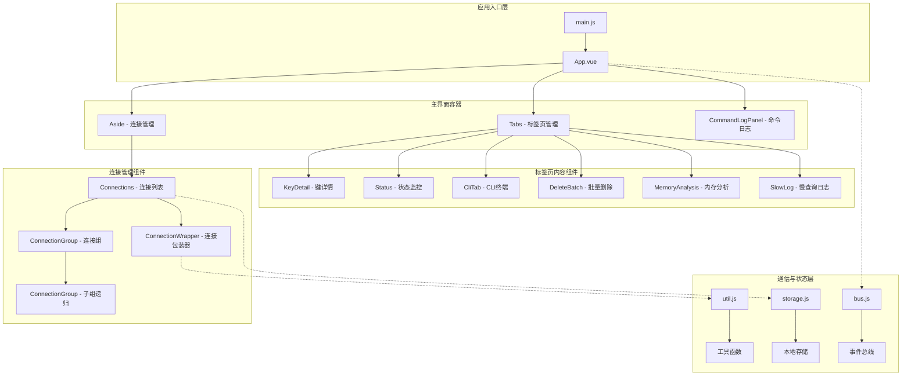

**图表来源**
- [App.vue](file://src/App.vue#L1-L110)
- [main.js](file://src/main.js#L1-L47)
- [bus.js](file://src/bus.js#L1-L19)

### 设计原则

1. **单一职责原则**: 每个组件专注于特定的功能领域
2. **组合优于继承**: 通过组件组合实现复杂功能
3. **数据驱动视图**: 基于状态变化自动更新界面
4. **松耦合高内聚**: 组件间通过事件和属性解耦

**章节来源**
- [App.vue](file://src/App.vue#L113-L150)
- [main.js](file://src/main.js#L16-L25)

## 核心组件分析

### App.vue - 应用根组件

App.vue 是整个应用的根组件，负责全局布局和导航控制。

#### 主要功能特性

- **导航系统**: 实现左侧导航栏的展开/收缩功能
- **路由控制**: 切换服务器连接视图和命令历史视图
- **拖拽调整**: 支持侧边栏宽度的动态调整
- **设置菜单**: 提供应用设置、关于信息等功能入口

#### 组件结构

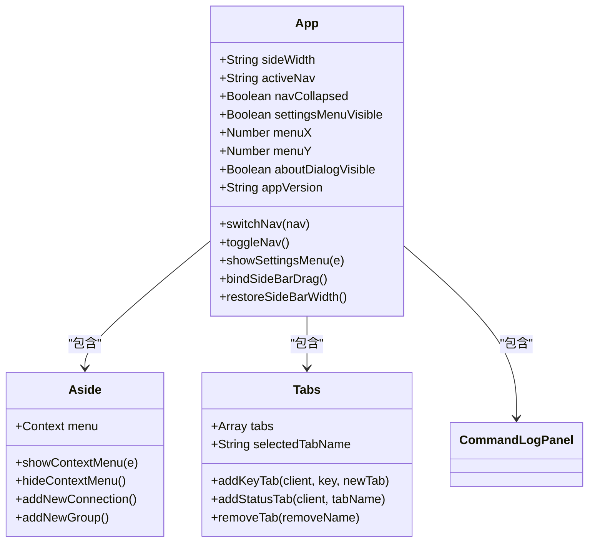

**图表来源**
- [App.vue](file://src/App.vue#L121-L235)
- [Aside.vue](file://src/Aside.vue#L48-L122)
- [Tabs.vue](file://src/components/Tabs.vue#L41-L108)

#### 关键实现细节

1. **导航状态管理**: 通过 `activeNav` 控制当前显示的主视图
2. **侧边栏交互**: 实现了拖拽调整宽度和折叠功能
3. **事件处理**: 集成了设置菜单的显示逻辑

**章节来源**
- [App.vue](file://src/App.vue#L121-L235)

### Aside.vue - 连接管理组件

Aside 组件是连接管理的核心容器，集成了多个相关功能组件。

#### 组件组合模式

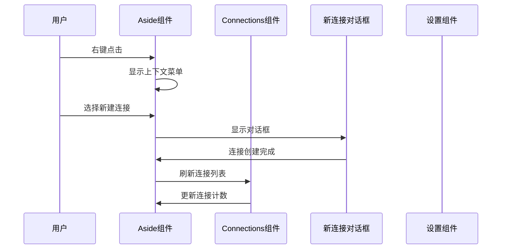

**图表来源**
- [Aside.vue](file://src/Aside.vue#L70-L118)
- [Connections.vue](file://src/components/Connections.vue#L148-L162)

#### 功能组件集成

Aside 组件通过组合模式集成了以下功能组件：

1. **Connections**: 连接列表展示
2. **NewConnectionDialog**: 新建连接对话框
3. **Setting**: 应用设置界面
4. **CommandLog**: 命令日志查看器
5. **HotKeys**: 快捷键提示
6. **CustomFormatter**: 自定义格式化器

**章节来源**
- [Aside.vue](file://src/Aside.vue#L41-L67)

### Tabs.vue - 标签页管理组件

Tabs 组件实现了复杂的多标签页管理系统，支持动态添加、关闭和切换标签页。

#### 标签页生命周期管理

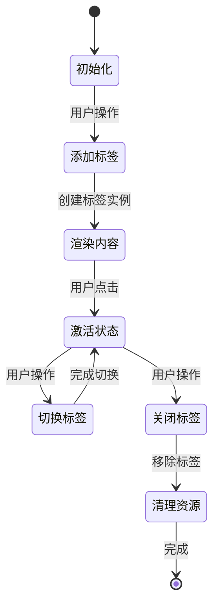

**图表来源**
- [Tabs.vue](file://src/components/Tabs.vue#L110-L132)

#### 标签页类型系统

Tabs 组件支持多种类型的标签页：

| 标签页类型 | 组件名称 | 功能描述 |
|-----------|----------|----------|
| 键详情 | KeyDetail | 展示 Redis 键的详细信息 |
| 状态监控 | Status | 显示 Redis 服务器状态信息 |
| CLI终端 | CliTab | 提供命令行交互界面 |
| 批量删除 | DeleteBatch | 批量删除 Redis 键 |
| 内存分析 | MemoryAnalysis | 分析 Redis 内存使用情况 |
| 慢查询日志 | SlowLog | 查看慢查询日志 |

**章节来源**
- [Tabs.vue](file://src/components/Tabs.vue#L1-L448)

## 组件通信机制

### 事件总线模式

项目采用 Vue 的事件总线模式实现组件间的跨层级通信。

#### 事件总线架构

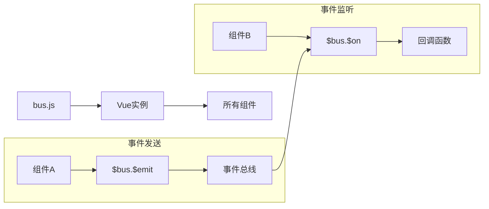

**图表来源**
- [bus.js](file://src/bus.js#L1-L19)

#### 通信场景分析

1. **连接管理通信**
   - `refreshConnections`: 刷新连接列表
   - `openConnection`: 打开指定连接
   - `closeConnection`: 关闭连接

2. **标签页通信**
   - `clickedKey`: 点击键触发新标签页
   - `openStatus`: 打开状态监控标签页
   - `removeAllTab`: 关闭所有标签页

3. **设置同步通信**
   - `reloadSettings`: 重新加载设置
   - `update-check`: 检查更新

**章节来源**
- [bus.js](file://src/bus.js#L1-L19)
- [Tabs.vue](file://src/components/Tabs.vue#L58-L93)

### Props 数据传递

组件间通过 props 进行父子关系的数据传递：

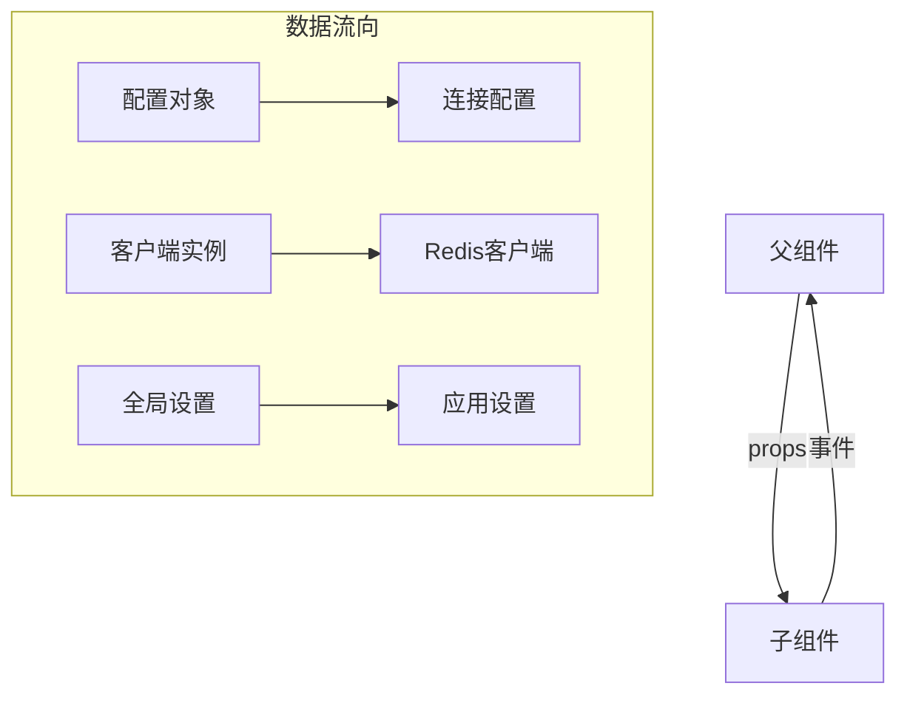

**图表来源**
- [ConnectionWrapper.vue](file://src/components/ConnectionWrapper.vue#L52-L53)
- [ConnectionGroup.vue](file://src/components/ConnectionGroup.vue#L158-L182)

## 数据流与状态管理

### 本地存储架构

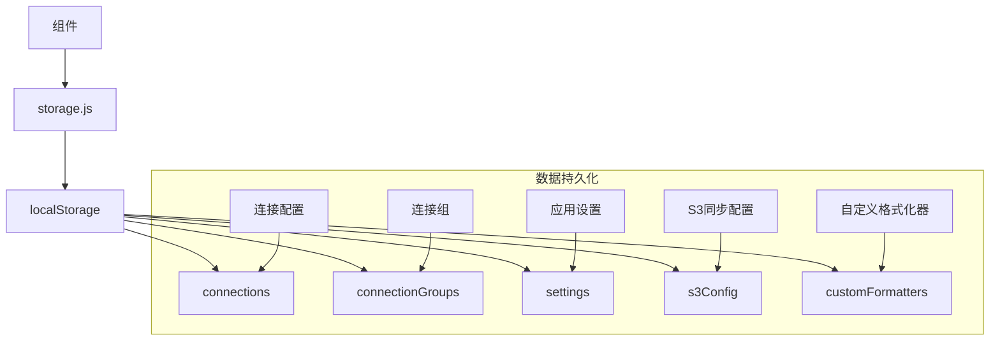

**图表来源**
- [storage.js](file://src/storage.js#L1-L200)

### 状态管理模式

1. **连接状态**: 通过 localStorage 持久化连接配置
2. **用户偏好**: 存储在 localStorage 中的应用设置
3. **临时状态**: 在组件内部管理的临时状态

**章节来源**
- [storage.js](file://src/storage.js#L185-L248)

## 组件复用策略

### 列表渲染模式

项目大量使用 Vue 的 v-for 指令实现列表渲染：

#### 连接组递归渲染

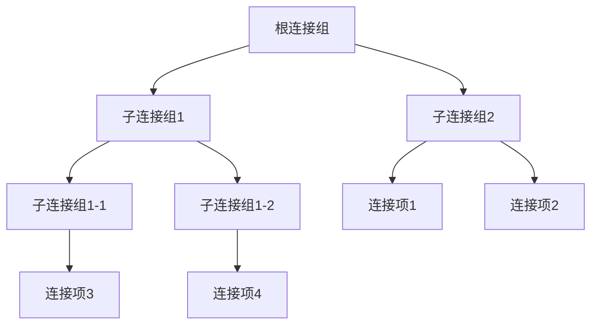

**图表来源**
- [Connections.vue](file://src/components/Connections.vue#L17-L28)
- [ConnectionGroup.vue](file://src/components/ConnectionGroup.vue#L19-L29)

#### 动态组件加载

KeyDetail 组件展示了动态组件加载的典型用法：

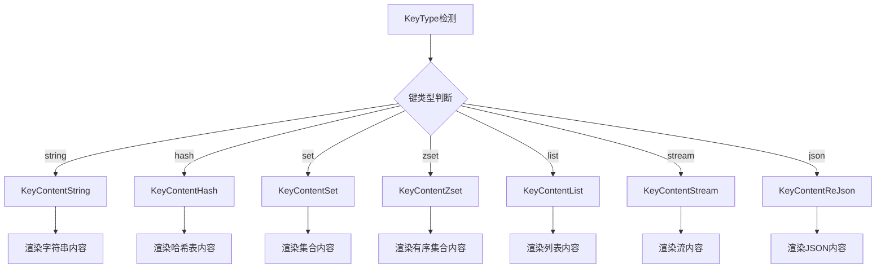

**图表来源**
- [KeyDetail.vue](file://src/components/KeyDetail.vue#L55-L80)

### 组件抽象与封装

1. **ConnectionWrapper**: 封装单个 Redis 连接的所有功能
2. **ConnectionGroup**: 封装连接组的递归展示逻辑
3. **KeyDetail**: 封装不同键类型的内容展示

**章节来源**
- [ConnectionWrapper.vue](file://src/components/ConnectionWrapper.vue#L37-L241)
- [ConnectionGroup.vue](file://src/components/ConnectionGroup.vue#L150-L402)

## 架构图表

### 完整组件关系图

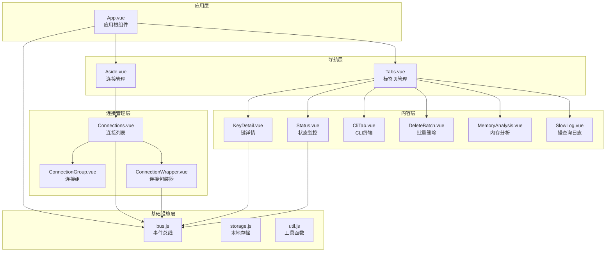

**图表来源**
- [App.vue](file://src/App.vue#L113-L150)
- [Aside.vue](file://src/Aside.vue#L41-L67)
- [Tabs.vue](file://src/components/Tabs.vue#L33-L50)

### 数据流向图

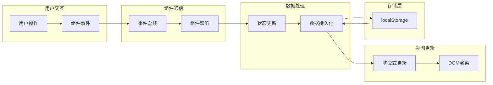

**图表来源**
- [bus.js](file://src/bus.js#L1-L19)
- [storage.js](file://src/storage.js#L185-L248)

## 总结

Another Redis Desktop Manager 的组件架构展现了现代前端应用的最佳实践：

### 架构优势

1. **清晰的职责分离**: 每个组件都有明确的功能边界
2. **良好的可扩展性**: 通过组合模式轻松添加新功能
3. **高效的通信机制**: 事件总线确保组件间松耦合通信
4. **强大的复用能力**: 通过列表渲染和动态组件实现高效复用

### 技术亮点

- **递归组件设计**: ConnectionGroup 实现了树形结构的优雅处理
- **动态组件加载**: KeyDetail 展示了根据数据类型动态选择组件的能力
- **响应式状态管理**: 基于 Vue 的响应式系统实现数据驱动的界面更新
- **模块化设计**: 各组件相对独立，便于维护和测试

这种架构设计不仅保证了应用的稳定性和可维护性，也为未来的功能扩展奠定了坚实的基础。通过合理的组件拆分和通信机制，开发者可以快速添加新功能，同时保持代码的整洁和可读性。