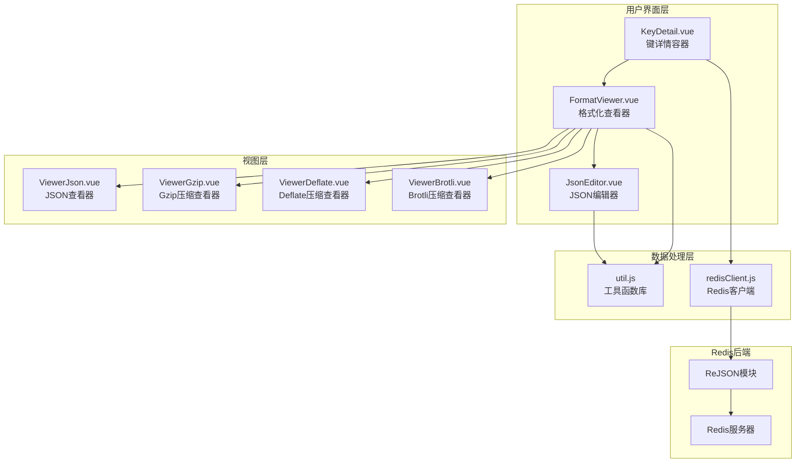
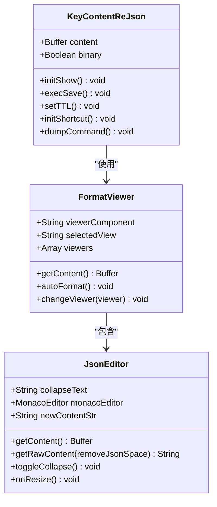
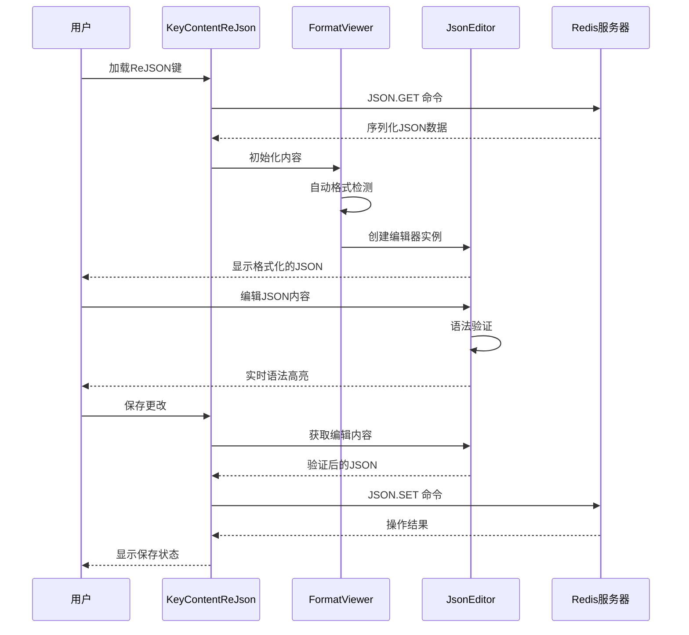
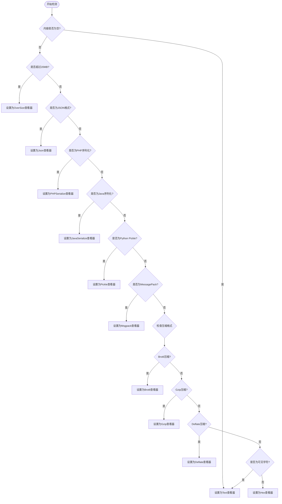
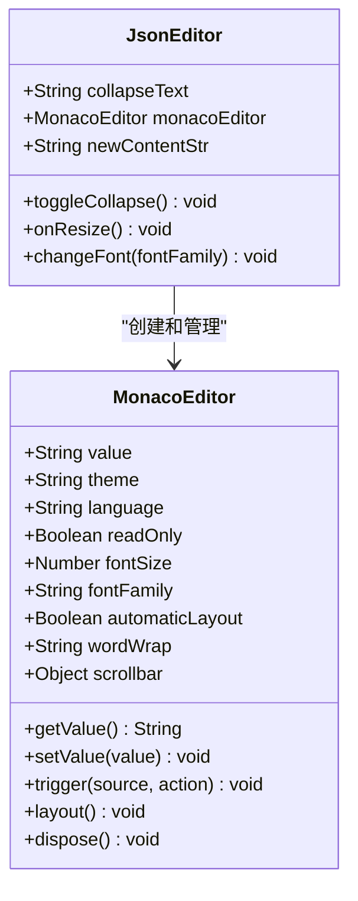
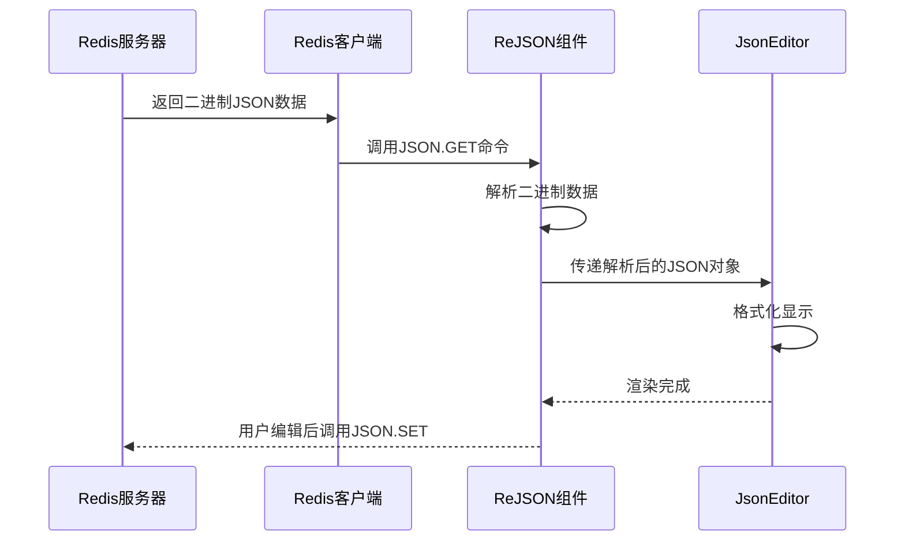
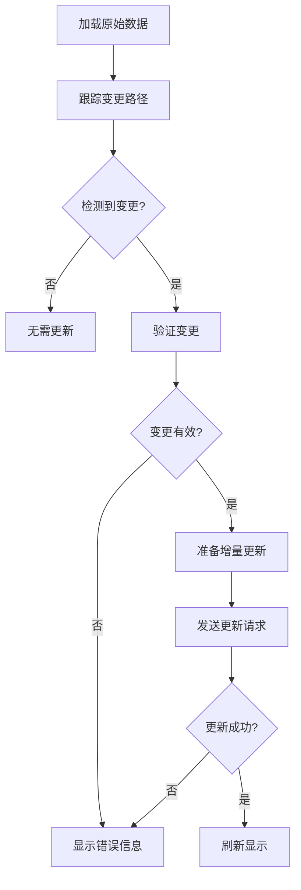
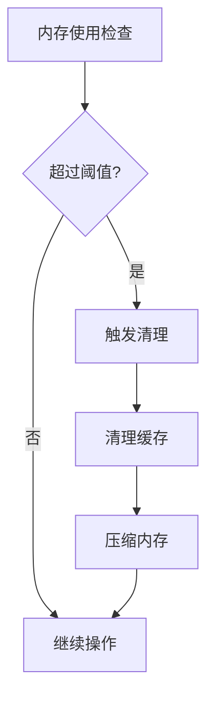

# ReJSON操作深度文档

<cite>
**本文档中引用的文件**
- [KeyContentReJson.vue](file://src/components/contents/KeyContentReJson.vue)
- [KeyDetail.vue](file://src/components/KeyDetail.vue)
- [FormatViewer.vue](file://src/components/FormatViewer.vue)
- [JsonEditor.vue](file://src/components/JsonEditor.vue)
- [util.js](file://src/util.js)
- [redisClient.js](file://src/redisClient.js)
- [ViewerJson.vue](file://src/components/viewers/ViewerJson.vue)
- [ViewerGzip.vue](file://src/components/viewers/ViewerGzip.vue)
- [ViewerDeflate.vue](file://src/components/viewers/ViewerDeflate.vue)
- [ViewerBrotli.vue](file://src/components/viewers/ViewerBrotli.vue)
- [ViewerMsgpack.vue](file://src/components/viewers/ViewerMsgpack.vue)
</cite>

## 目录
1. [简介](#简介)
2. [项目架构概览](#项目架构概览)
3. [核心组件分析](#核心组件分析)
4. [ReJSON类型识别机制](#rejson类型识别机制)
5. [JSON树形结构可视化](#json树形结构可视化)
6. [编辑器功能特性](#编辑器功能特性)
7. [数据处理流程](#数据处理流程)
8. [语法高亮与格式校验](#语法高亮与格式校验)
9. [实践示例](#实践示例)
10. [性能优化策略](#性能优化策略)
11. [故障排除指南](#故障排除指南)
12. [总结](#总结)

## 简介

ReJSON是Redis的一个模块，提供了对JSON数据类型的支持。在Another Redis Desktop Manager中，ReJSON操作通过专门的组件实现了复杂的JSON数据可视化、编辑和管理功能。本文档深入分析了ReJSON数据类型的特殊处理逻辑，包括树形结构展示、语法高亮、格式校验、错误提示等核心功能。

## 项目架构概览

系统采用模块化架构设计，ReJSON相关功能分布在多个组件中：



**图表来源**
- [KeyDetail.vue](file://src/components/KeyDetail.vue#L1-L159)
- [FormatViewer.vue](file://src/components/FormatViewer.vue#L1-L294)
- [JsonEditor.vue](file://src/components/JsonEditor.vue#L1-L239)

## 核心组件分析

### KeyContentReJson.vue - 主要编辑组件

KeyContentReJson.vue是ReJSON操作的核心组件，负责处理JSON数据的显示和编辑：



**图表来源**
- [KeyContentReJson.vue](file://src/components/contents/KeyContentReJson.vue#L22-L103)
- [FormatViewer.vue](file://src/components/FormatViewer.vue#L56-L257)
- [JsonEditor.vue](file://src/components/JsonEditor.vue#L15-L239)

**章节来源**
- [KeyContentReJson.vue](file://src/components/contents/KeyContentReJson.vue#L1-L103)
- [FormatViewer.vue](file://src/components/FormatViewer.vue#L1-L294)
- [JsonEditor.vue](file://src/components/JsonEditor.vue#L1-L239)

### 数据流处理机制

ReJSON组件的数据处理遵循严格的流程：



**图表来源**
- [KeyContentReJson.vue](file://src/components/contents/KeyContentReJson.vue#L35-L70)
- [FormatViewer.vue](file://src/components/FormatViewer.vue#L172-L228)
- [JsonEditor.vue](file://src/components/JsonEditor.vue#L53-L72)

## ReJSON类型识别机制

### 类型映射表

KeyDetail.vue中的componentName计算逻辑实现了ReJSON类型的精确识别：

| Redis数据类型 | 组件名称 | 备注 |
|--------------|----------|------|
| `ReJSON-RL` | KeyContentReJson | 标准ReJSON模块 |
| `json` | KeyContentReJson | Upstash兼容 |
| `tair-json` | KeyContentReJson | Tair云服务 |

**章节来源**
- [KeyDetail.vue](file://src/components/KeyDetail.vue#L60-L75)

### 自动格式检测算法

FormatViewer组件实现了智能的自动格式检测机制：



**图表来源**
- [FormatViewer.vue](file://src/components/FormatViewer.vue#L172-L228)

**章节来源**
- [FormatViewer.vue](file://src/components/FormatViewer.vue#L172-L228)

## JSON树形结构可视化

### Monaco Editor集成

JsonEditor组件基于Monaco Editor提供了强大的JSON编辑功能：



**图表来源**
- [JsonEditor.vue](file://src/components/JsonEditor.vue#L96-L148)

### 节点展开/折叠功能

JsonEditor提供了智能的节点展开/折叠控制：

| 功能 | 快捷键 | 实现方式 |
|------|--------|----------|
| 展开所有节点 | 默认 | `editor.unfoldAll` |
| 折叠所有节点 | 默认 | `editor.foldAll` |
| 切换状态 | 点击按钮 | 触发相应编辑器动作 |

**章节来源**
- [JsonEditor.vue](file://src/components/JsonEditor.vue#L74-L78)

## 编辑器功能特性

### 语法高亮配置

JsonEditor实现了丰富的语法高亮方案：

| 语法元素 | 颜色代码 | CSS类名 |
|----------|----------|---------|
| JSON键名 | #111111 (深色) / #ebebec (浅色) | `.mtk4` |
| 字符串值 | #42b983 | `.mtk5` |
| 数字值 | #fc1e70 | `.mtk6` |
| 括号符号 | #111111 (深色) / #b6b6b9 (浅色) | `.mtk9` |
| 其他字符串 | #606266 (深色) / #f3f3f4 (浅色) | `.mtk1` |

### 键盘快捷键支持

系统提供了完整的键盘快捷键支持：

| 快捷键组合 | 功能 | 实现位置 |
|------------|------|----------|
| Ctrl+S | 保存当前编辑 | KeyContentReJson |
| ⌘+S | 保存当前编辑 | KeyContentReJson |
| 点击折叠按钮 | 展开/折叠所有节点 | JsonEditor |

**章节来源**
- [JsonEditor.vue](file://src/components/JsonEditor.vue#L156-L238)
- [KeyContentReJson.vue](file://src/components/contents/KeyContentReJson.vue#L80-L88)

## 数据处理流程

### 序列化数据解析

ReJSON组件需要处理Redis返回的二进制序列化数据：



**图表来源**
- [KeyContentReJson.vue](file://src/components/contents/KeyContentReJson.vue#L35-L42)

### 变更路径追踪

系统实现了增量更新策略，确保只发送必要的变更：



**图表来源**
- [KeyContentReJson.vue](file://src/components/contents/KeyContentReJson.vue#L40-L70)

**章节来源**
- [KeyContentReJson.vue](file://src/components/contents/KeyContentReJson.vue#L35-L70)

## 语法高亮与格式校验

### JSON格式验证

util.js中的isJson函数提供了可靠的JSON格式验证：

```javascript
// JSON格式验证逻辑
isJson(string) {
  try {
    const obj = JSON.parse(string);
    return !!obj && typeof obj === 'object';
  } catch (e) {}
  return false;
}
```

### 错误处理机制

系统实现了多层次的错误处理：

| 错误类型 | 处理方式 | 用户反馈 |
|----------|----------|----------|
| JSON格式错误 | 显示错误消息 | `$t('message.json_format_failed')` |
| 网络连接错误 | 显示网络错误 | 弹出错误对话框 |
| 权限不足 | 显示权限错误 | 提示用户检查权限 |
| 内存溢出 | 显示容量限制 | 提示文件过大 |

**章节来源**
- [util.js](file://src/util.js#L81-L88)
- [KeyContentReJson.vue](file://src/components/contents/KeyContentReJson.vue#L48-L69)

## 实践示例

### 复杂嵌套JSON对象编辑

以下是一个典型的ReJSON操作场景：

1. **加载大型JSON文档**
   - 支持超过20MB的大文件处理
   - 自动检测文件格式
   - 分块加载避免内存溢出

2. **树形导航编辑**
   - 层级结构清晰展示
   - 支持快速跳转到任意层级
   - 实时语法验证

3. **批量操作支持**
   - 支持字段的新增、删除、修改
   - 批量导入导出功能
   - 版本控制和回滚机制

### 性能优化实践

系统采用了多种性能优化策略：

| 优化技术 | 应用场景 | 效果 |
|----------|----------|------|
| 虚拟滚动 | 大型数组显示 | 减少DOM节点数量 |
| 延迟加载 | 深层嵌套结构 | 按需加载子节点 |
| 缓存机制 | 频繁访问的数据 | 减少重复计算 |
| 防抖处理 | 用户输入事件 | 减少不必要的验证 |

## 性能优化策略

### 内存管理

系统实现了智能的内存管理策略：



### 渲染优化

JsonEditor组件采用了多项渲染优化技术：

- **增量渲染**：只重新渲染变更的部分
- **虚拟化**：大量数据时使用虚拟滚动
- **懒加载**：深层嵌套结构按需加载
- **防抖处理**：减少频繁的重绘操作

**章节来源**
- [JsonEditor.vue](file://src/components/JsonEditor.vue#L79-L88)

## 故障排除指南

### 常见问题及解决方案

| 问题描述 | 可能原因 | 解决方案 |
|----------|----------|----------|
| JSON格式错误 | 数据损坏或编码问题 | 检查数据完整性，重新加载 |
| 编辑器无响应 | 文件过大或内存不足 | 分割文件或增加内存限制 |
| 保存失败 | 权限问题或网络中断 | 检查权限设置和网络连接 |
| 样式异常 | 浏览器兼容性问题 | 更新浏览器版本 |

### 调试技巧

1. **启用开发者工具**：使用浏览器开发工具检查控制台错误
2. **日志记录**：利用Vue的事件总线记录操作日志
3. **断点调试**：在关键函数设置断点进行逐步调试
4. **性能分析**：使用浏览器性能工具分析渲染性能

**章节来源**
- [KeyContentReJson.vue](file://src/components/contents/KeyContentReJson.vue#L67-L69)

## 总结

Another Redis Desktop Manager中的ReJSON操作功能体现了现代Web应用的复杂性和专业性。通过精心设计的组件架构、智能的数据处理流程和完善的错误处理机制，系统成功地解决了ReJSON数据类型的各种挑战。

### 核心优势

1. **类型识别准确**：通过多层检测机制确保正确的组件选择
2. **用户体验优秀**：提供直观的树形结构和实时编辑功能
3. **性能表现优异**：采用多种优化策略确保大文件处理能力
4. **错误处理完善**：多层次的错误检测和用户友好的反馈机制

### 技术亮点

- **Monaco Editor集成**：提供专业的代码编辑体验
- **智能格式检测**：自动识别各种数据格式
- **增量更新策略**：高效的变更处理机制
- **响应式设计**：适应不同屏幕尺寸和设备

这个ReJSON操作系统的实现展示了如何在前端技术栈中处理复杂的数据库操作，为开发者提供了宝贵的参考价值。通过深入理解这些设计模式和技术实现，开发者可以更好地构建类似的高级数据管理工具。