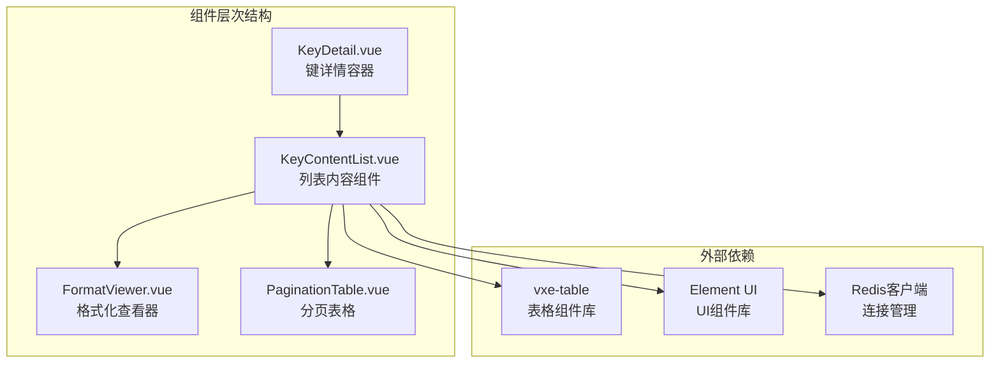
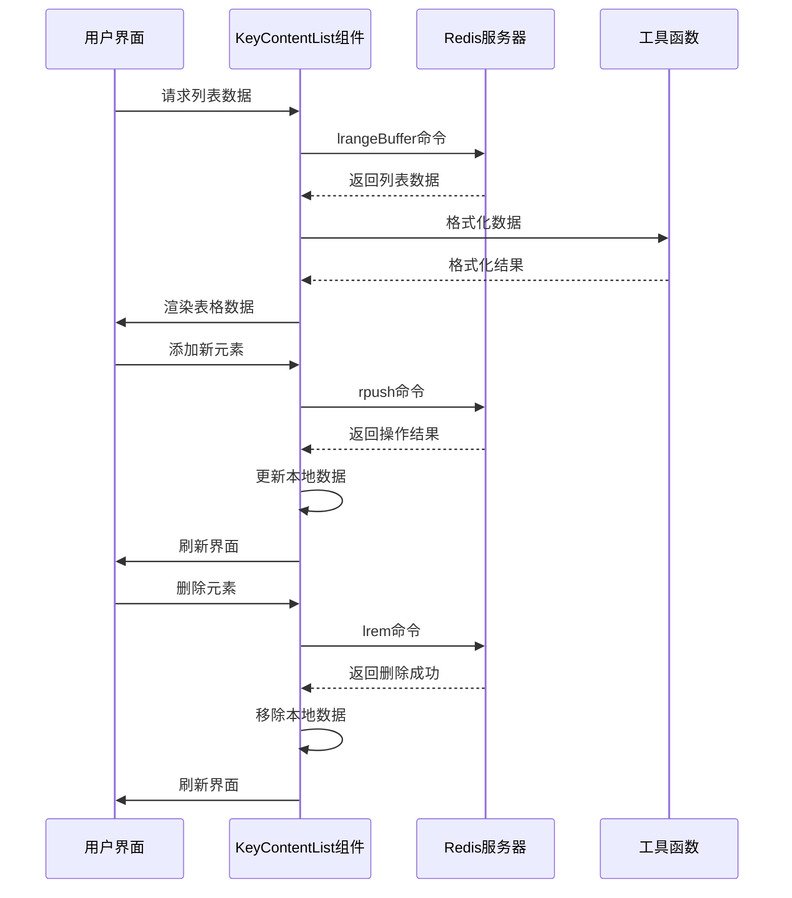
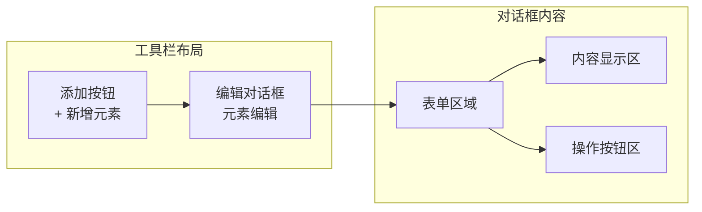
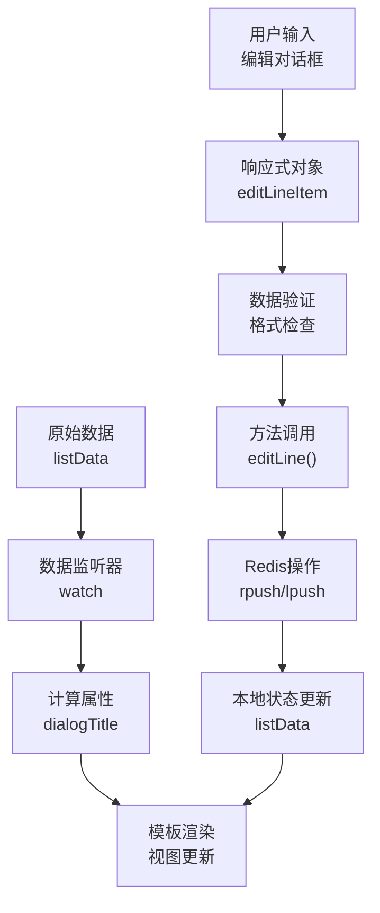
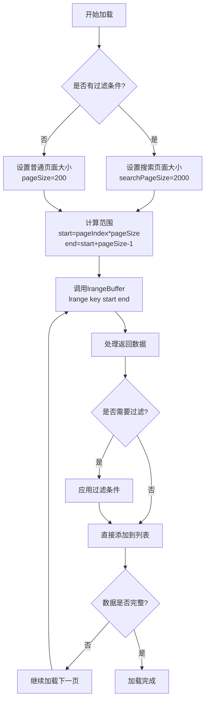
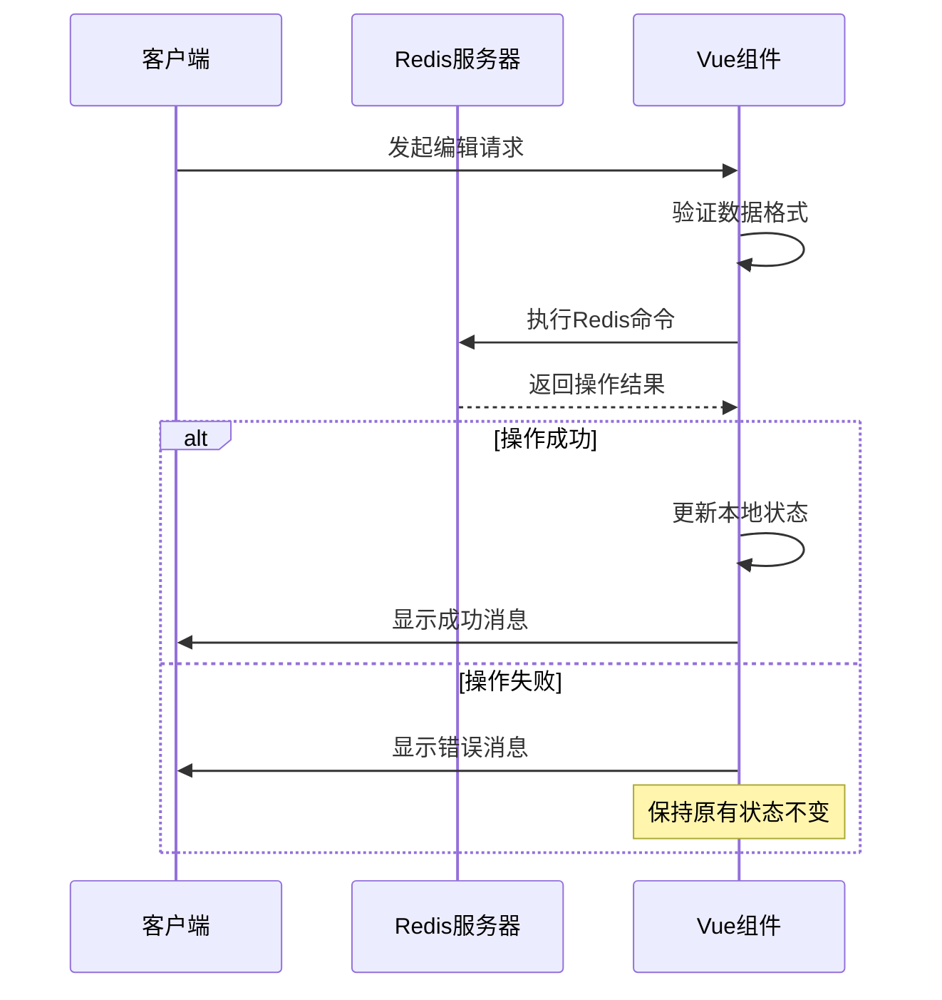
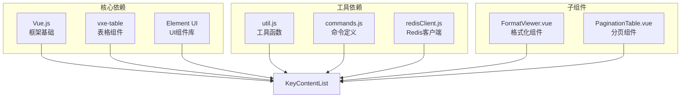

# 列表(List)操作

<cite>
**本文档中引用的文件**
- [KeyContentList.vue](file://src/components/contents/KeyContentList.vue)
- [commands.js](file://src/commands.js)
- [redisClient.js](file://src/redisClient.js)
- [util.js](file://src/util.js)
- [FormatViewer.vue](file://src/components/FormatViewer.vue)
- [PaginationTable.vue](file://src/components/PaginationTable.vue)
- [KeyDetail.vue](file://src/components/KeyDetail.vue)
</cite>

## 目录
1. [简介](#简介)
2. [项目结构](#项目结构)
3. [核心组件](#核心组件)
4. [架构概览](#架构概览)
5. [详细组件分析](#详细组件分析)
6. [依赖关系分析](#依赖关系分析)
7. [性能考虑](#性能考虑)
8. [故障排除指南](#故障排除指南)
9. [结论](#结论)

## 简介

Redis列表(List)是一种有序的数据结构，支持在两端进行高效的插入和删除操作。本文档全面分析了Another Redis Desktop Manager中KeyContentList.vue组件的列表操作功能，该组件提供了完整的Redis列表类型数据的可视化管理界面，包括浏览、添加、删除列表元素等核心功能。

该组件实现了对Redis列表的完整CRUD操作，支持LPUSH、RPUSH、LREM、LPOP、RPOP、LINDEX、LLEN、LRANGE等Redis命令的可视化映射，并提供了高效的分页加载策略以支持大型列表的渲染。

## 项目结构

KeyContentList.vue组件位于项目的contents目录下，作为Redis键值类型展示组件的一部分，与其他类型组件如Hash、Set、Zset等共同构成了完整的Redis数据类型管理界面。

**图表来源**
- [KeyContentList.vue](file://src/components/contents/KeyContentList.vue#L1-L296)
- [FormatViewer.vue](file://src/components/viewers/FormatViewer.vue#L1-L100)

**章节来源**
- [KeyContentList.vue](file://src/components/contents/KeyContentList.vue#L1-L50)

## 核心组件

### KeyContentList.vue 组件架构

KeyContentList.vue是Redis列表操作的核心组件，采用Vue.js框架构建，提供了完整的列表数据管理功能。

#### 主要数据结构

组件维护以下核心状态：
- `listData`: 当前显示的列表数据数组
- `total`: 列表总元素数量
- `filterValue`: 搜索过滤值
- `editDialog`: 编辑对话框显示状态
- `pageSize/searchPageSize`: 分页大小配置
- `pageIndex`: 当前页码索引

#### 关键方法

组件实现了以下核心方法：

1. **初始化方法**: `initShow()` - 初始化列表显示
2. **扫描方法**: `listScan()` - 分页扫描列表数据
3. **编辑方法**: `editLine()` - 处理列表项编辑
4. **删除方法**: `deleteLine()` - 删除指定列表项
5. **加载更多**: `loadMore()` - 加载更多列表数据

**章节来源**
- [KeyContentList.vue](file://src/components/contents/KeyContentList.vue#L77-L296)

## 架构概览

### 数据流架构

**图表来源**
- [KeyContentList.vue](file://src/components/contents/KeyContentList.vue#L114-L286)
- [redisClient.js](file://src/redisClient.js#L1-L200)

### 命令映射关系

| Redis命令 | Vue方法 | 功能描述 |
|-----------|---------|----------|
| `LPUSH` | `editLine()` | 在列表头部插入元素 |
| `RPUSH` | `editLine()` | 在列表尾部追加元素 |
| `LREM` | `deleteLine()` | 从列表中移除指定元素 |
| `LPOP` | `deleteLine()` | 从列表头部弹出元素 |
| `RPOP` | `deleteLine()` | 从列表尾部弹出元素 |
| `LINDEX` | - | 获取列表中指定索引的元素（通过LRANGE实现） |
| `LLEN` | `initTotal()` | 获取列表长度 |
| `LRANGE` | `listScan()` | 范围查询列表元素 |

**章节来源**
- [KeyContentList.vue](file://src/components/contents/KeyContentList.vue#L114-L286)
- [commands.js](file://src/commands.js#L110-L161)

## 详细组件分析

### 界面结构分析

#### 表格工具栏

**图表来源**
- [KeyContentList.vue](file://src/components/contents/KeyContentList.vue#L6-L20)

#### 表格列定义

组件使用vxe-table组件构建数据表格，包含以下列：

1. **序号列**: 显示元素索引和总数
2. **值列**: 显示列表元素内容，支持截断显示
3. **操作列**: 提供复制、编辑、删除、导出功能

**章节来源**
- [KeyContentList.vue](file://src/components/contents/KeyContentList.vue#L34-L55)

### 双向数据绑定实现

#### Vue响应式系统集成

组件通过Vue的响应式系统实现双向数据绑定：

**图表来源**
- [KeyContentList.vue](file://src/components/contents/KeyContentList.vue#L77-L112)

#### 数据同步机制

组件实现了本地数据与Redis服务器的数据同步：

1. **写入操作**: 先更新本地状态，再发送Redis命令
2. **读取操作**: 通过分页加载避免一次性加载大量数据
3. **错误处理**: 操作失败时回滚本地状态变更

**章节来源**
- [KeyContentList.vue](file://src/components/contents/KeyContentList.vue#L202-L257)

### 分页加载策略

#### 游标机制

**图表来源**
- [KeyContentList.vue](file://src/components/contents/KeyContentList.vue#L123-L167)

#### 性能优化策略

1. **智能分页**: 根据过滤条件动态调整页面大小
2. **增量加载**: 使用oneTimeListLength控制加载节奏
3. **滚动优化**: 自动滚动到底部，提升用户体验

**章节来源**
- [KeyContentList.vue](file://src/components/contents/KeyContentList.vue#L123-L167)

### 列表操作的原子性保证

#### Redis事务支持

虽然当前实现没有显式的Redis事务，但通过以下机制保证操作的原子性：

**图表来源**
- [KeyContentList.vue](file://src/components/contents/KeyContentList.vue#L202-L257)

#### 异常处理机制

组件实现了多层次的异常处理：

1. **网络层异常**: Redis连接失败或超时
2. **命令层异常**: Redis命令执行错误
3. **业务层异常**: 数据验证失败或业务逻辑错误

**章节来源**
- [KeyContentList.vue](file://src/components/contents/KeyContentList.vue#L163-L167)
- [KeyContentList.vue](file://src/components/contents/KeyContentList.vue#L241-L242)

### 用户操作指南

#### 浏览列表元素

1. **初始加载**: 组件自动加载前200个元素
2. **滚动加载**: 向下滚动时自动加载更多数据
3. **搜索过滤**: 在操作列输入框中输入关键字过滤显示

#### 添加新元素

1. 点击"添加新元素"按钮
2. 在弹出的对话框中输入或粘贴元素内容
3. 点击确认按钮，元素将被追加到列表末尾

#### 删除列表元素

1. 在操作列点击删除按钮
2. 系统弹出确认对话框
3. 确认后删除指定元素

#### 编辑列表元素

1. 在操作列点击编辑按钮
2. 修改元素内容
3. 点击确认保存更改

**章节来源**
- [KeyContentList.vue](file://src/components/contents/KeyContentList.vue#L189-L201)
- [KeyContentList.vue](file://src/components/contents/KeyContentList.vue#L259-L286)

## 依赖关系分析

### 组件依赖图

**图表来源**
- [KeyContentList.vue](file://src/components/contents/KeyContentList.vue#L74-L76)
- [redisClient.js](file://src/redisClient.js#L1-L50)

### 外部库集成

#### vxe-table集成

组件集成了vxe-table表格组件，提供以下功能：
- 虚拟滚动支持
- 行高亮效果
- 列宽调整
- 排序功能

#### Element UI集成

利用Element UI提供统一的UI组件：
- 对话框组件
- 按钮组件
- 输入框组件
- 消息提示组件

**章节来源**
- [KeyContentList.vue](file://src/components/contents/KeyContentList.vue#L74-L76)

## 性能考虑

### 大型列表优化

#### 内存管理

1. **懒加载**: 只加载可见区域的数据
2. **虚拟滚动**: 使用vxe-table的虚拟滚动功能
3. **数据压缩**: 对大数据量元素进行截断显示

#### 网络优化

1. **批量操作**: 减少网络往返次数
2. **缓存策略**: 缓存频繁访问的数据
3. **连接复用**: 复用Redis连接

### 响应性优化

1. **异步加载**: 所有网络操作都是异步的
2. **进度指示**: 显示加载状态和图标
3. **错误恢复**: 操作失败时提供重试机制

## 故障排除指南

### 常见问题及解决方案

#### 连接问题

**问题**: 无法连接到Redis服务器
**解决方案**: 
- 检查网络连接
- 验证Redis服务器状态
- 确认认证信息正确

#### 数据加载问题

**问题**: 列表数据加载缓慢
**解决方案**:
- 减少同时加载的数据量
- 使用更精确的搜索条件
- 检查Redis服务器性能

#### 操作失败问题

**问题**: 添加或删除操作失败
**解决方案**:
- 检查数据格式是否正确
- 验证Redis权限设置
- 查看错误日志获取详细信息

**章节来源**
- [KeyContentList.vue](file://src/components/contents/KeyContentList.vue#L163-L167)
- [KeyContentList.vue](file://src/components/contents/KeyContentList.vue#L241-L242)

### 调试技巧

1. **浏览器开发者工具**: 检查网络请求和JavaScript错误
2. **Redis监控**: 使用Redis自带的监控功能
3. **日志分析**: 查看应用日志和Redis日志

## 结论

KeyContentList.vue组件为Redis列表类型数据提供了完整的可视化管理功能。通过Vue.js的响应式系统和vxe-table组件库，实现了高效的数据展示和交互体验。

### 主要特性总结

1. **完整的CRUD操作**: 支持列表的所有基本操作
2. **高效的分页加载**: 支持大型列表的流畅浏览
3. **实时数据同步**: 本地状态与服务器状态保持一致
4. **友好的用户界面**: 直观的操作界面和反馈机制
5. **健壮的错误处理**: 多层次的异常处理和恢复机制

### 技术亮点

- **双向数据绑定**: 实现了Vue响应式系统的完美集成
- **虚拟滚动**: 通过vxe-table提供高性能的列表渲染
- **智能分页**: 根据数据量和用户需求动态调整加载策略
- **格式化支持**: 集成FormatViewer提供多种数据格式的展示

该组件的设计充分体现了现代Web应用开发的最佳实践，为Redis数据库的可视化管理提供了可靠的技术基础。