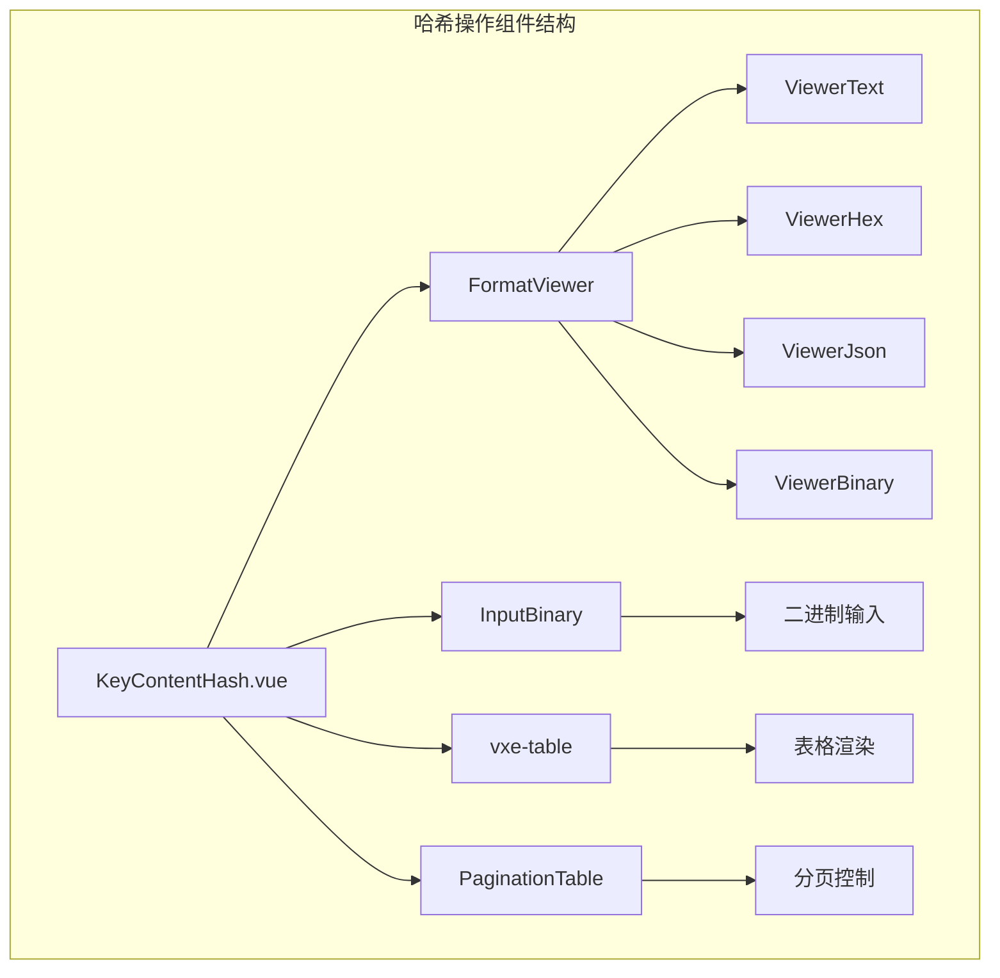
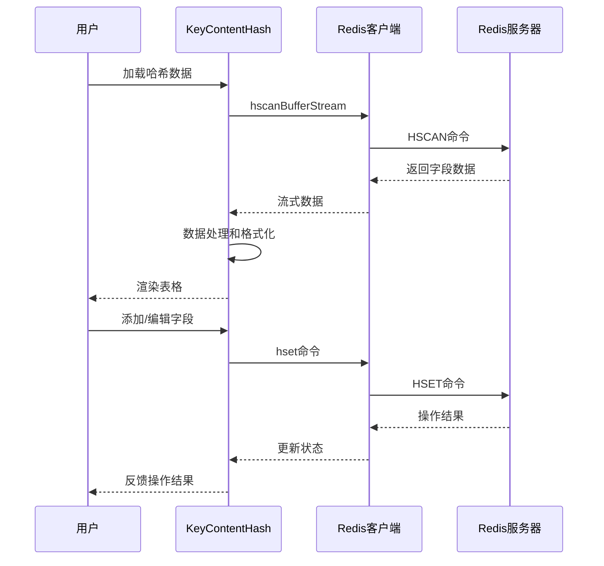
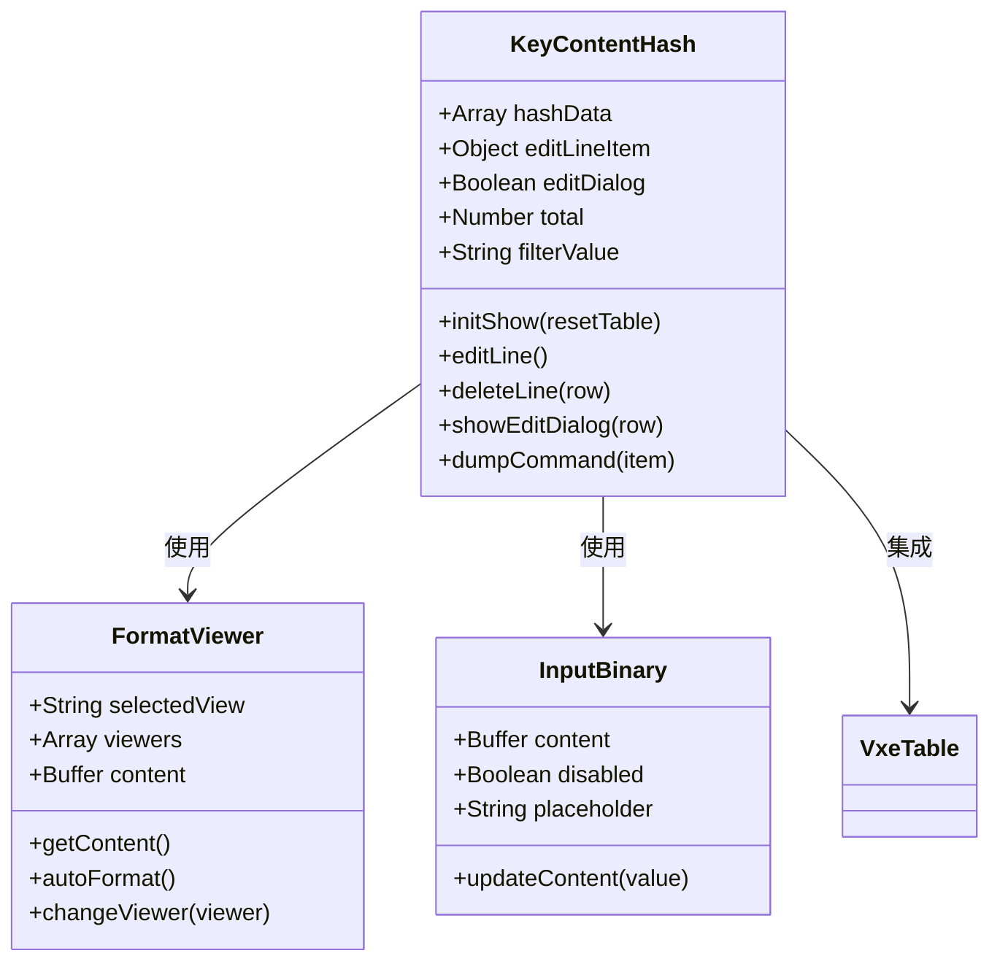
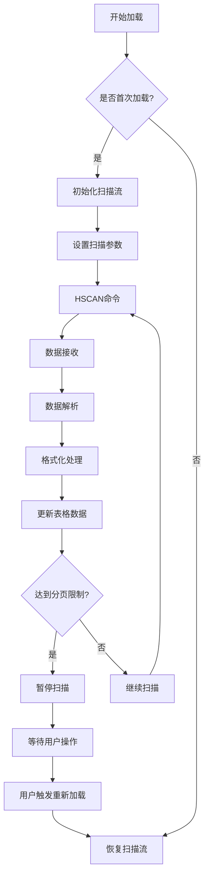

# 哈希(Hash)操作

<cite>
**本文档中引用的文件**
- [KeyContentHash.vue](file://src/components/contents/KeyContentHash.vue)
- [PaginationTable.vue](file://src/components/PaginationTable.vue)
- [FormatViewer.vue](file://src/components/FormatViewer.vue)
- [InputBinary.vue](file://src/components/InputBinary.vue)
- [redisClient.js](file://src/redisClient.js)
- [util.js](file://src/util.js)
- [commands.js](file://src/commands.js)
- [OperateItem.vue](file://src/components/OperateItem.vue)
</cite>

## 目录
1. [简介](#简介)
2. [项目结构](#项目结构)
3. [核心组件](#核心组件)
4. [架构概览](#架构概览)
5. [详细组件分析](#详细组件分析)
6. [Redis命令交互](#redis命令交互)
7. [性能优化策略](#性能优化策略)
8. [使用场景示例](#使用场景示例)
9. [故障排除指南](#故障排除指南)
10. [总结](#总结)

## 简介

Redis哈希类型操作是AnotherRedisDesktopManager中的重要功能模块，提供了对Redis哈希键的完整CRUD操作支持。该系统通过KeyContentHash.vue组件实现了直观的字段增删改查交互界面，支持批量操作、虚拟滚动优化和多种数据格式的自动识别。

## 项目结构

KeyContentHash.vue组件位于`src/components/contents/`目录下，作为Redis键内容展示的核心组件之一，负责处理哈希类型的数据显示和用户交互。



**图表来源**
- [KeyContentHash.vue](file://src/components/contents/KeyContentHash.vue#L1-L334)
- [FormatViewer.vue](file://src/components/FormatViewer.vue#L1-L200)
- [InputBinary.vue](file://src/components/InputBinary.vue#L1-L47)

## 核心组件

### KeyContentHash.vue 主组件

主组件提供了完整的哈希操作界面，包括：
- 字段添加、编辑、删除功能
- 搜索过滤机制
- 分页加载支持
- TTL时间戳显示（Redis 7.4+）
- 批量操作支持

### FormatViewer 格式化查看器

负责处理不同数据格式的显示和编辑：
- 自动检测数据格式（JSON、二进制、十六进制等）
- 支持自定义格式化器
- 大小超过限制时的特殊处理

### InputBinary 二进制输入组件

专门处理二进制数据的输入：
- 支持文本和十六进制两种输入模式
- 自动转换缓冲区数据
- 错误处理和验证

**章节来源**
- [KeyContentHash.vue](file://src/components/contents/KeyContentHash.vue#L97-L334)
- [FormatViewer.vue](file://src/components/FormatViewer.vue#L38-L200)
- [InputBinary.vue](file://src/components/InputBinary.vue#L10-L47)

## 架构概览

系统采用响应式架构设计，通过Vue.js框架实现数据绑定和组件通信。



**图表来源**
- [KeyContentHash.vue](file://src/components/contents/KeyContentHash.vue#L185-L218)
- [redisClient.js](file://src/redisClient.js#L1-L200)

## 详细组件分析

### 表格化展示设计

组件使用vxe-table实现高性能的表格渲染，支持以下特性：

#### 字段列配置
- **ID列**: 显示字段序号和总数统计
- **Key列**: 显示字段名称，支持排序
- **Value列**: 显示字段值，支持截断显示
- **TTL列**: 显示过期时间（仅Redis 7.4+支持）

#### 操作列功能
- **复制**: 复制字段值到剪贴板
- **编辑**: 弹出对话框编辑字段
- **删除**: 删除指定字段
- **导出**: 将命令导出到剪贴板



**图表来源**
- [KeyContentHash.vue](file://src/components/contents/KeyContentHash.vue#L104-L122)
- [FormatViewer.vue](file://src/components/FormatViewer.vue#L56-L106)
- [InputBinary.vue](file://src/components/InputBinary.vue#L11-L38)

### 虚拟滚动优化

系统实现了智能的虚拟滚动机制，通过流式加载避免一次性加载大量数据：

#### 分页加载策略
- **默认分页大小**: 200条记录
- **搜索分页大小**: 2000条记录（提高搜索效率）
- **流式处理**: 使用hscanBufferStream实现渐进式加载

#### 性能监控
- 实时监控加载进度
- 自动暂停/恢复加载
- 错误处理和重试机制

**章节来源**
- [KeyContentHash.vue](file://src/components/contents/KeyContentHash.vue#L113-L117)
- [KeyContentHash.vue](file://src/components/contents/KeyContentHash.vue#L185-L218)

### 搜索过滤功能

提供强大的搜索和过滤能力：

#### 搜索机制
- 支持通配符匹配（*）
- 实时搜索反馈
- 加载图标指示搜索状态

#### 过滤条件
- 字段名称匹配
- 字段值匹配
- 组合条件过滤

**章节来源**
- [KeyContentHash.vue](file://src/components/contents/KeyContentHash.vue#L231-L233)
- [KeyContentHash.vue](file://src/components/contents/KeyContentHash.vue#L66-L71)

## Redis命令交互

### 核心命令映射

系统通过Redis客户端封装了哈希操作的核心命令：

| 命令 | 功能 | 参数 | 返回值 |
|------|------|------|--------|
| HSET | 设置字段值 | key field value | 1新字段/0已存在 |
| HGET | 获取字段值 | key field | 字段值 |
| HGETALL | 获取所有字段 | key | 字段数组 |
| HDEL | 删除字段 | key field [field...] | 删除的字段数 |
| HLEN | 获取字段数量 | key | 字段总数 |
| HSCAN | 扫描字段 | key cursor [MATCH pattern] [COUNT count] | 字段数组 |
| HEXPIRE | 设置字段过期时间 | key ttl FIELDS count field | 成功/失败 |

### 数据流处理



**图表来源**
- [KeyContentHash.vue](file://src/components/contents/KeyContentHash.vue#L146-L172)
- [KeyContentHash.vue](file://src/components/contents/KeyContentHash.vue#L185-L218)

### TTL支持（Redis 7.4+）

对于支持TTL功能的Redis版本（>= 7.4），系统提供字段级别的过期时间管理：

#### TTL查询机制
- 批量查询多个字段的TTL
- 异步更新表格中的TTL显示
- 支持动态设置字段过期时间

**章节来源**
- [KeyContentHash.vue](file://src/components/contents/KeyContentHash.vue#L129-L132)
- [KeyContentHash.vue](file://src/components/contents/KeyContentHash.vue#L173-L183)

## 性能优化策略

### 虚拟滚动实现

系统采用先进的虚拟滚动技术优化大数据集显示：

#### 滚动优化机制
- **智能滚动**: 新增数据时自动滚动到底部
- **内存管理**: 及时清理不需要的数据
- **渲染优化**: 只渲染可见区域的数据

#### 性能监控指标
- 加载时间统计
- 内存使用监控
- 渲染帧率跟踪

### 缓存策略

#### 数据缓存
- 客户端数据缓存
- 懒加载机制
- 缓存失效策略

#### 网络优化
- 连接池管理
- 命令批处理
- 心跳检测

**章节来源**
- [KeyContentHash.vue](file://src/components/contents/KeyContentHash.vue#L134-L143)
- [redisClient.js](file://src/redisClient.js#L1-L100)

## 使用场景示例

### 添加用户属性字段

```javascript
// 示例：为用户添加新的属性字段
const userId = 'user:1001';
const newField = 'profile:email';
const newValue = 'user@example.com';

// 通过组件接口添加字段
await client.hset(userId, newField, newValue);
```

### 更新配置项

```javascript
// 示例：批量更新配置项
const configKey = 'app:config';
const updates = {
    'theme': 'dark',
    'language': 'zh-CN',
    'timezone': 'Asia/Shanghai'
};

// 逐个更新配置项
for (const [field, value] of Object.entries(updates)) {
    await client.hset(configKey, field, value);
}
```

### 批量操作场景

```javascript
// 示例：批量导入用户数据
const userData = [
    { key: 'user:1001:name', value: '张三' },
    { key: 'user:1001:age', value: '25' },
    { key: 'user:1001:email', value: 'zhangsan@example.com' }
];

// 批量导入
for (const item of userData) {
    await client.hset('user:profiles', item.key, item.value);
}
```

### 配置管理最佳实践

#### 字段命名规范
- 使用层级命名：`user:1001:profile:email`
- 保持一致性：统一的字段前缀和格式
- 避免冲突：使用唯一标识符

#### 数据验证
- 类型检查：确保字段值符合预期类型
- 长度限制：控制字段值的最大长度
- 格式验证：验证特定格式的数据（如邮箱、电话）

**章节来源**
- [OperateItem.vue](file://src/components/OperateItem.vue#L318-L339)
- [KeyContentHash.vue](file://src/components/contents/KeyContentHash.vue#L254-L304)

## 故障排除指南

### 常见问题及解决方案

#### 加载缓慢问题
**症状**: 哈希数据加载时间过长
**原因**: 字段数量过多或网络延迟
**解决方案**:
- 调整分页大小参数
- 使用更精确的搜索条件
- 检查网络连接质量

#### 内存占用过高
**症状**: 应用程序内存使用持续增长
**原因**: 大量未释放的数据缓存
**解决方案**:
- 定期清理缓存数据
- 限制同时加载的字段数量
- 启用垃圾回收机制

#### 数据不一致
**症状**: 表格显示的数据与Redis实际数据不符
**原因**: 缓存同步问题或并发修改
**解决方案**:
- 刷新数据视图
- 检查并发访问控制
- 验证数据完整性

### 调试技巧

#### 开发者工具
- 使用浏览器开发者工具监控网络请求
- 查看Vue DevTools调试组件状态
- 监控Redis命令执行日志

#### 日志分析
- 启用详细的命令日志记录
- 分析错误堆栈信息
- 跟踪数据流变化

**章节来源**
- [KeyContentHash.vue](file://src/components/contents/KeyContentHash.vue#L225-L228)
- [redisClient.js](file://src/redisClient.js#L12-L37)

## 总结

Redis哈希类型操作功能通过KeyContentHash.vue组件提供了完整的数据管理解决方案。系统具备以下核心优势：

### 技术特点
- **高性能**: 虚拟滚动和流式加载优化大数据集处理
- **易用性**: 直观的图形界面和丰富的交互功能
- **可靠性**: 完善的错误处理和数据验证机制
- **扩展性**: 支持自定义格式化器和插件扩展

### 应用价值
- 提高Redis哈希数据的操作效率
- 降低开发和运维的技术门槛
- 支持复杂的数据管理和分析场景
- 提供企业级的数据安全和性能保障

该系统为Redis哈希类型数据的管理提供了专业、可靠的解决方案，适用于各种规模的应用场景，从简单的配置管理到复杂的企业级数据处理系统。