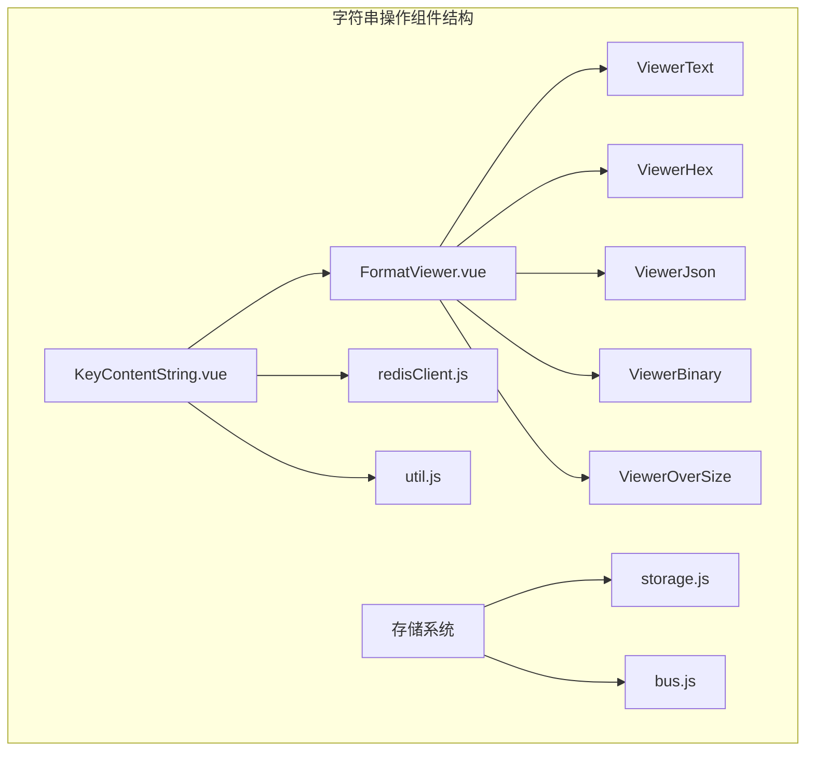
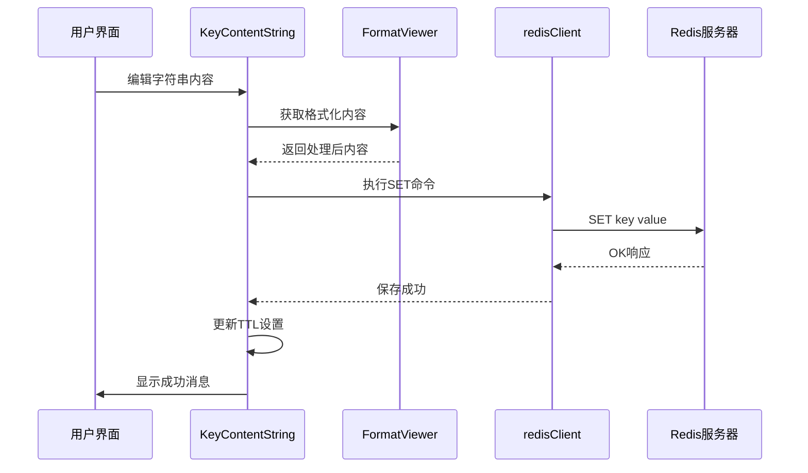
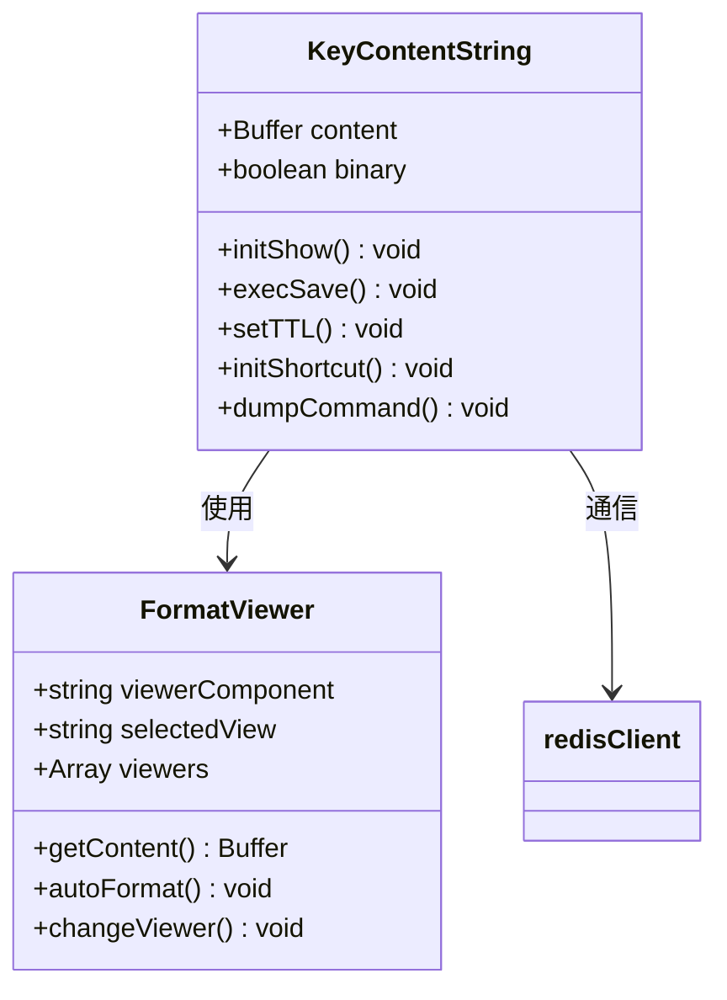
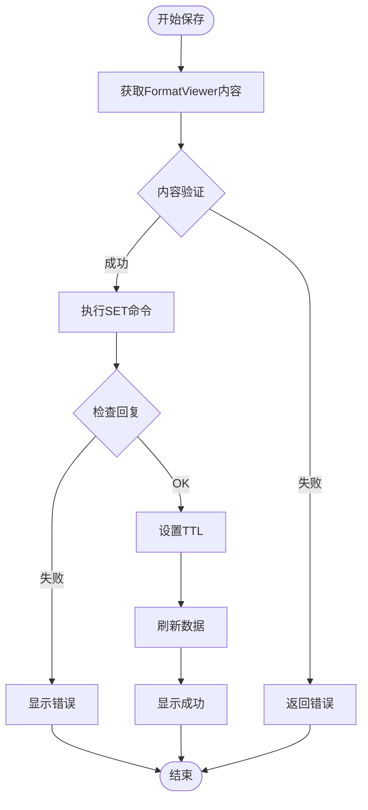
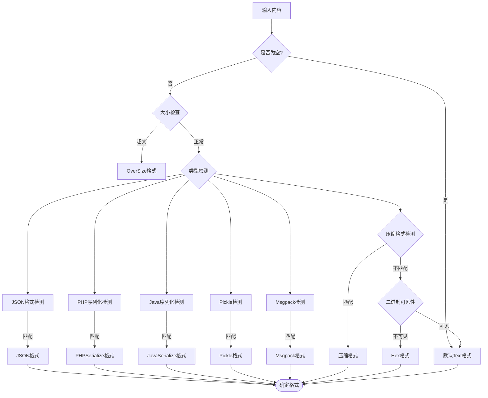
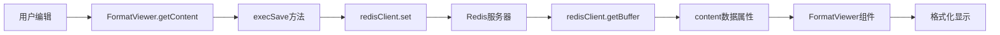
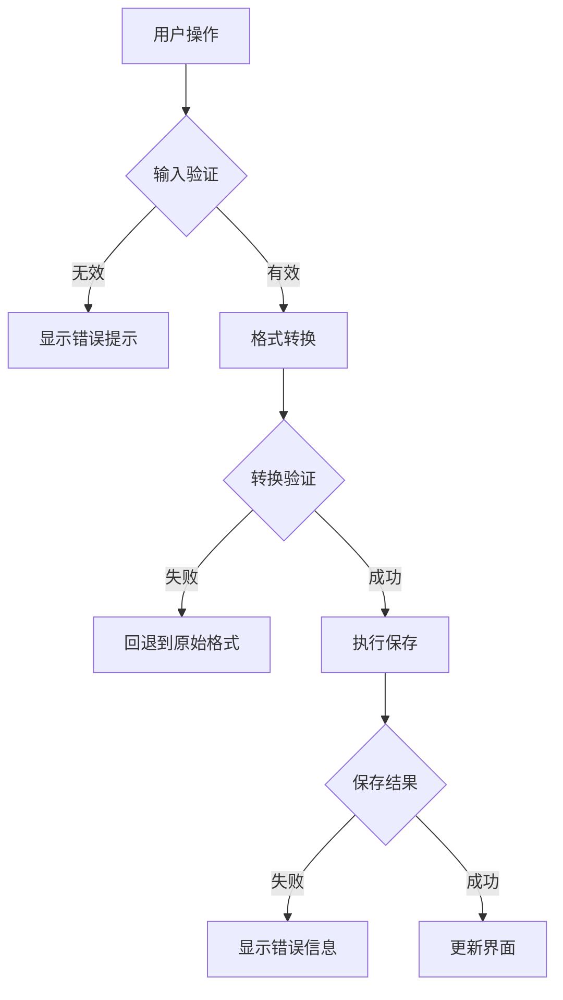

# 字符串(String)操作

<cite>
**本文档中引用的文件**
- [KeyContentString.vue](file://src/components/contents/KeyContentString.vue)
- [FormatViewer.vue](file://src/components/FormatViewer.vue)
- [redisClient.js](file://src/redisClient.js)
- [util.js](file://src/util.js)
- [ViewerText.vue](file://src/components/viewers/ViewerText.vue)
- [ViewerHex.vue](file://src/components/viewers/ViewerHex.vue)
- [ViewerJson.vue](file://src/components/viewers/ViewerJson.vue)
- [ViewerBinary.vue](file://src/components/viewers/ViewerBinary.vue)
- [ViewerOverSize.vue](file://src/components/viewers/ViewerOverSize.vue)
</cite>

## 目录
1. [简介](#简介)
2. [项目结构](#项目结构)
3. [核心组件](#核心组件)
4. [架构概览](#架构概览)
5. [详细组件分析](#详细组件分析)
6. [数据绑定策略](#数据绑定策略)
7. [性能优化措施](#性能优化措施)
8. [错误处理机制](#错误处理机制)
9. [使用示例](#使用示例)
10. [总结](#总结)

## 简介

Redis字符串类型是Redis中最基础也是最常用的数据类型之一。AnotherRedisDesktopManager为字符串类型提供了完整的操作界面，支持纯文本、二进制、十六进制等多种格式的查看和编辑功能。该组件通过KeyContentString.vue实现了对Redis字符串值的可视化展示和交互式编辑，同时集成了多种格式转换器来处理不同编码的数据。

## 项目结构

字符串操作功能主要分布在以下关键文件中：

**图表来源**
- [KeyContentString.vue](file://src/components/contents/KeyContentString.vue#L1-L104)
- [FormatViewer.vue](file://src/components/FormatViewer.vue#L1-L294)

## 核心组件

### KeyContentString.vue - 主要控制器

KeyContentString.vue是字符串操作的核心组件，负责协调整个字符串编辑流程：

- **数据状态管理**: 维护content（字符串内容）和binary（二进制模式）状态
- **生命周期管理**: 在mounted钩子中初始化数据和快捷键绑定
- **保存机制**: 实现execSave方法处理数据保存逻辑
- **TTL管理**: 集成TTL设置功能确保过期时间同步

### FormatViewer.vue - 格式化查看器

FormatViewer作为统一的格式化容器，提供多种数据视图：

- **多格式支持**: 支持Text、Hex、Json、Binary等13种格式
- **自动识别**: 根据内容特征自动选择最适合的显示格式
- **大小限制**: 对超大文件进行特殊处理，防止内存溢出
- **动态切换**: 支持运行时格式切换而不丢失数据

**章节来源**
- [KeyContentString.vue](file://src/components/contents/KeyContentString.vue#L25-L104)
- [FormatViewer.vue](file://src/components/FormatViewer.vue#L56-L257)

## 架构概览

字符串操作采用分层架构设计，从底层到顶层依次为：

**图表来源**
- [KeyContentString.vue](file://src/components/contents/KeyContentString.vue#L41-L70)
- [redisClient.js](file://src/redisClient.js#L51-L381)

## 详细组件分析

### KeyContentString组件深度解析

#### 数据结构设计

**图表来源**
- [KeyContentString.vue](file://src/components/contents/KeyContentString.vue#L26-L104)
- [FormatViewer.vue](file://src/components/FormatViewer.vue#L56-L257)

#### 初始化流程

组件初始化过程包含以下关键步骤：

1. **数据获取**: 调用`client.getBuffer()`获取Redis字符串值
2. **格式化**: 通过FormatViewer自动识别最佳显示格式
3. **快捷键绑定**: 绑定Ctrl+S/Cmd+S保存快捷键
4. **事件监听**: 设置全局事件监听器处理自定义格式器

#### 保存机制实现

保存操作遵循严格的验证流程：

**图表来源**
- [KeyContentString.vue](file://src/components/contents/KeyContentString.vue#L41-L70)

**章节来源**
- [KeyContentString.vue](file://src/components/contents/KeyContentString.vue#L35-L104)

### FormatViewer组件深度分析

#### 格式识别算法

FormatViewer采用智能格式识别机制：

**图表来源**
- [FormatViewer.vue](file://src/components/FormatViewer.vue#L172-L227)

#### 大小限制处理

对于超过20MB的大文件，系统采用特殊的处理策略：

- **只读显示**: 禁止直接编辑，仅显示前20000字符
- **警告提示**: 明确告知用户文件过大无法编辑
- **性能保护**: 防止因大文件加载导致的内存溢出

**章节来源**
- [FormatViewer.vue](file://src/components/FormatViewer.vue#L56-L257)
- [ViewerOverSize.vue](file://src/components/viewers/ViewerOverSize.vue#L1-L43)

## 数据绑定策略

### 响应式数据流

字符串组件采用Vue的响应式系统实现双向数据绑定：

**图表来源**
- [KeyContentString.vue](file://src/components/contents/KeyContentString.vue#L35-L40)
- [FormatViewer.vue](file://src/components/FormatViewer.vue#L157-L163)

### 编辑状态管理

组件维护以下编辑状态：

- **原始状态**: 从Redis获取的原始字节数据
- **编辑状态**: 用户修改后的临时状态
- **验证状态**: 内容格式验证结果
- **保存状态**: 保存操作的执行状态

**章节来源**
- [KeyContentString.vue](file://src/components/contents/KeyContentString.vue#L26-L30)

## 性能优化措施

### 防抖保存机制

虽然当前实现没有显式的防抖机制，但系统通过以下方式优化性能：

1. **延迟加载**: 只有在组件挂载时才加载数据
2. **格式缓存**: 自动格式识别结果会被缓存避免重复计算
3. **条件渲染**: 大文件采用特殊组件避免DOM过度渲染
4. **异步操作**: 所有网络请求都采用异步处理

### 内存管理

- **缓冲区优化**: 使用Buffer对象高效处理二进制数据
- **字符串截断**: 对超长字符串进行智能截断显示
- **组件卸载**: 组件销毁时清理事件监听器和定时器

### 错误边界

系统设置了多层错误边界：

**图表来源**
- [KeyContentString.vue](file://src/components/contents/KeyContentString.vue#L44-L47)
- [KeyContentString.vue](file://src/components/contents/KeyContentString.vue#L68-L70)

**章节来源**
- [KeyContentString.vue](file://src/components/contents/KeyContentString.vue#L41-L70)
- [FormatViewer.vue](file://src/components/FormatViewer.vue#L172-L227)

## 错误处理机制

### 分层错误处理

系统采用分层错误处理策略：

1. **输入验证层**: 检查用户输入的有效性
2. **格式转换层**: 处理各种格式转换异常
3. **网络通信层**: 处理Redis连接和命令执行错误
4. **用户反馈层**: 提供友好的错误提示信息

### 错误类型分类

| 错误类型 | 处理方式 | 用户反馈 |
|---------|---------|---------|
| 输入验证失败 | 阻止保存操作 | 显示格式错误提示 |
| 格式转换异常 | 回退到原始格式 | 显示转换失败信息 |
| 网络连接错误 | 显示连接状态 | 提示重新连接 |
| Redis命令错误 | 显示具体错误信息 | 提供重试选项 |

### 消息国际化

系统支持多语言错误消息，通过i18n机制提供本地化的用户体验。

**章节来源**
- [KeyContentString.vue](file://src/components/contents/KeyContentString.vue#L58-L70)
- [util.js](file://src/util.js#L190-L200)

## 使用示例

### 完整操作流程

以下是用户通过界面修改字符串值的完整操作示例：

#### 步骤1：打开字符串键
1. 在键列表中选择一个字符串类型的键
2. 界面自动加载该键的当前值
3. FormatViewer根据内容自动选择最适合的显示格式

#### 步骤2：编辑内容
1. 用户在文本编辑区域输入或修改内容
2. 系统实时验证输入格式
3. 如果内容发生变化，保存按钮变为可用状态

#### 步骤3：保存更改
1. 点击"保存"按钮或使用Ctrl+S快捷键
2. 系统验证内容有效性
3. 执行SET命令更新Redis中的值
4. 同步更新TTL设置
5. 显示成功或失败的消息提示

#### 步骤4：查看效果
1. 界面自动刷新显示最新值
2. FormatViewer重新评估并可能切换到新的格式
3. 用户可以继续编辑或进行其他操作

### 特殊场景处理

#### 大文件处理
当字符串内容超过20MB时：
- 界面显示警告信息
- 内容以只读模式显示
- 禁用编辑功能
- 提供文件大小信息

#### 二进制数据处理
对于二进制数据：
- 默认显示十六进制格式
- 提供二进制和文本模式切换
- 支持十六进制编辑
- 自动检测可打印字符

**章节来源**
- [KeyContentString.vue](file://src/components/contents/KeyContentString.vue#L35-L104)
- [FormatViewer.vue](file://src/components/FormatViewer.vue#L172-L227)

## 总结

AnotherRedisDesktopManager的字符串操作功能通过精心设计的组件架构，为用户提供了强大而易用的Redis字符串管理体验。主要特点包括：

### 技术优势
- **智能格式识别**: 自动选择最适合的显示格式
- **多格式支持**: 支持13种不同的数据格式查看
- **性能优化**: 针对大文件和复杂数据的专门优化
- **错误处理**: 完善的错误捕获和用户反馈机制

### 用户体验
- **直观界面**: 清晰的布局和明确的状态指示
- **实时反馈**: 即时的格式转换和验证反馈
- **便捷操作**: 快捷键支持和一键保存功能
- **安全保障**: 多层次的验证和错误预防机制

### 开发价值
该组件的设计体现了现代Web应用开发的最佳实践，包括组件化架构、响应式编程、性能优化和用户体验设计等多个方面的优秀实践。对于需要处理Redis字符串数据的开发者来说，这是一个功能完整、易于扩展的解决方案。