# 数据操作

<cite>
**本文档中引用的文件**
- [KeyContentString.vue](file://src/components/contents/KeyContentString.vue)
- [KeyContentHash.vue](file://src/components/contents/KeyContentHash.vue)
- [KeyContentReJson.vue](file://src/components/contents/KeyContentReJson.vue)
- [KeyContentList.vue](file://src/components/contents/KeyContentList.vue)
- [KeyContentSet.vue](file://src/components/contents/KeyContentSet.vue)
- [KeyContentZset.vue](file://src/components/contents/KeyContentZset.vue)
- [KeyContentStream.vue](file://src/components/contents/KeyContentStream.vue)
- [KeyDetail.vue](file://src/components/KeyDetail.vue)
- [FormatViewer.vue](file://src/components/FormatViewer.vue)
- [InputBinary.vue](file://src/components/InputBinary.vue)
- [util.js](file://src/util.js)
</cite>

## 目录
1. [概述](#概述)
2. [系统架构](#系统架构)
3. [核心组件分析](#核心组件分析)
4. [数据类型详解](#数据类型详解)
5. [UI布局与交互设计](#ui布局与交互设计)
6. [数据绑定与通信机制](#数据绑定与通信机制)
7. [操作流程与最佳实践](#操作流程与最佳实践)
8. [性能优化策略](#性能优化策略)
9. [故障排除指南](#故障排除指南)
10. [总结](#总结)

## 概述

Another Redis Desktop Manager 是一个功能强大的 Redis 管理工具，提供了对 Redis 七种核心数据类型的完整操作支持。该系统采用 Vue.js 架构，通过模块化的组件设计实现了高度可扩展的数据操作界面。

系统的核心设计理念是：
- **统一的容器组件**：KeyDetail.vue 作为所有数据类型操作的统一入口
- **类型化的内容组件**：每个 Redis 数据类型都有专门的 UI 组件
- **灵活的格式化器**：FormatViewer 提供多种数据格式的可视化支持
- **实时的数据绑定**：双向数据绑定确保用户操作的即时反馈

## 系统架构

### 整体架构图

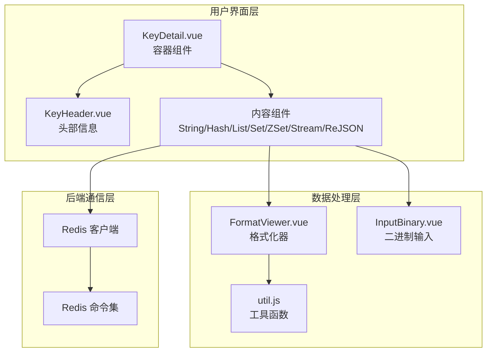

**图表来源**
- [KeyDetail.vue](file://src/components/KeyDetail.vue#L1-L159)
- [FormatViewer.vue](file://src/components/FormatViewer.vue#L1-L200)
- [util.js](file://src/util.js#L1-L200)

### 组件层次结构

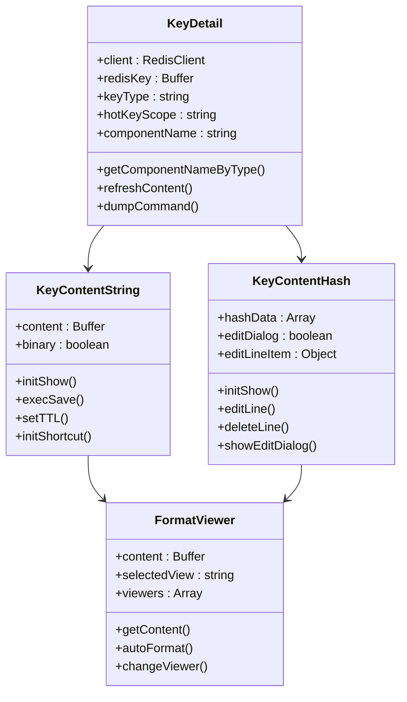

**图表来源**
- [KeyDetail.vue](file://src/components/KeyDetail.vue#L40-L80)
- [KeyContentString.vue](file://src/components/contents/KeyContentString.vue#L25-L104)
- [KeyContentHash.vue](file://src/components/contents/KeyContentHash.vue#L98-L334)
- [FormatViewer.vue](file://src/components/FormatViewer.vue#L56-L200)

## 核心组件分析

### KeyDetail.vue - 容器组件

KeyDetail.vue 是整个数据操作系统的中央控制器，负责根据键类型动态加载对应的内容组件。

#### 关键特性

1. **类型路由机制**：通过 `getComponentNameByType` 方法实现键类型到组件名称的映射
2. **动态组件加载**：使用 Vue 的 `<component>` 动态组件特性
3. **事件传播**：向上游组件传递刷新和导出命令

#### 支持的数据类型映射

| Redis 类型 | 组件名称 | 特殊处理 |
|------------|----------|----------|
| string | KeyContentString | 基础字符串操作 |
| hash | KeyContentHash | 字段增删改查 |
| list | KeyContentList | 有序列表操作 |
| set | KeyContentSet | 集合操作 |
| zset | KeyContentZset | 有序集合操作 |
| stream | KeyContentStream | 流式数据操作 |
| ReJSON-RL | KeyContentReJson | JSON 树形编辑 |
| json | KeyContentReJson | Upstash JSON |
| tair-json | KeyContentReJson | Tair JSON |

**章节来源**
- [KeyDetail.vue](file://src/components/KeyDetail.vue#L60-L80)

### FormatViewer.vue - 格式化器组件

FormatViewer 是一个智能的数据格式化组件，能够自动检测数据类型并选择合适的显示方式。

#### 格式化器支持

1. **基础格式**：Text（文本）、Hex（十六进制）
2. **结构化格式**：JSON、XML、YAML
3. **压缩格式**：Gzip、Deflate、Brotli
4. **序列化格式**：PHP Serialize、Java Serialize、Pickle
5. **自定义格式**：支持插件扩展

#### 自动格式识别逻辑

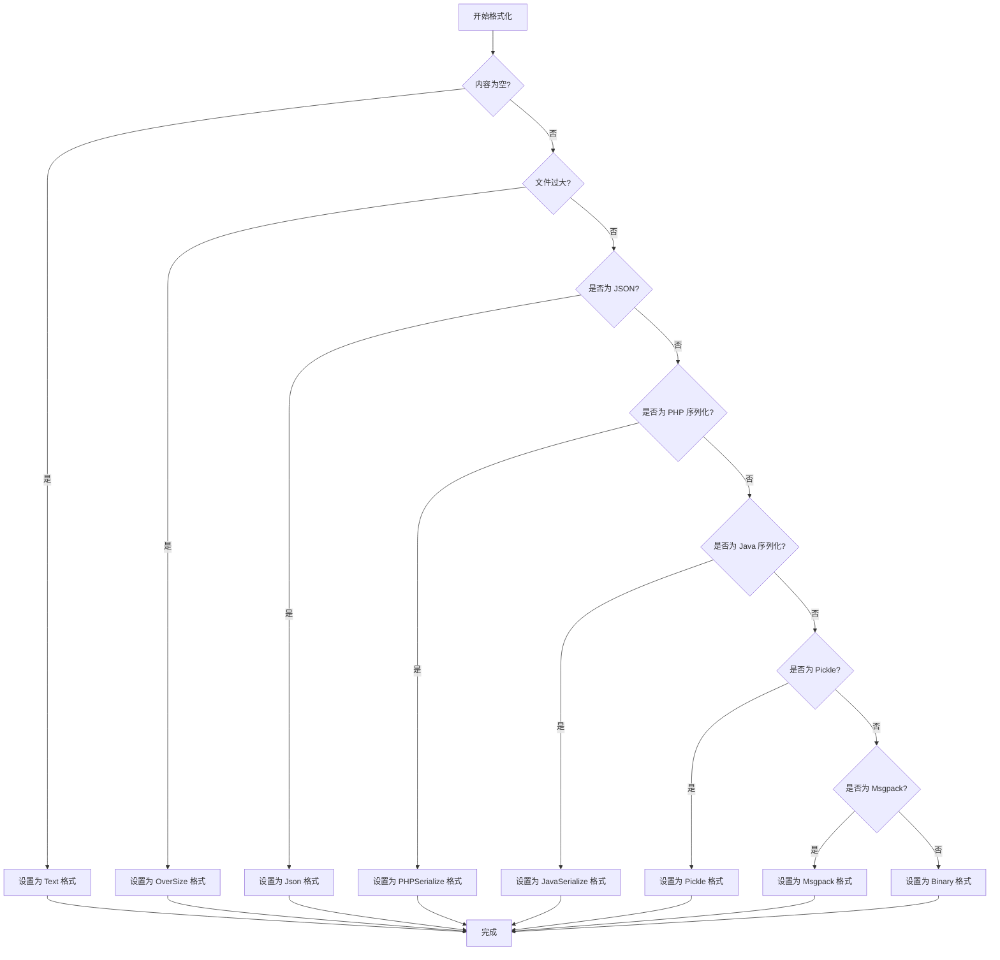

**图表来源**
- [FormatViewer.vue](file://src/components/FormatViewer.vue#L172-L200)

**章节来源**
- [FormatViewer.vue](file://src/components/FormatViewer.vue#L1-L200)

## 数据类型详解

### String 类型 - KeyContentString.vue

String 类型是最基础的数据类型，提供了简洁而强大的编辑界面。

#### 核心功能

1. **文本编辑**：支持多行文本输入和格式化
2. **二进制切换**：可以在文本和十六进制视图之间切换
3. **TTL 管理**：集成过期时间设置功能
4. **快捷键支持**：Ctrl+S/Cmd+S 快速保存

#### 用户界面设计

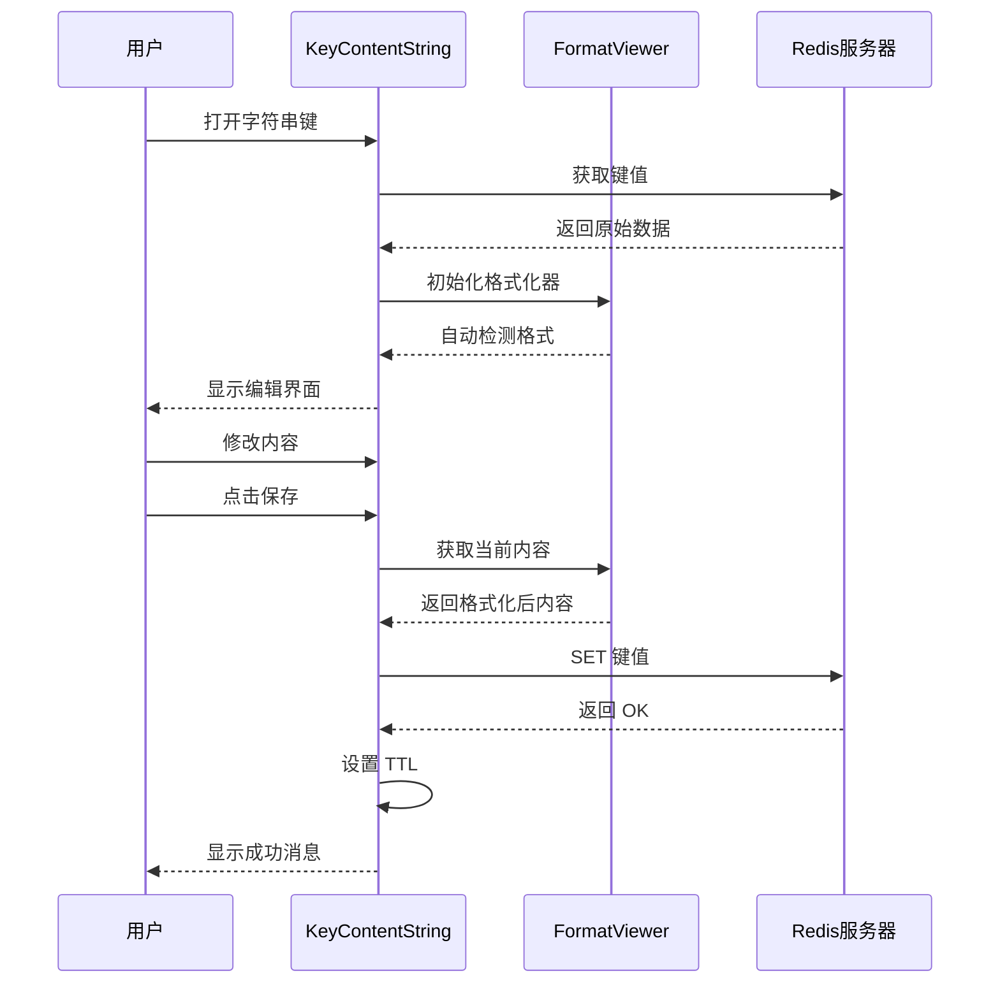

**图表来源**
- [KeyContentString.vue](file://src/components/contents/KeyContentString.vue#L35-L70)

#### 实际操作示例

1. **查看字符串内容**
   - 系统自动检测数据格式
   - 在文本或十六进制视图中显示
   - 支持大文件的分页加载

2. **修改字符串值**
   - 双击单元格进入编辑模式
   - 实时格式验证
   - 自动保存更改

3. **设置过期时间**
   - 在键头部设置 TTL
   - 支持秒级精度
   - 实时显示剩余时间

**章节来源**
- [KeyContentString.vue](file://src/components/contents/KeyContentString.vue#L1-L104)

### Hash 类型 - KeyContentHash.vue

Hash 类型提供了丰富的字段管理功能，支持复杂的键值对操作。

#### 核心功能

1. **表格化显示**：以表格形式展示所有字段
2. **实时搜索**：支持字段名和值的模糊搜索
3. **批量操作**：支持添加、编辑、删除多个字段
4. **TTL 支持**：Redis 7.4+ 版本支持字段级别的过期时间

#### 交互设计特点

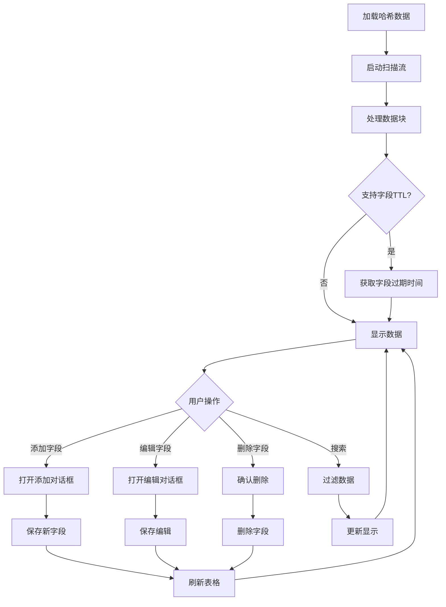

**图表来源**
- [KeyContentHash.vue](file://src/components/contents/KeyContentHash.vue#L146-L230)

#### 字段操作流程

1. **添加字段**
   - 点击"添加新行"按钮
   - 输入字段名和值
   - 设置可选的字段过期时间
   - 系统自动验证并保存

2. **编辑字段**
   - 点击编辑图标
   - 修改字段名或值
   - 支持格式化器自动检测
   - 实时验证 JSON 格式

3. **删除字段**
   - 点击删除图标
   - 系统弹出确认对话框
   - 删除成功后自动刷新表格

**章节来源**
- [KeyContentHash.vue](file://src/components/contents/KeyContentHash.vue#L1-L334)

### List 类型 - KeyContentList.vue

List 类型提供了有序列表的完整操作功能，支持高效的元素管理。

#### 核心特性

1. **分页加载**：大数据量列表的渐进式加载
2. **双向滚动**：支持向前和向后滚动加载
3. **元素定位**：精确的索引管理和元素查找
4. **原子操作**：保证数据一致性的原子性操作

#### 数据加载策略

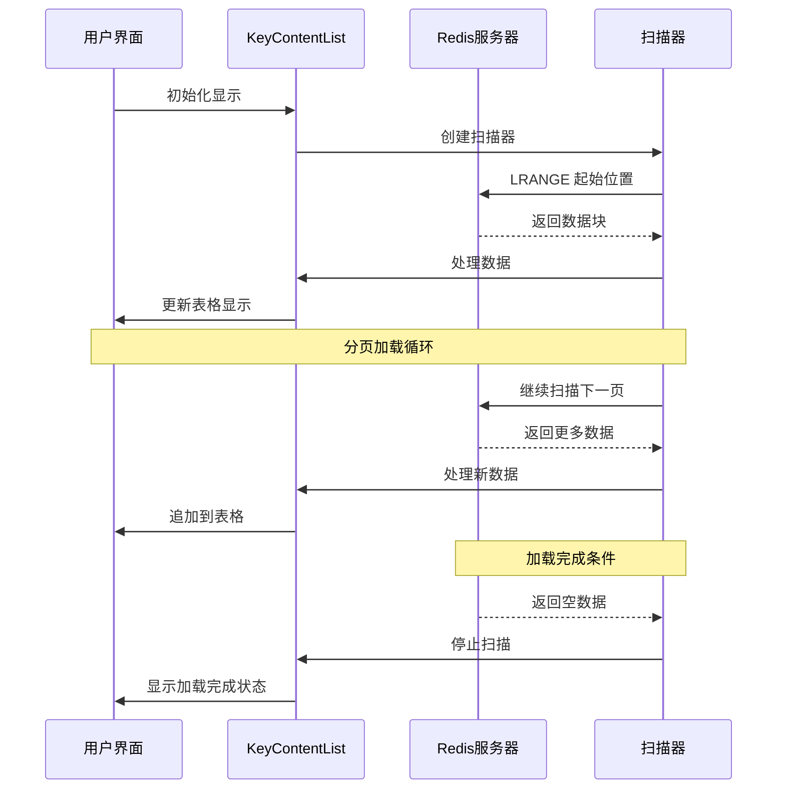

**图表来源**
- [KeyContentList.vue](file://src/components/contents/KeyContentList.vue#L114-L180)

#### 列表操作示例

1. **添加元素**
   - 在列表末尾追加元素（RPUSH）
   - 插入到指定位置（LINSERT）
   - 支持重复元素的精确插入

2. **编辑元素**
   - 定位到特定索引
   - 使用 LINSERT 确保顺序不变
   - 自动调整后续元素位置

3. **删除元素**
   - 基于值进行删除（LREM）
   - 支持删除指定数量的匹配项
   - 保持列表连续性

**章节来源**
- [KeyContentList.vue](file://src/components/contents/KeyContentList.vue#L1-L296)

### Set 类型 - KeyContentSet.vue

Set 类型提供了集合操作的完整功能，支持高效的成员管理。

#### 核心功能

1. **唯一性保证**：自动去重和重复检查
2. **集合运算**：交集、并集、差集操作
3. **随机访问**：支持随机元素选择
4. **批量操作**：支持批量添加和删除

#### 集合操作流程

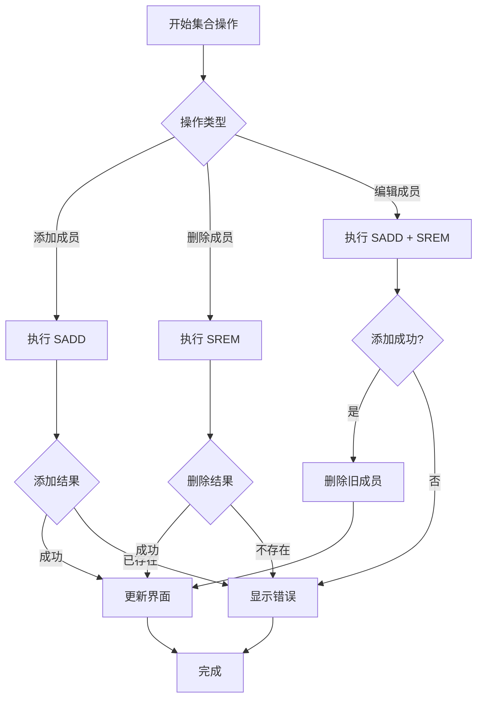

**图表来源**
- [KeyContentSet.vue](file://src/components/contents/KeyContentSet.vue#L201-L255)

**章节来源**
- [KeyContentSet.vue](file://src/components/contents/KeyContentSet.vue#L1-L284)

### ZSet 类型 - KeyContentZset.vue

ZSet 类型提供了有序集合的复杂操作，支持分数排序和范围查询。

#### 排序和检索功能

1. **双排序模式**：支持升序（ASC）和降序（DESC）排序
2. **范围查询**：基于分数的区间查询
3. **排名系统**：提供元素排名和分数查询
4. **动态排序**：运行时切换排序方向

#### ZSet 操作示例

1. **添加有序成员**
   - 指定分数和成员值
   - 自动按分数排序
   - 支持重复分数的稳定排序

2. **分数范围查询**
   - ZRANGEBYSCORE 查询
   - 支持开区间和闭区间
   - 可配置返回数量限制

3. **排名操作**
   - ZRANK 和 ZREVRANK
   - 支持分数区间排名
   - 提供精确的排名信息

**章节来源**
- [KeyContentZset.vue](file://src/components/contents/KeyContentZset.vue#L1-L329)

### Stream 类型 - KeyContentStream.vue

Stream 类型提供了流式数据的完整操作功能，支持消息队列和事件流处理。

#### 核心特性

1. **时间序列存储**：基于时间戳的消息存储
2. **消费者组**：支持多消费者协作
3. **消息确认**：基于 ACK 的消息确认机制
4. **流式查询**：支持增量和全量数据查询

#### Stream 数据结构

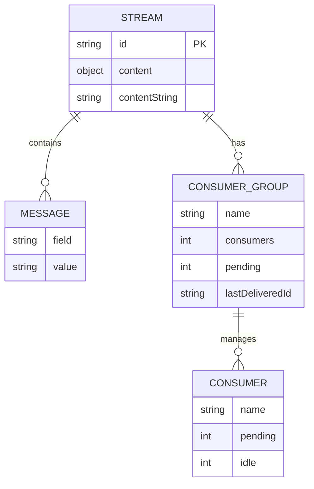

**图表来源**
- [KeyContentStream.vue](file://src/components/contents/KeyContentStream.vue#L1-L428)

#### Stream 操作流程

1. **消息发布**
   - XADD 命令添加新消息
   - 自动生成时间戳 ID
   - 支持批量字段添加

2. **消息消费**
   - XREAD 或 XRANGE 查询
   - 基于 ID 的精确查询
   - 支持增量和全量读取

3. **消费者组管理**
   - 创建和管理消费者组
   - 查看消费者状态
   - 监控待处理消息

**章节来源**
- [KeyContentStream.vue](file://src/components/contents/KeyContentStream.vue#L1-L428)

### ReJSON 类型 - KeyContentReJson.vue

ReJSON 类型提供了 JSON 数据的树形编辑功能，支持复杂的 JSON 结构操作。

#### 核心功能

1. **树形编辑器**：可视化的 JSON 树形结构
2. **路径导航**：支持 JSONPath 风格的路径导航
3. **类型验证**：严格的 JSON 类型检查
4. **增量更新**：支持部分 JSON 更新

#### JSON 操作示例

1. **查看 JSON 结构**
   - 自动解析 JSON 格式
   - 展示嵌套对象和数组
   - 支持展开和折叠节点

2. **编辑 JSON 内容**
   - 直接在界面上修改值
   - 支持添加新属性
   - 删除现有属性或数组元素

3. **JSONPath 操作**
   - 使用 JSON.SET 更新特定路径
   - 支持通配符和数组索引
   - 提供语法高亮和错误提示

**章节来源**
- [KeyContentReJson.vue](file://src/components/contents/KeyContentReJson.vue#L1-L103)

## UI布局与交互设计

### 统一的布局模式

所有数据类型组件都遵循统一的布局模式：

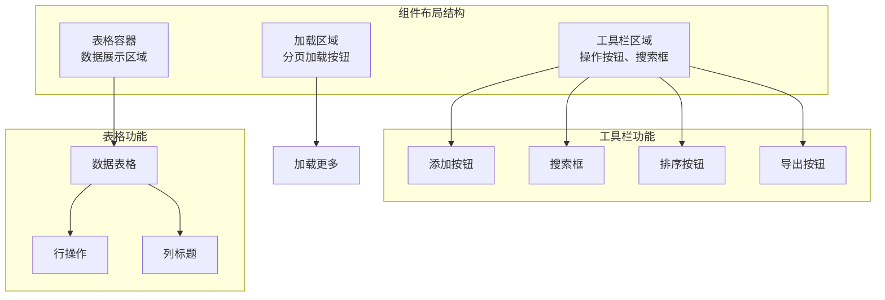

### 交互设计原则

1. **一致性**：所有组件使用相同的交互模式
2. **响应性**：即时反馈用户操作
3. **可访问性**：支持键盘导航和屏幕阅读器
4. **容错性**：提供操作确认和错误恢复

### 编辑能力设计

#### 文本输入组件

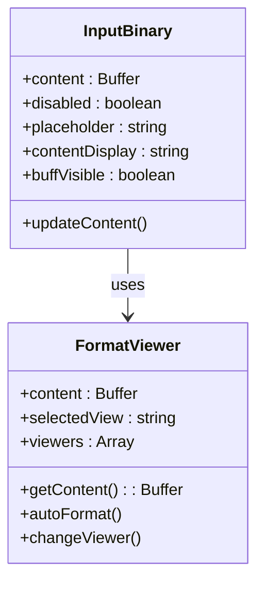

**图表来源**
- [InputBinary.vue](file://src/components/InputBinary.vue#L11-L47)
- [FormatViewer.vue](file://src/components/FormatViewer.vue#L56-L200)

#### 保存机制

所有内容组件都实现了统一的保存机制：

1. **内容验证**：格式化器验证输入内容
2. **事务处理**：确保操作的原子性
3. **错误处理**：提供详细的错误信息
4. **状态反馈**：显示操作成功或失败状态

**章节来源**
- [KeyContentString.vue](file://src/components/contents/KeyContentString.vue#L40-L70)
- [KeyContentHash.vue](file://src/components/contents/KeyContentHash.vue#L253-L305)

## 数据绑定与通信机制

### 组件间通信

系统采用多层次的通信机制：

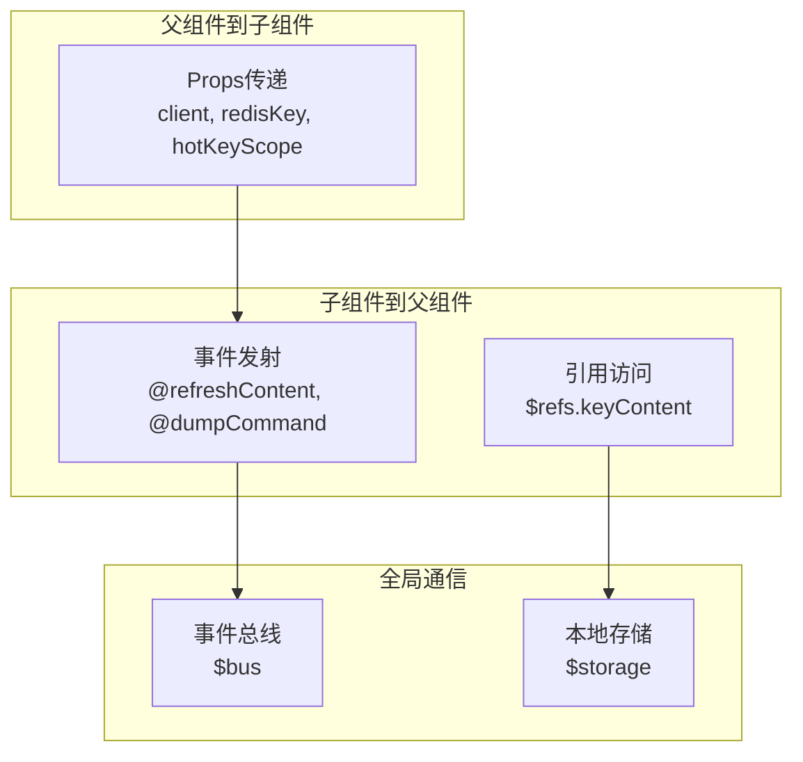

### 数据绑定策略

1. **单向数据流**：从 Redis 客户端到组件的单向数据流
2. **双向绑定**：用户编辑通过 v-model 实现双向绑定
3. **响应式更新**：Vue 响应式系统自动更新视图
4. **缓存机制**：本地缓存减少网络请求

### 变更提交的事务处理

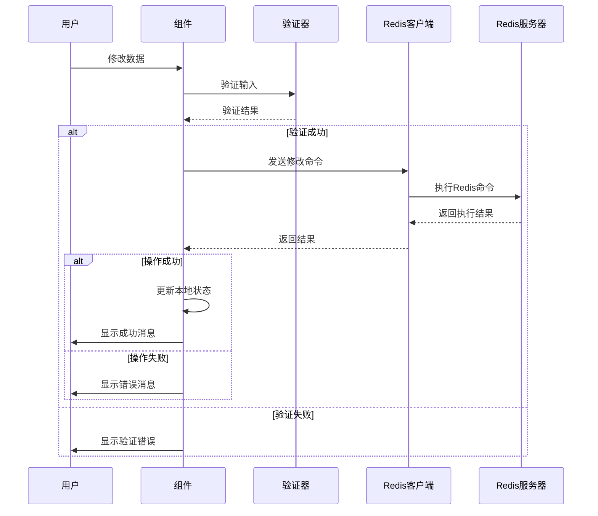

**图表来源**
- [KeyContentString.vue](file://src/components/contents/KeyContentString.vue#L40-L70)
- [KeyContentHash.vue](file://src/components/contents/KeyContentHash.vue#L253-L305)

**章节来源**
- [KeyDetail.vue](file://src/components/KeyDetail.vue#L80-L100)

## 操作流程与最佳实践

### 查看数据流程

1. **连接验证**：检查 Redis 连接状态
2. **键存在性检查**：验证目标键是否存在
3. **类型检测**：自动识别键的数据类型
4. **内容加载**：异步加载键内容
5. **格式化显示**：根据内容类型选择合适的显示格式

### 修改数据流程

1. **权限检查**：验证用户是否有修改权限
2. **内容备份**：创建修改前的数据快照
3. **格式验证**：验证新内容的格式正确性
4. **原子操作**：使用 Redis 原子命令修改数据
5. **状态同步**：更新本地状态和界面显示

### 新增数据流程

1. **默认值设置**：根据数据类型设置合理的默认值
2. **格式初始化**：初始化适当的格式化器
3. **TTL配置**：可选的过期时间设置
4. **保存确认**：确认保存操作
5. **列表更新**：更新键列表显示

### 删除数据流程

1. **操作确认**：弹出确认对话框
2. **依赖检查**：检查是否有相关依赖
3. **安全删除**：执行安全的删除操作
4. **清理工作**：清理相关缓存和引用
5. **通知更新**：通知相关组件更新显示

### 实际操作示例

#### 示例1：修改字符串值

```javascript
// 1. 获取当前内容
const currentValue = await client.get(redisKey);

// 2. 用户编辑内容
const editedContent = userInput;

// 3. 验证内容格式
if (!isValidFormat(editedContent)) {
    throw new Error('Invalid content format');
}

// 4. 执行修改
await client.set(redisKey, editedContent);

// 5. 更新TTL（如果需要）
if (hasTTL()) {
    await client.expire(redisKey, ttlSeconds);
}
```

#### 示例2：添加Hash字段

```javascript
// 1. 准备字段数据
const field = 'new_field';
const value = 'new_value';

// 2. 执行HSET命令
const result = await client.hset(redisKey, field, value);

// 3. 更新本地状态
if (result === 1) {
    // 新增字段
    hashData.push({ key: field, value: value, ttl: -1 });
} else {
    // 更新现有字段
    const index = hashData.findIndex(item => item.key.equals(field));
    hashData[index].value = value;
}
```

#### 示例3：JSON数据编辑

```javascript
// 1. 获取JSON内容
const jsonString = await client.call('JSON.GET', [redisKey]);

// 2. 解析JSON
const jsonObject = JSON.parse(jsonString);

// 3. 修改特定路径
jsonObject.path.to.value = newValue;

// 4. 保存修改
await client.call('JSON.SET', [redisKey, '$', JSON.stringify(jsonObject)]);
```

**章节来源**
- [KeyContentString.vue](file://src/components/contents/KeyContentString.vue#L40-L70)
- [KeyContentHash.vue](file://src/components/contents/KeyContentHash.vue#L253-L305)
- [KeyContentReJson.vue](file://src/components/contents/KeyContentReJson.vue#L40-L70)

## 性能优化策略

### 大数据量处理

1. **分页加载**：避免一次性加载大量数据
2. **虚拟滚动**：只渲染可见区域的数据
3. **懒加载**：按需加载数据和组件
4. **缓存策略**：合理使用本地缓存

### 网络优化

1. **批量操作**：合并多个小操作为批量命令
2. **连接池**：复用 Redis 连接
3. **压缩传输**：对大文件启用压缩
4. **断线重连**：自动处理网络中断

### 内存管理

1. **及时释放**：不再使用的数据及时释放
2. **弱引用**：对大型对象使用弱引用
3. **垃圾回收**：定期触发垃圾回收
4. **内存监控**：监控内存使用情况

### 渲染优化

1. **防抖处理**：对频繁的用户输入进行防抖
2. **虚拟DOM**：利用Vue的虚拟DOM优化
3. **组件拆分**：按需加载组件
4. **样式优化**：减少不必要的CSS计算

## 故障排除指南

### 常见问题及解决方案

#### 连接问题

1. **问题**：无法连接到Redis服务器
   - **原因**：网络问题、认证失败、防火墙阻止
   - **解决**：检查网络连接、验证认证信息、配置防火墙规则

2. **问题**：连接超时
   - **原因**：服务器负载过高、网络延迟
   - **解决**：增加超时时间、优化网络配置

#### 数据操作问题

1. **问题**：修改操作失败
   - **原因**：数据格式不正确、权限不足
   - **解决**：验证数据格式、检查用户权限

2. **问题**：数据丢失
   - **原因**：意外关闭、网络中断
   - **解决**：启用自动保存、定期备份

#### 性能问题

1. **问题**：界面卡顿
   - **原因**：大数据量、复杂计算
   - **解决**：启用分页、优化算法

2. **问题**：内存占用过高
   - **原因**：数据缓存过多、内存泄漏
   - **解决**：清理缓存、修复内存泄漏

### 调试技巧

1. **日志记录**：启用详细的日志记录
2. **性能分析**：使用浏览器开发工具分析性能
3. **网络监控**：监控网络请求和响应
4. **内存分析**：使用内存分析工具

### 最佳实践建议

1. **定期备份**：重要数据定期备份
2. **版本控制**：对配置文件进行版本控制
3. **安全加固**：启用适当的安全措施
4. **监控告警**：设置关键指标的监控告警

## 总结

Another Redis Desktop Manager 提供了一个功能完整、设计精良的 Redis 数据操作平台。通过模块化的组件架构、统一的交互模式和强大的数据处理能力，系统能够满足各种 Redis 数据类型的管理需求。

### 主要优势

1. **完整性**：支持 Redis 的所有核心数据类型
2. **易用性**：直观的用户界面和流畅的交互体验
3. **可靠性**：完善的错误处理和数据保护机制
4. **扩展性**：模块化设计便于功能扩展
5. **性能**：优化的大数据量处理和网络通信

### 技术特色

1. **动态组件加载**：根据数据类型动态选择合适的UI组件
2. **智能格式化**：自动识别和格式化各种数据格式
3. **实时数据绑定**：双向数据绑定确保界面与数据同步
4. **事务性操作**：保证数据操作的一致性和可靠性
5. **国际化支持**：多语言界面支持

### 发展方向

1. **功能增强**：支持更多的 Redis 扩展功能
2. **性能优化**：进一步提升大数据量处理能力
3. **用户体验**：持续改进用户界面和交互设计
4. **生态整合**：与其他 Redis 工具和服务的更好集成

通过本文档的详细介绍，开发者可以深入理解系统的设计理念和实现细节，为后续的功能扩展和维护工作提供坚实的基础。