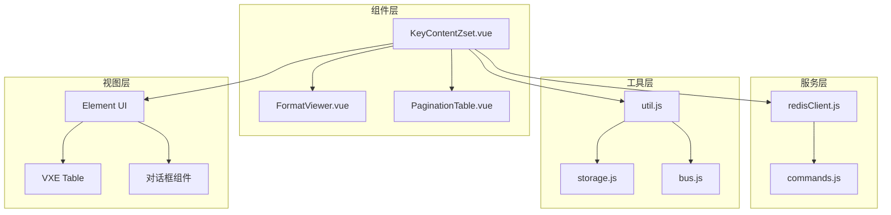
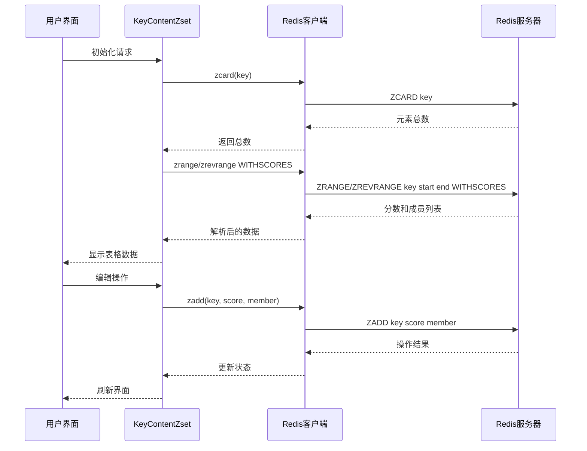
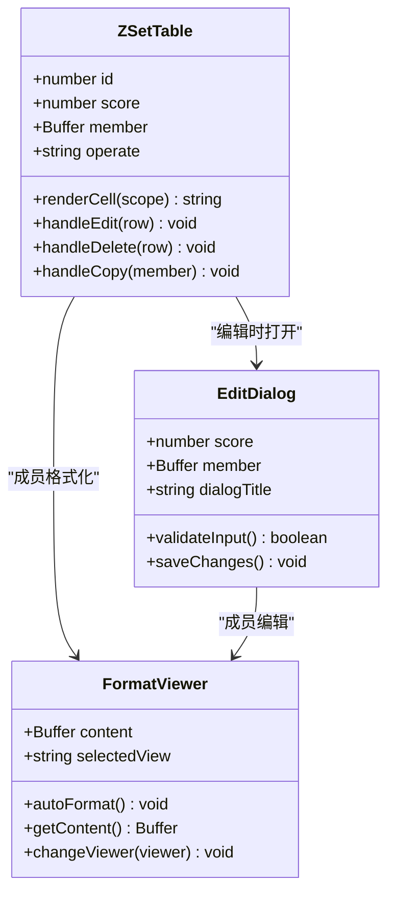
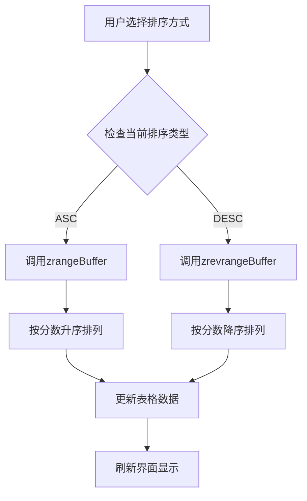
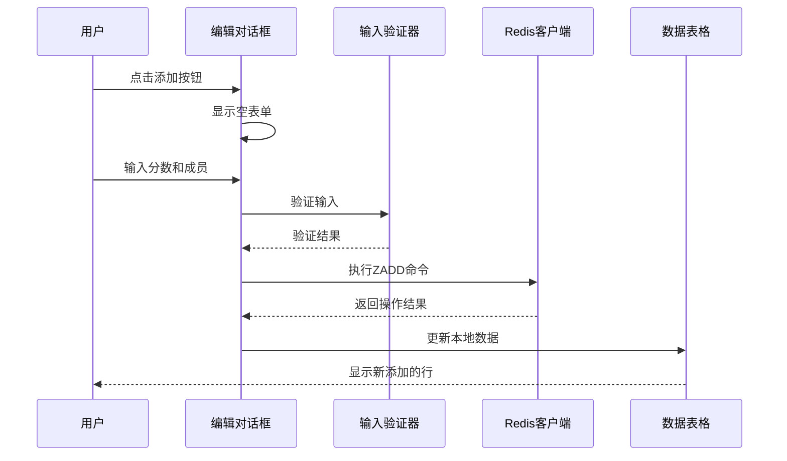
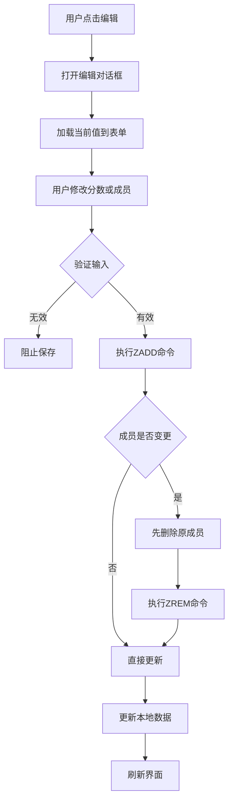
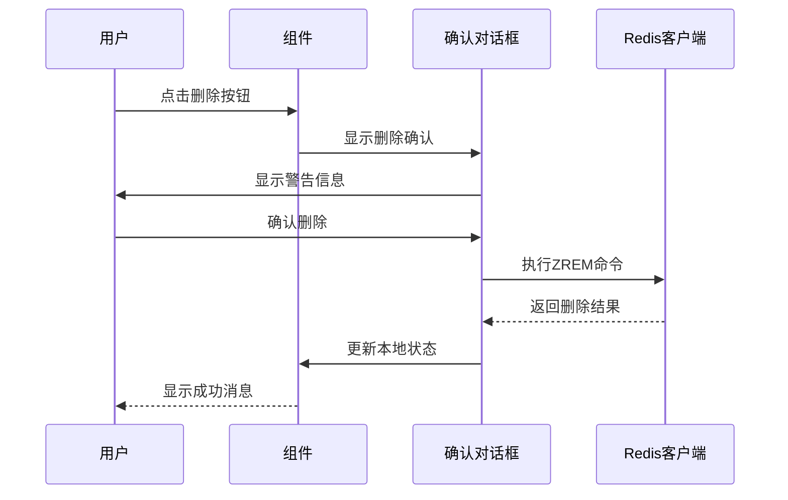
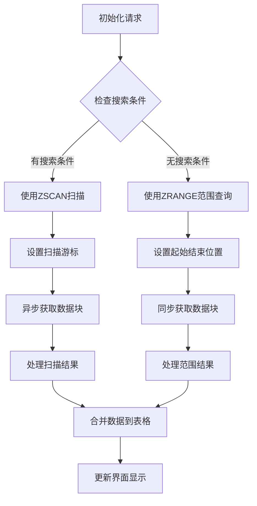
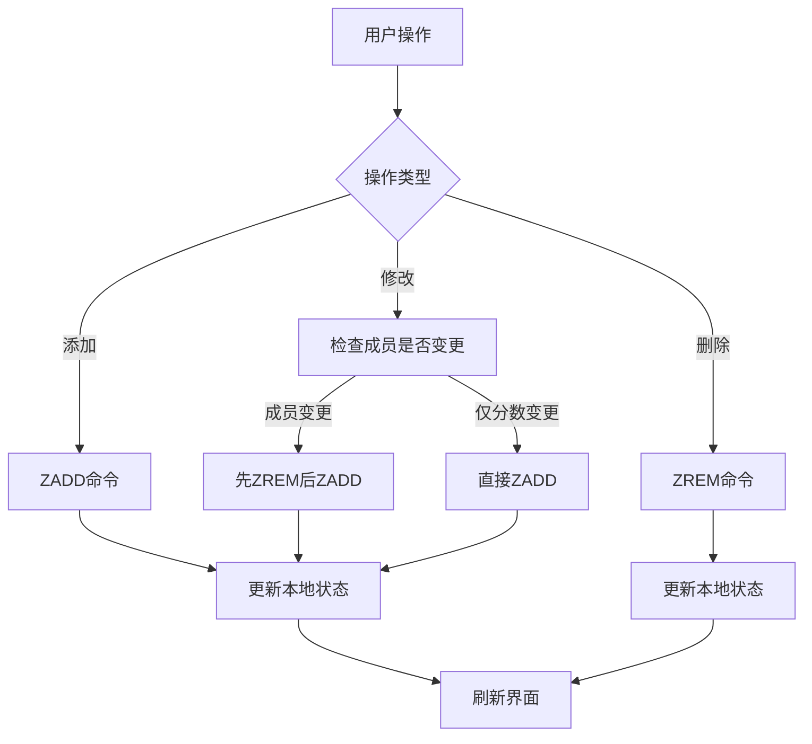

# 有序集合(ZSet)操作

<cite>
**本文档中引用的文件**
- [KeyContentZset.vue](file://src/components/contents/KeyContentZset.vue)
- [redisClient.js](file://src/redisClient.js)
- [commands.js](file://src/commands.js)
- [FormatViewer.vue](file://src/components/FormatViewer.vue)
- [util.js](file://src/util.js)
- [main.js](file://src/main.js)
</cite>

## 目录
1. [概述](#概述)
2. [项目结构](#项目结构)
3. [核心组件分析](#核心组件分析)
4. [架构概览](#架构概览)
5. [详细组件分析](#详细组件分析)
6. [Redis命令实现](#redis命令实现)
7. [数据流分析](#数据流分析)
8. [性能考虑](#性能考虑)
9. [故障排除指南](#故障排除指南)
10. [结论](#结论)

## 概述

Redis有序集合(ZSet)是一种特殊的数据结构，它将字符串元素与浮点数分数关联起来，按照分数值进行排序。在本项目中，KeyContentZset.vue组件提供了完整的ZSet操作界面，支持分数与成员的联合展示、编辑、排序等功能。

该组件通过封装Redis的ZADD、ZRANGE、ZREVRANGE、ZCARD、ZREM等命令，为用户提供了直观的图形化界面来管理有序集合数据。组件支持多种排序方式（升序/降序）、实时编辑、批量操作以及高级搜索功能。

## 项目结构

项目的有序集合相关文件组织如下：



**图表来源**
- [KeyContentZset.vue](file://src/components/contents/KeyContentZset.vue#L1-L329)
- [redisClient.js](file://src/redisClient.js#L1-L381)
- [FormatViewer.vue](file://src/components/FormatViewer.vue#L1-L294)

**章节来源**
- [KeyContentZset.vue](file://src/components/contents/KeyContentZset.vue#L1-L329)
- [redisClient.js](file://src/redisClient.js#L1-L381)

## 核心组件分析

### KeyContentZset.vue 组件架构

KeyContentZset.vue是有序集合操作的核心组件，采用Vue.js框架构建，具有以下主要特性：

#### 数据结构设计
- **zsetData**: 存储有序集合的当前显示数据，格式为 `{score: number, member: Buffer}`
- **sortType**: 排序方向控制（ASC/DESC）
- **filterValue**: 搜索过滤条件
- **editLineItem**: 当前编辑项的临时存储

#### 主要功能模块
1. **数据展示模块**: 使用VXE Table组件实现表格展示
2. **编辑功能模块**: 提供分数和成员的编辑界面
3. **搜索过滤模块**: 支持基于成员内容的搜索
4. **分页加载模块**: 处理大数据量的懒加载
5. **排序控制模块**: 支持升序和降序切换

**章节来源**
- [KeyContentZset.vue](file://src/components/contents/KeyContentZset.vue#L89-L110)

## 架构概览

### 系统架构图



**图表来源**
- [KeyContentZset.vue](file://src/components/contents/KeyContentZset.vue#L131-L178)
- [redisClient.js](file://src/redisClient.js#L1-L381)

## 详细组件分析

### 分数与成员联合展示界面

#### 表格列配置

组件使用VXE Table组件实现数据展示，包含以下关键列：



**图表来源**
- [KeyContentZset.vue](file://src/components/contents/KeyContentZset.vue#L39-L70)
- [FormatViewer.vue](file://src/components/FormatViewer.vue#L56-L257)

#### 自定义分数输入验证

组件实现了严格的输入验证机制：

1. **分数验证**: 使用`isNaN()`函数确保分数为有效数字
2. **成员验证**: 检查成员内容是否为空
3. **格式转换**: 自动处理Buffer和字符串之间的转换

**章节来源**
- [KeyContentZset.vue](file://src/components/contents/KeyContentZset.vue#L266-L269)

### 排序规则体现

#### 升序与降序切换机制



**图表来源**
- [KeyContentZset.vue](file://src/components/contents/KeyContentZset.vue#L166-L167)

#### 内部排序逻辑

组件根据`sortType`属性动态选择Redis命令：
- `ASC`: 使用`zrangeBuffer`命令获取升序数据
- `DESC`: 使用`zrevrangeBuffer`命令获取降序数据

**章节来源**
- [KeyContentZset.vue](file://src/components/contents/KeyContentZset.vue#L166-L167)

### 新增带分数成员操作

#### 添加流程分析



**图表来源**
- [KeyContentZset.vue](file://src/components/contents/KeyContentZset.vue#L250-L322)

#### 数据一致性保障

在添加新成员时，组件执行以下步骤确保数据一致性：

1. **原子性操作**: 使用Redis的原子性ZADD命令
2. **本地状态同步**: 立即更新本地数据状态
3. **错误处理**: 捕获并显示操作错误

**章节来源**
- [KeyContentZset.vue](file://src/components/contents/KeyContentZset.vue#L273-L322)

### 修改现有成员分数操作

#### 修改流程详解



**图表来源**
- [KeyContentZset.vue](file://src/components/contents/KeyContentZset.vue#L279-L288)

#### 高级编辑功能

组件支持复杂的编辑场景：
- **分数修改**: 只修改分数而不改变成员
- **成员修改**: 只修改成员内容而不改变分数
- **同时修改**: 同时修改分数和成员

**章节来源**
- [KeyContentZset.vue](file://src/components/contents/KeyContentZset.vue#L279-L288)

### 删除操作

#### 删除确认机制



**图表来源**
- [KeyContentZset.vue](file://src/components/contents/KeyContentZset.vue#L301-L322)

**章节来源**
- [KeyContentZset.vue](file://src/components/contents/KeyContentZset.vue#L301-L322)

## Redis命令实现

### ZADD命令实现

#### 命令语法与参数

ZADD命令用于向有序集合添加一个或多个成员，或者更新已存在成员的分数：

```javascript
// 基本语法：ZADD key score member [score member ...]
client.zadd(key, score, member)
```

#### 实现细节

组件中的ZADD调用经过以下处理：
1. **参数验证**: 确保分数为有效数字
2. **成员格式化**: 处理Buffer和字符串转换
3. **错误处理**: 捕获并显示Redis错误

**章节来源**
- [KeyContentZset.vue](file://src/components/contents/KeyContentZset.vue#L273-L277)

### ZRANGE命令实现

#### 命令功能

ZRANGE命令返回有序集合中指定范围内的成员，按照分数值排序（默认升序）。

#### 在组件中的应用

```javascript
// 获取指定范围的成员和分数
const sortMethod = this.sortType === 'ASC' ? 'zrangeBuffer' : 'zrevrangeBuffer';
this.client[sortMethod]([this.redisKey, start, end, 'WITHSCORES'])
```

#### 分页加载机制

组件实现了智能的分页加载：
- **初始加载**: 加载前200个元素
- **增量加载**: 按需加载更多数据
- **内存优化**: 及时清理不需要的数据

**章节来源**
- [KeyContentZset.vue](file://src/components/contents/KeyContentZset.vue#L163-L178)

### ZCARD命令实现

#### 命令功能

ZCARD命令返回有序集合的成员数量。

#### 实现应用

```javascript
// 获取有序集合大小
this.client.zcard(this.redisKey).then((reply) => {
  this.total = reply;
});
```

**章节来源**
- [KeyContentZset.vue](file://src/components/contents/KeyContentZset.vue#L149-L152)

### ZREM命令实现

#### 命令功能

ZREM命令用于从有序集合中移除指定的成员。

#### 实现细节

```javascript
// 移除指定成员
this.client.zrem(this.redisKey, row.member).then((reply) => {
  if (reply == 1) {
    // 成功移除，更新本地状态
    this.zsetData.splice(this.zsetData.indexOf(row), 1);
    this.total--;
  }
});
```

**章节来源**
- [KeyContentZset.vue](file://src/components/contents/KeyContentZset.vue#L306-L319)

## 数据流分析

### 数据读取流程



**图表来源**
- [KeyContentZset.vue](file://src/components/contents/KeyContentZset.vue#L131-L147)

### 数据写入流程



**图表来源**
- [KeyContentZset.vue](file://src/components/contents/KeyContentZset.vue#L273-L322)

### 界面刷新机制

#### 自动滚动功能

当加载更多数据时，组件自动滚动到底部：

```javascript
setTimeout(() => {
  this.$refs.contentTable && this.$refs.contentTable.scrollTo(0, 99999999);
}, 0);
```

#### 状态同步机制

组件维护本地状态与Redis服务器的状态同步：
- **即时更新**: 操作成功后立即更新本地数据
- **错误回滚**: 操作失败时保持原有状态
- **防重复**: 避免不必要的重新初始化

**章节来源**
- [KeyContentZset.vue](file://src/components/contents/KeyContentZset.vue#L123-L127)
- [KeyContentZset.vue](file://src/components/contents/KeyContentZset.vue#L283-L284)

## 性能考虑

### 大数据量处理

#### 分页策略

组件采用智能分页策略处理大数据量：

| 参数 | 默认值 | 说明 |
|------|--------|------|
| pageSize | 200 | 每次加载的元素数量 |
| searchPageSize | 2000 | 搜索模式下的加载数量 |
| loadMoreDisable | false | 是否禁用加载更多按钮 |

#### 内存管理

1. **及时清理**: 使用`resetTable()`方法清理不需要的数据
2. **流式处理**: 使用`zscanBufferStream`实现流式扫描
3. **懒加载**: 按需加载数据，避免一次性加载过多

**章节来源**
- [KeyContentZset.vue](file://src/components/contents/KeyContentZset.vue#L102-L106)
- [KeyContentZset.vue](file://src/components/contents/KeyContentZset.vue#L154-L161)

### 网络优化

#### 连接池管理

Redis客户端实现了连接池管理：
- **重试机制**: 连接失败时自动重试最多3次
- **超时控制**: 设置30秒连接超时时间
- **断线重连**: 自动检测并重建连接

#### 命令批处理

组件支持批量操作以减少网络往返：
- **批量添加**: 一次ZADD命令添加多个成员
- **批量删除**: 一次ZREM命令删除多个成员

**章节来源**
- [redisClient.js](file://src/redisClient.js#L344-L354)

## 故障排除指南

### 常见问题及解决方案

#### 数据不一致问题

**问题描述**: 本地数据显示与Redis服务器不一致

**可能原因**:
1. 网络延迟导致的同步延迟
2. 并发修改冲突
3. 客户端缓存问题

**解决方案**:
1. 实现强制刷新机制
2. 使用乐观锁处理并发冲突
3. 清理本地缓存重新加载

#### 性能问题

**问题描述**: 大数据量下界面响应缓慢

**诊断步骤**:
1. 检查网络连接质量
2. 监控内存使用情况
3. 分析数据加载时间

**优化建议**:
1. 调整分页大小
2. 启用虚拟滚动
3. 实现数据预加载

#### 输入验证问题

**问题描述**: 无效的分数或成员无法正确处理

**解决方案**:
1. 增强前端验证逻辑
2. 提供更明确的错误提示
3. 实现输入格式化功能

**章节来源**
- [KeyContentZset.vue](file://src/components/contents/KeyContentZset.vue#L266-L269)

### 调试技巧

#### 开发者工具使用

1. **Vue DevTools**: 监控组件状态变化
2. **浏览器网络面板**: 检查Redis命令发送
3. **控制台日志**: 查看详细的错误信息

#### 日志记录

组件集成了完善的日志记录系统：
- **命令执行日志**: 记录所有Redis命令及其参数
- **错误日志**: 捕获并记录操作错误
- **性能日志**: 监控命令执行时间

**章节来源**
- [redisClient.js](file://src/redisClient.js#L12-L37)

## 结论

KeyContentZset.vue组件为Redis有序集合提供了完整而强大的操作界面。通过精心设计的架构和优化的实现，该组件成功地解决了以下关键挑战：

### 技术优势

1. **高性能**: 采用分页加载和流式处理技术，能够高效处理大规模数据
2. **用户体验**: 提供直观的图形化界面和实时反馈机制
3. **数据一致性**: 通过原子性操作和状态同步确保数据完整性
4. **扩展性**: 支持多种排序方式和高级搜索功能

### 功能完整性

组件涵盖了有序集合的所有核心操作：
- **基本CRUD操作**: 添加、修改、删除成员
- **高级查询**: 支持基于分数范围和成员内容的查询
- **排序控制**: 灵活的升序/降序切换
- **格式化显示**: 支持多种数据格式的自动识别和显示

### 最佳实践

该组件展示了在实际项目中处理Redis有序集合的最佳实践：
- **错误处理**: 完善的异常捕获和用户友好的错误提示
- **性能优化**: 智能的分页策略和内存管理
- **代码组织**: 清晰的模块划分和职责分离

通过深入分析这个组件，我们可以看到现代Web应用如何有效地集成Redis数据库功能，为用户提供强大而易用的数据管理工具。这种设计模式可以作为其他类似项目的参考范例。