# 流(Stream)操作

<cite>
**本文档引用的文件**
- [KeyContentStream.vue](file://src/components/contents/KeyContentStream.vue)
- [redisClient.js](file://src/redisClient.js)
- [util.js](file://src/util.js)
- [commands.js](file://src/commands.js)
- [PaginationTable.vue](file://src/components/PaginationTable.vue)
- [CliTab.vue](file://src/components/CliTab.vue)
- [cn.js](file://src/i18n/langs/cn.js)
</cite>

## 目录
1. [简介](#简介)
2. [项目架构概览](#项目架构概览)
3. [核心组件分析](#核心组件分析)
4. [流数据展示与管理](#流数据展示与管理)
5. [消费者组与待处理消息](#消费者组与待处理消息)
6. [消息发布与编辑](#消息发布与编辑)
7. [数据交互与命令实现](#数据交互与命令实现)
8. [分页加载与时间范围过滤](#分页加载与时间范围过滤)
9. [技术实现机制](#技术实现机制)
10. [性能优化考虑](#性能优化考虑)
11. [故障排除指南](#故障排除指南)
12. [总结](#总结)

## 简介

Redis流(Stream)是一种持久化的、有序的消息队列数据结构，广泛应用于事件溯源、消息传递、日志记录等场景。本文档详细分析了Another Redis Desktop Manager中KeyContentStream.vue组件如何实现Redis流类型的完整操作功能，包括消息展示、消费者组管理、消息发布、历史记录查看等核心功能。

该组件提供了直观的用户界面来管理和监控Redis流，支持实时数据更新、分页加载、时间范围过滤、消费者组可视化等功能，为开发者和运维人员提供了强大的流数据管理工具。

## 项目架构概览

### 整体架构设计

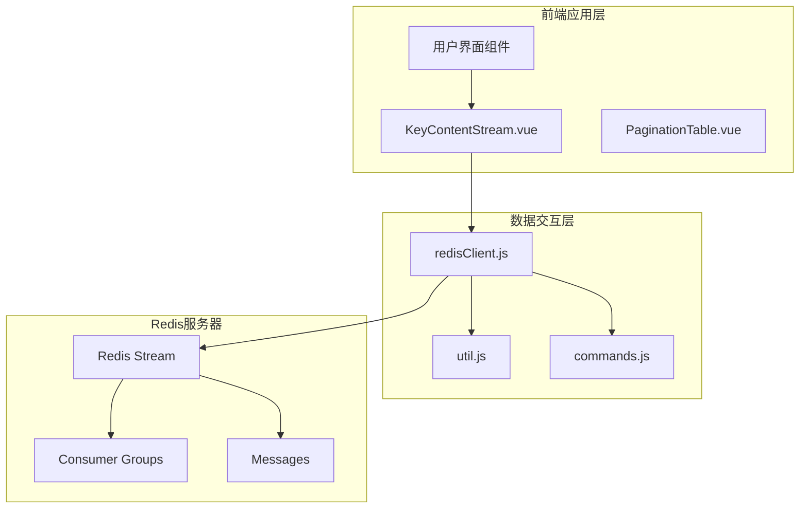

**图表来源**
- [KeyContentStream.vue](file://src/components/contents/KeyContentStream.vue#L1-L50)
- [redisClient.js](file://src/redisClient.js#L1-L50)

### 组件关系图

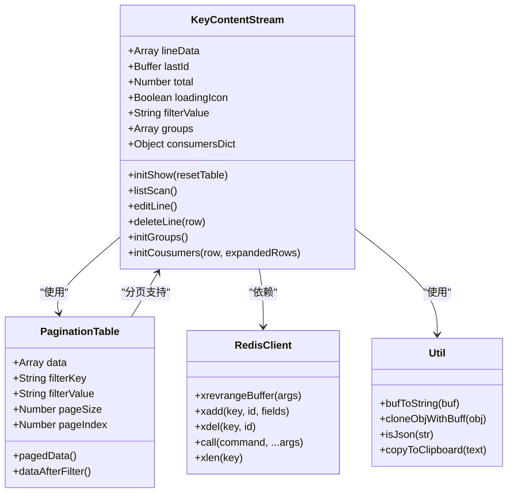

**图表来源**
- [KeyContentStream.vue](file://src/components/contents/KeyContentStream.vue#L136-L200)
- [PaginationTable.vue](file://src/components/PaginationTable.vue#L26-L55)

**章节来源**
- [KeyContentStream.vue](file://src/components/contents/KeyContentStream.vue#L1-L100)
- [redisClient.js](file://src/redisClient.js#L1-L100)

## 核心组件分析

### KeyContentStream.vue 组件结构

KeyContentStream.vue是Redis流操作的核心组件，采用Vue.js框架构建，提供了完整的流数据管理功能。

#### 主要数据属性

| 属性名 | 类型 | 默认值 | 描述 |
|--------|------|--------|------|
| total | Number | 0 | 流中消息总数 |
| lineData | Array | [] | 当前显示的消息数据数组 |
| lastId | Buffer | Buffer.from('') | 分页加载的最后一条消息ID |
| pageSize | Number | 200 | 每次加载的消息数量 |
| searchPageSize | Number | 2000 | 搜索时的分页大小 |
| filterValue | String | '' | 消息内容过滤关键字 |
| groupsVisible | Boolean | false | 消费者组信息对话框可见性 |
| groups | Array | [] | 消费者组列表 |
| consumersDict | Object | {} | 消费者信息字典 |

#### 核心方法架构

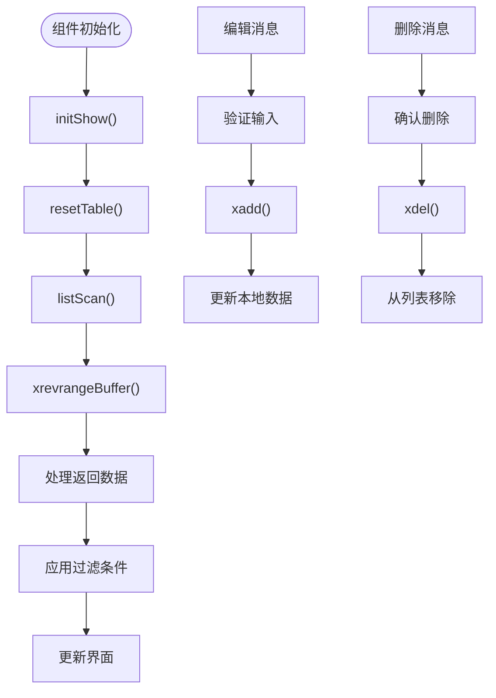

**图表来源**
- [KeyContentStream.vue](file://src/components/contents/KeyContentStream.vue#L182-L200)
- [KeyContentStream.vue](file://src/components/contents/KeyContentStream.vue#L308-L347)

**章节来源**
- [KeyContentStream.vue](file://src/components/contents/KeyContentStream.vue#L136-L200)

## 流数据展示与管理

### 消息条目结构展示

组件采用表格形式展示流消息，每个消息包含以下字段：

#### 表格列定义

| 列名 | 字段名 | 类型 | 描述 |
|------|--------|------|------|
| 序号 | id | String | 消息ID，显示总数量 |
| ID | id | String | Redis流消息唯一标识符 |
| 值 | contentString | String | 消息内容的JSON字符串表示 |
| 操作 | - | - | 包含复制、查看详情、删除、导出命令等功能按钮 |

#### 数据处理流程

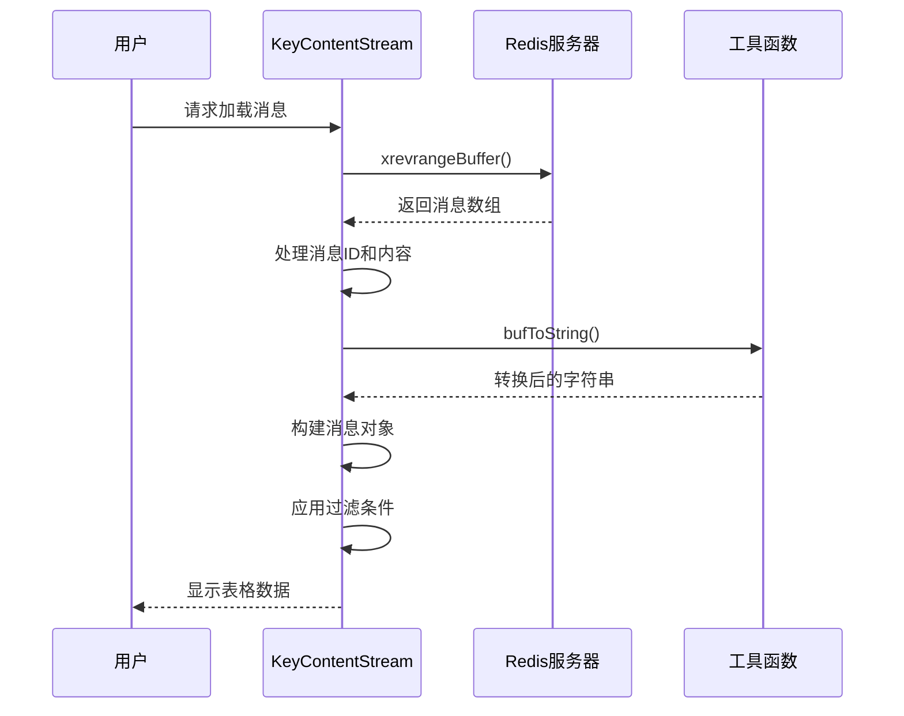

**图表来源**
- [KeyContentStream.vue](file://src/components/contents/KeyContentStream.vue#L200-L250)

### 时间范围过滤功能

组件支持通过最小ID(minId)和最大ID(maxId)参数进行时间范围过滤：

- **最小ID(minId)**：默认值为'-'，表示从最新消息开始
- **最大ID(maxId)**：默认值为'+'，表示到最旧消息结束
- **动态过滤**：用户输入过滤条件后按下回车键触发重新加载

### 搜索与过滤机制

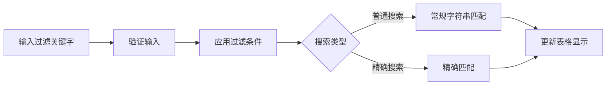

**图表来源**
- [KeyContentStream.vue](file://src/components/contents/KeyContentStream.vue#L241-L244)

**章节来源**
- [KeyContentStream.vue](file://src/components/contents/KeyContentStream.vue#L89-L133)

## 消费者组与待处理消息

### 消费者组信息管理

组件提供了完整的消费者组管理功能，通过XINFO命令获取和展示相关信息。

#### 消费者组数据结构

```mermaid
erDiagram
GROUP {
string name PK
number consumers
number pending
string "last-delivered-id"
}
CONSUMER {
string name PK
string group_name FK
number pending
number idle
datetime last_active
}
GROUP ||--o{ CONSUMER : contains
```

**图表来源**
- [KeyContentStream.vue](file://src/components/contents/KeyContentStream.vue#L371-L390)

#### 消费者组信息展示

| 字段名 | 描述 | 来源命令 |
|--------|------|----------|
| 组名称 | 消费者组的唯一标识符 | XINFO GROUPS |
| 消费者数量 | 该组中活跃消费者的数量 | XINFO GROUPS |
| 待处理消息 | 该组中待处理的消息数量 | XINFO GROUPS |
| 最后交付ID | 该组最后交付给消费者的消息ID | XINFO GROUPS |

### 待处理消息可视化

组件通过嵌套表格的形式展示每个消费者组的详细信息，包括：

- **消费者名称**：每个消费者的唯一标识符
- **待处理消息数**：消费者尚未确认的消息数量
- **空闲时间**：消费者上次活动以来的时间间隔

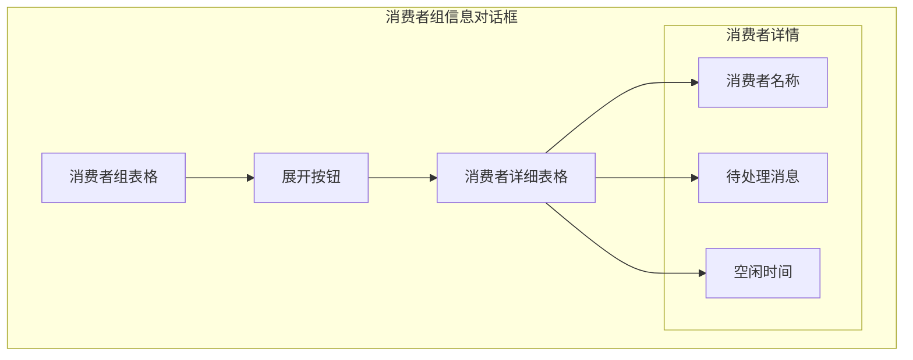

**图表来源**
- [KeyContentStream.vue](file://src/components/contents/KeyContentStream.vue#L40-L86)

**章节来源**
- [KeyContentStream.vue](file://src/components/contents/KeyContentStream.vue#L371-L410)

## 消息发布与编辑

### 新增消息界面

组件提供了直观的消息编辑界面，支持JSON格式的消息内容：

#### 编辑对话框功能

| 功能项 | 描述 | 实现方式 |
|--------|------|----------|
| 消息ID输入 | 支持自动生成或手动指定 | InputBinary组件 |
| 内容编辑 | JSON格式的消息内容 | FormatViewer组件 |
| 验证检查 | 确保JSON格式正确 | util.isJson() |
| 添加确认 | 确认后发送到Redis | editLine()方法 |

#### 消息添加流程

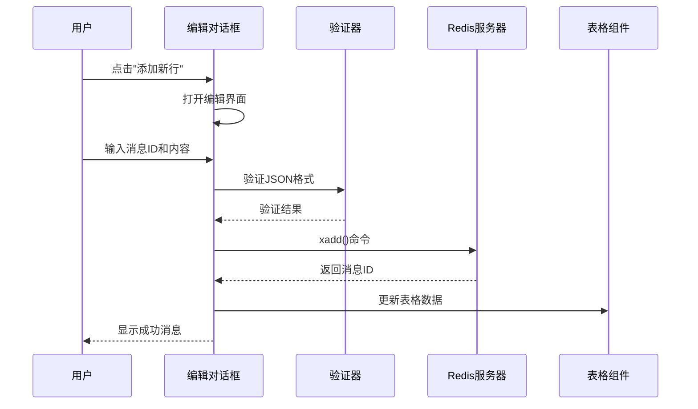

**图表来源**
- [KeyContentStream.vue](file://src/components/contents/KeyContentStream.vue#L286-L347)

### 消息编辑与删除

#### 编辑功能特性

- **查看详情**：只读模式查看消息内容
- **编辑修改**：支持修改消息内容和ID
- **格式验证**：确保JSON格式正确性
- **实时更新**：编辑后立即反映在界面上

#### 删除功能机制

- **确认提示**：删除前显示确认对话框
- **原子操作**：使用XDEL命令删除指定消息
- **状态同步**：删除后同步更新本地数据和计数

**章节来源**
- [KeyContentStream.vue](file://src/components/contents/KeyContentStream.vue#L286-L370)

## 数据交互与命令实现

### Redis命令映射

组件通过封装的Redis客户端实现各种流操作命令：

#### 核心命令映射表

| Vue方法 | Redis命令 | 参数说明 | 功能描述 |
|---------|-----------|----------|----------|
| listScan() | XREVRANGE | key, maxId, minId, COUNT, pageSize | 获取流消息，倒序排列 |
| editLine() | XADD | key, id, fields[] | 添加新消息到流 |
| deleteLine() | XDEL | key, id | 从流中删除指定消息 |
| initTotal() | XLEN | key | 获取流中消息总数 |
| initGroups() | XINFO GROUPS | key | 获取消费者组信息 |
| initCousumers() | XINFO CONSUMERS | key, groupname | 获取消费者组的消费者信息 |

#### 命令执行流程

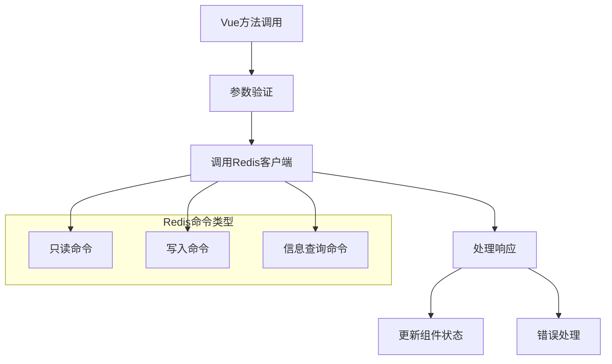

**图表来源**
- [commands.js](file://src/commands.js#L100-L107)
- [KeyContentStream.vue](file://src/components/contents/KeyContentStream.vue#L182-L200)

### 数据转换与处理

#### Buffer处理机制

组件使用专门的工具函数处理Redis返回的Buffer类型数据：

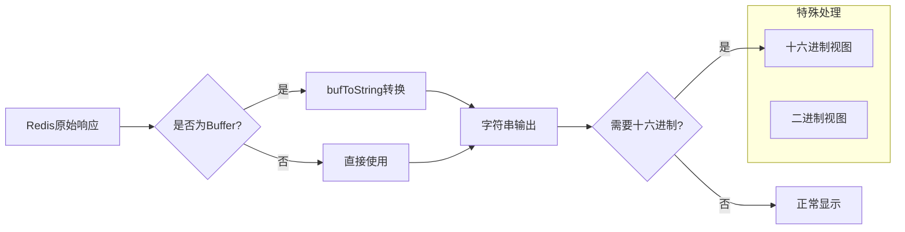

**图表来源**
- [util.js](file://src/util.js#L16-L44)

**章节来源**
- [KeyContentStream.vue](file://src/components/contents/KeyContentStream.vue#L182-L200)
- [commands.js](file://src/commands.js#L100-L107)

## 分页加载与时间范围过滤

### 分页加载机制

组件实现了智能的分页加载算法，支持大数据量的流消息浏览：

#### 分页策略

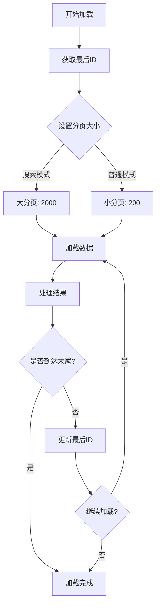

**图表来源**
- [KeyContentStream.vue](file://src/components/contents/KeyContentStream.vue#L192-L268)

#### 分页参数配置

| 参数 | 默认值 | 说明 |
|------|--------|------|
| pageSize | 200 | 普通模式下的分页大小 |
| searchPageSize | 2000 | 搜索模式下的分页大小 |
| padding | 1 | 防止重复的填充数量 |
| oneTimeListLength | 0 | 单次加载的实际长度 |

### 时间范围过滤实现

#### 过滤参数处理

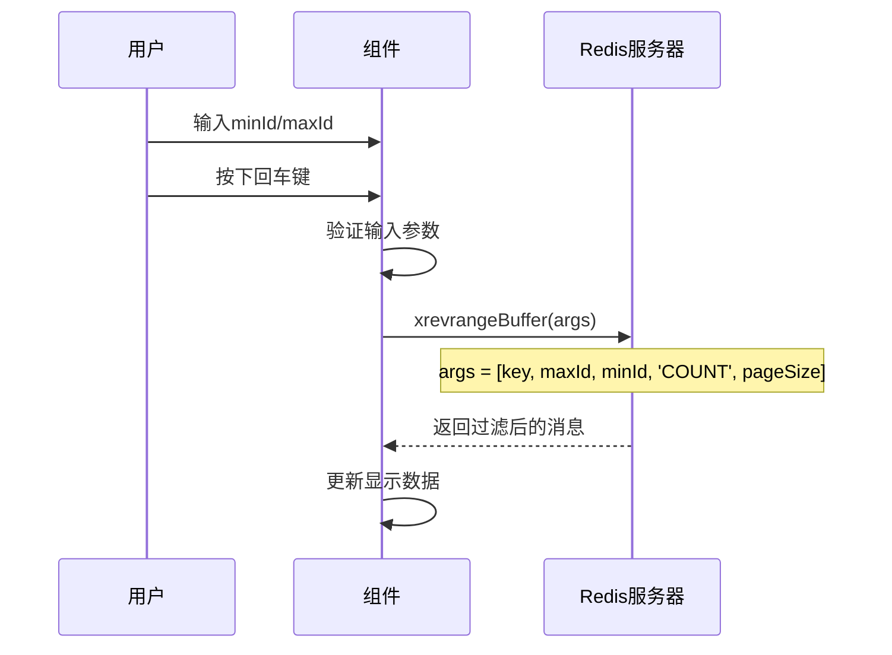

**图表来源**
- [KeyContentStream.vue](file://src/components/contents/KeyContentStream.vue#L192-L206)

#### 性能优化策略

- **智能分页**：根据数据量动态调整分页大小
- **增量加载**：只加载新增的数据部分
- **防重复**：通过lastId避免重复加载相同消息
- **内存管理**：及时清理不需要的数据

**章节来源**
- [KeyContentStream.vue](file://src/components/contents/KeyContentStream.vue#L192-L268)

## 技术实现机制

### 长轮询与订阅模式

虽然当前实现主要基于轮询机制，但组件架构为未来的订阅模式扩展预留了空间：

#### 当前实现特点

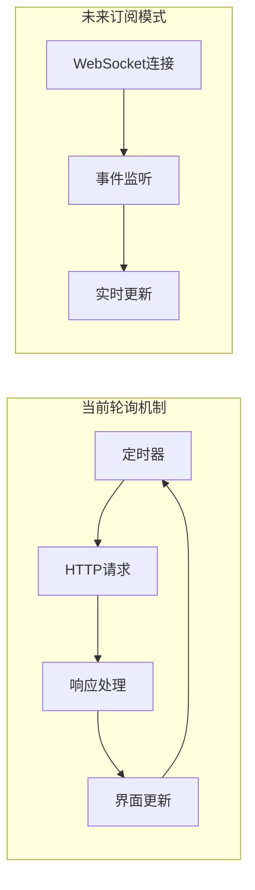

#### 订阅模式准备

组件在设计时考虑了以下订阅模式的扩展：

- **事件驱动架构**：方法间解耦，便于事件绑定
- **状态管理**：清晰的状态变量便于事件处理
- **异步处理**：Promise模式支持异步事件处理

### 数据同步机制

#### 实时性保证

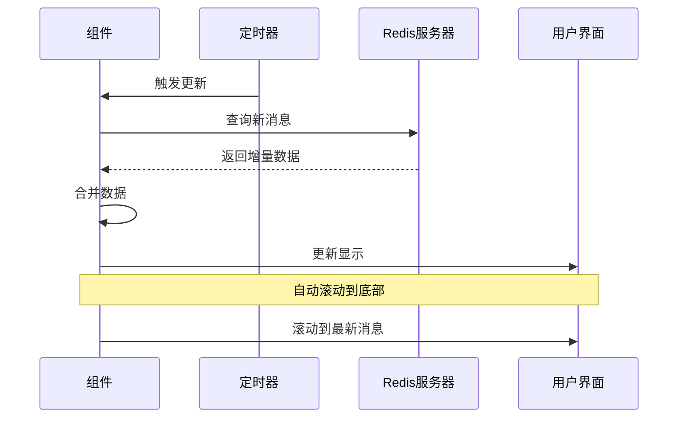

**图表来源**
- [KeyContentStream.vue](file://src/components/contents/KeyContentStream.vue#L172-L180)

### 错误处理与重试机制

#### 错误处理策略

| 错误类型 | 处理方式 | 用户反馈 |
|----------|----------|----------|
| 网络错误 | 显示错误图标 | 提示网络问题 |
| Redis命令错误 | 显示具体错误信息 | 用户友好的错误消息 |
| 数据格式错误 | 显示格式化警告 | 引导用户修正输入 |
| 权限错误 | 显示权限不足提示 | 引导用户检查配置 |

**章节来源**
- [KeyContentStream.vue](file://src/components/contents/KeyContentStream.vue#L265-L268)
- [KeyContentStream.vue](file://src/components/contents/KeyContentStream.vue#L345-L347)

## 性能优化考虑

### 内存管理优化

#### 数据结构优化

- **延迟加载**：只在需要时加载消费者信息
- **数据压缩**：对大量数据进行适当的压缩显示
- **垃圾回收**：及时清理不再使用的数据引用

#### 渲染性能优化

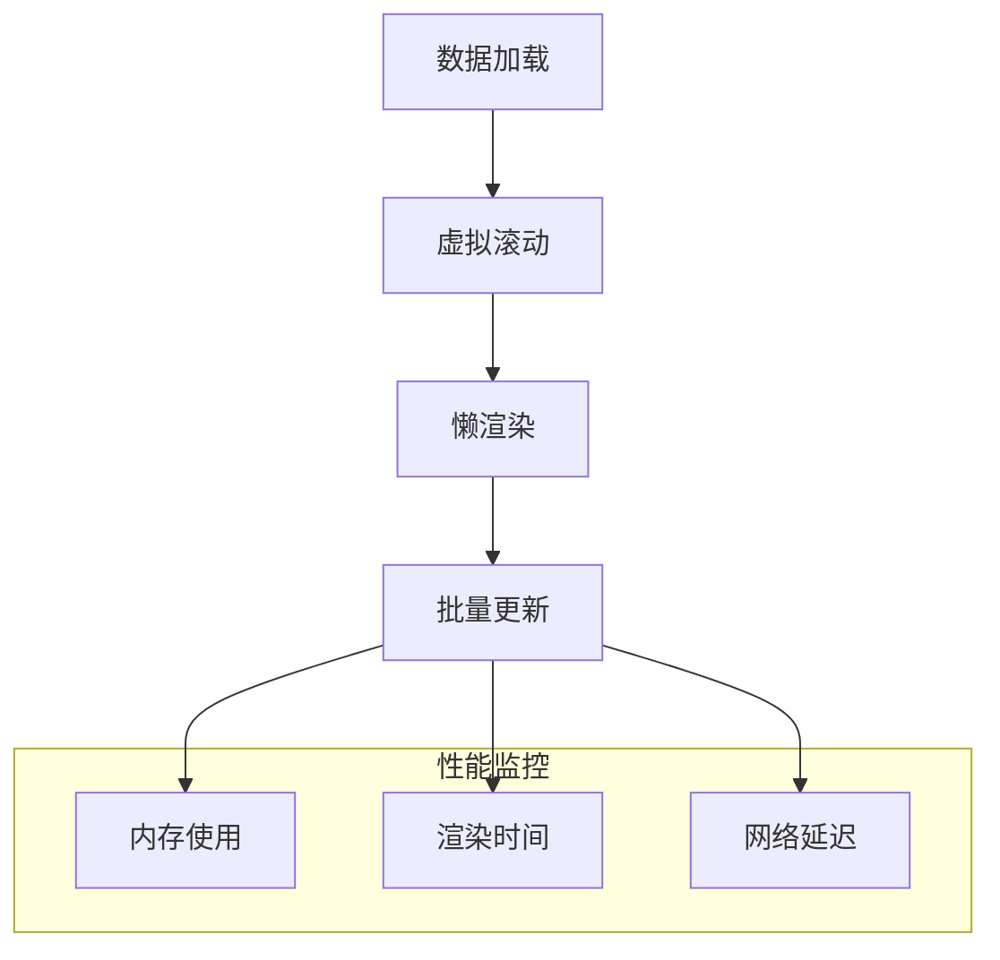

### 网络优化策略

#### 请求优化

- **批量操作**：合并多个小请求为批量请求
- **缓存机制**：对频繁访问的数据进行缓存
- **压缩传输**：对大数据量进行压缩传输

#### 连接管理

- **连接池**：复用Redis连接减少建立连接的开销
- **超时控制**：合理设置请求超时时间
- **重试机制**：在网络不稳定时自动重试

## 故障排除指南

### 常见问题诊断

#### 连接问题

| 问题症状 | 可能原因 | 解决方案 |
|----------|----------|----------|
| 无法加载消息 | Redis连接失败 | 检查连接配置和网络 |
| 加载速度慢 | 数据量过大 | 调整分页大小或使用过滤 |
| 消息重复显示 | 分页逻辑问题 | 检查lastId更新逻辑 |
| 消费者组信息缺失 | 权限不足 | 检查Redis权限配置 |

#### 数据问题

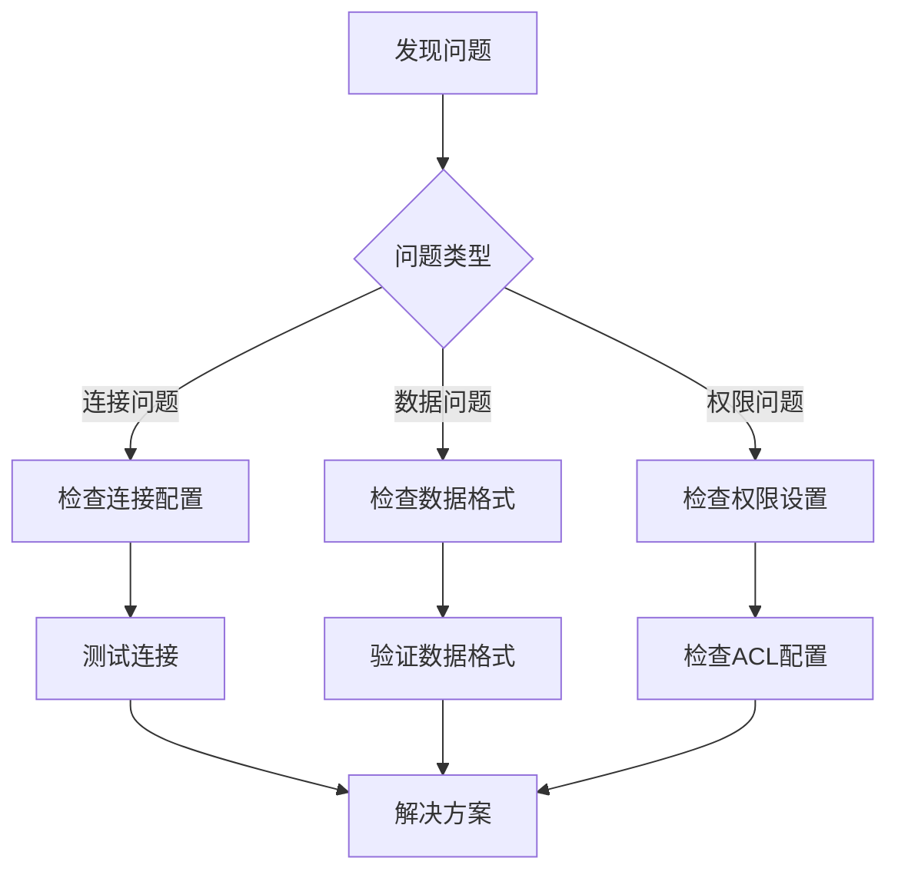

### 调试技巧

#### 开发者调试

- **浏览器开发者工具**：监控网络请求和JavaScript错误
- **Redis命令行**：直接执行相关Redis命令验证
- **日志分析**：查看应用日志和Redis日志

#### 性能分析

- **内存使用监控**：观察内存使用趋势
- **网络请求分析**：分析请求频率和响应时间
- **渲染性能监控**：检测界面响应速度

**章节来源**
- [KeyContentStream.vue](file://src/components/contents/KeyContentStream.vue#L265-L268)

## 总结

KeyContentStream.vue组件为Redis流类型提供了功能完整、用户体验良好的管理界面。通过深入分析其实现机制，我们可以看到：

### 核心优势

1. **功能完整性**：涵盖了流操作的所有核心功能
2. **用户体验**：直观的界面设计和流畅的操作体验
3. **技术先进性**：采用了现代Web开发的最佳实践
4. **可扩展性**：良好的架构设计为未来功能扩展预留了空间

### 技术亮点

- **智能分页**：高效的分页加载算法
- **实时更新**：及时的数据同步机制
- **错误处理**：完善的错误处理和用户反馈
- **性能优化**：多方面的性能优化策略

### 发展方向

随着Redis流功能的不断发展，该组件可以在以下方面进一步完善：

- **订阅模式支持**：实现实时的WebSocket订阅
- **高级过滤**：支持更复杂的消息过滤条件
- **批量操作**：增强批量消息处理能力
- **性能监控**：集成更多的性能监控指标

这个组件不仅是一个优秀的Redis流管理工具，也为类似的数据库管理工具开发提供了宝贵的参考和借鉴价值。