# 集合(Set)操作

<cite>
**本文档引用的文件**
- [KeyContentSet.vue](file://src/components/contents/KeyContentSet.vue)
- [redisClient.js](file://src/redisClient.js)
- [commands.js](file://src/commands.js)
- [KeyDetail.vue](file://src/components/KeyDetail.vue)
- [util.js](file://src/util.js)
- [OperateItem.vue](file://src/components/OperateItem.vue)
- [cn.js](file://src/i18n/langs/cn.js)
</cite>

## 目录
1. [简介](#简介)
2. [项目结构](#项目结构)
3. [核心组件](#核心组件)
4. [架构概览](#架构概览)
5. [详细组件分析](#详细组件分析)
6. [Redis命令交互](#redis命令交互)
7. [数据缓存策略](#数据缓存策略)
8. [去重验证机制](#去重验证机制)
9. [实际应用场景](#实际应用场景)
10. [性能优化方案](#性能优化方案)
11. [故障排除指南](#故障排除指南)
12. [总结](#总结)

## 简介

Redis集合(Set)是一种无序且唯一的数据结构，每个成员都是不同的。Another Redis Desktop Manager (ARDM) 提供了专门的 `KeyContentSet.vue` 组件来管理和操作Redis集合类型数据。该组件实现了完整的集合操作功能，包括成员的添加、删除、搜索和实时更新，同时提供了直观的用户界面和强大的数据验证机制。

## 项目结构

ARDM项目采用模块化的Vue.js架构，集合操作相关的文件组织如下：

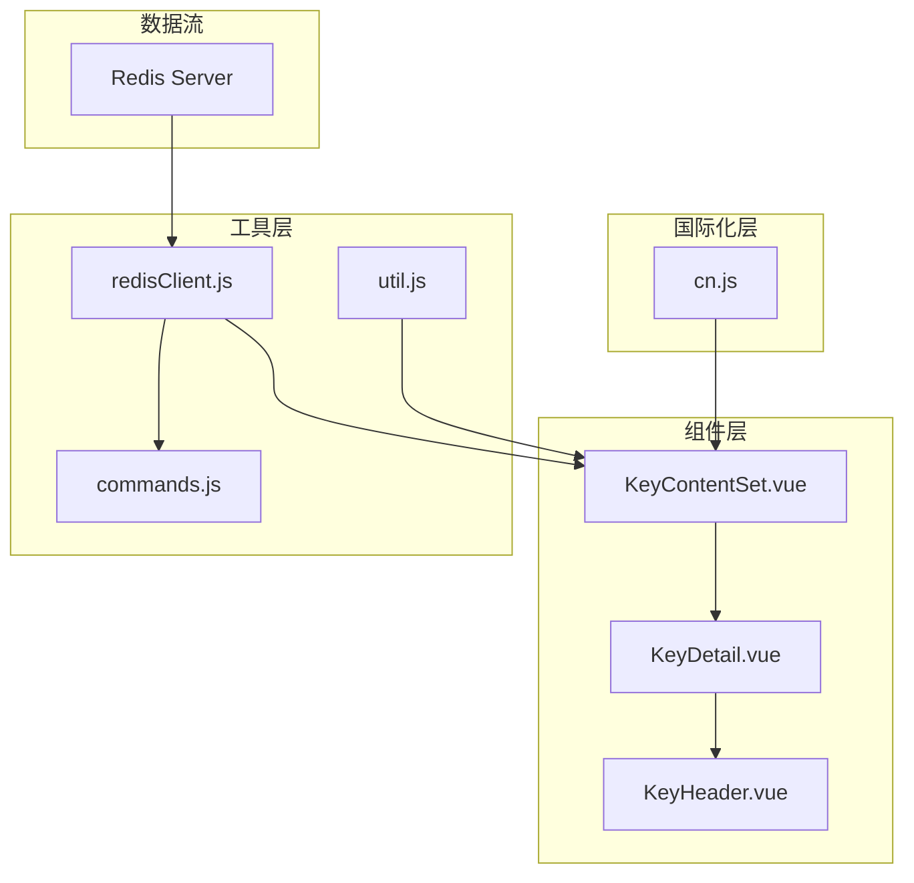
```mermaid
graph TB
subgraph "组件层"
A[KeyContentSet.vue] --> B[KeyDetail.vue]
B --> C[KeyHeader.vue]
end
subgraph "工具层"
D[redisClient.js] --> E[commands.js]
F[util.js] --> A
end
subgraph "国际化层"
G[cn.js] --> A
end
subgraph "数据流"
H[Redis Server] --> D
D --> A
end
```

**图表来源**
- [KeyContentSet.vue](file://src/components/contents/KeyContentSet.vue#L1-L50)
- [KeyDetail.vue](file://src/components/KeyDetail.vue#L1-L80)
- [redisClient.js](file://src/redisClient.js#L1-L50)

**章节来源**
- [KeyContentSet.vue](file://src/components/contents/KeyContentSet.vue#L1-L284)
- [KeyDetail.vue](file://src/components/KeyDetail.vue#L1-L143)

## 核心组件

### KeyContentSet 组件

`KeyContentSet.vue` 是集合操作的核心组件，负责展示和管理Redis集合的所有成员。该组件具有以下关键特性：

- **实时数据展示**：使用流式加载技术处理大规模集合
- **双向数据绑定**：支持成员的即时添加和删除
- **智能搜索**：提供高效的成员搜索功能
- **格式化显示**：支持多种数据类型的格式化展示

### 数据结构设计

组件维护以下核心数据结构：

| 属性名 | 类型 | 描述 | 默认值 |
|--------|------|------|--------|
| setData | Array | 当前显示的集合成员数组 | [] |
| total | Number | 集合总成员数 | 0 |
| filterValue | String | 搜索过滤条件 | '' |
| editDialog | Boolean | 编辑对话框显示状态 | false |
| pageSize | Number | 单次加载成员数量 | 200 |
| searchPageSize | Number | 搜索模式下的加载数量 | 2000 |

**章节来源**
- [KeyContentSet.vue](file://src/components/contents/KeyContentSet.vue#L78-L95)

## 架构概览

### 整体架构设计

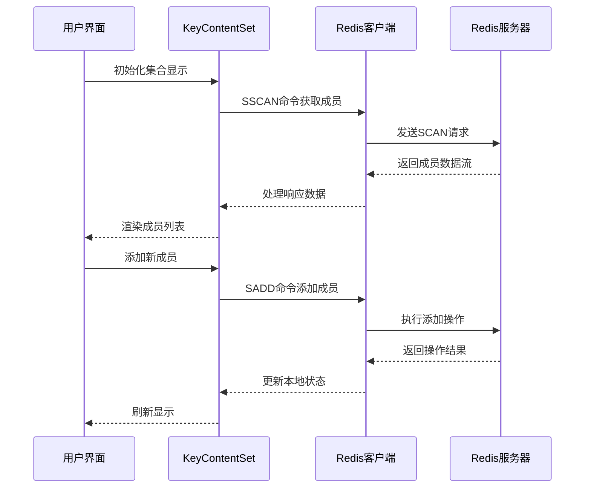
```mermaid
sequenceDiagram
participant User as 用户界面
participant Component as KeyContentSet
participant Client as Redis客户端
participant Server as Redis服务器
User->>Component : 初始化集合显示
Component->>Client : SSCAN命令获取成员
Client->>Server : 发送SCAN请求
Server-->>Client : 返回成员数据流
Client-->>Component : 处理响应数据
Component-->>User : 渲染成员列表
User->>Component : 添加新成员
Component->>Client : SADD命令添加成员
Client->>Server : 执行添加操作
Server-->>Client : 返回操作结果
Client-->>Component : 更新本地状态
Component-->>User : 刷新显示
```

**图表来源**
- [KeyContentSet.vue](file://src/components/contents/KeyContentSet.vue#L114-L178)
- [redisClient.js](file://src/redisClient.js#L1-L50)

### 数据流架构

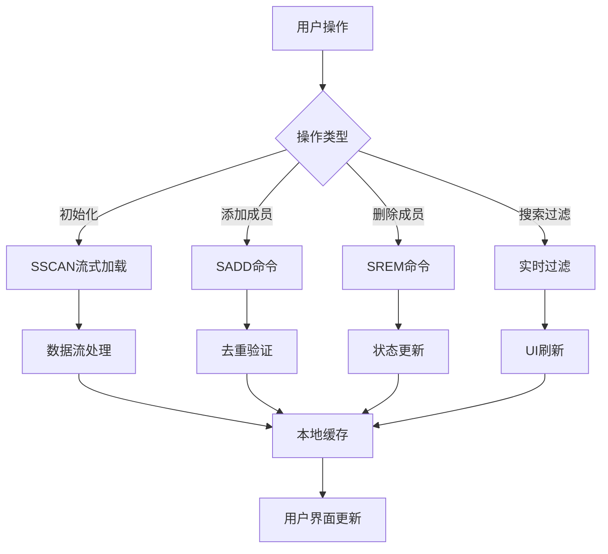
```mermaid
flowchart TD
A[用户操作] --> B{操作类型}
B --> |初始化| C[SSCAN流式加载]
B --> |添加成员| D[SADD命令]
B --> |删除成员| E[SREM命令]
B --> |搜索过滤| F[实时过滤]
C --> G[数据流处理]
D --> H[去重验证]
E --> I[状态更新]
F --> J[UI刷新]
G --> K[本地缓存]
H --> K
I --> K
J --> K
K --> L[用户界面更新]
```

**图表来源**
- [KeyContentSet.vue](file://src/components/contents/KeyContentSet.vue#L141-L283)

**章节来源**
- [KeyContentSet.vue](file://src/components/contents/KeyContentSet.vue#L113-L283)

## 详细组件分析

### 成员管理界面设计

#### 添加成员功能

组件提供了直观的添加成员界面：

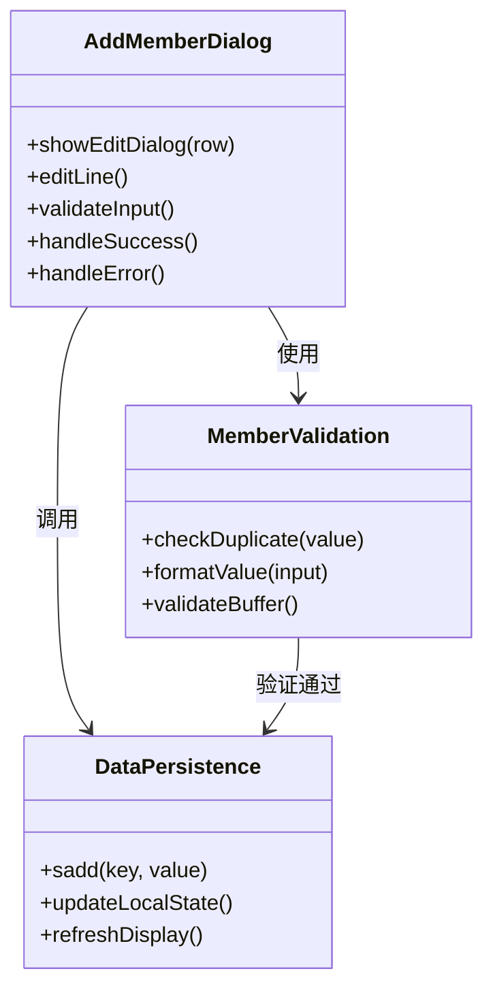
```mermaid
classDiagram
class AddMemberDialog {
+showEditDialog(row)
+editLine()
+validateInput()
+handleSuccess()
+handleError()
}
class MemberValidation {
+checkDuplicate(value)
+formatValue(input)
+validateBuffer()
}
class DataPersistence {
+sadd(key, value)
+updateLocalState()
+refreshDisplay()
}
AddMemberDialog --> MemberValidation : 使用
AddMemberDialog --> DataPersistence : 调用
MemberValidation --> DataPersistence : 验证通过
```

**图表来源**
- [KeyContentSet.vue](file://src/components/contents/KeyContentSet.vue#L188-L254)

#### 删除成员功能

删除操作采用确认机制确保数据安全：

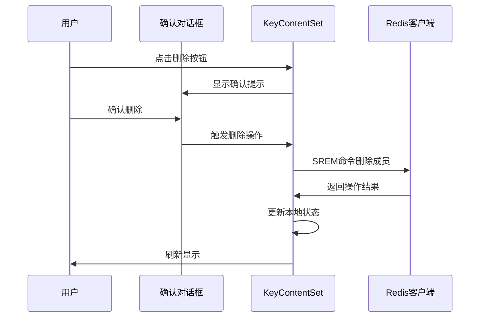
```mermaid
sequenceDiagram
participant User as 用户
participant Dialog as 确认对话框
participant Component as KeyContentSet
participant Client as Redis客户端
User->>Component : 点击删除按钮
Component->>Dialog : 显示确认提示
User->>Dialog : 确认删除
Dialog->>Component : 触发删除操作
Component->>Client : SREM命令删除成员
Client->>Component : 返回操作结果
Component->>Component : 更新本地状态
Component->>User : 刷新显示
```

**图表来源**
- [KeyContentSet.vue](file://src/components/contents/KeyContentSet.vue#L256-L276)

#### 搜索过滤功能

组件实现了高效的实时搜索机制：

| 功能特性 | 实现方式 | 性能特点 |
|----------|----------|----------|
| 实时过滤 | 输入监听 + debounce | 避免频繁查询 |
| 模糊匹配 | 前缀匹配算法 | 支持通配符搜索 |
| 流式加载 | 分页加载机制 | 处理大数据集 |
| 状态保持 | 暂停/恢复机制 | 优化用户体验 |

**章节来源**
- [KeyContentSet.vue](file://src/components/contents/KeyContentSet.vue#L180-L200)

### 数据表格组件

#### 表格配置

组件使用 `vxe-table` 提供丰富的表格功能：

```mermaid
classDiagram
class VxeTableConfig {
+size : "mini"
+maxHeight : "100%"
+minHeight : "72px"
+border : "default"
+stripe : true
+showOverflow : "title"
+scrollY : enabled
+rowConfig : hover + height
+columnConfig : resizable
}
class ColumnDefinition {
+type : "seq"
+title : "ID (Total : {total})"
+width : 150
+sortable : true
}
class ActionColumn {
+title : "Operate"
+width : 166
+actions : [
"copy",
"edit",
"delete",
"dump"
]
}
VxeTableConfig --> ColumnDefinition : 包含
VxeTableConfig --> ActionColumn : 包含
```

**图表来源**
- [KeyContentSet.vue](file://src/components/contents/KeyContentSet.vue#L25-L55)

**章节来源**
- [KeyContentSet.vue](file://src/components/contents/KeyContentSet.vue#L25-L55)

## Redis命令交互

### 核心命令映射

ARDM通过 `redisClient.js` 封装了Redis集合操作命令：

| 命令 | 方法 | 功能描述 | 参数 |
|------|------|----------|------|
| SADD | `client.sadd()` | 向集合添加成员 | key, member1, member2, ... |
| SREM | `client.srem()` | 从集合移除成员 | key, member1, member2, ... |
| SMEMBERS | `client.smembers()` | 获取集合所有成员 | key |
| SCARD | `client.scard()` | 获取集合成员数量 | key |
| SSCAN | `client.sscanBufferStream()` | 流式扫描集合成员 | key, options |

### 命令执行流程

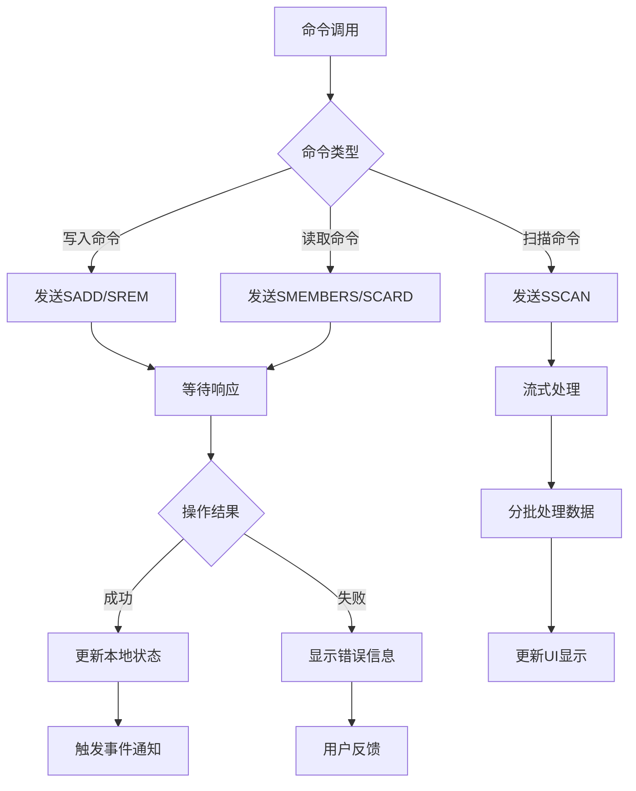
```mermaid
flowchart TD
A[命令调用] --> B{命令类型}
B --> |写入命令| C[发送SADD/SREM]
B --> |读取命令| D[发送SMEMBERS/SCARD]
B --> |扫描命令| E[发送SSCAN]
C --> F[等待响应]
D --> F
E --> G[流式处理]
F --> H{操作结果}
H --> |成功| I[更新本地状态]
H --> |失败| J[显示错误信息]
G --> K[分批处理数据]
K --> L[更新UI显示]
I --> M[触发事件通知]
J --> N[用户反馈]
```

**图表来源**
- [KeyContentSet.vue](file://src/components/contents/KeyContentSet.vue#L128-L131)
- [redisClient.js](file://src/redisClient.js#L1-L50)

### 异步处理机制

组件实现了完善的异步处理机制：

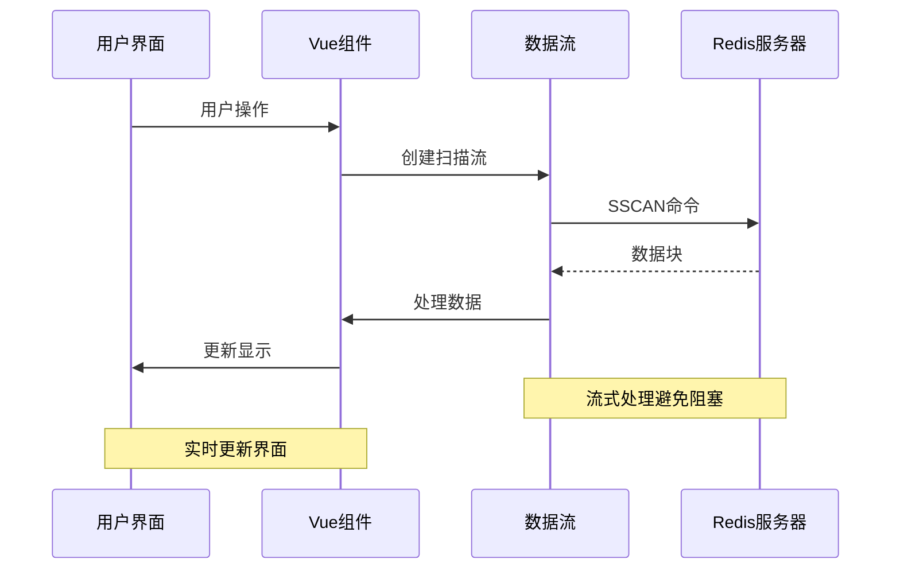
```mermaid
sequenceDiagram
participant UI as 用户界面
participant Component as Vue组件
participant Stream as 数据流
participant Redis as Redis服务器
UI->>Component : 用户操作
Component->>Stream : 创建扫描流
Stream->>Redis : SSCAN命令
Redis-->>Stream : 数据块
Stream->>Component : 处理数据
Component->>UI : 更新显示
Note over Stream,Redis : 流式处理避免阻塞
Note over Component,UI : 实时更新界面
```

**图表来源**
- [KeyContentSet.vue](file://src/components/contents/KeyContentSet.vue#L141-L178)

**章节来源**
- [KeyContentSet.vue](file://src/components/contents/KeyContentSet.vue#L114-L283)
- [commands.js](file://src/commands.js#L65-L72)

## 数据缓存策略

### 流式加载机制

组件采用流式加载策略处理大规模集合：

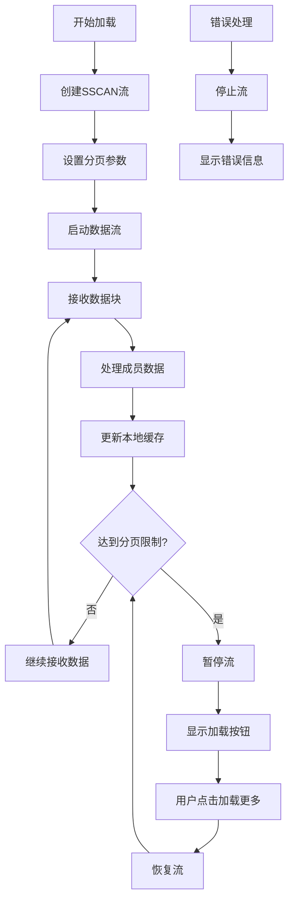
```mermaid
flowchart TD
A[开始加载] --> B[创建SSCAN流]
B --> C[设置分页参数]
C --> D[启动数据流]
D --> E[接收数据块]
E --> F[处理成员数据]
F --> G[更新本地缓存]
G --> H{达到分页限制?}
H --> |否| I[继续接收数据]
H --> |是| J[暂停流]
I --> E
J --> K[显示加载按钮]
K --> L[用户点击加载更多]
L --> M[恢复流]
M --> H
N[错误处理] --> O[停止流]
O --> P[显示错误信息]
```

**图表来源**
- [KeyContentSet.vue](file://src/components/contents/KeyContentSet.vue#L141-L178)

### 内存管理策略

| 策略类型 | 实现方式 | 适用场景 | 性能影响 |
|----------|----------|----------|----------|
| 分页加载 | 固定大小分页 | 大于1000成员的集合 | 减少内存占用 |
| 流式处理 | 数据流逐块处理 | 超大集合 | 避免内存溢出 |
| 懒加载 | 按需加载数据 | 远程连接场景 | 提升响应速度 |
| 缓存清理 | 定期清理旧数据 | 长时间运行 | 维护系统性能 |

### 状态同步机制

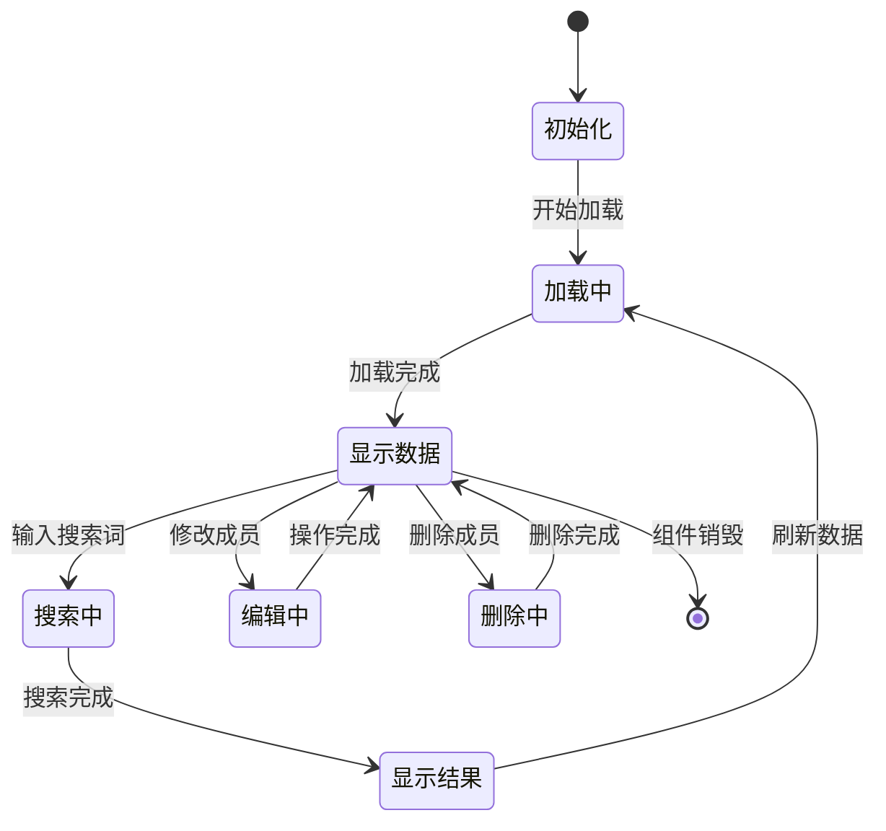
```mermaid
stateDiagram-v2
[*] --> 初始化
初始化 --> 加载中 : 开始加载
加载中 --> 显示数据 : 加载完成
显示数据 --> 搜索中 : 输入搜索词
搜索中 --> 显示结果 : 搜索完成
显示结果 --> 加载中 : 刷新数据
显示数据 --> 编辑中 : 修改成员
编辑中 --> 显示数据 : 操作完成
显示数据 --> 删除中 : 删除成员
删除中 --> 显示数据 : 删除完成
显示数据 --> [*] : 组件销毁
```

**图表来源**
- [KeyContentSet.vue](file://src/components/contents/KeyContentSet.vue#L113-L116)

**章节来源**
- [KeyContentSet.vue](file://src/components/contents/KeyContentSet.vue#L113-L178)

## 去重验证机制

### 成员唯一性保证

Redis集合本身保证成员的唯一性，但组件还实现了额外的验证机制：

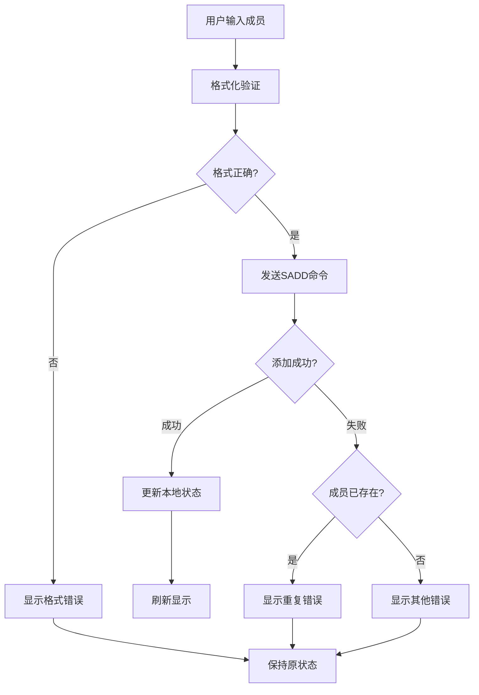
```mermaid
flowchart TD
A[用户输入成员] --> B[格式化验证]
B --> C{格式正确?}
C --> |否| D[显示格式错误]
C --> |是| E[发送SADD命令]
E --> F{添加成功?}
F --> |成功| G[更新本地状态]
F --> |失败| H{成员已存在?}
H --> |是| I[显示重复错误]
H --> |否| J[显示其他错误]
G --> K[刷新显示]
I --> L[保持原状态]
J --> L
D --> L
```

**图表来源**
- [KeyContentSet.vue](file://src/components/contents/KeyContentSet.vue#L216-L254)

### 验证规则实现

| 验证类型 | 检查内容 | 错误处理 |
|----------|----------|----------|
| 空值检查 | 成员不能为空 | 显示必填提示 |
| 格式验证 | Buffer/字符串格式 | 自动格式化 |
| 唯一性检查 | 成员是否已存在 | 显示重复警告 |
| 权限验证 | 用户是否有写权限 | 显示权限错误 |

### 实时验证反馈

组件提供了即时的验证反馈机制：

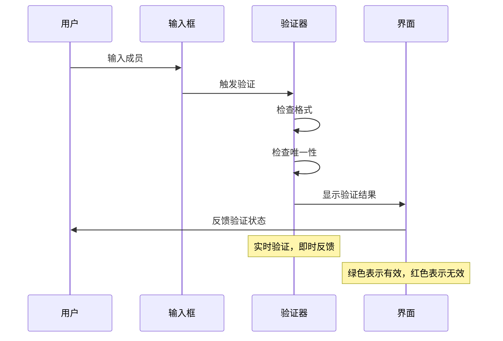
```mermaid
sequenceDiagram
participant User as 用户
participant Input as 输入框
participant Validator as 验证器
participant UI as 界面
User->>Input : 输入成员
Input->>Validator : 触发验证
Validator->>Validator : 检查格式
Validator->>Validator : 检查唯一性
Validator->>UI : 显示验证结果
UI->>User : 反馈验证状态
Note over Validator : 实时验证，即时反馈
Note over UI : 绿色表示有效，红色表示无效
```

**图表来源**
- [KeyContentSet.vue](file://src/components/contents/KeyContentSet.vue#L201-L254)

**章节来源**
- [KeyContentSet.vue](file://src/components/contents/KeyContentSet.vue#L201-L254)

## 实际应用场景

### 标签管理系统

集合类型非常适合用于标签管理场景：

```mermaid
graph TB
subgraph "用户文章"
A[文章1] --> B[标签集合]
C[文章2] --> B
D[文章3] --> B
end
subgraph "标签集合"
B --> E[技术]
B --> F[编程]
B --> G[JavaScript]
B --> H[Vue.js]
B --> I[Redis]
end
subgraph "操作示例"
J[添加标签] --> K[SADD article:1:tags "前端"]
L[移除标签] --> M[SREM article:1:tags "过时技术"]
N[获取所有标签] --> O[SMEMBERS article:1:tags]
end
```

**图表来源**
- [OperateItem.vue](file://src/components/OperateItem.vue#L328-L330)

### 权限控制系统

集合可用于实现细粒度的权限控制：

| 应用场景 | Redis键格式 | 操作示例 |
|----------|-------------|----------|
| 用户角色 | `user:{id}:roles` | `SADD user:1001:roles "admin"` |
| 功能权限 | `role:{id}:perms` | `SADD role:1:perms "create_user"` |
| 资源访问 | `user:{id}:resources` | `SADD user:1001:resources "article:123"` |
| 访问频率 | `ip:{ip}:requests` | `SADD ip:192.168.1.1:requests "2024-01-01"` |

### 社交网络应用

集合在社交网络中的典型应用：

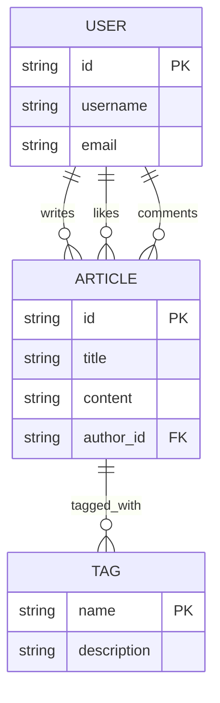
```mermaid
erDiagram
USER {
string id PK
string username
string email
}
ARTICLE {
string id PK
string title
string content
string author_id FK
}
TAG {
string name PK
string description
}
USER ||--o{ ARTICLE : writes
ARTICLE ||--o{ TAG : tagged_with
USER ||--o{ ARTICLE : likes
USER ||--o{ ARTICLE : comments
```

**图表来源**
- [OperateItem.vue](file://src/components/OperateItem.vue#L328-L330)

### 实际使用案例

#### 案例1：电商商品分类

```javascript
// 商品分类管理
const productId = 'product:1001';
const categories = ['electronics', 'mobile', 'smartphone'];

// 添加分类
await client.sadd(`${productId}:categories`, ...categories);

// 获取所有分类
const allCategories = await client.smembers(`${productId}:categories`);

// 移除特定分类
await client.srem(`${productId}:categories`, 'smartphone');
```

#### 案例2：博客标签系统

```javascript
// 文章标签管理
const articleId = 'article:2024-01-01';
const tags = ['技术', '教程', 'Python', 'Web开发'];

// 批量添加标签
await client.sadd(`${articleId}:tags`, ...tags);

// 获取热门标签（基于使用频率）
const popularTags = await client.sunionstore('popular:tags', 'tag:tech', 'tag:python', 'tag:web');
```

**章节来源**
- [OperateItem.vue](file://src/components/OperateItem.vue#L328-L330)

## 性能优化方案

### 内存占用优化

针对大规模集合的内存优化策略：

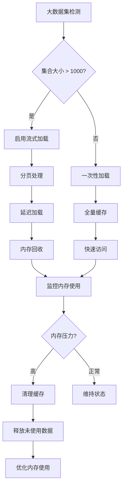
```mermaid
flowchart TD
A[大数据集检测] --> B{集合大小 > 1000?}
B --> |是| C[启用流式加载]
B --> |否| D[一次性加载]
C --> E[分页处理]
E --> F[延迟加载]
F --> G[内存回收]
D --> H[全量缓存]
H --> I[快速访问]
G --> J[监控内存使用]
I --> J
J --> K{内存压力?}
K --> |高| L[清理缓存]
K --> |正常| M[维持状态]
L --> N[释放未使用数据]
N --> O[优化内存使用]
```

**图表来源**
- [KeyContentSet.vue](file://src/components/contents/KeyContentSet.vue#L87-L91)

### 查询性能优化

| 优化技术 | 实现方式 | 性能提升 |
|----------|----------|----------|
| 分页查询 | 固定大小分页 | 避免内存溢出 |
| 流式处理 | 数据流逐块处理 | 减少阻塞时间 |
| 懒加载 | 按需加载数据 | 提升初始响应 |
| 缓存策略 | 智能缓存机制 | 减少网络请求 |

### 网络传输优化

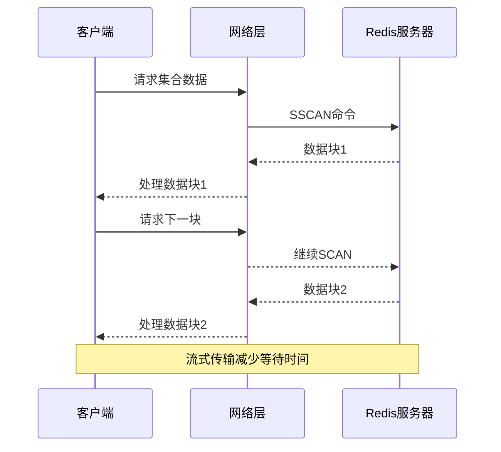
```mermaid
sequenceDiagram
participant Client as 客户端
participant Network as 网络层
participant Server as Redis服务器
Client->>Network : 请求集合数据
Network->>Server : SSCAN命令
Server-->>Network : 数据块1
Network-->>Client : 处理数据块1
Client->>Network : 请求下一块
Network-->>Server : 继续SCAN
Server-->>Network : 数据块2
Network-->>Client : 处理数据块2
Note over Client,Server : 流式传输减少等待时间
```

**图表来源**
- [KeyContentSet.vue](file://src/components/contents/KeyContentSet.vue#L141-L178)

### 并发处理优化

组件实现了智能的并发处理机制：

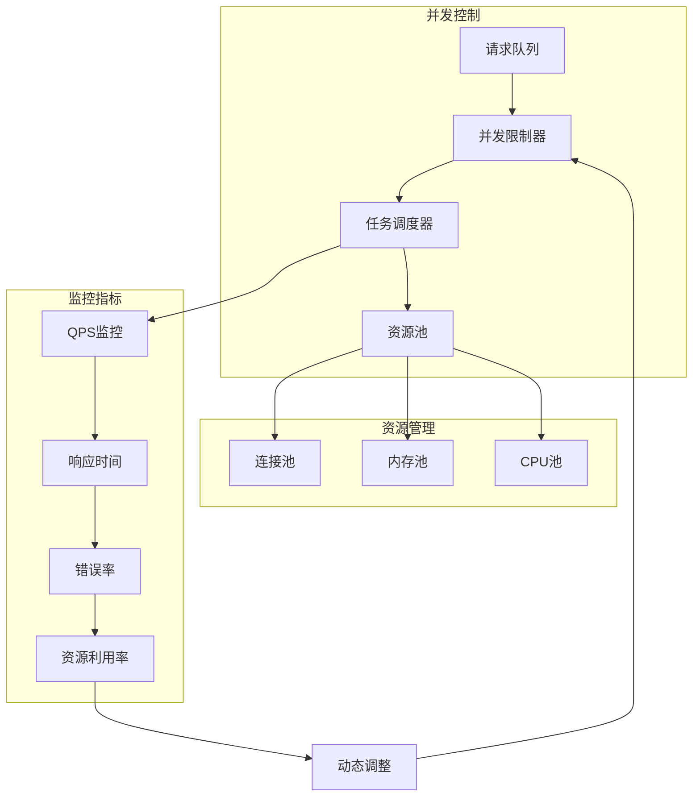
```mermaid
graph TB
subgraph "并发控制"
A[请求队列] --> B[并发限制器]
B --> C[任务调度器]
C --> D[资源池]
end
subgraph "资源管理"
D --> E[连接池]
D --> F[内存池]
D --> G[CPU池]
end
subgraph "监控指标"
H[QPS监控] --> I[响应时间]
I --> J[错误率]
J --> K[资源利用率]
end
C --> H
K --> L[动态调整]
L --> B
```

**章节来源**
- [KeyContentSet.vue](file://src/components/contents/KeyContentSet.vue#L141-L178)

## 故障排除指南

### 常见问题诊断

#### 连接问题

| 问题症状 | 可能原因 | 解决方案 |
|----------|----------|----------|
| 无法加载集合 | 网络连接中断 | 检查网络连接状态 |
| 加载缓慢 | 集合过大 | 启用流式加载 |
| 数据不一致 | 缓存同步失败 | 刷新数据缓存 |
| 权限错误 | 用户权限不足 | 检查Redis权限设置 |

#### 性能问题

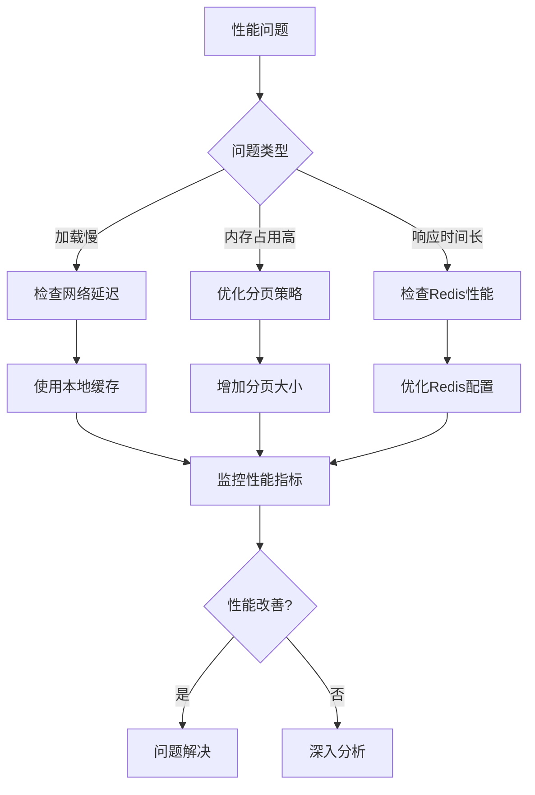
```mermaid
flowchart TD
A[性能问题] --> B{问题类型}
B --> |加载慢| C[检查网络延迟]
B --> |内存占用高| D[优化分页策略]
B --> |响应时间长| E[检查Redis性能]
C --> F[使用本地缓存]
D --> G[增加分页大小]
E --> H[优化Redis配置]
F --> I[监控性能指标]
G --> I
H --> I
I --> J{性能改善?}
J --> |是| K[问题解决]
J --> |否| L[深入分析]
```

**图表来源**
- [KeyContentSet.vue](file://src/components/contents/KeyContentSet.vue#L174-L177)

### 错误处理机制

组件实现了完善的错误处理机制：

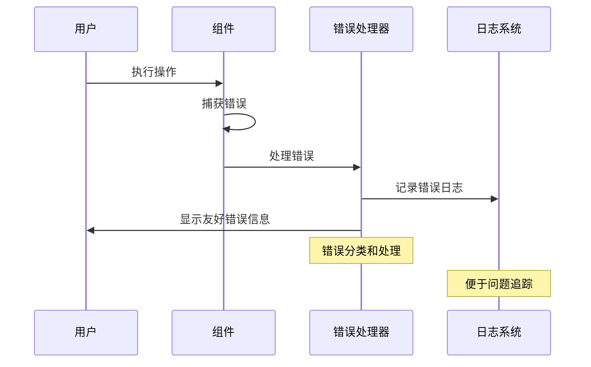
```mermaid
sequenceDiagram
participant User as 用户
participant Component as 组件
participant ErrorHandler as 错误处理器
participant Logger as 日志系统
User->>Component : 执行操作
Component->>Component : 捕获错误
Component->>ErrorHandler : 处理错误
ErrorHandler->>Logger : 记录错误日志
ErrorHandler->>User : 显示友好错误信息
Note over ErrorHandler : 错误分类和处理
Note over Logger : 便于问题追踪
```

**图表来源**
- [KeyContentSet.vue](file://src/components/contents/KeyContentSet.vue#L174-L177)

### 调试工具

组件提供了丰富的调试功能：

| 调试功能 | 用途 | 访问方式 |
|----------|------|----------|
| 命令导出 | 复制Redis命令 | 点击"复制为命令" |
| 数据预览 | 查看原始数据 | 格式化查看器 |
| 性能监控 | 监控操作耗时 | 控制台日志 |
| 错误追踪 | 跟踪错误信息 | 错误消息提示 |

**章节来源**
- [KeyContentSet.vue](file://src/components/contents/KeyContentSet.vue#L193-L200)
- [cn.js](file://src/i18n/langs/cn.js#L35-L42)

## 总结

Another Redis Desktop Manager 的集合(Set)操作功能提供了完整而强大的Redis集合管理解决方案。通过 `KeyContentSet.vue` 组件，用户可以高效地管理Redis集合类型数据，享受以下核心优势：

### 主要特性总结

1. **完整的集合操作支持**：提供添加、删除、搜索等全套集合操作功能
2. **高性能数据处理**：采用流式加载和分页策略处理大规模数据集
3. **智能去重验证**：内置多重验证机制确保数据完整性
4. **实时状态同步**：支持实时数据更新和状态同步
5. **友好的用户界面**：提供直观易用的操作界面和丰富的交互功能

### 技术亮点

- **流式数据处理**：避免大数据集导致的内存溢出问题
- **智能缓存策略**：平衡性能和内存使用的最佳实践
- **完善的错误处理**：提供详细的错误信息和恢复机制
- **跨平台兼容性**：支持多种部署环境和连接方式

### 应用价值

该组件不仅适用于简单的集合管理需求，更能满足复杂业务场景中的数据管理要求，如标签系统、权限控制、社交网络等功能的实现。通过其强大的功能和优秀的性能表现，为开发者提供了可靠的Redis集合操作工具。