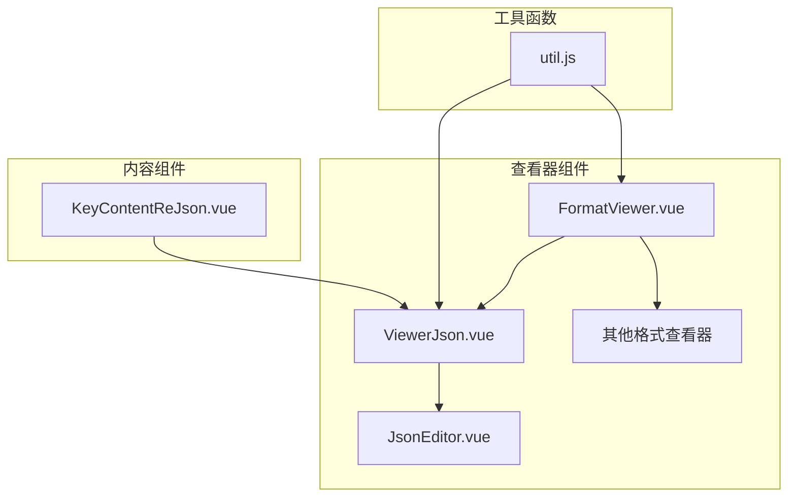
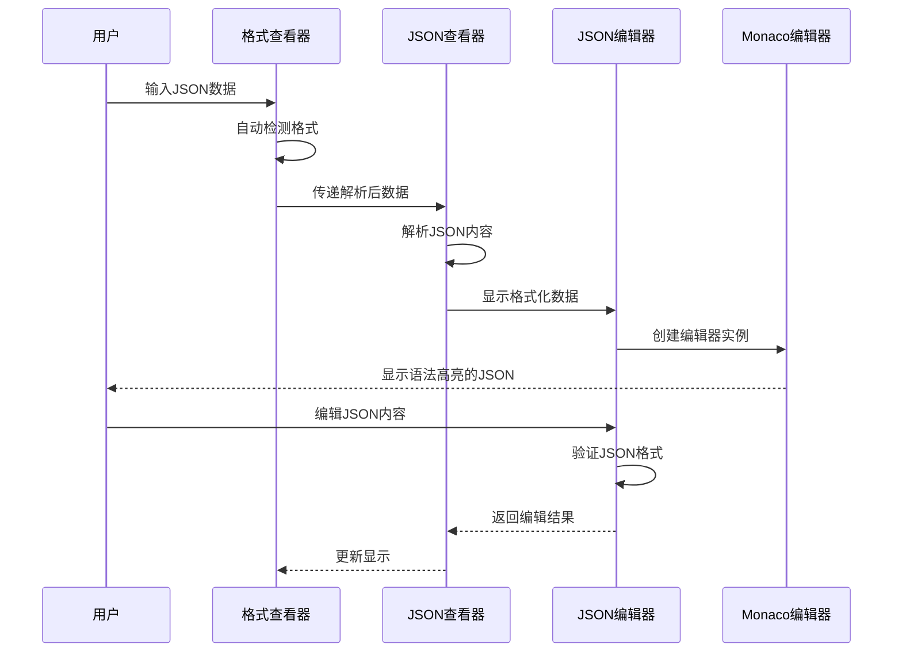
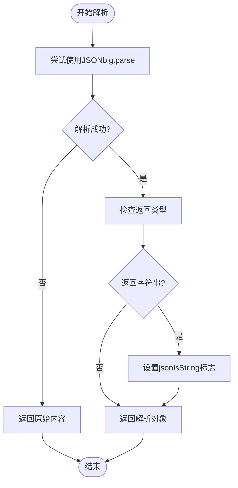
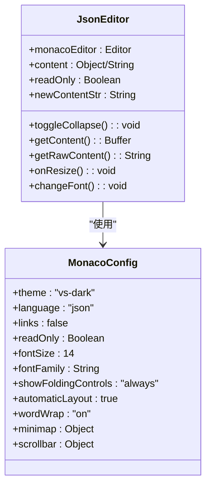
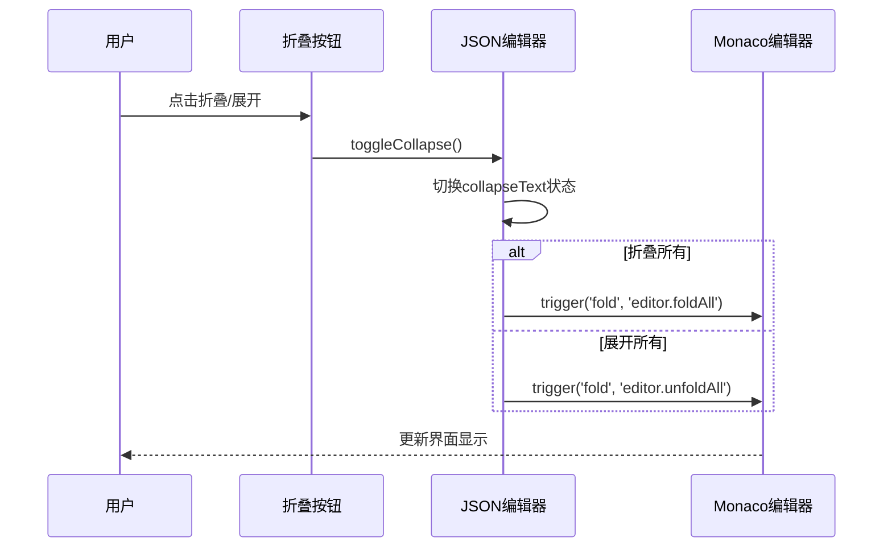
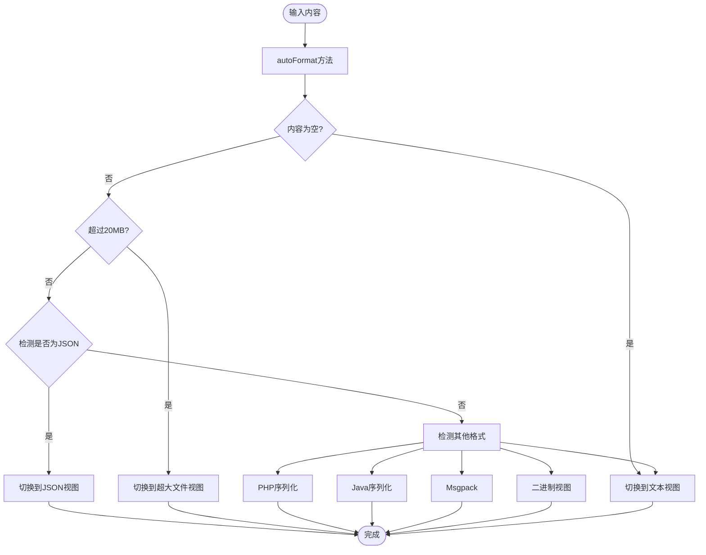
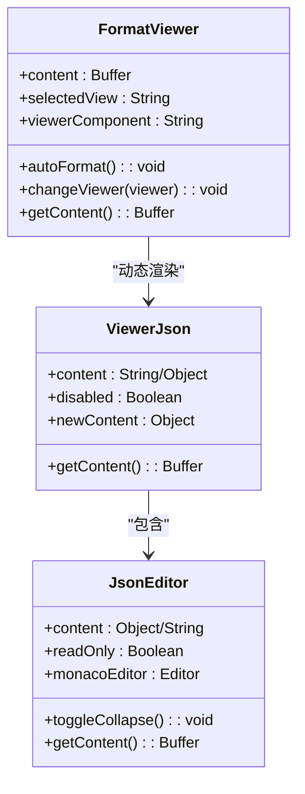
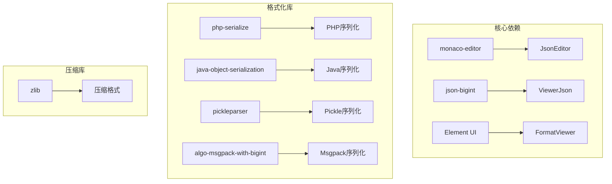
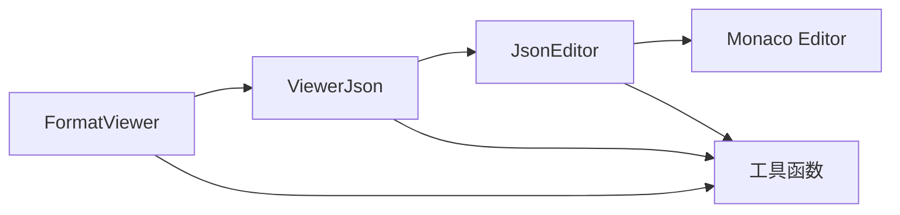
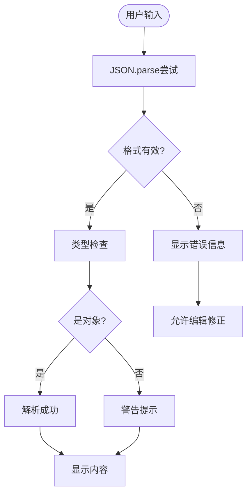

# JSON查看器

<cite>
**本文档中引用的文件**
- [ViewerJson.vue](file://src/components/viewers/ViewerJson.vue)
- [JsonEditor.vue](file://src/components/JsonEditor.vue)
- [FormatViewer.vue](file://src/components/FormatViewer.vue)
- [util.js](file://src/util.js)
- [KeyContentReJson.vue](file://src/components/contents/KeyContentReJson.vue)
</cite>

## 目录
1. [简介](#简介)
2. [项目结构](#项目结构)
3. [核心组件](#核心组件)
4. [架构概览](#架构概览)
5. [详细组件分析](#详细组件分析)
6. [依赖关系分析](#依赖关系分析)
7. [性能考虑](#性能考虑)
8. [故障排除指南](#故障排除指南)
9. [结论](#结论)

## 简介

JSON查看器是Another Redis Desktop Manager中的一个重要组件，专门用于处理和显示JSON格式的数据。该系统采用模块化设计，通过ViewerJson.vue作为主要入口，结合JsonEditor.vue提供强大的编辑功能，以及FormatViewer.vue进行格式化和类型检测，为用户提供了一个功能完善的JSON数据查看和编辑解决方案。

## 项目结构

JSON查看器相关的核心文件组织如下：

**图表来源**
- [ViewerJson.vue](file://src/components/viewers/ViewerJson.vue#L1-L47)
- [JsonEditor.vue](file://src/components/JsonEditor.vue#L1-L239)
- [FormatViewer.vue](file://src/components/FormatViewer.vue#L1-L294)

**章节来源**
- [ViewerJson.vue](file://src/components/viewers/ViewerJson.vue#L1-L47)
- [JsonEditor.vue](file://src/components/JsonEditor.vue#L1-L239)
- [FormatViewer.vue](file://src/components/FormatViewer.vue#L1-L294)

## 核心组件

### ViewerJson.vue - 主要入口组件

ViewerJson.vue是JSON查看器的主要入口点，负责接收原始JSON数据并传递给JsonEditor组件进行显示和编辑。

**主要特性：**
- 使用JSONbig库处理大整数
- 智能解析JSON字符串和对象
- 处理JSON字符串包装情况
- 提供只读和可编辑模式

**属性接口：**
- `content`: 原始JSON数据
- `disabled`: 是否禁用编辑功能

**方法：**
- `getContent()`: 获取编辑后的JSON内容

### JsonEditor.vue - 编辑器核心组件

JsonEditor.vue基于Monaco Editor构建，提供了专业的JSON编辑体验。

**主要特性：**
- 语法高亮显示
- 节点折叠展开功能
- 自动格式化
- 错误处理和验证
- 性能优化的布局管理

**配置选项：**
- 主题设置（vs-dark）
- 语言模式（JSON）
- 折叠控件显示
- 字体和大小调整
- 滚动条自定义

**章节来源**
- [ViewerJson.vue](file://src/components/viewers/ViewerJson.vue#L1-L47)
- [JsonEditor.vue](file://src/components/JsonEditor.vue#L1-L239)

## 架构概览

JSON查看器采用分层架构设计，确保了良好的可维护性和扩展性：

**图表来源**
- [FormatViewer.vue](file://src/components/FormatViewer.vue#L172-L228)
- [ViewerJson.vue](file://src/components/viewers/ViewerJson.vue#L14-L26)
- [JsonEditor.vue](file://src/components/JsonEditor.vue#L96-L141)

## 详细组件分析

### JSON解析机制

#### 智能解析流程

**图表来源**
- [ViewerJson.vue](file://src/components/viewers/ViewerJson.vue#L14-L26)

#### 错误处理策略

系统实现了多层次的错误处理机制：

1. **解析级错误处理**：捕获JSON.parse异常，返回原始内容
2. **格式验证**：使用工具函数验证JSON有效性
3. **用户反馈**：通过消息提示告知用户格式问题

**章节来源**
- [ViewerJson.vue](file://src/components/viewers/ViewerJson.vue#L14-L26)
- [util.js](file://src/util.js#L81-L88)

### 语法高亮实现

#### Monaco Editor配置

JsonEditor组件使用Monaco Editor提供语法高亮功能：

**图表来源**
- [JsonEditor.vue](file://src/components/JsonEditor.vue#L96-L141)

#### 语法高亮样式

系统定义了详细的CSS样式来实现语法高亮：

| 样式类 | 颜色值 | 描述 |
|--------|--------|------|
| `.mtk4` | #111111 (深色) / #ebebec (浅色) | JSON键名颜色 |
| `.mtk5` | #42b983 | JSON字符串值颜色 |
| `.mtk6` | #fc1e70 | JSON数字值颜色 |
| `.mtk9` | #111111 (深色) / #b6b6b9 (浅色) | JSON括号颜色 |
| `.mtk1` | #606266 (深色) / #f3f3f4 (浅色) | 通用字符串颜色 |

**章节来源**
- [JsonEditor.vue](file://src/components/JsonEditor.vue#L207-L238)

### 节点折叠展开功能

#### 折叠控制机制

**图表来源**
- [JsonEditor.vue](file://src/components/JsonEditor.vue#L74-L78)

**章节来源**
- [JsonEditor.vue](file://src/components/JsonEditor.vue#L74-L78)

### 格式化与美化显示

#### 自动格式化流程

FormatViewer组件负责自动检测和格式化JSON数据：

**图表来源**
- [FormatViewer.vue](file://src/components/FormatViewer.vue#L172-L228)

**章节来源**
- [FormatViewer.vue](file://src/components/FormatViewer.vue#L172-L228)

### 与FormatViewer的集成

#### 数据流集成

FormatViewer通过动态组件的方式集成JSON查看器：

**图表来源**
- [FormatViewer.vue](file://src/components/FormatViewer.vue#L25-L34)
- [ViewerJson.vue](file://src/components/viewers/ViewerJson.vue#L1-L47)
- [JsonEditor.vue](file://src/components/JsonEditor.vue#L1-L239)

**章节来源**
- [FormatViewer.vue](file://src/components/FormatViewer.vue#L25-L34)
- [ViewerJson.vue](file://src/components/viewers/ViewerJson.vue#L1-L47)

### 事件响应机制

#### 组件间通信

系统通过Vue的事件系统实现组件间的通信：

| 事件类型 | 触发源 | 目标 | 功能 |
|----------|--------|------|------|
| `refreshViewers` | 全局总线 | FormatViewer | 刷新自定义格式化器 |
| `fontInited` | 全局总线 | JsonEditor | 更新字体设置 |
| `changeViewer` | FormatViewer | FormatViewer | 切换查看器组件 |

**章节来源**
- [FormatViewer.vue](file://src/components/FormatViewer.vue#L132-L136)
- [JsonEditor.vue](file://src/components/JsonEditor.vue#L30-L33)

## 依赖关系分析

### 外部依赖

JSON查看器依赖以下关键库：

**图表来源**
- [JsonEditor.vue](file://src/components/JsonEditor.vue#L16-L17)
- [ViewerJson.vue](file://src/components/viewers/ViewerJson.vue#L8-L8)

### 内部依赖

组件间的依赖关系：

**图表来源**
- [FormatViewer.vue](file://src/components/FormatViewer.vue#L39-L54)
- [ViewerJson.vue](file://src/components/viewers/ViewerJson.vue#L6-L6)
- [JsonEditor.vue](file://src/components/JsonEditor.vue#L16-L16)

**章节来源**
- [FormatViewer.vue](file://src/components/FormatViewer.vue#L39-L54)
- [ViewerJson.vue](file://src/components/viewers/ViewerJson.vue#L6-L6)
- [JsonEditor.vue](file://src/components/JsonEditor.vue#L16-L17)

## 性能考虑

### 大型JSON对象处理

#### 内存优化策略

1. **内容可见性检测**：使用`bufVisible`函数判断内容是否可直接显示
2. **大小限制**：20MB的文件大小限制，超过时使用特殊视图
3. **延迟加载**：对于大型数据，采用渐进式加载策略

#### 性能监控指标

| 指标 | 阈值 | 处理策略 |
|------|------|----------|
| 文件大小 | 20MB | 超出时显示OverSize组件 |
| 折叠状态 | 自动 | 使用debounce避免频繁操作 |
| 字体更新 | 异步 | 通过全局总线通知 |
| 编辑器销毁 | 及时 | 组件销毁时释放资源 |

**章节来源**
- [FormatViewer.vue](file://src/components/FormatViewer.vue#L108-L120)
- [JsonEditor.vue](file://src/components/JsonEditor.vue#L79-L88)
- [JsonEditor.vue](file://src/components/JsonEditor.vue#L147-L151)

### 深层嵌套优化

#### 卡顿解决方案

针对深层嵌套JSON导致的性能问题，系统采用了以下策略：

1. **智能折叠**：默认启用折叠功能，减少一次性渲染的节点数量
2. **按需展开**：只在用户需要时展开特定层级
3. **防抖处理**：对频繁的操作进行防抖处理
4. **内存管理**：及时清理不需要的编辑器实例

#### 最佳实践建议

1. **合理设置折叠级别**：根据数据复杂度调整默认折叠深度
2. **使用搜索功能**：对于大型JSON，优先使用搜索定位特定字段
3. **分段处理**：对于特别大的JSON文件，考虑分段加载
4. **缓存机制**：对频繁访问的数据建立缓存

**章节来源**
- [JsonEditor.vue](file://src/components/JsonEditor.vue#L111-L113)
- [JsonEditor.vue](file://src/components/JsonEditor.vue#L74-L78)

## 故障排除指南

### 常见问题及解决方案

#### JSON解析失败

**问题描述**：输入无效的JSON格式时的处理

**解决方案**：
1. 系统会捕获解析异常并返回原始内容
2. 提供错误提示信息
3. 允许用户手动修复格式

#### 深层嵌套导致卡顿

**问题描述**：JSON对象层级过深影响性能

**解决方案**：
1. 启用自动折叠功能
2. 使用搜索定位特定节点
3. 考虑分段处理大数据

#### 大文件处理问题

**问题描述**：超过20MB的文件无法正常显示

**解决方案**：
1. 系统自动切换到OverSize视图
2. 提供下载或导出功能
3. 建议分批处理大文件

**章节来源**
- [ViewerJson.vue](file://src/components/viewers/ViewerJson.vue#L24-L26)
- [JsonEditor.vue](file://src/components/JsonEditor.vue#L56-L58)
- [FormatViewer.vue](file://src/components/FormatViewer.vue#L118-L120)

### 错误定位提示

#### 格式验证机制

系统提供了多层格式验证：

**图表来源**
- [util.js](file://src/util.js#L81-L88)
- [JsonEditor.vue](file://src/components/JsonEditor.vue#L53-L62)

**章节来源**
- [util.js](file://src/util.js#L81-L88)
- [JsonEditor.vue](file://src/components/JsonEditor.vue#L53-L62)

## 结论

JSON查看器是一个功能完善、性能优化的JSON数据处理系统。通过模块化的设计，它成功地将复杂的JSON解析、格式化、编辑和显示功能整合在一个统一的框架中。

### 主要优势

1. **专业级编辑体验**：基于Monaco Editor的专业JSON编辑器
2. **智能格式检测**：自动识别和处理各种JSON格式
3. **性能优化**：针对大型数据的优化处理策略
4. **错误容错**：完善的错误处理和用户反馈机制
5. **可扩展性**：模块化设计便于功能扩展

### 技术特色

- **语法高亮**：精确的JSON语法着色
- **节点折叠**：灵活的树形结构显示
- **实时验证**：编辑过程中的格式验证
- **主题适配**：支持深色和浅色主题
- **国际化**：完整的多语言支持

该JSON查看器为用户提供了专业级的JSON数据处理能力，无论是日常的数据查看还是复杂的编辑任务，都能提供流畅的用户体验和可靠的性能表现。