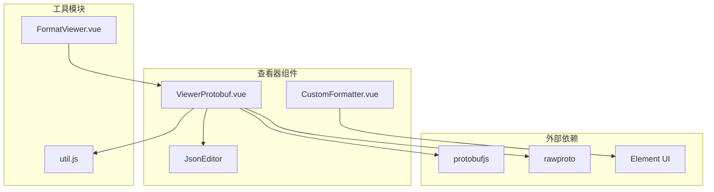
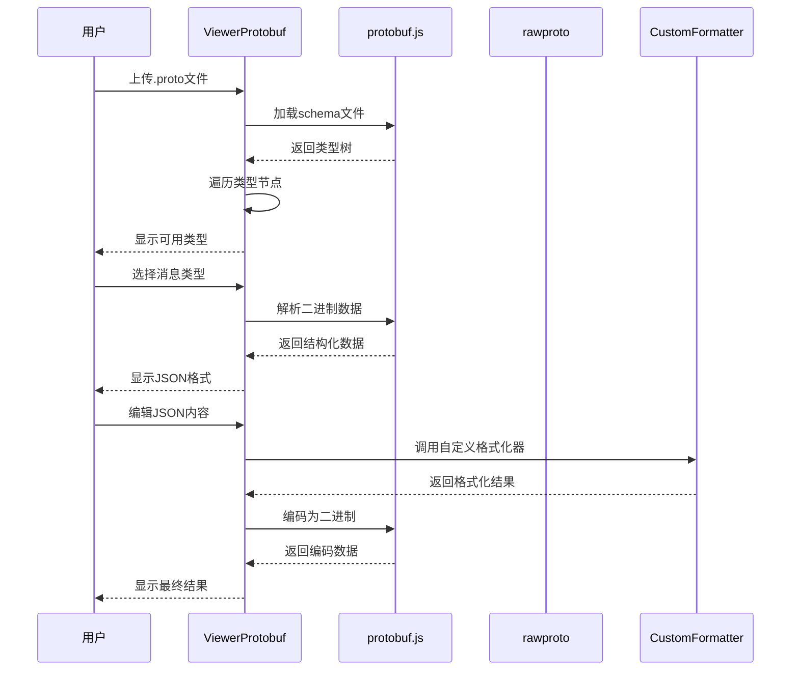
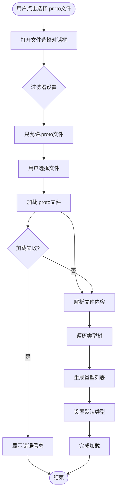
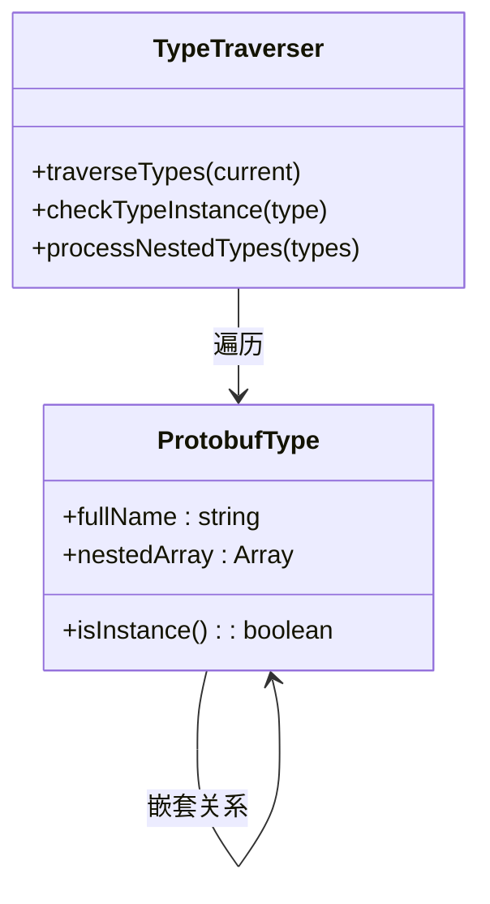
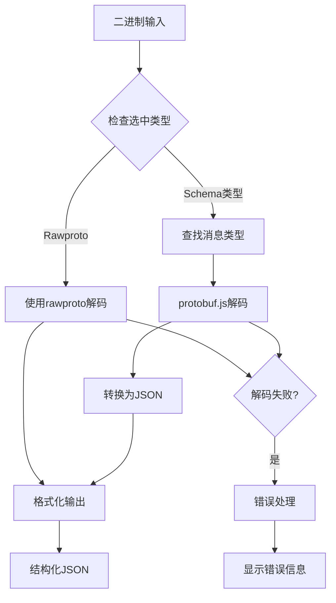
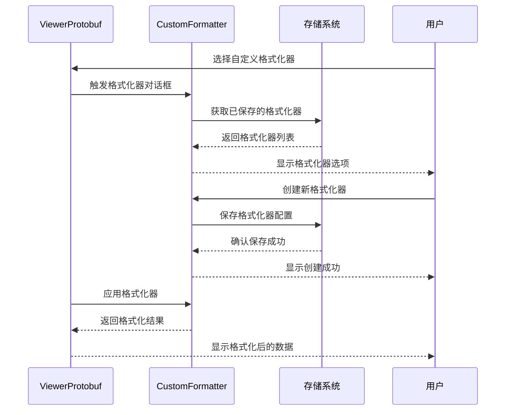
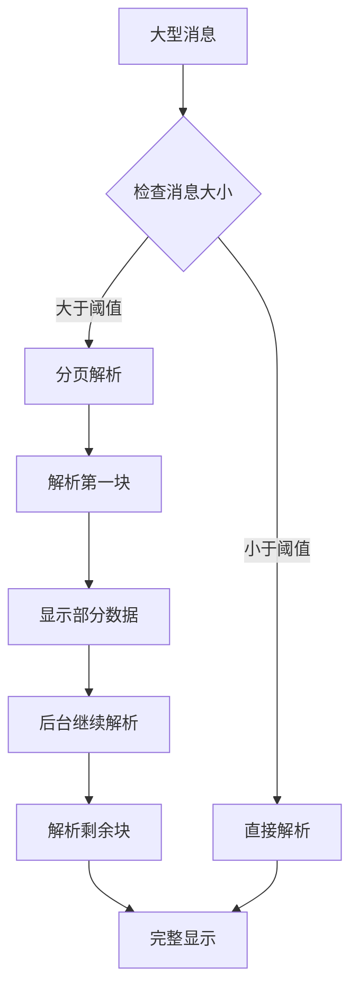
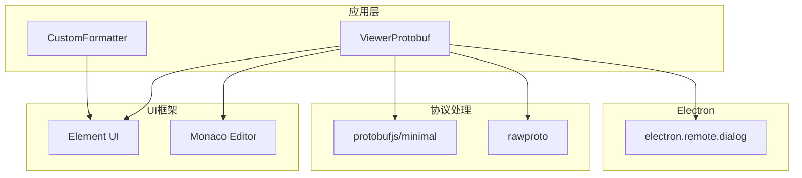

# Protobuf查看器

<cite>
**本文档中引用的文件**
- [ViewerProtobuf.vue](file://src/components/viewers/ViewerProtobuf.vue)
- [CustomFormatter.vue](file://src/components/CustomFormatter.vue)
- [util.js](file://src/util.js)
- [package.json](file://package.json)
- [FormatViewer.vue](file://src/components/FormatViewer.vue)
</cite>

## 目录
1. [简介](#简介)
2. [项目结构](#项目结构)
3. [核心组件](#核心组件)
4. [架构概览](#架构概览)
5. [详细组件分析](#详细组件分析)
6. [依赖关系分析](#依赖关系分析)
7. [性能考虑](#性能考虑)
8. [故障排除指南](#故障排除指南)
9. [结论](#结论)

## 简介

Protobuf查看器是Another Redis Desktop Manager中的一个专门组件，用于解析和展示Protocol Buffers二进制数据。该组件通过集成protobuf.js库和rawproto库，提供了强大的二进制数据解析功能，支持用户上传自定义的.proto文件来定义消息类型，并能够将二进制流转换为结构化的JSON格式进行展示。

该查看器的主要特点包括：
- 支持多种protobuf.js库版本（包括minimal版本）
- 提供.proto文件导入和消息类型映射功能
- 实现二进制数据到结构化JSON的转换
- 支持嵌套消息的展开显示
- 集成CustomFormatter组件以支持自定义schema文件
- 提供错误处理和调试工具

## 项目结构

Protobuf查看器在项目中的组织结构如下：

**图表来源**
- [ViewerProtobuf.vue](file://src/components/viewers/ViewerProtobuf.vue#L1-L153)
- [CustomFormatter.vue](file://src/components/CustomFormatter.vue#L1-L177)
- [util.js](file://src/util.js#L1-L160)

**章节来源**
- [ViewerProtobuf.vue](file://src/components/viewers/ViewerProtobuf.vue#L1-L153)
- [package.json](file://package.json#L35-L56)

## 核心组件

### ViewerProtobuf组件

ViewerProtobuf.vue是Protobuf查看器的核心组件，负责处理二进制数据的解析、显示和编辑功能。

#### 主要功能特性

1. **二进制数据解析**：支持两种解析模式
   - Rawproto模式：直接解析二进制数据为原始格式
   - Schema模式：基于.proto文件定义的消息类型进行解析

2. **消息类型管理**：自动扫描.proto文件中的所有消息类型

3. **编码/解码功能**：支持从JSON格式编码回二进制数据

4. **错误处理**：提供完善的错误提示和调试信息

#### 数据结构

| 属性 | 类型 | 描述 |
|------|------|------|
| proto | Array | 已选择的.proto文件路径列表 |
| protoRoot | Object | protobuf.js的根对象，包含所有加载的schema信息 |
| types | Array | 可用的消息类型列表 |
| selectedType | String | 当前选中的消息类型 |

**章节来源**
- [ViewerProtobuf.vue](file://src/components/viewers/ViewerProtobuf.vue#L30-L36)

## 架构概览

Protobuf查看器采用模块化架构设计，各组件职责明确：

**图表来源**
- [ViewerProtobuf.vue](file://src/components/viewers/ViewerProtobuf.vue#L65-L93)
- [ViewerProtobuf.vue](file://src/components/viewers/ViewerProtobuf.vue#L41-L51)

## 详细组件分析

### 原型文件导入机制

#### 文件选择流程

**图表来源**
- [ViewerProtobuf.vue](file://src/components/viewers/ViewerProtobuf.vue#L65-L93)

#### 类型发现算法

组件使用递归遍历算法来发现所有可用的消息类型：

**图表来源**
- [ViewerProtobuf.vue](file://src/components/viewers/ViewerProtobuf.vue#L55-L64)

**章节来源**
- [ViewerProtobuf.vue](file://src/components/viewers/ViewerProtobuf.vue#L65-L93)

### 二进制流到结构化JSON转换

#### 解码流程

**图表来源**
- [ViewerProtobuf.vue](file://src/components/viewers/ViewerProtobuf.vue#L41-L51)

#### 错误处理机制

组件实现了多层次的错误处理策略：

| 错误类型 | 处理方式 | 用户反馈 |
|----------|----------|----------|
| 文件加载失败 | 显示错误消息 | `this.$message.error(e.message)` |
| 类型解析失败 | 显示错误信息 | `'Protobuf Decode Failed!'` |
| JSON格式错误 | 国际化错误提示 | `this.$t('message.json_format_failed')` |
| 验证失败 | 显示验证错误 | `Proto Verify Failed: ${err}` |

**章节来源**
- [ViewerProtobuf.vue](file://src/components/viewers/ViewerProtobuf.vue#L41-L51)
- [ViewerProtobuf.vue](file://src/components/viewers/ViewerProtobuf.vue#L95-L123)

### 与CustomFormatter的联动

#### 自定义格式化器集成

**图表来源**
- [CustomFormatter.vue](file://src/components/CustomFormatter.vue#L113-L176)

**章节来源**
- [CustomFormatter.vue](file://src/components/CustomFormatter.vue#L1-L177)

### 性能优化策略

#### 大型消息处理

虽然当前实现没有显式的分页功能，但组件采用了以下性能优化策略：

1. **延迟加载**：只有在用户选择特定类型时才进行解析
2. **内存管理**：及时清理不需要的类型信息
3. **错误边界**：防止单个错误影响整个应用

#### 潜在优化点

为了进一步提升性能，可以考虑以下改进：

**章节来源**
- [ViewerProtobuf.vue](file://src/components/viewers/ViewerProtobuf.vue#L41-L51)

## 依赖关系分析

### 核心依赖库

**图表来源**
- [ViewerProtobuf.vue](file://src/components/viewers/ViewerProtobuf.vue#L23-L28)
- [package.json](file://package.json#L35-L56)

### 版本兼容性

| 依赖库 | 版本 | 使用方式 | 功能描述 |
|--------|------|----------|----------|
| protobufjs | ^6.11.2 | minimal版本 | 核心protobuf解析功能 |
| rawproto | ^0.7.6 | 直接导入 | 原始protobuf数据解析 |
| electron | ^12.2.3 | remote模块 | 文件对话框功能 |

**章节来源**
- [package.json](file://package.json#L35-L56)
- [ViewerProtobuf.vue](file://src/components/viewers/ViewerProtobuf.vue#L25-L26)

## 性能考虑

### 内存使用优化

1. **按需加载**：只在需要时加载.proto文件
2. **类型缓存**：避免重复解析相同的类型定义
3. **垃圾回收**：及时释放不再使用的类型对象

### 响应性优化

1. **异步操作**：文件加载和解析采用异步方式
2. **进度指示**：长时间操作提供视觉反馈
3. **错误恢复**：失败时提供清晰的错误信息

### 扩展性考虑

当前实现支持：
- 多文件.proto导入
- 嵌套消息类型
- 自定义格式化器

未来可能的扩展方向：
- 分页显示大型消息
- 增量解析
- 类型定义缓存

## 故障排除指南

### 常见错误及解决方案

#### Schema不匹配错误

**症状**：显示"Protobuf Decode Failed!"或验证失败信息

**原因分析**：
1. 二进制数据与指定的schema不匹配
2. .proto文件加载失败
3. 消息类型不存在

**解决步骤**：
1. 检查.proto文件是否正确加载
2. 确认选中的消息类型存在
3. 验证二进制数据的完整性

#### 文件加载错误

**症状**：文件对话框无法正常工作或加载失败

**排查方法**：
1. 检查文件权限
2. 确认文件格式正确
3. 查看控制台错误信息

#### 编码错误

**症状**：JSON格式验证失败

**解决方法**：
1. 检查JSON语法是否正确
2. 确认字段类型匹配
3. 验证必需字段是否存在

### 调试工具使用

#### 开发者工具

1. **控制台日志**：查看详细的错误信息
2. **网络面板**：监控文件加载过程
3. **元素检查**：分析DOM结构

#### 日志记录

组件会在以下情况下记录日志：
- 文件加载成功/失败
- 类型解析过程
- 编码/解码操作
- 错误发生时

**章节来源**
- [ViewerProtobuf.vue](file://src/components/viewers/ViewerProtobuf.vue#L41-L51)
- [ViewerProtobuf.vue](file://src/components/viewers/ViewerProtobuf.vue#L89-L93)

### 最佳实践建议

1. **文件组织**：将相关的.proto文件放在同一目录下
2. **命名规范**：使用清晰的消息类型名称
3. **版本控制**：对.proto文件进行版本管理
4. **测试验证**：在生产环境前充分测试

## 结论

Protobuf查看器是一个功能完善且设计良好的组件，它成功地解决了Protocol Buffers二进制数据的可视化问题。通过集成protobuf.js和rawproto库，该组件提供了灵活的数据解析能力，同时保持了良好的用户体验。

### 主要优势

1. **技术先进性**：采用成熟的protobuf.js库作为核心
2. **用户体验**：直观的界面设计和流畅的操作体验
3. **扩展性强**：支持自定义格式化器和多文件导入
4. **错误处理**：完善的错误提示和恢复机制

### 改进建议

1. **性能优化**：考虑添加分页显示功能以处理大型消息
2. **缓存机制**：实现.proto文件的本地缓存
3. **类型验证**：增强类型系统的验证能力
4. **国际化**：完善多语言支持

该组件为Redis Desktop Manager提供了强大的Protocol Buffers支持，是现代数据库管理工具中不可或缺的功能模块。