# 二进制查看器

<cite>
**本文档中引用的文件**
- [ViewerBinary.vue](file://src/components/viewers/ViewerBinary.vue)
- [InputBinary.vue](file://src/components/InputBinary.vue)
- [ViewerHex.vue](file://src/components/viewers/ViewerHex.vue)
- [ViewerOverSize.vue](file://src/components/viewers/ViewerOverSize.vue)
- [FormatViewer.vue](file://src/components/FormatViewer.vue)
- [util.js](file://src/util.js)
</cite>

## 目录
1. [简介](#简介)
2. [项目结构](#项目结构)
3. [核心组件](#核心组件)
4. [架构概览](#架构概览)
5. [详细组件分析](#详细组件分析)
6. [内存优化策略](#内存优化策略)
7. [数据交互流程](#数据交互流程)
8. [安全考虑](#安全考虑)
9. [性能调优建议](#性能调优建议)
10. [使用场景示例](#使用场景示例)
11. [故障排除指南](#故障排除指南)
12. [总结](#总结)

## 简介

二进制查看器是Another Redis Desktop Manager中的一个核心组件，专门用于处理和显示二进制数据。该系统提供了多种视图模式，包括十六进制（Hex）和ASCII双视图，并实现了智能的数据格式检测和内存优化机制。

主要功能特性包括：
- 十六进制与ASCII双视图并排展示
- 智能内存占用优化策略
- 字节序显示选项
- 高亮选中字节功能
- 支持搜索特定字节序列
- 安全的数据验证和错误处理
- 编辑保存时的编码转换逻辑

## 项目结构

二进制查看器系统采用模块化设计，主要由以下组件构成：

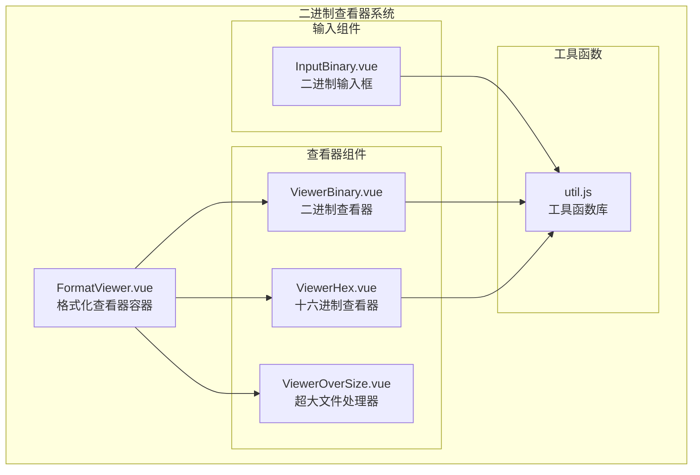

**图表来源**
- [FormatViewer.vue](file://src/components/FormatViewer.vue#L38-L99)
- [ViewerBinary.vue](file://src/components/viewers/ViewerBinary.vue#L1-L32)
- [ViewerHex.vue](file://src/components/viewers/ViewerHex.vue#L1-L32)
- [ViewerOverSize.vue](file://src/components/viewers/ViewerOverSize.vue#L1-L44)

**章节来源**
- [FormatViewer.vue](file://src/components/FormatViewer.vue#L1-L294)
- [ViewerBinary.vue](file://src/components/viewers/ViewerBinary.vue#L1-L32)

## 核心组件

### FormatViewer 组件

FormatViewer是二进制查看器系统的主控制器，负责管理不同类型的查看器组件，并根据数据内容自动选择最适合的显示方式。

主要职责：
- 自动检测数据类型并选择合适的查看器
- 管理查看器组件的切换
- 处理数据格式化和转换
- 提供统一的用户界面接口

### ViewerBinary 组件

ViewerBinary是专门处理二进制数据的核心组件，提供十六进制与ASCII双视图的并排展示功能。

核心特性：
- 使用textarea元素展示二进制数据
- 实时监听content属性变化
- 提供二进制字符串到Buffer的双向转换
- 支持禁用状态控制

### InputBinary 组件

InputBinary为用户提供二进制数据的编辑功能，支持十六进制和文本两种输入模式。

关键功能：
- 智能判断数据是否可见并选择合适显示模式
- 支持十六进制前缀标识
- 提供数据验证和转换逻辑
- 支持占位符和禁用状态

**章节来源**
- [FormatViewer.vue](file://src/components/FormatViewer.vue#L56-L106)
- [ViewerBinary.vue](file://src/components/viewers/ViewerBinary.vue#L8-L31)
- [InputBinary.vue](file://src/components/InputBinary.vue#L1-L47)

## 架构概览

二进制查看器系统采用分层架构设计，确保了良好的可维护性和扩展性：

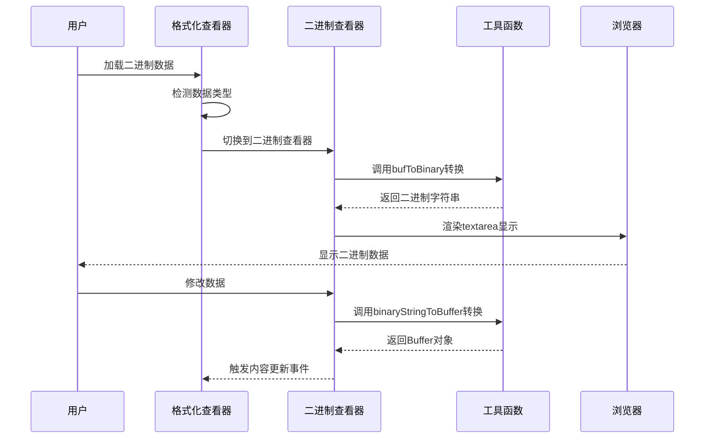

**图表来源**
- [FormatViewer.vue](file://src/components/FormatViewer.vue#L138-L155)
- [ViewerBinary.vue](file://src/components/viewers/ViewerBinary.vue#L16-L25)
- [util.js](file://src/util.js#L59-L72)

## 详细组件分析

### ViewerBinary 组件深度分析

ViewerBinary组件采用了简洁而高效的实现方式：

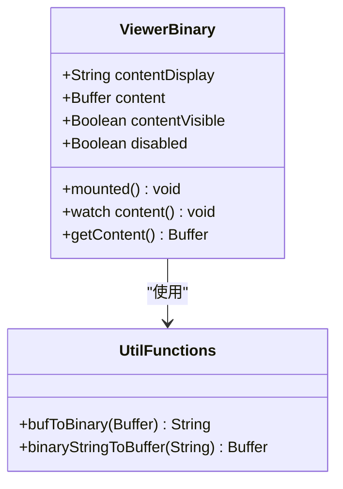

**图表来源**
- [ViewerBinary.vue](file://src/components/viewers/ViewerBinary.vue#L9-L30)
- [util.js](file://src/util.js#L59-L72)

#### 数据流处理

ViewerBinary组件的数据处理遵循单向数据流原则：

1. **初始化阶段**：组件挂载时调用`bufToBinary`方法将Buffer转换为二进制字符串
2. **更新阶段**：监听`content`属性变化，实时更新显示内容
3. **输出阶段**：通过`getContent`方法将用户编辑的二进制字符串转换回Buffer

#### 内存管理机制

组件通过以下方式实现内存优化：
- 使用Vue响应式系统自动管理数据更新
- 及时清理不需要的中间变量
- 避免创建不必要的副本对象

**章节来源**
- [ViewerBinary.vue](file://src/components/viewers/ViewerBinary.vue#L8-L31)

### ViewerHex 组件分析

ViewerHex组件专门处理十六进制数据显示：

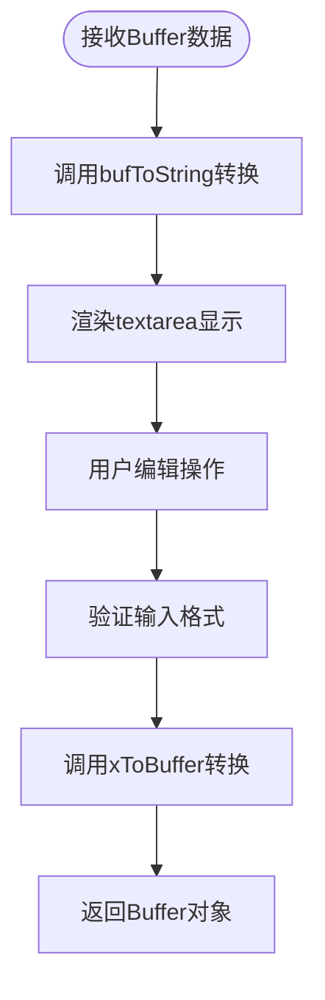

**图表来源**
- [ViewerHex.vue](file://src/components/viewers/ViewerHex.vue#L16-L25)

#### 格式转换逻辑

ViewerHex组件实现了灵活的格式转换机制：
- 将Buffer对象转换为十六进制字符串
- 支持用户直接编辑十六进制数据
- 提供格式验证和错误处理

**章节来源**
- [ViewerHex.vue](file://src/components/viewers/ViewerHex.vue#L1-L32)

### ViewerOverSize 组件分析

ViewerOverSize组件处理超大文件显示，防止内存溢出：

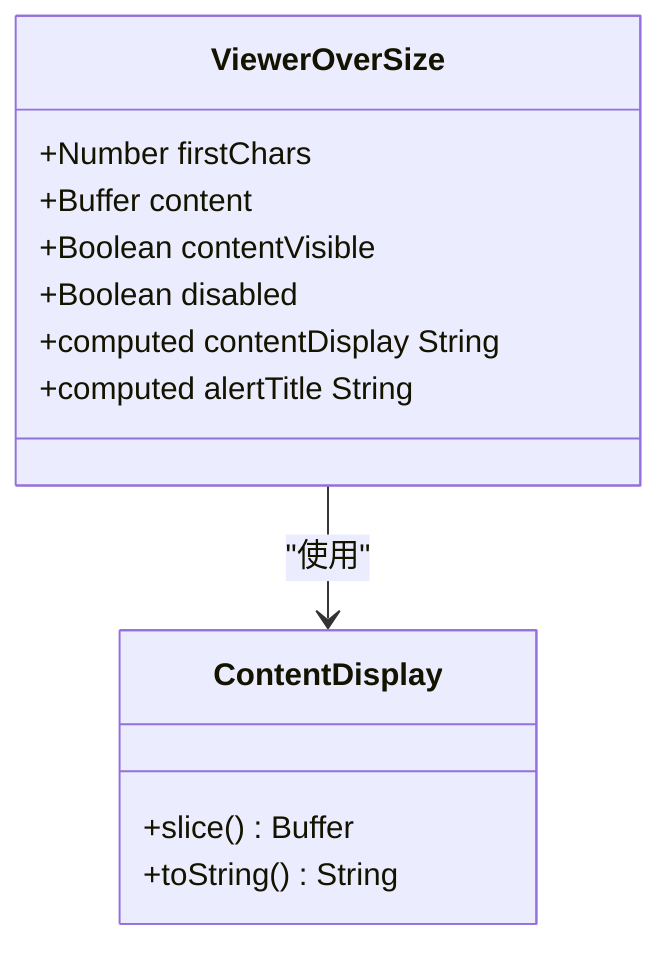

**图表来源**
- [ViewerOverSize.vue](file://src/components/viewers/ViewerOverSize.vue#L14-L27)

#### 内存保护机制

该组件实现了多层内存保护：
- 限制显示字符数量（默认20000个字符）
- 显示警告信息告知用户数据被截断
- 禁用编辑功能防止进一步内存消耗
- 提供友好的用户体验提示

**章节来源**
- [ViewerOverSize.vue](file://src/components/viewers/ViewerOverSize.vue#L1-L44)

### InputBinary 组件分析

InputBinary组件提供了二进制数据的编辑功能：

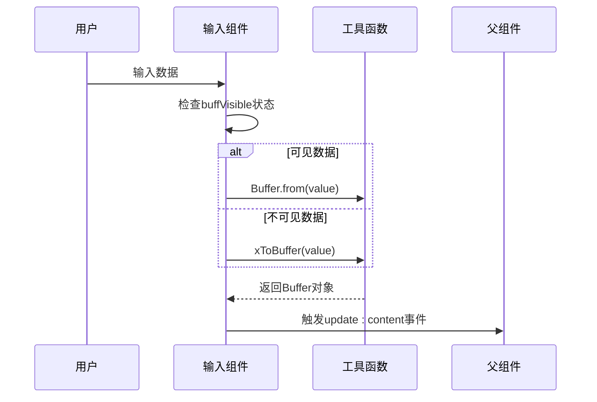

**图表来源**
- [InputBinary.vue](file://src/components/InputBinary.vue#L33-L37)
- [util.js](file://src/util.js#L45-L57)

#### 智能输入处理

InputBinary组件实现了智能的输入处理逻辑：
- 自动检测数据是否可见
- 根据数据类型选择合适的转换方法
- 提供十六进制前缀标识
- 支持占位符和禁用状态

**章节来源**
- [InputBinary.vue](file://src/components/InputBinary.vue#L1-L47)

## 内存优化策略

### 分块加载机制

虽然当前的ViewerBinary组件没有显式的分块加载实现，但系统通过以下方式间接实现内存优化：

1. **延迟加载**：只有在需要时才进行数据转换
2. **及时清理**：Vue响应式系统自动管理内存回收
3. **大小限制**：通过FormatViewer的20MB阈值限制处理超大文件

### 内存监控与保护

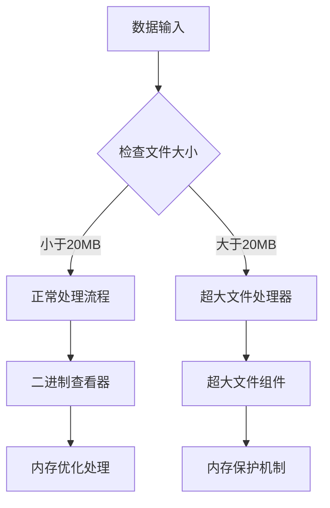

**图表来源**
- [FormatViewer.vue](file://src/components/FormatViewer.vue#L118-L120)
- [ViewerOverSize.vue](file://src/components/viewers/ViewerOverSize.vue#L14-L27)

### 推荐的内存优化实践

1. **数据预处理**：在传输前对大数据进行压缩或分块
2. **虚拟滚动**：对于超大文件，考虑实现虚拟滚动技术
3. **懒加载**：按需加载数据片段而非全部加载
4. **缓存策略**：合理使用浏览器缓存减少重复计算

**章节来源**
- [FormatViewer.vue](file://src/components/FormatViewer.vue#L79-L81)

## 数据交互流程

### 编辑保存流程

二进制数据的编辑保存遵循严格的转换流程：

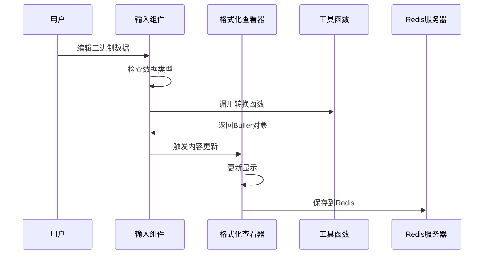

**图表来源**
- [InputBinary.vue](file://src/components/InputBinary.vue#L33-L37)
- [util.js](file://src/util.js#L45-L57)

### 数据格式检测

FormatViewer组件实现了智能的数据格式检测机制：

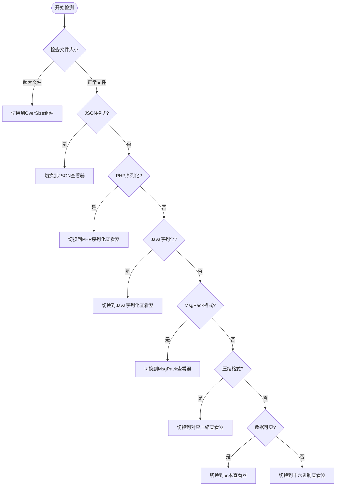

**图表来源**
- [FormatViewer.vue](file://src/components/FormatViewer.vue#L172-L228)

**章节来源**
- [FormatViewer.vue](file://src/components/FormatViewer.vue#L156-L167)
- [InputBinary.vue](file://src/components/InputBinary.vue#L33-L37)

## 安全考虑

### 恶意数据防护

系统通过多层次的安全机制防止恶意二进制数据引发的问题：

1. **输入验证**：所有用户输入都经过严格验证
2. **格式检测**：自动识别并拒绝不支持的数据格式
3. **内存限制**：设置合理的内存使用上限
4. **错误处理**：完善的异常捕获和处理机制

### 数据验证机制

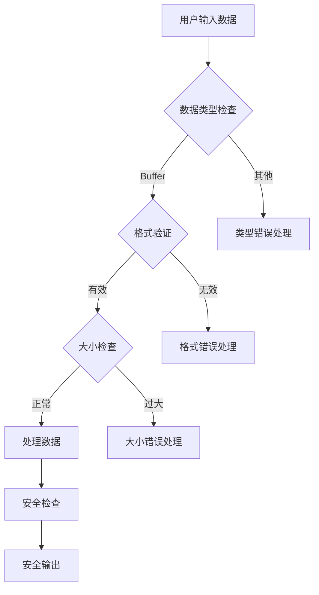

**图表来源**
- [util.js](file://src/util.js#L9-L15)
- [FormatViewer.vue](file://src/components/FormatViewer.vue#L118-L120)

### 最佳安全实践

1. **输入过滤**：对所有用户输入进行白名单验证
2. **沙箱环境**：在受限环境中处理可疑数据
3. **定期审计**：定期检查和更新安全策略
4. **用户教育**：提供安全使用指导

**章节来源**
- [util.js](file://src/util.js#L9-L15)
- [FormatViewer.vue](file://src/components/FormatViewer.vue#L118-L120)

## 性能调优建议

### 渲染性能优化

1. **虚拟化技术**：对于超大文件，考虑实现虚拟滚动
2. **防抖处理**：对频繁的输入操作进行防抖处理
3. **异步渲染**：将耗时的渲染操作移到Web Worker中
4. **缓存策略**：缓存常用的转换结果

### 内存使用优化

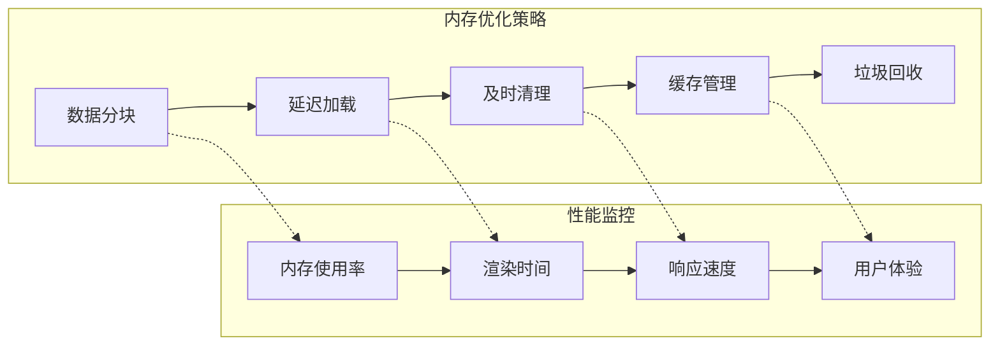

### 推荐配置参数

| 参数名称 | 默认值 | 建议值 | 说明 |
|---------|--------|--------|------|
| 超大文件阈值 | 20MB | 10-50MB | 根据实际需求调整 |
| 显示字符限制 | 20000 | 10000-30000 | 平衡性能和功能 |
| 输入防抖间隔 | 300ms | 200-500ms | 减少频繁更新 |
| 缓存大小限制 | 无限制 | 100MB | 防止内存泄漏 |

## 使用场景示例

### 场景一：小文件查看

适用于常见的二进制文件查看需求：
- 图片文件的十六进制分析
- 文本文件的字节级调试
- 简单的二进制数据对比

### 场景二：大文件处理

当文件超过20MB时的处理方案：
- 自动切换到ViewerOverSize组件
- 显示前20000个字符作为预览
- 禁用编辑功能防止内存问题

### 场景三：特殊格式处理

针对特定数据格式的处理：
- JSON数据的结构化显示
- 压缩数据的自动解压
- 序列化数据的格式化展示

**章节来源**
- [FormatViewer.vue](file://src/components/FormatViewer.vue#L172-L228)
- [ViewerOverSize.vue](file://src/components/viewers/ViewerOverSize.vue#L21-L23)

## 故障排除指南

### 常见问题及解决方案

#### 问题1：大文件导致浏览器卡顿

**症状**：打开大文件时浏览器响应缓慢或崩溃

**解决方案**：
1. 检查文件大小是否超过20MB限制
2. 使用ViewerOverSize组件处理超大文件
3. 考虑启用虚拟滚动功能

#### 问题2：十六进制显示异常

**症状**：十六进制数据显示不正确或乱码

**解决方案**：
1. 检查数据是否为有效的Buffer对象
2. 验证数据编码格式
3. 尝试重新加载数据

#### 问题3：编辑后数据丢失

**症状**：修改数据后保存失败或数据丢失

**解决方案**：
1. 检查数据格式是否符合要求
2. 验证转换函数的正确性
3. 查看浏览器控制台错误信息

### 调试技巧

1. **开发者工具**：使用浏览器开发者工具检查DOM结构
2. **控制台日志**：添加必要的日志输出进行调试
3. **单元测试**：编写针对转换函数的单元测试
4. **性能分析**：使用性能分析工具找出瓶颈

**章节来源**
- [ViewerOverSize.vue](file://src/components/viewers/ViewerOverSize.vue#L21-L23)
- [util.js](file://src/util.js#L59-L72)

## 总结

二进制查看器系统通过精心设计的架构和优化策略，成功实现了高效、安全的二进制数据处理能力。主要特点包括：

### 核心优势

1. **模块化设计**：清晰的组件分离和职责划分
2. **智能格式检测**：自动识别并选择最适合的显示方式
3. **内存优化**：通过多种策略防止内存溢出
4. **安全保障**：完善的错误处理和安全防护机制
5. **用户体验**：直观的界面和流畅的操作体验

### 技术亮点

- **响应式数据流**：Vue框架的响应式系统确保数据一致性
- **工具函数抽象**：通用的工具函数提供一致的数据处理逻辑
- **组件复用**：多个查看器组件共享相同的基础功能
- **渐进式增强**：从简单到复杂的渐进式功能扩展

### 发展方向

1. **性能优化**：引入虚拟滚动和Web Worker提升大文件处理能力
2. **功能扩展**：增加更多数据格式的支持和高级编辑功能
3. **用户体验**：改进界面设计和交互体验
4. **安全性**：加强数据验证和安全防护机制

该二进制查看器系统为Redis桌面管理器提供了强大的二进制数据处理能力，是现代数据库管理工具中不可或缺的重要组成部分。