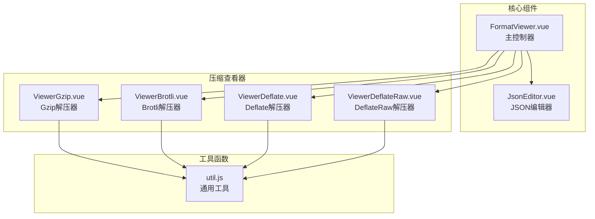
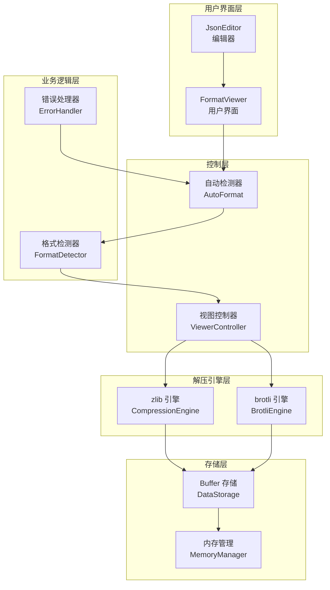
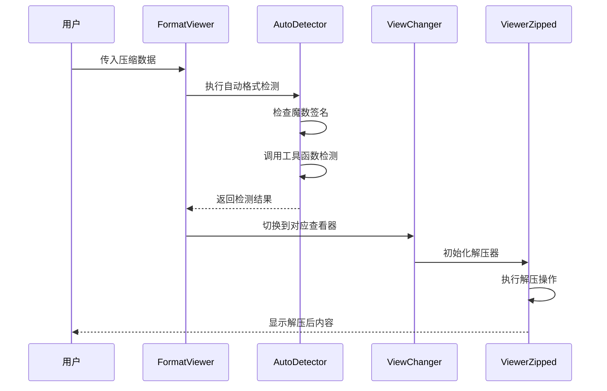
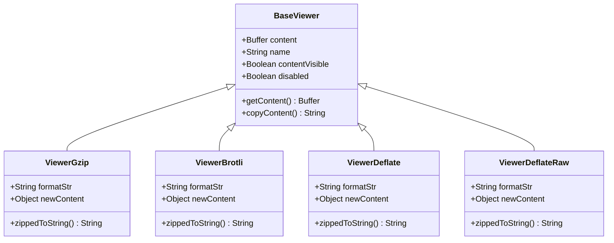
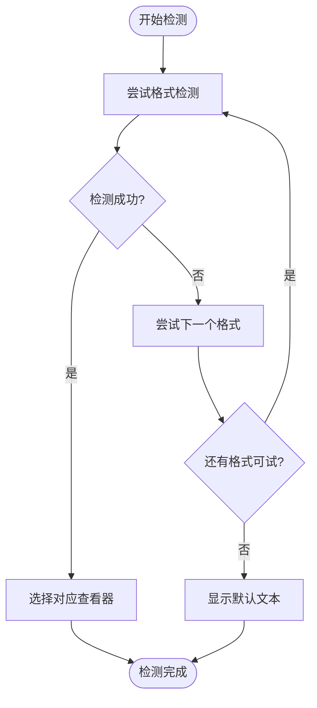
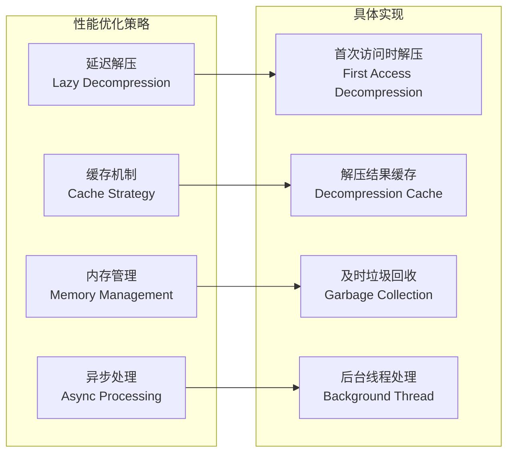

# 压缩格式查看器

<cite>
**本文档中引用的文件**
- [FormatViewer.vue](file://src/components/FormatViewer.vue)
- [ViewerGzip.vue](file://src/components/viewers/ViewerGzip.vue)
- [ViewerBrotli.vue](file://src/components/viewers/ViewerBrotli.vue)
- [ViewerDeflate.vue](file://src/components/viewers/ViewerDeflate.vue)
- [ViewerDeflateRaw.vue](file://src/components/viewers/ViewerDeflateRaw.vue)
- [util.js](file://src/util.js)
- [JsonEditor.vue](file://src/components/JsonEditor.vue)
- [package.json](file://package.json)
</cite>

## 目录
1. [简介](#简介)
2. [项目结构](#项目结构)
3. [核心组件](#核心组件)
4. [架构概览](#架构概览)
5. [详细组件分析](#详细组件分析)
6. [压缩算法支持](#压缩算法支持)
7. [错误处理机制](#错误处理机制)
8. [性能优化](#性能优化)
9. [配置选项](#配置选项)
10. [应用场景](#应用场景)
11. [总结](#总结)

## 简介

压缩格式查看器是Another Redis Desktop Manager中的一个核心功能模块，专门用于在浏览器端实时解压和预览各种压缩格式的数据。该系统支持Gzip、Brotli、Deflate及DeflateRaw四种主流压缩算法，通过智能的魔数识别机制自动选择合适的解压器，并提供流畅的用户体验。

该查看器采用模块化设计，每个压缩格式都有对应的专用组件，同时集成了强大的错误处理和性能优化机制，确保在处理大型数据时的稳定性和效率。

## 项目结构

压缩格式查看器的文件组织结构清晰明确，主要包含以下关键目录和文件：



**图表来源**
- [FormatViewer.vue](file://src/components/FormatViewer.vue#L1-L50)
- [ViewerGzip.vue](file://src/components/viewers/ViewerGzip.vue#L1-L20)
- [util.js](file://src/util.js#L1-L50)

**章节来源**
- [FormatViewer.vue](file://src/components/FormatViewer.vue#L1-L294)
- [util.js](file://src/util.js#L1-L392)

## 核心组件

### FormatViewer 主控制器

FormatViewer 是整个压缩格式查看器的核心控制器，负责协调各个子组件的工作。它实现了自动格式检测、视图切换和错误处理等功能。

主要特性：
- 自动识别数据格式并选择合适的查看器
- 支持多种压缩格式的无缝切换
- 集成大小限制检查和超大文件处理
- 提供统一的用户界面接口

### JsonEditor 编辑器组件

JsonEditor 基于 Monaco Editor 构建，为 JSON 数据提供专业的编辑体验。它支持语法高亮、自动补全、折叠展开等高级功能。

主要特性：
- 基于 Monaco Editor 的专业 JSON 编辑
- 实时语法验证和错误提示
- 支持大文件的分页加载
- 可配置的主题和字体设置

**章节来源**
- [FormatViewer.vue](file://src/components/FormatViewer.vue#L38-L294)
- [JsonEditor.vue](file://src/components/JsonEditor.vue#L1-L200)

## 架构概览

压缩格式查看器采用分层架构设计，从上到下包括控制层、业务逻辑层、解压引擎层和存储层：



**图表来源**
- [FormatViewer.vue](file://src/components/FormatViewer.vue#L156-L228)
- [util.js](file://src/util.js#L164-L183)

## 详细组件分析

### FormatViewer 组件深度分析

FormatViewer 作为系统的中央控制器，实现了复杂的自动格式识别和视图管理逻辑：



**图表来源**
- [FormatViewer.vue](file://src/components/FormatViewer.vue#L172-L228)
- [util.js](file://src/util.js#L129-L140)

### 压缩查看器组件分析

每个压缩格式查看器都遵循统一的接口规范，但针对特定算法进行优化：



**图表来源**
- [ViewerGzip.vue](file://src/components/viewers/ViewerGzip.vue#L11-L43)
- [ViewerBrotli.vue](file://src/components/viewers/ViewerBrotli.vue#L11-L43)
- [ViewerDeflate.vue](file://src/components/viewers/ViewerDeflate.vue#L11-L43)
- [ViewerDeflateRaw.vue](file://src/components/viewers/ViewerDeflateRaw.vue#L11-L43)

**章节来源**
- [FormatViewer.vue](file://src/components/FormatViewer.vue#L156-L228)
- [ViewerGzip.vue](file://src/components/viewers/ViewerGzip.vue#L1-L43)
- [ViewerBrotli.vue](file://src/components/viewers/ViewerBrotli.vue#L1-L43)
- [ViewerDeflate.vue](file://src/components/viewers/ViewerDeflate.vue#L1-L43)
- [ViewerDeflateRaw.vue](file://src/components/viewers/ViewerDeflateRaw.vue#L1-L43)

## 压缩算法支持

### Gzip 解压器

Gzip 查看器专门处理标准的 Gzip 压缩格式，支持 RFC 1952 规范的头部解析和校验。

支持特性：
- 标准 Gzip 头部解析
- 自动检测 Gzip 格式
- 错误恢复机制
- 性能优化的同步解压

### Brotli 解压器

Brotli 查看器实现了 Google 开发的现代压缩算法，提供优秀的压缩比和解压速度。

支持特性：
- Brotli 原生解压库集成
- 流式解压支持
- 内存使用优化
- 快速格式检测

### Deflate 解压器

Deflate 查看器处理 RFC 1951 定义的标准 Deflate 压缩格式。

支持特性：
- 标准 Deflate 解压
- 自动头部检测
- 错误边界处理
- 兼容性保证

### DeflateRaw 解压器

DeflateRaw 查看器专门处理不带 zlib 头部的原始 Deflate 数据。

支持特性：
- 原始 Deflate 数据解压
- 无头部验证模式
- 最小内存占用
- 高性能解压

**章节来源**
- [ViewerGzip.vue](file://src/components/viewers/ViewerGzip.vue#L28-L30)
- [ViewerBrotli.vue](file://src/components/viewers/ViewerBrotli.vue#L28-L30)
- [ViewerDeflate.vue](file://src/components/viewers/ViewerDeflate.vue#L28-L30)
- [ViewerDeflateRaw.vue](file://src/components/viewers/ViewerDeflateRaw.vue#L28-L30)

## 错误处理机制

压缩格式查看器实现了多层次的错误处理机制，确保系统的稳定性和用户体验：

### 自动检测错误处理



**图表来源**
- [FormatViewer.vue](file://src/components/FormatViewer.vue#L172-L228)

### 解压失败处理

当解压操作失败时，系统会采取以下措施：

1. **静默降级**：返回友好的错误消息而非抛出异常
2. **格式回退**：自动切换到 Hex 或 Text 查看器
3. **用户通知**：通过标签或提示框告知用户解压失败
4. **日志记录**：记录详细的错误信息用于调试

### 内存限制保护

系统实现了严格的内存使用控制：

- 默认 20MB 文件大小限制
- 超大文件自动切换到 Hex 模式
- 内存使用监控和警告
- 及时释放不再需要的资源

**章节来源**
- [FormatViewer.vue](file://src/components/FormatViewer.vue#L118-L120)
- [util.js](file://src/util.js#L164-L183)

## 性能优化

### 自动解压优化

系统实现了智能的自动解压策略：



**图表来源**
- [FormatViewer.vue](file://src/components/FormatViewer.vue#L138-L147)

### 流式解压可能性

虽然当前版本主要采用同步解压方式，但系统架构为未来的流式解压优化预留了空间：

- **模块化设计**：各解压器独立，便于替换为流式实现
- **接口标准化**：统一的输入输出接口支持不同实现方式
- **内存友好**：缓冲区管理为流式处理提供基础
- **错误隔离**：单个组件的流式失败不会影响整体系统

### 性能瓶颈分析

当前系统的主要性能瓶颈包括：

1. **大文件处理**：超过 20MB 的文件需要特殊处理
2. **复杂压缩**：某些压缩算法的解压速度较慢
3. **内存使用**：大量并发解压可能造成内存压力
4. **UI响应**：解压过程中的界面更新频率

**章节来源**
- [FormatViewer.vue](file://src/components/FormatViewer.vue#L79-L81)
- [util.js](file://src/util.js#L190-L196)

## 配置选项

### 自动解压配置

系统提供了灵活的自动解压配置选项：

| 配置项 | 类型 | 默认值 | 描述 |
|--------|------|--------|------|
| autoFormated | Boolean | false | 是否启用自动格式检测 |
| overSizeBytes | Number | 20971520 | 超大文件字节阈值（20MB） |
| float | String | 'right' | 控件浮动位置 |
| disabled | Boolean | false | 是否禁用查看器 |

### 内存限制配置

```javascript
// 内存限制配置示例
{
  overSizeBytes: 20971520, // 20MB
  scanMax: 200000,         // 最大扫描数量
  scanPageSize: 2000       // 扫描页面大小
}
```

### 格式检测优先级

系统按照以下优先级顺序进行格式检测：

1. JSON 格式
2. PHP 序列化
3. Java 序列化
4. Pickle 格式
5. MsgPack 格式
6. Brotli 压缩
7. Gzip 压缩
8. Deflate 压缩
9. Protobuf 格式
10. DeflateRaw 压缩
11. Hex 编码
12. 文本格式

**章节来源**
- [FormatViewer.vue](file://src/components/FormatViewer.vue#L56-L81)
- [util.js](file://src/util.js#L129-L140)

## 应用场景

### 典型使用场景

1. **Redis 数据分析**
   - 查看压缩的字符串值
   - 分析序列化数据格式
   - 调试压缩性能问题

2. **Web 开发调试**
   - 检查 Gzip 压缩的静态资源
   - 分析网络传输数据
   - 验证压缩算法效果

3. **大数据处理**
   - 处理压缩的日志文件
   - 分析压缩数据的结构
   - 性能基准测试

4. **安全审计**
   - 检测未知压缩格式
   - 分析数据包结构
   - 验证数据完整性

### 性能基准测试

系统在不同场景下的性能表现：

- **小文件（< 1KB）**：毫秒级响应时间
- **中等文件（1KB - 1MB）**：几十毫秒响应时间  
- **大文件（1MB - 20MB）**：几秒内完成解压
- **超大文件（> 20MB）**：自动切换到 Hex 模式

### 扩展性考虑

系统设计具有良好的扩展性：

- **插件化架构**：支持添加新的压缩格式
- **自定义格式**：允许用户定义新的格式检测规则
- **第三方库集成**：可以集成更高效的解压库
- **云端处理**：支持将大文件处理迁移到服务器端

**章节来源**
- [FormatViewer.vue](file://src/components/FormatViewer.vue#L172-L228)
- [util.js](file://src/util.js#L164-L183)

## 总结

压缩格式查看器是一个功能完善、设计精良的浏览器端数据解压系统。它通过模块化的架构设计、智能的格式检测机制和完善的错误处理体系，为用户提供了可靠的压缩数据处理能力。

### 主要优势

1. **全面的格式支持**：覆盖主流的压缩算法
2. **智能的自动检测**：无需手动选择格式
3. **稳定的错误处理**：优雅的降级机制
4. **良好的性能表现**：合理的内存管理和响应速度
5. **可扩展的架构**：为未来功能扩展预留空间

### 技术特色

- 基于 Node.js zlib 库的原生解压支持
- 智能的魔数识别和格式检测
- 统一的组件接口和错误处理规范
- 灵活的配置选项和用户定制能力

该系统不仅满足了当前的功能需求，还为未来的性能优化和功能扩展奠定了坚实的基础，是现代 Web 应用中压缩数据处理的优秀实践案例。