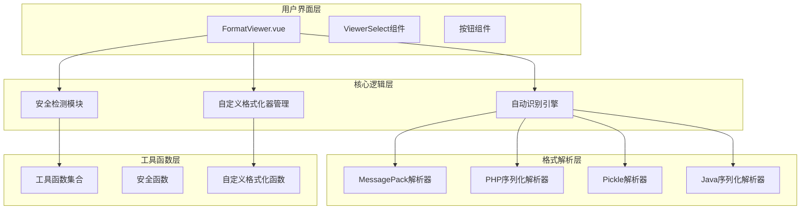
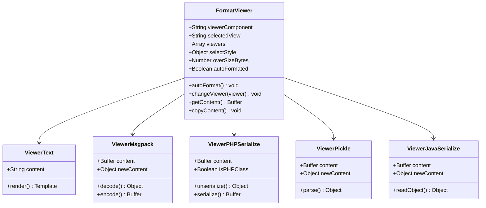
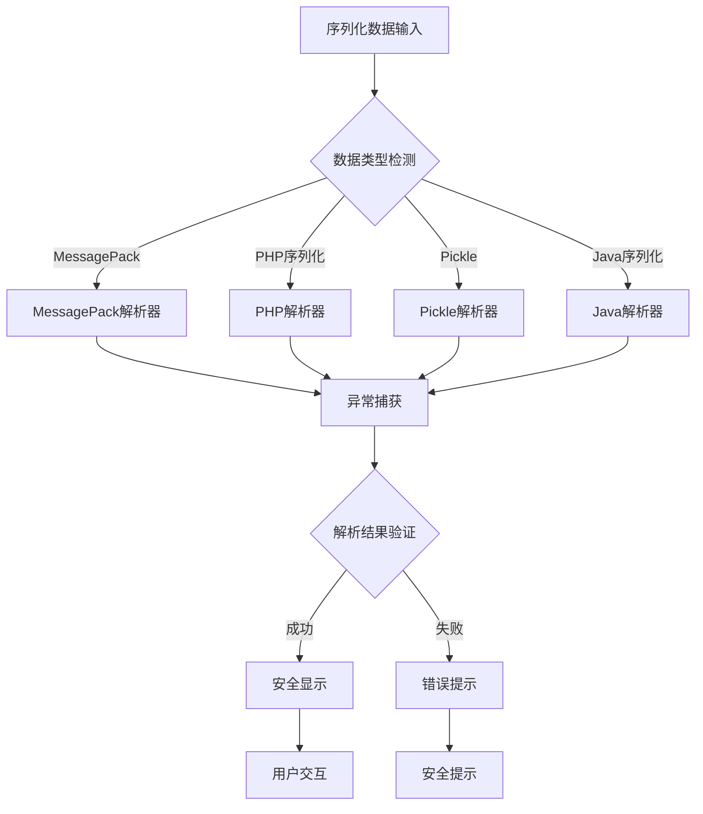
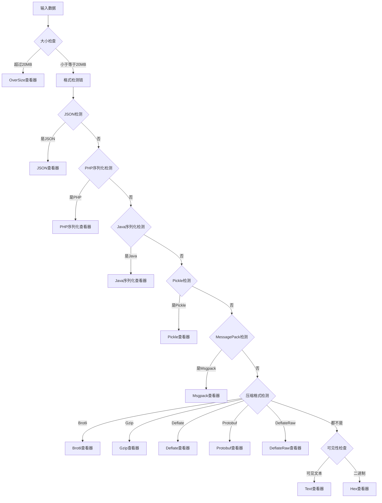
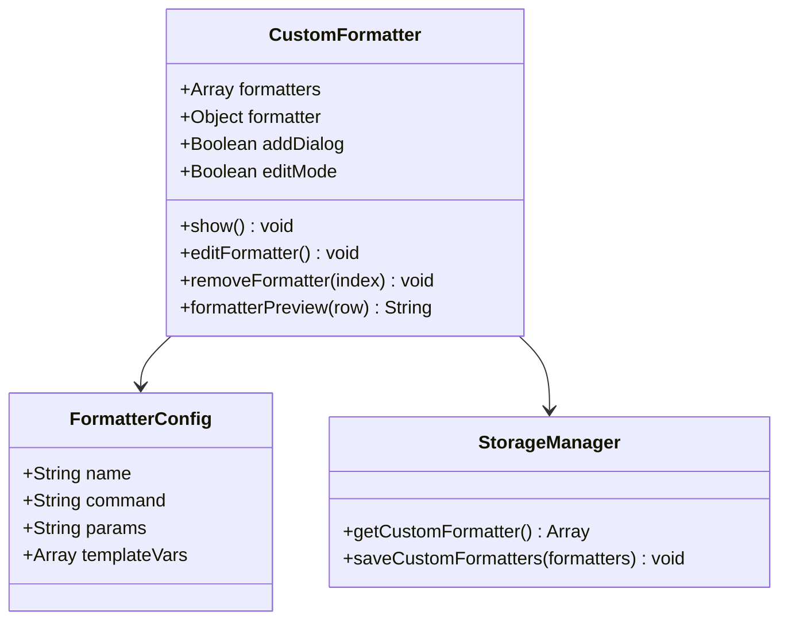

# 序列化格式查看器

<cite>
**本文档引用的文件**
- [FormatViewer.vue](file://src/components/FormatViewer.vue)
- [ViewerMsgpack.vue](file://src/components/viewers/ViewerMsgpack.vue)
- [ViewerPHPSerialize.vue](file://src/components/viewers/ViewerPHPSerialize.vue)
- [ViewerPickle.vue](file://src/components/viewers/ViewerPickle.vue)
- [ViewerJavaSerialize.vue](file://src/components/viewers/ViewerJavaSerialize.vue)
- [util.js](file://src/util.js)
- [package.json](file://package.json)
- [CustomFormatter.vue](file://src/components/CustomFormatter.vue)
- [storage.js](file://src/storage.js)
- [cn.js](file://src/i18n/langs/cn.js)
</cite>

## 目录
1. [简介](#简介)
2. [项目架构概览](#项目架构概览)
3. [核心组件分析](#核心组件分析)
4. [序列化格式支持](#序列化格式支持)
5. [安全性设计](#安全性设计)
6. [自动识别机制](#自动识别机制)
7. [自定义格式化器](#自定义格式化器)
8. [兼容性与版本限制](#兼容性与版本限制)
9. [故障排除指南](#故障排除指南)
10. [总结](#总结)

## 简介

Another Redis Desktop Manager 的序列化格式查看器是一个强大的数据可视化系统，专门设计用于解析和展示各种序列化格式的数据。该系统支持 MessagePack、PHP序列化、Python Pickle 和 Java序列化等多种格式，通过智能识别机制和安全的沙箱环境确保数据的安全性和可访问性。

## 项目架构概览

序列化格式查看器采用模块化的架构设计，主要由以下几个层次组成：

**图表来源**
- [FormatViewer.vue](file://src/components/FormatViewer.vue#L1-L294)
- [util.js](file://src/util.js#L1-L200)

**章节来源**
- [FormatViewer.vue](file://src/components/FormatViewer.vue#L1-L294)
- [package.json](file://package.json#L35-L56)

## 核心组件分析

### FormatViewer 主组件

FormatViewer 是整个序列化格式查看器的核心组件，负责协调各个子查看器的工作。它提供了统一的用户界面和自动识别功能。

**图表来源**
- [FormatViewer.vue](file://src/components/FormatViewer.vue#L56-L99)
- [ViewerMsgpack.vue](file://src/components/viewers/ViewerMsgpack.vue#L12-L52)
- [ViewerPHPSerialize.vue](file://src/components/viewers/ViewerPHPSerialize.vue#L10-L56)

**章节来源**
- [FormatViewer.vue](file://src/components/FormatViewer.vue#L56-L256)

## 序列化格式支持

### MessagePack 查看器

MessagePack 查看器使用 `algo-msgpack-with-bigint` 库来处理二进制序列化数据。

#### 技术特点
- 支持 BigInt 类型处理
- 使用 `@qii404/json-bigint` 处理大数字
- 提供双向序列化支持（解析和重新序列化）

#### 安全特性
- 异常捕获机制防止解析失败
- 自动类型验证确保数据完整性

**章节来源**
- [ViewerMsgpack.vue](file://src/components/viewers/ViewerMsgpack.vue#L1-L53)
- [util.js](file://src/util.js#L117-L127)

### PHP 序列化查看器

PHP 序列化查看器基于 `php-serialize` 库，专门处理 PHP 对象序列化数据。

#### 技术特点
- 支持 PHP 对象反序列化
- 自动检测不完整类名
- 提供严格模式控制

#### 安全特性
- 不完整类名检测
- 异常安全处理
- 只读模式保护原始数据

**章节来源**
- [ViewerPHPSerialize.vue](file://src/components/viewers/ViewerPHPSerialize.vue#L1-L57)
- [util.js](file://src/util.js#L89-L97)

### Python Pickle 查看器

Pickle 查看器使用 `pickleparser` 库处理 Python 对象序列化。

#### 技术特点
- 专为 Python Pickle 格式设计
- 支持复杂对象结构解析
- 只读模式确保数据安全

#### 安全特性
- 单向解析（仅读取）
- 强制只读模式
- 异常隔离机制

**章节来源**
- [ViewerPickle.vue](file://src/components/viewers/ViewerPickle.vue#L1-L32)
- [util.js](file://src/util.js#L108-L115)

### Java 序列化查看器

Java 序列化查看器基于 `java-object-serialization` 库，处理 Java 对象序列化数据。

#### 技术特点
- 支持 Java 对象流解析
- 字段信息提取和展示
- 结构化数据显示

#### 安全特性
- 对象流安全解析
- 字段访问控制
- 异常防护机制

**章节来源**
- [ViewerJavaSerialize.vue](file://src/components/viewers/ViewerJavaSerialize.vue#L1-L40)
- [util.js](file://src/util.js#L99-L106)

## 安全性设计

### 沙箱环境

虽然当前实现没有显式的沙箱环境，但系统通过以下机制确保安全性：

**图表来源**
- [util.js](file://src/util.js#L89-L160)
- [ViewerMsgpack.vue](file://src/components/viewers/ViewerMsgpack.vue#L17-L21)

### 安全防护措施

1. **异常隔离**：每个解析器都有独立的异常处理机制
2. **只读模式**：Pickle 和 Java 查看器采用只读模式
3. **数据验证**：解析前进行数据类型验证
4. **错误提示**：友好的错误信息而非技术细节

**章节来源**
- [ViewerPickle.vue](file://src/components/viewers/ViewerPickle.vue#L13-L17)
- [ViewerJavaSerialize.vue](file://src/components/viewers/JavaSerialize.vue#L14-L26)

## 自动识别机制

FormatViewer 实现了智能的序列化格式自动识别机制：

**图表来源**
- [FormatViewer.vue](file://src/components/FormatViewer.vue#L172-L227)
- [util.js](file://src/util.js#L81-L160)

### 格式识别算法

系统按照优先级顺序进行格式识别：

1. **大小限制**：超过20MB的数据使用 OverSize 查看器
2. **JSON格式**：使用标准 JSON 解析器检测
3. **序列化格式**：按 PHP、Java、Pickle、MessagePack 顺序检测
4. **压缩格式**：检测 Brotli、Gzip、Deflate、Protobuf、DeflateRaw
5. **文本检测**：根据数据可见性决定 Text 或 Hex 查看器

**章节来源**
- [FormatViewer.vue](file://src/components/FormatViewer.vue#L172-L227)
- [util.js](file://src/util.js#L81-L160)

## 自定义格式化器

系统提供了强大的自定义格式化器功能，允许用户扩展支持新的序列化格式：

### 自定义格式化器架构

**图表来源**
- [CustomFormatter.vue](file://src/components/CustomFormatter.vue#L117-L176)
- [storage.js](file://src/storage.js#L165-L181)

### 模板变量系统

自定义格式化器支持多种模板变量：

| 变量名 | 描述 | 适用场景 |
|--------|------|----------|
| `{VALUE}` | 原始值内容 | 所有数据类型 |
| `{HEX}` | 十六进制编码 | 不可见字符 |
| `{HEX_FILE}` | 临时文件路径 | 大于8000字符 |
| `{KEY}` | Redis键名 | 键值对操作 |
| `{FIELD}` | 哈希字段名 | 哈希类型 |
| `{SCORE}` | 排序集合分数 | ZSET类型 |

**章节来源**
- [CustomFormatter.vue](file://src/components/CustomFormatter.vue#L54-L94)
- [storage.js](file://src/storage.js#L165-L181)

## 兼容性与版本限制

### 依赖库版本要求

| 序列化格式 | 支持库 | 版本要求 | 注意事项 |
|------------|--------|----------|----------|
| MessagePack | algo-msgpack-with-bigint | ^2.1.1 | 支持BigInt类型 |
| PHP序列化 | php-serialize | ^4.0.2 | 完整PHP对象支持 |
| Pickle | pickleparser | ^0.2.1 | Python对象解析 |
| Java序列化 | java-object-serialization | ^0.1.1 | Java对象流解析 |
| Protobuf | rawproto | ^0.7.6 | Protocol Buffers支持 |

### 已知兼容性问题

1. **MessagePack BigInt处理**：某些极端大数字可能需要特殊处理
2. **PHP类不完整**：部分PHP序列化数据可能包含不完整类信息
3. **Pickle安全性**：Pickle格式本身存在安全风险，系统强制只读
4. **Java版本兼容**：不同Java版本的对象序列化格式可能存在差异

**章节来源**
- [package.json](file://package.json#L35-L56)
- [util.js](file://src/util.js#L117-L160)

## 故障排除指南

### 常见问题及解决方案

#### 1. 格式识别失败

**症状**：数据被错误地识别为Text或Hex格式
**原因**：数据格式不符合任何已知序列化格式的特征
**解决方案**：
- 检查数据是否确实为序列化格式
- 尝试手动选择正确的查看器
- 使用自定义格式化器处理特殊格式

#### 2. 解析错误

**症状**：出现"格式化失败"的错误提示
**原因**：数据损坏或格式不匹配
**解决方案**：
- 验证数据完整性
- 检查序列化格式版本兼容性
- 使用原始二进制查看器分析数据

#### 3. 性能问题

**症状**：大数据量序列化数据加载缓慢
**原因**：超过20MB的文件触发OverSize限制
**解决方案**：
- 使用自定义格式化器处理大文件
- 分批处理大型数据结构
- 考虑数据压缩后再传输

**章节来源**
- [cn.js](file://src/i18n/langs/cn.js#L55-L57)
- [FormatViewer.vue](file://src/components/FormatViewer.vue#L177-L179)

## 总结

Another Redis Desktop Manager 的序列化格式查看器是一个功能强大且安全的数据可视化系统。它通过智能识别机制、多层安全防护和灵活的自定义扩展功能，为用户提供了完整的序列化数据处理解决方案。

### 主要优势

1. **全面的格式支持**：涵盖主流编程语言的序列化格式
2. **智能识别**：自动检测最适合的查看器
3. **安全保障**：多层次的安全防护机制
4. **高度可扩展**：支持自定义格式化器
5. **用户友好**：直观的界面和清晰的错误提示

### 发展方向

1. **增强安全性**：考虑引入更严格的沙箱环境
2. **性能优化**：针对大数据量场景的优化
3. **格式扩展**：支持更多新兴的序列化格式
4. **用户体验**：进一步简化自定义格式化器的使用

该系统为Redis数据的可视化和分析提供了坚实的基础，是现代数据管理工具的重要组成部分。