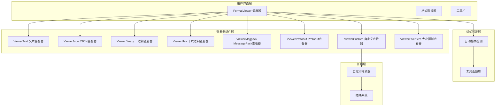
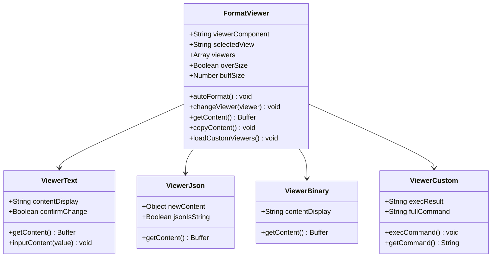
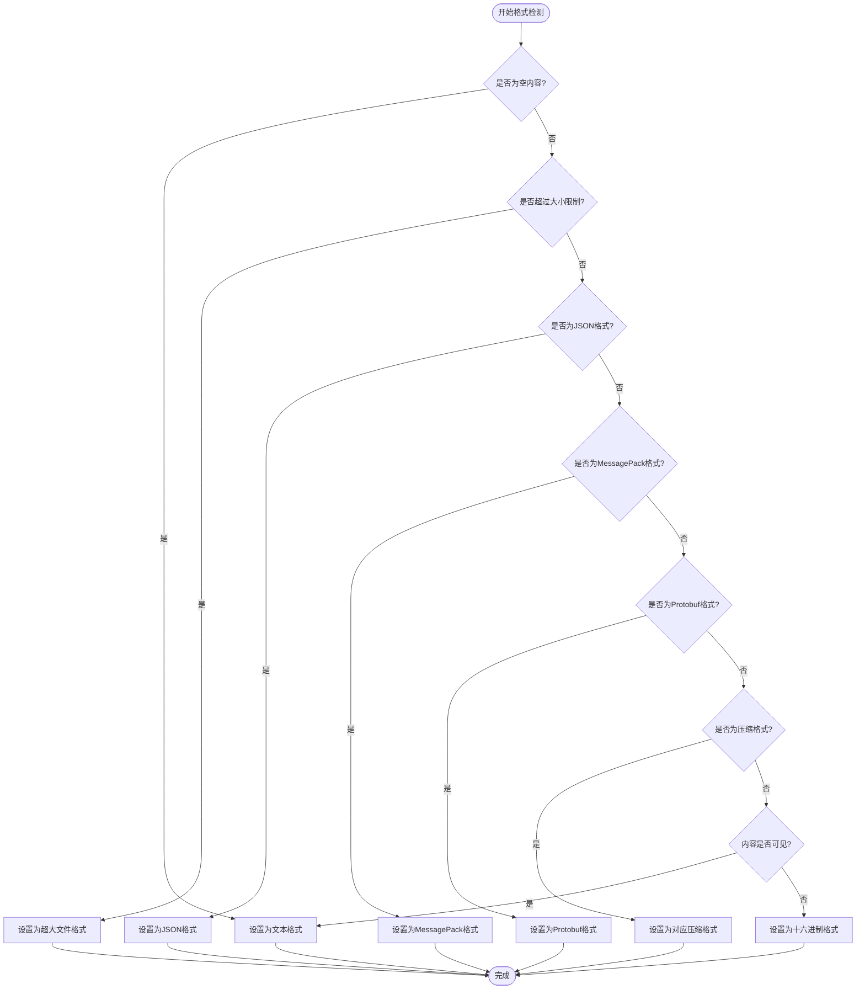
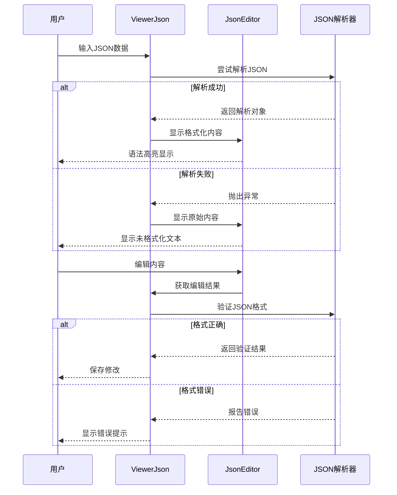
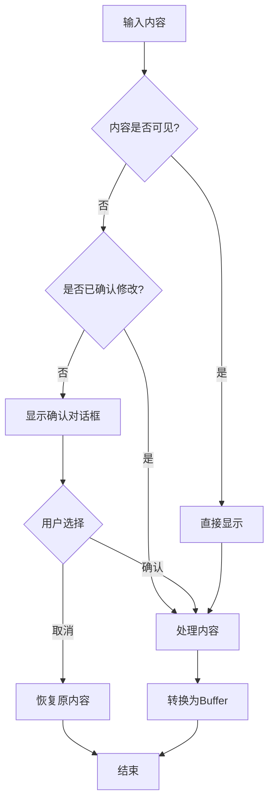
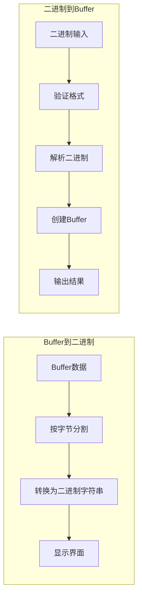
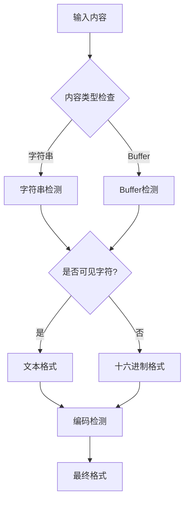
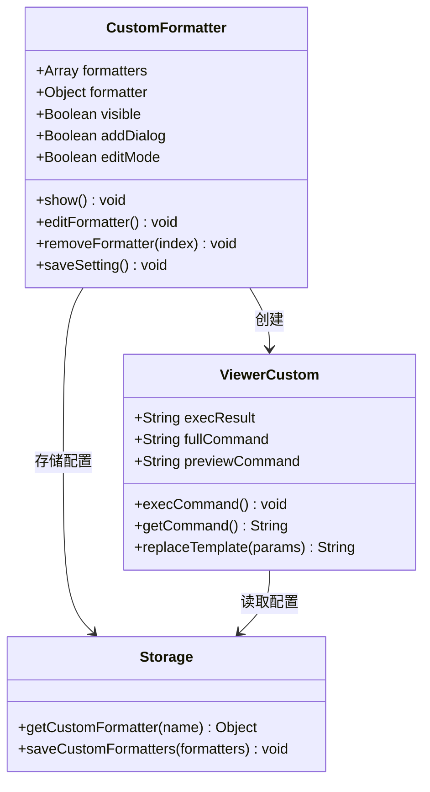
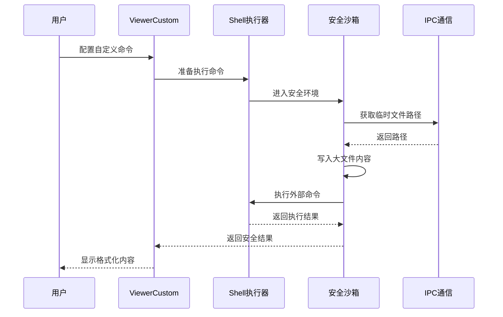
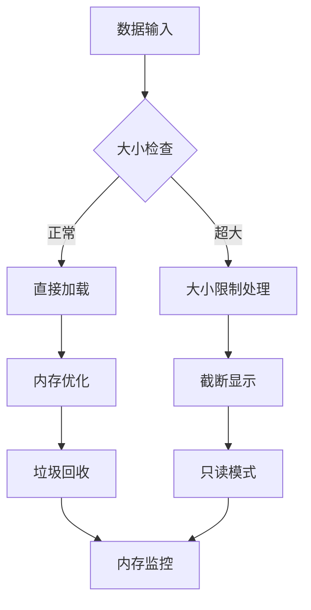

# 数据查看器

<cite>
**本文档中引用的文件**
- [FormatViewer.vue](file://src/components/FormatViewer.vue)
- [ViewerJson.vue](file://src/components/viewers/ViewerJson.vue)
- [ViewerText.vue](file://src/components/viewers/ViewerText.vue)
- [ViewerBinary.vue](file://src/components/viewers/ViewerBinary.vue)
- [ViewerHex.vue](file://src/components/viewers/ViewerHex.vue)
- [ViewerMsgpack.vue](file://src/components/viewers/ViewerMsgpack.vue)
- [ViewerProtobuf.vue](file://src/components/viewers/ViewerProtobuf.vue)
- [ViewerOverSize.vue](file://src/components/viewers/ViewerOverSize.vue)
- [ViewerCustom.vue](file://src/components/viewers/ViewerCustom.vue)
- [CustomFormatter.vue](file://src/components/CustomFormatter.vue)
- [JsonEditor.vue](file://src/components/JsonEditor.vue)
- [util.js](file://src/util.js)
- [storage.js](file://src/storage.js)
</cite>

## 目录
1. [简介](#简介)
2. [系统架构概览](#系统架构概览)
3. [核心组件分析](#核心组件分析)
4. [查看器类型详解](#查看器类型详解)
5. [格式检测与自动选择](#格式检测与自动选择)
6. [自定义格式扩展](#自定义格式扩展)
7. [性能优化与安全机制](#性能优化与安全机制)
8. [配置与使用指南](#配置与使用指南)
9. [故障排除](#故障排除)
10. [总结](#总结)

## 简介

Another Redis Desktop Manager 的数据查看器是一个功能强大的多格式数据解析与展示系统，支持多种数据格式的智能识别、语法高亮、折叠展开和格式化显示。该系统采用模块化设计，通过 FormatViewer 作为调度器，根据数据特征自动选择最优的查看器组件进行渲染。

主要特性包括：
- 支持 JSON、文本、二进制、十六进制等多种格式
- 内置 MessagePack、Protobuf 等高级格式解析
- 自动格式检测与智能切换
- 可扩展的自定义格式支持
- 安全的异步加载机制
- 语法高亮与代码折叠功能

## 系统架构概览

数据查看器系统采用分层架构设计，包含调度层、格式检测层、查看器组件层和工具函数层。



**图表来源**
- [FormatViewer.vue](file://src/components/FormatViewer.vue#L1-L294)
- [util.js](file://src/util.js#L1-L392)

**章节来源**
- [FormatViewer.vue](file://src/components/FormatViewer.vue#L1-L294)

## 核心组件分析

### FormatViewer - 查看器调度器

FormatViewer 是整个数据查看器系统的核心调度器，负责格式检测、查看器选择和组件渲染协调。

#### 主要功能特性

1. **自动格式检测**：基于数据内容特征自动选择最适合的查看器
2. **动态组件切换**：运行时动态加载和切换不同的查看器组件
3. **自定义格式支持**：集成自定义格式器扩展功能
4. **大小限制处理**：对超大文件提供专门的处理机制

#### 组件结构分析



**图表来源**
- [FormatViewer.vue](file://src/components/FormatViewer.vue#L56-L257)
- [ViewerText.vue](file://src/components/viewers/ViewerText.vue#L9-L58)
- [ViewerJson.vue](file://src/components/viewers/ViewerJson.vue#L8-L46)
- [ViewerBinary.vue](file://src/components/viewers/ViewerBinary.vue#L8-L32)
- [ViewerCustom.vue](file://src/components/viewers/ViewerCustom.vue#L14-L179)

#### 自动格式检测流程



**图表来源**
- [FormatViewer.vue](file://src/components/FormatViewer.vue#L172-L227)

**章节来源**
- [FormatViewer.vue](file://src/components/FormatViewer.vue#L172-L227)

## 查看器类型详解

### ViewerJson - JSON 查看器

ViewerJson 基于 JsonEditor 组件实现，提供完整的 JSON 数据解析、语法高亮和交互式编辑功能。

#### 核心特性

1. **语法高亮**：支持 JSON 键值对的颜色区分
2. **自动格式化**：智能缩进和格式化显示
3. **折叠展开**：支持对象和数组的层级折叠
4. **大数据处理**：使用 @qii404/json-bigint 库处理大整数
5. **错误恢复**：解析失败时回退到原始内容

#### 实现机制



**图表来源**
- [ViewerJson.vue](file://src/components/viewers/ViewerJson.vue#L14-L46)
- [JsonEditor.vue](file://src/components/JsonEditor.vue#L52-L72)

#### JsonEditor 组件特性

JsonEditor 是基于 Monaco Editor 构建的高级 JSON 编辑器，提供以下专业功能：

1. **语法高亮**：不同颜色区分键名、字符串、数字等
2. **自动补全**：JSON 结构智能提示
3. **错误检测**：实时语法检查和错误标记
4. **代码折叠**：支持多层级的对象和数组折叠
5. **格式化**：一键格式化和美化输出

**章节来源**
- [ViewerJson.vue](file://src/components/viewers/ViewerJson.vue#L1-L47)
- [JsonEditor.vue](file://src/components/JsonEditor.vue#L1-L238)

### ViewerText - 文本查看器

ViewerText 提供基础的文本内容显示和编辑功能，支持编码检测和内容变更确认。

#### 核心功能

1. **编码自动检测**：自动识别文本编码格式
2. **内容变更确认**：对不可见内容修改提供确认机制
3. **缓冲区转换**：自动在 Buffer 和字符串间转换
4. **输入验证**：确保内容格式正确性

#### 内容处理流程



**图表来源**
- [ViewerText.vue](file://src/components/viewers/ViewerText.vue#L35-L49)

**章节来源**
- [ViewerText.vue](file://src/components/viewers/ViewerText.vue#L1-L58)

### ViewerBinary - 二进制查看器

ViewerBinary 专门处理二进制数据，提供二进制字符串与 Buffer 之间的转换功能。

#### 功能特性

1. **二进制转换**：支持 Buffer 到二进制字符串的双向转换
2. **十六进制显示**：可选的十六进制格式显示
3. **ASCII字符映射**：可读的 ASCII 字符表示
4. **数据完整性**：确保转换过程中的数据准确性

#### 转换算法



**图表来源**
- [ViewerBinary.vue](file://src/components/viewers/ViewerBinary.vue#L18-L25)
- [util.js](file://src/util.js#L59-L73)

**章节来源**
- [ViewerBinary.vue](file://src/components/viewers/ViewerBinary.vue#L1-L32)

### ViewerHex - 十六进制查看器

ViewerHex 提供专业的十六进制数据显示和编辑功能，支持双视图模式。

#### 特色功能

1. **十六进制显示**：标准的十六进制格式展示
2. **ASCII对照**：右侧ASCII字符对照表
3. **编辑支持**：直接编辑十六进制内容
4. **格式验证**：确保输入的十六进制格式正确

**章节来源**
- [ViewerHex.vue](file://src/components/viewers/ViewerHex.vue#L1-L32)

## 格式检测与自动选择

### 工具函数库

系统提供了完整的工具函数库来支持格式检测和数据处理。

#### 核心检测函数

| 函数名 | 功能描述 | 检测范围 |
|--------|----------|----------|
| `isJson()` | JSON格式检测 | 字符串是否为有效JSON |
| `isMsgpack()` | MessagePack检测 | Buffer是否为MessagePack格式 |
| `isProtobuf()` | Protobuf检测 | Buffer是否为Protobuf格式 |
| `isPHPSerialize()` | PHP序列化检测 | 字符串是否为PHP序列化格式 |
| `isJavaSerialize()` | Java序列化检测 | Buffer是否为Java序列化格式 |
| `isPickle()` | Python Pickle检测 | Buffer是否为Python Pickle格式 |
| `isGzip()/isDeflate()` | 压缩格式检测 | Buffer是否为压缩格式 |

#### 编码检测机制



**图表来源**
- [util.js](file://src/util.js#L81-L163)

**章节来源**
- [util.js](file://src/util.js#L81-L163)

### 大小限制处理

系统对超大文件提供专门的处理机制，避免内存溢出和性能问题。

#### 大小限制策略

1. **阈值设定**：默认20MB大小限制
2. **截断显示**：只显示部分内容，隐藏其余部分
3. **只读模式**：超大文件禁止编辑操作
4. **警告提示**：明确告知用户文件大小限制

**章节来源**
- [ViewerOverSize.vue](file://src/components/viewers/ViewerOverSize.vue#L1-L44)

## 自定义格式扩展

### CustomFormatter - 自定义格式管理器

CustomFormatter 提供完整的自定义格式扩展功能，支持用户脚本注入和插件化接口。

#### 扩展机制设计



**图表来源**
- [CustomFormatter.vue](file://src/components/CustomFormatter.vue#L114-L177)
- [ViewerCustom.vue](file://src/components/viewers/ViewerCustom.vue#L14-L179)
- [storage.js](file://src/storage.js#L165-L181)

#### 模板变量系统

自定义格式器支持丰富的模板变量替换：

| 变量名 | 描述 | 使用场景 |
|--------|------|----------|
| `{KEY}` | Redis键名 | 所有数据类型 |
| `{VALUE}` | 原始值内容 | 字符串、列表、集合、有序集合 |
| `{FIELD}` | Hash字段名 | Hash数据类型 |
| `{SCORE}` | 分数值 | 有序集合数据类型 |
| `{MEMBER}` | 成员名称 | 集合数据类型 |
| `{HEX}` | 十六进制内容 | 大文件处理 |
| `{HEX_FILE}` | 十六进制文件路径 | 超大文件处理 |

#### 安全沙箱设计



**图表来源**
- [ViewerCustom.vue](file://src/components/viewers/ViewerCustom.vue#L76-L151)

**章节来源**
- [CustomFormatter.vue](file://src/components/CustomFormatter.vue#L1-L177)
- [ViewerCustom.vue](file://src/components/viewers/ViewerCustom.vue#L1-L179)

### 插件化接口设计

系统提供标准化的插件接口，支持第三方格式解析器的集成。

#### 接口规范

1. **统一输入**：所有查看器接收 Buffer 类型数据
2. **标准化输出**：返回格式化后的字符串或对象
3. **错误处理**：统一的错误报告机制
4. **生命周期**：标准化的初始化和销毁流程

## 性能优化与安全机制

### 异步加载策略

系统采用多种异步加载策略来优化性能：

1. **按需加载**：只在需要时加载特定格式的查看器
2. **懒加载**：大型组件采用懒加载机制
3. **缓存机制**：缓存格式检测结果和转换中间状态
4. **防抖处理**：对频繁的格式检测操作进行防抖优化

### 内存管理



### 安全防护机制

1. **输入验证**：严格验证所有输入数据的格式和大小
2. **执行隔离**：自定义命令在安全沙箱中执行
3. **资源限制**：对文件操作和进程执行进行资源限制
4. **错误隔离**：防止恶意数据导致应用崩溃

**章节来源**
- [util.js](file://src/util.js#L164-L182)
- [ViewerCustom.vue](file://src/components/viewers/ViewerCustom.vue#L76-L151)

## 配置与使用指南

### 默认查看器设置

系统提供灵活的默认查看器配置选项：

1. **自动检测优先级**：JSON > MessagePack > Protobuf > 压缩格式 > 文本
2. **手动切换**：通过格式选择器手动切换查看器
3. **记住偏好**：保存用户的查看器偏好设置
4. **临时覆盖**：临时覆盖自动检测结果

### 显示参数调整

| 参数项 | 默认值 | 可调范围 | 影响效果 |
|--------|--------|----------|----------|
| 最大显示大小 | 20MB | 1MB - 100MB | 控制超大文件处理 |
| 预览字符数 | 20000 | 1000 - 100000 | 截断显示长度 |
| 缩进空格数 | 4 | 2 - 8 | JSON格式化缩进 |
| 字体大小 | 14px | 10px - 20px | 代码编辑器字体 |

### 自定义格式配置

#### 创建自定义格式器步骤

1. **打开格式管理器**：点击"自定义"按钮
2. **添加新格式器**：点击"+"按钮
3. **配置基本信息**：
   - 名称：格式器显示名称
   - 命令：可执行文件路径
   - 参数：命令行参数模板
4. **测试配置**：验证格式器工作正常
5. **保存设置**：应用到系统配置

#### 参数模板示例

```bash
# JSON格式化
python /usr/local/bin/json-format.py --input "{HEX_FILE}"

# XML解析
xmlstarlet fo --input "{HEX}"

# Base64解码
base64 -d <<< "{VALUE}"
```

**章节来源**
- [FormatViewer.vue](file://src/components/FormatViewer.vue#L236-L251)
- [CustomFormatter.vue](file://src/components/CustomFormatter.vue#L138-L170)

## 故障排除

### 常见问题及解决方案

#### 格式检测失败

**问题现象**：内容无法正确识别格式
**可能原因**：
- 数据格式不标准
- 文件损坏或不完整
- 编码问题

**解决方法**：
1. 检查数据完整性
2. 尝试手动选择格式
3. 转换编码格式
4. 使用十六进制查看器分析

#### 自定义格式器执行失败

**问题现象**：自定义命令无法正常执行
**可能原因**：
- 命令路径错误
- 权限不足
- 参数格式错误
- 外部依赖缺失

**解决方法**：
1. 验证命令路径和权限
2. 检查参数模板语法
3. 测试命令在终端中执行
4. 检查外部依赖安装情况

#### 性能问题

**问题现象**：大文件加载缓慢或卡顿
**可能原因**：
- 文件过大
- 系统内存不足
- 格式复杂度高

**解决方法**：
1. 调整大小限制阈值
2. 使用只读模式
3. 优化系统内存配置
4. 选择更高效的格式

### 调试技巧

1. **启用详细日志**：在开发模式下查看详细错误信息
2. **使用十六进制查看器**：分析原始数据结构
3. **检查网络连接**：确保外部命令可以正常访问
4. **验证文件权限**：确保临时文件写入权限

## 总结

Another Redis Desktop Manager 的数据查看器系统是一个功能完善、设计精良的数据处理平台。它通过模块化的架构设计，实现了多种数据格式的智能识别和高效展示。

### 主要优势

1. **功能全面**：支持从基础文本到高级 Protobuf、MessagePack 等格式
2. **智能检测**：自动识别数据格式，提供最佳的显示方案
3. **扩展性强**：支持自定义格式扩展，满足特殊需求
4. **性能优秀**：采用异步加载和缓存机制，保证流畅体验
5. **安全可靠**：完善的错误处理和安全防护机制

### 技术特色

- **Monaco Editor 集成**：提供专业的 JSON 编辑体验
- **模板变量系统**：灵活的自定义格式配置
- **安全沙箱设计**：保护系统免受恶意数据威胁
- **响应式设计**：适应不同屏幕尺寸和分辨率

该系统为 Redis 数据的可视化和编辑提供了强大而灵活的解决方案，是现代数据库管理工具的重要组成部分。