# 文本查看器

<cite>
**本文档中引用的文件**
- [ViewerText.vue](file://src/components/viewers/ViewerText.vue)
- [FormatViewer.vue](file://src/components/FormatViewer.vue)
- [InputBinary.vue](file://src/components/InputBinary.vue)
- [util.js](file://src/util.js)
- [storage.js](file://src/storage.js)
- [ViewerHex.vue](file://src/components/viewers/ViewerHex.vue)
- [ViewerOverSize.vue](file://src/components/viewers/ViewerOverSize.vue)
- [ViewerBinary.vue](file://src/components/viewers/ViewerBinary.vue)
</cite>

## 目录
1. [简介](#简介)
2. [项目结构](#项目结构)
3. [核心组件](#核心组件)
4. [架构概览](#架构概览)
5. [详细组件分析](#详细组件分析)
6. [编码检测机制](#编码检测机制)
7. [换行策略配置](#换行策略配置)
8. [大文本渲染优化](#大文本渲染优化)
9. [协作关系分析](#协作关系分析)
10. [配置参数说明](#配置参数说明)
11. [潜在问题与解决方案](#潜在问题与解决方案)
12. [调试建议](#调试建议)
13. [总结](#总结)

## 简介

文本查看器是Another Redis Desktop Manager中的核心组件之一，负责处理和显示Redis键值对中的文本数据。该系统采用模块化设计，通过ViewerText.vue作为主要的文本编辑器，配合FormatViewer.vue进行格式化选择，并与其他专门的查看器组件协同工作，实现对不同编码格式和数据类型的智能识别与展示。

## 项目结构

文本查看器相关的文件组织结构如下：

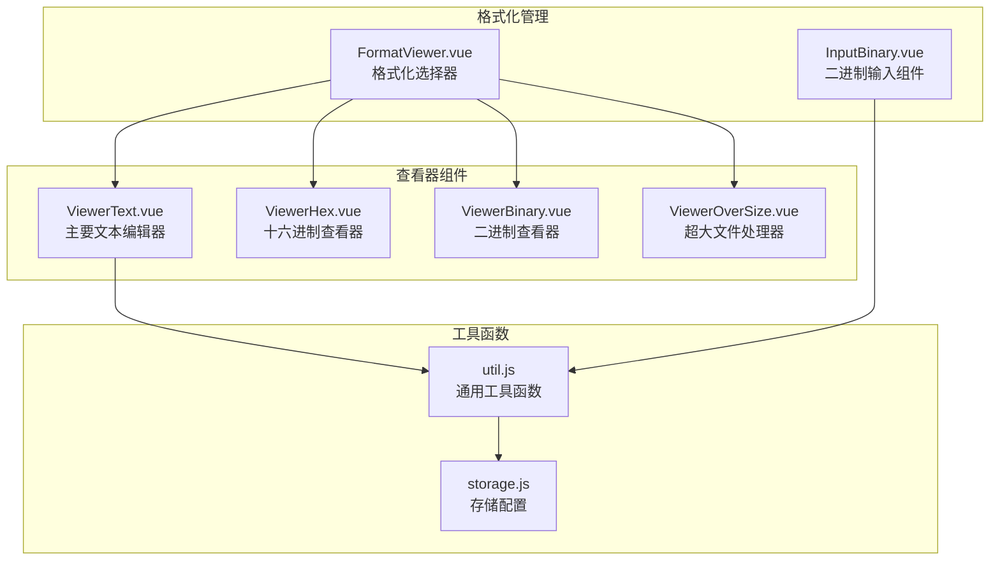
```mermaid
graph TB
subgraph "查看器组件"
A[ViewerText.vue<br/>主要文本编辑器]
B[ViewerHex.vue<br/>十六进制查看器]
C[ViewerBinary.vue<br/>二进制查看器]
D[ViewerOverSize.vue<br/>超大文件处理器]
end
subgraph "格式化管理"
E[FormatViewer.vue<br/>格式化选择器]
F[InputBinary.vue<br/>二进制输入组件]
end
subgraph "工具函数"
G[util.js<br/>通用工具函数]
H[storage.js<br/>存储配置]
end
E --> A
E --> B
E --> C
E --> D
A --> G
F --> G
G --> H
```

**图表来源**
- [ViewerText.vue](file://src/components/viewers/ViewerText.vue#L1-L58)
- [FormatViewer.vue](file://src/components/FormatViewer.vue#L1-L294)
- [util.js](file://src/util.js#L1-L392)

## 核心组件

### ViewerText.vue - 主要文本编辑器

ViewerText.vue是文本查看器的核心组件，提供基础的文本编辑功能：

- **模板结构**: 使用Element UI的el-input组件实现文本输入框
- **数据绑定**: 通过v-model双向绑定contentDisplay变量
- **状态管理**: 维护confirmChange、contentDisplay、oldContentDisplay三个关键状态
- **事件处理**: 实现inputContent方法处理用户输入

### FormatViewer.vue - 格式化选择器

FormatViewer.vue作为统一的入口点，负责：
- **自动格式检测**: 根据内容特征自动选择合适的查看器
- **多格式支持**: 支持Text、Hex、JSON、Binary等多种格式
- **动态切换**: 可以在不同查看器之间动态切换
- **自定义扩展**: 支持自定义格式化器

**章节来源**
- [ViewerText.vue](file://src/components/viewers/ViewerText.vue#L1-L58)
- [FormatViewer.vue](file://src/components/FormatViewer.vue#L1-L294)

## 架构概览

文本查看器系统采用分层架构设计：

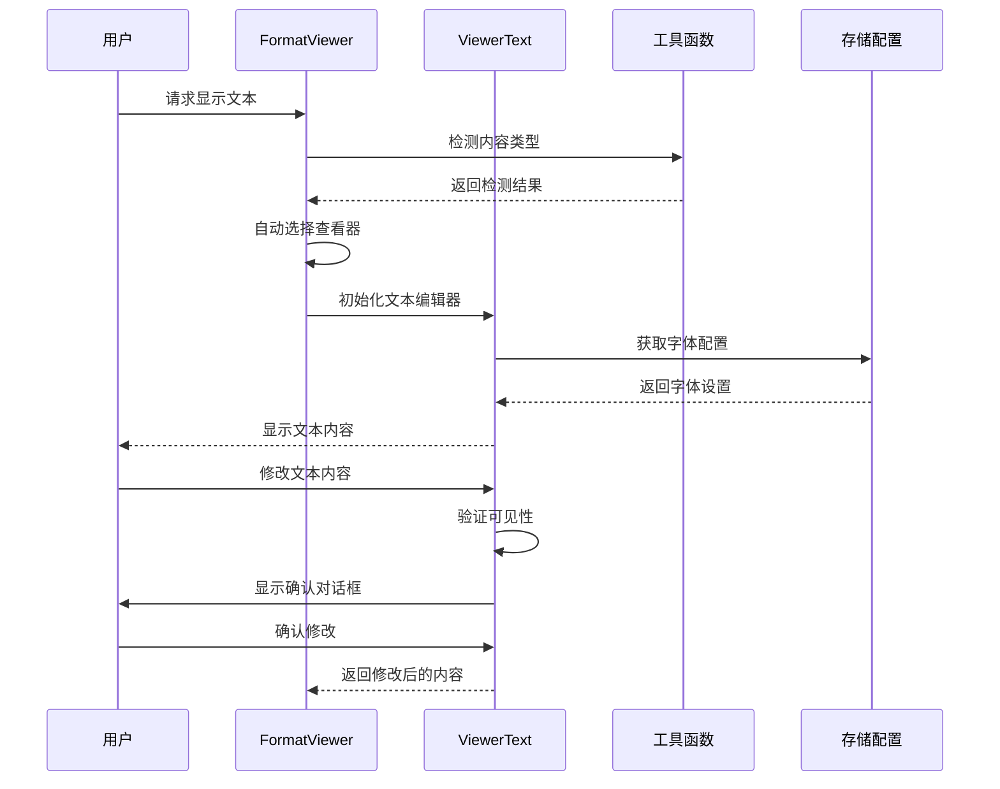
```mermaid
sequenceDiagram
participant User as 用户
participant FormatViewer as FormatViewer
participant ViewerText as ViewerText
participant Util as 工具函数
participant Storage as 存储配置
User->>FormatViewer : 请求显示文本
FormatViewer->>Util : 检测内容类型
Util-->>FormatViewer : 返回检测结果
FormatViewer->>FormatViewer : 自动选择查看器
FormatViewer->>ViewerText : 初始化文本编辑器
ViewerText->>Storage : 获取字体配置
Storage-->>ViewerText : 返回字体设置
ViewerText-->>User : 显示文本内容
User->>ViewerText : 修改文本内容
ViewerText->>ViewerText : 验证可见性
ViewerText->>User : 显示确认对话框
User->>ViewerText : 确认修改
ViewerText-->>FormatViewer : 返回修改后的内容
```

**图表来源**
- [FormatViewer.vue](file://src/components/FormatViewer.vue#L172-L227)
- [ViewerText.vue](file://src/components/viewers/ViewerText.vue#L35-L49)
- [util.js](file://src/util.js#L9-L15)

## 详细组件分析

### ViewerText.vue深度分析

#### 数据结构设计

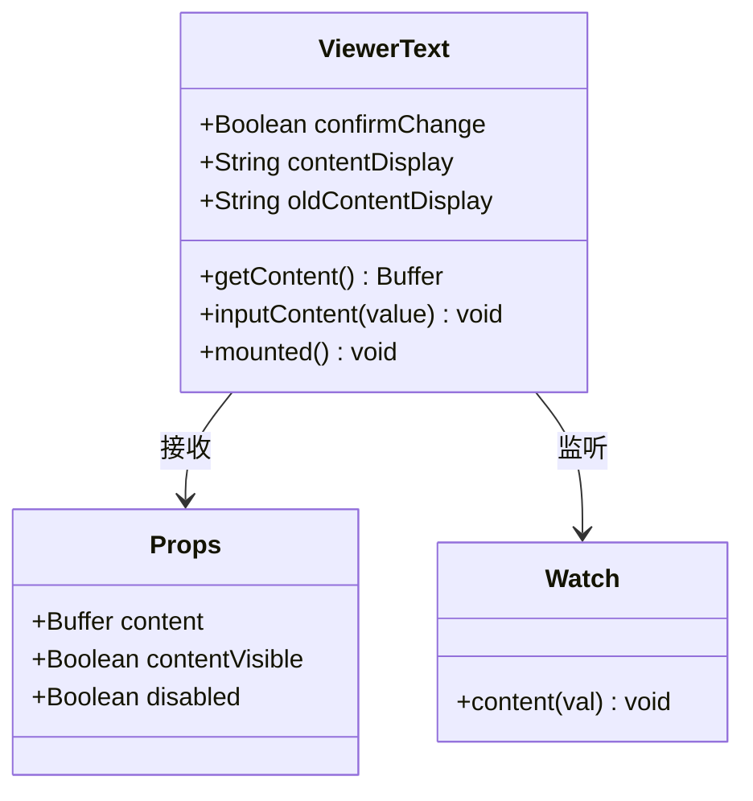
```mermaid
classDiagram
class ViewerText {
+Boolean confirmChange
+String contentDisplay
+String oldContentDisplay
+getContent() Buffer
+inputContent(value) void
+mounted() void
}
class Props {
+Buffer content
+Boolean contentVisible
+Boolean disabled
}
class Watch {
+content(val) void
}
ViewerText --> Props : 接收
ViewerText --> Watch : 监听
```

**图表来源**
- [ViewerText.vue](file://src/components/viewers/ViewerText.vue#L11-L16)
- [ViewerText.vue](file://src/components/viewers/ViewerText.vue#L18-L24)

#### 编辑器状态管理

ViewerText组件实现了复杂的状态管理机制：

1. **初始状态**: mounted钩子中初始化contentDisplay和oldContentDisplay
2. **内容更新**: watch监听content变化，自动刷新显示内容
3. **编辑确认**: inputContent方法处理用户编辑，需要确认才能修改不可见内容
4. **内容获取**: getContent方法根据状态决定返回原始内容还是修改后的内容

#### 输入验证机制

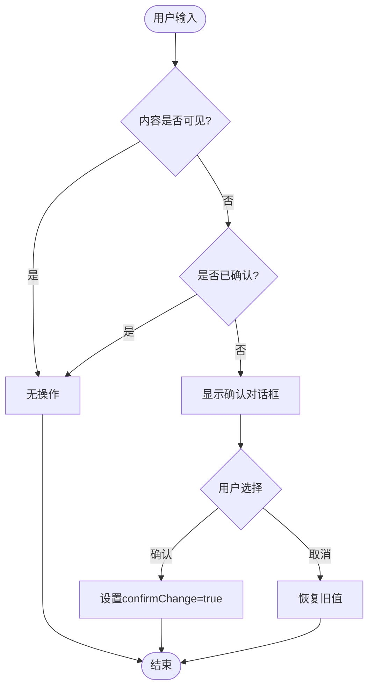
```mermaid
flowchart TD
Start([用户输入]) --> CheckVisible{内容是否可见?}
CheckVisible --> |是| NoAction[无操作]
CheckVisible --> |否| CheckConfirmed{是否已确认?}
CheckConfirmed --> |是| NoAction
CheckConfirmed --> |否| ShowConfirm[显示确认对话框]
ShowConfirm --> UserChoice{用户选择}
UserChoice --> |确认| SetConfirm[设置confirmChange=true]
UserChoice --> |取消| RestoreValue[恢复旧值]
SetConfirm --> End([结束])
RestoreValue --> End
NoAction --> End
```

**图表来源**
- [ViewerText.vue](file://src/components/viewers/ViewerText.vue#L35-L49)

**章节来源**
- [ViewerText.vue](file://src/components/viewers/ViewerText.vue#L1-L58)

### FormatViewer.vue深度分析

#### 自动格式检测算法

FormatViewer实现了智能的格式检测机制：

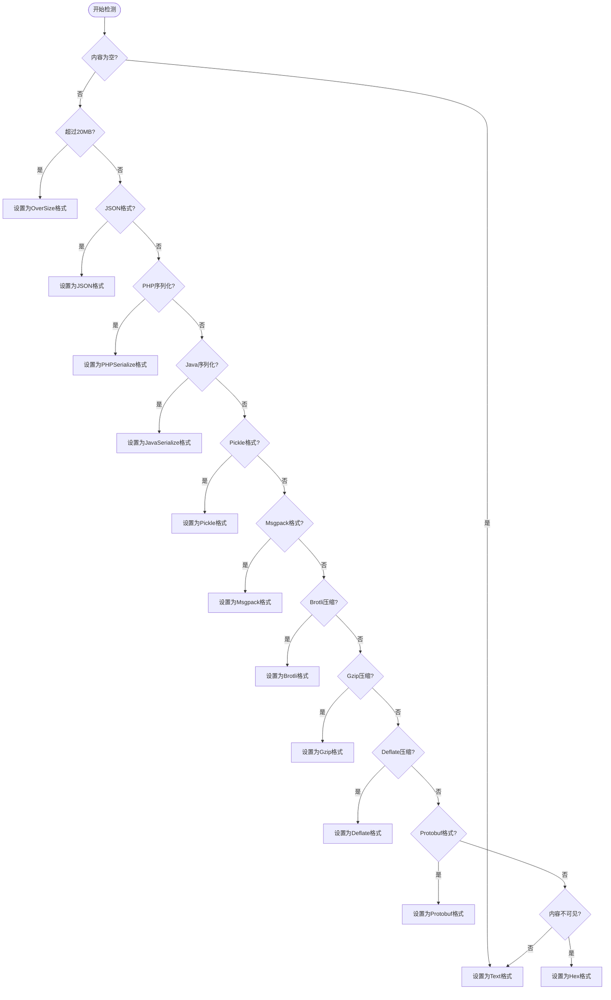
```mermaid
flowchart TD
Start([开始检测]) --> CheckEmpty{内容为空?}
CheckEmpty --> |是| SetText[设置为Text格式]
CheckEmpty --> |否| CheckOverSize{超过20MB?}
CheckOverSize --> |是| SetOverSize[设置为OverSize格式]
CheckOverSize --> |否| CheckJSON{JSON格式?}
CheckJSON --> |是| SetJSON[设置为JSON格式]
CheckJSON --> |否| CheckPHP{PHP序列化?}
CheckPHP --> |是| SetPHP[设置为PHPSerialize格式]
CheckPHP --> |否| CheckJava{Java序列化?}
CheckJava --> |是| SetJava[设置为JavaSerialize格式]
CheckJava --> |否| CheckPickle{Pickle格式?}
CheckPickle --> |是| SetPickle[设置为Pickle格式]
CheckPickle --> |否| CheckMsgPack{Msgpack格式?}
CheckMsgPack --> |是| SetMsgPack[设置为Msgpack格式]
CheckMsgPack --> |否| CheckBrotli{Brotli压缩?}
CheckBrotli --> |是| SetBrotli[设置为Brotli格式]
CheckBrotli --> |否| CheckGzip{Gzip压缩?}
CheckGzip --> |是| SetGzip[设置为Gzip格式]
CheckGzip --> |否| CheckDeflate{Deflate压缩?}
CheckDeflate --> |是| SetDeflate[设置为Deflate格式]
CheckDeflate --> |否| CheckProtobuf{Protobuf格式?}
CheckProtobuf --> |是| SetProtobuf[设置为Protobuf格式]
CheckProtobuf --> |否| CheckHex{内容不可见?}
CheckHex --> |是| SetHex[设置为Hex格式]
CheckHex --> |否| SetText
```

**图表来源**
- [FormatViewer.vue](file://src/components/FormatViewer.vue#L172-L227)

#### 动态组件切换机制

FormatViewer使用Vue的动态组件特性实现查看器的无缝切换：

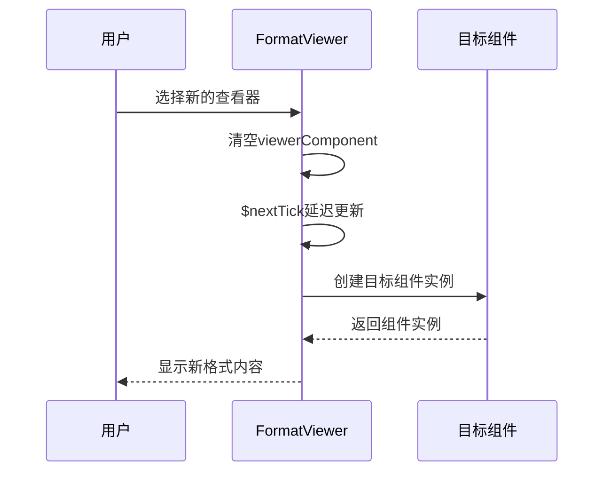
```mermaid
sequenceDiagram
participant User as 用户
participant FormatViewer as FormatViewer
participant Component as 目标组件
User->>FormatViewer : 选择新的查看器
FormatViewer->>FormatViewer : 清空viewerComponent
FormatViewer->>FormatViewer : $nextTick延迟更新
FormatViewer->>Component : 创建目标组件实例
Component-->>FormatViewer : 返回组件实例
FormatViewer-->>User : 显示新格式内容
```

**图表来源**
- [FormatViewer.vue](file://src/components/FormatViewer.vue#L148-L153)

**章节来源**
- [FormatViewer.vue](file://src/components/FormatViewer.vue#L1-L294)

## 编码检测机制

### bufVisible函数实现

系统的核心编码检测功能由util.js中的bufVisible函数实现：

```mermaid
flowchart TD
Start([bufVisible检查]) --> CheckType{输入类型检查}
CheckType --> |字符串| ReturnTrue[返回true]
CheckType --> |Buffer| Convert[转换为字符串]
Convert --> Compare[比较Buffer.toString()与原Buffer]
Compare --> Equal{两者相等?}
Equal --> |是| ReturnTrue
Equal --> |否| ReturnFalse[返回false]
ReturnTrue --> End([结束])
ReturnFalse --> End
```

**图表来源**
- [util.js](file://src/util.js#L9-L15)

### 编码检测算法原理

bufVisible函数通过以下方式判断内容是否可见：

1. **类型检查**: 首先检查输入是否为字符串，如果是直接返回true
2. **转换验证**: 将Buffer转换为字符串，然后重新创建Buffer
3. **相等性比较**: 比较原始Buffer和转换后的Buffer是否相等
4. **结果返回**: 如果相等则认为内容可见，否则不可见

### 字符串转换机制

bufToString函数提供了灵活的字符串转换功能：

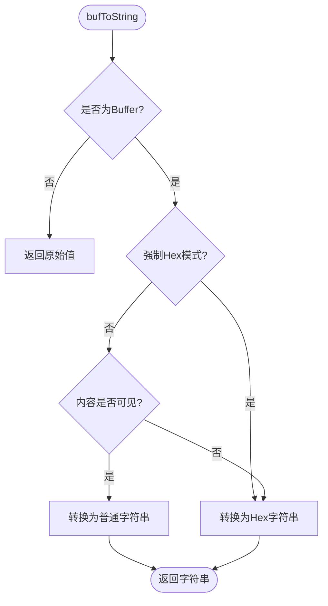
```mermaid
flowchart TD
Start([bufToString]) --> CheckBuffer{是否为Buffer?}
CheckBuffer --> |否| ReturnOriginal[返回原始值]
CheckBuffer --> |是| CheckForceHex{强制Hex模式?}
CheckForceHex --> |是| ConvertHex[转换为Hex字符串]
CheckForceHex --> |否| CheckVisible{内容是否可见?}
CheckVisible --> |是| ConvertPlain[转换为普通字符串]
CheckVisible --> |否| ConvertHex
ConvertPlain --> End([返回字符串])
ConvertHex --> End
```

**图表来源**
- [util.js](file://src/util.js#L16-L30)

**章节来源**
- [util.js](file://src/util.js#L9-L30)

## 换行策略配置

### 当前实现分析

ViewerText.vue使用Element UI的el-input组件，该组件默认支持以下换行特性：

- **自动换行**: 基于容器宽度自动换行
- **滚动条**: 内容超出时显示滚动条
- **高度自适应**: 支持多行文本输入

### 配置优化建议

虽然当前实现较为简单，但可以通过以下方式增强换行控制：

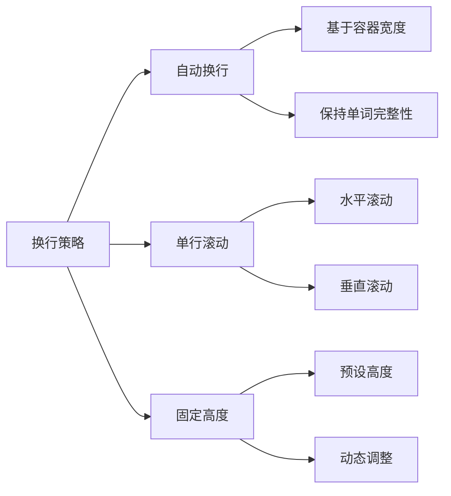
```mermaid
graph LR
A[换行策略] --> B[自动换行]
A --> C[单行滚动]
A --> D[固定高度]
B --> B1[基于容器宽度]
B --> B2[保持单词完整性]
C --> C1[水平滚动]
C --> C2[垂直滚动]
D --> D1[预设高度]
D --> D2[动态调整]
```

### 性能优化考虑

对于大文本处理，建议实现以下优化策略：

1. **虚拟滚动**: 对于超长文本使用虚拟滚动技术
2. **懒加载**: 分段加载文本内容
3. **缓存机制**: 缓存渲染结果减少重复计算

## 大文本渲染优化

### ViewerOverSize.vue实现

针对超大文件（>20MB）的特殊处理：

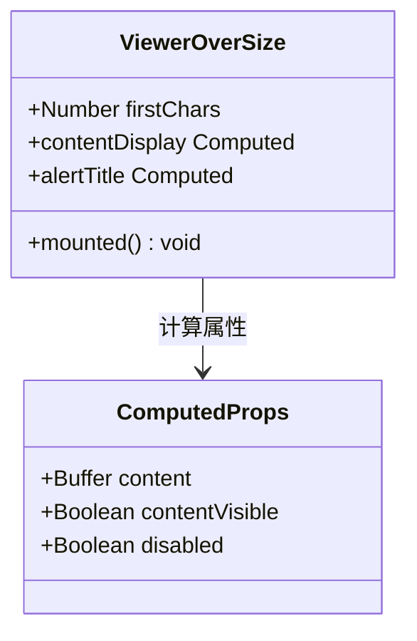
```mermaid
classDiagram
class ViewerOverSize {
+Number firstChars
+contentDisplay Computed
+alertTitle Computed
+mounted() void
}
class ComputedProps {
+Buffer content
+Boolean contentVisible
+Boolean disabled
}
ViewerOverSize --> ComputedProps : 计算属性
```

**图表来源**
- [ViewerOverSize.vue](file://src/components/viewers/ViewerOverSize.vue#L12-L27)

### 渲染优化策略

1. **内容截断**: 默认只显示前20000个字符
2. **警告提示**: 明确告知用户内容被截断
3. **只读模式**: 超大文件不允许编辑
4. **性能保护**: 避免大量数据导致的性能问题

### 内存管理

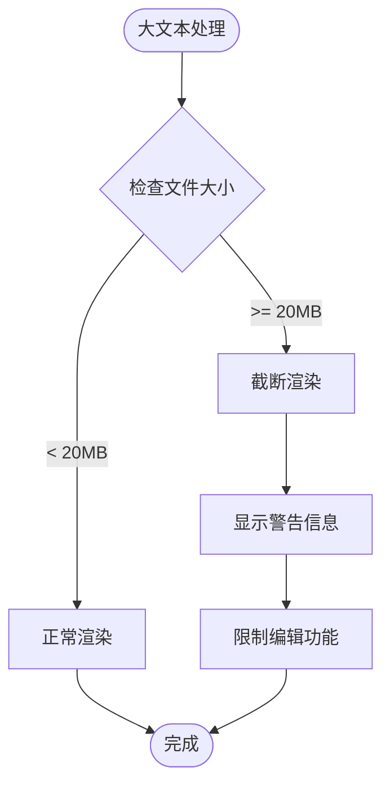
```mermaid
flowchart TD
Start([大文本处理]) --> CheckSize{检查文件大小}
CheckSize --> |< 20MB| NormalRender[正常渲染]
CheckSize --> |>= 20MB| TruncateRender[截断渲染]
TruncateRender --> ShowWarning[显示警告信息]
ShowWarning --> LimitEdit[限制编辑功能]
NormalRender --> End([完成])
LimitEdit --> End
```

**图表来源**
- [ViewerOverSize.vue](file://src/components/viewers/ViewerOverSize.vue#L1-L43)
- [FormatViewer.vue](file://src/components/FormatViewer.vue#L118-L120)

**章节来源**
- [ViewerOverSize.vue](file://src/components/viewers/ViewerOverSize.vue#L1-L43)

## 协作关系分析

### 与InputBinary.vue的协作

ViewerText.vue与InputBinary.vue在二进制数据处理方面存在协作关系：

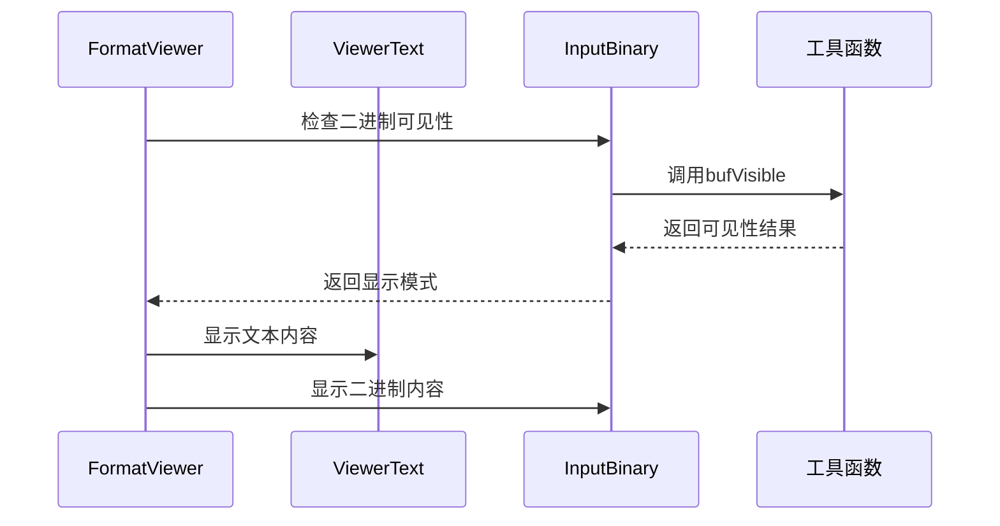
```mermaid
sequenceDiagram
participant FormatViewer as FormatViewer
participant ViewerText as ViewerText
participant InputBinary as InputBinary
participant Util as 工具函数
FormatViewer->>InputBinary : 检查二进制可见性
InputBinary->>Util : 调用bufVisible
Util-->>InputBinary : 返回可见性结果
InputBinary-->>FormatViewer : 返回显示模式
FormatViewer->>ViewerText : 显示文本内容
FormatViewer->>InputBinary : 显示二进制内容
```

**图表来源**
- [InputBinary.vue](file://src/components/InputBinary.vue#L25-L31)
- [util.js](file://src/util.js#L9-L15)

### 与FormatViewer.vue的集成

ViewerText作为FormatViewer的子组件，通过props传递数据：

| Prop | 类型 | 描述 |
|------|------|------|
| content | Buffer/String | 要显示的内容 |
| contentVisible | Boolean | 内容是否可见 |
| disabled | Boolean | 是否禁用编辑 |

### MIME类型识别流程

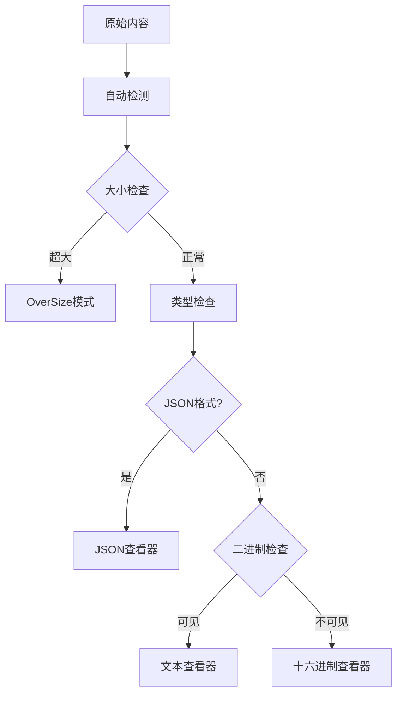
```mermaid
flowchart TD
Content[原始内容] --> AutoDetect[自动检测]
AutoDetect --> SizeCheck{大小检查}
SizeCheck --> |超大| OverSize[OverSize模式]
SizeCheck --> |正常| TypeCheck[类型检查]
TypeCheck --> JSON{JSON格式?}
JSON --> |是| JSONViewer[JSON查看器]
JSON --> |否| BinaryCheck{二进制检查}
BinaryCheck --> |可见| TextViewer[文本查看器]
BinaryCheck --> |不可见| HexViewer[十六进制查看器]
```

**图表来源**
- [FormatViewer.vue](file://src/components/FormatViewer.vue#L172-L227)

**章节来源**
- [FormatViewer.vue](file://src/components/FormatViewer.vue#L1-L294)
- [InputBinary.vue](file://src/components/InputBinary.vue#L1-L47)

## 配置参数说明

### 字体配置系统

系统通过storage.js提供字体配置功能：

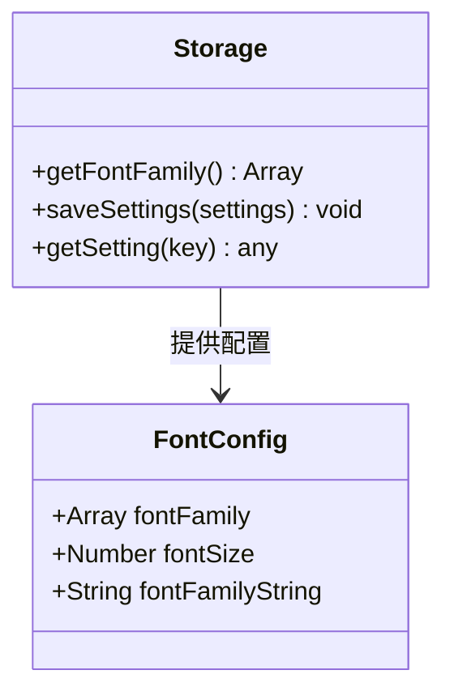
```mermaid
classDiagram
class Storage {
+getFontFamily() Array
+saveSettings(settings) void
+getSetting(key) any
}
class FontConfig {
+Array fontFamily
+Number fontSize
+String fontFamilyString
}
Storage --> FontConfig : 提供配置
```

**图表来源**
- [storage.js](file://src/storage.js#L151-L163)

### 可定制选项

| 参数名称 | 类型 | 默认值 | 描述 |
|----------|------|--------|------|
| fontFamily | Array | 系统默认字体 | 字体族列表 |
| fontSize | Number | 14 | 字体大小 |
| wordWrap | String | 'on' | 换行策略 |
| lineNumbers | String | 'off' | 行号显示 |
| readOnly | Boolean | false | 只读模式 |

### 主题适配

系统支持深色模式主题适配：

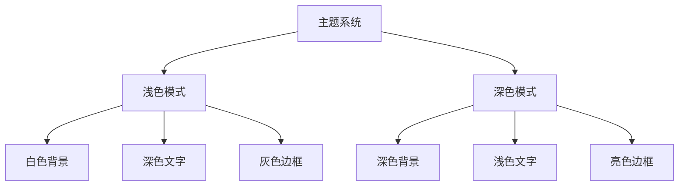
```mermaid
graph TB
A[主题系统] --> B[浅色模式]
A --> C[深色模式]
B --> B1[白色背景]
B --> B2[深色文字]
B --> B3[灰色边框]
C --> C1[深色背景]
C --> C2[浅色文字]
C --> C3[亮色边框]
```

**章节来源**
- [storage.js](file://src/storage.js#L151-L163)
- [util.js](file://src/util.js#L1-L392)

## 潜在问题与解决方案

### 乱码显示问题

#### 成因分析

1. **编码不匹配**: 内容实际编码与检测编码不一致
2. **字符集限制**: 浏览器或系统字符集不支持某些字符
3. **缓冲区损坏**: 数据传输过程中发生损坏

#### 解决方案

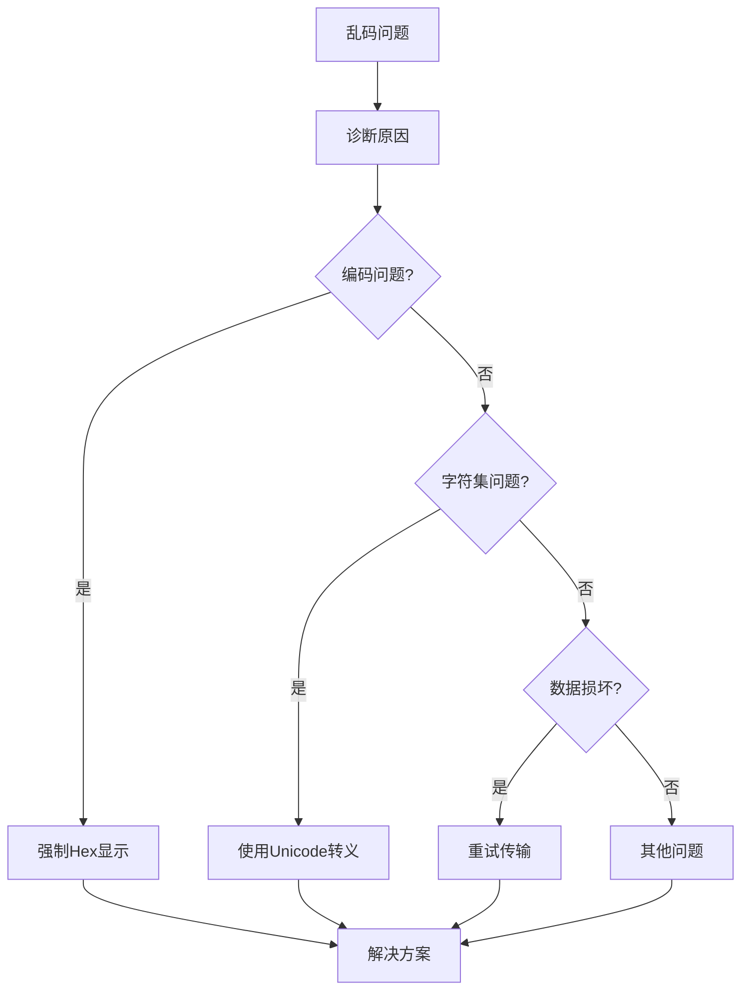
```mermaid
flowchart TD
Problem[乱码问题] --> Diagnose[诊断原因]
Diagnose --> Encoding{编码问题?}
Encoding --> |是| ForceHex[强制Hex显示]
Encoding --> |否| Charset{字符集问题?}
Charset --> |是| Unicode[使用Unicode转义]
Charset --> |否| Corruption{数据损坏?}
Corruption --> |是| Retry[重试传输]
Corruption --> |否| Other[其他问题]
ForceHex --> Solution[解决方案]
Unicode --> Solution
Retry --> Solution
Other --> Solution
```

### 性能问题

#### 大文件处理瓶颈

1. **内存占用**: 超大文件可能导致内存溢出
2. **渲染延迟**: 复杂内容渲染时间过长
3. **响应性差**: 用户交互响应缓慢

#### 优化策略

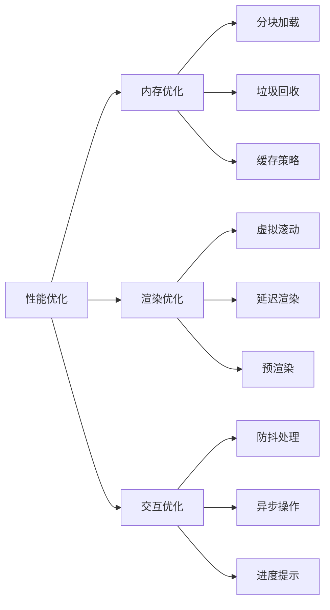
```mermaid
graph LR
A[性能优化] --> B[内存优化]
A --> C[渲染优化]
A --> D[交互优化]
B --> B1[分块加载]
B --> B2[垃圾回收]
B --> B3[缓存策略]
C --> C1[虚拟滚动]
C --> C2[延迟渲染]
C --> C3[预渲染]
D --> D1[防抖处理]
D --> D2[异步操作]
D --> D3[进度提示]
```

### 兼容性问题

#### 不同浏览器的差异

1. **字符编码支持**: 各浏览器对字符编码的支持程度不同
2. **DOM操作差异**: 不同浏览器的DOM操作行为可能有差异
3. **事件处理**: 事件处理机制存在兼容性问题

#### 解决策略

- 使用polyfill处理浏览器差异
- 实现降级方案保证基本功能
- 进行充分的跨浏览器测试

**章节来源**
- [util.js](file://src/util.js#L9-L15)
- [ViewerOverSize.vue](file://src/components/viewers/ViewerOverSize.vue#L1-L43)

## 调试建议

### 开发环境调试

#### Vue DevTools使用

1. **组件树检查**: 查看组件层次结构和状态
2. **状态监控**: 实时监控data和computed属性变化
3. **事件追踪**: 跟踪组件间通信和事件触发

#### 控制台调试

```javascript
// 在Vue组件中添加调试信息
console.log('ViewerText state:', this.$data);
console.log('Content visibility:', this.contentVisible);
console.log('Buffer conversion:', this.content.toString());
```

### 性能调试

#### 内存使用监控

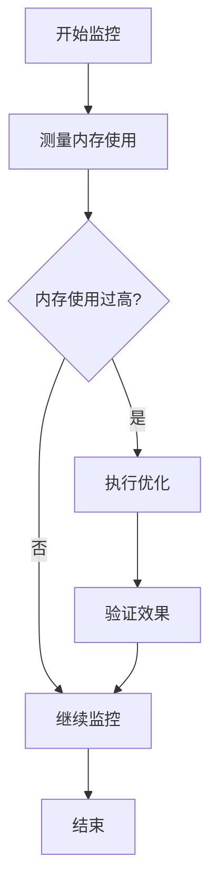
```mermaid
flowchart TD
Start[开始监控] --> Measure[测量内存使用]
Measure --> Check{内存使用过高?}
Check --> |是| Optimize[执行优化]
Check --> |否| Continue[继续监控]
Optimize --> Verify[验证效果]
Verify --> Continue
Continue --> End[结束]
```

#### 渲染性能分析

1. **帧率监控**: 使用浏览器性能工具监控FPS
2. **渲染时间**: 分析单次渲染耗时
3. **重绘次数**: 监控不必要的重绘操作

### 错误处理调试

#### 异常捕获机制

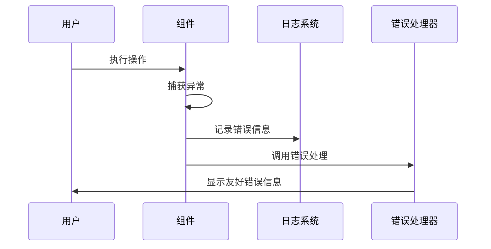
```mermaid
sequenceDiagram
participant User as 用户
participant Component as 组件
participant Logger as 日志系统
participant ErrorHandler as 错误处理器
User->>Component : 执行操作
Component->>Component : 捕获异常
Component->>Logger : 记录错误信息
Component->>ErrorHandler : 调用错误处理
ErrorHandler->>User : 显示友好错误信息
```

#### 调试工具推荐

1. **Vue DevTools**: Vue应用专用调试工具
2. **Browser DevTools**: 浏览器内置开发者工具
3. **Performance Monitor**: 系统性能监控工具
4. **Memory Profiler**: 内存分析工具

### 测试策略

#### 单元测试

```javascript
// 示例测试用例
describe('ViewerText component', () => {
  it('should handle empty content', () => {
    const wrapper = mount(ViewerText, {
      propsData: { content: '' }
    });
    expect(wrapper.vm.contentDisplay).toBe('');
  });
  
  it('should detect visible content', () => {
    const buffer = Buffer.from('test content');
    expect(util.bufVisible(buffer)).toBe(true);
  });
});
```

#### 集成测试

1. **格式检测测试**: 验证各种格式的自动识别
2. **边界条件测试**: 测试超大文件、空内容等情况
3. **性能测试**: 验证大文件处理性能

## 总结

文本查看器系统通过模块化设计实现了强大的文本处理能力：

### 核心优势

1. **智能检测**: 自动识别内容类型并选择合适的显示方式
2. **灵活配置**: 支持多种显示模式和个性化配置
3. **性能优化**: 针对大文件进行了专门的优化处理
4. **扩展性强**: 支持自定义格式化器扩展

### 技术特点

- **编码检测**: 基于bufVisible函数的智能编码识别
- **格式化**: FormatViewer提供统一的格式选择界面
- **协作机制**: 多组件间的协调工作确保功能完整性
- **用户体验**: 丰富的配置选项和友好的错误处理

### 发展方向

1. **性能提升**: 进一步优化大文件处理性能
2. **功能扩展**: 支持更多编码格式和数据类型
3. **用户体验**: 改进交互设计和视觉效果
4. **稳定性增强**: 完善错误处理和异常恢复机制

文本查看器作为Redis桌面管理器的重要组成部分，为用户提供了直观、高效的文本数据查看和编辑体验，其设计理念和实现方式值得在类似项目中借鉴和应用。